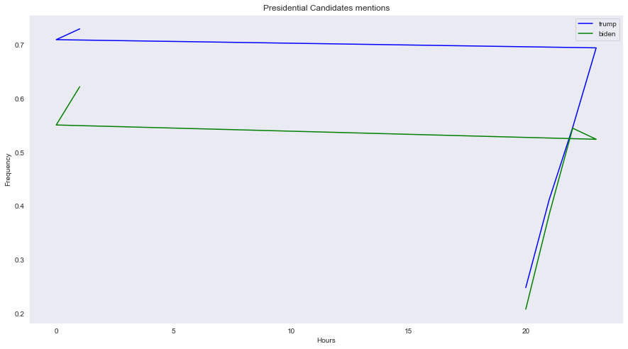
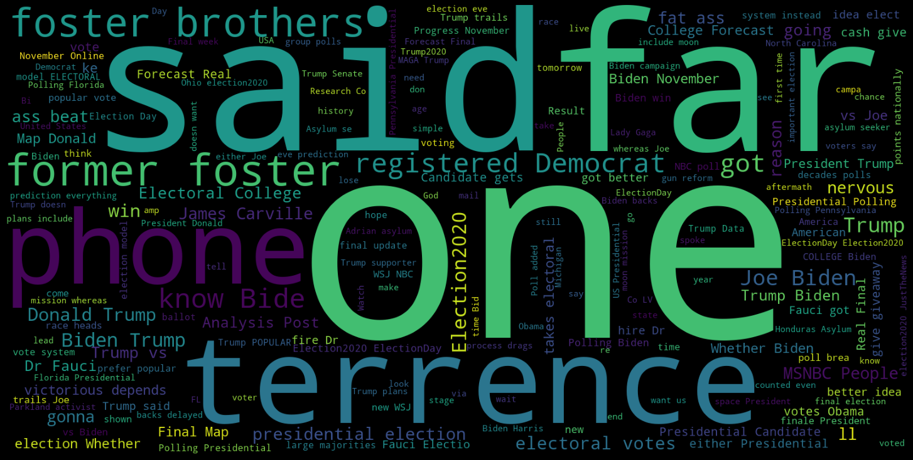
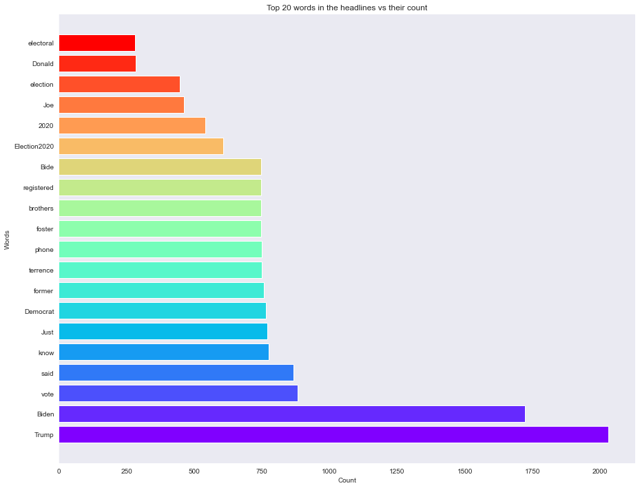
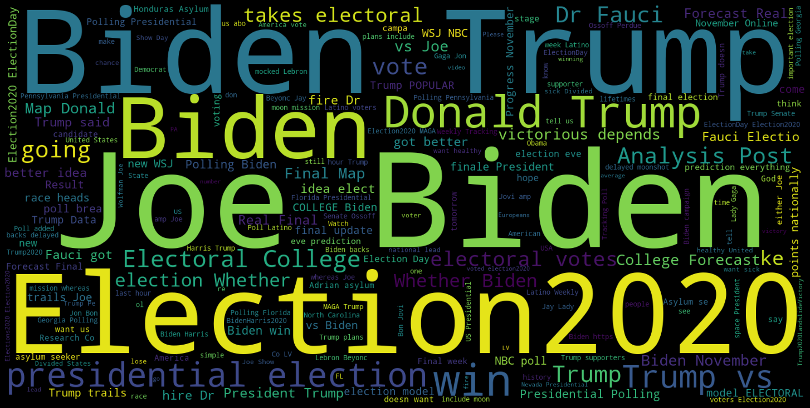
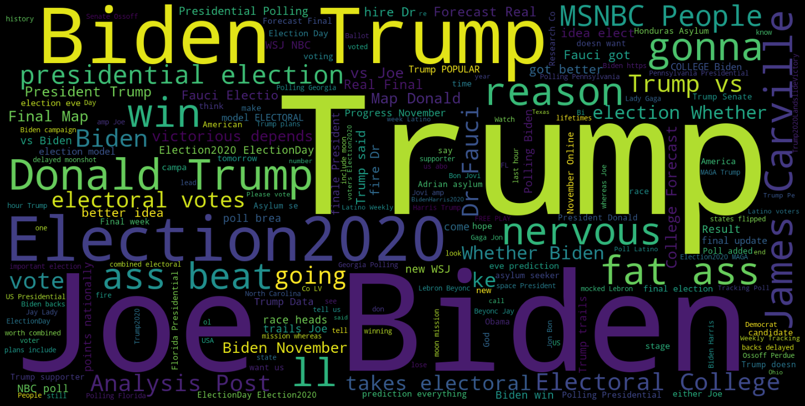
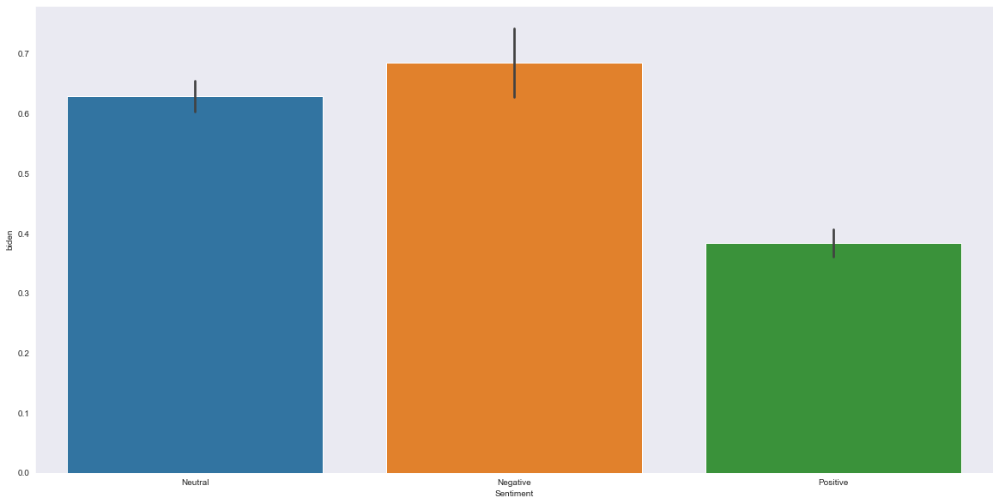
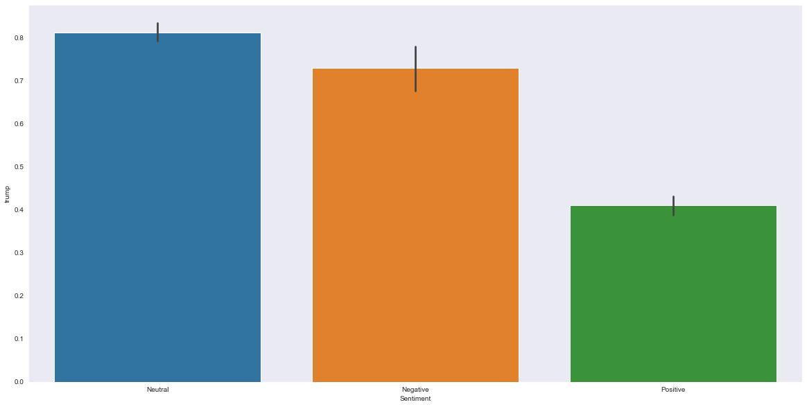

```python
import os
import sys
path = '/packages/Lib/site-packages'
sys.path.insert(0, os.getcwd() + path)
```


```python
from slistener import SListener
import json
import time
import tweepy
import sys
```


```python
import numpy as np
import pandas as pd
```


```python
pd.set_option('display.max_colwidth', None)
```


```python
consumer_key = 'tbFDqEaP7Am0bWqcqsVs9JyiV'
consumer_secret = 'GaRHsAhLXxaCg6Ms1HpMN1ZNOvNkitdfDKI66yEtGO7PbPoMhx'

access_token =  '86722005-nFCl0hQNYFTjdWPmpe7jh8MKraMaQbFtq8R1c1V6q'
access_token_secret = '9if08KJLrXrfxkLgFtFBZikA4bfvHfryMB5jJUMqPZttz'
```


```python
auth = tweepy.OAuthHandler(consumer_key, consumer_secret)
auth.set_access_token(access_token, access_token_secret)
api  = tweepy.API(auth)
```


```python
#for tweet in api.search(['#Election2020','trump','biden']):
#    print(tweet.text)
```


```python
df = pd.DataFrame(columns= ['Tweets','User','User_location','User_statuses_count','user_followers',
                            'user_verified','fav_count','rt_count','tweet_date'])
```


```python
def stream(data,file_name):
    i = 0 
    for tweet in tweepy.Cursor(api.search,q=data,count=100,lang='en').items():
        print(i,end='\r')
        df.loc[i,'Tweets'] = tweet.text
        df.loc[i,'User'] = tweet.user.name
        df.loc[i,'User_statuses_count'] = tweet.user.statuses_count 
        df.loc[i,'user_followers'] = tweet.user.followers_count
        df.loc[i,'user_verified'] = tweet.user.verified
        
        df.loc[i,'User_location'] = tweet.user.location
        df.loc[i,'fav_count'] = tweet.favorite_count
        df.loc[i,'rt_count'] = tweet.retweet_count
        df.loc[i,'tweet_date'] = tweet.created_at
        df.to_excel('{}.xlsx'.format(file_name))
        i+=1
        if i == 4000:
            break
        else:
            pass
        
```


```python
#stream(data=['#Election2020','trump','biden'],file_name='my_tweets1')
```


```python
df.shape
```


    (3535, 12)


```python
df.columns
```


    Index(['Tweets', 'User', 'User_location', 'User_statuses_count',
           'user_followers', 'user_verified', 'fav_count', 'rt_count',
           'tweet_date', 'clean_tweets', 'sentiment_scores', 'Sentiment'],
          dtype='object')


```python
df.head()
```


<div>
<style scoped>
    .dataframe tbody tr th:only-of-type {
        vertical-align: middle;
    }

    .dataframe tbody tr th {
        vertical-align: top;
    }

    .dataframe thead th {
        text-align: right;
    }
</style>
<table border="1" class="dataframe">
  <thead>
    <tr style="text-align: right;">
      <th></th>
      <th>Tweets</th>
      <th>User</th>
      <th>User_location</th>
      <th>User_statuses_count</th>
      <th>user_followers</th>
      <th>user_verified</th>
      <th>fav_count</th>
      <th>rt_count</th>
      <th>tweet_date</th>
      <th>clean_tweets</th>
      <th>sentiment_scores</th>
      <th>Sentiment</th>
    </tr>
  </thead>
  <tbody>
    <tr>
      <th>0</th>
      <td>The U.S. election is now just a day away.\n\n#Election2020 #9News\nhttps://t.co/zPG8gfk6t3</td>
      <td>9News Queensland</td>
      <td>Brisbane, Australia</td>
      <td>272205</td>
      <td>136289</td>
      <td>True</td>
      <td>0</td>
      <td>0</td>
      <td>2020-11-03 01:33:08</td>
      <td>The U S election is now just a day away Election2020 9News</td>
      <td>{'neg': 0.0, 'neu': 1.0, 'pos': 0.0, 'compound': 0.0}</td>
      <td>Positive</td>
    </tr>
    <tr>
      <th>1</th>
      <td>RT @AynRandPaulRyan: James Carville on Trump: “He’s gonna get his fat ass beat” 🔥\n\nAlso, on MSNBC: “People are nervous for no reason. We’ll…</td>
      <td>William Black</td>
      <td></td>
      <td>12853</td>
      <td>232</td>
      <td>False</td>
      <td>0</td>
      <td>260</td>
      <td>2020-11-03 01:33:06</td>
      <td>RT James Carville on Trump He s gonna get his fat ass beat Also on MSNBC People are nervous for no reason We ll</td>
      <td>{'neg': 0.281, 'neu': 0.719, 'pos': 0.0, 'compound': -0.7783}</td>
      <td>Positive</td>
    </tr>
    <tr>
      <th>2</th>
      <td>RT @EuropeElects: If Europeans could vote in US Presidential election:\n\nTrump–Biden (%)\n🇷🇺68–32\n🇵🇱50–50\n🇹🇷47–53\n🇭🇺41–59\n🇮🇹23–77 / 47–53\n🇬🇧1…</td>
      <td>Blair McDougall</td>
      <td>East Renfrewshire</td>
      <td>76819</td>
      <td>15106</td>
      <td>True</td>
      <td>0</td>
      <td>198</td>
      <td>2020-11-03 01:33:02</td>
      <td>RT If Europeans could vote in US Presidential election Trump Biden 68 32 50 50 47 53 41 59 23 77 47 53 1</td>
      <td>{'neg': 0.0, 'neu': 1.0, 'pos': 0.0, 'compound': 0.0}</td>
      <td>Positive</td>
    </tr>
    <tr>
      <th>3</th>
      <td>The U.S. election is now just a day away.\n\n#Election2020 #9News\nhttps://t.co/A7ojHfemH6</td>
      <td>9News Gold Coast</td>
      <td>Surfers Paradise, Gold Coast</td>
      <td>141043</td>
      <td>39002</td>
      <td>True</td>
      <td>0</td>
      <td>0</td>
      <td>2020-11-03 01:32:59</td>
      <td>The U S election is now just a day away Election2020 9News</td>
      <td>{'neg': 0.0, 'neu': 1.0, 'pos': 0.0, 'compound': 0.0}</td>
      <td>Positive</td>
    </tr>
    <tr>
      <th>4</th>
      <td>RT @HKrassenstein: It’s simple:\n\nIf you want a healthy United States of America, vote for Joe Biden.\n\nIf you want a sick Divided States of…</td>
      <td>Cheese 🌞⛈️</td>
      <td></td>
      <td>19097</td>
      <td>1094</td>
      <td>False</td>
      <td>0</td>
      <td>288</td>
      <td>2020-11-03 01:32:54</td>
      <td>RT It s simple If you want a healthy United States of America vote for Joe Biden If you want a sick Divided States of</td>
      <td>{'neg': 0.116, 'neu': 0.599, 'pos': 0.285, 'compound': 0.4215}</td>
      <td>Negative</td>
    </tr>
  </tbody>
</table>
</div>


```python
df1 = df.copy()
```


```python
tweet_data = df['Tweets']
```


```python
tweet_data
```


    0                                                                 The U.S. election is now just a day away.\n\n#Election2020 #9News\nhttps://t.co/zPG8gfk6t3
    1             RT @AynRandPaulRyan: James Carville on Trump: “He’s gonna get his fat ass beat” 🔥\n\nAlso, on MSNBC: “People are nervous for no reason. We’ll…
    2       RT @EuropeElects: If Europeans could vote in US Presidential election:\n\nTrump–Biden (%)\n🇷🇺68–32\n🇵🇱50–50\n🇹🇷47–53\n🇭🇺41–59\n🇮🇹23–77 / 47–53\n🇬🇧1…
    3                                                                 The U.S. election is now just a day away.\n\n#Election2020 #9News\nhttps://t.co/A7ojHfemH6
    4            RT @HKrassenstein: It’s simple:\n\nIf you want a healthy United States of America, vote for Joe Biden.\n\nIf you want a sick Divided States of…
                                                                                    ...                                                                         
    3530            RT @w_terrence: Just got off the phone with one of my former foster brothers and he’s a registered Democrat. He said "As far as I know Bide…
    3531            RT @w_terrence: Just got off the phone with one of my former foster brothers and he’s a registered Democrat. He said "As far as I know Bide…
    3532            RT @w_terrence: Just got off the phone with one of my former foster brothers and he’s a registered Democrat. He said "As far as I know Bide…
    3533            RT @w_terrence: Just got off the phone with one of my former foster brothers and he’s a registered Democrat. He said "As far as I know Bide…
    3534            RT @w_terrence: Just got off the phone with one of my former foster brothers and he’s a registered Democrat. He said "As far as I know Bide…
    Name: Tweets, Length: 3535, dtype: object


```python
df['Tweets'].head(1)
```


    0    The U.S. election is now just a day away.\n\n#Election2020 #9News\nhttps://t.co/zPG8gfk6t3
    Name: Tweets, dtype: object


```python
import re
#tweet_data = re.sub(r"http\S+", "", tweet_data)
#text = re.sub(r'^https?:\/\/.[\r\n]', '', text, flags=re.MULTILINE)
```


```python
#for i in tweet_data:
tweet_1 =  re.sub(r'http\S+', ' ', str(tweet_data),flags=re.MULTILINE)
```


```python
tweet_1
```


    '0                                                                 The U.S. election is now just a day away.\\n\\n#Election2020 #9News\\n \n1             RT @AynRandPaulRyan: James Carville on Trump: “He’s gonna get his fat ass beat” 🔥\\n\\nAlso, on MSNBC: “People are nervous for no reason. We’ll…\n2       RT @EuropeElects: If Europeans could vote in US Presidential election:\\n\\nTrump–Biden (%)\\n🇷🇺68–32\\n🇵🇱50–50\\n🇹🇷47–53\\n🇭🇺41–59\\n🇮🇹23–77 / 47–53\\n🇬🇧1…\n3                                                                 The U.S. election is now just a day away.\\n\\n#Election2020 #9News\\n \n4            RT @HKrassenstein: It’s simple:\\n\\nIf you want a healthy United States of America, vote for Joe Biden.\\n\\nIf you want a sick Divided States of…\n                                                                                ...                                                                         \n3530            RT @w_terrence: Just got off the phone with one of my former foster brothers and he’s a registered Democrat. He said "As far as I know Bide…\n3531            RT @w_terrence: Just got off the phone with one of my former foster brothers and he’s a registered Democrat. He said "As far as I know Bide…\n3532            RT @w_terrence: Just got off the phone with one of my former foster brothers and he’s a registered Democrat. He said "As far as I know Bide…\n3533            RT @w_terrence: Just got off the phone with one of my former foster brothers and he’s a registered Democrat. He said "As far as I know Bide…\n3534            RT @w_terrence: Just got off the phone with one of my former foster brothers and he’s a registered Democrat. He said "As far as I know Bide…\nName: Tweets, Length: 3535, dtype: object'


```python
tweet_data = pd.DataFrame(tweet_data)
```


```python
tweet_data
```


<div>
<style scoped>
    .dataframe tbody tr th:only-of-type {
        vertical-align: middle;
    }

    .dataframe tbody tr th {
        vertical-align: top;
    }

    .dataframe thead th {
        text-align: right;
    }
</style>
<table border="1" class="dataframe">
  <thead>
    <tr style="text-align: right;">
      <th></th>
      <th>Tweets</th>
    </tr>
  </thead>
  <tbody>
    <tr>
      <th>0</th>
      <td>The U.S. election is now just a day away.\n\n#Election2020 #9News\nhttps://t.co/zPG8gfk6t3</td>
    </tr>
    <tr>
      <th>1</th>
      <td>RT @AynRandPaulRyan: James Carville on Trump: “He’s gonna get his fat ass beat” 🔥\n\nAlso, on MSNBC: “People are nervous for no reason. We’ll…</td>
    </tr>
    <tr>
      <th>2</th>
      <td>RT @EuropeElects: If Europeans could vote in US Presidential election:\n\nTrump–Biden (%)\n🇷🇺68–32\n🇵🇱50–50\n🇹🇷47–53\n🇭🇺41–59\n🇮🇹23–77 / 47–53\n🇬🇧1…</td>
    </tr>
    <tr>
      <th>3</th>
      <td>The U.S. election is now just a day away.\n\n#Election2020 #9News\nhttps://t.co/A7ojHfemH6</td>
    </tr>
    <tr>
      <th>4</th>
      <td>RT @HKrassenstein: It’s simple:\n\nIf you want a healthy United States of America, vote for Joe Biden.\n\nIf you want a sick Divided States of…</td>
    </tr>
    <tr>
      <th>...</th>
      <td>...</td>
    </tr>
    <tr>
      <th>3530</th>
      <td>RT @w_terrence: Just got off the phone with one of my former foster brothers and he’s a registered Democrat. He said "As far as I know Bide…</td>
    </tr>
    <tr>
      <th>3531</th>
      <td>RT @w_terrence: Just got off the phone with one of my former foster brothers and he’s a registered Democrat. He said "As far as I know Bide…</td>
    </tr>
    <tr>
      <th>3532</th>
      <td>RT @w_terrence: Just got off the phone with one of my former foster brothers and he’s a registered Democrat. He said "As far as I know Bide…</td>
    </tr>
    <tr>
      <th>3533</th>
      <td>RT @w_terrence: Just got off the phone with one of my former foster brothers and he’s a registered Democrat. He said "As far as I know Bide…</td>
    </tr>
    <tr>
      <th>3534</th>
      <td>RT @w_terrence: Just got off the phone with one of my former foster brothers and he’s a registered Democrat. He said "As far as I know Bide…</td>
    </tr>
  </tbody>
</table>
<p>3535 rows × 1 columns</p>
</div>


```python
def clean_tweet(tweet): 
    return ' '.join(re.sub('(@[A-Za-z0-9]+)|([^0-9A-Za-z \t])|(\w+:\/\/\S+)', ' ', tweet).split())
```


```python
#tweet
```


```python
df['clean_tweets'] = df['Tweets'].apply(lambda x: clean_tweet(x))
```


```python
#df['clean_tweets']
```


```python
df.head(20)
```


<div>
<style scoped>
    .dataframe tbody tr th:only-of-type {
        vertical-align: middle;
    }

    .dataframe tbody tr th {
        vertical-align: top;
    }

    .dataframe thead th {
        text-align: right;
    }
</style>
<table border="1" class="dataframe">
  <thead>
    <tr style="text-align: right;">
      <th></th>
      <th>Tweets</th>
      <th>User</th>
      <th>User_location</th>
      <th>User_statuses_count</th>
      <th>user_followers</th>
      <th>user_verified</th>
      <th>fav_count</th>
      <th>rt_count</th>
      <th>tweet_date</th>
      <th>clean_tweets</th>
      <th>sentiment_scores</th>
      <th>Sentiment</th>
    </tr>
  </thead>
  <tbody>
    <tr>
      <th>0</th>
      <td>The U.S. election is now just a day away.\n\n#Election2020 #9News\nhttps://t.co/zPG8gfk6t3</td>
      <td>9News Queensland</td>
      <td>Brisbane, Australia</td>
      <td>272205</td>
      <td>136289</td>
      <td>True</td>
      <td>0</td>
      <td>0</td>
      <td>2020-11-03 01:33:08</td>
      <td>The U S election is now just a day away Election2020 9News</td>
      <td>{'neg': 0.0, 'neu': 1.0, 'pos': 0.0, 'compound': 0.0}</td>
      <td>Positive</td>
    </tr>
    <tr>
      <th>1</th>
      <td>RT @AynRandPaulRyan: James Carville on Trump: “He’s gonna get his fat ass beat” 🔥\n\nAlso, on MSNBC: “People are nervous for no reason. We’ll…</td>
      <td>William Black</td>
      <td></td>
      <td>12853</td>
      <td>232</td>
      <td>False</td>
      <td>0</td>
      <td>260</td>
      <td>2020-11-03 01:33:06</td>
      <td>RT James Carville on Trump He s gonna get his fat ass beat Also on MSNBC People are nervous for no reason We ll</td>
      <td>{'neg': 0.281, 'neu': 0.719, 'pos': 0.0, 'compound': -0.7783}</td>
      <td>Positive</td>
    </tr>
    <tr>
      <th>2</th>
      <td>RT @EuropeElects: If Europeans could vote in US Presidential election:\n\nTrump–Biden (%)\n🇷🇺68–32\n🇵🇱50–50\n🇹🇷47–53\n🇭🇺41–59\n🇮🇹23–77 / 47–53\n🇬🇧1…</td>
      <td>Blair McDougall</td>
      <td>East Renfrewshire</td>
      <td>76819</td>
      <td>15106</td>
      <td>True</td>
      <td>0</td>
      <td>198</td>
      <td>2020-11-03 01:33:02</td>
      <td>RT If Europeans could vote in US Presidential election Trump Biden 68 32 50 50 47 53 41 59 23 77 47 53 1</td>
      <td>{'neg': 0.0, 'neu': 1.0, 'pos': 0.0, 'compound': 0.0}</td>
      <td>Positive</td>
    </tr>
    <tr>
      <th>3</th>
      <td>The U.S. election is now just a day away.\n\n#Election2020 #9News\nhttps://t.co/A7ojHfemH6</td>
      <td>9News Gold Coast</td>
      <td>Surfers Paradise, Gold Coast</td>
      <td>141043</td>
      <td>39002</td>
      <td>True</td>
      <td>0</td>
      <td>0</td>
      <td>2020-11-03 01:32:59</td>
      <td>The U S election is now just a day away Election2020 9News</td>
      <td>{'neg': 0.0, 'neu': 1.0, 'pos': 0.0, 'compound': 0.0}</td>
      <td>Positive</td>
    </tr>
    <tr>
      <th>4</th>
      <td>RT @HKrassenstein: It’s simple:\n\nIf you want a healthy United States of America, vote for Joe Biden.\n\nIf you want a sick Divided States of…</td>
      <td>Cheese 🌞⛈️</td>
      <td></td>
      <td>19097</td>
      <td>1094</td>
      <td>False</td>
      <td>0</td>
      <td>288</td>
      <td>2020-11-03 01:32:54</td>
      <td>RT It s simple If you want a healthy United States of America vote for Joe Biden If you want a sick Divided States of</td>
      <td>{'neg': 0.116, 'neu': 0.599, 'pos': 0.285, 'compound': 0.4215}</td>
      <td>Negative</td>
    </tr>
    <tr>
      <th>5</th>
      <td>RT @AynRandPaulRyan: James Carville on Trump: “He’s gonna get his fat ass beat” 🔥\n\nAlso, on MSNBC: “People are nervous for no reason. We’ll…</td>
      <td>STAN BTS</td>
      <td>Twitter World</td>
      <td>2673</td>
      <td>72</td>
      <td>False</td>
      <td>0</td>
      <td>260</td>
      <td>2020-11-03 01:32:54</td>
      <td>RT James Carville on Trump He s gonna get his fat ass beat Also on MSNBC People are nervous for no reason We ll</td>
      <td>{'neg': 0.281, 'neu': 0.719, 'pos': 0.0, 'compound': -0.7783}</td>
      <td>Positive</td>
    </tr>
    <tr>
      <th>6</th>
      <td>RT @thenewsoncnbc: The credibility of the U.S. is “absolutely” on the line with #Election2020, presidential historian @BeschlossDC says. He…</td>
      <td>Susan Cox</td>
      <td>Cambridge, MA</td>
      <td>44907</td>
      <td>437</td>
      <td>False</td>
      <td>0</td>
      <td>8</td>
      <td>2020-11-03 01:32:53</td>
      <td>RT The credibility of the U S is absolutely on the line with Election2020 presidential historian says He</td>
      <td>{'neg': 0.0, 'neu': 1.0, 'pos': 0.0, 'compound': 0.0}</td>
      <td>Positive</td>
    </tr>
    <tr>
      <th>7</th>
      <td>RT @w_terrence: Just got off the phone with one of my former foster brothers and he’s a registered Democrat. He said "As far as I know Bide…</td>
      <td>Mark Albrecht</td>
      <td></td>
      <td>34717</td>
      <td>137</td>
      <td>False</td>
      <td>0</td>
      <td>2176</td>
      <td>2020-11-03 01:32:51</td>
      <td>RT terrence Just got off the phone with one of my former foster brothers and he s a registered Democrat He said As far as I know Bide</td>
      <td>{'neg': 0.0, 'neu': 1.0, 'pos': 0.0, 'compound': 0.0}</td>
      <td>Positive</td>
    </tr>
    <tr>
      <th>8</th>
      <td>RT @w_terrence: Just got off the phone with one of my former foster brothers and he’s a registered Democrat. He said "As far as I know Bide…</td>
      <td>Sandra Odom</td>
      <td></td>
      <td>1737</td>
      <td>178</td>
      <td>False</td>
      <td>0</td>
      <td>2176</td>
      <td>2020-11-03 01:32:49</td>
      <td>RT terrence Just got off the phone with one of my former foster brothers and he s a registered Democrat He said As far as I know Bide</td>
      <td>{'neg': 0.0, 'neu': 1.0, 'pos': 0.0, 'compound': 0.0}</td>
      <td>Positive</td>
    </tr>
    <tr>
      <th>9</th>
      <td>RT @PeteKent01: If #Trump breaking through the #BlueWall was the story in '16, his breaking through the Black/Brown Wall looms as the story…</td>
      <td>CindyProAmerica</td>
      <td></td>
      <td>97023</td>
      <td>25825</td>
      <td>False</td>
      <td>0</td>
      <td>4</td>
      <td>2020-11-03 01:32:47</td>
      <td>RT If Trump breaking through the BlueWall was the story in 16 his breaking through the Black Brown Wall looms as the story</td>
      <td>{'neg': 0.068, 'neu': 0.932, 'pos': 0.0, 'compound': -0.1531}</td>
      <td>Negative</td>
    </tr>
    <tr>
      <th>10</th>
      <td>Trump still not here. They're playing audio from attack against Biden. #Election2020</td>
      <td>Uday Rana</td>
      <td>New Delhi, India</td>
      <td>27387</td>
      <td>6561</td>
      <td>False</td>
      <td>0</td>
      <td>0</td>
      <td>2020-11-03 01:32:40</td>
      <td>Trump still not here They re playing audio from attack against Biden Election2020</td>
      <td>{'neg': 0.195, 'neu': 0.692, 'pos': 0.113, 'compound': -0.3182}</td>
      <td>Positive</td>
    </tr>
    <tr>
      <th>11</th>
      <td>RT @business: Biden: "Trump said he was going to fire Dr. Fauci... I got a better idea: elect me and I'm going to hire Dr. Fauci." #Electio…</td>
      <td>Jack Toy</td>
      <td></td>
      <td>27807</td>
      <td>267</td>
      <td>False</td>
      <td>0</td>
      <td>105</td>
      <td>2020-11-03 01:32:35</td>
      <td>RT Biden Trump said he was going to fire Dr Fauci I got a better idea elect me and I m going to hire Dr Fauci Electio</td>
      <td>{'neg': 0.091, 'neu': 0.798, 'pos': 0.11, 'compound': 0.128}</td>
      <td>Positive</td>
    </tr>
    <tr>
      <th>12</th>
      <td>RT @julito77: Final week of 9-week @NALEO 2020 Latino Weekly Tracking Poll (3,700 Latino voters). #Election2020 \n\nBiden-Harris 69%\nTrump-Pe…</td>
      <td>Dave McW 🔵</td>
      <td>Seattle Area, WA</td>
      <td>187555</td>
      <td>2662</td>
      <td>False</td>
      <td>0</td>
      <td>14</td>
      <td>2020-11-03 01:32:35</td>
      <td>RT Final week of 9 week 2020 Latino Weekly Tracking Poll 3 700 Latino voters Election2020 Biden Harris 69 Trump Pe</td>
      <td>{'neg': 0.0, 'neu': 1.0, 'pos': 0.0, 'compound': 0.0}</td>
      <td>Positive</td>
    </tr>
    <tr>
      <th>13</th>
      <td>RT @w_terrence: Just got off the phone with one of my former foster brothers and he’s a registered Democrat. He said "As far as I know Bide…</td>
      <td>Jones143</td>
      <td>New York</td>
      <td>94710</td>
      <td>1084</td>
      <td>False</td>
      <td>0</td>
      <td>2172</td>
      <td>2020-11-03 01:32:33</td>
      <td>RT terrence Just got off the phone with one of my former foster brothers and he s a registered Democrat He said As far as I know Bide</td>
      <td>{'neg': 0.0, 'neu': 1.0, 'pos': 0.0, 'compound': 0.0}</td>
      <td>Positive</td>
    </tr>
    <tr>
      <th>14</th>
      <td>RT @StatesPoll: Florida: Trump vs Biden\nEmerson, 10/29-10/30. 849 LV\nMy Analysis Post: https://t.co/Zcfv5CH3Q4\n#Florida2020 #FL2020 #Electi…</td>
      <td>Patriot🇨🇺🇺🇸</td>
      <td></td>
      <td>9486</td>
      <td>93</td>
      <td>False</td>
      <td>0</td>
      <td>7</td>
      <td>2020-11-03 01:32:20</td>
      <td>RT Florida Trump vs Biden Emerson 10 29 10 30 849 LV My Analysis Post Florida2020 FL2020 Electi</td>
      <td>{'neg': 0.0, 'neu': 1.0, 'pos': 0.0, 'compound': 0.0}</td>
      <td>Positive</td>
    </tr>
    <tr>
      <th>15</th>
      <td>RT @StatesPoll: 2020 Electoral College Forecast Real Final Map \nDonald Trump vs Joe Biden\nNovember 2. 2020\nMy Analysis Post: https://t.co/w…</td>
      <td>🟥Edey</td>
      <td>London</td>
      <td>46344</td>
      <td>1747</td>
      <td>False</td>
      <td>0</td>
      <td>154</td>
      <td>2020-11-03 01:32:18</td>
      <td>RT 2020 Electoral College Forecast Real Final Map Donald Trump vs Joe Biden November 2 2020 My Analysis Post</td>
      <td>{'neg': 0.0, 'neu': 1.0, 'pos': 0.0, 'compound': 0.0}</td>
      <td>Positive</td>
    </tr>
    <tr>
      <th>16</th>
      <td>RT @StatesPoll: Florida: Trump vs Biden\nSt. Pete Polls, 10/29-10/30. 2,758 LV\nMy Analysis Post: https://t.co/Pk3eLIFcQh\n#Florida2020 #FL202…</td>
      <td>Patriot🇨🇺🇺🇸</td>
      <td></td>
      <td>9486</td>
      <td>93</td>
      <td>False</td>
      <td>0</td>
      <td>5</td>
      <td>2020-11-03 01:32:18</td>
      <td>RT Florida Trump vs Biden St Pete Polls 10 29 10 30 2 758 LV My Analysis Post Florida2020 FL202</td>
      <td>{'neg': 0.0, 'neu': 1.0, 'pos': 0.0, 'compound': 0.0}</td>
      <td>Positive</td>
    </tr>
    <tr>
      <th>17</th>
      <td>#America voting rally's everywhere heres the #TRUMP campaign in #kenosha live stream to event hit link… https://t.co/JH499Y8Aw0</td>
      <td>#Innzopinion</td>
      <td>Australia</td>
      <td>989</td>
      <td>57</td>
      <td>False</td>
      <td>0</td>
      <td>0</td>
      <td>2020-11-03 01:32:17</td>
      <td>America voting rally s everywhere heres the TRUMP campaign in kenosha live stream to event hit link</td>
      <td>{'neg': 0.0, 'neu': 1.0, 'pos': 0.0, 'compound': 0.0}</td>
      <td>Positive</td>
    </tr>
    <tr>
      <th>18</th>
      <td>RT @StatesPoll: Florida: Trump vs Biden\nABC/Washington Post, 10/24-10/29. 824 LV.\nMy Analysis Post: https://t.co/hFPpJo6b5H \n#Florida2020 #…</td>
      <td>Patriot🇨🇺🇺🇸</td>
      <td></td>
      <td>9486</td>
      <td>93</td>
      <td>False</td>
      <td>0</td>
      <td>7</td>
      <td>2020-11-03 01:32:14</td>
      <td>RT Florida Trump vs Biden ABC Washington Post 10 24 10 29 824 LV My Analysis Post Florida2020</td>
      <td>{'neg': 0.0, 'neu': 1.0, 'pos': 0.0, 'compound': 0.0}</td>
      <td>Positive</td>
    </tr>
    <tr>
      <th>19</th>
      <td>RT @StatesPoll: Florida: Trump vs Biden\nIpsos, 10/21-10/27. 704 LV\nMy Analysis Post: https://t.co/e97K1I3ofT\n#Florida2020 #FL2020 #Election…</td>
      <td>Patriot🇨🇺🇺🇸</td>
      <td></td>
      <td>9486</td>
      <td>93</td>
      <td>False</td>
      <td>0</td>
      <td>6</td>
      <td>2020-11-03 01:32:10</td>
      <td>RT Florida Trump vs Biden Ipsos 10 21 10 27 704 LV My Analysis Post Florida2020 FL2020 Election</td>
      <td>{'neg': 0.0, 'neu': 1.0, 'pos': 0.0, 'compound': 0.0}</td>
      <td>Positive</td>
    </tr>
  </tbody>
</table>
</div>


```python
df['tweet_date'] = pd.to_datetime(df['tweet_date'])
print(df['tweet_date'])
```

    0      2020-11-03 01:33:08
    1      2020-11-03 01:33:06
    2      2020-11-03 01:33:02
    3      2020-11-03 01:32:59
    4      2020-11-03 01:32:54
                   ...        
    3530   2020-11-02 20:54:16
    3531   2020-11-02 20:54:11
    3532   2020-11-02 20:54:10
    3533   2020-11-02 20:54:07
    3534   2020-11-02 20:54:05
    Name: tweet_date, Length: 3535, dtype: datetime64[ns]
    


```python
df_indexed = df.copy()
```


```python
df_indexed = df_indexed.set_index('tweet_date')
```


```python
#from flatten_tweets import flatten_tweets, check_word_in_tweet
```


```python
def check_word_in_tweet(word, data):
    """Checks if a word is in a Twitter dataset's text. 
    Checks text and extended tweet (140+ character tweets) for tweets,
    retweets and quoted tweets.
    Returns a logical pandas Series.
    """
    contains_column = data['clean_tweets'].str.contains(word, case = False)
    return contains_column
```


```python
df_indexed['biden'] = check_word_in_tweet('biden', df_indexed)
print(df_indexed['biden'])
```

    tweet_date
    2020-11-03 01:33:08    False
    2020-11-03 01:33:06    False
    2020-11-03 01:33:02     True
    2020-11-03 01:32:59    False
    2020-11-03 01:32:54     True
                           ...  
    2020-11-02 20:54:16    False
    2020-11-02 20:54:11    False
    2020-11-02 20:54:10    False
    2020-11-02 20:54:07    False
    2020-11-02 20:54:05    False
    Name: biden, Length: 3535, dtype: bool
    


```python
print(np.sum(df_indexed['biden']))
```

    1760
    


```python
df_indexed['trump'] = check_word_in_tweet('trump', df_indexed)
print(df_indexed['trump'])
```

    tweet_date
    2020-11-03 01:33:08    False
    2020-11-03 01:33:06     True
    2020-11-03 01:33:02     True
    2020-11-03 01:32:59    False
    2020-11-03 01:32:54    False
                           ...  
    2020-11-02 20:54:16    False
    2020-11-02 20:54:11    False
    2020-11-02 20:54:10    False
    2020-11-02 20:54:07    False
    2020-11-02 20:54:05    False
    Name: trump, Length: 3535, dtype: bool
    


```python
print(np.sum(df_indexed['trump']))
```

    2070
    


```python
mean_biden = df_indexed['biden'].resample('1 H').mean()
print(mean_biden)
```

    tweet_date
    2020-11-02 20:00:00    0.208054
    2020-11-02 21:00:00    0.384615
    2020-11-02 22:00:00    0.544952
    2020-11-02 23:00:00    0.524297
    2020-11-03 00:00:00    0.550898
    2020-11-03 01:00:00    0.622047
    Freq: H, Name: biden, dtype: float64
    


```python
mean_trump = df_indexed['trump'].resample('1 H').mean()
print(mean_trump)
```

    tweet_date
    2020-11-02 20:00:00    0.248322
    2020-11-02 21:00:00    0.412260
    2020-11-02 22:00:00    0.546335
    2020-11-02 23:00:00    0.694373
    2020-11-03 00:00:00    0.709581
    2020-11-03 01:00:00    0.729659
    Freq: H, Name: trump, dtype: float64
    


```python
import matplotlib.pyplot as plt
plt.figure(figsize=(15,8))
plt.plot(mean_trump.index.hour,mean_trump, color = 'blue')
plt.plot(mean_biden.index.hour,mean_biden, color = 'green')
plt.xlabel('Hours')
plt.ylabel('Frequency')
plt.title('Presidential Candidates mentions')
plt.legend(('trump', 'biden'))
plt.show()
```





```python
import warnings
warnings.filterwarnings('ignore')
```


```python
import nltk
#nltk.download('vader_lexicon')
```


```python
from nltk.sentiment.vader import SentimentIntensityAnalyzer
sid = SentimentIntensityAnalyzer()

```


```python
df['sentiment_scores'] = df['clean_tweets'].apply(sid.polarity_scores)
```


```python
pos = df['clean_tweets'].apply(sid.polarity_scores)
```


```python

for message in df['clean_tweets']:
    scores = sid.polarity_scores(message)

    for key in sorted(scores):
        print('{0}: {1} '.format(key, scores[key]), end='')

    if scores["compound"] >= 0.05:
        print("\npositive\n")

    elif scores["compound"] <= -0.05:
        print("\nnegative\n")
    else:
        print("\nneutral\n")
```

    compound: 0.0 neg: 0.0 neu: 1.0 pos: 0.0 
    neutral
    
    compound: -0.7783 neg: 0.281 neu: 0.719 pos: 0.0 
    negative
    
    compound: 0.0 neg: 0.0 neu: 1.0 pos: 0.0 
    neutral
    
    compound: 0.0 neg: 0.0 neu: 1.0 pos: 0.0 
    neutral
    
    compound: 0.4215 neg: 0.116 neu: 0.599 pos: 0.285 
    positive
    
    compound: -0.7783 neg: 0.281 neu: 0.719 pos: 0.0 
    negative
    
    compound: 0.0 neg: 0.0 neu: 1.0 pos: 0.0 
    neutral
    
    compound: 0.0 neg: 0.0 neu: 1.0 pos: 0.0 
    neutral
    
    compound: 0.0 neg: 0.0 neu: 1.0 pos: 0.0 
    neutral
    
    compound: -0.1531 neg: 0.068 neu: 0.932 pos: 0.0 
    negative
    
    compound: -0.3182 neg: 0.195 neu: 0.692 pos: 0.113 
    negative
    
    compound: 0.128 neg: 0.091 neu: 0.798 pos: 0.11 
    positive
    
    compound: 0.0 neg: 0.0 neu: 1.0 pos: 0.0 
    neutral
    
    compound: 0.0 neg: 0.0 neu: 1.0 pos: 0.0 
    neutral
    
    compound: 0.0 neg: 0.0 neu: 1.0 pos: 0.0 
    neutral
    
    compound: 0.0 neg: 0.0 neu: 1.0 pos: 0.0 
    neutral
    
    compound: 0.0 neg: 0.0 neu: 1.0 pos: 0.0 
    neutral
    
    compound: 0.0 neg: 0.0 neu: 1.0 pos: 0.0 
    neutral
    
    compound: 0.0 neg: 0.0 neu: 1.0 pos: 0.0 
    neutral
    
    compound: 0.0 neg: 0.0 neu: 1.0 pos: 0.0 
    neutral
    
    compound: 0.0 neg: 0.0 neu: 1.0 pos: 0.0 
    neutral
    
    compound: 0.8402 neg: 0.0 neu: 0.643 pos: 0.357 
    positive
    
    compound: 0.6486 neg: 0.0 neu: 0.674 pos: 0.326 
    positive
    
    compound: 0.0 neg: 0.0 neu: 1.0 pos: 0.0 
    neutral
    
    compound: 0.0 neg: 0.0 neu: 1.0 pos: 0.0 
    neutral
    
    compound: -0.3182 neg: 0.119 neu: 0.881 pos: 0.0 
    negative
    
    compound: 0.0 neg: 0.0 neu: 1.0 pos: 0.0 
    neutral
    
    compound: 0.765 neg: 0.138 neu: 0.47 pos: 0.393 
    positive
    
    compound: 0.5859 neg: 0.0 neu: 0.84 pos: 0.16 
    positive
    
    compound: 0.0 neg: 0.0 neu: 1.0 pos: 0.0 
    neutral
    
    compound: 0.0 neg: 0.0 neu: 1.0 pos: 0.0 
    neutral
    
    compound: -0.1531 neg: 0.078 neu: 0.922 pos: 0.0 
    negative
    
    compound: 0.0 neg: 0.0 neu: 1.0 pos: 0.0 
    neutral
    
    compound: 0.0 neg: 0.0 neu: 1.0 pos: 0.0 
    neutral
    
    compound: 0.0 neg: 0.0 neu: 1.0 pos: 0.0 
    neutral
    
    compound: -0.7783 neg: 0.281 neu: 0.719 pos: 0.0 
    negative
    
    compound: 0.0 neg: 0.0 neu: 1.0 pos: 0.0 
    neutral
    
    compound: 0.0 neg: 0.0 neu: 1.0 pos: 0.0 
    neutral
    
    compound: 0.0 neg: 0.0 neu: 1.0 pos: 0.0 
    neutral
    
    compound: -0.7783 neg: 0.281 neu: 0.719 pos: 0.0 
    negative
    
    compound: -0.7783 neg: 0.281 neu: 0.719 pos: 0.0 
    negative
    
    compound: 0.0 neg: 0.0 neu: 1.0 pos: 0.0 
    neutral
    
    compound: 0.4215 neg: 0.0 neu: 0.833 pos: 0.167 
    positive
    
    compound: -0.177 neg: 0.099 neu: 0.833 pos: 0.067 
    negative
    
    compound: 0.0 neg: 0.0 neu: 1.0 pos: 0.0 
    neutral
    
    compound: 0.5859 neg: 0.0 neu: 0.84 pos: 0.16 
    positive
    
    compound: 0.0 neg: 0.0 neu: 1.0 pos: 0.0 
    neutral
    
    compound: 0.0 neg: 0.0 neu: 1.0 pos: 0.0 
    neutral
    
    compound: -0.7783 neg: 0.281 neu: 0.719 pos: 0.0 
    negative
    
    compound: 0.0 neg: 0.0 neu: 1.0 pos: 0.0 
    neutral
    
    compound: 0.0 neg: 0.0 neu: 1.0 pos: 0.0 
    neutral
    
    compound: 0.0 neg: 0.0 neu: 1.0 pos: 0.0 
    neutral
    
    compound: 0.0 neg: 0.0 neu: 1.0 pos: 0.0 
    neutral
    
    compound: 0.0 neg: 0.0 neu: 1.0 pos: 0.0 
    neutral
    
    compound: -0.3612 neg: 0.185 neu: 0.815 pos: 0.0 
    negative
    
    compound: -0.2838 neg: 0.118 neu: 0.882 pos: 0.0 
    negative
    
    compound: 0.0 neg: 0.0 neu: 1.0 pos: 0.0 
    neutral
    
    compound: 0.0 neg: 0.0 neu: 1.0 pos: 0.0 
    neutral
    
    compound: 0.0 neg: 0.0 neu: 1.0 pos: 0.0 
    neutral
    
    compound: 0.0 neg: 0.0 neu: 1.0 pos: 0.0 
    neutral
    
    compound: 0.8402 neg: 0.0 neu: 0.679 pos: 0.321 
    positive
    
    compound: 0.0 neg: 0.0 neu: 1.0 pos: 0.0 
    neutral
    
    compound: 0.3612 neg: 0.0 neu: 0.848 pos: 0.152 
    positive
    
    compound: -0.4939 neg: 0.311 neu: 0.556 pos: 0.133 
    negative
    
    compound: 0.9044 neg: 0.088 neu: 0.39 pos: 0.521 
    positive
    
    compound: 0.0 neg: 0.0 neu: 1.0 pos: 0.0 
    neutral
    
    compound: -0.3182 neg: 0.119 neu: 0.881 pos: 0.0 
    negative
    
    compound: 0.0 neg: 0.0 neu: 1.0 pos: 0.0 
    neutral
    
    compound: 0.0 neg: 0.0 neu: 1.0 pos: 0.0 
    neutral
    
    compound: 0.4404 neg: 0.0 neu: 0.756 pos: 0.244 
    positive
    
    compound: -0.7783 neg: 0.281 neu: 0.719 pos: 0.0 
    negative
    
    compound: 0.0 neg: 0.0 neu: 1.0 pos: 0.0 
    neutral
    
    compound: 0.4915 neg: 0.0 neu: 0.802 pos: 0.198 
    positive
    
    compound: 0.0 neg: 0.0 neu: 1.0 pos: 0.0 
    neutral
    
    compound: -0.6124 neg: 0.167 neu: 0.833 pos: 0.0 
    negative
    
    compound: -0.7783 neg: 0.281 neu: 0.719 pos: 0.0 
    negative
    
    compound: -0.7783 neg: 0.281 neu: 0.719 pos: 0.0 
    negative
    
    compound: 0.0 neg: 0.0 neu: 1.0 pos: 0.0 
    neutral
    
    compound: -0.3818 neg: 0.133 neu: 0.867 pos: 0.0 
    negative
    
    compound: 0.0 neg: 0.0 neu: 1.0 pos: 0.0 
    neutral
    
    compound: 0.0 neg: 0.0 neu: 1.0 pos: 0.0 
    neutral
    
    compound: 0.0 neg: 0.0 neu: 1.0 pos: 0.0 
    neutral
    
    compound: 0.0 neg: 0.0 neu: 1.0 pos: 0.0 
    neutral
    
    compound: -0.2732 neg: 0.271 neu: 0.462 pos: 0.267 
    negative
    
    compound: 0.0 neg: 0.0 neu: 1.0 pos: 0.0 
    neutral
    
    compound: 0.5859 neg: 0.0 neu: 0.678 pos: 0.322 
    positive
    
    compound: 0.5473 neg: 0.0 neu: 0.836 pos: 0.164 
    positive
    
    compound: 0.0 neg: 0.0 neu: 1.0 pos: 0.0 
    neutral
    
    compound: 0.0 neg: 0.0 neu: 1.0 pos: 0.0 
    neutral
    
    compound: 0.5859 neg: 0.0 neu: 0.84 pos: 0.16 
    positive
    
    compound: -0.1531 neg: 0.138 neu: 0.748 pos: 0.114 
    negative
    
    compound: 0.5859 neg: 0.0 neu: 0.798 pos: 0.202 
    positive
    
    compound: -0.3182 neg: 0.133 neu: 0.867 pos: 0.0 
    negative
    
    compound: -0.7783 neg: 0.281 neu: 0.719 pos: 0.0 
    negative
    
    compound: 0.0 neg: 0.0 neu: 1.0 pos: 0.0 
    neutral
    
    compound: 0.0 neg: 0.0 neu: 1.0 pos: 0.0 
    neutral
    
    compound: 0.0 neg: 0.0 neu: 1.0 pos: 0.0 
    neutral
    
    compound: 0.6739 neg: 0.0 neu: 0.768 pos: 0.232 
    positive
    
    compound: -0.7783 neg: 0.281 neu: 0.719 pos: 0.0 
    negative
    
    compound: -0.6124 neg: 0.174 neu: 0.826 pos: 0.0 
    negative
    
    compound: 0.3818 neg: 0.0 neu: 0.902 pos: 0.098 
    positive
    
    compound: 0.0 neg: 0.0 neu: 1.0 pos: 0.0 
    neutral
    
    compound: 0.0 neg: 0.0 neu: 1.0 pos: 0.0 
    neutral
    
    compound: 0.0 neg: 0.0 neu: 1.0 pos: 0.0 
    neutral
    
    compound: 0.2716 neg: 0.0 neu: 0.901 pos: 0.099 
    positive
    
    compound: 0.6486 neg: 0.0 neu: 0.636 pos: 0.364 
    positive
    
    compound: 0.5473 neg: 0.0 neu: 0.836 pos: 0.164 
    positive
    
    compound: 0.0 neg: 0.0 neu: 1.0 pos: 0.0 
    neutral
    
    compound: 0.0 neg: 0.0 neu: 1.0 pos: 0.0 
    neutral
    
    compound: -0.7783 neg: 0.281 neu: 0.719 pos: 0.0 
    negative
    
    compound: 0.4404 neg: 0.0 neu: 0.861 pos: 0.139 
    positive
    
    compound: 0.0 neg: 0.0 neu: 1.0 pos: 0.0 
    neutral
    
    compound: 0.5499 neg: 0.0 neu: 0.798 pos: 0.202 
    positive
    
    compound: 0.0 neg: 0.0 neu: 1.0 pos: 0.0 
    neutral
    
    compound: 0.0 neg: 0.0 neu: 1.0 pos: 0.0 
    neutral
    
    compound: 0.128 neg: 0.091 neu: 0.798 pos: 0.11 
    positive
    
    compound: 0.0 neg: 0.0 neu: 1.0 pos: 0.0 
    neutral
    
    compound: -0.2838 neg: 0.118 neu: 0.882 pos: 0.0 
    negative
    
    compound: 0.0 neg: 0.0 neu: 1.0 pos: 0.0 
    neutral
    
    compound: 0.0 neg: 0.0 neu: 1.0 pos: 0.0 
    neutral
    
    compound: 0.5859 neg: 0.0 neu: 0.84 pos: 0.16 
    positive
    
    compound: 0.0 neg: 0.0 neu: 1.0 pos: 0.0 
    neutral
    
    compound: 0.0 neg: 0.0 neu: 1.0 pos: 0.0 
    neutral
    
    compound: 0.0 neg: 0.0 neu: 1.0 pos: 0.0 
    neutral
    
    compound: 0.0 neg: 0.0 neu: 1.0 pos: 0.0 
    neutral
    
    compound: 0.0 neg: 0.0 neu: 1.0 pos: 0.0 
    neutral
    
    compound: 0.0 neg: 0.0 neu: 1.0 pos: 0.0 
    neutral
    
    compound: 0.0 neg: 0.0 neu: 1.0 pos: 0.0 
    neutral
    
    compound: -0.7783 neg: 0.281 neu: 0.719 pos: 0.0 
    negative
    
    compound: 0.0 neg: 0.0 neu: 1.0 pos: 0.0 
    neutral
    
    compound: 0.4215 neg: 0.0 neu: 0.872 pos: 0.128 
    positive
    
    compound: 0.0 neg: 0.0 neu: 1.0 pos: 0.0 
    neutral
    
    compound: 0.0 neg: 0.0 neu: 1.0 pos: 0.0 
    neutral
    
    compound: 0.0 neg: 0.0 neu: 1.0 pos: 0.0 
    neutral
    
    compound: 0.8402 neg: 0.0 neu: 0.643 pos: 0.357 
    positive
    
    compound: 0.0 neg: 0.0 neu: 1.0 pos: 0.0 
    neutral
    
    compound: -0.7783 neg: 0.281 neu: 0.719 pos: 0.0 
    negative
    
    compound: 0.0 neg: 0.0 neu: 1.0 pos: 0.0 
    neutral
    
    compound: 0.4215 neg: 0.0 neu: 0.872 pos: 0.128 
    positive
    
    compound: -0.3612 neg: 0.128 neu: 0.872 pos: 0.0 
    negative
    
    compound: 0.0 neg: 0.0 neu: 1.0 pos: 0.0 
    neutral
    
    compound: 0.4215 neg: 0.0 neu: 0.872 pos: 0.128 
    positive
    
    compound: 0.0772 neg: 0.0 neu: 0.925 pos: 0.075 
    positive
    
    compound: 0.0 neg: 0.0 neu: 1.0 pos: 0.0 
    neutral
    
    compound: 0.5859 neg: 0.0 neu: 0.84 pos: 0.16 
    positive
    
    compound: 0.0 neg: 0.0 neu: 1.0 pos: 0.0 
    neutral
    
    compound: 0.0 neg: 0.0 neu: 1.0 pos: 0.0 
    neutral
    
    compound: 0.0 neg: 0.0 neu: 1.0 pos: 0.0 
    neutral
    
    compound: 0.0 neg: 0.0 neu: 1.0 pos: 0.0 
    neutral
    
    compound: 0.0 neg: 0.0 neu: 1.0 pos: 0.0 
    neutral
    
    compound: 0.0 neg: 0.0 neu: 1.0 pos: 0.0 
    neutral
    
    compound: 0.0 neg: 0.0 neu: 1.0 pos: 0.0 
    neutral
    
    compound: 0.743 neg: 0.0 neu: 0.741 pos: 0.259 
    positive
    
    compound: 0.3182 neg: 0.0 neu: 0.887 pos: 0.113 
    positive
    
    compound: 0.0 neg: 0.0 neu: 1.0 pos: 0.0 
    neutral
    
    compound: 0.0 neg: 0.0 neu: 1.0 pos: 0.0 
    neutral
    
    compound: 0.0 neg: 0.0 neu: 1.0 pos: 0.0 
    neutral
    
    compound: 0.0 neg: 0.0 neu: 1.0 pos: 0.0 
    neutral
    
    compound: -0.7783 neg: 0.281 neu: 0.719 pos: 0.0 
    negative
    
    compound: -0.0772 neg: 0.219 neu: 0.538 pos: 0.244 
    negative
    
    compound: 0.0 neg: 0.0 neu: 1.0 pos: 0.0 
    neutral
    
    compound: 0.0 neg: 0.0 neu: 1.0 pos: 0.0 
    neutral
    
    compound: 0.5859 neg: 0.0 neu: 0.84 pos: 0.16 
    positive
    
    compound: 0.0 neg: 0.0 neu: 1.0 pos: 0.0 
    neutral
    
    compound: 0.0 neg: 0.0 neu: 1.0 pos: 0.0 
    neutral
    
    compound: 0.4215 neg: 0.0 neu: 0.872 pos: 0.128 
    positive
    
    compound: -0.7783 neg: 0.281 neu: 0.719 pos: 0.0 
    negative
    
    compound: -0.34 neg: 0.107 neu: 0.893 pos: 0.0 
    negative
    
    compound: 0.0 neg: 0.0 neu: 1.0 pos: 0.0 
    neutral
    
    compound: 0.0 neg: 0.0 neu: 1.0 pos: 0.0 
    neutral
    
    compound: 0.0 neg: 0.0 neu: 1.0 pos: 0.0 
    neutral
    
    compound: 0.0 neg: 0.0 neu: 1.0 pos: 0.0 
    neutral
    
    compound: 0.6739 neg: 0.0 neu: 0.768 pos: 0.232 
    positive
    
    compound: 0.2023 neg: 0.0 neu: 0.904 pos: 0.096 
    positive
    
    compound: 0.0 neg: 0.0 neu: 1.0 pos: 0.0 
    neutral
    
    compound: 0.0 neg: 0.0 neu: 1.0 pos: 0.0 
    neutral
    
    compound: 0.0 neg: 0.0 neu: 1.0 pos: 0.0 
    neutral
    
    compound: -0.1779 neg: 0.064 neu: 0.936 pos: 0.0 
    negative
    
    compound: 0.0 neg: 0.0 neu: 1.0 pos: 0.0 
    neutral
    
    compound: 0.8225 neg: 0.0 neu: 0.602 pos: 0.398 
    positive
    
    compound: 0.2023 neg: 0.0 neu: 0.904 pos: 0.096 
    positive
    
    compound: -0.7783 neg: 0.281 neu: 0.719 pos: 0.0 
    negative
    
    compound: 0.2023 neg: 0.0 neu: 0.904 pos: 0.096 
    positive
    
    compound: 0.0 neg: 0.0 neu: 1.0 pos: 0.0 
    neutral
    
    compound: 0.0 neg: 0.0 neu: 1.0 pos: 0.0 
    neutral
    
    compound: 0.765 neg: 0.0 neu: 0.742 pos: 0.258 
    positive
    
    compound: 0.0 neg: 0.0 neu: 1.0 pos: 0.0 
    neutral
    
    compound: 0.4404 neg: 0.0 neu: 0.861 pos: 0.139 
    positive
    
    compound: -0.5106 neg: 0.231 neu: 0.769 pos: 0.0 
    negative
    
    compound: 0.4215 neg: 0.0 neu: 0.851 pos: 0.149 
    positive
    
    compound: -0.2023 neg: 0.092 neu: 0.853 pos: 0.055 
    negative
    
    compound: 0.0 neg: 0.0 neu: 1.0 pos: 0.0 
    neutral
    
    compound: -0.7783 neg: 0.281 neu: 0.719 pos: 0.0 
    negative
    
    compound: 0.0 neg: 0.0 neu: 1.0 pos: 0.0 
    neutral
    
    compound: 0.0 neg: 0.0 neu: 1.0 pos: 0.0 
    neutral
    
    compound: -0.2732 neg: 0.087 neu: 0.913 pos: 0.0 
    negative
    
    compound: -0.6249 neg: 0.186 neu: 0.814 pos: 0.0 
    negative
    
    compound: -0.3182 neg: 0.113 neu: 0.887 pos: 0.0 
    negative
    
    compound: 0.5473 neg: 0.125 neu: 0.661 pos: 0.213 
    positive
    
    compound: -0.34 neg: 0.138 neu: 0.862 pos: 0.0 
    negative
    
    compound: -0.296 neg: 0.128 neu: 0.872 pos: 0.0 
    negative
    
    compound: 0.0516 neg: 0.214 neu: 0.565 pos: 0.22 
    positive
    
    compound: 0.0 neg: 0.0 neu: 1.0 pos: 0.0 
    neutral
    
    compound: 0.5473 neg: 0.125 neu: 0.661 pos: 0.213 
    positive
    
    compound: 0.0 neg: 0.0 neu: 1.0 pos: 0.0 
    neutral
    
    compound: -0.7783 neg: 0.281 neu: 0.719 pos: 0.0 
    negative
    
    compound: -0.7783 neg: 0.281 neu: 0.719 pos: 0.0 
    negative
    
    compound: 0.0 neg: 0.0 neu: 1.0 pos: 0.0 
    neutral
    
    compound: 0.0 neg: 0.0 neu: 1.0 pos: 0.0 
    neutral
    
    compound: 0.8402 neg: 0.0 neu: 0.643 pos: 0.357 
    positive
    
    compound: 0.0 neg: 0.0 neu: 1.0 pos: 0.0 
    neutral
    
    compound: 0.0 neg: 0.0 neu: 1.0 pos: 0.0 
    neutral
    
    compound: 0.0 neg: 0.0 neu: 1.0 pos: 0.0 
    neutral
    
    compound: 0.0 neg: 0.0 neu: 1.0 pos: 0.0 
    neutral
    
    compound: 0.0 neg: 0.0 neu: 1.0 pos: 0.0 
    neutral
    
    compound: 0.0 neg: 0.0 neu: 1.0 pos: 0.0 
    neutral
    
    compound: -0.4939 neg: 0.198 neu: 0.802 pos: 0.0 
    negative
    
    compound: 0.6369 neg: 0.0 neu: 0.724 pos: 0.276 
    positive
    
    compound: 0.4215 neg: 0.0 neu: 0.872 pos: 0.128 
    positive
    
    compound: 0.3818 neg: 0.0 neu: 0.894 pos: 0.106 
    positive
    
    compound: 0.6408 neg: 0.073 neu: 0.691 pos: 0.236 
    positive
    
    compound: -0.34 neg: 0.138 neu: 0.862 pos: 0.0 
    negative
    
    compound: 0.0 neg: 0.0 neu: 1.0 pos: 0.0 
    neutral
    
    compound: -0.296 neg: 0.145 neu: 0.855 pos: 0.0 
    negative
    
    compound: 0.4915 neg: 0.0 neu: 0.802 pos: 0.198 
    positive
    
    compound: -0.0516 neg: 0.141 neu: 0.727 pos: 0.132 
    negative
    
    compound: -0.7906 neg: 0.28 neu: 0.72 pos: 0.0 
    negative
    
    compound: -0.1531 neg: 0.17 neu: 0.72 pos: 0.11 
    negative
    
    compound: 0.6739 neg: 0.0 neu: 0.768 pos: 0.232 
    positive
    
    compound: 0.5859 neg: 0.0 neu: 0.84 pos: 0.16 
    positive
    
    compound: 0.0 neg: 0.0 neu: 1.0 pos: 0.0 
    neutral
    
    compound: -0.7783 neg: 0.281 neu: 0.719 pos: 0.0 
    negative
    
    compound: -0.34 neg: 0.167 neu: 0.833 pos: 0.0 
    negative
    
    compound: 0.4215 neg: 0.0 neu: 0.872 pos: 0.128 
    positive
    
    compound: 0.0 neg: 0.0 neu: 1.0 pos: 0.0 
    neutral
    
    compound: 0.6739 neg: 0.0 neu: 0.708 pos: 0.292 
    positive
    
    compound: 0.0 neg: 0.0 neu: 1.0 pos: 0.0 
    neutral
    
    compound: 0.0 neg: 0.0 neu: 1.0 pos: 0.0 
    neutral
    
    compound: 0.128 neg: 0.111 neu: 0.761 pos: 0.128 
    positive
    
    compound: 0.0 neg: 0.0 neu: 1.0 pos: 0.0 
    neutral
    
    compound: 0.0 neg: 0.0 neu: 1.0 pos: 0.0 
    neutral
    
    compound: -0.2732 neg: 0.14 neu: 0.86 pos: 0.0 
    negative
    
    compound: 0.0 neg: 0.0 neu: 1.0 pos: 0.0 
    neutral
    
    compound: 0.128 neg: 0.0 neu: 0.889 pos: 0.111 
    positive
    
    compound: 0.0 neg: 0.0 neu: 1.0 pos: 0.0 
    neutral
    
    compound: 0.0 neg: 0.0 neu: 1.0 pos: 0.0 
    neutral
    
    compound: 0.128 neg: 0.091 neu: 0.798 pos: 0.11 
    positive
    
    compound: 0.0 neg: 0.0 neu: 1.0 pos: 0.0 
    neutral
    
    compound: 0.5719 neg: 0.0 neu: 0.778 pos: 0.222 
    positive
    
    compound: 0.0 neg: 0.0 neu: 1.0 pos: 0.0 
    neutral
    
    compound: 0.4215 neg: 0.116 neu: 0.599 pos: 0.285 
    positive
    
    compound: 0.0 neg: 0.0 neu: 1.0 pos: 0.0 
    neutral
    
    compound: 0.0 neg: 0.0 neu: 1.0 pos: 0.0 
    neutral
    
    compound: 0.0 neg: 0.0 neu: 1.0 pos: 0.0 
    neutral
    
    compound: -0.4019 neg: 0.162 neu: 0.838 pos: 0.0 
    negative
    
    compound: -0.7783 neg: 0.281 neu: 0.719 pos: 0.0 
    negative
    
    compound: 0.0 neg: 0.0 neu: 1.0 pos: 0.0 
    neutral
    
    compound: 0.0 neg: 0.0 neu: 1.0 pos: 0.0 
    neutral
    
    compound: -0.7783 neg: 0.281 neu: 0.719 pos: 0.0 
    negative
    
    compound: 0.0516 neg: 0.167 neu: 0.66 pos: 0.174 
    positive
    
    compound: -0.7783 neg: 0.281 neu: 0.719 pos: 0.0 
    negative
    
    compound: 0.0 neg: 0.0 neu: 1.0 pos: 0.0 
    neutral
    
    compound: 0.128 neg: 0.091 neu: 0.798 pos: 0.11 
    positive
    
    compound: 0.0 neg: 0.0 neu: 1.0 pos: 0.0 
    neutral
    
    compound: 0.0 neg: 0.0 neu: 1.0 pos: 0.0 
    neutral
    
    compound: 0.4466 neg: 0.092 neu: 0.746 pos: 0.161 
    positive
    
    compound: 0.8625 neg: 0.0 neu: 0.569 pos: 0.431 
    positive
    
    compound: -0.4019 neg: 0.124 neu: 0.876 pos: 0.0 
    negative
    
    compound: 0.0 neg: 0.0 neu: 1.0 pos: 0.0 
    neutral
    
    compound: -0.7783 neg: 0.362 neu: 0.638 pos: 0.0 
    negative
    
    compound: 0.0 neg: 0.0 neu: 1.0 pos: 0.0 
    neutral
    
    compound: 0.0 neg: 0.0 neu: 1.0 pos: 0.0 
    neutral
    
    compound: 0.0 neg: 0.0 neu: 1.0 pos: 0.0 
    neutral
    
    compound: 0.4404 neg: 0.0 neu: 0.847 pos: 0.153 
    positive
    
    compound: -0.7783 neg: 0.281 neu: 0.719 pos: 0.0 
    negative
    
    compound: 0.0 neg: 0.0 neu: 1.0 pos: 0.0 
    neutral
    
    compound: -0.7783 neg: 0.281 neu: 0.719 pos: 0.0 
    negative
    
    compound: 0.0 neg: 0.0 neu: 1.0 pos: 0.0 
    neutral
    
    compound: 0.4404 neg: 0.0 neu: 0.734 pos: 0.266 
    positive
    
    compound: 0.0 neg: 0.0 neu: 1.0 pos: 0.0 
    neutral
    
    compound: 0.8225 neg: 0.0 neu: 0.725 pos: 0.275 
    positive
    
    compound: 0.2023 neg: 0.0 neu: 0.909 pos: 0.091 
    positive
    
    compound: 0.0 neg: 0.0 neu: 1.0 pos: 0.0 
    neutral
    
    compound: 0.4767 neg: 0.0 neu: 0.86 pos: 0.14 
    positive
    
    compound: 0.4215 neg: 0.0 neu: 0.843 pos: 0.157 
    positive
    
    compound: 0.0 neg: 0.0 neu: 1.0 pos: 0.0 
    neutral
    
    compound: -0.2023 neg: 0.21 neu: 0.649 pos: 0.141 
    negative
    
    compound: 0.3182 neg: 0.0 neu: 0.909 pos: 0.091 
    positive
    
    compound: 0.128 neg: 0.0 neu: 0.889 pos: 0.111 
    positive
    
    compound: -0.7783 neg: 0.281 neu: 0.719 pos: 0.0 
    negative
    
    compound: 0.8271 neg: 0.0 neu: 0.623 pos: 0.377 
    positive
    
    compound: 0.0 neg: 0.0 neu: 1.0 pos: 0.0 
    neutral
    
    compound: 0.8402 neg: 0.0 neu: 0.679 pos: 0.321 
    positive
    
    compound: 0.8591 neg: 0.0 neu: 0.698 pos: 0.302 
    positive
    
    compound: 0.8271 neg: 0.0 neu: 0.573 pos: 0.427 
    positive
    
    compound: -0.1531 neg: 0.11 neu: 0.89 pos: 0.0 
    negative
    
    compound: 0.0 neg: 0.0 neu: 1.0 pos: 0.0 
    neutral
    
    compound: -0.6633 neg: 0.174 neu: 0.826 pos: 0.0 
    negative
    
    compound: 0.0 neg: 0.0 neu: 1.0 pos: 0.0 
    neutral
    
    compound: 0.8126 neg: 0.0 neu: 0.684 pos: 0.316 
    positive
    
    compound: 0.0 neg: 0.0 neu: 1.0 pos: 0.0 
    neutral
    
    compound: 0.0 neg: 0.0 neu: 1.0 pos: 0.0 
    neutral
    
    compound: 0.6808 neg: 0.0 neu: 0.772 pos: 0.228 
    positive
    
    compound: 0.0 neg: 0.0 neu: 1.0 pos: 0.0 
    neutral
    
    compound: 0.0 neg: 0.0 neu: 1.0 pos: 0.0 
    neutral
    
    compound: 0.5473 neg: 0.0 neu: 0.836 pos: 0.164 
    positive
    
    compound: 0.0 neg: 0.0 neu: 1.0 pos: 0.0 
    neutral
    
    compound: 0.0 neg: 0.0 neu: 1.0 pos: 0.0 
    neutral
    
    compound: 0.0 neg: 0.0 neu: 1.0 pos: 0.0 
    neutral
    
    compound: 0.4404 neg: 0.0 neu: 0.828 pos: 0.172 
    positive
    
    compound: 0.0 neg: 0.0 neu: 1.0 pos: 0.0 
    neutral
    
    compound: 0.0 neg: 0.0 neu: 1.0 pos: 0.0 
    neutral
    
    compound: 0.0 neg: 0.0 neu: 1.0 pos: 0.0 
    neutral
    
    compound: 0.0 neg: 0.0 neu: 1.0 pos: 0.0 
    neutral
    
    compound: 0.5859 neg: 0.0 neu: 0.84 pos: 0.16 
    positive
    
    compound: 0.0 neg: 0.0 neu: 1.0 pos: 0.0 
    neutral
    
    compound: 0.0 neg: 0.0 neu: 1.0 pos: 0.0 
    neutral
    
    compound: 0.0 neg: 0.0 neu: 1.0 pos: 0.0 
    neutral
    
    compound: -0.296 neg: 0.128 neu: 0.872 pos: 0.0 
    negative
    
    compound: 0.0 neg: 0.0 neu: 1.0 pos: 0.0 
    neutral
    
    compound: -0.7783 neg: 0.281 neu: 0.719 pos: 0.0 
    negative
    
    compound: -0.7783 neg: 0.281 neu: 0.719 pos: 0.0 
    negative
    
    compound: -0.1531 neg: 0.17 neu: 0.72 pos: 0.11 
    negative
    
    compound: -0.4019 neg: 0.16 neu: 0.756 pos: 0.084 
    negative
    
    compound: 0.0 neg: 0.0 neu: 1.0 pos: 0.0 
    neutral
    
    compound: 0.0 neg: 0.0 neu: 1.0 pos: 0.0 
    neutral
    
    compound: -0.2732 neg: 0.14 neu: 0.86 pos: 0.0 
    negative
    
    compound: 0.0 neg: 0.0 neu: 1.0 pos: 0.0 
    neutral
    
    compound: 0.5859 neg: 0.0 neu: 0.678 pos: 0.322 
    positive
    
    compound: 0.0 neg: 0.0 neu: 1.0 pos: 0.0 
    neutral
    
    compound: 0.8402 neg: 0.0 neu: 0.64 pos: 0.36 
    positive
    
    compound: 0.3815 neg: 0.0 neu: 0.765 pos: 0.235 
    positive
    
    compound: 0.128 neg: 0.0 neu: 0.88 pos: 0.12 
    positive
    
    compound: 0.0 neg: 0.0 neu: 1.0 pos: 0.0 
    neutral
    
    compound: 0.0 neg: 0.0 neu: 1.0 pos: 0.0 
    neutral
    
    compound: 0.0 neg: 0.0 neu: 1.0 pos: 0.0 
    neutral
    
    compound: 0.4215 neg: 0.0 neu: 0.872 pos: 0.128 
    positive
    
    compound: 0.2263 neg: 0.0 neu: 0.899 pos: 0.101 
    positive
    
    compound: 0.5106 neg: 0.0 neu: 0.82 pos: 0.18 
    positive
    
    compound: 0.4019 neg: 0.0 neu: 0.838 pos: 0.162 
    positive
    
    compound: -0.7783 neg: 0.281 neu: 0.719 pos: 0.0 
    negative
    
    compound: -0.2732 neg: 0.193 neu: 0.691 pos: 0.116 
    negative
    
    compound: 0.0 neg: 0.0 neu: 1.0 pos: 0.0 
    neutral
    
    compound: 0.0 neg: 0.0 neu: 1.0 pos: 0.0 
    neutral
    
    compound: 0.8225 neg: 0.0 neu: 0.568 pos: 0.432 
    positive
    
    compound: 0.0 neg: 0.0 neu: 1.0 pos: 0.0 
    neutral
    
    compound: 0.0 neg: 0.0 neu: 1.0 pos: 0.0 
    neutral
    
    compound: -0.2732 neg: 0.14 neu: 0.86 pos: 0.0 
    negative
    
    compound: -0.7783 neg: 0.281 neu: 0.719 pos: 0.0 
    negative
    
    compound: 0.0 neg: 0.0 neu: 1.0 pos: 0.0 
    neutral
    
    compound: 0.0 neg: 0.0 neu: 1.0 pos: 0.0 
    neutral
    
    compound: 0.0 neg: 0.0 neu: 1.0 pos: 0.0 
    neutral
    
    compound: 0.0 neg: 0.0 neu: 1.0 pos: 0.0 
    neutral
    
    compound: -0.6808 neg: 0.258 neu: 0.742 pos: 0.0 
    negative
    
    compound: 0.0 neg: 0.0 neu: 1.0 pos: 0.0 
    neutral
    
    compound: 0.0 neg: 0.0 neu: 1.0 pos: 0.0 
    neutral
    
    compound: -0.8225 neg: 0.35 neu: 0.65 pos: 0.0 
    negative
    
    compound: 0.0 neg: 0.0 neu: 1.0 pos: 0.0 
    neutral
    
    compound: 0.4939 neg: 0.102 neu: 0.677 pos: 0.222 
    positive
    
    compound: 0.0 neg: 0.0 neu: 1.0 pos: 0.0 
    neutral
    
    compound: 0.0 neg: 0.0 neu: 1.0 pos: 0.0 
    neutral
    
    compound: 0.0 neg: 0.0 neu: 1.0 pos: 0.0 
    neutral
    
    compound: 0.0 neg: 0.0 neu: 1.0 pos: 0.0 
    neutral
    
    compound: 0.0 neg: 0.0 neu: 1.0 pos: 0.0 
    neutral
    
    compound: 0.6597 neg: 0.098 neu: 0.639 pos: 0.263 
    positive
    
    compound: 0.8567 neg: 0.0 neu: 0.643 pos: 0.357 
    positive
    
    compound: -0.7783 neg: 0.281 neu: 0.719 pos: 0.0 
    negative
    
    compound: -0.7783 neg: 0.281 neu: 0.719 pos: 0.0 
    negative
    
    compound: 0.0 neg: 0.0 neu: 1.0 pos: 0.0 
    neutral
    
    compound: 0.2263 neg: 0.0 neu: 0.917 pos: 0.083 
    positive
    
    compound: 0.0 neg: 0.0 neu: 1.0 pos: 0.0 
    neutral
    
    compound: -0.2732 neg: 0.14 neu: 0.86 pos: 0.0 
    negative
    
    compound: 0.0 neg: 0.0 neu: 1.0 pos: 0.0 
    neutral
    
    compound: -0.2732 neg: 0.14 neu: 0.86 pos: 0.0 
    negative
    
    compound: 0.0 neg: 0.0 neu: 1.0 pos: 0.0 
    neutral
    
    compound: -0.0258 neg: 0.099 neu: 0.806 pos: 0.095 
    neutral
    
    compound: 0.0 neg: 0.0 neu: 1.0 pos: 0.0 
    neutral
    
    compound: 0.0 neg: 0.0 neu: 1.0 pos: 0.0 
    neutral
    
    compound: 0.0772 neg: 0.0 neu: 0.942 pos: 0.058 
    positive
    
    compound: 0.0 neg: 0.0 neu: 1.0 pos: 0.0 
    neutral
    
    compound: -0.8225 neg: 0.458 neu: 0.542 pos: 0.0 
    negative
    
    compound: -0.0258 neg: 0.099 neu: 0.806 pos: 0.095 
    neutral
    
    compound: 0.0 neg: 0.0 neu: 1.0 pos: 0.0 
    neutral
    
    compound: -0.0258 neg: 0.107 neu: 0.791 pos: 0.103 
    neutral
    
    compound: -0.2732 neg: 0.14 neu: 0.86 pos: 0.0 
    negative
    
    compound: 0.6865 neg: 0.0 neu: 0.75 pos: 0.25 
    positive
    
    compound: 0.0 neg: 0.0 neu: 1.0 pos: 0.0 
    neutral
    
    compound: -0.7783 neg: 0.281 neu: 0.719 pos: 0.0 
    negative
    
    compound: -0.7783 neg: 0.281 neu: 0.719 pos: 0.0 
    negative
    
    compound: -0.5233 neg: 0.226 neu: 0.774 pos: 0.0 
    negative
    
    compound: 0.0 neg: 0.0 neu: 1.0 pos: 0.0 
    neutral
    
    compound: -0.3612 neg: 0.116 neu: 0.884 pos: 0.0 
    negative
    
    compound: 0.0 neg: 0.0 neu: 1.0 pos: 0.0 
    neutral
    
    compound: 0.7269 neg: 0.0 neu: 0.677 pos: 0.323 
    positive
    
    compound: 0.0 neg: 0.0 neu: 1.0 pos: 0.0 
    neutral
    
    compound: 0.6597 neg: 0.0 neu: 0.769 pos: 0.231 
    positive
    
    compound: -0.7783 neg: 0.281 neu: 0.719 pos: 0.0 
    negative
    
    compound: 0.0 neg: 0.0 neu: 1.0 pos: 0.0 
    neutral
    
    compound: 0.0 neg: 0.0 neu: 1.0 pos: 0.0 
    neutral
    
    compound: 0.5859 neg: 0.0 neu: 0.84 pos: 0.16 
    positive
    
    compound: 0.0 neg: 0.0 neu: 1.0 pos: 0.0 
    neutral
    
    compound: 0.0 neg: 0.0 neu: 1.0 pos: 0.0 
    neutral
    
    compound: 0.277 neg: 0.0 neu: 0.925 pos: 0.075 
    positive
    
    compound: 0.7506 neg: 0.0 neu: 0.782 pos: 0.218 
    positive
    
    compound: -0.7783 neg: 0.281 neu: 0.719 pos: 0.0 
    negative
    
    compound: 0.0 neg: 0.0 neu: 1.0 pos: 0.0 
    neutral
    
    compound: 0.0 neg: 0.0 neu: 1.0 pos: 0.0 
    neutral
    
    compound: 0.128 neg: 0.0 neu: 0.914 pos: 0.086 
    positive
    
    compound: 0.5859 neg: 0.0 neu: 0.833 pos: 0.167 
    positive
    
    compound: 0.4215 neg: 0.0 neu: 0.872 pos: 0.128 
    positive
    
    compound: 0.0 neg: 0.0 neu: 1.0 pos: 0.0 
    neutral
    
    compound: -0.7783 neg: 0.281 neu: 0.719 pos: 0.0 
    negative
    
    compound: 0.0 neg: 0.0 neu: 1.0 pos: 0.0 
    neutral
    
    compound: 0.5859 neg: 0.0 neu: 0.84 pos: 0.16 
    positive
    
    compound: 0.0 neg: 0.0 neu: 1.0 pos: 0.0 
    neutral
    
    compound: -0.4767 neg: 0.224 neu: 0.699 pos: 0.077 
    negative
    
    compound: 0.4215 neg: 0.116 neu: 0.599 pos: 0.285 
    positive
    
    compound: 0.0 neg: 0.0 neu: 1.0 pos: 0.0 
    neutral
    
    compound: 0.277 neg: 0.0 neu: 0.925 pos: 0.075 
    positive
    
    compound: 0.4404 neg: 0.0 neu: 0.861 pos: 0.139 
    positive
    
    compound: 0.0 neg: 0.0 neu: 1.0 pos: 0.0 
    neutral
    
    compound: 0.0 neg: 0.0 neu: 1.0 pos: 0.0 
    neutral
    
    compound: -0.7783 neg: 0.281 neu: 0.719 pos: 0.0 
    negative
    
    compound: 0.0 neg: 0.0 neu: 1.0 pos: 0.0 
    neutral
    
    compound: 0.0 neg: 0.0 neu: 1.0 pos: 0.0 
    neutral
    
    compound: -0.2732 neg: 0.14 neu: 0.86 pos: 0.0 
    negative
    
    compound: 0.0 neg: 0.0 neu: 1.0 pos: 0.0 
    neutral
    
    compound: 0.0 neg: 0.0 neu: 1.0 pos: 0.0 
    neutral
    
    compound: 0.277 neg: 0.0 neu: 0.925 pos: 0.075 
    positive
    
    compound: 0.4215 neg: 0.0 neu: 0.872 pos: 0.128 
    positive
    
    compound: -0.7783 neg: 0.281 neu: 0.719 pos: 0.0 
    negative
    
    compound: 0.0 neg: 0.0 neu: 1.0 pos: 0.0 
    neutral
    
    compound: 0.0 neg: 0.0 neu: 1.0 pos: 0.0 
    neutral
    
    compound: 0.2263 neg: 0.0 neu: 0.909 pos: 0.091 
    positive
    
    compound: 0.0 neg: 0.0 neu: 1.0 pos: 0.0 
    neutral
    
    compound: 0.0 neg: 0.0 neu: 1.0 pos: 0.0 
    neutral
    
    compound: 0.4939 neg: 0.0 neu: 0.802 pos: 0.198 
    positive
    
    compound: 0.0 neg: 0.0 neu: 1.0 pos: 0.0 
    neutral
    
    compound: 0.0 neg: 0.0 neu: 1.0 pos: 0.0 
    neutral
    
    compound: 0.4215 neg: 0.116 neu: 0.599 pos: 0.285 
    positive
    
    compound: 0.0 neg: 0.0 neu: 1.0 pos: 0.0 
    neutral
    
    compound: 0.0 neg: 0.0 neu: 1.0 pos: 0.0 
    neutral
    
    compound: -0.0516 neg: 0.144 neu: 0.72 pos: 0.136 
    negative
    
    compound: 0.5859 neg: 0.0 neu: 0.84 pos: 0.16 
    positive
    
    compound: 0.0 neg: 0.0 neu: 1.0 pos: 0.0 
    neutral
    
    compound: 0.0 neg: 0.0 neu: 1.0 pos: 0.0 
    neutral
    
    compound: 0.4215 neg: 0.0 neu: 0.872 pos: 0.128 
    positive
    
    compound: -0.2732 neg: 0.14 neu: 0.86 pos: 0.0 
    negative
    
    compound: 0.0 neg: 0.0 neu: 1.0 pos: 0.0 
    neutral
    
    compound: -0.2732 neg: 0.14 neu: 0.86 pos: 0.0 
    negative
    
    compound: 0.0 neg: 0.0 neu: 1.0 pos: 0.0 
    neutral
    
    compound: 0.5859 neg: 0.0 neu: 0.84 pos: 0.16 
    positive
    
    compound: 0.0 neg: 0.0 neu: 1.0 pos: 0.0 
    neutral
    
    compound: 0.4215 neg: 0.0 neu: 0.872 pos: 0.128 
    positive
    
    compound: -0.7783 neg: 0.281 neu: 0.719 pos: 0.0 
    negative
    
    compound: 0.0 neg: 0.0 neu: 1.0 pos: 0.0 
    neutral
    
    compound: 0.0 neg: 0.0 neu: 1.0 pos: 0.0 
    neutral
    
    compound: 0.4215 neg: 0.0 neu: 0.872 pos: 0.128 
    positive
    
    compound: -0.2732 neg: 0.147 neu: 0.853 pos: 0.0 
    negative
    
    compound: 0.2732 neg: 0.0 neu: 0.769 pos: 0.231 
    positive
    
    compound: 0.0 neg: 0.0 neu: 1.0 pos: 0.0 
    neutral
    
    compound: -0.7672 neg: 0.281 neu: 0.719 pos: 0.0 
    negative
    
    compound: 0.4215 neg: 0.0 neu: 0.872 pos: 0.128 
    positive
    
    compound: 0.8402 neg: 0.0 neu: 0.643 pos: 0.357 
    positive
    
    compound: 0.0 neg: 0.0 neu: 1.0 pos: 0.0 
    neutral
    
    compound: 0.0 neg: 0.0 neu: 1.0 pos: 0.0 
    neutral
    
    compound: 0.0 neg: 0.0 neu: 1.0 pos: 0.0 
    neutral
    
    compound: 0.0 neg: 0.0 neu: 1.0 pos: 0.0 
    neutral
    
    compound: 0.5859 neg: 0.0 neu: 0.84 pos: 0.16 
    positive
    
    compound: -0.1901 neg: 0.111 neu: 0.889 pos: 0.0 
    negative
    
    compound: 0.0 neg: 0.0 neu: 1.0 pos: 0.0 
    neutral
    
    compound: 0.5859 neg: 0.159 neu: 0.569 pos: 0.272 
    positive
    
    compound: 0.0 neg: 0.0 neu: 1.0 pos: 0.0 
    neutral
    
    compound: -0.7269 neg: 0.243 neu: 0.757 pos: 0.0 
    negative
    
    compound: 0.7003 neg: 0.095 neu: 0.603 pos: 0.302 
    positive
    
    compound: -0.7034 neg: 0.408 neu: 0.592 pos: 0.0 
    negative
    
    compound: -0.7783 neg: 0.281 neu: 0.719 pos: 0.0 
    negative
    
    compound: -0.6249 neg: 0.369 neu: 0.631 pos: 0.0 
    negative
    
    compound: -0.2732 neg: 0.14 neu: 0.86 pos: 0.0 
    negative
    
    compound: -0.0516 neg: 0.066 neu: 0.934 pos: 0.0 
    negative
    
    compound: -0.2732 neg: 0.14 neu: 0.86 pos: 0.0 
    negative
    
    compound: 0.4404 neg: 0.077 neu: 0.769 pos: 0.154 
    positive
    
    compound: 0.0 neg: 0.0 neu: 1.0 pos: 0.0 
    neutral
    
    compound: 0.4215 neg: 0.0 neu: 0.872 pos: 0.128 
    positive
    
    compound: 0.4939 neg: 0.0 neu: 0.819 pos: 0.181 
    positive
    
    compound: 0.5859 neg: 0.0 neu: 0.817 pos: 0.183 
    positive
    
    compound: 0.4404 neg: 0.0 neu: 0.868 pos: 0.132 
    positive
    
    compound: -0.2732 neg: 0.14 neu: 0.86 pos: 0.0 
    negative
    
    compound: 0.0 neg: 0.0 neu: 1.0 pos: 0.0 
    neutral
    
    compound: -0.7783 neg: 0.281 neu: 0.719 pos: 0.0 
    negative
    
    compound: -0.5423 neg: 0.156 neu: 0.844 pos: 0.0 
    negative
    
    compound: -0.7783 neg: 0.281 neu: 0.719 pos: 0.0 
    negative
    
    compound: 0.5859 neg: 0.0 neu: 0.84 pos: 0.16 
    positive
    
    compound: 0.0 neg: 0.0 neu: 1.0 pos: 0.0 
    neutral
    
    compound: -0.7783 neg: 0.281 neu: 0.719 pos: 0.0 
    negative
    
    compound: -0.2732 neg: 0.14 neu: 0.86 pos: 0.0 
    negative
    
    compound: 0.0 neg: 0.0 neu: 1.0 pos: 0.0 
    neutral
    
    compound: 0.0 neg: 0.0 neu: 1.0 pos: 0.0 
    neutral
    
    compound: 0.4215 neg: 0.0 neu: 0.872 pos: 0.128 
    positive
    
    compound: -0.5423 neg: 0.368 neu: 0.632 pos: 0.0 
    negative
    
    compound: 0.0 neg: 0.0 neu: 1.0 pos: 0.0 
    neutral
    
    compound: -0.7783 neg: 0.281 neu: 0.719 pos: 0.0 
    negative
    
    compound: 0.0 neg: 0.0 neu: 1.0 pos: 0.0 
    neutral
    
    compound: -0.0 neg: 0.147 neu: 0.673 pos: 0.179 
    neutral
    
    compound: 0.5859 neg: 0.0 neu: 0.84 pos: 0.16 
    positive
    
    compound: 0.3182 neg: 0.0 neu: 0.892 pos: 0.108 
    positive
    
    compound: -0.2732 neg: 0.14 neu: 0.86 pos: 0.0 
    negative
    
    compound: -0.2732 neg: 0.14 neu: 0.86 pos: 0.0 
    negative
    
    compound: -0.7783 neg: 0.281 neu: 0.719 pos: 0.0 
    negative
    
    compound: 0.0 neg: 0.0 neu: 1.0 pos: 0.0 
    neutral
    
    compound: 0.0 neg: 0.0 neu: 1.0 pos: 0.0 
    neutral
    
    compound: -0.2732 neg: 0.14 neu: 0.86 pos: 0.0 
    negative
    
    compound: -0.7783 neg: 0.281 neu: 0.719 pos: 0.0 
    negative
    
    compound: -0.2732 neg: 0.14 neu: 0.86 pos: 0.0 
    negative
    
    compound: 0.5859 neg: 0.0 neu: 0.774 pos: 0.226 
    positive
    
    compound: 0.4215 neg: 0.0 neu: 0.872 pos: 0.128 
    positive
    
    compound: 0.0 neg: 0.0 neu: 1.0 pos: 0.0 
    neutral
    
    compound: 0.0 neg: 0.0 neu: 1.0 pos: 0.0 
    neutral
    
    compound: 0.3291 neg: 0.059 neu: 0.82 pos: 0.121 
    positive
    
    compound: 0.0 neg: 0.0 neu: 1.0 pos: 0.0 
    neutral
    
    compound: 0.0 neg: 0.0 neu: 1.0 pos: 0.0 
    neutral
    
    compound: -0.7783 neg: 0.281 neu: 0.719 pos: 0.0 
    negative
    
    compound: 0.7717 neg: 0.0 neu: 0.676 pos: 0.324 
    positive
    
    compound: 0.7184 neg: 0.0 neu: 0.667 pos: 0.333 
    positive
    
    compound: -0.7783 neg: 0.281 neu: 0.719 pos: 0.0 
    negative
    
    compound: 0.0 neg: 0.0 neu: 1.0 pos: 0.0 
    neutral
    
    compound: 0.0 neg: 0.0 neu: 1.0 pos: 0.0 
    neutral
    
    compound: 0.0 neg: 0.0 neu: 1.0 pos: 0.0 
    neutral
    
    compound: -0.7783 neg: 0.281 neu: 0.719 pos: 0.0 
    negative
    
    compound: -0.7003 neg: 0.309 neu: 0.691 pos: 0.0 
    negative
    
    compound: -0.2732 neg: 0.162 neu: 0.838 pos: 0.0 
    negative
    
    compound: 0.0 neg: 0.0 neu: 1.0 pos: 0.0 
    neutral
    
    compound: -0.7783 neg: 0.281 neu: 0.719 pos: 0.0 
    negative
    
    compound: -0.7783 neg: 0.281 neu: 0.719 pos: 0.0 
    negative
    
    compound: 0.0 neg: 0.0 neu: 1.0 pos: 0.0 
    neutral
    
    compound: 0.3818 neg: 0.061 neu: 0.802 pos: 0.137 
    positive
    
    compound: 0.0 neg: 0.0 neu: 1.0 pos: 0.0 
    neutral
    
    compound: 0.0 neg: 0.0 neu: 1.0 pos: 0.0 
    neutral
    
    compound: 0.9062 neg: 0.0 neu: 0.594 pos: 0.406 
    positive
    
    compound: -0.7783 neg: 0.281 neu: 0.719 pos: 0.0 
    negative
    
    compound: -0.7783 neg: 0.281 neu: 0.719 pos: 0.0 
    negative
    
    compound: 0.0 neg: 0.0 neu: 1.0 pos: 0.0 
    neutral
    
    compound: 0.0 neg: 0.0 neu: 1.0 pos: 0.0 
    neutral
    
    compound: 0.0 neg: 0.0 neu: 1.0 pos: 0.0 
    neutral
    
    compound: 0.0 neg: 0.0 neu: 1.0 pos: 0.0 
    neutral
    
    compound: -0.7783 neg: 0.281 neu: 0.719 pos: 0.0 
    negative
    
    compound: 0.3818 neg: 0.105 neu: 0.714 pos: 0.181 
    positive
    
    compound: 0.5859 neg: 0.0 neu: 0.84 pos: 0.16 
    positive
    
    compound: 0.5859 neg: 0.0 neu: 0.84 pos: 0.16 
    positive
    
    compound: 0.0 neg: 0.0 neu: 1.0 pos: 0.0 
    neutral
    
    compound: 0.34 neg: 0.0 neu: 0.888 pos: 0.112 
    positive
    
    compound: -0.7783 neg: 0.281 neu: 0.719 pos: 0.0 
    negative
    
    compound: 0.0 neg: 0.0 neu: 1.0 pos: 0.0 
    neutral
    
    compound: -0.7783 neg: 0.281 neu: 0.719 pos: 0.0 
    negative
    
    compound: 0.8658 neg: 0.0 neu: 0.637 pos: 0.363 
    positive
    
    compound: 0.296 neg: 0.0 neu: 0.905 pos: 0.095 
    positive
    
    compound: 0.0 neg: 0.0 neu: 1.0 pos: 0.0 
    neutral
    
    compound: 0.0 neg: 0.0 neu: 1.0 pos: 0.0 
    neutral
    
    compound: 0.0 neg: 0.0 neu: 1.0 pos: 0.0 
    neutral
    
    compound: -0.7003 neg: 0.367 neu: 0.633 pos: 0.0 
    negative
    
    compound: 0.128 neg: 0.091 neu: 0.798 pos: 0.11 
    positive
    
    compound: 0.0 neg: 0.0 neu: 1.0 pos: 0.0 
    neutral
    
    compound: 0.8126 neg: 0.0 neu: 0.709 pos: 0.291 
    positive
    
    compound: 0.0 neg: 0.0 neu: 1.0 pos: 0.0 
    neutral
    
    compound: -0.7783 neg: 0.281 neu: 0.719 pos: 0.0 
    negative
    
    compound: -0.7783 neg: 0.281 neu: 0.719 pos: 0.0 
    negative
    
    compound: 0.4404 neg: 0.0 neu: 0.854 pos: 0.146 
    positive
    
    compound: 0.0 neg: 0.0 neu: 1.0 pos: 0.0 
    neutral
    
    compound: 0.0 neg: 0.0 neu: 1.0 pos: 0.0 
    neutral
    
    compound: 0.0 neg: 0.0 neu: 1.0 pos: 0.0 
    neutral
    
    compound: 0.5766 neg: 0.185 neu: 0.504 pos: 0.311 
    positive
    
    compound: 0.0 neg: 0.0 neu: 1.0 pos: 0.0 
    neutral
    
    compound: 0.4404 neg: 0.0 neu: 0.847 pos: 0.153 
    positive
    
    compound: -0.7783 neg: 0.281 neu: 0.719 pos: 0.0 
    negative
    
    compound: 0.0 neg: 0.0 neu: 1.0 pos: 0.0 
    neutral
    
    compound: 0.5859 neg: 0.0 neu: 0.84 pos: 0.16 
    positive
    
    compound: 0.0 neg: 0.0 neu: 1.0 pos: 0.0 
    neutral
    
    compound: 0.0 neg: 0.0 neu: 1.0 pos: 0.0 
    neutral
    
    compound: 0.0 neg: 0.0 neu: 1.0 pos: 0.0 
    neutral
    
    compound: 0.5859 neg: 0.0 neu: 0.84 pos: 0.16 
    positive
    
    compound: 0.6597 neg: 0.0 neu: 0.759 pos: 0.241 
    positive
    
    compound: -0.6739 neg: 0.312 neu: 0.688 pos: 0.0 
    negative
    
    compound: 0.0 neg: 0.0 neu: 1.0 pos: 0.0 
    neutral
    
    compound: 0.0 neg: 0.0 neu: 1.0 pos: 0.0 
    neutral
    
    compound: 0.6597 neg: 0.0 neu: 0.748 pos: 0.252 
    positive
    
    compound: -0.7783 neg: 0.281 neu: 0.719 pos: 0.0 
    negative
    
    compound: 0.0 neg: 0.0 neu: 1.0 pos: 0.0 
    neutral
    
    compound: 0.0 neg: 0.0 neu: 1.0 pos: 0.0 
    neutral
    
    compound: -0.5267 neg: 0.238 neu: 0.654 pos: 0.108 
    negative
    
    compound: 0.0 neg: 0.0 neu: 1.0 pos: 0.0 
    neutral
    
    compound: 0.4215 neg: 0.0 neu: 0.872 pos: 0.128 
    positive
    
    compound: 0.0 neg: 0.0 neu: 1.0 pos: 0.0 
    neutral
    
    compound: -0.7783 neg: 0.281 neu: 0.719 pos: 0.0 
    negative
    
    compound: 0.0 neg: 0.0 neu: 1.0 pos: 0.0 
    neutral
    
    compound: 0.0 neg: 0.0 neu: 1.0 pos: 0.0 
    neutral
    
    compound: 0.0 neg: 0.0 neu: 1.0 pos: 0.0 
    neutral
    
    compound: 0.0 neg: 0.0 neu: 1.0 pos: 0.0 
    neutral
    
    compound: 0.0 neg: 0.0 neu: 1.0 pos: 0.0 
    neutral
    
    compound: 0.7184 neg: 0.132 neu: 0.504 pos: 0.364 
    positive
    
    compound: 0.6901 neg: 0.0 neu: 0.613 pos: 0.387 
    positive
    
    compound: -0.7783 neg: 0.281 neu: 0.719 pos: 0.0 
    negative
    
    compound: 0.0 neg: 0.0 neu: 1.0 pos: 0.0 
    neutral
    
    compound: -0.7783 neg: 0.281 neu: 0.719 pos: 0.0 
    negative
    
    compound: 0.0 neg: 0.0 neu: 1.0 pos: 0.0 
    neutral
    
    compound: 0.0 neg: 0.0 neu: 1.0 pos: 0.0 
    neutral
    
    compound: -0.3612 neg: 0.128 neu: 0.872 pos: 0.0 
    negative
    
    compound: 0.0 neg: 0.0 neu: 1.0 pos: 0.0 
    neutral
    
    compound: 0.0 neg: 0.0 neu: 1.0 pos: 0.0 
    neutral
    
    compound: 0.25 neg: 0.076 neu: 0.763 pos: 0.161 
    positive
    
    compound: 0.0 neg: 0.0 neu: 1.0 pos: 0.0 
    neutral
    
    compound: -0.7783 neg: 0.281 neu: 0.719 pos: 0.0 
    negative
    
    compound: 0.0 neg: 0.0 neu: 1.0 pos: 0.0 
    neutral
    
    compound: -0.7783 neg: 0.281 neu: 0.719 pos: 0.0 
    negative
    
    compound: -0.7783 neg: 0.281 neu: 0.719 pos: 0.0 
    negative
    
    compound: 0.3182 neg: 0.0 neu: 0.813 pos: 0.187 
    positive
    
    compound: 0.0 neg: 0.0 neu: 1.0 pos: 0.0 
    neutral
    
    compound: 0.0 neg: 0.0 neu: 1.0 pos: 0.0 
    neutral
    
    compound: 0.0 neg: 0.0 neu: 1.0 pos: 0.0 
    neutral
    
    compound: 0.0 neg: 0.0 neu: 1.0 pos: 0.0 
    neutral
    
    compound: 0.0 neg: 0.0 neu: 1.0 pos: 0.0 
    neutral
    
    compound: 0.5605 neg: 0.061 neu: 0.777 pos: 0.163 
    positive
    
    compound: 0.8582 neg: 0.0 neu: 0.578 pos: 0.422 
    positive
    
    compound: -0.7783 neg: 0.281 neu: 0.719 pos: 0.0 
    negative
    
    compound: 0.5859 neg: 0.0 neu: 0.703 pos: 0.297 
    positive
    
    compound: 0.0 neg: 0.0 neu: 1.0 pos: 0.0 
    neutral
    
    compound: 0.8625 neg: 0.0 neu: 0.625 pos: 0.375 
    positive
    
    compound: 0.6369 neg: 0.0 neu: 0.811 pos: 0.189 
    positive
    
    compound: 0.0 neg: 0.0 neu: 1.0 pos: 0.0 
    neutral
    
    compound: 0.5859 neg: 0.0 neu: 0.84 pos: 0.16 
    positive
    
    compound: -0.4767 neg: 0.22 neu: 0.78 pos: 0.0 
    negative
    
    compound: 0.3818 neg: 0.081 neu: 0.741 pos: 0.178 
    positive
    
    compound: -0.7783 neg: 0.281 neu: 0.719 pos: 0.0 
    negative
    
    compound: 0.0 neg: 0.0 neu: 1.0 pos: 0.0 
    neutral
    
    compound: 0.3612 neg: 0.0 neu: 0.857 pos: 0.143 
    positive
    
    compound: 0.4215 neg: 0.0 neu: 0.843 pos: 0.157 
    positive
    
    compound: 0.0 neg: 0.0 neu: 1.0 pos: 0.0 
    neutral
    
    compound: 0.5859 neg: 0.0 neu: 0.84 pos: 0.16 
    positive
    
    compound: -0.7783 neg: 0.281 neu: 0.719 pos: 0.0 
    negative
    
    compound: 0.128 neg: 0.091 neu: 0.798 pos: 0.11 
    positive
    
    compound: 0.0 neg: 0.0 neu: 1.0 pos: 0.0 
    neutral
    
    compound: -0.6597 neg: 0.231 neu: 0.69 pos: 0.079 
    negative
    
    compound: 0.4767 neg: 0.0 neu: 0.893 pos: 0.107 
    positive
    
    compound: 0.4951 neg: 0.0 neu: 0.756 pos: 0.244 
    positive
    
    compound: -0.7783 neg: 0.281 neu: 0.719 pos: 0.0 
    negative
    
    compound: -0.7783 neg: 0.281 neu: 0.719 pos: 0.0 
    negative
    
    compound: 0.4215 neg: 0.0 neu: 0.872 pos: 0.128 
    positive
    
    compound: -0.836 neg: 0.331 neu: 0.669 pos: 0.0 
    negative
    
    compound: -0.0 neg: 0.152 neu: 0.662 pos: 0.185 
    neutral
    
    compound: 0.0 neg: 0.0 neu: 1.0 pos: 0.0 
    neutral
    
    compound: -0.9349 neg: 0.569 neu: 0.431 pos: 0.0 
    negative
    
    compound: -0.4019 neg: 0.197 neu: 0.803 pos: 0.0 
    negative
    
    compound: 0.0 neg: 0.0 neu: 1.0 pos: 0.0 
    neutral
    
    compound: 0.0 neg: 0.0 neu: 1.0 pos: 0.0 
    neutral
    
    compound: -0.7783 neg: 0.281 neu: 0.719 pos: 0.0 
    negative
    
    compound: 0.0 neg: 0.0 neu: 1.0 pos: 0.0 
    neutral
    
    compound: 0.0 neg: 0.0 neu: 1.0 pos: 0.0 
    neutral
    
    compound: -0.7783 neg: 0.281 neu: 0.719 pos: 0.0 
    negative
    
    compound: -0.3182 neg: 0.087 neu: 0.913 pos: 0.0 
    negative
    
    compound: -0.3612 neg: 0.222 neu: 0.643 pos: 0.135 
    negative
    
    compound: -0.7783 neg: 0.281 neu: 0.719 pos: 0.0 
    negative
    
    compound: -0.3612 neg: 0.128 neu: 0.872 pos: 0.0 
    negative
    
    compound: -0.296 neg: 0.145 neu: 0.855 pos: 0.0 
    negative
    
    compound: -0.5106 neg: 0.231 neu: 0.769 pos: 0.0 
    negative
    
    compound: 0.0 neg: 0.0 neu: 1.0 pos: 0.0 
    neutral
    
    compound: -0.6597 neg: 0.231 neu: 0.69 pos: 0.079 
    negative
    
    compound: 0.5473 neg: 0.0 neu: 0.836 pos: 0.164 
    positive
    
    compound: 0.0 neg: 0.0 neu: 1.0 pos: 0.0 
    neutral
    
    compound: 0.0 neg: 0.0 neu: 1.0 pos: 0.0 
    neutral
    
    compound: -0.707 neg: 0.246 neu: 0.754 pos: 0.0 
    negative
    
    compound: -0.34 neg: 0.132 neu: 0.786 pos: 0.082 
    negative
    
    compound: 0.0 neg: 0.0 neu: 1.0 pos: 0.0 
    neutral
    
    compound: -0.7783 neg: 0.281 neu: 0.719 pos: 0.0 
    negative
    
    compound: 0.0 neg: 0.0 neu: 1.0 pos: 0.0 
    neutral
    
    compound: 0.0 neg: 0.0 neu: 1.0 pos: 0.0 
    neutral
    
    compound: 0.0 neg: 0.0 neu: 1.0 pos: 0.0 
    neutral
    
    compound: -0.7783 neg: 0.281 neu: 0.719 pos: 0.0 
    negative
    
    compound: -0.7783 neg: 0.281 neu: 0.719 pos: 0.0 
    negative
    
    compound: 0.7964 neg: 0.0 neu: 0.693 pos: 0.307 
    positive
    
    compound: 0.0 neg: 0.0 neu: 1.0 pos: 0.0 
    neutral
    
    compound: 0.5859 neg: 0.0 neu: 0.84 pos: 0.16 
    positive
    
    compound: 0.0 neg: 0.0 neu: 1.0 pos: 0.0 
    neutral
    
    compound: 0.0 neg: 0.0 neu: 1.0 pos: 0.0 
    neutral
    
    compound: 0.8402 neg: 0.0 neu: 0.643 pos: 0.357 
    positive
    
    compound: 0.0 neg: 0.0 neu: 1.0 pos: 0.0 
    neutral
    
    compound: 0.5859 neg: 0.0 neu: 0.84 pos: 0.16 
    positive
    
    compound: 0.0 neg: 0.0 neu: 1.0 pos: 0.0 
    neutral
    
    compound: 0.0 neg: 0.0 neu: 1.0 pos: 0.0 
    neutral
    
    compound: 0.5859 neg: 0.0 neu: 0.84 pos: 0.16 
    positive
    
    compound: -0.3612 neg: 0.236 neu: 0.621 pos: 0.143 
    negative
    
    compound: 0.4767 neg: 0.0 neu: 0.893 pos: 0.107 
    positive
    
    compound: -0.7783 neg: 0.281 neu: 0.719 pos: 0.0 
    negative
    
    compound: -0.3818 neg: 0.133 neu: 0.867 pos: 0.0 
    negative
    
    compound: 0.0 neg: 0.0 neu: 1.0 pos: 0.0 
    neutral
    
    compound: -0.2263 neg: 0.213 neu: 0.787 pos: 0.0 
    negative
    
    compound: -0.7783 neg: 0.281 neu: 0.719 pos: 0.0 
    negative
    
    compound: 0.8402 neg: 0.0 neu: 0.643 pos: 0.357 
    positive
    
    compound: 0.0 neg: 0.0 neu: 1.0 pos: 0.0 
    neutral
    
    compound: -0.7783 neg: 0.281 neu: 0.719 pos: 0.0 
    negative
    
    compound: 0.2382 neg: 0.0 neu: 0.897 pos: 0.103 
    positive
    
    compound: 0.4939 neg: 0.0 neu: 0.814 pos: 0.186 
    positive
    
    compound: 0.4215 neg: 0.0 neu: 0.872 pos: 0.128 
    positive
    
    compound: 0.0 neg: 0.0 neu: 1.0 pos: 0.0 
    neutral
    
    compound: 0.5859 neg: 0.0 neu: 0.808 pos: 0.192 
    positive
    
    compound: 0.34 neg: 0.0 neu: 0.876 pos: 0.124 
    positive
    
    compound: 0.0 neg: 0.0 neu: 1.0 pos: 0.0 
    neutral
    
    compound: -0.7783 neg: 0.281 neu: 0.719 pos: 0.0 
    negative
    
    compound: 0.0 neg: 0.0 neu: 1.0 pos: 0.0 
    neutral
    
    compound: 0.0772 neg: 0.0 neu: 0.925 pos: 0.075 
    positive
    
    compound: 0.0 neg: 0.0 neu: 1.0 pos: 0.0 
    neutral
    
    compound: 0.128 neg: 0.14 neu: 0.699 pos: 0.162 
    positive
    
    compound: 0.0 neg: 0.0 neu: 1.0 pos: 0.0 
    neutral
    
    compound: -0.7783 neg: 0.281 neu: 0.719 pos: 0.0 
    negative
    
    compound: 0.0 neg: 0.0 neu: 1.0 pos: 0.0 
    neutral
    
    compound: 0.0 neg: 0.0 neu: 1.0 pos: 0.0 
    neutral
    
    compound: -0.2023 neg: 0.128 neu: 0.872 pos: 0.0 
    negative
    
    compound: -0.296 neg: 0.186 neu: 0.814 pos: 0.0 
    negative
    
    compound: 0.8402 neg: 0.0 neu: 0.643 pos: 0.357 
    positive
    
    compound: 0.0 neg: 0.0 neu: 1.0 pos: 0.0 
    neutral
    
    compound: 0.0 neg: 0.0 neu: 1.0 pos: 0.0 
    neutral
    
    compound: 0.5859 neg: 0.0 neu: 0.84 pos: 0.16 
    positive
    
    compound: 0.8402 neg: 0.0 neu: 0.643 pos: 0.357 
    positive
    
    compound: 0.0 neg: 0.0 neu: 1.0 pos: 0.0 
    neutral
    
    compound: 0.0 neg: 0.0 neu: 1.0 pos: 0.0 
    neutral
    
    compound: -0.7783 neg: 0.281 neu: 0.719 pos: 0.0 
    negative
    
    compound: 0.0 neg: 0.0 neu: 1.0 pos: 0.0 
    neutral
    
    compound: 0.5859 neg: 0.0 neu: 0.84 pos: 0.16 
    positive
    
    compound: 0.0 neg: 0.0 neu: 1.0 pos: 0.0 
    neutral
    
    compound: 0.4404 neg: 0.0 neu: 0.854 pos: 0.146 
    positive
    
    compound: 0.0 neg: 0.0 neu: 1.0 pos: 0.0 
    neutral
    
    compound: 0.7184 neg: 0.0 neu: 0.75 pos: 0.25 
    positive
    
    compound: 0.1531 neg: 0.12 neu: 0.736 pos: 0.143 
    positive
    
    compound: -0.7783 neg: 0.281 neu: 0.719 pos: 0.0 
    negative
    
    compound: 0.0 neg: 0.0 neu: 1.0 pos: 0.0 
    neutral
    
    compound: 0.8402 neg: 0.0 neu: 0.643 pos: 0.357 
    positive
    
    compound: 0.4215 neg: 0.0 neu: 0.872 pos: 0.128 
    positive
    
    compound: 0.3818 neg: 0.0 neu: 0.874 pos: 0.126 
    positive
    
    compound: -0.7783 neg: 0.281 neu: 0.719 pos: 0.0 
    negative
    
    compound: -0.7783 neg: 0.281 neu: 0.719 pos: 0.0 
    negative
    
    compound: 0.0 neg: 0.0 neu: 1.0 pos: 0.0 
    neutral
    
    compound: 0.128 neg: 0.112 neu: 0.745 pos: 0.143 
    positive
    
    compound: -0.7783 neg: 0.281 neu: 0.719 pos: 0.0 
    negative
    
    compound: 0.128 neg: 0.091 neu: 0.798 pos: 0.11 
    positive
    
    compound: 0.128 neg: 0.091 neu: 0.798 pos: 0.11 
    positive
    
    compound: 0.5719 neg: 0.0 neu: 0.802 pos: 0.198 
    positive
    
    compound: -0.4767 neg: 0.256 neu: 0.744 pos: 0.0 
    negative
    
    compound: 0.0 neg: 0.0 neu: 1.0 pos: 0.0 
    neutral
    
    compound: 0.4215 neg: 0.0 neu: 0.865 pos: 0.135 
    positive
    
    compound: 0.8402 neg: 0.0 neu: 0.643 pos: 0.357 
    positive
    
    compound: 0.4215 neg: 0.0 neu: 0.843 pos: 0.157 
    positive
    
    compound: -0.836 neg: 0.331 neu: 0.669 pos: 0.0 
    negative
    
    compound: 0.0 neg: 0.0 neu: 1.0 pos: 0.0 
    neutral
    
    compound: 0.0 neg: 0.0 neu: 1.0 pos: 0.0 
    neutral
    
    compound: 0.5859 neg: 0.0 neu: 0.84 pos: 0.16 
    positive
    
    compound: 0.0 neg: 0.0 neu: 1.0 pos: 0.0 
    neutral
    
    compound: 0.0 neg: 0.0 neu: 1.0 pos: 0.0 
    neutral
    
    compound: 0.5859 neg: 0.0 neu: 0.84 pos: 0.16 
    positive
    
    compound: 0.5859 neg: 0.0 neu: 0.826 pos: 0.174 
    positive
    
    compound: -0.3818 neg: 0.133 neu: 0.867 pos: 0.0 
    negative
    
    compound: -0.6124 neg: 0.292 neu: 0.568 pos: 0.14 
    negative
    
    compound: 0.4215 neg: 0.0 neu: 0.872 pos: 0.128 
    positive
    
    compound: 0.9599 neg: 0.0 neu: 0.438 pos: 0.562 
    positive
    
    compound: 0.0 neg: 0.0 neu: 1.0 pos: 0.0 
    neutral
    
    compound: -0.4939 neg: 0.213 neu: 0.698 pos: 0.089 
    negative
    
    compound: 0.4019 neg: 0.0 neu: 0.803 pos: 0.197 
    positive
    
    compound: -0.7783 neg: 0.281 neu: 0.719 pos: 0.0 
    negative
    
    compound: -0.3818 neg: 0.133 neu: 0.867 pos: 0.0 
    negative
    
    compound: 0.4215 neg: 0.116 neu: 0.599 pos: 0.285 
    positive
    
    compound: -0.7783 neg: 0.281 neu: 0.719 pos: 0.0 
    negative
    
    compound: 0.0 neg: 0.0 neu: 1.0 pos: 0.0 
    neutral
    
    compound: -0.7783 neg: 0.281 neu: 0.719 pos: 0.0 
    negative
    
    compound: 0.5859 neg: 0.0 neu: 0.84 pos: 0.16 
    positive
    
    compound: -0.7783 neg: 0.281 neu: 0.719 pos: 0.0 
    negative
    
    compound: 0.5859 neg: 0.0 neu: 0.84 pos: 0.16 
    positive
    
    compound: 0.0 neg: 0.0 neu: 1.0 pos: 0.0 
    neutral
    
    compound: 0.8402 neg: 0.0 neu: 0.643 pos: 0.357 
    positive
    
    compound: -0.7783 neg: 0.281 neu: 0.719 pos: 0.0 
    negative
    
    compound: 0.0 neg: 0.0 neu: 1.0 pos: 0.0 
    neutral
    
    compound: 0.0 neg: 0.0 neu: 1.0 pos: 0.0 
    neutral
    
    compound: 0.0 neg: 0.0 neu: 1.0 pos: 0.0 
    neutral
    
    compound: 0.0 neg: 0.0 neu: 1.0 pos: 0.0 
    neutral
    
    compound: -0.8779 neg: 0.484 neu: 0.386 pos: 0.13 
    negative
    
    compound: 0.0 neg: 0.0 neu: 1.0 pos: 0.0 
    neutral
    
    compound: 0.8402 neg: 0.0 neu: 0.643 pos: 0.357 
    positive
    
    compound: -0.7783 neg: 0.281 neu: 0.719 pos: 0.0 
    negative
    
    compound: -0.8074 neg: 0.272 neu: 0.65 pos: 0.077 
    negative
    
    compound: 0.0 neg: 0.0 neu: 1.0 pos: 0.0 
    neutral
    
    compound: 0.128 neg: 0.091 neu: 0.798 pos: 0.11 
    positive
    
    compound: 0.0 neg: 0.0 neu: 1.0 pos: 0.0 
    neutral
    
    compound: -0.3818 neg: 0.148 neu: 0.852 pos: 0.0 
    negative
    
    compound: 0.5719 neg: 0.0 neu: 0.85 pos: 0.15 
    positive
    
    compound: 0.5859 neg: 0.0 neu: 0.84 pos: 0.16 
    positive
    
    compound: 0.0 neg: 0.0 neu: 1.0 pos: 0.0 
    neutral
    
    compound: 0.8402 neg: 0.0 neu: 0.643 pos: 0.357 
    positive
    
    compound: -0.7783 neg: 0.281 neu: 0.719 pos: 0.0 
    negative
    
    compound: 0.5859 neg: 0.0 neu: 0.84 pos: 0.16 
    positive
    
    compound: 0.0 neg: 0.0 neu: 1.0 pos: 0.0 
    neutral
    
    compound: 0.4215 neg: 0.0 neu: 0.843 pos: 0.157 
    positive
    
    compound: 0.8402 neg: 0.0 neu: 0.643 pos: 0.357 
    positive
    
    compound: 0.4215 neg: 0.0 neu: 0.851 pos: 0.149 
    positive
    
    compound: 0.5859 neg: 0.0 neu: 0.84 pos: 0.16 
    positive
    
    compound: 0.0 neg: 0.0 neu: 1.0 pos: 0.0 
    neutral
    
    compound: 0.4215 neg: 0.0 neu: 0.843 pos: 0.157 
    positive
    
    compound: 0.0 neg: 0.0 neu: 1.0 pos: 0.0 
    neutral
    
    compound: -0.296 neg: 0.109 neu: 0.891 pos: 0.0 
    negative
    
    compound: 0.0 neg: 0.0 neu: 1.0 pos: 0.0 
    neutral
    
    compound: 0.5859 neg: 0.0 neu: 0.648 pos: 0.352 
    positive
    
    compound: 0.3612 neg: 0.075 neu: 0.791 pos: 0.134 
    positive
    
    compound: 0.4215 neg: 0.0 neu: 0.872 pos: 0.128 
    positive
    
    compound: 0.6656 neg: 0.0 neu: 0.72 pos: 0.28 
    positive
    
    compound: 0.0 neg: 0.0 neu: 1.0 pos: 0.0 
    neutral
    
    compound: 0.0 neg: 0.0 neu: 1.0 pos: 0.0 
    neutral
    
    compound: -0.6597 neg: 0.231 neu: 0.69 pos: 0.079 
    negative
    
    compound: 0.0 neg: 0.0 neu: 1.0 pos: 0.0 
    neutral
    
    compound: 0.0 neg: 0.0 neu: 1.0 pos: 0.0 
    neutral
    
    compound: 0.8402 neg: 0.0 neu: 0.643 pos: 0.357 
    positive
    
    compound: 0.8402 neg: 0.0 neu: 0.643 pos: 0.357 
    positive
    
    compound: -0.7783 neg: 0.281 neu: 0.719 pos: 0.0 
    negative
    
    compound: 0.0 neg: 0.0 neu: 1.0 pos: 0.0 
    neutral
    
    compound: 0.0 neg: 0.0 neu: 1.0 pos: 0.0 
    neutral
    
    compound: 0.0 neg: 0.0 neu: 1.0 pos: 0.0 
    neutral
    
    compound: 0.8402 neg: 0.0 neu: 0.643 pos: 0.357 
    positive
    
    compound: 0.8402 neg: 0.0 neu: 0.643 pos: 0.357 
    positive
    
    compound: 0.5859 neg: 0.0 neu: 0.648 pos: 0.352 
    positive
    
    compound: 0.8402 neg: 0.0 neu: 0.643 pos: 0.357 
    positive
    
    compound: 0.0 neg: 0.0 neu: 1.0 pos: 0.0 
    neutral
    
    compound: 0.0 neg: 0.0 neu: 1.0 pos: 0.0 
    neutral
    
    compound: 0.1531 neg: 0.188 neu: 0.588 pos: 0.224 
    positive
    
    compound: 0.0 neg: 0.0 neu: 1.0 pos: 0.0 
    neutral
    
    compound: 0.8402 neg: 0.0 neu: 0.643 pos: 0.357 
    positive
    
    compound: -0.4767 neg: 0.256 neu: 0.744 pos: 0.0 
    negative
    
    compound: 0.296 neg: 0.0 neu: 0.891 pos: 0.109 
    positive
    
    compound: -0.7783 neg: 0.281 neu: 0.719 pos: 0.0 
    negative
    
    compound: 0.0 neg: 0.0 neu: 1.0 pos: 0.0 
    neutral
    
    compound: 0.0 neg: 0.0 neu: 1.0 pos: 0.0 
    neutral
    
    compound: 0.0 neg: 0.0 neu: 1.0 pos: 0.0 
    neutral
    
    compound: -0.6633 neg: 0.189 neu: 0.811 pos: 0.0 
    negative
    
    compound: 0.4215 neg: 0.0 neu: 0.851 pos: 0.149 
    positive
    
    compound: 0.8402 neg: 0.0 neu: 0.643 pos: 0.357 
    positive
    
    compound: 0.4215 neg: 0.0 neu: 0.843 pos: 0.157 
    positive
    
    compound: -0.296 neg: 0.121 neu: 0.879 pos: 0.0 
    negative
    
    compound: 0.0 neg: 0.0 neu: 1.0 pos: 0.0 
    neutral
    
    compound: 0.5859 neg: 0.0 neu: 0.774 pos: 0.226 
    positive
    
    compound: 0.0 neg: 0.0 neu: 1.0 pos: 0.0 
    neutral
    
    compound: -0.7783 neg: 0.281 neu: 0.719 pos: 0.0 
    negative
    
    compound: -0.2023 neg: 0.128 neu: 0.872 pos: 0.0 
    negative
    
    compound: 0.4215 neg: 0.0 neu: 0.843 pos: 0.157 
    positive
    
    compound: 0.0 neg: 0.0 neu: 1.0 pos: 0.0 
    neutral
    
    compound: 0.5859 neg: 0.0 neu: 0.84 pos: 0.16 
    positive
    
    compound: 0.0 neg: 0.0 neu: 1.0 pos: 0.0 
    neutral
    
    compound: 0.8402 neg: 0.0 neu: 0.643 pos: 0.357 
    positive
    
    compound: -0.7783 neg: 0.281 neu: 0.719 pos: 0.0 
    negative
    
    compound: 0.8402 neg: 0.0 neu: 0.643 pos: 0.357 
    positive
    
    compound: -0.7783 neg: 0.281 neu: 0.719 pos: 0.0 
    negative
    
    compound: 0.0 neg: 0.0 neu: 1.0 pos: 0.0 
    neutral
    
    compound: 0.5473 neg: 0.0 neu: 0.836 pos: 0.164 
    positive
    
    compound: 0.0 neg: 0.0 neu: 1.0 pos: 0.0 
    neutral
    
    compound: 0.8402 neg: 0.0 neu: 0.643 pos: 0.357 
    positive
    
    compound: 0.5859 neg: 0.0 neu: 0.84 pos: 0.16 
    positive
    
    compound: 0.8402 neg: 0.0 neu: 0.643 pos: 0.357 
    positive
    
    compound: 0.0 neg: 0.0 neu: 1.0 pos: 0.0 
    neutral
    
    compound: -0.6597 neg: 0.231 neu: 0.69 pos: 0.079 
    negative
    
    compound: 0.8402 neg: 0.0 neu: 0.6 pos: 0.4 
    positive
    
    compound: 0.0772 neg: 0.0 neu: 0.92 pos: 0.08 
    positive
    
    compound: -0.7783 neg: 0.281 neu: 0.719 pos: 0.0 
    negative
    
    compound: 0.0 neg: 0.0 neu: 1.0 pos: 0.0 
    neutral
    
    compound: 0.3818 neg: 0.116 neu: 0.684 pos: 0.2 
    positive
    
    compound: 0.0 neg: 0.0 neu: 1.0 pos: 0.0 
    neutral
    
    compound: 0.0 neg: 0.0 neu: 1.0 pos: 0.0 
    neutral
    
    compound: -0.2263 neg: 0.152 neu: 0.759 pos: 0.09 
    negative
    
    compound: 0.0 neg: 0.0 neu: 1.0 pos: 0.0 
    neutral
    
    compound: -0.7783 neg: 0.281 neu: 0.719 pos: 0.0 
    negative
    
    compound: -0.431 neg: 0.194 neu: 0.655 pos: 0.151 
    negative
    
    compound: -0.6597 neg: 0.231 neu: 0.69 pos: 0.079 
    negative
    
    compound: 0.0 neg: 0.0 neu: 1.0 pos: 0.0 
    neutral
    
    compound: 0.2263 neg: 0.251 neu: 0.411 pos: 0.338 
    positive
    
    compound: -0.1531 neg: 0.164 neu: 0.701 pos: 0.136 
    negative
    
    compound: 0.0 neg: 0.0 neu: 1.0 pos: 0.0 
    neutral
    
    compound: 0.0 neg: 0.0 neu: 1.0 pos: 0.0 
    neutral
    
    compound: 0.7506 neg: 0.0 neu: 0.637 pos: 0.363 
    positive
    
    compound: -0.7783 neg: 0.281 neu: 0.719 pos: 0.0 
    negative
    
    compound: -0.7783 neg: 0.281 neu: 0.719 pos: 0.0 
    negative
    
    compound: 0.5859 neg: 0.0 neu: 0.73 pos: 0.27 
    positive
    
    compound: 0.7506 neg: 0.0 neu: 0.619 pos: 0.381 
    positive
    
    compound: -0.2023 neg: 0.114 neu: 0.805 pos: 0.081 
    negative
    
    compound: -0.4939 neg: 0.151 neu: 0.849 pos: 0.0 
    negative
    
    compound: 0.4404 neg: 0.0 neu: 0.818 pos: 0.182 
    positive
    
    compound: 0.5859 neg: 0.0 neu: 0.84 pos: 0.16 
    positive
    
    compound: 0.0 neg: 0.0 neu: 1.0 pos: 0.0 
    neutral
    
    compound: 0.0 neg: 0.0 neu: 1.0 pos: 0.0 
    neutral
    
    compound: 0.5719 neg: 0.0 neu: 0.778 pos: 0.222 
    positive
    
    compound: 0.886 neg: 0.0 neu: 0.646 pos: 0.354 
    positive
    
    compound: 0.4019 neg: 0.0 neu: 0.856 pos: 0.144 
    positive
    
    compound: 0.0 neg: 0.0 neu: 1.0 pos: 0.0 
    neutral
    
    compound: -0.2263 neg: 0.101 neu: 0.899 pos: 0.0 
    negative
    
    compound: 0.5267 neg: 0.0 neu: 0.825 pos: 0.175 
    positive
    
    compound: -0.296 neg: 0.115 neu: 0.885 pos: 0.0 
    negative
    
    compound: 0.0 neg: 0.0 neu: 1.0 pos: 0.0 
    neutral
    
    compound: 0.0772 neg: 0.0 neu: 0.92 pos: 0.08 
    positive
    
    compound: 0.886 neg: 0.0 neu: 0.591 pos: 0.409 
    positive
    
    compound: 0.0 neg: 0.0 neu: 1.0 pos: 0.0 
    neutral
    
    compound: 0.4215 neg: 0.0 neu: 0.843 pos: 0.157 
    positive
    
    compound: 0.4215 neg: 0.0 neu: 0.851 pos: 0.149 
    positive
    
    compound: 0.4215 neg: 0.0 neu: 0.843 pos: 0.157 
    positive
    
    compound: 0.4019 neg: 0.0 neu: 0.838 pos: 0.162 
    positive
    
    compound: -0.6597 neg: 0.248 neu: 0.667 pos: 0.085 
    negative
    
    compound: 0.0 neg: 0.0 neu: 1.0 pos: 0.0 
    neutral
    
    compound: 0.5859 neg: 0.0 neu: 0.73 pos: 0.27 
    positive
    
    compound: 0.128 neg: 0.091 neu: 0.798 pos: 0.11 
    positive
    
    compound: 0.0 neg: 0.0 neu: 1.0 pos: 0.0 
    neutral
    
    compound: 0.0 neg: 0.0 neu: 1.0 pos: 0.0 
    neutral
    
    compound: -0.4215 neg: 0.141 neu: 0.859 pos: 0.0 
    negative
    
    compound: 0.6486 neg: 0.0 neu: 0.791 pos: 0.209 
    positive
    
    compound: 0.4215 neg: 0.0 neu: 0.843 pos: 0.157 
    positive
    
    compound: 0.0 neg: 0.0 neu: 1.0 pos: 0.0 
    neutral
    
    compound: 0.0 neg: 0.0 neu: 1.0 pos: 0.0 
    neutral
    
    compound: -0.6705 neg: 0.314 neu: 0.686 pos: 0.0 
    negative
    
    compound: 0.0 neg: 0.0 neu: 1.0 pos: 0.0 
    neutral
    
    compound: 0.0 neg: 0.0 neu: 1.0 pos: 0.0 
    neutral
    
    compound: 0.5859 neg: 0.0 neu: 0.714 pos: 0.286 
    positive
    
    compound: 0.5859 neg: 0.0 neu: 0.84 pos: 0.16 
    positive
    
    compound: 0.0 neg: 0.0 neu: 1.0 pos: 0.0 
    neutral
    
    compound: 0.0 neg: 0.0 neu: 1.0 pos: 0.0 
    neutral
    
    compound: 0.0 neg: 0.0 neu: 1.0 pos: 0.0 
    neutral
    
    compound: -0.7783 neg: 0.281 neu: 0.719 pos: 0.0 
    negative
    
    compound: 0.0 neg: 0.0 neu: 1.0 pos: 0.0 
    neutral
    
    compound: 0.0 neg: 0.0 neu: 1.0 pos: 0.0 
    neutral
    
    compound: -0.8542 neg: 0.342 neu: 0.658 pos: 0.0 
    negative
    
    compound: 0.0 neg: 0.0 neu: 1.0 pos: 0.0 
    neutral
    
    compound: 0.5859 neg: 0.0 neu: 0.84 pos: 0.16 
    positive
    
    compound: 0.0 neg: 0.0 neu: 1.0 pos: 0.0 
    neutral
    
    compound: 0.0 neg: 0.0 neu: 1.0 pos: 0.0 
    neutral
    
    compound: 0.4019 neg: 0.0 neu: 0.769 pos: 0.231 
    positive
    
    compound: 0.0 neg: 0.0 neu: 1.0 pos: 0.0 
    neutral
    
    compound: 0.0 neg: 0.0 neu: 1.0 pos: 0.0 
    neutral
    
    compound: 0.0 neg: 0.0 neu: 1.0 pos: 0.0 
    neutral
    
    compound: -0.7783 neg: 0.281 neu: 0.719 pos: 0.0 
    negative
    
    compound: 0.0 neg: 0.0 neu: 1.0 pos: 0.0 
    neutral
    
    compound: -0.3612 neg: 0.128 neu: 0.872 pos: 0.0 
    negative
    
    compound: -0.7783 neg: 0.281 neu: 0.719 pos: 0.0 
    negative
    
    compound: -0.8074 neg: 0.272 neu: 0.65 pos: 0.077 
    negative
    
    compound: 0.0 neg: 0.0 neu: 1.0 pos: 0.0 
    neutral
    
    compound: 0.0 neg: 0.0 neu: 1.0 pos: 0.0 
    neutral
    
    compound: 0.2263 neg: 0.095 neu: 0.769 pos: 0.136 
    positive
    
    compound: 0.0 neg: 0.0 neu: 1.0 pos: 0.0 
    neutral
    
    compound: -0.7783 neg: 0.281 neu: 0.719 pos: 0.0 
    negative
    
    compound: 0.4939 neg: 0.0 neu: 0.862 pos: 0.138 
    positive
    
    compound: 0.0 neg: 0.0 neu: 1.0 pos: 0.0 
    neutral
    
    compound: 0.0 neg: 0.0 neu: 1.0 pos: 0.0 
    neutral
    
    compound: -0.7783 neg: 0.281 neu: 0.719 pos: 0.0 
    negative
    
    compound: 0.0 neg: 0.0 neu: 1.0 pos: 0.0 
    neutral
    
    compound: 0.0 neg: 0.0 neu: 1.0 pos: 0.0 
    neutral
    
    compound: -0.2263 neg: 0.101 neu: 0.899 pos: 0.0 
    negative
    
    compound: 0.0 neg: 0.0 neu: 1.0 pos: 0.0 
    neutral
    
    compound: 0.0 neg: 0.0 neu: 1.0 pos: 0.0 
    neutral
    
    compound: -0.2263 neg: 0.106 neu: 0.894 pos: 0.0 
    negative
    
    compound: -0.2827 neg: 0.279 neu: 0.511 pos: 0.211 
    negative
    
    compound: 0.0 neg: 0.0 neu: 1.0 pos: 0.0 
    neutral
    
    compound: 0.0 neg: 0.0 neu: 1.0 pos: 0.0 
    neutral
    
    compound: 0.4215 neg: 0.0 neu: 0.843 pos: 0.157 
    positive
    
    compound: 0.25 neg: 0.106 neu: 0.748 pos: 0.146 
    positive
    
    compound: 0.6486 neg: 0.0 neu: 0.762 pos: 0.238 
    positive
    
    compound: 0.0 neg: 0.0 neu: 1.0 pos: 0.0 
    neutral
    
    compound: -0.7783 neg: 0.281 neu: 0.719 pos: 0.0 
    negative
    
    compound: 0.0 neg: 0.0 neu: 1.0 pos: 0.0 
    neutral
    
    compound: 0.0 neg: 0.0 neu: 1.0 pos: 0.0 
    neutral
    
    compound: 0.0 neg: 0.0 neu: 1.0 pos: 0.0 
    neutral
    
    compound: 0.8807 neg: 0.0 neu: 0.579 pos: 0.421 
    positive
    
    compound: 0.0 neg: 0.0 neu: 1.0 pos: 0.0 
    neutral
    
    compound: 0.2732 neg: 0.0 neu: 0.851 pos: 0.149 
    positive
    
    compound: 0.0 neg: 0.0 neu: 1.0 pos: 0.0 
    neutral
    
    compound: -0.7783 neg: 0.281 neu: 0.719 pos: 0.0 
    negative
    
    compound: 0.0 neg: 0.0 neu: 1.0 pos: 0.0 
    neutral
    
    compound: 0.0 neg: 0.0 neu: 1.0 pos: 0.0 
    neutral
    
    compound: 0.9081 neg: 0.0 neu: 0.599 pos: 0.401 
    positive
    
    compound: 0.0 neg: 0.0 neu: 1.0 pos: 0.0 
    neutral
    
    compound: 0.0 neg: 0.0 neu: 1.0 pos: 0.0 
    neutral
    
    compound: 0.0 neg: 0.0 neu: 1.0 pos: 0.0 
    neutral
    
    compound: 0.0 neg: 0.0 neu: 1.0 pos: 0.0 
    neutral
    
    compound: 0.0 neg: 0.0 neu: 1.0 pos: 0.0 
    neutral
    
    compound: 0.0 neg: 0.0 neu: 1.0 pos: 0.0 
    neutral
    
    compound: 0.4939 neg: 0.0 neu: 0.856 pos: 0.144 
    positive
    
    compound: 0.296 neg: 0.0 neu: 0.891 pos: 0.109 
    positive
    
    compound: 0.0 neg: 0.0 neu: 1.0 pos: 0.0 
    neutral
    
    compound: 0.0 neg: 0.0 neu: 1.0 pos: 0.0 
    neutral
    
    compound: -0.7783 neg: 0.281 neu: 0.719 pos: 0.0 
    negative
    
    compound: -0.7783 neg: 0.281 neu: 0.719 pos: 0.0 
    negative
    
    compound: 0.0 neg: 0.0 neu: 1.0 pos: 0.0 
    neutral
    
    compound: 0.296 neg: 0.0 neu: 0.891 pos: 0.109 
    positive
    
    compound: 0.0 neg: 0.0 neu: 1.0 pos: 0.0 
    neutral
    
    compound: 0.5859 neg: 0.0 neu: 0.84 pos: 0.16 
    positive
    
    compound: 0.5859 neg: 0.0 neu: 0.84 pos: 0.16 
    positive
    
    compound: 0.5859 neg: 0.0 neu: 0.678 pos: 0.322 
    positive
    
    compound: 0.0 neg: 0.0 neu: 1.0 pos: 0.0 
    neutral
    
    compound: -0.3612 neg: 0.183 neu: 0.685 pos: 0.132 
    negative
    
    compound: 0.5904 neg: 0.0 neu: 0.796 pos: 0.204 
    positive
    
    compound: -0.8193 neg: 0.334 neu: 0.666 pos: 0.0 
    negative
    
    compound: 0.4404 neg: 0.0 neu: 0.847 pos: 0.153 
    positive
    
    compound: 0.0 neg: 0.0 neu: 1.0 pos: 0.0 
    neutral
    
    compound: 0.9468 neg: 0.0 neu: 0.408 pos: 0.592 
    positive
    
    compound: 0.0 neg: 0.0 neu: 1.0 pos: 0.0 
    neutral
    
    compound: 0.0 neg: 0.0 neu: 1.0 pos: 0.0 
    neutral
    
    compound: 0.0 neg: 0.0 neu: 1.0 pos: 0.0 
    neutral
    
    compound: -0.7783 neg: 0.281 neu: 0.719 pos: 0.0 
    negative
    
    compound: -0.5187 neg: 0.148 neu: 0.787 pos: 0.064 
    negative
    
    compound: 0.0 neg: 0.0 neu: 1.0 pos: 0.0 
    neutral
    
    compound: 0.0 neg: 0.0 neu: 1.0 pos: 0.0 
    neutral
    
    compound: 0.5473 neg: 0.0 neu: 0.836 pos: 0.164 
    positive
    
    compound: 0.0 neg: 0.0 neu: 1.0 pos: 0.0 
    neutral
    
    compound: 0.0 neg: 0.0 neu: 1.0 pos: 0.0 
    neutral
    
    compound: -0.6124 neg: 0.168 neu: 0.781 pos: 0.051 
    negative
    
    compound: 0.296 neg: 0.0 neu: 0.891 pos: 0.109 
    positive
    
    compound: 0.0 neg: 0.0 neu: 1.0 pos: 0.0 
    neutral
    
    compound: 0.128 neg: 0.091 neu: 0.798 pos: 0.11 
    positive
    
    compound: 0.0 neg: 0.0 neu: 1.0 pos: 0.0 
    neutral
    
    compound: 0.0 neg: 0.0 neu: 1.0 pos: 0.0 
    neutral
    
    compound: 0.0 neg: 0.0 neu: 1.0 pos: 0.0 
    neutral
    
    compound: 0.0 neg: 0.0 neu: 1.0 pos: 0.0 
    neutral
    
    compound: 0.0 neg: 0.0 neu: 1.0 pos: 0.0 
    neutral
    
    compound: 0.0 neg: 0.0 neu: 1.0 pos: 0.0 
    neutral
    
    compound: 0.0 neg: 0.0 neu: 1.0 pos: 0.0 
    neutral
    
    compound: -0.7783 neg: 0.281 neu: 0.719 pos: 0.0 
    negative
    
    compound: 0.0 neg: 0.0 neu: 1.0 pos: 0.0 
    neutral
    
    compound: 0.0 neg: 0.0 neu: 1.0 pos: 0.0 
    neutral
    
    compound: 0.0772 neg: 0.0 neu: 0.936 pos: 0.064 
    positive
    
    compound: 0.5267 neg: 0.0 neu: 0.812 pos: 0.188 
    positive
    
    compound: -0.5574 neg: 0.248 neu: 0.643 pos: 0.109 
    negative
    
    compound: 0.0 neg: 0.0 neu: 1.0 pos: 0.0 
    neutral
    
    compound: 0.0 neg: 0.0 neu: 1.0 pos: 0.0 
    neutral
    
    compound: 0.5859 neg: 0.0 neu: 0.84 pos: 0.16 
    positive
    
    compound: 0.0 neg: 0.0 neu: 1.0 pos: 0.0 
    neutral
    
    compound: 0.0 neg: 0.0 neu: 1.0 pos: 0.0 
    neutral
    
    compound: -0.7783 neg: 0.281 neu: 0.719 pos: 0.0 
    negative
    
    compound: -0.7783 neg: 0.281 neu: 0.719 pos: 0.0 
    negative
    
    compound: 0.5719 neg: 0.0 neu: 0.748 pos: 0.252 
    positive
    
    compound: -0.7783 neg: 0.281 neu: 0.719 pos: 0.0 
    negative
    
    compound: -0.7783 neg: 0.281 neu: 0.719 pos: 0.0 
    negative
    
    compound: -0.25 neg: 0.217 neu: 0.652 pos: 0.13 
    negative
    
    compound: 0.5859 neg: 0.0 neu: 0.787 pos: 0.213 
    positive
    
    compound: 0.4019 neg: 0.0 neu: 0.863 pos: 0.137 
    positive
    
    compound: 0.8777 neg: 0.0 neu: 0.627 pos: 0.373 
    positive
    
    compound: 0.3818 neg: 0.0 neu: 0.86 pos: 0.14 
    positive
    
    compound: 0.3818 neg: 0.0 neu: 0.86 pos: 0.14 
    positive
    
    compound: 0.4215 neg: 0.0 neu: 0.843 pos: 0.157 
    positive
    
    compound: 0.0 neg: 0.0 neu: 1.0 pos: 0.0 
    neutral
    
    compound: -0.7783 neg: 0.281 neu: 0.719 pos: 0.0 
    negative
    
    compound: 0.4215 neg: 0.0 neu: 0.843 pos: 0.157 
    positive
    
    compound: 0.4215 neg: 0.0 neu: 0.843 pos: 0.157 
    positive
    
    compound: 0.2716 neg: 0.0 neu: 0.901 pos: 0.099 
    positive
    
    compound: 0.0 neg: 0.0 neu: 1.0 pos: 0.0 
    neutral
    
    compound: -0.7783 neg: 0.281 neu: 0.719 pos: 0.0 
    negative
    
    compound: 0.0 neg: 0.0 neu: 1.0 pos: 0.0 
    neutral
    
    compound: 0.4215 neg: 0.0 neu: 0.851 pos: 0.149 
    positive
    
    compound: -0.802 neg: 0.325 neu: 0.675 pos: 0.0 
    negative
    
    compound: 0.0 neg: 0.0 neu: 1.0 pos: 0.0 
    neutral
    
    compound: -0.7783 neg: 0.281 neu: 0.719 pos: 0.0 
    negative
    
    compound: -0.4767 neg: 0.224 neu: 0.699 pos: 0.077 
    negative
    
    compound: -0.4215 neg: 0.141 neu: 0.859 pos: 0.0 
    negative
    
    compound: 0.4215 neg: 0.0 neu: 0.843 pos: 0.157 
    positive
    
    compound: 0.4939 neg: 0.0 neu: 0.856 pos: 0.144 
    positive
    
    compound: 0.5473 neg: 0.0 neu: 0.836 pos: 0.164 
    positive
    
    compound: 0.0 neg: 0.0 neu: 1.0 pos: 0.0 
    neutral
    
    compound: -0.34 neg: 0.098 neu: 0.902 pos: 0.0 
    negative
    
    compound: 0.0 neg: 0.0 neu: 1.0 pos: 0.0 
    neutral
    
    compound: -0.7783 neg: 0.281 neu: 0.719 pos: 0.0 
    negative
    
    compound: 0.7269 neg: 0.0 neu: 0.736 pos: 0.264 
    positive
    
    compound: 0.0 neg: 0.0 neu: 1.0 pos: 0.0 
    neutral
    
    compound: -0.7783 neg: 0.281 neu: 0.719 pos: 0.0 
    negative
    
    compound: 0.0 neg: 0.0 neu: 1.0 pos: 0.0 
    neutral
    
    compound: 0.0 neg: 0.0 neu: 1.0 pos: 0.0 
    neutral
    
    compound: -0.7783 neg: 0.281 neu: 0.719 pos: 0.0 
    negative
    
    compound: 0.0 neg: 0.0 neu: 1.0 pos: 0.0 
    neutral
    
    compound: 0.0 neg: 0.0 neu: 1.0 pos: 0.0 
    neutral
    
    compound: -0.3597 neg: 0.111 neu: 0.889 pos: 0.0 
    negative
    
    compound: 0.0 neg: 0.0 neu: 1.0 pos: 0.0 
    neutral
    
    compound: 0.0 neg: 0.0 neu: 1.0 pos: 0.0 
    neutral
    
    compound: -0.6124 neg: 0.168 neu: 0.781 pos: 0.051 
    negative
    
    compound: 0.5859 neg: 0.0 neu: 0.84 pos: 0.16 
    positive
    
    compound: 0.0 neg: 0.0 neu: 1.0 pos: 0.0 
    neutral
    
    compound: 0.0 neg: 0.0 neu: 1.0 pos: 0.0 
    neutral
    
    compound: 0.0 neg: 0.0 neu: 1.0 pos: 0.0 
    neutral
    
    compound: 0.0 neg: 0.0 neu: 1.0 pos: 0.0 
    neutral
    
    compound: 0.0 neg: 0.0 neu: 1.0 pos: 0.0 
    neutral
    
    compound: 0.5859 neg: 0.0 neu: 0.84 pos: 0.16 
    positive
    
    compound: 0.0 neg: 0.0 neu: 1.0 pos: 0.0 
    neutral
    
    compound: 0.0 neg: 0.0 neu: 1.0 pos: 0.0 
    neutral
    
    compound: 0.2732 neg: 0.086 neu: 0.782 pos: 0.132 
    positive
    
    compound: 0.0 neg: 0.0 neu: 1.0 pos: 0.0 
    neutral
    
    compound: -0.7783 neg: 0.281 neu: 0.719 pos: 0.0 
    negative
    
    compound: -0.765 neg: 0.352 neu: 0.648 pos: 0.0 
    negative
    
    compound: -0.7783 neg: 0.281 neu: 0.719 pos: 0.0 
    negative
    
    compound: 0.5859 neg: 0.0 neu: 0.84 pos: 0.16 
    positive
    
    compound: 0.0 neg: 0.0 neu: 1.0 pos: 0.0 
    neutral
    
    compound: 0.4215 neg: 0.0 neu: 0.843 pos: 0.157 
    positive
    
    compound: 0.4215 neg: 0.0 neu: 0.843 pos: 0.157 
    positive
    
    compound: -0.7783 neg: 0.281 neu: 0.719 pos: 0.0 
    negative
    
    compound: 0.4215 neg: 0.0 neu: 0.843 pos: 0.157 
    positive
    
    compound: 0.0 neg: 0.0 neu: 1.0 pos: 0.0 
    neutral
    
    compound: 0.4215 neg: 0.0 neu: 0.843 pos: 0.157 
    positive
    
    compound: 0.0 neg: 0.0 neu: 1.0 pos: 0.0 
    neutral
    
    compound: 0.0 neg: 0.0 neu: 1.0 pos: 0.0 
    neutral
    
    compound: 0.4215 neg: 0.0 neu: 0.851 pos: 0.149 
    positive
    
    compound: 0.5859 neg: 0.0 neu: 0.84 pos: 0.16 
    positive
    
    compound: 0.9087 neg: 0.0 neu: 0.598 pos: 0.402 
    positive
    
    compound: 0.0 neg: 0.0 neu: 1.0 pos: 0.0 
    neutral
    
    compound: 0.0 neg: 0.0 neu: 1.0 pos: 0.0 
    neutral
    
    compound: 0.4215 neg: 0.0 neu: 0.843 pos: 0.157 
    positive
    
    compound: 0.0 neg: 0.0 neu: 1.0 pos: 0.0 
    neutral
    
    compound: 0.4215 neg: 0.0 neu: 0.843 pos: 0.157 
    positive
    
    compound: 0.5719 neg: 0.0 neu: 0.73 pos: 0.27 
    positive
    
    compound: 0.0 neg: 0.0 neu: 1.0 pos: 0.0 
    neutral
    
    compound: 0.5719 neg: 0.0 neu: 0.802 pos: 0.198 
    positive
    
    compound: -0.7783 neg: 0.281 neu: 0.719 pos: 0.0 
    negative
    
    compound: -0.7783 neg: 0.281 neu: 0.719 pos: 0.0 
    negative
    
    compound: -0.7783 neg: 0.281 neu: 0.719 pos: 0.0 
    negative
    
    compound: -0.7783 neg: 0.281 neu: 0.719 pos: 0.0 
    negative
    
    compound: 0.0 neg: 0.0 neu: 1.0 pos: 0.0 
    neutral
    
    compound: 0.3182 neg: 0.0 neu: 0.887 pos: 0.113 
    positive
    
    compound: 0.6597 neg: 0.0 neu: 0.759 pos: 0.241 
    positive
    
    compound: -0.7783 neg: 0.281 neu: 0.719 pos: 0.0 
    negative
    
    compound: 0.4215 neg: 0.0 neu: 0.843 pos: 0.157 
    positive
    
    compound: -0.7783 neg: 0.281 neu: 0.719 pos: 0.0 
    negative
    
    compound: 0.6597 neg: 0.0 neu: 0.748 pos: 0.252 
    positive
    
    compound: -0.7783 neg: 0.281 neu: 0.719 pos: 0.0 
    negative
    
    compound: 0.4215 neg: 0.0 neu: 0.843 pos: 0.157 
    positive
    
    compound: 0.0 neg: 0.0 neu: 1.0 pos: 0.0 
    neutral
    
    compound: 0.4215 neg: 0.0 neu: 0.851 pos: 0.149 
    positive
    
    compound: 0.4215 neg: 0.0 neu: 0.843 pos: 0.157 
    positive
    
    compound: -0.7783 neg: 0.281 neu: 0.719 pos: 0.0 
    negative
    
    compound: 0.0 neg: 0.0 neu: 1.0 pos: 0.0 
    neutral
    
    compound: -0.7783 neg: 0.281 neu: 0.719 pos: 0.0 
    negative
    
    compound: 0.4215 neg: 0.0 neu: 0.843 pos: 0.157 
    positive
    
    compound: -0.7783 neg: 0.281 neu: 0.719 pos: 0.0 
    negative
    
    compound: -0.6124 neg: 0.168 neu: 0.781 pos: 0.051 
    negative
    
    compound: -0.4019 neg: 0.119 neu: 0.881 pos: 0.0 
    negative
    
    compound: 0.5859 neg: 0.0 neu: 0.84 pos: 0.16 
    positive
    
    compound: 0.0 neg: 0.0 neu: 1.0 pos: 0.0 
    neutral
    
    compound: 0.5859 neg: 0.0 neu: 0.759 pos: 0.241 
    positive
    
    compound: -0.7783 neg: 0.281 neu: 0.719 pos: 0.0 
    negative
    
    compound: -0.7783 neg: 0.281 neu: 0.719 pos: 0.0 
    negative
    
    compound: 0.0 neg: 0.0 neu: 1.0 pos: 0.0 
    neutral
    
    compound: 0.0 neg: 0.0 neu: 1.0 pos: 0.0 
    neutral
    
    compound: 0.0 neg: 0.0 neu: 1.0 pos: 0.0 
    neutral
    
    compound: 0.4215 neg: 0.0 neu: 0.872 pos: 0.128 
    positive
    
    compound: 0.0 neg: 0.0 neu: 1.0 pos: 0.0 
    neutral
    
    compound: 0.5859 neg: 0.0 neu: 0.84 pos: 0.16 
    positive
    
    compound: 0.0 neg: 0.0 neu: 1.0 pos: 0.0 
    neutral
    
    compound: 0.0 neg: 0.0 neu: 1.0 pos: 0.0 
    neutral
    
    compound: 0.0 neg: 0.0 neu: 1.0 pos: 0.0 
    neutral
    
    compound: 0.0 neg: 0.0 neu: 1.0 pos: 0.0 
    neutral
    
    compound: -0.6124 neg: 0.168 neu: 0.781 pos: 0.051 
    negative
    
    compound: 0.0 neg: 0.0 neu: 1.0 pos: 0.0 
    neutral
    
    compound: 0.0 neg: 0.0 neu: 1.0 pos: 0.0 
    neutral
    
    compound: 0.0 neg: 0.0 neu: 1.0 pos: 0.0 
    neutral
    
    compound: -0.7783 neg: 0.281 neu: 0.719 pos: 0.0 
    negative
    
    compound: 0.5267 neg: 0.0 neu: 0.784 pos: 0.216 
    positive
    
    compound: 0.128 neg: 0.091 neu: 0.798 pos: 0.11 
    positive
    
    compound: -0.7783 neg: 0.281 neu: 0.719 pos: 0.0 
    negative
    
    compound: 0.0 neg: 0.0 neu: 1.0 pos: 0.0 
    neutral
    
    compound: -0.7783 neg: 0.281 neu: 0.719 pos: 0.0 
    negative
    
    compound: 0.4215 neg: 0.0 neu: 0.843 pos: 0.157 
    positive
    
    compound: 0.0 neg: 0.0 neu: 1.0 pos: 0.0 
    neutral
    
    compound: 0.0 neg: 0.0 neu: 1.0 pos: 0.0 
    neutral
    
    compound: 0.4215 neg: 0.0 neu: 0.843 pos: 0.157 
    positive
    
    compound: 0.0 neg: 0.0 neu: 1.0 pos: 0.0 
    neutral
    
    compound: 0.0 neg: 0.0 neu: 1.0 pos: 0.0 
    neutral
    
    compound: 0.0 neg: 0.0 neu: 1.0 pos: 0.0 
    neutral
    
    compound: 0.7845 neg: 0.0 neu: 0.655 pos: 0.345 
    positive
    
    compound: 0.0 neg: 0.0 neu: 1.0 pos: 0.0 
    neutral
    
    compound: 0.0 neg: 0.0 neu: 1.0 pos: 0.0 
    neutral
    
    compound: 0.4939 neg: 0.0 neu: 0.819 pos: 0.181 
    positive
    
    compound: 0.0 neg: 0.0 neu: 1.0 pos: 0.0 
    neutral
    
    compound: 0.0 neg: 0.0 neu: 1.0 pos: 0.0 
    neutral
    
    compound: 0.0 neg: 0.0 neu: 1.0 pos: 0.0 
    neutral
    
    compound: 0.0 neg: 0.0 neu: 1.0 pos: 0.0 
    neutral
    
    compound: 0.0 neg: 0.0 neu: 1.0 pos: 0.0 
    neutral
    
    compound: 0.4215 neg: 0.0 neu: 0.843 pos: 0.157 
    positive
    
    compound: 0.4215 neg: 0.0 neu: 0.843 pos: 0.157 
    positive
    
    compound: 0.0 neg: 0.0 neu: 1.0 pos: 0.0 
    neutral
    
    compound: -0.7783 neg: 0.281 neu: 0.719 pos: 0.0 
    negative
    
    compound: -0.7783 neg: 0.281 neu: 0.719 pos: 0.0 
    negative
    
    compound: 0.0 neg: 0.0 neu: 1.0 pos: 0.0 
    neutral
    
    compound: 0.0 neg: 0.0 neu: 1.0 pos: 0.0 
    neutral
    
    compound: 0.0 neg: 0.0 neu: 1.0 pos: 0.0 
    neutral
    
    compound: 0.0 neg: 0.0 neu: 1.0 pos: 0.0 
    neutral
    
    compound: 0.0 neg: 0.0 neu: 1.0 pos: 0.0 
    neutral
    
    compound: -0.6124 neg: 0.175 neu: 0.772 pos: 0.053 
    negative
    
    compound: 0.0 neg: 0.0 neu: 1.0 pos: 0.0 
    neutral
    
    compound: 0.0 neg: 0.0 neu: 1.0 pos: 0.0 
    neutral
    
    compound: -0.4767 neg: 0.154 neu: 0.846 pos: 0.0 
    negative
    
    compound: 0.0 neg: 0.0 neu: 1.0 pos: 0.0 
    neutral
    
    compound: 0.0 neg: 0.0 neu: 1.0 pos: 0.0 
    neutral
    
    compound: -0.7783 neg: 0.281 neu: 0.719 pos: 0.0 
    negative
    
    compound: -0.7783 neg: 0.281 neu: 0.719 pos: 0.0 
    negative
    
    compound: 0.0 neg: 0.0 neu: 1.0 pos: 0.0 
    neutral
    
    compound: 0.0 neg: 0.0 neu: 1.0 pos: 0.0 
    neutral
    
    compound: 0.0 neg: 0.0 neu: 1.0 pos: 0.0 
    neutral
    
    compound: -0.1027 neg: 0.226 neu: 0.609 pos: 0.165 
    negative
    
    compound: 0.0 neg: 0.0 neu: 1.0 pos: 0.0 
    neutral
    
    compound: 0.4215 neg: 0.0 neu: 0.843 pos: 0.157 
    positive
    
    compound: -0.7783 neg: 0.281 neu: 0.719 pos: 0.0 
    negative
    
    compound: 0.0 neg: 0.0 neu: 1.0 pos: 0.0 
    neutral
    
    compound: 0.4215 neg: 0.0 neu: 0.811 pos: 0.189 
    positive
    
    compound: 0.5859 neg: 0.0 neu: 0.84 pos: 0.16 
    positive
    
    compound: 0.0 neg: 0.0 neu: 1.0 pos: 0.0 
    neutral
    
    compound: -0.7783 neg: 0.281 neu: 0.719 pos: 0.0 
    negative
    
    compound: 0.5859 neg: 0.0 neu: 0.84 pos: 0.16 
    positive
    
    compound: 0.0 neg: 0.0 neu: 1.0 pos: 0.0 
    neutral
    
    compound: 0.0 neg: 0.0 neu: 1.0 pos: 0.0 
    neutral
    
    compound: 0.4915 neg: 0.0 neu: 0.802 pos: 0.198 
    positive
    
    compound: 0.0 neg: 0.0 neu: 1.0 pos: 0.0 
    neutral
    
    compound: 0.4404 neg: 0.0 neu: 0.828 pos: 0.172 
    positive
    
    compound: -0.3182 neg: 0.133 neu: 0.867 pos: 0.0 
    negative
    
    compound: 0.5859 neg: 0.0 neu: 0.84 pos: 0.16 
    positive
    
    compound: 0.0 neg: 0.0 neu: 1.0 pos: 0.0 
    neutral
    
    compound: 0.7845 neg: 0.0 neu: 0.685 pos: 0.315 
    positive
    
    compound: 0.0 neg: 0.0 neu: 1.0 pos: 0.0 
    neutral
    
    compound: 0.0 neg: 0.0 neu: 1.0 pos: 0.0 
    neutral
    
    compound: 0.0 neg: 0.0 neu: 1.0 pos: 0.0 
    neutral
    
    compound: 0.0 neg: 0.0 neu: 1.0 pos: 0.0 
    neutral
    
    compound: 0.0 neg: 0.0 neu: 1.0 pos: 0.0 
    neutral
    
    compound: 0.0 neg: 0.0 neu: 1.0 pos: 0.0 
    neutral
    
    compound: 0.128 neg: 0.091 neu: 0.798 pos: 0.11 
    positive
    
    compound: 0.2023 neg: 0.194 neu: 0.588 pos: 0.218 
    positive
    
    compound: 0.0 neg: 0.0 neu: 1.0 pos: 0.0 
    neutral
    
    compound: 0.0 neg: 0.0 neu: 1.0 pos: 0.0 
    neutral
    
    compound: -0.7783 neg: 0.281 neu: 0.719 pos: 0.0 
    negative
    
    compound: 0.7003 neg: 0.0 neu: 0.746 pos: 0.254 
    positive
    
    compound: 0.0 neg: 0.0 neu: 1.0 pos: 0.0 
    neutral
    
    compound: 0.4215 neg: 0.0 neu: 0.847 pos: 0.153 
    positive
    
    compound: -0.2023 neg: 0.128 neu: 0.872 pos: 0.0 
    negative
    
    compound: 0.3818 neg: 0.061 neu: 0.802 pos: 0.137 
    positive
    
    compound: -0.3597 neg: 0.111 neu: 0.889 pos: 0.0 
    negative
    
    compound: 0.5859 neg: 0.0 neu: 0.84 pos: 0.16 
    positive
    
    compound: 0.0 neg: 0.0 neu: 1.0 pos: 0.0 
    neutral
    
    compound: 0.5859 neg: 0.0 neu: 0.743 pos: 0.257 
    positive
    
    compound: 0.0 neg: 0.0 neu: 1.0 pos: 0.0 
    neutral
    
    compound: 0.0772 neg: 0.0 neu: 0.925 pos: 0.075 
    positive
    
    compound: 0.5859 neg: 0.0 neu: 0.84 pos: 0.16 
    positive
    
    compound: 0.5859 neg: 0.0 neu: 0.84 pos: 0.16 
    positive
    
    compound: -0.7783 neg: 0.281 neu: 0.719 pos: 0.0 
    negative
    
    compound: 0.0 neg: 0.0 neu: 1.0 pos: 0.0 
    neutral
    
    compound: 0.8225 neg: 0.0 neu: 0.678 pos: 0.322 
    positive
    
    compound: -0.7783 neg: 0.281 neu: 0.719 pos: 0.0 
    negative
    
    compound: -0.4215 neg: 0.135 neu: 0.865 pos: 0.0 
    negative
    
    compound: -0.7783 neg: 0.281 neu: 0.719 pos: 0.0 
    negative
    
    compound: 0.0 neg: 0.0 neu: 1.0 pos: 0.0 
    neutral
    
    compound: 0.4915 neg: 0.0 neu: 0.802 pos: 0.198 
    positive
    
    compound: 0.7739 neg: 0.0 neu: 0.62 pos: 0.38 
    positive
    
    compound: 0.4215 neg: 0.0 neu: 0.872 pos: 0.128 
    positive
    
    compound: 0.0 neg: 0.0 neu: 1.0 pos: 0.0 
    neutral
    
    compound: 0.4215 neg: 0.0 neu: 0.847 pos: 0.153 
    positive
    
    compound: 0.0 neg: 0.0 neu: 1.0 pos: 0.0 
    neutral
    
    compound: 0.7783 neg: 0.0 neu: 0.726 pos: 0.274 
    positive
    
    compound: 0.0 neg: 0.0 neu: 1.0 pos: 0.0 
    neutral
    
    compound: 0.2732 neg: 0.0 neu: 0.87 pos: 0.13 
    positive
    
    compound: -0.4939 neg: 0.151 neu: 0.849 pos: 0.0 
    negative
    
    compound: -0.7783 neg: 0.281 neu: 0.719 pos: 0.0 
    negative
    
    compound: 0.1263 neg: 0.126 neu: 0.725 pos: 0.149 
    positive
    
    compound: -0.7783 neg: 0.281 neu: 0.719 pos: 0.0 
    negative
    
    compound: 0.7351 neg: 0.0 neu: 0.647 pos: 0.353 
    positive
    
    compound: -0.7783 neg: 0.281 neu: 0.719 pos: 0.0 
    negative
    
    compound: 0.7506 neg: 0.0 neu: 0.714 pos: 0.286 
    positive
    
    compound: 0.0 neg: 0.0 neu: 1.0 pos: 0.0 
    neutral
    
    compound: 0.4915 neg: 0.0 neu: 0.802 pos: 0.198 
    positive
    
    compound: 0.0 neg: 0.0 neu: 1.0 pos: 0.0 
    neutral
    
    compound: 0.4215 neg: 0.0 neu: 0.843 pos: 0.157 
    positive
    
    compound: 0.0 neg: 0.0 neu: 0.0 pos: 0.0 
    neutral
    
    compound: 0.0 neg: 0.0 neu: 1.0 pos: 0.0 
    neutral
    
    compound: 0.3182 neg: 0.0 neu: 0.809 pos: 0.191 
    positive
    
    compound: 0.4215 neg: 0.0 neu: 0.851 pos: 0.149 
    positive
    
    compound: 0.0 neg: 0.0 neu: 1.0 pos: 0.0 
    neutral
    
    compound: 0.0 neg: 0.0 neu: 1.0 pos: 0.0 
    neutral
    
    compound: 0.0 neg: 0.0 neu: 1.0 pos: 0.0 
    neutral
    
    compound: 0.0 neg: 0.0 neu: 1.0 pos: 0.0 
    neutral
    
    compound: 0.4215 neg: 0.0 neu: 0.887 pos: 0.113 
    positive
    
    compound: 0.5106 neg: 0.123 neu: 0.595 pos: 0.283 
    positive
    
    compound: -0.7783 neg: 0.281 neu: 0.719 pos: 0.0 
    negative
    
    compound: -0.34 neg: 0.138 neu: 0.862 pos: 0.0 
    negative
    
    compound: 0.0 neg: 0.0 neu: 1.0 pos: 0.0 
    neutral
    
    compound: 0.0 neg: 0.0 neu: 1.0 pos: 0.0 
    neutral
    
    compound: -0.3327 neg: 0.246 neu: 0.556 pos: 0.198 
    negative
    
    compound: 0.0 neg: 0.0 neu: 1.0 pos: 0.0 
    neutral
    
    compound: 0.2732 neg: 0.0 neu: 0.792 pos: 0.208 
    positive
    
    compound: 0.0 neg: 0.0 neu: 1.0 pos: 0.0 
    neutral
    
    compound: 0.0 neg: 0.0 neu: 1.0 pos: 0.0 
    neutral
    
    compound: 0.5859 neg: 0.0 neu: 0.725 pos: 0.275 
    positive
    
    compound: 0.5859 neg: 0.0 neu: 0.84 pos: 0.16 
    positive
    
    compound: 0.6597 neg: 0.0 neu: 0.597 pos: 0.403 
    positive
    
    compound: -0.7783 neg: 0.281 neu: 0.719 pos: 0.0 
    negative
    
    compound: -0.7783 neg: 0.281 neu: 0.719 pos: 0.0 
    negative
    
    compound: -0.7783 neg: 0.281 neu: 0.719 pos: 0.0 
    negative
    
    compound: -0.9201 neg: 0.453 neu: 0.547 pos: 0.0 
    negative
    
    compound: -0.7783 neg: 0.281 neu: 0.719 pos: 0.0 
    negative
    
    compound: 0.5473 neg: 0.0 neu: 0.836 pos: 0.164 
    positive
    
    compound: 0.0 neg: 0.0 neu: 1.0 pos: 0.0 
    neutral
    
    compound: 0.0 neg: 0.0 neu: 1.0 pos: 0.0 
    neutral
    
    compound: 0.0 neg: 0.0 neu: 1.0 pos: 0.0 
    neutral
    
    compound: 0.0 neg: 0.0 neu: 1.0 pos: 0.0 
    neutral
    
    compound: 0.4215 neg: 0.0 neu: 0.851 pos: 0.149 
    positive
    
    compound: 0.0 neg: 0.0 neu: 1.0 pos: 0.0 
    neutral
    
    compound: -0.0772 neg: 0.15 neu: 0.751 pos: 0.099 
    negative
    
    compound: -0.7783 neg: 0.281 neu: 0.719 pos: 0.0 
    negative
    
    compound: -0.7783 neg: 0.281 neu: 0.719 pos: 0.0 
    negative
    
    compound: 0.0 neg: 0.0 neu: 1.0 pos: 0.0 
    neutral
    
    compound: 0.0 neg: 0.0 neu: 1.0 pos: 0.0 
    neutral
    
    compound: 0.0 neg: 0.0 neu: 1.0 pos: 0.0 
    neutral
    
    compound: 0.4215 neg: 0.0 neu: 0.851 pos: 0.149 
    positive
    
    compound: 0.7579 neg: 0.0 neu: 0.651 pos: 0.349 
    positive
    
    compound: -0.5267 neg: 0.231 neu: 0.648 pos: 0.12 
    negative
    
    compound: 0.0 neg: 0.0 neu: 1.0 pos: 0.0 
    neutral
    
    compound: -0.6037 neg: 0.198 neu: 0.802 pos: 0.0 
    negative
    
    compound: -0.7783 neg: 0.281 neu: 0.719 pos: 0.0 
    negative
    
    compound: 0.4215 neg: 0.0 neu: 0.851 pos: 0.149 
    positive
    
    compound: 0.9599 neg: 0.0 neu: 0.438 pos: 0.562 
    positive
    
    compound: 0.4939 neg: 0.0 neu: 0.819 pos: 0.181 
    positive
    
    compound: 0.4215 neg: 0.0 neu: 0.823 pos: 0.177 
    positive
    
    compound: 0.0 neg: 0.0 neu: 1.0 pos: 0.0 
    neutral
    
    compound: 0.4215 neg: 0.116 neu: 0.599 pos: 0.285 
    positive
    
    compound: 0.5859 neg: 0.0 neu: 0.84 pos: 0.16 
    positive
    
    compound: 0.765 neg: 0.0 neu: 0.708 pos: 0.292 
    positive
    
    compound: -0.7783 neg: 0.281 neu: 0.719 pos: 0.0 
    negative
    
    compound: 0.0 neg: 0.0 neu: 1.0 pos: 0.0 
    neutral
    
    compound: 0.3182 neg: 0.0 neu: 0.887 pos: 0.113 
    positive
    
    compound: 0.0 neg: 0.0 neu: 1.0 pos: 0.0 
    neutral
    
    compound: 0.0 neg: 0.0 neu: 1.0 pos: 0.0 
    neutral
    
    compound: 0.5859 neg: 0.0 neu: 0.84 pos: 0.16 
    positive
    
    compound: 0.128 neg: 0.119 neu: 0.728 pos: 0.152 
    positive
    
    compound: 0.5859 neg: 0.0 neu: 0.826 pos: 0.174 
    positive
    
    compound: -0.4404 neg: 0.172 neu: 0.828 pos: 0.0 
    negative
    
    compound: 0.128 neg: 0.091 neu: 0.798 pos: 0.11 
    positive
    
    compound: 0.0 neg: 0.0 neu: 1.0 pos: 0.0 
    neutral
    
    compound: 0.0 neg: 0.0 neu: 1.0 pos: 0.0 
    neutral
    
    compound: -0.7783 neg: 0.281 neu: 0.719 pos: 0.0 
    negative
    
    compound: 0.0 neg: 0.0 neu: 1.0 pos: 0.0 
    neutral
    
    compound: 0.5859 neg: 0.0 neu: 0.84 pos: 0.16 
    positive
    
    compound: 0.0 neg: 0.0 neu: 1.0 pos: 0.0 
    neutral
    
    compound: 0.0 neg: 0.0 neu: 1.0 pos: 0.0 
    neutral
    
    compound: 0.1027 neg: 0.104 neu: 0.769 pos: 0.126 
    positive
    
    compound: -0.2023 neg: 0.128 neu: 0.872 pos: 0.0 
    negative
    
    compound: 0.7579 neg: 0.0 neu: 0.681 pos: 0.319 
    positive
    
    compound: 0.7269 neg: 0.0 neu: 0.736 pos: 0.264 
    positive
    
    compound: -0.7783 neg: 0.281 neu: 0.719 pos: 0.0 
    negative
    
    compound: 0.0516 neg: 0.186 neu: 0.62 pos: 0.194 
    positive
    
    compound: 0.0 neg: 0.0 neu: 1.0 pos: 0.0 
    neutral
    
    compound: 0.5859 neg: 0.0 neu: 0.84 pos: 0.16 
    positive
    
    compound: 0.0 neg: 0.0 neu: 1.0 pos: 0.0 
    neutral
    
    compound: 0.7625 neg: 0.0 neu: 0.679 pos: 0.321 
    positive
    
    compound: 0.5859 neg: 0.0 neu: 0.84 pos: 0.16 
    positive
    
    compound: -0.0772 neg: 0.219 neu: 0.538 pos: 0.244 
    negative
    
    compound: 0.0 neg: 0.0 neu: 1.0 pos: 0.0 
    neutral
    
    compound: -0.7783 neg: 0.281 neu: 0.719 pos: 0.0 
    negative
    
    compound: 0.5859 neg: 0.0 neu: 0.84 pos: 0.16 
    positive
    
    compound: 0.0 neg: 0.0 neu: 1.0 pos: 0.0 
    neutral
    
    compound: 0.4215 neg: 0.0 neu: 0.872 pos: 0.128 
    positive
    
    compound: -0.7783 neg: 0.281 neu: 0.719 pos: 0.0 
    negative
    
    compound: 0.5859 neg: 0.0 neu: 0.774 pos: 0.226 
    positive
    
    compound: 0.0 neg: 0.0 neu: 1.0 pos: 0.0 
    neutral
    
    compound: 0.0 neg: 0.0 neu: 1.0 pos: 0.0 
    neutral
    
    compound: -0.7783 neg: 0.281 neu: 0.719 pos: 0.0 
    negative
    
    compound: 0.5574 neg: 0.0 neu: 0.847 pos: 0.153 
    positive
    
    compound: -0.7783 neg: 0.281 neu: 0.719 pos: 0.0 
    negative
    
    compound: 0.0 neg: 0.0 neu: 1.0 pos: 0.0 
    neutral
    
    compound: -0.7783 neg: 0.281 neu: 0.719 pos: 0.0 
    negative
    
    compound: -0.7783 neg: 0.281 neu: 0.719 pos: 0.0 
    negative
    
    compound: 0.0 neg: 0.0 neu: 1.0 pos: 0.0 
    neutral
    
    compound: 0.0 neg: 0.0 neu: 1.0 pos: 0.0 
    neutral
    
    compound: 0.9403 neg: 0.0 neu: 0.505 pos: 0.495 
    positive
    
    compound: 0.0 neg: 0.0 neu: 1.0 pos: 0.0 
    neutral
    
    compound: 0.6633 neg: 0.0 neu: 0.76 pos: 0.24 
    positive
    
    compound: 0.5859 neg: 0.092 neu: 0.631 pos: 0.277 
    positive
    
    compound: 0.7783 neg: 0.0 neu: 0.726 pos: 0.274 
    positive
    
    compound: 0.0 neg: 0.0 neu: 1.0 pos: 0.0 
    neutral
    
    compound: 0.5859 neg: 0.0 neu: 0.858 pos: 0.142 
    positive
    
    compound: 0.0 neg: 0.0 neu: 1.0 pos: 0.0 
    neutral
    
    compound: 0.0 neg: 0.0 neu: 1.0 pos: 0.0 
    neutral
    
    compound: -0.0772 neg: 0.219 neu: 0.538 pos: 0.244 
    negative
    
    compound: 0.0 neg: 0.0 neu: 1.0 pos: 0.0 
    neutral
    
    compound: 0.0 neg: 0.0 neu: 1.0 pos: 0.0 
    neutral
    
    compound: 0.0 neg: 0.0 neu: 1.0 pos: 0.0 
    neutral
    
    compound: 0.0 neg: 0.0 neu: 1.0 pos: 0.0 
    neutral
    
    compound: 0.0 neg: 0.0 neu: 1.0 pos: 0.0 
    neutral
    
    compound: -0.7783 neg: 0.281 neu: 0.719 pos: 0.0 
    negative
    
    compound: 0.0 neg: 0.0 neu: 1.0 pos: 0.0 
    neutral
    
    compound: 0.0 neg: 0.0 neu: 1.0 pos: 0.0 
    neutral
    
    compound: 0.4767 neg: 0.0 neu: 0.893 pos: 0.107 
    positive
    
    compound: -0.4767 neg: 0.237 neu: 0.763 pos: 0.0 
    negative
    
    compound: 0.7394 neg: 0.0 neu: 0.706 pos: 0.294 
    positive
    
    compound: 0.0 neg: 0.0 neu: 1.0 pos: 0.0 
    neutral
    
    compound: 0.0 neg: 0.0 neu: 1.0 pos: 0.0 
    neutral
    
    compound: 0.4939 neg: 0.0 neu: 0.652 pos: 0.348 
    positive
    
    compound: 0.0 neg: 0.0 neu: 1.0 pos: 0.0 
    neutral
    
    compound: -0.7783 neg: 0.281 neu: 0.719 pos: 0.0 
    negative
    
    compound: 0.8176 neg: 0.0 neu: 0.691 pos: 0.309 
    positive
    
    compound: 0.0 neg: 0.0 neu: 1.0 pos: 0.0 
    neutral
    
    compound: -0.7783 neg: 0.281 neu: 0.719 pos: 0.0 
    negative
    
    compound: -0.7783 neg: 0.281 neu: 0.719 pos: 0.0 
    negative
    
    compound: 0.0 neg: 0.0 neu: 1.0 pos: 0.0 
    neutral
    
    compound: 0.4215 neg: 0.116 neu: 0.599 pos: 0.285 
    positive
    
    compound: -0.7783 neg: 0.281 neu: 0.719 pos: 0.0 
    negative
    
    compound: 0.4588 neg: 0.109 neu: 0.677 pos: 0.214 
    positive
    
    compound: 0.0 neg: 0.0 neu: 1.0 pos: 0.0 
    neutral
    
    compound: 0.3182 neg: 0.0 neu: 0.905 pos: 0.095 
    positive
    
    compound: -0.7783 neg: 0.281 neu: 0.719 pos: 0.0 
    negative
    
    compound: -0.7783 neg: 0.281 neu: 0.719 pos: 0.0 
    negative
    
    compound: -0.7783 neg: 0.281 neu: 0.719 pos: 0.0 
    negative
    
    compound: 0.0 neg: 0.0 neu: 1.0 pos: 0.0 
    neutral
    
    compound: 0.0 neg: 0.0 neu: 1.0 pos: 0.0 
    neutral
    
    compound: 0.0 neg: 0.0 neu: 1.0 pos: 0.0 
    neutral
    
    compound: 0.4215 neg: 0.0 neu: 0.872 pos: 0.128 
    positive
    
    compound: -0.7783 neg: 0.281 neu: 0.719 pos: 0.0 
    negative
    
    compound: -0.7783 neg: 0.281 neu: 0.719 pos: 0.0 
    negative
    
    compound: 0.0 neg: 0.0 neu: 1.0 pos: 0.0 
    neutral
    
    compound: 0.4588 neg: 0.0 neu: 0.875 pos: 0.125 
    positive
    
    compound: 0.1779 neg: 0.135 neu: 0.699 pos: 0.166 
    positive
    
    compound: -0.7783 neg: 0.281 neu: 0.719 pos: 0.0 
    negative
    
    compound: 0.9081 neg: 0.0 neu: 0.612 pos: 0.388 
    positive
    
    compound: -0.7783 neg: 0.281 neu: 0.719 pos: 0.0 
    negative
    
    compound: 0.4767 neg: 0.0 neu: 0.881 pos: 0.119 
    positive
    
    compound: 0.4215 neg: 0.0 neu: 0.872 pos: 0.128 
    positive
    
    compound: -0.4404 neg: 0.178 neu: 0.822 pos: 0.0 
    negative
    
    compound: 0.0 neg: 0.0 neu: 1.0 pos: 0.0 
    neutral
    
    compound: 0.0 neg: 0.0 neu: 1.0 pos: 0.0 
    neutral
    
    compound: -0.4588 neg: 0.201 neu: 0.684 pos: 0.115 
    negative
    
    compound: 0.4404 neg: 0.0 neu: 0.873 pos: 0.127 
    positive
    
    compound: 0.4215 neg: 0.0 neu: 0.872 pos: 0.128 
    positive
    
    compound: -0.7783 neg: 0.281 neu: 0.719 pos: 0.0 
    negative
    
    compound: 0.0 neg: 0.0 neu: 1.0 pos: 0.0 
    neutral
    
    compound: 0.0 neg: 0.0 neu: 1.0 pos: 0.0 
    neutral
    
    compound: 0.5859 neg: 0.0 neu: 0.84 pos: 0.16 
    positive
    
    compound: 0.5473 neg: 0.0 neu: 0.836 pos: 0.164 
    positive
    
    compound: 0.0 neg: 0.0 neu: 1.0 pos: 0.0 
    neutral
    
    compound: 0.0258 neg: 0.095 neu: 0.804 pos: 0.101 
    neutral
    
    compound: 0.0 neg: 0.0 neu: 1.0 pos: 0.0 
    neutral
    
    compound: 0.0 neg: 0.0 neu: 1.0 pos: 0.0 
    neutral
    
    compound: 0.0 neg: 0.0 neu: 1.0 pos: 0.0 
    neutral
    
    compound: 0.4215 neg: 0.0 neu: 0.843 pos: 0.157 
    positive
    
    compound: 0.0 neg: 0.0 neu: 1.0 pos: 0.0 
    neutral
    
    compound: 0.0 neg: 0.0 neu: 1.0 pos: 0.0 
    neutral
    
    compound: 0.0772 neg: 0.0 neu: 0.925 pos: 0.075 
    positive
    
    compound: -0.7783 neg: 0.281 neu: 0.719 pos: 0.0 
    negative
    
    compound: -0.2023 neg: 0.128 neu: 0.872 pos: 0.0 
    negative
    
    compound: 0.1531 neg: 0.129 neu: 0.647 pos: 0.224 
    positive
    
    compound: 0.0 neg: 0.0 neu: 1.0 pos: 0.0 
    neutral
    
    compound: 0.128 neg: 0.091 neu: 0.798 pos: 0.11 
    positive
    
    compound: 0.0 neg: 0.0 neu: 1.0 pos: 0.0 
    neutral
    
    compound: 0.0 neg: 0.0 neu: 1.0 pos: 0.0 
    neutral
    
    compound: 0.765 neg: 0.0 neu: 0.663 pos: 0.337 
    positive
    
    compound: 0.0772 neg: 0.0 neu: 0.915 pos: 0.085 
    positive
    
    compound: -0.6479 neg: 0.219 neu: 0.714 pos: 0.066 
    negative
    
    compound: 0.4215 neg: 0.0 neu: 0.843 pos: 0.157 
    positive
    
    compound: 0.5859 neg: 0.0 neu: 0.84 pos: 0.16 
    positive
    
    compound: -0.7783 neg: 0.281 neu: 0.719 pos: 0.0 
    negative
    
    compound: 0.6059 neg: 0.0 neu: 0.669 pos: 0.331 
    positive
    
    compound: -0.7902 neg: 0.304 neu: 0.696 pos: 0.0 
    negative
    
    compound: 0.5473 neg: 0.0 neu: 0.836 pos: 0.164 
    positive
    
    compound: 0.0 neg: 0.0 neu: 1.0 pos: 0.0 
    neutral
    
    compound: 0.0 neg: 0.0 neu: 1.0 pos: 0.0 
    neutral
    
    compound: 0.0 neg: 0.0 neu: 1.0 pos: 0.0 
    neutral
    
    compound: 0.0 neg: 0.0 neu: 1.0 pos: 0.0 
    neutral
    
    compound: 0.4215 neg: 0.0 neu: 0.843 pos: 0.157 
    positive
    
    compound: 0.4915 neg: 0.0 neu: 0.802 pos: 0.198 
    positive
    
    compound: 0.296 neg: 0.0 neu: 0.891 pos: 0.109 
    positive
    
    compound: -0.7783 neg: 0.281 neu: 0.719 pos: 0.0 
    negative
    
    compound: 0.0 neg: 0.0 neu: 1.0 pos: 0.0 
    neutral
    
    compound: -0.7783 neg: 0.281 neu: 0.719 pos: 0.0 
    negative
    
    compound: 0.4215 neg: 0.0 neu: 0.843 pos: 0.157 
    positive
    
    compound: 0.4215 neg: 0.0 neu: 0.843 pos: 0.157 
    positive
    
    compound: 0.4215 neg: 0.0 neu: 0.843 pos: 0.157 
    positive
    
    compound: 0.7096 neg: 0.0 neu: 0.742 pos: 0.258 
    positive
    
    compound: 0.6597 neg: 0.0 neu: 0.81 pos: 0.19 
    positive
    
    compound: 0.0 neg: 0.0 neu: 1.0 pos: 0.0 
    neutral
    
    compound: 0.0 neg: 0.0 neu: 1.0 pos: 0.0 
    neutral
    
    compound: 0.2732 neg: 0.0 neu: 0.87 pos: 0.13 
    positive
    
    compound: -0.7783 neg: 0.281 neu: 0.719 pos: 0.0 
    negative
    
    compound: 0.3182 neg: 0.0 neu: 0.897 pos: 0.103 
    positive
    
    compound: 0.0 neg: 0.0 neu: 1.0 pos: 0.0 
    neutral
    
    compound: 0.4939 neg: 0.0 neu: 0.819 pos: 0.181 
    positive
    
    compound: 0.0 neg: 0.0 neu: 1.0 pos: 0.0 
    neutral
    
    compound: 0.0 neg: 0.0 neu: 1.0 pos: 0.0 
    neutral
    
    compound: 0.1531 neg: 0.147 neu: 0.6 pos: 0.253 
    positive
    
    compound: -0.7783 neg: 0.281 neu: 0.719 pos: 0.0 
    negative
    
    compound: 0.4215 neg: 0.0 neu: 0.843 pos: 0.157 
    positive
    
    compound: 0.4215 neg: 0.0 neu: 0.843 pos: 0.157 
    positive
    
    compound: -0.7783 neg: 0.281 neu: 0.719 pos: 0.0 
    negative
    
    compound: -0.7783 neg: 0.281 neu: 0.719 pos: 0.0 
    negative
    
    compound: -0.7783 neg: 0.281 neu: 0.719 pos: 0.0 
    negative
    
    compound: 0.0 neg: 0.0 neu: 1.0 pos: 0.0 
    neutral
    
    compound: 0.0 neg: 0.0 neu: 0.0 pos: 0.0 
    neutral
    
    compound: -0.7783 neg: 0.281 neu: 0.719 pos: 0.0 
    negative
    
    compound: -0.7783 neg: 0.281 neu: 0.719 pos: 0.0 
    negative
    
    compound: 0.0 neg: 0.0 neu: 1.0 pos: 0.0 
    neutral
    
    compound: 0.5859 neg: 0.0 neu: 0.84 pos: 0.16 
    positive
    
    compound: 0.3034 neg: 0.11 neu: 0.731 pos: 0.16 
    positive
    
    compound: 0.2732 neg: 0.0 neu: 0.741 pos: 0.259 
    positive
    
    compound: 0.0 neg: 0.0 neu: 1.0 pos: 0.0 
    neutral
    
    compound: 0.2716 neg: 0.0 neu: 0.901 pos: 0.099 
    positive
    
    compound: 0.0 neg: 0.0 neu: 1.0 pos: 0.0 
    neutral
    
    compound: 0.0 neg: 0.0 neu: 1.0 pos: 0.0 
    neutral
    
    compound: 0.4215 neg: 0.0 neu: 0.843 pos: 0.157 
    positive
    
    compound: 0.4939 neg: 0.0 neu: 0.819 pos: 0.181 
    positive
    
    compound: 0.4215 neg: 0.0 neu: 0.843 pos: 0.157 
    positive
    
    compound: -0.0498 neg: 0.177 neu: 0.608 pos: 0.215 
    neutral
    
    compound: 0.0 neg: 0.0 neu: 1.0 pos: 0.0 
    neutral
    
    compound: 0.5859 neg: 0.0 neu: 0.84 pos: 0.16 
    positive
    
    compound: 0.0 neg: 0.0 neu: 1.0 pos: 0.0 
    neutral
    
    compound: 0.0 neg: 0.0 neu: 1.0 pos: 0.0 
    neutral
    
    compound: 0.0 neg: 0.0 neu: 1.0 pos: 0.0 
    neutral
    
    compound: 0.5473 neg: 0.0 neu: 0.836 pos: 0.164 
    positive
    
    compound: 0.4215 neg: 0.0 neu: 0.811 pos: 0.189 
    positive
    
    compound: -0.2023 neg: 0.141 neu: 0.859 pos: 0.0 
    negative
    
    compound: 0.0 neg: 0.0 neu: 1.0 pos: 0.0 
    neutral
    
    compound: 0.5859 neg: 0.095 neu: 0.647 pos: 0.259 
    positive
    
    compound: -0.7783 neg: 0.281 neu: 0.719 pos: 0.0 
    negative
    
    compound: 0.0 neg: 0.0 neu: 1.0 pos: 0.0 
    neutral
    
    compound: 0.0 neg: 0.0 neu: 1.0 pos: 0.0 
    neutral
    
    compound: 0.0 neg: 0.0 neu: 1.0 pos: 0.0 
    neutral
    
    compound: -0.296 neg: 0.084 neu: 0.916 pos: 0.0 
    negative
    
    compound: 0.0 neg: 0.0 neu: 1.0 pos: 0.0 
    neutral
    
    compound: -0.7783 neg: 0.281 neu: 0.719 pos: 0.0 
    negative
    
    compound: -0.7783 neg: 0.281 neu: 0.719 pos: 0.0 
    negative
    
    compound: -0.7783 neg: 0.281 neu: 0.719 pos: 0.0 
    negative
    
    compound: -0.5423 neg: 0.149 neu: 0.851 pos: 0.0 
    negative
    
    compound: -0.7783 neg: 0.281 neu: 0.719 pos: 0.0 
    negative
    
    compound: 0.0 neg: 0.0 neu: 1.0 pos: 0.0 
    neutral
    
    compound: 0.0 neg: 0.0 neu: 1.0 pos: 0.0 
    neutral
    
    compound: 0.0 neg: 0.0 neu: 1.0 pos: 0.0 
    neutral
    
    compound: 0.0 neg: 0.0 neu: 1.0 pos: 0.0 
    neutral
    
    compound: 0.0 neg: 0.0 neu: 1.0 pos: 0.0 
    neutral
    
    compound: 0.0 neg: 0.0 neu: 1.0 pos: 0.0 
    neutral
    
    compound: 0.128 neg: 0.091 neu: 0.798 pos: 0.11 
    positive
    
    compound: 0.4215 neg: 0.0 neu: 0.872 pos: 0.128 
    positive
    
    compound: 0.0 neg: 0.0 neu: 1.0 pos: 0.0 
    neutral
    
    compound: -0.7783 neg: 0.281 neu: 0.719 pos: 0.0 
    negative
    
    compound: -0.1779 neg: 0.064 neu: 0.936 pos: 0.0 
    negative
    
    compound: 0.4915 neg: 0.0 neu: 0.802 pos: 0.198 
    positive
    
    compound: 0.0 neg: 0.0 neu: 1.0 pos: 0.0 
    neutral
    
    compound: 0.0 neg: 0.0 neu: 1.0 pos: 0.0 
    neutral
    
    compound: 0.0 neg: 0.0 neu: 1.0 pos: 0.0 
    neutral
    
    compound: 0.4915 neg: 0.0 neu: 0.802 pos: 0.198 
    positive
    
    compound: -0.7783 neg: 0.281 neu: 0.719 pos: 0.0 
    negative
    
    compound: -0.7783 neg: 0.281 neu: 0.719 pos: 0.0 
    negative
    
    compound: -0.7783 neg: 0.281 neu: 0.719 pos: 0.0 
    negative
    
    compound: -0.3612 neg: 0.128 neu: 0.872 pos: 0.0 
    negative
    
    compound: -0.7783 neg: 0.281 neu: 0.719 pos: 0.0 
    negative
    
    compound: -0.7783 neg: 0.281 neu: 0.719 pos: 0.0 
    negative
    
    compound: 0.128 neg: 0.091 neu: 0.798 pos: 0.11 
    positive
    
    compound: 0.0 neg: 0.0 neu: 1.0 pos: 0.0 
    neutral
    
    compound: -0.7783 neg: 0.281 neu: 0.719 pos: 0.0 
    negative
    
    compound: 0.0 neg: 0.0 neu: 1.0 pos: 0.0 
    neutral
    
    compound: 0.8442 neg: 0.0 neu: 0.676 pos: 0.324 
    positive
    
    compound: -0.7783 neg: 0.281 neu: 0.719 pos: 0.0 
    negative
    
    compound: -0.7783 neg: 0.281 neu: 0.719 pos: 0.0 
    negative
    
    compound: 0.4915 neg: 0.0 neu: 0.793 pos: 0.207 
    positive
    
    compound: 0.0 neg: 0.0 neu: 1.0 pos: 0.0 
    neutral
    
    compound: 0.0 neg: 0.0 neu: 1.0 pos: 0.0 
    neutral
    
    compound: 0.0 neg: 0.0 neu: 1.0 pos: 0.0 
    neutral
    
    compound: 0.5267 neg: 0.0 neu: 0.848 pos: 0.152 
    positive
    
    compound: 0.0 neg: 0.0 neu: 1.0 pos: 0.0 
    neutral
    
    compound: 0.1557 neg: 0.149 neu: 0.682 pos: 0.169 
    positive
    
    compound: -0.7783 neg: 0.281 neu: 0.719 pos: 0.0 
    negative
    
    compound: -0.7783 neg: 0.281 neu: 0.719 pos: 0.0 
    negative
    
    compound: -0.7783 neg: 0.281 neu: 0.719 pos: 0.0 
    negative
    
    compound: 0.0 neg: 0.0 neu: 1.0 pos: 0.0 
    neutral
    
    compound: 0.7867 neg: 0.0 neu: 0.742 pos: 0.258 
    positive
    
    compound: -0.7783 neg: 0.281 neu: 0.719 pos: 0.0 
    negative
    
    compound: -0.7783 neg: 0.281 neu: 0.719 pos: 0.0 
    negative
    
    compound: 0.0 neg: 0.0 neu: 1.0 pos: 0.0 
    neutral
    
    compound: -0.7783 neg: 0.281 neu: 0.719 pos: 0.0 
    negative
    
    compound: -0.7783 neg: 0.281 neu: 0.719 pos: 0.0 
    negative
    
    compound: 0.0 neg: 0.0 neu: 0.0 pos: 0.0 
    neutral
    
    compound: 0.0 neg: 0.0 neu: 1.0 pos: 0.0 
    neutral
    
    compound: -0.7783 neg: 0.281 neu: 0.719 pos: 0.0 
    negative
    
    compound: 0.0 neg: 0.0 neu: 1.0 pos: 0.0 
    neutral
    
    compound: -0.7783 neg: 0.281 neu: 0.719 pos: 0.0 
    negative
    
    compound: -0.7783 neg: 0.281 neu: 0.719 pos: 0.0 
    negative
    
    compound: -0.7783 neg: 0.281 neu: 0.719 pos: 0.0 
    negative
    
    compound: -0.7783 neg: 0.281 neu: 0.719 pos: 0.0 
    negative
    
    compound: -0.7783 neg: 0.281 neu: 0.719 pos: 0.0 
    negative
    
    compound: 0.0 neg: 0.0 neu: 1.0 pos: 0.0 
    neutral
    
    compound: -0.7783 neg: 0.281 neu: 0.719 pos: 0.0 
    negative
    
    compound: 0.0 neg: 0.0 neu: 1.0 pos: 0.0 
    neutral
    
    compound: 0.0 neg: 0.0 neu: 1.0 pos: 0.0 
    neutral
    
    compound: -0.6249 neg: 0.177 neu: 0.823 pos: 0.0 
    negative
    
    compound: 0.0 neg: 0.0 neu: 1.0 pos: 0.0 
    neutral
    
    compound: 0.4215 neg: 0.0 neu: 0.872 pos: 0.128 
    positive
    
    compound: -0.7783 neg: 0.281 neu: 0.719 pos: 0.0 
    negative
    
    compound: -0.7783 neg: 0.281 neu: 0.719 pos: 0.0 
    negative
    
    compound: 0.0 neg: 0.0 neu: 1.0 pos: 0.0 
    neutral
    
    compound: -0.7783 neg: 0.281 neu: 0.719 pos: 0.0 
    negative
    
    compound: 0.0 neg: 0.0 neu: 1.0 pos: 0.0 
    neutral
    
    compound: 0.0 neg: 0.0 neu: 1.0 pos: 0.0 
    neutral
    
    compound: 0.0 neg: 0.0 neu: 1.0 pos: 0.0 
    neutral
    
    compound: 0.0 neg: 0.0 neu: 1.0 pos: 0.0 
    neutral
    
    compound: 0.0 neg: 0.0 neu: 1.0 pos: 0.0 
    neutral
    
    compound: 0.0 neg: 0.0 neu: 1.0 pos: 0.0 
    neutral
    
    compound: -0.7783 neg: 0.281 neu: 0.719 pos: 0.0 
    negative
    
    compound: -0.7783 neg: 0.281 neu: 0.719 pos: 0.0 
    negative
    
    compound: -0.7783 neg: 0.281 neu: 0.719 pos: 0.0 
    negative
    
    compound: -0.7783 neg: 0.281 neu: 0.719 pos: 0.0 
    negative
    
    compound: 0.0 neg: 0.0 neu: 1.0 pos: 0.0 
    neutral
    
    compound: -0.7783 neg: 0.281 neu: 0.719 pos: 0.0 
    negative
    
    compound: 0.0 neg: 0.0 neu: 1.0 pos: 0.0 
    neutral
    
    compound: 0.0 neg: 0.0 neu: 1.0 pos: 0.0 
    neutral
    
    compound: -0.4404 neg: 0.182 neu: 0.818 pos: 0.0 
    negative
    
    compound: -0.7783 neg: 0.281 neu: 0.719 pos: 0.0 
    negative
    
    compound: 0.0 neg: 0.0 neu: 1.0 pos: 0.0 
    neutral
    
    compound: 0.0 neg: 0.0 neu: 1.0 pos: 0.0 
    neutral
    
    compound: 0.8442 neg: 0.0 neu: 0.676 pos: 0.324 
    positive
    
    compound: 0.0 neg: 0.0 neu: 1.0 pos: 0.0 
    neutral
    
    compound: 0.0 neg: 0.0 neu: 1.0 pos: 0.0 
    neutral
    
    compound: 0.0 neg: 0.0 neu: 1.0 pos: 0.0 
    neutral
    
    compound: 0.0 neg: 0.0 neu: 1.0 pos: 0.0 
    neutral
    
    compound: 0.0 neg: 0.0 neu: 1.0 pos: 0.0 
    neutral
    
    compound: -0.7783 neg: 0.281 neu: 0.719 pos: 0.0 
    negative
    
    compound: 0.5859 neg: 0.0 neu: 0.858 pos: 0.142 
    positive
    
    compound: 0.0 neg: 0.0 neu: 1.0 pos: 0.0 
    neutral
    
    compound: 0.5859 neg: 0.0 neu: 0.678 pos: 0.322 
    positive
    
    compound: 0.4215 neg: 0.0 neu: 0.872 pos: 0.128 
    positive
    
    compound: -0.7783 neg: 0.281 neu: 0.719 pos: 0.0 
    negative
    
    compound: -0.7783 neg: 0.281 neu: 0.719 pos: 0.0 
    negative
    
    compound: 0.0 neg: 0.0 neu: 1.0 pos: 0.0 
    neutral
    
    compound: -0.3612 neg: 0.189 neu: 0.679 pos: 0.132 
    negative
    
    compound: -0.7783 neg: 0.281 neu: 0.719 pos: 0.0 
    negative
    
    compound: -0.7783 neg: 0.281 neu: 0.719 pos: 0.0 
    negative
    
    compound: -0.3612 neg: 0.128 neu: 0.872 pos: 0.0 
    negative
    
    compound: 0.0 neg: 0.0 neu: 1.0 pos: 0.0 
    neutral
    
    compound: 0.0 neg: 0.0 neu: 1.0 pos: 0.0 
    neutral
    
    compound: -0.59 neg: 0.257 neu: 0.743 pos: 0.0 
    negative
    
    compound: 0.4588 neg: 0.0 neu: 0.778 pos: 0.222 
    positive
    
    compound: 0.0422 neg: 0.152 neu: 0.689 pos: 0.159 
    neutral
    
    compound: -0.7783 neg: 0.302 neu: 0.698 pos: 0.0 
    negative
    
    compound: 0.128 neg: 0.091 neu: 0.798 pos: 0.11 
    positive
    
    compound: 0.128 neg: 0.091 neu: 0.798 pos: 0.11 
    positive
    
    compound: 0.0 neg: 0.0 neu: 1.0 pos: 0.0 
    neutral
    
    compound: 0.0 neg: 0.0 neu: 1.0 pos: 0.0 
    neutral
    
    compound: 0.4215 neg: 0.116 neu: 0.599 pos: 0.285 
    positive
    
    compound: 0.8442 neg: 0.0 neu: 0.651 pos: 0.349 
    positive
    
    compound: 0.7845 neg: 0.0 neu: 0.653 pos: 0.347 
    positive
    
    compound: 0.8122 neg: 0.0 neu: 0.709 pos: 0.291 
    positive
    
    compound: 0.0 neg: 0.0 neu: 1.0 pos: 0.0 
    neutral
    
    compound: 0.0 neg: 0.0 neu: 1.0 pos: 0.0 
    neutral
    
    compound: 0.0 neg: 0.0 neu: 1.0 pos: 0.0 
    neutral
    
    compound: 0.0 neg: 0.0 neu: 1.0 pos: 0.0 
    neutral
    
    compound: 0.0 neg: 0.0 neu: 1.0 pos: 0.0 
    neutral
    
    compound: -0.3818 neg: 0.11 neu: 0.89 pos: 0.0 
    negative
    
    compound: 0.0 neg: 0.0 neu: 1.0 pos: 0.0 
    neutral
    
    compound: -0.8896 neg: 0.369 neu: 0.631 pos: 0.0 
    negative
    
    compound: 0.4019 neg: 0.0 neu: 0.876 pos: 0.124 
    positive
    
    compound: 0.0 neg: 0.0 neu: 1.0 pos: 0.0 
    neutral
    
    compound: -0.7003 neg: 0.33 neu: 0.556 pos: 0.115 
    negative
    
    compound: 0.4939 neg: 0.0 neu: 0.856 pos: 0.144 
    positive
    
    compound: 0.0 neg: 0.0 neu: 1.0 pos: 0.0 
    neutral
    
    compound: 0.5859 neg: 0.0 neu: 0.833 pos: 0.167 
    positive
    
    compound: 0.0 neg: 0.0 neu: 1.0 pos: 0.0 
    neutral
    
    compound: 0.6597 neg: 0.0 neu: 0.787 pos: 0.213 
    positive
    
    compound: 0.3612 neg: 0.075 neu: 0.755 pos: 0.17 
    positive
    
    compound: 0.4939 neg: 0.0 neu: 0.856 pos: 0.144 
    positive
    
    compound: -0.5423 neg: 0.189 neu: 0.811 pos: 0.0 
    negative
    
    compound: 0.5859 neg: 0.0 neu: 0.84 pos: 0.16 
    positive
    
    compound: -0.4215 neg: 0.141 neu: 0.859 pos: 0.0 
    negative
    
    compound: 0.4215 neg: 0.0 neu: 0.877 pos: 0.123 
    positive
    
    compound: 0.0 neg: 0.0 neu: 1.0 pos: 0.0 
    neutral
    
    compound: 0.5859 neg: 0.0 neu: 0.84 pos: 0.16 
    positive
    
    compound: 0.0 neg: 0.0 neu: 1.0 pos: 0.0 
    neutral
    
    compound: 0.0 neg: 0.0 neu: 1.0 pos: 0.0 
    neutral
    
    compound: 0.0 neg: 0.0 neu: 1.0 pos: 0.0 
    neutral
    
    compound: -0.3612 neg: 0.128 neu: 0.872 pos: 0.0 
    negative
    
    compound: 0.0 neg: 0.0 neu: 1.0 pos: 0.0 
    neutral
    
    compound: 0.3818 neg: 0.0 neu: 0.852 pos: 0.148 
    positive
    
    compound: 0.0 neg: 0.0 neu: 1.0 pos: 0.0 
    neutral
    
    compound: -0.5423 neg: 0.149 neu: 0.851 pos: 0.0 
    negative
    
    compound: -0.3182 neg: 0.087 neu: 0.913 pos: 0.0 
    negative
    
    compound: 0.0 neg: 0.0 neu: 1.0 pos: 0.0 
    neutral
    
    compound: 0.128 neg: 0.091 neu: 0.798 pos: 0.11 
    positive
    
    compound: 0.4215 neg: 0.0 neu: 0.872 pos: 0.128 
    positive
    
    compound: 0.4939 neg: 0.0 neu: 0.856 pos: 0.144 
    positive
    
    compound: 0.5859 neg: 0.0 neu: 0.84 pos: 0.16 
    positive
    
    compound: 0.5473 neg: 0.0 neu: 0.836 pos: 0.164 
    positive
    
    compound: 0.0 neg: 0.0 neu: 1.0 pos: 0.0 
    neutral
    
    compound: 0.4215 neg: 0.0 neu: 0.872 pos: 0.128 
    positive
    
    compound: 0.128 neg: 0.091 neu: 0.798 pos: 0.11 
    positive
    
    compound: -0.1531 neg: 0.138 neu: 0.862 pos: 0.0 
    negative
    
    compound: 0.5859 neg: 0.0 neu: 0.84 pos: 0.16 
    positive
    
    compound: 0.0 neg: 0.0 neu: 1.0 pos: 0.0 
    neutral
    
    compound: 0.0 neg: 0.0 neu: 1.0 pos: 0.0 
    neutral
    
    compound: 0.5859 neg: 0.0 neu: 0.84 pos: 0.16 
    positive
    
    compound: 0.0 neg: 0.0 neu: 1.0 pos: 0.0 
    neutral
    
    compound: 0.5859 neg: 0.0 neu: 0.84 pos: 0.16 
    positive
    
    compound: 0.0 neg: 0.0 neu: 1.0 pos: 0.0 
    neutral
    
    compound: -0.8176 neg: 0.333 neu: 0.667 pos: 0.0 
    negative
    
    compound: 0.5859 neg: 0.0 neu: 0.84 pos: 0.16 
    positive
    
    compound: 0.0 neg: 0.0 neu: 1.0 pos: 0.0 
    neutral
    
    compound: 0.3182 neg: 0.0 neu: 0.867 pos: 0.133 
    positive
    
    compound: 0.0 neg: 0.0 neu: 1.0 pos: 0.0 
    neutral
    
    compound: 0.128 neg: 0.091 neu: 0.798 pos: 0.11 
    positive
    
    compound: 0.0 neg: 0.0 neu: 1.0 pos: 0.0 
    neutral
    
    compound: 0.4939 neg: 0.0 neu: 0.849 pos: 0.151 
    positive
    
    compound: -0.5267 neg: 0.195 neu: 0.805 pos: 0.0 
    negative
    
    compound: 0.0 neg: 0.0 neu: 1.0 pos: 0.0 
    neutral
    
    compound: 0.0 neg: 0.0 neu: 1.0 pos: 0.0 
    neutral
    
    compound: 0.0 neg: 0.0 neu: 1.0 pos: 0.0 
    neutral
    
    compound: 0.0 neg: 0.0 neu: 1.0 pos: 0.0 
    neutral
    
    compound: 0.0258 neg: 0.0 neu: 0.939 pos: 0.061 
    neutral
    
    compound: 0.0 neg: 0.0 neu: 1.0 pos: 0.0 
    neutral
    
    compound: -0.6486 neg: 0.223 neu: 0.777 pos: 0.0 
    negative
    
    compound: 0.0 neg: 0.0 neu: 1.0 pos: 0.0 
    neutral
    
    compound: 0.128 neg: 0.091 neu: 0.798 pos: 0.11 
    positive
    
    compound: -0.5267 neg: 0.173 neu: 0.827 pos: 0.0 
    negative
    
    compound: 0.128 neg: 0.091 neu: 0.798 pos: 0.11 
    positive
    
    compound: 0.5859 neg: 0.0 neu: 0.817 pos: 0.183 
    positive
    
    compound: 0.5719 neg: 0.0 neu: 0.764 pos: 0.236 
    positive
    
    compound: 0.4019 neg: 0.0 neu: 0.863 pos: 0.137 
    positive
    
    compound: 0.2716 neg: 0.0 neu: 0.901 pos: 0.099 
    positive
    
    compound: 0.5859 neg: 0.0 neu: 0.84 pos: 0.16 
    positive
    
    compound: 0.0 neg: 0.0 neu: 1.0 pos: 0.0 
    neutral
    
    compound: 0.4215 neg: 0.0 neu: 0.872 pos: 0.128 
    positive
    
    compound: 0.0 neg: 0.0 neu: 1.0 pos: 0.0 
    neutral
    
    compound: -0.9231 neg: 0.487 neu: 0.513 pos: 0.0 
    negative
    
    compound: 0.4019 neg: 0.0 neu: 0.881 pos: 0.119 
    positive
    
    compound: 0.0 neg: 0.0 neu: 1.0 pos: 0.0 
    neutral
    
    compound: 0.9599 neg: 0.0 neu: 0.438 pos: 0.562 
    positive
    
    compound: 0.0 neg: 0.0 neu: 1.0 pos: 0.0 
    neutral
    
    compound: 0.5719 neg: 0.0 neu: 0.73 pos: 0.27 
    positive
    
    compound: 0.3182 neg: 0.0 neu: 0.867 pos: 0.133 
    positive
    
    compound: 0.5859 neg: 0.0 neu: 0.84 pos: 0.16 
    positive
    
    compound: 0.2716 neg: 0.0 neu: 0.901 pos: 0.099 
    positive
    
    compound: 0.0 neg: 0.0 neu: 1.0 pos: 0.0 
    neutral
    
    compound: 0.0 neg: 0.0 neu: 1.0 pos: 0.0 
    neutral
    
    compound: 0.0 neg: 0.0 neu: 1.0 pos: 0.0 
    neutral
    
    compound: 0.0 neg: 0.0 neu: 1.0 pos: 0.0 
    neutral
    
    compound: 0.0 neg: 0.0 neu: 1.0 pos: 0.0 
    neutral
    
    compound: 0.4215 neg: 0.0 neu: 0.872 pos: 0.128 
    positive
    
    compound: -0.5267 neg: 0.238 neu: 0.654 pos: 0.108 
    negative
    
    compound: 0.0 neg: 0.0 neu: 1.0 pos: 0.0 
    neutral
    
    compound: 0.5859 neg: 0.0 neu: 0.84 pos: 0.16 
    positive
    
    compound: 0.0 neg: 0.0 neu: 1.0 pos: 0.0 
    neutral
    
    compound: -0.5423 neg: 0.163 neu: 0.837 pos: 0.0 
    negative
    
    compound: 0.0 neg: 0.0 neu: 1.0 pos: 0.0 
    neutral
    
    compound: 0.5859 neg: 0.0 neu: 0.774 pos: 0.226 
    positive
    
    compound: 0.0 neg: 0.0 neu: 1.0 pos: 0.0 
    neutral
    
    compound: 0.128 neg: 0.091 neu: 0.798 pos: 0.11 
    positive
    
    compound: 0.5859 neg: 0.0 neu: 0.84 pos: 0.16 
    positive
    
    compound: 0.0 neg: 0.0 neu: 1.0 pos: 0.0 
    neutral
    
    compound: -0.0516 neg: 0.122 neu: 0.766 pos: 0.113 
    negative
    
    compound: -0.3612 neg: 0.128 neu: 0.872 pos: 0.0 
    negative
    
    compound: 0.0 neg: 0.0 neu: 1.0 pos: 0.0 
    neutral
    
    compound: 0.0 neg: 0.0 neu: 1.0 pos: 0.0 
    neutral
    
    compound: 0.4404 neg: 0.0 neu: 0.861 pos: 0.139 
    positive
    
    compound: 0.0 neg: 0.0 neu: 1.0 pos: 0.0 
    neutral
    
    compound: 0.0 neg: 0.0 neu: 1.0 pos: 0.0 
    neutral
    
    compound: 0.0 neg: 0.0 neu: 1.0 pos: 0.0 
    neutral
    
    compound: 0.5574 neg: 0.0 neu: 0.847 pos: 0.153 
    positive
    
    compound: 0.0 neg: 0.0 neu: 1.0 pos: 0.0 
    neutral
    
    compound: 0.7184 neg: 0.0 neu: 0.667 pos: 0.333 
    positive
    
    compound: -0.8316 neg: 0.386 neu: 0.614 pos: 0.0 
    negative
    
    compound: 0.2023 neg: 0.0 neu: 0.833 pos: 0.167 
    positive
    
    compound: 0.0 neg: 0.0 neu: 1.0 pos: 0.0 
    neutral
    
    compound: 0.5574 neg: 0.0 neu: 0.841 pos: 0.159 
    positive
    
    compound: 0.0 neg: 0.0 neu: 1.0 pos: 0.0 
    neutral
    
    compound: 0.4215 neg: 0.0 neu: 0.872 pos: 0.128 
    positive
    
    compound: 0.3182 neg: 0.0 neu: 0.892 pos: 0.108 
    positive
    
    compound: -0.7269 neg: 0.243 neu: 0.757 pos: 0.0 
    negative
    
    compound: 0.0 neg: 0.0 neu: 1.0 pos: 0.0 
    neutral
    
    compound: 0.0 neg: 0.0 neu: 1.0 pos: 0.0 
    neutral
    
    compound: 0.0 neg: 0.0 neu: 1.0 pos: 0.0 
    neutral
    
    compound: -0.6908 neg: 0.304 neu: 0.591 pos: 0.105 
    negative
    
    compound: 0.4588 neg: 0.115 neu: 0.659 pos: 0.225 
    positive
    
    compound: 0.0 neg: 0.0 neu: 1.0 pos: 0.0 
    neutral
    
    compound: 0.0 neg: 0.0 neu: 1.0 pos: 0.0 
    neutral
    
    compound: 0.0 neg: 0.0 neu: 1.0 pos: 0.0 
    neutral
    
    compound: 0.0 neg: 0.0 neu: 1.0 pos: 0.0 
    neutral
    
    compound: 0.0 neg: 0.0 neu: 1.0 pos: 0.0 
    neutral
    
    compound: 0.0 neg: 0.0 neu: 1.0 pos: 0.0 
    neutral
    
    compound: 0.5719 neg: 0.0 neu: 0.812 pos: 0.188 
    positive
    
    compound: 0.0 neg: 0.0 neu: 1.0 pos: 0.0 
    neutral
    
    compound: 0.5859 neg: 0.0 neu: 0.84 pos: 0.16 
    positive
    
    compound: 0.0 neg: 0.0 neu: 1.0 pos: 0.0 
    neutral
    
    compound: 0.0 neg: 0.0 neu: 1.0 pos: 0.0 
    neutral
    
    compound: 0.0 neg: 0.0 neu: 1.0 pos: 0.0 
    neutral
    
    compound: 0.6808 neg: 0.0 neu: 0.772 pos: 0.228 
    positive
    
    compound: 0.0 neg: 0.0 neu: 1.0 pos: 0.0 
    neutral
    
    compound: 0.0 neg: 0.0 neu: 1.0 pos: 0.0 
    neutral
    
    compound: 0.0 neg: 0.0 neu: 1.0 pos: 0.0 
    neutral
    
    compound: 0.0 neg: 0.0 neu: 1.0 pos: 0.0 
    neutral
    
    compound: 0.2716 neg: 0.0 neu: 0.901 pos: 0.099 
    positive
    
    compound: 0.0 neg: 0.0 neu: 1.0 pos: 0.0 
    neutral
    
    compound: 0.0 neg: 0.0 neu: 1.0 pos: 0.0 
    neutral
    
    compound: 0.9599 neg: 0.0 neu: 0.438 pos: 0.562 
    positive
    
    compound: 0.0 neg: 0.0 neu: 1.0 pos: 0.0 
    neutral
    
    compound: 0.2716 neg: 0.0 neu: 0.901 pos: 0.099 
    positive
    
    compound: 0.0 neg: 0.0 neu: 1.0 pos: 0.0 
    neutral
    
    compound: 0.0 neg: 0.0 neu: 1.0 pos: 0.0 
    neutral
    
    compound: 0.0 neg: 0.0 neu: 1.0 pos: 0.0 
    neutral
    
    compound: 0.0 neg: 0.0 neu: 1.0 pos: 0.0 
    neutral
    
    compound: -0.1779 neg: 0.064 neu: 0.936 pos: 0.0 
    negative
    
    compound: 0.8115 neg: 0.054 neu: 0.613 pos: 0.333 
    positive
    
    compound: 0.6705 neg: 0.0 neu: 0.784 pos: 0.216 
    positive
    
    compound: 0.128 neg: 0.091 neu: 0.798 pos: 0.11 
    positive
    
    compound: 0.6808 neg: 0.0 neu: 0.728 pos: 0.272 
    positive
    
    compound: 0.0 neg: 0.0 neu: 1.0 pos: 0.0 
    neutral
    
    compound: -0.8625 neg: 0.35 neu: 0.65 pos: 0.0 
    negative
    
    compound: 0.25 neg: 0.0 neu: 0.857 pos: 0.143 
    positive
    
    compound: 0.0 neg: 0.0 neu: 1.0 pos: 0.0 
    neutral
    
    compound: 0.0 neg: 0.0 neu: 1.0 pos: 0.0 
    neutral
    
    compound: 0.0 neg: 0.0 neu: 1.0 pos: 0.0 
    neutral
    
    compound: 0.0 neg: 0.0 neu: 1.0 pos: 0.0 
    neutral
    
    compound: 0.0 neg: 0.0 neu: 1.0 pos: 0.0 
    neutral
    
    compound: 0.0 neg: 0.0 neu: 1.0 pos: 0.0 
    neutral
    
    compound: 0.4215 neg: 0.0 neu: 0.833 pos: 0.167 
    positive
    
    compound: 0.0387 neg: 0.105 neu: 0.748 pos: 0.148 
    neutral
    
    compound: 0.0 neg: 0.0 neu: 1.0 pos: 0.0 
    neutral
    
    compound: 0.0 neg: 0.0 neu: 1.0 pos: 0.0 
    neutral
    
    compound: 0.5859 neg: 0.0 neu: 0.774 pos: 0.226 
    positive
    
    compound: 0.0 neg: 0.0 neu: 1.0 pos: 0.0 
    neutral
    
    compound: 0.5719 neg: 0.0 neu: 0.829 pos: 0.171 
    positive
    
    compound: 0.0 neg: 0.0 neu: 1.0 pos: 0.0 
    neutral
    
    compound: 0.0 neg: 0.0 neu: 1.0 pos: 0.0 
    neutral
    
    compound: 0.0 neg: 0.0 neu: 1.0 pos: 0.0 
    neutral
    
    compound: 0.6705 neg: 0.0 neu: 0.353 pos: 0.647 
    positive
    
    compound: 0.0 neg: 0.0 neu: 1.0 pos: 0.0 
    neutral
    
    compound: 0.0 neg: 0.0 neu: 1.0 pos: 0.0 
    neutral
    
    compound: 0.0 neg: 0.0 neu: 1.0 pos: 0.0 
    neutral
    
    compound: 0.0 neg: 0.0 neu: 1.0 pos: 0.0 
    neutral
    
    compound: 0.4767 neg: 0.0 neu: 0.796 pos: 0.204 
    positive
    
    compound: 0.0 neg: 0.0 neu: 1.0 pos: 0.0 
    neutral
    
    compound: 0.3818 neg: 0.0 neu: 0.86 pos: 0.14 
    positive
    
    compound: 0.0 neg: 0.0 neu: 1.0 pos: 0.0 
    neutral
    
    compound: 0.0 neg: 0.0 neu: 1.0 pos: 0.0 
    neutral
    
    compound: -0.2755 neg: 0.11 neu: 0.89 pos: 0.0 
    negative
    
    compound: 0.0 neg: 0.0 neu: 1.0 pos: 0.0 
    neutral
    
    compound: 0.5859 neg: 0.0 neu: 0.847 pos: 0.153 
    positive
    
    compound: 0.2144 neg: 0.082 neu: 0.792 pos: 0.127 
    positive
    
    compound: 0.5267 neg: 0.0 neu: 0.848 pos: 0.152 
    positive
    
    compound: 0.0 neg: 0.0 neu: 1.0 pos: 0.0 
    neutral
    
    compound: 0.3612 neg: 0.0 neu: 0.884 pos: 0.116 
    positive
    
    compound: -0.4019 neg: 0.144 neu: 0.856 pos: 0.0 
    negative
    
    compound: -0.4019 neg: 0.119 neu: 0.881 pos: 0.0 
    negative
    
    compound: 0.5859 neg: 0.0 neu: 0.84 pos: 0.16 
    positive
    
    compound: 0.0 neg: 0.0 neu: 1.0 pos: 0.0 
    neutral
    
    compound: 0.0 neg: 0.0 neu: 1.0 pos: 0.0 
    neutral
    
    compound: 0.0 neg: 0.0 neu: 1.0 pos: 0.0 
    neutral
    
    compound: 0.4404 neg: 0.084 neu: 0.646 pos: 0.27 
    positive
    
    compound: 0.0 neg: 0.0 neu: 1.0 pos: 0.0 
    neutral
    
    compound: 0.4404 neg: 0.0 neu: 0.861 pos: 0.139 
    positive
    
    compound: 0.2936 neg: 0.118 neu: 0.631 pos: 0.252 
    positive
    
    compound: 0.0 neg: 0.0 neu: 1.0 pos: 0.0 
    neutral
    
    compound: 0.296 neg: 0.0 neu: 0.694 pos: 0.306 
    positive
    
    compound: -0.3381 neg: 0.229 neu: 0.63 pos: 0.141 
    negative
    
    compound: 0.0 neg: 0.0 neu: 1.0 pos: 0.0 
    neutral
    
    compound: 0.0 neg: 0.0 neu: 1.0 pos: 0.0 
    neutral
    
    compound: 0.0 neg: 0.0 neu: 1.0 pos: 0.0 
    neutral
    
    compound: 0.0258 neg: 0.243 neu: 0.511 pos: 0.247 
    neutral
    
    compound: 0.5267 neg: 0.0 neu: 0.825 pos: 0.175 
    positive
    
    compound: 0.0 neg: 0.0 neu: 1.0 pos: 0.0 
    neutral
    
    compound: 0.5473 neg: 0.0 neu: 0.836 pos: 0.164 
    positive
    
    compound: 0.0 neg: 0.0 neu: 1.0 pos: 0.0 
    neutral
    
    compound: 0.0 neg: 0.0 neu: 1.0 pos: 0.0 
    neutral
    
    compound: 0.0 neg: 0.0 neu: 1.0 pos: 0.0 
    neutral
    
    compound: 0.0 neg: 0.0 neu: 1.0 pos: 0.0 
    neutral
    
    compound: 0.0 neg: 0.0 neu: 1.0 pos: 0.0 
    neutral
    
    compound: 0.0 neg: 0.0 neu: 1.0 pos: 0.0 
    neutral
    
    compound: -0.9304 neg: 0.538 neu: 0.462 pos: 0.0 
    negative
    
    compound: 0.0 neg: 0.0 neu: 1.0 pos: 0.0 
    neutral
    
    compound: 0.5719 neg: 0.0 neu: 0.829 pos: 0.171 
    positive
    
    compound: -0.5106 neg: 0.171 neu: 0.829 pos: 0.0 
    negative
    
    compound: 0.0 neg: 0.0 neu: 1.0 pos: 0.0 
    neutral
    
    compound: 0.0 neg: 0.0 neu: 1.0 pos: 0.0 
    neutral
    
    compound: 0.5994 neg: 0.0 neu: 0.588 pos: 0.412 
    positive
    
    compound: 0.0 neg: 0.0 neu: 1.0 pos: 0.0 
    neutral
    
    compound: 0.0 neg: 0.0 neu: 1.0 pos: 0.0 
    neutral
    
    compound: 0.5719 neg: 0.073 neu: 0.685 pos: 0.242 
    positive
    
    compound: 0.4404 neg: 0.0 neu: 0.873 pos: 0.127 
    positive
    
    compound: 0.0 neg: 0.0 neu: 1.0 pos: 0.0 
    neutral
    
    compound: -0.4215 neg: 0.141 neu: 0.859 pos: 0.0 
    negative
    
    compound: 0.128 neg: 0.091 neu: 0.798 pos: 0.11 
    positive
    
    compound: 0.0 neg: 0.0 neu: 1.0 pos: 0.0 
    neutral
    
    compound: 0.4215 neg: 0.0 neu: 0.859 pos: 0.141 
    positive
    
    compound: 0.0 neg: 0.0 neu: 1.0 pos: 0.0 
    neutral
    
    compound: 0.0 neg: 0.0 neu: 1.0 pos: 0.0 
    neutral
    
    compound: -0.3182 neg: 0.087 neu: 0.913 pos: 0.0 
    negative
    
    compound: 0.0 neg: 0.0 neu: 1.0 pos: 0.0 
    neutral
    
    compound: 0.0 neg: 0.0 neu: 1.0 pos: 0.0 
    neutral
    
    compound: 0.8625 neg: 0.0 neu: 0.556 pos: 0.444 
    positive
    
    compound: 0.0 neg: 0.0 neu: 1.0 pos: 0.0 
    neutral
    
    compound: -0.34 neg: 0.124 neu: 0.876 pos: 0.0 
    negative
    
    compound: 0.0 neg: 0.0 neu: 1.0 pos: 0.0 
    neutral
    
    compound: 0.0 neg: 0.0 neu: 1.0 pos: 0.0 
    neutral
    
    compound: 0.128 neg: 0.091 neu: 0.798 pos: 0.11 
    positive
    
    compound: 0.2716 neg: 0.0 neu: 0.901 pos: 0.099 
    positive
    
    compound: 0.0 neg: 0.0 neu: 1.0 pos: 0.0 
    neutral
    
    compound: 0.0 neg: 0.0 neu: 1.0 pos: 0.0 
    neutral
    
    compound: 0.4215 neg: 0.0 neu: 0.872 pos: 0.128 
    positive
    
    compound: 0.0 neg: 0.0 neu: 1.0 pos: 0.0 
    neutral
    
    compound: 0.3612 neg: 0.0 neu: 0.8 pos: 0.2 
    positive
    
    compound: 0.0 neg: 0.0 neu: 1.0 pos: 0.0 
    neutral
    
    compound: 0.2716 neg: 0.0 neu: 0.901 pos: 0.099 
    positive
    
    compound: 0.0 neg: 0.0 neu: 1.0 pos: 0.0 
    neutral
    
    compound: 0.5859 neg: 0.0 neu: 0.858 pos: 0.142 
    positive
    
    compound: 0.0 neg: 0.0 neu: 1.0 pos: 0.0 
    neutral
    
    compound: 0.128 neg: 0.091 neu: 0.798 pos: 0.11 
    positive
    
    compound: 0.0 neg: 0.0 neu: 1.0 pos: 0.0 
    neutral
    
    compound: 0.5859 neg: 0.0 neu: 0.84 pos: 0.16 
    positive
    
    compound: 0.5473 neg: 0.0 neu: 0.836 pos: 0.164 
    positive
    
    compound: 0.7906 neg: 0.0 neu: 0.667 pos: 0.333 
    positive
    
    compound: 0.0 neg: 0.0 neu: 1.0 pos: 0.0 
    neutral
    
    compound: -0.7003 neg: 0.345 neu: 0.655 pos: 0.0 
    negative
    
    compound: 0.34 neg: 0.13 neu: 0.625 pos: 0.245 
    positive
    
    compound: 0.0 neg: 0.0 neu: 1.0 pos: 0.0 
    neutral
    
    compound: 0.0 neg: 0.0 neu: 1.0 pos: 0.0 
    neutral
    
    compound: 0.0 neg: 0.0 neu: 1.0 pos: 0.0 
    neutral
    
    compound: 0.0 neg: 0.0 neu: 1.0 pos: 0.0 
    neutral
    
    compound: 0.0 neg: 0.0 neu: 1.0 pos: 0.0 
    neutral
    
    compound: 0.0 neg: 0.0 neu: 1.0 pos: 0.0 
    neutral
    
    compound: -0.3182 neg: 0.087 neu: 0.913 pos: 0.0 
    negative
    
    compound: 0.0 neg: 0.0 neu: 1.0 pos: 0.0 
    neutral
    
    compound: -0.6249 neg: 0.338 neu: 0.662 pos: 0.0 
    negative
    
    compound: 0.5859 neg: 0.0 neu: 0.858 pos: 0.142 
    positive
    
    compound: 0.0 neg: 0.0 neu: 1.0 pos: 0.0 
    neutral
    
    compound: 0.0 neg: 0.0 neu: 1.0 pos: 0.0 
    neutral
    
    compound: 0.0 neg: 0.0 neu: 1.0 pos: 0.0 
    neutral
    
    compound: 0.0 neg: 0.0 neu: 1.0 pos: 0.0 
    neutral
    
    compound: 0.0 neg: 0.0 neu: 1.0 pos: 0.0 
    neutral
    
    compound: 0.0 neg: 0.0 neu: 1.0 pos: 0.0 
    neutral
    
    compound: 0.2411 neg: 0.0 neu: 0.921 pos: 0.079 
    positive
    
    compound: 0.0258 neg: 0.171 neu: 0.618 pos: 0.211 
    neutral
    
    compound: 0.0 neg: 0.0 neu: 1.0 pos: 0.0 
    neutral
    
    compound: 0.0 neg: 0.0 neu: 1.0 pos: 0.0 
    neutral
    
    compound: 0.0 neg: 0.0 neu: 1.0 pos: 0.0 
    neutral
    
    compound: -0.4122 neg: 0.152 neu: 0.787 pos: 0.06 
    negative
    
    compound: 0.0 neg: 0.0 neu: 1.0 pos: 0.0 
    neutral
    
    compound: 0.0 neg: 0.0 neu: 1.0 pos: 0.0 
    neutral
    
    compound: -0.4576 neg: 0.15 neu: 0.85 pos: 0.0 
    negative
    
    compound: 0.0 neg: 0.0 neu: 1.0 pos: 0.0 
    neutral
    
    compound: 0.0 neg: 0.0 neu: 1.0 pos: 0.0 
    neutral
    
    compound: 0.7783 neg: 0.0 neu: 0.726 pos: 0.274 
    positive
    
    compound: 0.5473 neg: 0.0 neu: 0.836 pos: 0.164 
    positive
    
    compound: 0.2716 neg: 0.0 neu: 0.901 pos: 0.099 
    positive
    
    compound: 0.5859 neg: 0.0 neu: 0.84 pos: 0.16 
    positive
    
    compound: 0.7906 neg: 0.0 neu: 0.625 pos: 0.375 
    positive
    
    compound: 0.0 neg: 0.0 neu: 1.0 pos: 0.0 
    neutral
    
    compound: 0.0 neg: 0.0 neu: 1.0 pos: 0.0 
    neutral
    
    compound: 0.2716 neg: 0.0 neu: 0.901 pos: 0.099 
    positive
    
    compound: 0.0 neg: 0.0 neu: 1.0 pos: 0.0 
    neutral
    
    compound: 0.0 neg: 0.0 neu: 1.0 pos: 0.0 
    neutral
    
    compound: 0.0 neg: 0.0 neu: 1.0 pos: 0.0 
    neutral
    
    compound: 0.0 neg: 0.0 neu: 1.0 pos: 0.0 
    neutral
    
    compound: -0.34 neg: 0.107 neu: 0.893 pos: 0.0 
    negative
    
    compound: 0.128 neg: 0.091 neu: 0.798 pos: 0.11 
    positive
    
    compound: -0.6808 neg: 0.235 neu: 0.765 pos: 0.0 
    negative
    
    compound: 0.5859 neg: 0.0 neu: 0.84 pos: 0.16 
    positive
    
    compound: 0.0 neg: 0.0 neu: 1.0 pos: 0.0 
    neutral
    
    compound: 0.0 neg: 0.0 neu: 1.0 pos: 0.0 
    neutral
    
    compound: 0.0 neg: 0.0 neu: 1.0 pos: 0.0 
    neutral
    
    compound: 0.4588 neg: 0.221 neu: 0.441 pos: 0.338 
    positive
    
    compound: 0.4404 neg: 0.0 neu: 0.873 pos: 0.127 
    positive
    
    compound: 0.0 neg: 0.0 neu: 1.0 pos: 0.0 
    neutral
    
    compound: 0.0 neg: 0.0 neu: 1.0 pos: 0.0 
    neutral
    
    compound: 0.0 neg: 0.0 neu: 1.0 pos: 0.0 
    neutral
    
    compound: 0.0 neg: 0.0 neu: 1.0 pos: 0.0 
    neutral
    
    compound: 0.0 neg: 0.0 neu: 1.0 pos: 0.0 
    neutral
    
    compound: -0.3597 neg: 0.111 neu: 0.889 pos: 0.0 
    negative
    
    compound: 0.0 neg: 0.0 neu: 1.0 pos: 0.0 
    neutral
    
    compound: 0.5859 neg: 0.0 neu: 0.84 pos: 0.16 
    positive
    
    compound: 0.0 neg: 0.0 neu: 1.0 pos: 0.0 
    neutral
    
    compound: -0.7351 neg: 0.266 neu: 0.633 pos: 0.101 
    negative
    
    compound: 0.0 neg: 0.0 neu: 1.0 pos: 0.0 
    neutral
    
    compound: 0.5859 neg: 0.0 neu: 0.858 pos: 0.142 
    positive
    
    compound: 0.0 neg: 0.0 neu: 1.0 pos: 0.0 
    neutral
    
    compound: 0.0 neg: 0.0 neu: 1.0 pos: 0.0 
    neutral
    
    compound: 0.0 neg: 0.0 neu: 1.0 pos: 0.0 
    neutral
    
    compound: 0.0 neg: 0.0 neu: 1.0 pos: 0.0 
    neutral
    
    compound: 0.0 neg: 0.0 neu: 1.0 pos: 0.0 
    neutral
    
    compound: 0.128 neg: 0.091 neu: 0.798 pos: 0.11 
    positive
    
    compound: 0.0258 neg: 0.144 neu: 0.705 pos: 0.151 
    neutral
    
    compound: 0.5267 neg: 0.0 neu: 0.673 pos: 0.327 
    positive
    
    compound: 0.0 neg: 0.0 neu: 1.0 pos: 0.0 
    neutral
    
    compound: 0.6808 neg: 0.0 neu: 0.772 pos: 0.228 
    positive
    
    compound: 0.128 neg: 0.091 neu: 0.798 pos: 0.11 
    positive
    
    compound: 0.5859 neg: 0.0 neu: 0.84 pos: 0.16 
    positive
    
    compound: 0.0 neg: 0.0 neu: 1.0 pos: 0.0 
    neutral
    
    compound: 0.0 neg: 0.0 neu: 1.0 pos: 0.0 
    neutral
    
    compound: -0.2732 neg: 0.201 neu: 0.704 pos: 0.095 
    negative
    
    compound: 0.0 neg: 0.0 neu: 1.0 pos: 0.0 
    neutral
    
    compound: 0.128 neg: 0.091 neu: 0.798 pos: 0.11 
    positive
    
    compound: 0.4404 neg: 0.0 neu: 0.775 pos: 0.225 
    positive
    
    compound: 0.0 neg: 0.0 neu: 1.0 pos: 0.0 
    neutral
    
    compound: 0.2732 neg: 0.0 neu: 0.877 pos: 0.123 
    positive
    
    compound: 0.0 neg: 0.0 neu: 1.0 pos: 0.0 
    neutral
    
    compound: 0.0 neg: 0.0 neu: 1.0 pos: 0.0 
    neutral
    
    compound: 0.128 neg: 0.091 neu: 0.798 pos: 0.11 
    positive
    
    compound: 0.7783 neg: 0.0 neu: 0.726 pos: 0.274 
    positive
    
    compound: 0.5859 neg: 0.0 neu: 0.84 pos: 0.16 
    positive
    
    compound: 0.3612 neg: 0.075 neu: 0.755 pos: 0.17 
    positive
    
    compound: -0.8255 neg: 0.299 neu: 0.701 pos: 0.0 
    negative
    
    compound: 0.5859 neg: 0.0 neu: 0.84 pos: 0.16 
    positive
    
    compound: 0.5994 neg: 0.0 neu: 0.822 pos: 0.178 
    positive
    
    compound: -0.34 neg: 0.179 neu: 0.821 pos: 0.0 
    negative
    
    compound: 0.0 neg: 0.0 neu: 1.0 pos: 0.0 
    neutral
    
    compound: 0.5473 neg: 0.0 neu: 0.836 pos: 0.164 
    positive
    
    compound: 0.128 neg: 0.091 neu: 0.798 pos: 0.11 
    positive
    
    compound: 0.4215 neg: 0.116 neu: 0.599 pos: 0.285 
    positive
    
    compound: 0.0 neg: 0.0 neu: 1.0 pos: 0.0 
    neutral
    
    compound: 0.0 neg: 0.0 neu: 1.0 pos: 0.0 
    neutral
    
    compound: 0.0 neg: 0.0 neu: 1.0 pos: 0.0 
    neutral
    
    compound: 0.128 neg: 0.091 neu: 0.798 pos: 0.11 
    positive
    
    compound: -0.34 neg: 0.107 neu: 0.893 pos: 0.0 
    negative
    
    compound: 0.0 neg: 0.0 neu: 1.0 pos: 0.0 
    neutral
    
    compound: 0.2732 neg: 0.0 neu: 0.861 pos: 0.139 
    positive
    
    compound: 0.0276 neg: 0.142 neu: 0.641 pos: 0.217 
    neutral
    
    compound: 0.0 neg: 0.0 neu: 1.0 pos: 0.0 
    neutral
    
    compound: 0.0 neg: 0.0 neu: 1.0 pos: 0.0 
    neutral
    
    compound: 0.4019 neg: 0.0 neu: 0.87 pos: 0.13 
    positive
    
    compound: 0.0 neg: 0.0 neu: 1.0 pos: 0.0 
    neutral
    
    compound: 0.0 neg: 0.0 neu: 1.0 pos: 0.0 
    neutral
    
    compound: -0.34 neg: 0.107 neu: 0.893 pos: 0.0 
    negative
    
    compound: 0.6808 neg: 0.0 neu: 0.772 pos: 0.228 
    positive
    
    compound: 0.0 neg: 0.0 neu: 1.0 pos: 0.0 
    neutral
    
    compound: 0.8126 neg: 0.0 neu: 0.73 pos: 0.27 
    positive
    
    compound: 0.128 neg: 0.091 neu: 0.798 pos: 0.11 
    positive
    
    compound: 0.0 neg: 0.0 neu: 1.0 pos: 0.0 
    neutral
    
    compound: 0.0 neg: 0.0 neu: 1.0 pos: 0.0 
    neutral
    
    compound: 0.4404 neg: 0.0 neu: 0.847 pos: 0.153 
    positive
    
    compound: -0.4767 neg: 0.307 neu: 0.693 pos: 0.0 
    negative
    
    compound: 0.0 neg: 0.0 neu: 1.0 pos: 0.0 
    neutral
    
    compound: -0.4767 neg: 0.237 neu: 0.763 pos: 0.0 
    negative
    
    compound: 0.0 neg: 0.0 neu: 1.0 pos: 0.0 
    neutral
    
    compound: 0.0 neg: 0.0 neu: 1.0 pos: 0.0 
    neutral
    
    compound: -0.4767 neg: 0.256 neu: 0.744 pos: 0.0 
    negative
    
    compound: 0.128 neg: 0.091 neu: 0.798 pos: 0.11 
    positive
    
    compound: 0.5473 neg: 0.0 neu: 0.836 pos: 0.164 
    positive
    
    compound: 0.128 neg: 0.091 neu: 0.798 pos: 0.11 
    positive
    
    compound: 0.5859 neg: 0.0 neu: 0.84 pos: 0.16 
    positive
    
    compound: 0.0 neg: 0.0 neu: 1.0 pos: 0.0 
    neutral
    
    compound: 0.0 neg: 0.0 neu: 1.0 pos: 0.0 
    neutral
    
    compound: 0.0 neg: 0.0 neu: 1.0 pos: 0.0 
    neutral
    
    compound: 0.0 neg: 0.0 neu: 1.0 pos: 0.0 
    neutral
    
    compound: 0.128 neg: 0.091 neu: 0.798 pos: 0.11 
    positive
    
    compound: 0.0 neg: 0.0 neu: 1.0 pos: 0.0 
    neutral
    
    compound: 0.0 neg: 0.0 neu: 1.0 pos: 0.0 
    neutral
    
    compound: 0.0 neg: 0.0 neu: 1.0 pos: 0.0 
    neutral
    
    compound: 0.128 neg: 0.091 neu: 0.798 pos: 0.11 
    positive
    
    compound: 0.0 neg: 0.0 neu: 1.0 pos: 0.0 
    neutral
    
    compound: 0.8402 neg: 0.105 neu: 0.368 pos: 0.526 
    positive
    
    compound: 0.1531 neg: 0.0 neu: 0.874 pos: 0.126 
    positive
    
    compound: 0.0 neg: 0.0 neu: 1.0 pos: 0.0 
    neutral
    
    compound: 0.7096 neg: 0.0 neu: 0.742 pos: 0.258 
    positive
    
    compound: 0.0 neg: 0.0 neu: 1.0 pos: 0.0 
    neutral
    
    compound: 0.0 neg: 0.0 neu: 1.0 pos: 0.0 
    neutral
    
    compound: 0.5859 neg: 0.0 neu: 0.84 pos: 0.16 
    positive
    
    compound: 0.0 neg: 0.0 neu: 1.0 pos: 0.0 
    neutral
    
    compound: 0.0 neg: 0.0 neu: 1.0 pos: 0.0 
    neutral
    
    compound: -0.3182 neg: 0.087 neu: 0.913 pos: 0.0 
    negative
    
    compound: 0.128 neg: 0.091 neu: 0.798 pos: 0.11 
    positive
    
    compound: 0.128 neg: 0.091 neu: 0.798 pos: 0.11 
    positive
    
    compound: 0.128 neg: 0.091 neu: 0.798 pos: 0.11 
    positive
    
    compound: -0.4404 neg: 0.244 neu: 0.756 pos: 0.0 
    negative
    
    compound: 0.128 neg: 0.091 neu: 0.798 pos: 0.11 
    positive
    
    compound: 0.0 neg: 0.0 neu: 1.0 pos: 0.0 
    neutral
    
    compound: 0.0 neg: 0.0 neu: 1.0 pos: 0.0 
    neutral
    
    compound: -0.1531 neg: 0.18 neu: 0.67 pos: 0.149 
    negative
    
    compound: 0.0 neg: 0.0 neu: 1.0 pos: 0.0 
    neutral
    
    compound: 0.0 neg: 0.0 neu: 1.0 pos: 0.0 
    neutral
    
    compound: 0.3612 neg: 0.088 neu: 0.733 pos: 0.179 
    positive
    
    compound: 0.0 neg: 0.0 neu: 1.0 pos: 0.0 
    neutral
    
    compound: 0.7096 neg: 0.0 neu: 0.704 pos: 0.296 
    positive
    
    compound: 0.0 neg: 0.0 neu: 1.0 pos: 0.0 
    neutral
    
    compound: 0.4215 neg: 0.0 neu: 0.872 pos: 0.128 
    positive
    
    compound: 0.0 neg: 0.0 neu: 1.0 pos: 0.0 
    neutral
    
    compound: 0.5473 neg: 0.0 neu: 0.836 pos: 0.164 
    positive
    
    compound: 0.0 neg: 0.0 neu: 1.0 pos: 0.0 
    neutral
    
    compound: 0.0 neg: 0.0 neu: 1.0 pos: 0.0 
    neutral
    
    compound: 0.0 neg: 0.0 neu: 1.0 pos: 0.0 
    neutral
    
    compound: 0.0 neg: 0.0 neu: 1.0 pos: 0.0 
    neutral
    
    compound: 0.0 neg: 0.0 neu: 1.0 pos: 0.0 
    neutral
    
    compound: 0.128 neg: 0.091 neu: 0.798 pos: 0.11 
    positive
    
    compound: 0.0 neg: 0.0 neu: 1.0 pos: 0.0 
    neutral
    
    compound: 0.0 neg: 0.0 neu: 1.0 pos: 0.0 
    neutral
    
    compound: 0.5859 neg: 0.0 neu: 0.858 pos: 0.142 
    positive
    
    compound: 0.5859 neg: 0.0 neu: 0.84 pos: 0.16 
    positive
    
    compound: 0.0 neg: 0.0 neu: 1.0 pos: 0.0 
    neutral
    
    compound: 0.128 neg: 0.091 neu: 0.798 pos: 0.11 
    positive
    
    compound: 0.0 neg: 0.0 neu: 1.0 pos: 0.0 
    neutral
    
    compound: 0.0 neg: 0.0 neu: 1.0 pos: 0.0 
    neutral
    
    compound: 0.0 neg: 0.0 neu: 1.0 pos: 0.0 
    neutral
    
    compound: -0.2755 neg: 0.11 neu: 0.89 pos: 0.0 
    negative
    
    compound: -0.8176 neg: 0.333 neu: 0.667 pos: 0.0 
    negative
    
    compound: 0.0 neg: 0.0 neu: 1.0 pos: 0.0 
    neutral
    
    compound: -0.34 neg: 0.107 neu: 0.893 pos: 0.0 
    negative
    
    compound: 0.0 neg: 0.0 neu: 1.0 pos: 0.0 
    neutral
    
    compound: 0.0 neg: 0.0 neu: 1.0 pos: 0.0 
    neutral
    
    compound: 0.0 neg: 0.0 neu: 1.0 pos: 0.0 
    neutral
    
    compound: 0.0 neg: 0.0 neu: 1.0 pos: 0.0 
    neutral
    
    compound: 0.0 neg: 0.0 neu: 1.0 pos: 0.0 
    neutral
    
    compound: 0.7925 neg: 0.0 neu: 0.63 pos: 0.37 
    positive
    
    compound: 0.0 neg: 0.0 neu: 1.0 pos: 0.0 
    neutral
    
    compound: -0.3182 neg: 0.087 neu: 0.913 pos: 0.0 
    negative
    
    compound: 0.0 neg: 0.0 neu: 1.0 pos: 0.0 
    neutral
    
    compound: 0.128 neg: 0.091 neu: 0.798 pos: 0.11 
    positive
    
    compound: 0.4215 neg: 0.0 neu: 0.859 pos: 0.141 
    positive
    
    compound: 0.0 neg: 0.0 neu: 1.0 pos: 0.0 
    neutral
    
    compound: 0.4939 neg: 0.0 neu: 0.652 pos: 0.348 
    positive
    
    compound: 0.2263 neg: 0.0 neu: 0.917 pos: 0.083 
    positive
    
    compound: 0.0 neg: 0.0 neu: 1.0 pos: 0.0 
    neutral
    
    compound: 0.5859 neg: 0.0 neu: 0.808 pos: 0.192 
    positive
    
    compound: 0.0 neg: 0.0 neu: 1.0 pos: 0.0 
    neutral
    
    compound: 0.5859 neg: 0.0 neu: 0.678 pos: 0.322 
    positive
    
    compound: 0.6747 neg: 0.0 neu: 0.743 pos: 0.257 
    positive
    
    compound: 0.25 neg: 0.0 neu: 0.909 pos: 0.091 
    positive
    
    compound: 0.0 neg: 0.0 neu: 1.0 pos: 0.0 
    neutral
    
    compound: 0.0 neg: 0.0 neu: 1.0 pos: 0.0 
    neutral
    
    compound: 0.5859 neg: 0.0 neu: 0.84 pos: 0.16 
    positive
    
    compound: -0.2263 neg: 0.16 neu: 0.84 pos: 0.0 
    negative
    
    compound: 0.0 neg: 0.0 neu: 1.0 pos: 0.0 
    neutral
    
    compound: 0.0 neg: 0.0 neu: 1.0 pos: 0.0 
    neutral
    
    compound: 0.1363 neg: 0.138 neu: 0.692 pos: 0.169 
    positive
    
    compound: -0.3182 neg: 0.087 neu: 0.913 pos: 0.0 
    negative
    
    compound: 0.0 neg: 0.0 neu: 1.0 pos: 0.0 
    neutral
    
    compound: 0.0 neg: 0.0 neu: 1.0 pos: 0.0 
    neutral
    
    compound: 0.1363 neg: 0.138 neu: 0.692 pos: 0.169 
    positive
    
    compound: 0.0 neg: 0.0 neu: 1.0 pos: 0.0 
    neutral
    
    compound: 0.128 neg: 0.091 neu: 0.798 pos: 0.11 
    positive
    
    compound: 0.2716 neg: 0.0 neu: 0.901 pos: 0.099 
    positive
    
    compound: 0.2716 neg: 0.0 neu: 0.901 pos: 0.099 
    positive
    
    compound: 0.0 neg: 0.0 neu: 1.0 pos: 0.0 
    neutral
    
    compound: 0.5473 neg: 0.0 neu: 0.836 pos: 0.164 
    positive
    
    compound: 0.0 neg: 0.0 neu: 1.0 pos: 0.0 
    neutral
    
    compound: 0.0 neg: 0.0 neu: 1.0 pos: 0.0 
    neutral
    
    compound: 0.0 neg: 0.0 neu: 1.0 pos: 0.0 
    neutral
    
    compound: 0.1557 neg: 0.149 neu: 0.682 pos: 0.169 
    positive
    
    compound: 0.0 neg: 0.0 neu: 1.0 pos: 0.0 
    neutral
    
    compound: 0.0 neg: 0.0 neu: 1.0 pos: 0.0 
    neutral
    
    compound: 0.128 neg: 0.091 neu: 0.798 pos: 0.11 
    positive
    
    compound: 0.0 neg: 0.0 neu: 1.0 pos: 0.0 
    neutral
    
    compound: 0.2716 neg: 0.0 neu: 0.901 pos: 0.099 
    positive
    
    compound: 0.128 neg: 0.091 neu: 0.798 pos: 0.11 
    positive
    
    compound: 0.0 neg: 0.0 neu: 1.0 pos: 0.0 
    neutral
    
    compound: 0.128 neg: 0.091 neu: 0.798 pos: 0.11 
    positive
    
    compound: 0.0 neg: 0.0 neu: 1.0 pos: 0.0 
    neutral
    
    compound: 0.0 neg: 0.0 neu: 1.0 pos: 0.0 
    neutral
    
    compound: 0.0 neg: 0.0 neu: 1.0 pos: 0.0 
    neutral
    
    compound: 0.0 neg: 0.0 neu: 1.0 pos: 0.0 
    neutral
    
    compound: 0.0 neg: 0.0 neu: 1.0 pos: 0.0 
    neutral
    
    compound: 0.128 neg: 0.091 neu: 0.798 pos: 0.11 
    positive
    
    compound: 0.1363 neg: 0.138 neu: 0.692 pos: 0.169 
    positive
    
    compound: 0.128 neg: 0.091 neu: 0.798 pos: 0.11 
    positive
    
    compound: 0.1363 neg: 0.147 neu: 0.673 pos: 0.18 
    positive
    
    compound: 0.128 neg: 0.091 neu: 0.798 pos: 0.11 
    positive
    
    compound: -0.4939 neg: 0.198 neu: 0.802 pos: 0.0 
    negative
    
    compound: 0.1363 neg: 0.147 neu: 0.673 pos: 0.18 
    positive
    
    compound: 0.6808 neg: 0.0 neu: 0.752 pos: 0.248 
    positive
    
    compound: 0.25 neg: 0.123 neu: 0.675 pos: 0.202 
    positive
    
    compound: 0.1557 neg: 0.149 neu: 0.682 pos: 0.169 
    positive
    
    compound: 0.0 neg: 0.0 neu: 1.0 pos: 0.0 
    neutral
    
    compound: -0.368 neg: 0.187 neu: 0.646 pos: 0.167 
    negative
    
    compound: -0.3182 neg: 0.087 neu: 0.913 pos: 0.0 
    negative
    
    compound: 0.5859 neg: 0.0 neu: 0.84 pos: 0.16 
    positive
    
    compound: 0.0 neg: 0.0 neu: 1.0 pos: 0.0 
    neutral
    
    compound: 0.2716 neg: 0.0 neu: 0.901 pos: 0.099 
    positive
    
    compound: 0.2263 neg: 0.0 neu: 0.917 pos: 0.083 
    positive
    
    compound: 0.0 neg: 0.0 neu: 1.0 pos: 0.0 
    neutral
    
    compound: 0.0 neg: 0.0 neu: 1.0 pos: 0.0 
    neutral
    
    compound: 0.0 neg: 0.0 neu: 1.0 pos: 0.0 
    neutral
    
    compound: 0.0 neg: 0.0 neu: 1.0 pos: 0.0 
    neutral
    
    compound: 0.0 neg: 0.0 neu: 1.0 pos: 0.0 
    neutral
    
    compound: 0.0 neg: 0.0 neu: 1.0 pos: 0.0 
    neutral
    
    compound: 0.0 neg: 0.0 neu: 1.0 pos: 0.0 
    neutral
    
    compound: 0.0 neg: 0.0 neu: 1.0 pos: 0.0 
    neutral
    
    compound: 0.0 neg: 0.0 neu: 1.0 pos: 0.0 
    neutral
    
    compound: 0.128 neg: 0.091 neu: 0.798 pos: 0.11 
    positive
    
    compound: 0.1557 neg: 0.149 neu: 0.682 pos: 0.169 
    positive
    
    compound: 0.0 neg: 0.0 neu: 1.0 pos: 0.0 
    neutral
    
    compound: 0.0 neg: 0.0 neu: 1.0 pos: 0.0 
    neutral
    
    compound: 0.0 neg: 0.0 neu: 1.0 pos: 0.0 
    neutral
    
    compound: 0.128 neg: 0.091 neu: 0.798 pos: 0.11 
    positive
    
    compound: 0.0 neg: 0.0 neu: 1.0 pos: 0.0 
    neutral
    
    compound: 0.128 neg: 0.091 neu: 0.798 pos: 0.11 
    positive
    
    compound: 0.128 neg: 0.091 neu: 0.798 pos: 0.11 
    positive
    
    compound: -0.4588 neg: 0.271 neu: 0.596 pos: 0.133 
    negative
    
    compound: 0.2732 neg: 0.0 neu: 0.905 pos: 0.095 
    positive
    
    compound: 0.0 neg: 0.0 neu: 1.0 pos: 0.0 
    neutral
    
    compound: 0.34 neg: 0.11 neu: 0.698 pos: 0.192 
    positive
    
    compound: 0.128 neg: 0.091 neu: 0.798 pos: 0.11 
    positive
    
    compound: 0.0 neg: 0.0 neu: 1.0 pos: 0.0 
    neutral
    
    compound: 0.128 neg: 0.091 neu: 0.798 pos: 0.11 
    positive
    
    compound: -0.6997 neg: 0.234 neu: 0.766 pos: 0.0 
    negative
    
    compound: 0.0 neg: 0.0 neu: 1.0 pos: 0.0 
    neutral
    
    compound: 0.128 neg: 0.091 neu: 0.798 pos: 0.11 
    positive
    
    compound: 0.0772 neg: 0.0 neu: 0.915 pos: 0.085 
    positive
    
    compound: 0.128 neg: 0.091 neu: 0.798 pos: 0.11 
    positive
    
    compound: 0.1557 neg: 0.159 neu: 0.66 pos: 0.181 
    positive
    
    compound: 0.0 neg: 0.0 neu: 1.0 pos: 0.0 
    neutral
    
    compound: 0.128 neg: 0.091 neu: 0.798 pos: 0.11 
    positive
    
    compound: 0.0 neg: 0.0 neu: 1.0 pos: 0.0 
    neutral
    
    compound: 0.0 neg: 0.0 neu: 1.0 pos: 0.0 
    neutral
    
    compound: 0.0 neg: 0.0 neu: 1.0 pos: 0.0 
    neutral
    
    compound: 0.0 neg: 0.0 neu: 1.0 pos: 0.0 
    neutral
    
    compound: -0.4404 neg: 0.187 neu: 0.813 pos: 0.0 
    negative
    
    compound: 0.0 neg: 0.0 neu: 1.0 pos: 0.0 
    neutral
    
    compound: 0.2716 neg: 0.0 neu: 0.901 pos: 0.099 
    positive
    
    compound: 0.0 neg: 0.0 neu: 1.0 pos: 0.0 
    neutral
    
    compound: 0.5859 neg: 0.0 neu: 0.84 pos: 0.16 
    positive
    
    compound: 0.2716 neg: 0.0 neu: 0.901 pos: 0.099 
    positive
    
    compound: 0.128 neg: 0.091 neu: 0.798 pos: 0.11 
    positive
    
    compound: 0.0 neg: 0.0 neu: 1.0 pos: 0.0 
    neutral
    
    compound: 0.0 neg: 0.0 neu: 1.0 pos: 0.0 
    neutral
    
    compound: 0.5473 neg: 0.0 neu: 0.836 pos: 0.164 
    positive
    
    compound: -0.3182 neg: 0.087 neu: 0.913 pos: 0.0 
    negative
    
    compound: 0.3612 neg: 0.0 neu: 0.878 pos: 0.122 
    positive
    
    compound: 0.128 neg: 0.091 neu: 0.798 pos: 0.11 
    positive
    
    compound: 0.128 neg: 0.091 neu: 0.798 pos: 0.11 
    positive
    
    compound: 0.5859 neg: 0.0 neu: 0.84 pos: 0.16 
    positive
    
    compound: 0.0 neg: 0.0 neu: 1.0 pos: 0.0 
    neutral
    
    compound: 0.0 neg: 0.0 neu: 1.0 pos: 0.0 
    neutral
    
    compound: 0.0 neg: 0.0 neu: 1.0 pos: 0.0 
    neutral
    
    compound: 0.0 neg: 0.0 neu: 1.0 pos: 0.0 
    neutral
    
    compound: 0.1531 neg: 0.0 neu: 0.922 pos: 0.078 
    positive
    
    compound: 0.128 neg: 0.091 neu: 0.798 pos: 0.11 
    positive
    
    compound: 0.128 neg: 0.091 neu: 0.798 pos: 0.11 
    positive
    
    compound: 0.0 neg: 0.0 neu: 1.0 pos: 0.0 
    neutral
    
    compound: 0.0 neg: 0.0 neu: 1.0 pos: 0.0 
    neutral
    
    compound: 0.128 neg: 0.091 neu: 0.798 pos: 0.11 
    positive
    
    compound: 0.128 neg: 0.091 neu: 0.798 pos: 0.11 
    positive
    
    compound: 0.5719 neg: 0.0 neu: 0.85 pos: 0.15 
    positive
    
    compound: 0.0 neg: 0.0 neu: 1.0 pos: 0.0 
    neutral
    
    compound: 0.2023 neg: 0.0 neu: 0.859 pos: 0.141 
    positive
    
    compound: 0.128 neg: 0.091 neu: 0.798 pos: 0.11 
    positive
    
    compound: 0.0 neg: 0.0 neu: 1.0 pos: 0.0 
    neutral
    
    compound: 0.0 neg: 0.0 neu: 1.0 pos: 0.0 
    neutral
    
    compound: 0.128 neg: 0.091 neu: 0.798 pos: 0.11 
    positive
    
    compound: 0.0 neg: 0.0 neu: 1.0 pos: 0.0 
    neutral
    
    compound: 0.128 neg: 0.091 neu: 0.798 pos: 0.11 
    positive
    
    compound: 0.2716 neg: 0.0 neu: 0.89 pos: 0.11 
    positive
    
    compound: 0.0 neg: 0.0 neu: 1.0 pos: 0.0 
    neutral
    
    compound: 0.7602 neg: 0.0 neu: 0.716 pos: 0.284 
    positive
    
    compound: 0.128 neg: 0.091 neu: 0.798 pos: 0.11 
    positive
    
    compound: 0.128 neg: 0.091 neu: 0.798 pos: 0.11 
    positive
    
    compound: 0.0 neg: 0.0 neu: 1.0 pos: 0.0 
    neutral
    
    compound: 0.5859 neg: 0.0 neu: 0.725 pos: 0.275 
    positive
    
    compound: -0.0781 neg: 0.128 neu: 0.755 pos: 0.117 
    negative
    
    compound: -0.5106 neg: 0.185 neu: 0.815 pos: 0.0 
    negative
    
    compound: 0.0 neg: 0.0 neu: 1.0 pos: 0.0 
    neutral
    
    compound: 0.0 neg: 0.0 neu: 1.0 pos: 0.0 
    neutral
    
    compound: 0.0 neg: 0.0 neu: 1.0 pos: 0.0 
    neutral
    
    compound: 0.4215 neg: 0.0 neu: 0.872 pos: 0.128 
    positive
    
    compound: 0.128 neg: 0.091 neu: 0.798 pos: 0.11 
    positive
    
    compound: 0.0 neg: 0.0 neu: 1.0 pos: 0.0 
    neutral
    
    compound: 0.0 neg: 0.0 neu: 1.0 pos: 0.0 
    neutral
    
    compound: 0.5719 neg: 0.0 neu: 0.821 pos: 0.179 
    positive
    
    compound: -0.2766 neg: 0.114 neu: 0.823 pos: 0.063 
    negative
    
    compound: 0.128 neg: 0.091 neu: 0.798 pos: 0.11 
    positive
    
    compound: 0.0 neg: 0.0 neu: 1.0 pos: 0.0 
    neutral
    
    compound: 0.0 neg: 0.0 neu: 1.0 pos: 0.0 
    neutral
    
    compound: 0.0 neg: 0.0 neu: 1.0 pos: 0.0 
    neutral
    
    compound: 0.128 neg: 0.091 neu: 0.798 pos: 0.11 
    positive
    
    compound: -0.0516 neg: 0.062 neu: 0.938 pos: 0.0 
    negative
    
    compound: 0.0 neg: 0.0 neu: 1.0 pos: 0.0 
    neutral
    
    compound: 0.128 neg: 0.091 neu: 0.798 pos: 0.11 
    positive
    
    compound: 0.128 neg: 0.091 neu: 0.798 pos: 0.11 
    positive
    
    compound: 0.128 neg: 0.091 neu: 0.798 pos: 0.11 
    positive
    
    compound: 0.128 neg: 0.091 neu: 0.798 pos: 0.11 
    positive
    
    compound: 0.0 neg: 0.0 neu: 1.0 pos: 0.0 
    neutral
    
    compound: 0.0 neg: 0.0 neu: 1.0 pos: 0.0 
    neutral
    
    compound: 0.0 neg: 0.0 neu: 1.0 pos: 0.0 
    neutral
    
    compound: 0.0 neg: 0.0 neu: 1.0 pos: 0.0 
    neutral
    
    compound: -0.7783 neg: 0.405 neu: 0.595 pos: 0.0 
    negative
    
    compound: 0.128 neg: 0.091 neu: 0.798 pos: 0.11 
    positive
    
    compound: 0.0 neg: 0.0 neu: 1.0 pos: 0.0 
    neutral
    
    compound: 0.0 neg: 0.0 neu: 1.0 pos: 0.0 
    neutral
    
    compound: 0.0 neg: 0.0 neu: 1.0 pos: 0.0 
    neutral
    
    compound: 0.128 neg: 0.091 neu: 0.798 pos: 0.11 
    positive
    
    compound: 0.0 neg: 0.0 neu: 1.0 pos: 0.0 
    neutral
    
    compound: 0.0 neg: 0.0 neu: 1.0 pos: 0.0 
    neutral
    
    compound: 0.5859 neg: 0.0 neu: 0.84 pos: 0.16 
    positive
    
    compound: 0.0 neg: 0.0 neu: 1.0 pos: 0.0 
    neutral
    
    compound: 0.0 neg: 0.0 neu: 1.0 pos: 0.0 
    neutral
    
    compound: 0.128 neg: 0.091 neu: 0.798 pos: 0.11 
    positive
    
    compound: 0.5859 neg: 0.0 neu: 0.84 pos: 0.16 
    positive
    
    compound: 0.128 neg: 0.091 neu: 0.798 pos: 0.11 
    positive
    
    compound: -0.2023 neg: 0.215 neu: 0.607 pos: 0.178 
    negative
    
    compound: 0.128 neg: 0.091 neu: 0.798 pos: 0.11 
    positive
    
    compound: 0.128 neg: 0.091 neu: 0.798 pos: 0.11 
    positive
    
    compound: 0.128 neg: 0.0 neu: 0.914 pos: 0.086 
    positive
    
    compound: 0.0258 neg: 0.0 neu: 0.936 pos: 0.064 
    neutral
    
    compound: 0.128 neg: 0.091 neu: 0.798 pos: 0.11 
    positive
    
    compound: 0.0 neg: 0.0 neu: 1.0 pos: 0.0 
    neutral
    
    compound: 0.0 neg: 0.0 neu: 1.0 pos: 0.0 
    neutral
    
    compound: 0.3182 neg: 0.073 neu: 0.785 pos: 0.141 
    positive
    
    compound: 0.5859 neg: 0.0 neu: 0.84 pos: 0.16 
    positive
    
    compound: 0.0 neg: 0.0 neu: 1.0 pos: 0.0 
    neutral
    
    compound: 0.128 neg: 0.091 neu: 0.798 pos: 0.11 
    positive
    
    compound: 0.0 neg: 0.0 neu: 1.0 pos: 0.0 
    neutral
    
    compound: 0.128 neg: 0.091 neu: 0.798 pos: 0.11 
    positive
    
    compound: 0.0 neg: 0.0 neu: 1.0 pos: 0.0 
    neutral
    
    compound: 0.0 neg: 0.0 neu: 1.0 pos: 0.0 
    neutral
    
    compound: 0.0 neg: 0.0 neu: 1.0 pos: 0.0 
    neutral
    
    compound: -0.5423 neg: 0.241 neu: 0.759 pos: 0.0 
    negative
    
    compound: 0.128 neg: 0.091 neu: 0.798 pos: 0.11 
    positive
    
    compound: 0.0 neg: 0.0 neu: 1.0 pos: 0.0 
    neutral
    
    compound: 0.0 neg: 0.0 neu: 1.0 pos: 0.0 
    neutral
    
    compound: 0.128 neg: 0.099 neu: 0.782 pos: 0.119 
    positive
    
    compound: 0.0 neg: 0.0 neu: 1.0 pos: 0.0 
    neutral
    
    compound: 0.743 neg: 0.0 neu: 0.526 pos: 0.474 
    positive
    
    compound: 0.25 neg: 0.102 neu: 0.752 pos: 0.146 
    positive
    
    compound: 0.0 neg: 0.0 neu: 1.0 pos: 0.0 
    neutral
    
    compound: 0.4019 neg: 0.0 neu: 0.87 pos: 0.13 
    positive
    
    compound: 0.5473 neg: 0.0 neu: 0.836 pos: 0.164 
    positive
    
    compound: 0.0 neg: 0.0 neu: 1.0 pos: 0.0 
    neutral
    
    compound: 0.2263 neg: 0.0 neu: 0.905 pos: 0.095 
    positive
    
    compound: 0.0 neg: 0.0 neu: 1.0 pos: 0.0 
    neutral
    
    compound: -0.3818 neg: 0.133 neu: 0.867 pos: 0.0 
    negative
    
    compound: 0.0 neg: 0.0 neu: 1.0 pos: 0.0 
    neutral
    
    compound: 0.5719 neg: 0.0 neu: 0.829 pos: 0.171 
    positive
    
    compound: 0.2263 neg: 0.0 neu: 0.921 pos: 0.079 
    positive
    
    compound: 0.0 neg: 0.0 neu: 1.0 pos: 0.0 
    neutral
    
    compound: 0.0276 neg: 0.142 neu: 0.641 pos: 0.217 
    neutral
    
    compound: 0.0 neg: 0.0 neu: 1.0 pos: 0.0 
    neutral
    
    compound: 0.765 neg: 0.0 neu: 0.742 pos: 0.258 
    positive
    
    compound: 0.34 neg: 0.124 neu: 0.695 pos: 0.181 
    positive
    
    compound: -0.34 neg: 0.107 neu: 0.893 pos: 0.0 
    negative
    
    compound: 0.765 neg: 0.0 neu: 0.708 pos: 0.292 
    positive
    
    compound: 0.0 neg: 0.0 neu: 1.0 pos: 0.0 
    neutral
    
    compound: -0.1779 neg: 0.064 neu: 0.936 pos: 0.0 
    negative
    
    compound: 0.4215 neg: 0.0 neu: 0.872 pos: 0.128 
    positive
    
    compound: 0.0 neg: 0.0 neu: 1.0 pos: 0.0 
    neutral
    
    compound: 0.0276 neg: 0.142 neu: 0.641 pos: 0.217 
    neutral
    
    compound: 0.0 neg: 0.0 neu: 1.0 pos: 0.0 
    neutral
    
    compound: 0.296 neg: 0.0 neu: 0.694 pos: 0.306 
    positive
    
    compound: 0.0276 neg: 0.142 neu: 0.641 pos: 0.217 
    neutral
    
    compound: 0.0 neg: 0.0 neu: 1.0 pos: 0.0 
    neutral
    
    compound: 0.0 neg: 0.0 neu: 1.0 pos: 0.0 
    neutral
    
    compound: 0.5473 neg: 0.0 neu: 0.836 pos: 0.164 
    positive
    
    compound: 0.0276 neg: 0.142 neu: 0.641 pos: 0.217 
    neutral
    
    compound: 0.0 neg: 0.0 neu: 1.0 pos: 0.0 
    neutral
    
    compound: 0.0 neg: 0.0 neu: 1.0 pos: 0.0 
    neutral
    
    compound: 0.0 neg: 0.0 neu: 1.0 pos: 0.0 
    neutral
    
    compound: -0.3182 neg: 0.087 neu: 0.913 pos: 0.0 
    negative
    
    compound: 0.0 neg: 0.0 neu: 1.0 pos: 0.0 
    neutral
    
    compound: 0.0 neg: 0.0 neu: 1.0 pos: 0.0 
    neutral
    
    compound: 0.4019 neg: 0.0 neu: 0.847 pos: 0.153 
    positive
    
    compound: 0.0276 neg: 0.153 neu: 0.613 pos: 0.234 
    neutral
    
    compound: 0.4404 neg: 0.0 neu: 0.873 pos: 0.127 
    positive
    
    compound: 0.4404 neg: 0.0 neu: 0.873 pos: 0.127 
    positive
    
    compound: -0.34 neg: 0.194 neu: 0.806 pos: 0.0 
    negative
    
    compound: 0.2263 neg: 0.0 neu: 0.921 pos: 0.079 
    positive
    
    compound: 0.2263 neg: 0.0 neu: 0.921 pos: 0.079 
    positive
    
    compound: 0.0 neg: 0.0 neu: 1.0 pos: 0.0 
    neutral
    
    compound: 0.0 neg: 0.0 neu: 1.0 pos: 0.0 
    neutral
    
    compound: 0.34 neg: 0.0 neu: 0.902 pos: 0.098 
    positive
    
    compound: 0.4956 neg: 0.0 neu: 0.81 pos: 0.19 
    positive
    
    compound: 0.4215 neg: 0.0 neu: 0.872 pos: 0.128 
    positive
    
    compound: 0.0 neg: 0.0 neu: 1.0 pos: 0.0 
    neutral
    
    compound: 0.0 neg: 0.0 neu: 1.0 pos: 0.0 
    neutral
    
    compound: -0.3182 neg: 0.087 neu: 0.913 pos: 0.0 
    negative
    
    compound: 0.4404 neg: 0.0 neu: 0.861 pos: 0.139 
    positive
    
    compound: -0.8679 neg: 0.366 neu: 0.553 pos: 0.081 
    negative
    
    compound: 0.2263 neg: 0.0 neu: 0.921 pos: 0.079 
    positive
    
    compound: 0.5859 neg: 0.0 neu: 0.84 pos: 0.16 
    positive
    
    compound: -0.3182 neg: 0.087 neu: 0.913 pos: 0.0 
    negative
    
    compound: 0.4404 neg: 0.0 neu: 0.873 pos: 0.127 
    positive
    
    compound: 0.0 neg: 0.0 neu: 1.0 pos: 0.0 
    neutral
    
    compound: -0.4404 neg: 0.245 neu: 0.755 pos: 0.0 
    negative
    
    compound: 0.0 neg: 0.0 neu: 1.0 pos: 0.0 
    neutral
    
    compound: 0.0 neg: 0.0 neu: 1.0 pos: 0.0 
    neutral
    
    compound: 0.0 neg: 0.0 neu: 1.0 pos: 0.0 
    neutral
    
    compound: 0.0 neg: 0.0 neu: 1.0 pos: 0.0 
    neutral
    
    compound: -0.4215 neg: 0.141 neu: 0.859 pos: 0.0 
    negative
    
    compound: 0.0 neg: 0.0 neu: 1.0 pos: 0.0 
    neutral
    
    compound: -0.1779 neg: 0.064 neu: 0.936 pos: 0.0 
    negative
    
    compound: 0.34 neg: 0.0 neu: 0.833 pos: 0.167 
    positive
    
    compound: 0.0 neg: 0.0 neu: 1.0 pos: 0.0 
    neutral
    
    compound: 0.0 neg: 0.0 neu: 1.0 pos: 0.0 
    neutral
    
    compound: -0.1779 neg: 0.064 neu: 0.936 pos: 0.0 
    negative
    
    compound: -0.1779 neg: 0.064 neu: 0.936 pos: 0.0 
    negative
    
    compound: -0.3612 neg: 0.299 neu: 0.521 pos: 0.18 
    negative
    
    compound: -0.34 neg: 0.107 neu: 0.893 pos: 0.0 
    negative
    
    compound: 0.0 neg: 0.0 neu: 1.0 pos: 0.0 
    neutral
    
    compound: 0.0 neg: 0.0 neu: 1.0 pos: 0.0 
    neutral
    
    compound: 0.0 neg: 0.0 neu: 1.0 pos: 0.0 
    neutral
    
    compound: -0.4404 neg: 0.262 neu: 0.738 pos: 0.0 
    negative
    
    compound: 0.0 neg: 0.0 neu: 1.0 pos: 0.0 
    neutral
    
    compound: -0.1531 neg: 0.071 neu: 0.929 pos: 0.0 
    negative
    
    compound: 0.0 neg: 0.0 neu: 1.0 pos: 0.0 
    neutral
    
    compound: 0.0 neg: 0.0 neu: 1.0 pos: 0.0 
    neutral
    
    compound: 0.4404 neg: 0.0 neu: 0.861 pos: 0.139 
    positive
    
    compound: 0.0 neg: 0.0 neu: 1.0 pos: 0.0 
    neutral
    
    compound: 0.0 neg: 0.0 neu: 1.0 pos: 0.0 
    neutral
    
    compound: -0.296 neg: 0.104 neu: 0.896 pos: 0.0 
    negative
    
    compound: 0.0 neg: 0.0 neu: 1.0 pos: 0.0 
    neutral
    
    compound: 0.0 neg: 0.0 neu: 1.0 pos: 0.0 
    neutral
    
    compound: -0.2732 neg: 0.271 neu: 0.462 pos: 0.267 
    negative
    
    compound: -0.7845 neg: 0.535 neu: 0.465 pos: 0.0 
    negative
    
    compound: 0.0 neg: 0.0 neu: 1.0 pos: 0.0 
    neutral
    
    compound: 0.0 neg: 0.0 neu: 1.0 pos: 0.0 
    neutral
    
    compound: -0.7627 neg: 0.279 neu: 0.721 pos: 0.0 
    negative
    
    compound: -0.3182 neg: 0.087 neu: 0.913 pos: 0.0 
    negative
    
    compound: 0.4215 neg: 0.0 neu: 0.847 pos: 0.153 
    positive
    
    compound: 0.0 neg: 0.0 neu: 1.0 pos: 0.0 
    neutral
    
    compound: 0.5859 neg: 0.0 neu: 0.84 pos: 0.16 
    positive
    
    compound: 0.0 neg: 0.0 neu: 1.0 pos: 0.0 
    neutral
    
    compound: 0.0 neg: 0.0 neu: 1.0 pos: 0.0 
    neutral
    
    compound: 0.0 neg: 0.0 neu: 1.0 pos: 0.0 
    neutral
    
    compound: 0.5473 neg: 0.0 neu: 0.836 pos: 0.164 
    positive
    
    compound: 0.0 neg: 0.0 neu: 1.0 pos: 0.0 
    neutral
    
    compound: 0.0 neg: 0.0 neu: 1.0 pos: 0.0 
    neutral
    
    compound: 0.5859 neg: 0.0 neu: 0.84 pos: 0.16 
    positive
    
    compound: 0.0 neg: 0.0 neu: 1.0 pos: 0.0 
    neutral
    
    compound: 0.0 neg: 0.0 neu: 1.0 pos: 0.0 
    neutral
    
    compound: 0.5859 neg: 0.0 neu: 0.84 pos: 0.16 
    positive
    
    compound: 0.0 neg: 0.0 neu: 1.0 pos: 0.0 
    neutral
    
    compound: 0.5859 neg: 0.0 neu: 0.84 pos: 0.16 
    positive
    
    compound: 0.0 neg: 0.0 neu: 1.0 pos: 0.0 
    neutral
    
    compound: 0.5859 neg: 0.0 neu: 0.84 pos: 0.16 
    positive
    
    compound: -0.5267 neg: 0.238 neu: 0.654 pos: 0.108 
    negative
    
    compound: 0.5473 neg: 0.0 neu: 0.836 pos: 0.164 
    positive
    
    compound: 0.0 neg: 0.0 neu: 1.0 pos: 0.0 
    neutral
    
    compound: 0.0 neg: 0.0 neu: 1.0 pos: 0.0 
    neutral
    
    compound: 0.0 neg: 0.0 neu: 1.0 pos: 0.0 
    neutral
    
    compound: 0.4215 neg: 0.0 neu: 0.872 pos: 0.128 
    positive
    
    compound: 0.0 neg: 0.0 neu: 1.0 pos: 0.0 
    neutral
    
    compound: 0.0 neg: 0.0 neu: 1.0 pos: 0.0 
    neutral
    
    compound: 0.0 neg: 0.0 neu: 1.0 pos: 0.0 
    neutral
    
    compound: 0.3818 neg: 0.0 neu: 0.88 pos: 0.12 
    positive
    
    compound: 0.0 neg: 0.0 neu: 1.0 pos: 0.0 
    neutral
    
    compound: 0.4215 neg: 0.0 neu: 0.872 pos: 0.128 
    positive
    
    compound: 0.0 neg: 0.0 neu: 1.0 pos: 0.0 
    neutral
    
    compound: 0.0 neg: 0.0 neu: 1.0 pos: 0.0 
    neutral
    
    compound: 0.0 neg: 0.0 neu: 1.0 pos: 0.0 
    neutral
    
    compound: 0.5859 neg: 0.0 neu: 0.84 pos: 0.16 
    positive
    
    compound: 0.0 neg: 0.0 neu: 1.0 pos: 0.0 
    neutral
    
    compound: 0.5719 neg: 0.0 neu: 0.68 pos: 0.32 
    positive
    
    compound: 0.3818 neg: 0.095 neu: 0.702 pos: 0.202 
    positive
    
    compound: -0.3182 neg: 0.087 neu: 0.913 pos: 0.0 
    negative
    
    compound: -0.743 neg: 0.367 neu: 0.465 pos: 0.167 
    negative
    
    compound: 0.0 neg: 0.0 neu: 1.0 pos: 0.0 
    neutral
    
    compound: 0.4215 neg: 0.064 neu: 0.811 pos: 0.125 
    positive
    
    compound: 0.0 neg: 0.0 neu: 1.0 pos: 0.0 
    neutral
    
    compound: 0.2732 neg: 0.0 neu: 0.861 pos: 0.139 
    positive
    
    compound: 0.4404 neg: 0.0 neu: 0.828 pos: 0.172 
    positive
    
    compound: 0.0 neg: 0.0 neu: 1.0 pos: 0.0 
    neutral
    
    compound: 0.0 neg: 0.0 neu: 1.0 pos: 0.0 
    neutral
    
    compound: 0.0 neg: 0.0 neu: 1.0 pos: 0.0 
    neutral
    
    compound: -0.4404 neg: 0.186 neu: 0.745 pos: 0.068 
    negative
    
    compound: 0.0 neg: 0.0 neu: 1.0 pos: 0.0 
    neutral
    
    compound: 0.1027 neg: 0.0 neu: 0.92 pos: 0.08 
    positive
    
    compound: -0.34 neg: 0.124 neu: 0.876 pos: 0.0 
    negative
    
    compound: -0.5423 neg: 0.226 neu: 0.774 pos: 0.0 
    negative
    
    compound: 0.0 neg: 0.0 neu: 1.0 pos: 0.0 
    neutral
    
    compound: 0.5859 neg: 0.0 neu: 0.759 pos: 0.241 
    positive
    
    compound: 0.0 neg: 0.0 neu: 1.0 pos: 0.0 
    neutral
    
    compound: 0.0 neg: 0.0 neu: 1.0 pos: 0.0 
    neutral
    
    compound: 0.0 neg: 0.0 neu: 1.0 pos: 0.0 
    neutral
    
    compound: 0.0 neg: 0.0 neu: 1.0 pos: 0.0 
    neutral
    
    compound: 0.0 neg: 0.0 neu: 1.0 pos: 0.0 
    neutral
    
    compound: -0.3182 neg: 0.087 neu: 0.913 pos: 0.0 
    negative
    
    compound: 0.5859 neg: 0.0 neu: 0.787 pos: 0.213 
    positive
    
    compound: 0.0 neg: 0.0 neu: 1.0 pos: 0.0 
    neutral
    
    compound: 0.0 neg: 0.0 neu: 1.0 pos: 0.0 
    neutral
    
    compound: -0.1779 neg: 0.064 neu: 0.936 pos: 0.0 
    negative
    
    compound: 0.7579 neg: 0.041 neu: 0.712 pos: 0.247 
    positive
    
    compound: -0.296 neg: 0.187 neu: 0.704 pos: 0.109 
    negative
    
    compound: 0.0 neg: 0.0 neu: 1.0 pos: 0.0 
    neutral
    
    compound: 0.5719 neg: 0.0 neu: 0.861 pos: 0.139 
    positive
    
    compound: 0.5859 neg: 0.0 neu: 0.84 pos: 0.16 
    positive
    
    compound: 0.5473 neg: 0.0 neu: 0.836 pos: 0.164 
    positive
    
    compound: 0.0 neg: 0.0 neu: 1.0 pos: 0.0 
    neutral
    
    compound: 0.0 neg: 0.0 neu: 1.0 pos: 0.0 
    neutral
    
    compound: 0.5859 neg: 0.0 neu: 0.84 pos: 0.16 
    positive
    
    compound: 0.0 neg: 0.0 neu: 1.0 pos: 0.0 
    neutral
    
    compound: 0.7096 neg: 0.0 neu: 0.576 pos: 0.424 
    positive
    
    compound: -0.3182 neg: 0.087 neu: 0.913 pos: 0.0 
    negative
    
    compound: 0.5859 neg: 0.0 neu: 0.84 pos: 0.16 
    positive
    
    compound: 0.2732 neg: 0.0 neu: 0.792 pos: 0.208 
    positive
    
    compound: -0.8255 neg: 0.277 neu: 0.723 pos: 0.0 
    negative
    
    compound: 0.3182 neg: 0.0 neu: 0.887 pos: 0.113 
    positive
    
    compound: 0.0 neg: 0.0 neu: 1.0 pos: 0.0 
    neutral
    
    compound: -0.4939 neg: 0.355 neu: 0.5 pos: 0.145 
    negative
    
    compound: 0.0 neg: 0.0 neu: 1.0 pos: 0.0 
    neutral
    
    compound: 0.5473 neg: 0.0 neu: 0.836 pos: 0.164 
    positive
    
    compound: 0.5859 neg: 0.0 neu: 0.84 pos: 0.16 
    positive
    
    compound: 0.0 neg: 0.0 neu: 1.0 pos: 0.0 
    neutral
    
    compound: 0.8126 neg: 0.0 neu: 0.684 pos: 0.316 
    positive
    
    compound: 0.0 neg: 0.0 neu: 1.0 pos: 0.0 
    neutral
    
    compound: 0.0 neg: 0.0 neu: 1.0 pos: 0.0 
    neutral
    
    compound: 0.4215 neg: 0.0 neu: 0.872 pos: 0.128 
    positive
    
    compound: 0.0 neg: 0.0 neu: 1.0 pos: 0.0 
    neutral
    
    compound: 0.0 neg: 0.0 neu: 1.0 pos: 0.0 
    neutral
    
    compound: 0.0 neg: 0.0 neu: 1.0 pos: 0.0 
    neutral
    
    compound: 0.5473 neg: 0.0 neu: 0.836 pos: 0.164 
    positive
    
    compound: 0.7579 neg: 0.046 neu: 0.675 pos: 0.278 
    positive
    
    compound: 0.0 neg: 0.0 neu: 1.0 pos: 0.0 
    neutral
    
    compound: -0.34 neg: 0.107 neu: 0.893 pos: 0.0 
    negative
    
    compound: 0.296 neg: 0.0 neu: 0.694 pos: 0.306 
    positive
    
    compound: 0.0 neg: 0.0 neu: 1.0 pos: 0.0 
    neutral
    
    compound: 0.0 neg: 0.0 neu: 1.0 pos: 0.0 
    neutral
    
    compound: 0.0 neg: 0.0 neu: 1.0 pos: 0.0 
    neutral
    
    compound: -0.7506 neg: 0.225 neu: 0.775 pos: 0.0 
    negative
    
    compound: 0.5473 neg: 0.0 neu: 0.836 pos: 0.164 
    positive
    
    compound: 0.0 neg: 0.0 neu: 1.0 pos: 0.0 
    neutral
    
    compound: 0.0 neg: 0.0 neu: 1.0 pos: 0.0 
    neutral
    
    compound: 0.0 neg: 0.0 neu: 1.0 pos: 0.0 
    neutral
    
    compound: 0.2732 neg: 0.0 neu: 0.87 pos: 0.13 
    positive
    
    compound: 0.4215 neg: 0.0 neu: 0.872 pos: 0.128 
    positive
    
    compound: 0.5859 neg: 0.0 neu: 0.759 pos: 0.241 
    positive
    
    compound: 0.0 neg: 0.0 neu: 1.0 pos: 0.0 
    neutral
    
    compound: 0.0 neg: 0.0 neu: 1.0 pos: 0.0 
    neutral
    
    compound: 0.5423 neg: 0.0 neu: 0.741 pos: 0.259 
    positive
    
    compound: -0.1779 neg: 0.064 neu: 0.936 pos: 0.0 
    negative
    
    compound: 0.0 neg: 0.0 neu: 1.0 pos: 0.0 
    neutral
    
    compound: 0.0 neg: 0.0 neu: 1.0 pos: 0.0 
    neutral
    
    compound: 0.0 neg: 0.0 neu: 1.0 pos: 0.0 
    neutral
    
    compound: 0.296 neg: 0.0 neu: 0.804 pos: 0.196 
    positive
    
    compound: 0.3182 neg: 0.0 neu: 0.905 pos: 0.095 
    positive
    
    compound: 0.0 neg: 0.0 neu: 1.0 pos: 0.0 
    neutral
    
    compound: -0.34 neg: 0.107 neu: 0.893 pos: 0.0 
    negative
    
    compound: 0.2732 neg: 0.094 neu: 0.762 pos: 0.143 
    positive
    
    compound: 0.0 neg: 0.0 neu: 1.0 pos: 0.0 
    neutral
    
    compound: 0.3182 neg: 0.0 neu: 0.685 pos: 0.315 
    positive
    
    compound: 0.8176 neg: 0.0 neu: 0.679 pos: 0.321 
    positive
    
    compound: 0.0 neg: 0.0 neu: 1.0 pos: 0.0 
    neutral
    
    compound: 0.4215 neg: 0.0 neu: 0.872 pos: 0.128 
    positive
    
    compound: 0.631 neg: 0.0 neu: 0.795 pos: 0.205 
    positive
    
    compound: 0.0 neg: 0.0 neu: 1.0 pos: 0.0 
    neutral
    
    compound: 0.0 neg: 0.0 neu: 1.0 pos: 0.0 
    neutral
    
    compound: 0.0 neg: 0.0 neu: 1.0 pos: 0.0 
    neutral
    
    compound: 0.0 neg: 0.0 neu: 1.0 pos: 0.0 
    neutral
    
    compound: -0.3182 neg: 0.087 neu: 0.913 pos: 0.0 
    negative
    
    compound: 0.0 neg: 0.0 neu: 1.0 pos: 0.0 
    neutral
    
    compound: 0.0 neg: 0.0 neu: 1.0 pos: 0.0 
    neutral
    
    compound: -0.34 neg: 0.107 neu: 0.893 pos: 0.0 
    negative
    
    compound: 0.296 neg: 0.0 neu: 0.694 pos: 0.306 
    positive
    
    compound: 0.0 neg: 0.0 neu: 1.0 pos: 0.0 
    neutral
    
    compound: -0.5267 neg: 0.173 neu: 0.827 pos: 0.0 
    negative
    
    compound: 0.296 neg: 0.0 neu: 0.577 pos: 0.423 
    positive
    
    compound: 0.1027 neg: 0.106 neu: 0.769 pos: 0.125 
    positive
    
    compound: -0.3182 neg: 0.099 neu: 0.901 pos: 0.0 
    negative
    
    compound: 0.5859 neg: 0.0 neu: 0.798 pos: 0.202 
    positive
    
    compound: -0.34 neg: 0.107 neu: 0.893 pos: 0.0 
    negative
    
    compound: 0.0 neg: 0.0 neu: 1.0 pos: 0.0 
    neutral
    
    compound: 0.0 neg: 0.0 neu: 1.0 pos: 0.0 
    neutral
    
    compound: 0.5859 neg: 0.0 neu: 0.84 pos: 0.16 
    positive
    
    compound: 0.0 neg: 0.0 neu: 1.0 pos: 0.0 
    neutral
    
    compound: 0.0 neg: 0.0 neu: 1.0 pos: 0.0 
    neutral
    
    compound: 0.9599 neg: 0.0 neu: 0.438 pos: 0.562 
    positive
    
    compound: 0.1027 neg: 0.111 neu: 0.758 pos: 0.131 
    positive
    
    compound: 0.2263 neg: 0.0 neu: 0.917 pos: 0.083 
    positive
    
    compound: -0.7845 neg: 0.345 neu: 0.655 pos: 0.0 
    negative
    
    compound: 0.4215 neg: 0.0 neu: 0.872 pos: 0.128 
    positive
    
    compound: 0.0 neg: 0.0 neu: 1.0 pos: 0.0 
    neutral
    
    compound: 0.0 neg: 0.0 neu: 1.0 pos: 0.0 
    neutral
    
    compound: -0.4404 neg: 0.146 neu: 0.854 pos: 0.0 
    negative
    
    compound: 0.2732 neg: 0.103 neu: 0.739 pos: 0.158 
    positive
    
    compound: 0.0 neg: 0.0 neu: 1.0 pos: 0.0 
    neutral
    
    compound: 0.0 neg: 0.0 neu: 1.0 pos: 0.0 
    neutral
    
    compound: 0.0 neg: 0.0 neu: 1.0 pos: 0.0 
    neutral
    
    compound: -0.34 neg: 0.107 neu: 0.893 pos: 0.0 
    negative
    
    compound: 0.0 neg: 0.0 neu: 1.0 pos: 0.0 
    neutral
    
    compound: 0.4215 neg: 0.0 neu: 0.872 pos: 0.128 
    positive
    
    compound: 0.0 neg: 0.0 neu: 1.0 pos: 0.0 
    neutral
    
    compound: -0.7579 neg: 0.362 neu: 0.638 pos: 0.0 
    negative
    
    compound: 0.0 neg: 0.0 neu: 1.0 pos: 0.0 
    neutral
    
    compound: 0.0 neg: 0.0 neu: 1.0 pos: 0.0 
    neutral
    
    compound: -0.1779 neg: 0.064 neu: 0.936 pos: 0.0 
    negative
    
    compound: 0.5859 neg: 0.0 neu: 0.84 pos: 0.16 
    positive
    
    compound: 0.296 neg: 0.0 neu: 0.891 pos: 0.109 
    positive
    
    compound: 0.5423 neg: 0.122 neu: 0.643 pos: 0.235 
    positive
    
    compound: 0.5473 neg: 0.0 neu: 0.836 pos: 0.164 
    positive
    
    compound: 0.5859 neg: 0.0 neu: 0.84 pos: 0.16 
    positive
    
    compound: 0.0 neg: 0.0 neu: 1.0 pos: 0.0 
    neutral
    
    compound: 0.0 neg: 0.0 neu: 1.0 pos: 0.0 
    neutral
    
    compound: 0.0 neg: 0.0 neu: 1.0 pos: 0.0 
    neutral
    
    compound: 0.5719 neg: 0.0 neu: 0.829 pos: 0.171 
    positive
    
    compound: 0.0 neg: 0.0 neu: 1.0 pos: 0.0 
    neutral
    
    compound: -0.34 neg: 0.107 neu: 0.893 pos: 0.0 
    negative
    
    compound: 0.2732 neg: 0.0 neu: 0.87 pos: 0.13 
    positive
    
    compound: 0.0 neg: 0.0 neu: 1.0 pos: 0.0 
    neutral
    
    compound: 0.5859 neg: 0.0 neu: 0.759 pos: 0.241 
    positive
    
    compound: -0.1779 neg: 0.157 neu: 0.712 pos: 0.132 
    negative
    
    compound: 0.7717 neg: 0.0 neu: 0.717 pos: 0.283 
    positive
    
    compound: 0.0 neg: 0.0 neu: 1.0 pos: 0.0 
    neutral
    
    compound: 0.4019 neg: 0.0 neu: 0.881 pos: 0.119 
    positive
    
    compound: 0.0 neg: 0.0 neu: 1.0 pos: 0.0 
    neutral
    
    compound: 0.0 neg: 0.0 neu: 1.0 pos: 0.0 
    neutral
    
    compound: 0.0 neg: 0.0 neu: 1.0 pos: 0.0 
    neutral
    
    compound: 0.4588 neg: 0.0 neu: 0.818 pos: 0.182 
    positive
    
    compound: 0.0 neg: 0.0 neu: 1.0 pos: 0.0 
    neutral
    
    compound: 0.7845 neg: 0.0 neu: 0.653 pos: 0.347 
    positive
    
    compound: -0.1779 neg: 0.064 neu: 0.936 pos: 0.0 
    negative
    
    compound: 0.5473 neg: 0.0 neu: 0.836 pos: 0.164 
    positive
    
    compound: 0.5106 neg: 0.0 neu: 0.769 pos: 0.231 
    positive
    
    compound: 0.0 neg: 0.0 neu: 1.0 pos: 0.0 
    neutral
    
    compound: 0.0 neg: 0.0 neu: 1.0 pos: 0.0 
    neutral
    
    compound: 0.4939 neg: 0.0 neu: 0.819 pos: 0.181 
    positive
    
    compound: 0.0 neg: 0.0 neu: 1.0 pos: 0.0 
    neutral
    
    compound: 0.5859 neg: 0.0 neu: 0.858 pos: 0.142 
    positive
    
    compound: -0.3612 neg: 0.2 neu: 0.8 pos: 0.0 
    negative
    
    compound: 0.0 neg: 0.0 neu: 1.0 pos: 0.0 
    neutral
    
    compound: 0.0 neg: 0.0 neu: 1.0 pos: 0.0 
    neutral
    
    compound: 0.0 neg: 0.0 neu: 1.0 pos: 0.0 
    neutral
    
    compound: 0.0 neg: 0.0 neu: 1.0 pos: 0.0 
    neutral
    
    compound: 0.0 neg: 0.0 neu: 1.0 pos: 0.0 
    neutral
    
    compound: 0.4019 neg: 0.0 neu: 0.87 pos: 0.13 
    positive
    
    compound: 0.4404 neg: 0.0 neu: 0.868 pos: 0.132 
    positive
    
    compound: 0.5859 neg: 0.0 neu: 0.84 pos: 0.16 
    positive
    
    compound: 0.0 neg: 0.0 neu: 1.0 pos: 0.0 
    neutral
    
    compound: 0.0 neg: 0.0 neu: 1.0 pos: 0.0 
    neutral
    
    compound: 0.4019 neg: 0.0 neu: 0.87 pos: 0.13 
    positive
    
    compound: 0.4215 neg: 0.116 neu: 0.599 pos: 0.285 
    positive
    
    compound: 0.0 neg: 0.297 neu: 0.405 pos: 0.297 
    neutral
    
    compound: -0.7351 neg: 0.279 neu: 0.721 pos: 0.0 
    negative
    
    compound: 0.4215 neg: 0.0 neu: 0.872 pos: 0.128 
    positive
    
    compound: 0.0 neg: 0.0 neu: 1.0 pos: 0.0 
    neutral
    
    compound: 0.2732 neg: 0.0 neu: 0.87 pos: 0.13 
    positive
    
    compound: -0.34 neg: 0.107 neu: 0.893 pos: 0.0 
    negative
    
    compound: 0.5859 neg: 0.0 neu: 0.84 pos: 0.16 
    positive
    
    compound: 0.0 neg: 0.0 neu: 1.0 pos: 0.0 
    neutral
    
    compound: -0.128 neg: 0.091 neu: 0.909 pos: 0.0 
    negative
    
    compound: 0.0 neg: 0.0 neu: 1.0 pos: 0.0 
    neutral
    
    compound: 0.6249 neg: 0.145 neu: 0.558 pos: 0.297 
    positive
    
    compound: 0.0 neg: 0.0 neu: 1.0 pos: 0.0 
    neutral
    
    compound: 0.0 neg: 0.0 neu: 1.0 pos: 0.0 
    neutral
    
    compound: 0.1027 neg: 0.174 neu: 0.632 pos: 0.195 
    positive
    
    compound: -0.1779 neg: 0.064 neu: 0.936 pos: 0.0 
    negative
    
    compound: 0.2263 neg: 0.0 neu: 0.917 pos: 0.083 
    positive
    
    compound: 0.0 neg: 0.0 neu: 1.0 pos: 0.0 
    neutral
    
    compound: 0.7351 neg: 0.0 neu: 0.744 pos: 0.256 
    positive
    
    compound: 0.0 neg: 0.0 neu: 1.0 pos: 0.0 
    neutral
    
    compound: -0.4215 neg: 0.2 neu: 0.682 pos: 0.118 
    negative
    
    compound: 0.2732 neg: 0.0 neu: 0.87 pos: 0.13 
    positive
    
    compound: 0.0 neg: 0.0 neu: 1.0 pos: 0.0 
    neutral
    
    compound: 0.2382 neg: 0.106 neu: 0.66 pos: 0.234 
    positive
    
    compound: 0.5106 neg: 0.0 neu: 0.852 pos: 0.148 
    positive
    
    compound: 0.0 neg: 0.0 neu: 1.0 pos: 0.0 
    neutral
    
    compound: -0.2732 neg: 0.271 neu: 0.462 pos: 0.267 
    negative
    
    compound: 0.0 neg: 0.0 neu: 1.0 pos: 0.0 
    neutral
    
    compound: 0.2732 neg: 0.0 neu: 0.87 pos: 0.13 
    positive
    
    compound: -0.34 neg: 0.107 neu: 0.893 pos: 0.0 
    negative
    
    compound: 0.0 neg: 0.0 neu: 1.0 pos: 0.0 
    neutral
    
    compound: 0.0 neg: 0.0 neu: 1.0 pos: 0.0 
    neutral
    
    compound: 0.0 neg: 0.0 neu: 1.0 pos: 0.0 
    neutral
    
    compound: 0.0 neg: 0.0 neu: 1.0 pos: 0.0 
    neutral
    
    compound: 0.0 neg: 0.0 neu: 1.0 pos: 0.0 
    neutral
    
    compound: 0.0 neg: 0.0 neu: 1.0 pos: 0.0 
    neutral
    
    compound: 0.0 neg: 0.0 neu: 1.0 pos: 0.0 
    neutral
    
    compound: 0.0 neg: 0.0 neu: 1.0 pos: 0.0 
    neutral
    
    compound: -0.1779 neg: 0.064 neu: 0.936 pos: 0.0 
    negative
    
    compound: 0.0 neg: 0.0 neu: 1.0 pos: 0.0 
    neutral
    
    compound: 0.0 neg: 0.0 neu: 1.0 pos: 0.0 
    neutral
    
    compound: 0.7269 neg: 0.0 neu: 0.747 pos: 0.253 
    positive
    
    compound: -0.34 neg: 0.107 neu: 0.893 pos: 0.0 
    negative
    
    compound: 0.5423 neg: 0.0 neu: 0.757 pos: 0.243 
    positive
    
    compound: -0.34 neg: 0.107 neu: 0.893 pos: 0.0 
    negative
    
    compound: 0.8591 neg: 0.0 neu: 0.678 pos: 0.322 
    positive
    
    compound: 0.0 neg: 0.0 neu: 1.0 pos: 0.0 
    neutral
    
    compound: 0.0 neg: 0.0 neu: 1.0 pos: 0.0 
    neutral
    
    compound: 0.6697 neg: 0.0 neu: 0.703 pos: 0.297 
    positive
    
    compound: 0.5473 neg: 0.0 neu: 0.836 pos: 0.164 
    positive
    
    compound: -0.8126 neg: 0.28 neu: 0.72 pos: 0.0 
    negative
    
    compound: 0.0 neg: 0.0 neu: 1.0 pos: 0.0 
    neutral
    
    compound: 0.0 neg: 0.0 neu: 1.0 pos: 0.0 
    neutral
    
    compound: -0.4019 neg: 0.197 neu: 0.803 pos: 0.0 
    negative
    
    compound: 0.0 neg: 0.0 neu: 1.0 pos: 0.0 
    neutral
    
    compound: -0.34 neg: 0.118 neu: 0.882 pos: 0.0 
    negative
    
    compound: -0.1779 neg: 0.064 neu: 0.936 pos: 0.0 
    negative
    
    compound: 0.0 neg: 0.0 neu: 1.0 pos: 0.0 
    neutral
    
    compound: 0.1531 neg: 0.168 neu: 0.632 pos: 0.2 
    positive
    
    compound: 0.3506 neg: 0.081 neu: 0.712 pos: 0.206 
    positive
    
    compound: 0.5473 neg: 0.0 neu: 0.836 pos: 0.164 
    positive
    
    compound: 0.4404 neg: 0.0 neu: 0.868 pos: 0.132 
    positive
    
    compound: 0.0 neg: 0.0 neu: 1.0 pos: 0.0 
    neutral
    
    compound: 0.4404 neg: 0.0 neu: 0.861 pos: 0.139 
    positive
    
    compound: -0.5256 neg: 0.166 neu: 0.834 pos: 0.0 
    negative
    
    compound: -0.2732 neg: 0.29 neu: 0.424 pos: 0.286 
    negative
    
    compound: 0.0 neg: 0.0 neu: 1.0 pos: 0.0 
    neutral
    
    compound: 0.0 neg: 0.0 neu: 1.0 pos: 0.0 
    neutral
    
    compound: 0.0 neg: 0.0 neu: 1.0 pos: 0.0 
    neutral
    
    compound: 0.0 neg: 0.0 neu: 1.0 pos: 0.0 
    neutral
    
    compound: 0.5859 neg: 0.0 neu: 0.84 pos: 0.16 
    positive
    
    compound: 0.8591 neg: 0.0 neu: 0.655 pos: 0.345 
    positive
    
    compound: 0.0 neg: 0.0 neu: 1.0 pos: 0.0 
    neutral
    
    compound: 0.0 neg: 0.0 neu: 1.0 pos: 0.0 
    neutral
    
    compound: 0.0 neg: 0.0 neu: 1.0 pos: 0.0 
    neutral
    
    compound: 0.0 neg: 0.0 neu: 1.0 pos: 0.0 
    neutral
    
    compound: 0.0 neg: 0.0 neu: 1.0 pos: 0.0 
    neutral
    
    compound: 0.0 neg: 0.0 neu: 1.0 pos: 0.0 
    neutral
    
    compound: 0.2263 neg: 0.212 neu: 0.514 pos: 0.273 
    positive
    
    compound: 0.0 neg: 0.0 neu: 1.0 pos: 0.0 
    neutral
    
    compound: 0.0 neg: 0.0 neu: 1.0 pos: 0.0 
    neutral
    
    compound: 0.0 neg: 0.0 neu: 1.0 pos: 0.0 
    neutral
    
    compound: 0.0 neg: 0.0 neu: 1.0 pos: 0.0 
    neutral
    
    compound: 0.9158 neg: 0.0 neu: 0.555 pos: 0.445 
    positive
    
    compound: 0.0 neg: 0.0 neu: 1.0 pos: 0.0 
    neutral
    
    compound: 0.0 neg: 0.0 neu: 1.0 pos: 0.0 
    neutral
    
    compound: 0.0 neg: 0.0 neu: 1.0 pos: 0.0 
    neutral
    
    compound: 0.0 neg: 0.0 neu: 1.0 pos: 0.0 
    neutral
    
    compound: -0.34 neg: 0.124 neu: 0.876 pos: 0.0 
    negative
    
    compound: -0.6124 neg: 0.268 neu: 0.643 pos: 0.089 
    negative
    
    compound: 0.0 neg: 0.0 neu: 1.0 pos: 0.0 
    neutral
    
    compound: 0.0 neg: 0.0 neu: 1.0 pos: 0.0 
    neutral
    
    compound: 0.0 neg: 0.0 neu: 1.0 pos: 0.0 
    neutral
    
    compound: -0.1779 neg: 0.064 neu: 0.936 pos: 0.0 
    negative
    
    compound: 0.0 neg: 0.0 neu: 1.0 pos: 0.0 
    neutral
    
    compound: 0.0 neg: 0.0 neu: 1.0 pos: 0.0 
    neutral
    
    compound: -0.1779 neg: 0.064 neu: 0.936 pos: 0.0 
    negative
    
    compound: -0.1531 neg: 0.096 neu: 0.904 pos: 0.0 
    negative
    
    compound: -0.6705 neg: 0.314 neu: 0.686 pos: 0.0 
    negative
    
    compound: -0.1779 neg: 0.064 neu: 0.936 pos: 0.0 
    negative
    
    compound: 0.0 neg: 0.0 neu: 1.0 pos: 0.0 
    neutral
    
    compound: 0.0 neg: 0.0 neu: 1.0 pos: 0.0 
    neutral
    
    compound: 0.0 neg: 0.0 neu: 1.0 pos: 0.0 
    neutral
    
    compound: 0.0 neg: 0.0 neu: 1.0 pos: 0.0 
    neutral
    
    compound: -0.6997 neg: 0.234 neu: 0.766 pos: 0.0 
    negative
    
    compound: -0.6997 neg: 0.234 neu: 0.766 pos: 0.0 
    negative
    
    compound: -0.6997 neg: 0.234 neu: 0.766 pos: 0.0 
    negative
    
    compound: 0.4939 neg: 0.0 neu: 0.862 pos: 0.138 
    positive
    
    compound: 0.0 neg: 0.0 neu: 1.0 pos: 0.0 
    neutral
    
    compound: 0.0 neg: 0.0 neu: 1.0 pos: 0.0 
    neutral
    
    compound: -0.1779 neg: 0.064 neu: 0.936 pos: 0.0 
    negative
    
    compound: -0.1779 neg: 0.064 neu: 0.936 pos: 0.0 
    negative
    
    compound: 0.5423 neg: 0.131 neu: 0.619 pos: 0.251 
    positive
    
    compound: 0.0 neg: 0.0 neu: 1.0 pos: 0.0 
    neutral
    
    compound: 0.0 neg: 0.0 neu: 1.0 pos: 0.0 
    neutral
    
    compound: 0.5859 neg: 0.0 neu: 0.84 pos: 0.16 
    positive
    
    compound: -0.1779 neg: 0.064 neu: 0.936 pos: 0.0 
    negative
    
    compound: 0.0 neg: 0.0 neu: 1.0 pos: 0.0 
    neutral
    
    compound: 0.0 neg: 0.0 neu: 1.0 pos: 0.0 
    neutral
    
    compound: 0.0 neg: 0.0 neu: 1.0 pos: 0.0 
    neutral
    
    compound: 0.0 neg: 0.0 neu: 1.0 pos: 0.0 
    neutral
    
    compound: 0.0 neg: 0.0 neu: 1.0 pos: 0.0 
    neutral
    
    compound: -0.7906 neg: 0.336 neu: 0.607 pos: 0.056 
    negative
    
    compound: 0.0 neg: 0.0 neu: 1.0 pos: 0.0 
    neutral
    
    compound: 0.0772 neg: 0.0 neu: 0.929 pos: 0.071 
    positive
    
    compound: 0.2263 neg: 0.0 neu: 0.917 pos: 0.083 
    positive
    
    compound: 0.0 neg: 0.0 neu: 1.0 pos: 0.0 
    neutral
    
    compound: 0.0 neg: 0.0 neu: 1.0 pos: 0.0 
    neutral
    
    compound: 0.6597 neg: 0.0 neu: 0.759 pos: 0.241 
    positive
    
    compound: 0.5859 neg: 0.0 neu: 0.84 pos: 0.16 
    positive
    
    compound: 0.0 neg: 0.0 neu: 1.0 pos: 0.0 
    neutral
    
    compound: 0.5859 neg: 0.0 neu: 0.858 pos: 0.142 
    positive
    
    compound: 0.0 neg: 0.0 neu: 1.0 pos: 0.0 
    neutral
    
    compound: 0.3818 neg: 0.101 neu: 0.721 pos: 0.178 
    positive
    
    compound: 0.0 neg: 0.0 neu: 1.0 pos: 0.0 
    neutral
    
    compound: 0.0 neg: 0.0 neu: 1.0 pos: 0.0 
    neutral
    
    compound: -0.1779 neg: 0.064 neu: 0.936 pos: 0.0 
    negative
    
    compound: 0.0 neg: 0.0 neu: 1.0 pos: 0.0 
    neutral
    
    compound: 0.0 neg: 0.0 neu: 1.0 pos: 0.0 
    neutral
    
    compound: 0.4215 neg: 0.0 neu: 0.872 pos: 0.128 
    positive
    
    compound: 0.0 neg: 0.0 neu: 1.0 pos: 0.0 
    neutral
    
    compound: 0.5719 neg: 0.0 neu: 0.844 pos: 0.156 
    positive
    
    compound: 0.5473 neg: 0.0 neu: 0.836 pos: 0.164 
    positive
    
    compound: 0.0 neg: 0.0 neu: 1.0 pos: 0.0 
    neutral
    
    compound: 0.0 neg: 0.0 neu: 1.0 pos: 0.0 
    neutral
    
    compound: -0.1779 neg: 0.064 neu: 0.936 pos: 0.0 
    negative
    
    compound: 0.0 neg: 0.0 neu: 1.0 pos: 0.0 
    neutral
    
    compound: -0.1779 neg: 0.064 neu: 0.936 pos: 0.0 
    negative
    
    compound: 0.1531 neg: 0.2 neu: 0.562 pos: 0.237 
    positive
    
    compound: -0.1779 neg: 0.064 neu: 0.936 pos: 0.0 
    negative
    
    compound: 0.0 neg: 0.0 neu: 1.0 pos: 0.0 
    neutral
    
    compound: 0.0 neg: 0.0 neu: 1.0 pos: 0.0 
    neutral
    
    compound: -0.6705 neg: 0.314 neu: 0.686 pos: 0.0 
    negative
    
    compound: 0.0 neg: 0.0 neu: 1.0 pos: 0.0 
    neutral
    
    compound: -0.1779 neg: 0.069 neu: 0.931 pos: 0.0 
    negative
    
    compound: 0.0772 neg: 0.0 neu: 0.885 pos: 0.115 
    positive
    
    compound: 0.0 neg: 0.0 neu: 1.0 pos: 0.0 
    neutral
    
    compound: 0.5473 neg: 0.0 neu: 0.836 pos: 0.164 
    positive
    
    compound: 0.0258 neg: 0.166 neu: 0.664 pos: 0.171 
    neutral
    
    compound: 0.6739 neg: 0.0 neu: 0.768 pos: 0.232 
    positive
    
    compound: 0.8596 neg: 0.0 neu: 0.631 pos: 0.369 
    positive
    
    compound: 0.0 neg: 0.0 neu: 1.0 pos: 0.0 
    neutral
    
    compound: 0.4767 neg: 0.0 neu: 0.846 pos: 0.154 
    positive
    
    compound: -0.1027 neg: 0.123 neu: 0.877 pos: 0.0 
    negative
    
    compound: 0.5859 neg: 0.0 neu: 0.84 pos: 0.16 
    positive
    
    compound: 0.0 neg: 0.0 neu: 1.0 pos: 0.0 
    neutral
    
    compound: 0.4215 neg: 0.0 neu: 0.872 pos: 0.128 
    positive
    
    compound: 0.0 neg: 0.0 neu: 1.0 pos: 0.0 
    neutral
    
    compound: -0.34 neg: 0.124 neu: 0.876 pos: 0.0 
    negative
    
    compound: 0.6908 neg: 0.087 neu: 0.646 pos: 0.266 
    positive
    
    compound: 0.4215 neg: 0.0 neu: 0.859 pos: 0.141 
    positive
    
    compound: 0.0 neg: 0.0 neu: 1.0 pos: 0.0 
    neutral
    
    compound: -0.6705 neg: 0.314 neu: 0.686 pos: 0.0 
    negative
    
    compound: 0.0 neg: 0.0 neu: 1.0 pos: 0.0 
    neutral
    
    compound: -0.6705 neg: 0.314 neu: 0.686 pos: 0.0 
    negative
    
    compound: 0.0 neg: 0.0 neu: 1.0 pos: 0.0 
    neutral
    
    compound: 0.5473 neg: 0.0 neu: 0.836 pos: 0.164 
    positive
    
    compound: 0.0 neg: 0.0 neu: 1.0 pos: 0.0 
    neutral
    
    compound: 0.0 neg: 0.0 neu: 1.0 pos: 0.0 
    neutral
    
    compound: 0.0 neg: 0.0 neu: 1.0 pos: 0.0 
    neutral
    
    compound: 0.7579 neg: 0.0 neu: 0.735 pos: 0.265 
    positive
    
    compound: 0.0 neg: 0.0 neu: 1.0 pos: 0.0 
    neutral
    
    compound: 0.0 neg: 0.0 neu: 1.0 pos: 0.0 
    neutral
    
    compound: 0.9599 neg: 0.0 neu: 0.438 pos: 0.562 
    positive
    
    compound: 0.0 neg: 0.0 neu: 1.0 pos: 0.0 
    neutral
    
    compound: 0.5859 neg: 0.0 neu: 0.84 pos: 0.16 
    positive
    
    compound: 0.0 neg: 0.0 neu: 1.0 pos: 0.0 
    neutral
    
    compound: 0.5859 neg: 0.0 neu: 0.84 pos: 0.16 
    positive
    
    compound: 0.5859 neg: 0.0 neu: 0.84 pos: 0.16 
    positive
    
    compound: -0.6486 neg: 0.281 neu: 0.719 pos: 0.0 
    negative
    
    compound: 0.0 neg: 0.0 neu: 1.0 pos: 0.0 
    neutral
    
    compound: 0.0 neg: 0.0 neu: 1.0 pos: 0.0 
    neutral
    
    compound: 0.128 neg: 0.127 neu: 0.718 pos: 0.155 
    positive
    
    compound: -0.4184 neg: 0.265 neu: 0.546 pos: 0.19 
    negative
    
    compound: 0.5859 neg: 0.0 neu: 0.84 pos: 0.16 
    positive
    
    compound: 0.0 neg: 0.0 neu: 1.0 pos: 0.0 
    neutral
    
    compound: -0.4404 neg: 0.209 neu: 0.791 pos: 0.0 
    negative
    
    compound: 0.0 neg: 0.0 neu: 1.0 pos: 0.0 
    neutral
    
    compound: 0.0 neg: 0.0 neu: 1.0 pos: 0.0 
    neutral
    
    compound: 0.0 neg: 0.0 neu: 1.0 pos: 0.0 
    neutral
    
    compound: 0.0 neg: 0.0 neu: 1.0 pos: 0.0 
    neutral
    
    compound: 0.9599 neg: 0.0 neu: 0.438 pos: 0.562 
    positive
    
    compound: 0.6249 neg: 0.0 neu: 0.788 pos: 0.212 
    positive
    
    compound: 0.0 neg: 0.0 neu: 1.0 pos: 0.0 
    neutral
    
    compound: 0.6597 neg: 0.086 neu: 0.619 pos: 0.295 
    positive
    
    compound: 0.0 neg: 0.0 neu: 1.0 pos: 0.0 
    neutral
    
    compound: 0.9062 neg: 0.0 neu: 0.474 pos: 0.526 
    positive
    
    compound: 0.0 neg: 0.0 neu: 1.0 pos: 0.0 
    neutral
    
    compound: 0.0 neg: 0.0 neu: 1.0 pos: 0.0 
    neutral
    
    compound: 0.0 neg: 0.0 neu: 1.0 pos: 0.0 
    neutral
    
    compound: 0.0 neg: 0.0 neu: 1.0 pos: 0.0 
    neutral
    
    compound: 0.0 neg: 0.0 neu: 1.0 pos: 0.0 
    neutral
    
    compound: -0.8176 neg: 0.321 neu: 0.679 pos: 0.0 
    negative
    
    compound: 0.0 neg: 0.0 neu: 1.0 pos: 0.0 
    neutral
    
    compound: 0.6597 neg: 0.0 neu: 0.735 pos: 0.265 
    positive
    
    compound: 0.0 neg: 0.0 neu: 1.0 pos: 0.0 
    neutral
    
    compound: 0.0 neg: 0.0 neu: 1.0 pos: 0.0 
    neutral
    
    compound: 0.0 neg: 0.0 neu: 1.0 pos: 0.0 
    neutral
    
    compound: 0.0 neg: 0.0 neu: 1.0 pos: 0.0 
    neutral
    
    compound: 0.5256 neg: 0.0 neu: 0.848 pos: 0.152 
    positive
    
    compound: 0.0 neg: 0.0 neu: 1.0 pos: 0.0 
    neutral
    
    compound: 0.0 neg: 0.0 neu: 1.0 pos: 0.0 
    neutral
    
    compound: 0.0 neg: 0.0 neu: 1.0 pos: 0.0 
    neutral
    
    compound: 0.9117 neg: 0.0 neu: 0.569 pos: 0.431 
    positive
    
    compound: 0.0 neg: 0.0 neu: 1.0 pos: 0.0 
    neutral
    
    compound: 0.5473 neg: 0.0 neu: 0.836 pos: 0.164 
    positive
    
    compound: 0.0 neg: 0.0 neu: 1.0 pos: 0.0 
    neutral
    
    compound: 0.0422 neg: 0.152 neu: 0.689 pos: 0.159 
    neutral
    
    compound: 0.2263 neg: 0.0 neu: 0.899 pos: 0.101 
    positive
    
    compound: 0.0 neg: 0.0 neu: 1.0 pos: 0.0 
    neutral
    
    compound: 0.5859 neg: 0.0 neu: 0.84 pos: 0.16 
    positive
    
    compound: 0.0 neg: 0.0 neu: 1.0 pos: 0.0 
    neutral
    
    compound: 0.0 neg: 0.0 neu: 1.0 pos: 0.0 
    neutral
    
    compound: 0.9158 neg: 0.0 neu: 0.555 pos: 0.445 
    positive
    
    compound: 0.0 neg: 0.0 neu: 1.0 pos: 0.0 
    neutral
    
    compound: 0.3612 neg: 0.0 neu: 0.615 pos: 0.385 
    positive
    
    compound: 0.0 neg: 0.0 neu: 1.0 pos: 0.0 
    neutral
    
    compound: 0.2263 neg: 0.0 neu: 0.917 pos: 0.083 
    positive
    
    compound: 0.7096 neg: 0.0 neu: 0.718 pos: 0.282 
    positive
    
    compound: 0.3626 neg: 0.0 neu: 0.871 pos: 0.129 
    positive
    
    compound: 0.0 neg: 0.0 neu: 1.0 pos: 0.0 
    neutral
    
    compound: 0.0 neg: 0.0 neu: 1.0 pos: 0.0 
    neutral
    
    compound: 0.0 neg: 0.0 neu: 1.0 pos: 0.0 
    neutral
    
    compound: 0.5859 neg: 0.0 neu: 0.817 pos: 0.183 
    positive
    
    compound: 0.0 neg: 0.0 neu: 1.0 pos: 0.0 
    neutral
    
    compound: 0.2263 neg: 0.0 neu: 0.917 pos: 0.083 
    positive
    
    compound: 0.3818 neg: 0.0 neu: 0.833 pos: 0.167 
    positive
    
    compound: 0.8115 neg: 0.056 neu: 0.596 pos: 0.348 
    positive
    
    compound: 0.4215 neg: 0.0 neu: 0.872 pos: 0.128 
    positive
    
    compound: 0.4019 neg: 0.0 neu: 0.803 pos: 0.197 
    positive
    
    compound: 0.0 neg: 0.0 neu: 1.0 pos: 0.0 
    neutral
    
    compound: 0.3612 neg: 0.0 neu: 0.884 pos: 0.116 
    positive
    
    compound: 0.5473 neg: 0.0 neu: 0.836 pos: 0.164 
    positive
    
    compound: 0.0 neg: 0.0 neu: 1.0 pos: 0.0 
    neutral
    
    compound: 0.0 neg: 0.0 neu: 1.0 pos: 0.0 
    neutral
    
    compound: 0.5473 neg: 0.0 neu: 0.836 pos: 0.164 
    positive
    
    compound: 0.0 neg: 0.0 neu: 1.0 pos: 0.0 
    neutral
    
    compound: 0.6597 neg: 0.0 neu: 0.759 pos: 0.241 
    positive
    
    compound: 0.0 neg: 0.0 neu: 1.0 pos: 0.0 
    neutral
    
    compound: 0.0 neg: 0.0 neu: 1.0 pos: 0.0 
    neutral
    
    compound: 0.0 neg: 0.0 neu: 1.0 pos: 0.0 
    neutral
    
    compound: 0.0 neg: 0.0 neu: 1.0 pos: 0.0 
    neutral
    
    compound: 0.0 neg: 0.0 neu: 1.0 pos: 0.0 
    neutral
    
    compound: 0.0 neg: 0.0 neu: 1.0 pos: 0.0 
    neutral
    
    compound: 0.3612 neg: 0.0 neu: 0.884 pos: 0.116 
    positive
    
    compound: -0.5267 neg: 0.254 neu: 0.586 pos: 0.16 
    negative
    
    compound: 0.0 neg: 0.0 neu: 1.0 pos: 0.0 
    neutral
    
    compound: 0.0 neg: 0.0 neu: 1.0 pos: 0.0 
    neutral
    
    compound: 0.0 neg: 0.0 neu: 1.0 pos: 0.0 
    neutral
    
    compound: 0.0 neg: 0.0 neu: 1.0 pos: 0.0 
    neutral
    
    compound: 0.0 neg: 0.0 neu: 1.0 pos: 0.0 
    neutral
    
    compound: 0.0 neg: 0.0 neu: 1.0 pos: 0.0 
    neutral
    
    compound: 0.0 neg: 0.0 neu: 1.0 pos: 0.0 
    neutral
    
    compound: 0.0 neg: 0.0 neu: 1.0 pos: 0.0 
    neutral
    
    compound: -0.5267 neg: 0.139 neu: 0.861 pos: 0.0 
    negative
    
    compound: 0.0 neg: 0.0 neu: 1.0 pos: 0.0 
    neutral
    
    compound: 0.0 neg: 0.0 neu: 1.0 pos: 0.0 
    neutral
    
    compound: 0.0 neg: 0.0 neu: 1.0 pos: 0.0 
    neutral
    
    compound: -0.8271 neg: 0.493 neu: 0.376 pos: 0.131 
    negative
    
    compound: 0.0 neg: 0.0 neu: 1.0 pos: 0.0 
    neutral
    
    compound: 0.5859 neg: 0.0 neu: 0.84 pos: 0.16 
    positive
    
    compound: -0.5423 neg: 0.368 neu: 0.632 pos: 0.0 
    negative
    
    compound: 0.0 neg: 0.0 neu: 1.0 pos: 0.0 
    neutral
    
    compound: 0.4215 neg: 0.0 neu: 0.872 pos: 0.128 
    positive
    
    compound: 0.0 neg: 0.0 neu: 1.0 pos: 0.0 
    neutral
    
    compound: 0.3182 neg: 0.0 neu: 0.867 pos: 0.133 
    positive
    
    compound: -0.34 neg: 0.13 neu: 0.87 pos: 0.0 
    negative
    
    compound: 0.0 neg: 0.0 neu: 1.0 pos: 0.0 
    neutral
    
    compound: 0.5267 neg: 0.0 neu: 0.833 pos: 0.167 
    positive
    
    compound: 0.0 neg: 0.0 neu: 1.0 pos: 0.0 
    neutral
    
    compound: -0.34 neg: 0.13 neu: 0.87 pos: 0.0 
    negative
    
    compound: 0.5719 neg: 0.0 neu: 0.764 pos: 0.236 
    positive
    
    compound: 0.0 neg: 0.0 neu: 1.0 pos: 0.0 
    neutral
    
    compound: 0.5719 neg: 0.0 neu: 0.856 pos: 0.144 
    positive
    
    compound: 0.0 neg: 0.0 neu: 1.0 pos: 0.0 
    neutral
    
    compound: 0.3612 neg: 0.0 neu: 0.884 pos: 0.116 
    positive
    
    compound: 0.0 neg: 0.0 neu: 1.0 pos: 0.0 
    neutral
    
    compound: 0.0 neg: 0.0 neu: 1.0 pos: 0.0 
    neutral
    
    compound: 0.0 neg: 0.0 neu: 1.0 pos: 0.0 
    neutral
    
    compound: 0.6369 neg: 0.0 neu: 0.755 pos: 0.245 
    positive
    
    compound: 0.5859 neg: 0.0 neu: 0.84 pos: 0.16 
    positive
    
    compound: 0.0 neg: 0.0 neu: 1.0 pos: 0.0 
    neutral
    
    compound: 0.128 neg: 0.165 neu: 0.69 pos: 0.146 
    positive
    
    compound: 0.0 neg: 0.0 neu: 1.0 pos: 0.0 
    neutral
    
    compound: -0.34 neg: 0.146 neu: 0.854 pos: 0.0 
    negative
    
    compound: 0.0 neg: 0.0 neu: 1.0 pos: 0.0 
    neutral
    
    compound: -0.128 neg: 0.133 neu: 0.756 pos: 0.111 
    negative
    
    compound: 0.7096 neg: 0.0 neu: 0.688 pos: 0.312 
    positive
    
    compound: -0.34 neg: 0.194 neu: 0.806 pos: 0.0 
    negative
    
    compound: -0.5413 neg: 0.163 neu: 0.837 pos: 0.0 
    negative
    
    compound: 0.0 neg: 0.0 neu: 1.0 pos: 0.0 
    neutral
    
    compound: 0.5859 neg: 0.0 neu: 0.84 pos: 0.16 
    positive
    
    compound: 0.0 neg: 0.0 neu: 1.0 pos: 0.0 
    neutral
    
    compound: 0.0 neg: 0.0 neu: 1.0 pos: 0.0 
    neutral
    
    compound: 0.0 neg: 0.0 neu: 1.0 pos: 0.0 
    neutral
    
    compound: 0.0 neg: 0.0 neu: 1.0 pos: 0.0 
    neutral
    
    compound: 0.0 neg: 0.0 neu: 1.0 pos: 0.0 
    neutral
    
    compound: 0.0 neg: 0.0 neu: 1.0 pos: 0.0 
    neutral
    
    compound: 0.0 neg: 0.115 neu: 0.769 pos: 0.115 
    neutral
    
    compound: 0.7506 neg: 0.0 neu: 0.726 pos: 0.274 
    positive
    
    compound: 0.0 neg: 0.0 neu: 1.0 pos: 0.0 
    neutral
    
    compound: 0.0 neg: 0.0 neu: 1.0 pos: 0.0 
    neutral
    
    compound: 0.0 neg: 0.0 neu: 1.0 pos: 0.0 
    neutral
    
    compound: 0.2263 neg: 0.0 neu: 0.917 pos: 0.083 
    positive
    
    compound: 0.0 neg: 0.0 neu: 1.0 pos: 0.0 
    neutral
    
    compound: 0.8487 neg: 0.085 neu: 0.559 pos: 0.356 
    positive
    
    compound: 0.3182 neg: 0.0 neu: 0.85 pos: 0.15 
    positive
    
    compound: 0.0 neg: 0.0 neu: 1.0 pos: 0.0 
    neutral
    
    compound: 0.0 neg: 0.0 neu: 1.0 pos: 0.0 
    neutral
    
    compound: 0.0772 neg: 0.0 neu: 0.92 pos: 0.08 
    positive
    
    compound: 0.0 neg: 0.0 neu: 1.0 pos: 0.0 
    neutral
    
    compound: 0.0 neg: 0.0 neu: 1.0 pos: 0.0 
    neutral
    
    compound: 0.5423 neg: 0.062 neu: 0.758 pos: 0.18 
    positive
    
    compound: 0.0 neg: 0.208 neu: 0.583 pos: 0.208 
    neutral
    
    compound: 0.0 neg: 0.0 neu: 1.0 pos: 0.0 
    neutral
    
    compound: 0.0 neg: 0.0 neu: 1.0 pos: 0.0 
    neutral
    
    compound: 0.0 neg: 0.0 neu: 1.0 pos: 0.0 
    neutral
    
    compound: 0.0 neg: 0.0 neu: 1.0 pos: 0.0 
    neutral
    
    compound: 0.0 neg: 0.0 neu: 1.0 pos: 0.0 
    neutral
    
    compound: 0.0 neg: 0.0 neu: 1.0 pos: 0.0 
    neutral
    
    compound: 0.0 neg: 0.0 neu: 1.0 pos: 0.0 
    neutral
    
    compound: 0.0 neg: 0.0 neu: 1.0 pos: 0.0 
    neutral
    
    compound: 0.0 neg: 0.0 neu: 1.0 pos: 0.0 
    neutral
    
    compound: 0.7945 neg: 0.0 neu: 0.678 pos: 0.322 
    positive
    
    compound: 0.0 neg: 0.0 neu: 1.0 pos: 0.0 
    neutral
    
    compound: 0.5859 neg: 0.0 neu: 0.84 pos: 0.16 
    positive
    
    compound: 0.0 neg: 0.0 neu: 1.0 pos: 0.0 
    neutral
    
    compound: 0.0 neg: 0.0 neu: 1.0 pos: 0.0 
    neutral
    
    compound: 0.0772 neg: 0.0 neu: 0.936 pos: 0.064 
    positive
    
    compound: 0.6597 neg: 0.0 neu: 0.748 pos: 0.252 
    positive
    
    compound: -0.34 neg: 0.211 neu: 0.789 pos: 0.0 
    negative
    
    compound: 0.277 neg: 0.0 neu: 0.916 pos: 0.084 
    positive
    
    compound: 0.0 neg: 0.0 neu: 1.0 pos: 0.0 
    neutral
    
    compound: 0.5859 neg: 0.0 neu: 0.84 pos: 0.16 
    positive
    
    compound: 0.0 neg: 0.0 neu: 1.0 pos: 0.0 
    neutral
    
    compound: 0.0 neg: 0.0 neu: 1.0 pos: 0.0 
    neutral
    
    compound: 0.0 neg: 0.0 neu: 1.0 pos: 0.0 
    neutral
    
    compound: 0.4215 neg: 0.0 neu: 0.872 pos: 0.128 
    positive
    
    compound: 0.0 neg: 0.0 neu: 1.0 pos: 0.0 
    neutral
    
    compound: 0.0 neg: 0.0 neu: 1.0 pos: 0.0 
    neutral
    
    compound: 0.0 neg: 0.0 neu: 1.0 pos: 0.0 
    neutral
    
    compound: 0.7574 neg: 0.0 neu: 0.629 pos: 0.371 
    positive
    
    compound: 0.3612 neg: 0.0 neu: 0.884 pos: 0.116 
    positive
    
    compound: 0.0 neg: 0.0 neu: 1.0 pos: 0.0 
    neutral
    
    compound: 0.0 neg: 0.0 neu: 1.0 pos: 0.0 
    neutral
    
    compound: 0.0 neg: 0.0 neu: 1.0 pos: 0.0 
    neutral
    
    compound: 0.5473 neg: 0.0 neu: 0.836 pos: 0.164 
    positive
    
    compound: 0.0 neg: 0.0 neu: 1.0 pos: 0.0 
    neutral
    
    compound: 0.0 neg: 0.0 neu: 1.0 pos: 0.0 
    neutral
    
    compound: 0.0 neg: 0.0 neu: 1.0 pos: 0.0 
    neutral
    
    compound: 0.0 neg: 0.0 neu: 1.0 pos: 0.0 
    neutral
    
    compound: 0.5473 neg: 0.0 neu: 0.836 pos: 0.164 
    positive
    
    compound: -0.3612 neg: 0.16 neu: 0.741 pos: 0.099 
    negative
    
    compound: 0.0 neg: 0.0 neu: 1.0 pos: 0.0 
    neutral
    
    compound: 0.0 neg: 0.0 neu: 1.0 pos: 0.0 
    neutral
    
    compound: 0.0 neg: 0.0 neu: 1.0 pos: 0.0 
    neutral
    
    compound: -0.3716 neg: 0.187 neu: 0.724 pos: 0.09 
    negative
    
    compound: -0.4404 neg: 0.266 neu: 0.734 pos: 0.0 
    negative
    
    compound: 0.0 neg: 0.0 neu: 1.0 pos: 0.0 
    neutral
    
    compound: 0.0 neg: 0.0 neu: 1.0 pos: 0.0 
    neutral
    
    compound: 0.8885 neg: 0.0 neu: 0.549 pos: 0.451 
    positive
    
    compound: 0.0 neg: 0.0 neu: 1.0 pos: 0.0 
    neutral
    
    compound: 0.4215 neg: 0.05 neu: 0.826 pos: 0.124 
    positive
    
    compound: 0.0 neg: 0.0 neu: 1.0 pos: 0.0 
    neutral
    
    compound: -0.4404 neg: 0.132 neu: 0.868 pos: 0.0 
    negative
    
    compound: 0.0 neg: 0.0 neu: 1.0 pos: 0.0 
    neutral
    
    compound: 0.0 neg: 0.0 neu: 1.0 pos: 0.0 
    neutral
    
    compound: 0.0 neg: 0.0 neu: 1.0 pos: 0.0 
    neutral
    
    compound: 0.0 neg: 0.0 neu: 1.0 pos: 0.0 
    neutral
    
    compound: 0.0 neg: 0.0 neu: 1.0 pos: 0.0 
    neutral
    
    compound: 0.0 neg: 0.0 neu: 1.0 pos: 0.0 
    neutral
    
    compound: 0.5106 neg: 0.0 neu: 0.837 pos: 0.163 
    positive
    
    compound: 0.0 neg: 0.0 neu: 1.0 pos: 0.0 
    neutral
    
    compound: 0.0 neg: 0.0 neu: 1.0 pos: 0.0 
    neutral
    
    compound: 0.0 neg: 0.0 neu: 1.0 pos: 0.0 
    neutral
    
    compound: 0.0 neg: 0.0 neu: 1.0 pos: 0.0 
    neutral
    
    compound: 0.0 neg: 0.0 neu: 1.0 pos: 0.0 
    neutral
    
    compound: 0.0 neg: 0.0 neu: 1.0 pos: 0.0 
    neutral
    
    compound: 0.5859 neg: 0.0 neu: 0.84 pos: 0.16 
    positive
    
    compound: 0.0772 neg: 0.126 neu: 0.733 pos: 0.141 
    positive
    
    compound: 0.0 neg: 0.0 neu: 1.0 pos: 0.0 
    neutral
    
    compound: 0.0 neg: 0.0 neu: 1.0 pos: 0.0 
    neutral
    
    compound: 0.0 neg: 0.0 neu: 1.0 pos: 0.0 
    neutral
    
    compound: 0.34 neg: 0.0 neu: 0.888 pos: 0.112 
    positive
    
    compound: -0.3818 neg: 0.19 neu: 0.694 pos: 0.116 
    negative
    
    compound: 0.0 neg: 0.0 neu: 1.0 pos: 0.0 
    neutral
    
    compound: -0.8074 neg: 0.272 neu: 0.65 pos: 0.077 
    negative
    
    compound: 0.0772 neg: 0.14 neu: 0.702 pos: 0.158 
    positive
    
    compound: 0.0 neg: 0.0 neu: 1.0 pos: 0.0 
    neutral
    
    compound: 0.6249 neg: 0.0 neu: 0.702 pos: 0.298 
    positive
    
    compound: 0.3612 neg: 0.104 neu: 0.695 pos: 0.201 
    positive
    
    compound: 0.2263 neg: 0.0 neu: 0.917 pos: 0.083 
    positive
    
    compound: 0.3976 neg: 0.0 neu: 0.882 pos: 0.118 
    positive
    
    compound: 0.3612 neg: 0.0 neu: 0.884 pos: 0.116 
    positive
    
    compound: 0.0 neg: 0.0 neu: 1.0 pos: 0.0 
    neutral
    
    compound: 0.0 neg: 0.0 neu: 1.0 pos: 0.0 
    neutral
    
    compound: 0.2732 neg: 0.0 neu: 0.92 pos: 0.08 
    positive
    
    compound: 0.0 neg: 0.0 neu: 1.0 pos: 0.0 
    neutral
    
    compound: 0.0 neg: 0.0 neu: 1.0 pos: 0.0 
    neutral
    
    compound: 0.0 neg: 0.0 neu: 1.0 pos: 0.0 
    neutral
    
    compound: 0.0 neg: 0.0 neu: 1.0 pos: 0.0 
    neutral
    
    compound: 0.0 neg: 0.0 neu: 1.0 pos: 0.0 
    neutral
    
    compound: 0.0 neg: 0.0 neu: 1.0 pos: 0.0 
    neutral
    
    compound: -0.1027 neg: 0.23 neu: 0.612 pos: 0.158 
    negative
    
    compound: 0.0 neg: 0.0 neu: 1.0 pos: 0.0 
    neutral
    
    compound: 0.0 neg: 0.0 neu: 1.0 pos: 0.0 
    neutral
    
    compound: 0.0 neg: 0.0 neu: 1.0 pos: 0.0 
    neutral
    
    compound: 0.0 neg: 0.0 neu: 1.0 pos: 0.0 
    neutral
    
    compound: 0.4939 neg: 0.0 neu: 0.819 pos: 0.181 
    positive
    
    compound: 0.0 neg: 0.0 neu: 1.0 pos: 0.0 
    neutral
    
    compound: 0.3612 neg: 0.0 neu: 0.848 pos: 0.152 
    positive
    
    compound: 0.4576 neg: 0.0 neu: 0.875 pos: 0.125 
    positive
    
    compound: 0.0 neg: 0.0 neu: 1.0 pos: 0.0 
    neutral
    
    compound: 0.0 neg: 0.0 neu: 1.0 pos: 0.0 
    neutral
    
    compound: 0.4404 neg: 0.111 neu: 0.658 pos: 0.23 
    positive
    
    compound: 0.0 neg: 0.0 neu: 1.0 pos: 0.0 
    neutral
    
    compound: 0.0 neg: 0.0 neu: 1.0 pos: 0.0 
    neutral
    
    compound: 0.0 neg: 0.0 neu: 1.0 pos: 0.0 
    neutral
    
    compound: 0.0 neg: 0.0 neu: 1.0 pos: 0.0 
    neutral
    
    compound: 0.3612 neg: 0.0 neu: 0.872 pos: 0.128 
    positive
    
    compound: 0.0 neg: 0.0 neu: 1.0 pos: 0.0 
    neutral
    
    compound: 0.4215 neg: 0.116 neu: 0.599 pos: 0.285 
    positive
    
    compound: 0.0 neg: 0.0 neu: 1.0 pos: 0.0 
    neutral
    
    compound: 0.0 neg: 0.0 neu: 1.0 pos: 0.0 
    neutral
    
    compound: 0.2263 neg: 0.0 neu: 0.917 pos: 0.083 
    positive
    
    compound: 0.0 neg: 0.0 neu: 1.0 pos: 0.0 
    neutral
    
    compound: 0.0 neg: 0.0 neu: 1.0 pos: 0.0 
    neutral
    
    compound: 0.0 neg: 0.0 neu: 1.0 pos: 0.0 
    neutral
    
    compound: -0.5423 neg: 0.281 neu: 0.599 pos: 0.12 
    negative
    
    compound: 0.6597 neg: 0.0 neu: 0.707 pos: 0.293 
    positive
    
    compound: 0.0 neg: 0.0 neu: 1.0 pos: 0.0 
    neutral
    
    compound: 0.0 neg: 0.0 neu: 1.0 pos: 0.0 
    neutral
    
    compound: -0.6369 neg: 0.331 neu: 0.538 pos: 0.131 
    negative
    
    compound: 0.0 neg: 0.0 neu: 1.0 pos: 0.0 
    neutral
    
    compound: 0.0 neg: 0.0 neu: 1.0 pos: 0.0 
    neutral
    
    compound: 0.0 neg: 0.0 neu: 1.0 pos: 0.0 
    neutral
    
    compound: 0.0 neg: 0.0 neu: 1.0 pos: 0.0 
    neutral
    
    compound: 0.0 neg: 0.0 neu: 1.0 pos: 0.0 
    neutral
    
    compound: 0.0 neg: 0.0 neu: 1.0 pos: 0.0 
    neutral
    
    compound: 0.6597 neg: 0.0 neu: 0.707 pos: 0.293 
    positive
    
    compound: 0.0 neg: 0.0 neu: 1.0 pos: 0.0 
    neutral
    
    compound: 0.0 neg: 0.0 neu: 1.0 pos: 0.0 
    neutral
    
    compound: 0.128 neg: 0.213 neu: 0.557 pos: 0.23 
    positive
    
    compound: 0.5473 neg: 0.0 neu: 0.836 pos: 0.164 
    positive
    
    compound: 0.0 neg: 0.0 neu: 1.0 pos: 0.0 
    neutral
    
    compound: 0.0 neg: 0.0 neu: 1.0 pos: 0.0 
    neutral
    
    compound: 0.0 neg: 0.0 neu: 1.0 pos: 0.0 
    neutral
    
    compound: 0.0 neg: 0.0 neu: 1.0 pos: 0.0 
    neutral
    
    compound: 0.5859 neg: 0.0 neu: 0.84 pos: 0.16 
    positive
    
    compound: 0.0 neg: 0.0 neu: 1.0 pos: 0.0 
    neutral
    
    compound: 0.5859 neg: 0.0 neu: 0.84 pos: 0.16 
    positive
    
    compound: 0.5859 neg: 0.0 neu: 0.84 pos: 0.16 
    positive
    
    compound: 0.0 neg: 0.0 neu: 1.0 pos: 0.0 
    neutral
    
    compound: 0.5859 neg: 0.0 neu: 0.84 pos: 0.16 
    positive
    
    compound: 0.0 neg: 0.0 neu: 1.0 pos: 0.0 
    neutral
    
    compound: 0.5473 neg: 0.0 neu: 0.836 pos: 0.164 
    positive
    
    compound: 0.0 neg: 0.0 neu: 1.0 pos: 0.0 
    neutral
    
    compound: 0.0 neg: 0.0 neu: 1.0 pos: 0.0 
    neutral
    
    compound: 0.0 neg: 0.0 neu: 1.0 pos: 0.0 
    neutral
    
    compound: 0.0 neg: 0.0 neu: 1.0 pos: 0.0 
    neutral
    
    compound: 0.0 neg: 0.0 neu: 1.0 pos: 0.0 
    neutral
    
    compound: 0.5859 neg: 0.0 neu: 0.84 pos: 0.16 
    positive
    
    compound: 0.0 neg: 0.0 neu: 1.0 pos: 0.0 
    neutral
    
    compound: 0.0 neg: 0.0 neu: 1.0 pos: 0.0 
    neutral
    
    compound: 0.5859 neg: 0.0 neu: 0.84 pos: 0.16 
    positive
    
    compound: 0.0 neg: 0.0 neu: 1.0 pos: 0.0 
    neutral
    
    compound: 0.5859 neg: 0.0 neu: 0.84 pos: 0.16 
    positive
    
    compound: 0.0 neg: 0.0 neu: 1.0 pos: 0.0 
    neutral
    
    compound: 0.0 neg: 0.0 neu: 1.0 pos: 0.0 
    neutral
    
    compound: 0.0 neg: 0.0 neu: 1.0 pos: 0.0 
    neutral
    
    compound: 0.5859 neg: 0.0 neu: 0.84 pos: 0.16 
    positive
    
    compound: 0.0 neg: 0.0 neu: 1.0 pos: 0.0 
    neutral
    
    compound: -0.7672 neg: 0.281 neu: 0.719 pos: 0.0 
    negative
    
    compound: 0.8126 neg: 0.0 neu: 0.67 pos: 0.33 
    positive
    
    compound: 0.9158 neg: 0.0 neu: 0.555 pos: 0.445 
    positive
    
    compound: 0.0 neg: 0.0 neu: 1.0 pos: 0.0 
    neutral
    
    compound: 0.0 neg: 0.0 neu: 1.0 pos: 0.0 
    neutral
    
    compound: 0.0 neg: 0.0 neu: 1.0 pos: 0.0 
    neutral
    
    compound: 0.0 neg: 0.071 neu: 0.857 pos: 0.071 
    neutral
    
    compound: 0.0 neg: 0.0 neu: 1.0 pos: 0.0 
    neutral
    
    compound: 0.5859 neg: 0.0 neu: 0.84 pos: 0.16 
    positive
    
    compound: 0.5473 neg: 0.0 neu: 0.836 pos: 0.164 
    positive
    
    compound: 0.0 neg: 0.0 neu: 1.0 pos: 0.0 
    neutral
    
    compound: 0.6249 neg: 0.0 neu: 0.702 pos: 0.298 
    positive
    
    compound: -0.6166 neg: 0.237 neu: 0.763 pos: 0.0 
    negative
    
    compound: 0.0 neg: 0.0 neu: 1.0 pos: 0.0 
    neutral
    
    compound: 0.0 neg: 0.0 neu: 1.0 pos: 0.0 
    neutral
    
    compound: -0.7003 neg: 0.392 neu: 0.608 pos: 0.0 
    negative
    
    compound: -0.296 neg: 0.091 neu: 0.909 pos: 0.0 
    negative
    
    compound: 0.0 neg: 0.0 neu: 1.0 pos: 0.0 
    neutral
    
    compound: 0.0 neg: 0.0 neu: 1.0 pos: 0.0 
    neutral
    
    compound: -0.5267 neg: 0.238 neu: 0.654 pos: 0.108 
    negative
    
    compound: 0.0 neg: 0.0 neu: 1.0 pos: 0.0 
    neutral
    
    compound: 0.0 neg: 0.0 neu: 1.0 pos: 0.0 
    neutral
    
    compound: 0.0 neg: 0.0 neu: 1.0 pos: 0.0 
    neutral
    
    compound: 0.0 neg: 0.0 neu: 1.0 pos: 0.0 
    neutral
    
    compound: 0.0 neg: 0.0 neu: 1.0 pos: 0.0 
    neutral
    
    compound: 0.0 neg: 0.0 neu: 1.0 pos: 0.0 
    neutral
    
    compound: 0.0 neg: 0.0 neu: 1.0 pos: 0.0 
    neutral
    
    compound: 0.0 neg: 0.0 neu: 1.0 pos: 0.0 
    neutral
    
    compound: 0.5473 neg: 0.0 neu: 0.836 pos: 0.164 
    positive
    
    compound: 0.0 neg: 0.0 neu: 1.0 pos: 0.0 
    neutral
    
    compound: -0.296 neg: 0.091 neu: 0.909 pos: 0.0 
    negative
    
    compound: 0.5473 neg: 0.0 neu: 0.836 pos: 0.164 
    positive
    
    compound: -0.0258 neg: 0.113 neu: 0.779 pos: 0.108 
    neutral
    
    compound: 0.5859 neg: 0.0 neu: 0.84 pos: 0.16 
    positive
    
    compound: 0.0 neg: 0.0 neu: 1.0 pos: 0.0 
    neutral
    
    compound: -0.296 neg: 0.091 neu: 0.909 pos: 0.0 
    negative
    
    compound: 0.0 neg: 0.0 neu: 1.0 pos: 0.0 
    neutral
    
    compound: 0.0 neg: 0.0 neu: 1.0 pos: 0.0 
    neutral
    
    compound: 0.0 neg: 0.0 neu: 1.0 pos: 0.0 
    neutral
    
    compound: 0.7184 neg: 0.106 neu: 0.551 pos: 0.343 
    positive
    
    compound: 0.3182 neg: 0.0 neu: 0.867 pos: 0.133 
    positive
    
    compound: -0.34 neg: 0.098 neu: 0.902 pos: 0.0 
    negative
    
    compound: -0.5859 neg: 0.147 neu: 0.853 pos: 0.0 
    negative
    
    compound: 0.0 neg: 0.0 neu: 1.0 pos: 0.0 
    neutral
    
    compound: 0.8596 neg: 0.0 neu: 0.631 pos: 0.369 
    positive
    
    compound: 0.0 neg: 0.0 neu: 1.0 pos: 0.0 
    neutral
    
    compound: 0.0 neg: 0.0 neu: 1.0 pos: 0.0 
    neutral
    
    compound: 0.0 neg: 0.0 neu: 1.0 pos: 0.0 
    neutral
    
    compound: 0.0 neg: 0.0 neu: 1.0 pos: 0.0 
    neutral
    
    compound: 0.0 neg: 0.0 neu: 1.0 pos: 0.0 
    neutral
    
    compound: -0.4333 neg: 0.185 neu: 0.815 pos: 0.0 
    negative
    
    compound: 0.6369 neg: 0.0 neu: 0.741 pos: 0.259 
    positive
    
    compound: 0.0 neg: 0.0 neu: 1.0 pos: 0.0 
    neutral
    
    compound: -0.296 neg: 0.099 neu: 0.901 pos: 0.0 
    negative
    
    compound: 0.0 neg: 0.0 neu: 1.0 pos: 0.0 
    neutral
    
    compound: 0.0 neg: 0.0 neu: 1.0 pos: 0.0 
    neutral
    
    compound: 0.0 neg: 0.0 neu: 1.0 pos: 0.0 
    neutral
    
    compound: 0.0 neg: 0.0 neu: 1.0 pos: 0.0 
    neutral
    
    compound: 0.0 neg: 0.0 neu: 1.0 pos: 0.0 
    neutral
    
    compound: 0.5859 neg: 0.0 neu: 0.84 pos: 0.16 
    positive
    
    compound: 0.5473 neg: 0.0 neu: 0.836 pos: 0.164 
    positive
    
    compound: 0.0 neg: 0.0 neu: 1.0 pos: 0.0 
    neutral
    
    compound: 0.743 neg: 0.0 neu: 0.656 pos: 0.344 
    positive
    
    compound: 0.0 neg: 0.0 neu: 1.0 pos: 0.0 
    neutral
    
    compound: 0.0 neg: 0.0 neu: 1.0 pos: 0.0 
    neutral
    
    compound: 0.0 neg: 0.0 neu: 1.0 pos: 0.0 
    neutral
    
    compound: 0.0 neg: 0.0 neu: 1.0 pos: 0.0 
    neutral
    
    compound: 0.0 neg: 0.0 neu: 1.0 pos: 0.0 
    neutral
    
    compound: 0.0 neg: 0.0 neu: 1.0 pos: 0.0 
    neutral
    
    compound: 0.0 neg: 0.0 neu: 1.0 pos: 0.0 
    neutral
    
    compound: 0.0 neg: 0.0 neu: 1.0 pos: 0.0 
    neutral
    
    compound: 0.0 neg: 0.0 neu: 1.0 pos: 0.0 
    neutral
    
    compound: 0.0 neg: 0.0 neu: 1.0 pos: 0.0 
    neutral
    
    compound: 0.0 neg: 0.0 neu: 1.0 pos: 0.0 
    neutral
    
    compound: 0.0 neg: 0.0 neu: 1.0 pos: 0.0 
    neutral
    
    compound: 0.0 neg: 0.0 neu: 1.0 pos: 0.0 
    neutral
    
    compound: 0.0 neg: 0.0 neu: 1.0 pos: 0.0 
    neutral
    
    compound: 0.0 neg: 0.0 neu: 1.0 pos: 0.0 
    neutral
    
    compound: 0.0 neg: 0.0 neu: 1.0 pos: 0.0 
    neutral
    
    compound: -0.296 neg: 0.128 neu: 0.872 pos: 0.0 
    negative
    
    compound: 0.0 neg: 0.0 neu: 1.0 pos: 0.0 
    neutral
    
    compound: 0.0 neg: 0.0 neu: 1.0 pos: 0.0 
    neutral
    
    compound: 0.0 neg: 0.0 neu: 1.0 pos: 0.0 
    neutral
    
    compound: 0.5859 neg: 0.0 neu: 0.84 pos: 0.16 
    positive
    
    compound: 0.0 neg: 0.0 neu: 1.0 pos: 0.0 
    neutral
    
    compound: 0.4215 neg: 0.0 neu: 0.872 pos: 0.128 
    positive
    
    compound: 0.2263 neg: 0.0 neu: 0.917 pos: 0.083 
    positive
    
    compound: 0.5473 neg: 0.0 neu: 0.836 pos: 0.164 
    positive
    
    compound: 0.0 neg: 0.0 neu: 1.0 pos: 0.0 
    neutral
    
    compound: 0.0 neg: 0.0 neu: 1.0 pos: 0.0 
    neutral
    
    compound: 0.0 neg: 0.0 neu: 1.0 pos: 0.0 
    neutral
    
    compound: 0.0 neg: 0.0 neu: 1.0 pos: 0.0 
    neutral
    
    compound: 0.0 neg: 0.0 neu: 1.0 pos: 0.0 
    neutral
    
    compound: -0.6997 neg: 0.225 neu: 0.775 pos: 0.0 
    negative
    
    compound: 0.2263 neg: 0.0 neu: 0.917 pos: 0.083 
    positive
    
    compound: 0.2023 neg: 0.155 neu: 0.62 pos: 0.225 
    positive
    
    compound: 0.2263 neg: 0.0 neu: 0.917 pos: 0.083 
    positive
    
    compound: 0.0 neg: 0.0 neu: 1.0 pos: 0.0 
    neutral
    
    compound: 0.0 neg: 0.0 neu: 1.0 pos: 0.0 
    neutral
    
    compound: 0.0 neg: 0.0 neu: 1.0 pos: 0.0 
    neutral
    
    compound: 0.0 neg: 0.0 neu: 1.0 pos: 0.0 
    neutral
    
    compound: 0.2023 neg: 0.175 neu: 0.57 pos: 0.254 
    positive
    
    compound: 0.5859 neg: 0.0 neu: 0.84 pos: 0.16 
    positive
    
    compound: 0.0 neg: 0.0 neu: 1.0 pos: 0.0 
    neutral
    
    compound: 0.4215 neg: 0.0 neu: 0.872 pos: 0.128 
    positive
    
    compound: 0.5859 neg: 0.0 neu: 0.84 pos: 0.16 
    positive
    
    compound: 0.0 neg: 0.0 neu: 1.0 pos: 0.0 
    neutral
    
    compound: 0.0 neg: 0.0 neu: 1.0 pos: 0.0 
    neutral
    
    compound: 0.0 neg: 0.0 neu: 1.0 pos: 0.0 
    neutral
    
    compound: 0.0 neg: 0.0 neu: 1.0 pos: 0.0 
    neutral
    
    compound: 0.0 neg: 0.0 neu: 1.0 pos: 0.0 
    neutral
    
    compound: 0.0 neg: 0.0 neu: 1.0 pos: 0.0 
    neutral
    
    compound: 0.5473 neg: 0.0 neu: 0.836 pos: 0.164 
    positive
    
    compound: 0.6249 neg: 0.0 neu: 0.638 pos: 0.362 
    positive
    
    compound: 0.0 neg: 0.0 neu: 1.0 pos: 0.0 
    neutral
    
    compound: 0.0 neg: 0.0 neu: 1.0 pos: 0.0 
    neutral
    
    compound: 0.0 neg: 0.0 neu: 1.0 pos: 0.0 
    neutral
    
    compound: 0.0 neg: 0.0 neu: 1.0 pos: 0.0 
    neutral
    
    compound: 0.0 neg: 0.0 neu: 1.0 pos: 0.0 
    neutral
    
    compound: 0.0 neg: 0.0 neu: 1.0 pos: 0.0 
    neutral
    
    compound: 0.0 neg: 0.0 neu: 1.0 pos: 0.0 
    neutral
    
    compound: 0.0 neg: 0.0 neu: 1.0 pos: 0.0 
    neutral
    
    compound: -0.8176 neg: 0.309 neu: 0.691 pos: 0.0 
    negative
    
    compound: 0.0 neg: 0.0 neu: 1.0 pos: 0.0 
    neutral
    
    compound: 0.0 neg: 0.0 neu: 1.0 pos: 0.0 
    neutral
    
    compound: 0.0 neg: 0.0 neu: 1.0 pos: 0.0 
    neutral
    
    compound: -0.9607 neg: 0.554 neu: 0.446 pos: 0.0 
    negative
    
    compound: 0.0 neg: 0.0 neu: 1.0 pos: 0.0 
    neutral
    
    compound: 0.0 neg: 0.0 neu: 1.0 pos: 0.0 
    neutral
    
    compound: 0.0 neg: 0.0 neu: 1.0 pos: 0.0 
    neutral
    
    compound: 0.0 neg: 0.0 neu: 1.0 pos: 0.0 
    neutral
    
    compound: 0.2263 neg: 0.0 neu: 0.917 pos: 0.083 
    positive
    
    compound: 0.0 neg: 0.0 neu: 1.0 pos: 0.0 
    neutral
    
    compound: 0.0 neg: 0.0 neu: 1.0 pos: 0.0 
    neutral
    
    compound: 0.0 neg: 0.0 neu: 1.0 pos: 0.0 
    neutral
    
    compound: 0.0 neg: 0.0 neu: 1.0 pos: 0.0 
    neutral
    
    compound: 0.0 neg: 0.0 neu: 1.0 pos: 0.0 
    neutral
    
    compound: 0.6486 neg: 0.0 neu: 0.656 pos: 0.344 
    positive
    
    compound: 0.5859 neg: 0.0 neu: 0.84 pos: 0.16 
    positive
    
    compound: 0.0 neg: 0.0 neu: 1.0 pos: 0.0 
    neutral
    
    compound: 0.0 neg: 0.0 neu: 1.0 pos: 0.0 
    neutral
    
    compound: 0.0 neg: 0.0 neu: 1.0 pos: 0.0 
    neutral
    
    compound: 0.0 neg: 0.0 neu: 1.0 pos: 0.0 
    neutral
    
    compound: 0.0 neg: 0.0 neu: 1.0 pos: 0.0 
    neutral
    
    compound: 0.0 neg: 0.071 neu: 0.857 pos: 0.071 
    neutral
    
    compound: 0.0 neg: 0.0 neu: 1.0 pos: 0.0 
    neutral
    
    compound: 0.4215 neg: 0.0 neu: 0.872 pos: 0.128 
    positive
    
    compound: 0.0 neg: 0.0 neu: 1.0 pos: 0.0 
    neutral
    
    compound: 0.0 neg: 0.0 neu: 1.0 pos: 0.0 
    neutral
    
    compound: 0.0 neg: 0.0 neu: 1.0 pos: 0.0 
    neutral
    
    compound: 0.0 neg: 0.0 neu: 1.0 pos: 0.0 
    neutral
    
    compound: 0.0 neg: 0.0 neu: 1.0 pos: 0.0 
    neutral
    
    compound: 0.2263 neg: 0.0 neu: 0.913 pos: 0.087 
    positive
    
    compound: 0.5859 neg: 0.0 neu: 0.84 pos: 0.16 
    positive
    
    compound: 0.0 neg: 0.0 neu: 1.0 pos: 0.0 
    neutral
    
    compound: 0.0 neg: 0.0 neu: 1.0 pos: 0.0 
    neutral
    
    compound: 0.0 neg: 0.0 neu: 1.0 pos: 0.0 
    neutral
    
    compound: 0.4215 neg: 0.116 neu: 0.599 pos: 0.285 
    positive
    
    compound: 0.0 neg: 0.0 neu: 1.0 pos: 0.0 
    neutral
    
    compound: 0.0772 neg: 0.119 neu: 0.746 pos: 0.134 
    positive
    
    compound: -0.8979 neg: 0.405 neu: 0.595 pos: 0.0 
    negative
    
    compound: 0.0 neg: 0.0 neu: 1.0 pos: 0.0 
    neutral
    
    compound: 0.0 neg: 0.0 neu: 1.0 pos: 0.0 
    neutral
    
    compound: 0.0 neg: 0.0 neu: 1.0 pos: 0.0 
    neutral
    
    compound: 0.802 neg: 0.0 neu: 0.687 pos: 0.313 
    positive
    
    compound: 0.0 neg: 0.0 neu: 1.0 pos: 0.0 
    neutral
    
    compound: 0.0 neg: 0.0 neu: 1.0 pos: 0.0 
    neutral
    
    compound: 0.0 neg: 0.0 neu: 1.0 pos: 0.0 
    neutral
    
    compound: 0.0 neg: 0.0 neu: 1.0 pos: 0.0 
    neutral
    
    compound: -0.7351 neg: 0.292 neu: 0.708 pos: 0.0 
    negative
    
    compound: 0.0 neg: 0.0 neu: 1.0 pos: 0.0 
    neutral
    
    compound: 0.0 neg: 0.0 neu: 1.0 pos: 0.0 
    neutral
    
    compound: 0.0 neg: 0.0 neu: 1.0 pos: 0.0 
    neutral
    
    compound: 0.0 neg: 0.0 neu: 1.0 pos: 0.0 
    neutral
    
    compound: 0.0 neg: 0.0 neu: 1.0 pos: 0.0 
    neutral
    
    compound: 0.5473 neg: 0.0 neu: 0.836 pos: 0.164 
    positive
    
    compound: 0.0 neg: 0.0 neu: 1.0 pos: 0.0 
    neutral
    
    compound: 0.0 neg: 0.0 neu: 1.0 pos: 0.0 
    neutral
    
    compound: 0.0 neg: 0.0 neu: 1.0 pos: 0.0 
    neutral
    
    compound: 0.0 neg: 0.0 neu: 1.0 pos: 0.0 
    neutral
    
    compound: 0.0 neg: 0.08 neu: 0.84 pos: 0.08 
    neutral
    
    compound: 0.5859 neg: 0.0 neu: 0.84 pos: 0.16 
    positive
    
    compound: 0.0 neg: 0.0 neu: 1.0 pos: 0.0 
    neutral
    
    compound: 0.0 neg: 0.0 neu: 1.0 pos: 0.0 
    neutral
    
    compound: 0.0 neg: 0.0 neu: 1.0 pos: 0.0 
    neutral
    
    compound: 0.0 neg: 0.0 neu: 1.0 pos: 0.0 
    neutral
    
    compound: 0.0 neg: 0.0 neu: 1.0 pos: 0.0 
    neutral
    
    compound: 0.5719 neg: 0.0 neu: 0.812 pos: 0.188 
    positive
    
    compound: 0.0 neg: 0.0 neu: 1.0 pos: 0.0 
    neutral
    
    compound: 0.0 neg: 0.0 neu: 1.0 pos: 0.0 
    neutral
    
    compound: 0.0 neg: 0.0 neu: 1.0 pos: 0.0 
    neutral
    
    compound: 0.5859 neg: 0.0 neu: 0.84 pos: 0.16 
    positive
    
    compound: 0.0 neg: 0.0 neu: 1.0 pos: 0.0 
    neutral
    
    compound: 0.3818 neg: 0.0 neu: 0.776 pos: 0.224 
    positive
    
    compound: 0.0 neg: 0.0 neu: 1.0 pos: 0.0 
    neutral
    
    compound: 0.0 neg: 0.0 neu: 1.0 pos: 0.0 
    neutral
    
    compound: 0.0 neg: 0.0 neu: 1.0 pos: 0.0 
    neutral
    
    compound: 0.5859 neg: 0.0 neu: 0.84 pos: 0.16 
    positive
    
    compound: 0.5859 neg: 0.0 neu: 0.84 pos: 0.16 
    positive
    
    compound: 0.0 neg: 0.0 neu: 1.0 pos: 0.0 
    neutral
    
    compound: 0.4939 neg: 0.0 neu: 0.862 pos: 0.138 
    positive
    
    compound: 0.0 neg: 0.0 neu: 1.0 pos: 0.0 
    neutral
    
    compound: -0.8176 neg: 0.333 neu: 0.667 pos: 0.0 
    negative
    
    compound: 0.5719 neg: 0.0 neu: 0.829 pos: 0.171 
    positive
    
    compound: 0.0 neg: 0.0 neu: 1.0 pos: 0.0 
    neutral
    
    compound: 0.5859 neg: 0.0 neu: 0.84 pos: 0.16 
    positive
    
    compound: 0.4404 neg: 0.0 neu: 0.854 pos: 0.146 
    positive
    
    compound: 0.0 neg: 0.0 neu: 1.0 pos: 0.0 
    neutral
    
    compound: 0.0258 neg: 0.0 neu: 0.864 pos: 0.136 
    neutral
    
    compound: 0.0 neg: 0.0 neu: 1.0 pos: 0.0 
    neutral
    
    compound: 0.0 neg: 0.0 neu: 1.0 pos: 0.0 
    neutral
    
    compound: 0.0 neg: 0.0 neu: 1.0 pos: 0.0 
    neutral
    
    compound: 0.0 neg: 0.0 neu: 1.0 pos: 0.0 
    neutral
    
    compound: 0.0 neg: 0.0 neu: 1.0 pos: 0.0 
    neutral
    
    compound: 0.0 neg: 0.0 neu: 1.0 pos: 0.0 
    neutral
    
    compound: 0.9158 neg: 0.0 neu: 0.555 pos: 0.445 
    positive
    
    compound: 0.0 neg: 0.0 neu: 1.0 pos: 0.0 
    neutral
    
    compound: 0.0 neg: 0.0 neu: 1.0 pos: 0.0 
    neutral
    
    compound: 0.0 neg: 0.0 neu: 1.0 pos: 0.0 
    neutral
    
    compound: 0.0 neg: 0.0 neu: 1.0 pos: 0.0 
    neutral
    
    compound: 0.0 neg: 0.0 neu: 1.0 pos: 0.0 
    neutral
    
    compound: 0.0 neg: 0.0 neu: 1.0 pos: 0.0 
    neutral
    
    compound: 0.0 neg: 0.0 neu: 1.0 pos: 0.0 
    neutral
    
    compound: 0.0 neg: 0.0 neu: 1.0 pos: 0.0 
    neutral
    
    compound: 0.0 neg: 0.0 neu: 1.0 pos: 0.0 
    neutral
    
    compound: 0.0 neg: 0.0 neu: 1.0 pos: 0.0 
    neutral
    
    compound: 0.0 neg: 0.0 neu: 1.0 pos: 0.0 
    neutral
    
    compound: 0.5473 neg: 0.0 neu: 0.836 pos: 0.164 
    positive
    
    compound: 0.5859 neg: 0.0 neu: 0.847 pos: 0.153 
    positive
    
    compound: 0.0 neg: 0.0 neu: 1.0 pos: 0.0 
    neutral
    
    compound: 0.0 neg: 0.0 neu: 1.0 pos: 0.0 
    neutral
    
    compound: 0.0 neg: 0.0 neu: 1.0 pos: 0.0 
    neutral
    
    compound: 0.0 neg: 0.0 neu: 1.0 pos: 0.0 
    neutral
    
    compound: 0.0 neg: 0.0 neu: 1.0 pos: 0.0 
    neutral
    
    compound: 0.4215 neg: 0.116 neu: 0.599 pos: 0.285 
    positive
    
    compound: 0.0 neg: 0.0 neu: 1.0 pos: 0.0 
    neutral
    
    compound: 0.0 neg: 0.0 neu: 1.0 pos: 0.0 
    neutral
    
    compound: 0.0 neg: 0.0 neu: 1.0 pos: 0.0 
    neutral
    
    compound: 0.5859 neg: 0.0 neu: 0.84 pos: 0.16 
    positive
    
    compound: 0.5473 neg: 0.0 neu: 0.836 pos: 0.164 
    positive
    
    compound: -0.6997 neg: 0.234 neu: 0.766 pos: 0.0 
    negative
    
    compound: 0.0 neg: 0.0 neu: 1.0 pos: 0.0 
    neutral
    
    compound: 0.0 neg: 0.0 neu: 1.0 pos: 0.0 
    neutral
    
    compound: 0.6444 neg: 0.0 neu: 0.655 pos: 0.345 
    positive
    
    compound: 0.0 neg: 0.0 neu: 1.0 pos: 0.0 
    neutral
    
    compound: 0.0 neg: 0.0 neu: 1.0 pos: 0.0 
    neutral
    
    compound: 0.0 neg: 0.0 neu: 1.0 pos: 0.0 
    neutral
    
    compound: 0.0 neg: 0.0 neu: 1.0 pos: 0.0 
    neutral
    
    compound: 0.0 neg: 0.0 neu: 1.0 pos: 0.0 
    neutral
    
    compound: 0.0 neg: 0.0 neu: 1.0 pos: 0.0 
    neutral
    
    compound: -0.5267 neg: 0.238 neu: 0.654 pos: 0.108 
    negative
    
    compound: 0.0 neg: 0.0 neu: 1.0 pos: 0.0 
    neutral
    
    compound: -0.7269 neg: 0.291 neu: 0.657 pos: 0.052 
    negative
    
    compound: 0.0 neg: 0.0 neu: 1.0 pos: 0.0 
    neutral
    
    compound: 0.0 neg: 0.0 neu: 1.0 pos: 0.0 
    neutral
    
    compound: 0.0276 neg: 0.108 neu: 0.779 pos: 0.113 
    neutral
    
    compound: 0.0 neg: 0.0 neu: 1.0 pos: 0.0 
    neutral
    
    compound: 0.0 neg: 0.0 neu: 1.0 pos: 0.0 
    neutral
    
    compound: 0.0 neg: 0.0 neu: 1.0 pos: 0.0 
    neutral
    
    compound: -0.4019 neg: 0.153 neu: 0.847 pos: 0.0 
    negative
    
    compound: 0.0 neg: 0.0 neu: 1.0 pos: 0.0 
    neutral
    
    compound: 0.0 neg: 0.0 neu: 1.0 pos: 0.0 
    neutral
    
    compound: 0.0 neg: 0.0 neu: 1.0 pos: 0.0 
    neutral
    
    compound: 0.0 neg: 0.0 neu: 1.0 pos: 0.0 
    neutral
    
    compound: 0.0 neg: 0.0 neu: 1.0 pos: 0.0 
    neutral
    
    compound: 0.9158 neg: 0.0 neu: 0.555 pos: 0.445 
    positive
    
    compound: 0.5859 neg: 0.0 neu: 0.853 pos: 0.147 
    positive
    
    compound: -0.8176 neg: 0.333 neu: 0.667 pos: 0.0 
    negative
    
    compound: 0.0 neg: 0.0 neu: 1.0 pos: 0.0 
    neutral
    
    compound: 0.5859 neg: 0.0 neu: 0.826 pos: 0.174 
    positive
    
    compound: 0.0 neg: 0.0 neu: 1.0 pos: 0.0 
    neutral
    
    compound: 0.2732 neg: 0.0 neu: 0.826 pos: 0.174 
    positive
    
    compound: 0.0 neg: 0.0 neu: 1.0 pos: 0.0 
    neutral
    
    compound: 0.0 neg: 0.0 neu: 1.0 pos: 0.0 
    neutral
    
    compound: 0.0 neg: 0.0 neu: 1.0 pos: 0.0 
    neutral
    
    compound: 0.0 neg: 0.0 neu: 1.0 pos: 0.0 
    neutral
    
    compound: 0.0 neg: 0.0 neu: 1.0 pos: 0.0 
    neutral
    
    compound: 0.0 neg: 0.0 neu: 1.0 pos: 0.0 
    neutral
    
    compound: 0.0 neg: 0.0 neu: 1.0 pos: 0.0 
    neutral
    
    compound: 0.9158 neg: 0.0 neu: 0.522 pos: 0.478 
    positive
    
    compound: -0.743 neg: 0.364 neu: 0.636 pos: 0.0 
    negative
    
    compound: -0.1779 neg: 0.102 neu: 0.898 pos: 0.0 
    negative
    
    compound: 0.0 neg: 0.0 neu: 1.0 pos: 0.0 
    neutral
    
    compound: 0.0 neg: 0.0 neu: 1.0 pos: 0.0 
    neutral
    
    compound: -0.4404 neg: 0.162 neu: 0.838 pos: 0.0 
    negative
    
    compound: 0.34 neg: 0.0 neu: 0.902 pos: 0.098 
    positive
    
    compound: 0.9599 neg: 0.0 neu: 0.438 pos: 0.562 
    positive
    
    compound: 0.3612 neg: 0.0 neu: 0.828 pos: 0.172 
    positive
    
    compound: 0.6597 neg: 0.0 neu: 0.759 pos: 0.241 
    positive
    
    compound: -0.3182 neg: 0.198 neu: 0.678 pos: 0.124 
    negative
    
    compound: 0.0 neg: 0.0 neu: 1.0 pos: 0.0 
    neutral
    
    compound: 0.0 neg: 0.0 neu: 1.0 pos: 0.0 
    neutral
    
    compound: 0.6597 neg: 0.0 neu: 0.748 pos: 0.252 
    positive
    
    compound: -0.5499 neg: 0.173 neu: 0.827 pos: 0.0 
    negative
    
    compound: 0.0 neg: 0.0 neu: 1.0 pos: 0.0 
    neutral
    
    compound: 0.0 neg: 0.0 neu: 1.0 pos: 0.0 
    neutral
    
    compound: 0.5859 neg: 0.0 neu: 0.847 pos: 0.153 
    positive
    
    compound: 0.0 neg: 0.0 neu: 1.0 pos: 0.0 
    neutral
    
    compound: -0.6602 neg: 0.311 neu: 0.689 pos: 0.0 
    negative
    
    compound: 0.0 neg: 0.0 neu: 1.0 pos: 0.0 
    neutral
    
    compound: -0.0772 neg: 0.15 neu: 0.751 pos: 0.099 
    negative
    
    compound: 0.0 neg: 0.0 neu: 1.0 pos: 0.0 
    neutral
    
    compound: 0.0 neg: 0.0 neu: 1.0 pos: 0.0 
    neutral
    
    compound: 0.0 neg: 0.0 neu: 1.0 pos: 0.0 
    neutral
    
    compound: 0.0 neg: 0.0 neu: 1.0 pos: 0.0 
    neutral
    
    compound: 0.0 neg: 0.0 neu: 1.0 pos: 0.0 
    neutral
    
    compound: -0.5574 neg: 0.194 neu: 0.806 pos: 0.0 
    negative
    
    compound: 0.4404 neg: 0.0 neu: 0.854 pos: 0.146 
    positive
    
    compound: -0.5106 neg: 0.155 neu: 0.845 pos: 0.0 
    negative
    
    compound: 0.0 neg: 0.0 neu: 1.0 pos: 0.0 
    neutral
    
    compound: 0.0 neg: 0.0 neu: 1.0 pos: 0.0 
    neutral
    
    compound: 0.0 neg: 0.0 neu: 1.0 pos: 0.0 
    neutral
    
    compound: 0.0 neg: 0.0 neu: 1.0 pos: 0.0 
    neutral
    
    compound: 0.0 neg: 0.0 neu: 1.0 pos: 0.0 
    neutral
    
    compound: 0.0 neg: 0.0 neu: 1.0 pos: 0.0 
    neutral
    
    compound: -0.6997 neg: 0.234 neu: 0.766 pos: 0.0 
    negative
    
    compound: 0.0 neg: 0.0 neu: 1.0 pos: 0.0 
    neutral
    
    compound: 0.0 neg: 0.0 neu: 1.0 pos: 0.0 
    neutral
    
    compound: 0.0 neg: 0.0 neu: 1.0 pos: 0.0 
    neutral
    
    compound: 0.0 neg: 0.0 neu: 1.0 pos: 0.0 
    neutral
    
    compound: 0.0 neg: 0.0 neu: 1.0 pos: 0.0 
    neutral
    
    compound: 0.0 neg: 0.0 neu: 1.0 pos: 0.0 
    neutral
    
    compound: 0.5859 neg: 0.0 neu: 0.84 pos: 0.16 
    positive
    
    compound: 0.0 neg: 0.0 neu: 1.0 pos: 0.0 
    neutral
    
    compound: -0.5719 neg: 0.32 neu: 0.68 pos: 0.0 
    negative
    
    compound: 0.0 neg: 0.0 neu: 1.0 pos: 0.0 
    neutral
    
    compound: 0.0 neg: 0.0 neu: 1.0 pos: 0.0 
    neutral
    
    compound: 0.0 neg: 0.0 neu: 1.0 pos: 0.0 
    neutral
    
    compound: -0.5423 neg: 0.368 neu: 0.632 pos: 0.0 
    negative
    
    compound: 0.0 neg: 0.0 neu: 1.0 pos: 0.0 
    neutral
    
    compound: 0.0 neg: 0.0 neu: 1.0 pos: 0.0 
    neutral
    
    compound: 0.4019 neg: 0.0 neu: 0.87 pos: 0.13 
    positive
    
    compound: 0.0 neg: 0.0 neu: 1.0 pos: 0.0 
    neutral
    
    compound: 0.0 neg: 0.0 neu: 1.0 pos: 0.0 
    neutral
    
    compound: 0.0 neg: 0.0 neu: 1.0 pos: 0.0 
    neutral
    
    compound: 0.3818 neg: 0.061 neu: 0.802 pos: 0.137 
    positive
    
    compound: 0.0 neg: 0.0 neu: 1.0 pos: 0.0 
    neutral
    
    compound: 0.0 neg: 0.0 neu: 1.0 pos: 0.0 
    neutral
    
    compound: 0.0 neg: 0.0 neu: 1.0 pos: 0.0 
    neutral
    
    compound: 0.0 neg: 0.0 neu: 1.0 pos: 0.0 
    neutral
    
    compound: 0.0 neg: 0.0 neu: 1.0 pos: 0.0 
    neutral
    
    compound: 0.0 neg: 0.0 neu: 1.0 pos: 0.0 
    neutral
    
    compound: 0.0 neg: 0.0 neu: 1.0 pos: 0.0 
    neutral
    
    compound: 0.0 neg: 0.0 neu: 1.0 pos: 0.0 
    neutral
    
    compound: 0.0 neg: 0.0 neu: 1.0 pos: 0.0 
    neutral
    
    compound: 0.0772 neg: 0.0 neu: 0.874 pos: 0.126 
    positive
    
    compound: 0.0 neg: 0.0 neu: 1.0 pos: 0.0 
    neutral
    
    compound: 0.0 neg: 0.0 neu: 1.0 pos: 0.0 
    neutral
    
    compound: 0.0 neg: 0.0 neu: 1.0 pos: 0.0 
    neutral
    
    compound: 0.0 neg: 0.0 neu: 1.0 pos: 0.0 
    neutral
    
    compound: 0.5473 neg: 0.0 neu: 0.836 pos: 0.164 
    positive
    
    compound: 0.0 neg: 0.0 neu: 1.0 pos: 0.0 
    neutral
    
    compound: 0.0 neg: 0.0 neu: 1.0 pos: 0.0 
    neutral
    
    compound: 0.0 neg: 0.0 neu: 1.0 pos: 0.0 
    neutral
    
    compound: 0.0 neg: 0.0 neu: 1.0 pos: 0.0 
    neutral
    
    compound: 0.0 neg: 0.0 neu: 1.0 pos: 0.0 
    neutral
    
    compound: 0.0 neg: 0.0 neu: 1.0 pos: 0.0 
    neutral
    
    compound: 0.0 neg: 0.0 neu: 1.0 pos: 0.0 
    neutral
    
    compound: 0.0 neg: 0.0 neu: 1.0 pos: 0.0 
    neutral
    
    compound: 0.0 neg: 0.0 neu: 1.0 pos: 0.0 
    neutral
    
    compound: 0.0 neg: 0.0 neu: 1.0 pos: 0.0 
    neutral
    
    compound: -0.0772 neg: 0.122 neu: 0.769 pos: 0.109 
    negative
    
    compound: 0.0 neg: 0.0 neu: 1.0 pos: 0.0 
    neutral
    
    compound: 0.2732 neg: 0.059 neu: 0.829 pos: 0.112 
    positive
    
    compound: 0.0 neg: 0.0 neu: 1.0 pos: 0.0 
    neutral
    
    compound: 0.0 neg: 0.0 neu: 1.0 pos: 0.0 
    neutral
    
    compound: 0.0 neg: 0.0 neu: 1.0 pos: 0.0 
    neutral
    
    compound: 0.0 neg: 0.0 neu: 1.0 pos: 0.0 
    neutral
    
    compound: 0.0 neg: 0.0 neu: 1.0 pos: 0.0 
    neutral
    
    compound: 0.0 neg: 0.0 neu: 1.0 pos: 0.0 
    neutral
    
    compound: 0.0 neg: 0.0 neu: 1.0 pos: 0.0 
    neutral
    
    compound: 0.6865 neg: 0.0 neu: 0.726 pos: 0.274 
    positive
    
    compound: 0.0 neg: 0.0 neu: 1.0 pos: 0.0 
    neutral
    
    compound: 0.0 neg: 0.0 neu: 1.0 pos: 0.0 
    neutral
    
    compound: 0.0 neg: 0.0 neu: 1.0 pos: 0.0 
    neutral
    
    compound: 0.5859 neg: 0.0 neu: 0.84 pos: 0.16 
    positive
    
    compound: 0.0 neg: 0.0 neu: 1.0 pos: 0.0 
    neutral
    
    compound: 0.4404 neg: 0.0 neu: 0.861 pos: 0.139 
    positive
    
    compound: 0.0 neg: 0.0 neu: 1.0 pos: 0.0 
    neutral
    
    compound: 0.0 neg: 0.0 neu: 1.0 pos: 0.0 
    neutral
    
    compound: 0.0 neg: 0.0 neu: 1.0 pos: 0.0 
    neutral
    
    compound: 0.0 neg: 0.0 neu: 1.0 pos: 0.0 
    neutral
    
    compound: 0.0 neg: 0.0 neu: 1.0 pos: 0.0 
    neutral
    
    compound: 0.0 neg: 0.0 neu: 1.0 pos: 0.0 
    neutral
    
    compound: 0.0 neg: 0.0 neu: 1.0 pos: 0.0 
    neutral
    
    compound: 0.9081 neg: 0.0 neu: 0.625 pos: 0.375 
    positive
    
    compound: 0.0 neg: 0.0 neu: 1.0 pos: 0.0 
    neutral
    
    compound: -0.3182 neg: 0.158 neu: 0.734 pos: 0.108 
    negative
    
    compound: 0.0 neg: 0.0 neu: 1.0 pos: 0.0 
    neutral
    
    compound: 0.3612 neg: 0.104 neu: 0.734 pos: 0.162 
    positive
    
    compound: 0.0 neg: 0.0 neu: 1.0 pos: 0.0 
    neutral
    
    compound: 0.0 neg: 0.0 neu: 1.0 pos: 0.0 
    neutral
    
    compound: 0.0 neg: 0.0 neu: 1.0 pos: 0.0 
    neutral
    
    compound: -0.836 neg: 0.331 neu: 0.669 pos: 0.0 
    negative
    
    compound: 0.0 neg: 0.0 neu: 1.0 pos: 0.0 
    neutral
    
    compound: 0.0 neg: 0.0 neu: 1.0 pos: 0.0 
    neutral
    
    compound: 0.0 neg: 0.0 neu: 1.0 pos: 0.0 
    neutral
    
    compound: 0.0 neg: 0.0 neu: 1.0 pos: 0.0 
    neutral
    
    compound: 0.0 neg: 0.0 neu: 1.0 pos: 0.0 
    neutral
    
    compound: 0.8271 neg: 0.0 neu: 0.722 pos: 0.278 
    positive
    
    compound: 0.0 neg: 0.0 neu: 1.0 pos: 0.0 
    neutral
    
    compound: 0.0 neg: 0.0 neu: 1.0 pos: 0.0 
    neutral
    
    compound: 0.0 neg: 0.0 neu: 1.0 pos: 0.0 
    neutral
    
    compound: 0.0 neg: 0.0 neu: 1.0 pos: 0.0 
    neutral
    
    compound: 0.0 neg: 0.0 neu: 1.0 pos: 0.0 
    neutral
    
    compound: 0.0 neg: 0.0 neu: 1.0 pos: 0.0 
    neutral
    
    compound: 0.0 neg: 0.0 neu: 1.0 pos: 0.0 
    neutral
    
    compound: 0.0 neg: 0.0 neu: 1.0 pos: 0.0 
    neutral
    
    compound: 0.0 neg: 0.0 neu: 1.0 pos: 0.0 
    neutral
    
    compound: 0.0 neg: 0.0 neu: 1.0 pos: 0.0 
    neutral
    
    compound: 0.0 neg: 0.0 neu: 1.0 pos: 0.0 
    neutral
    
    compound: 0.0 neg: 0.0 neu: 1.0 pos: 0.0 
    neutral
    
    compound: 0.5859 neg: 0.0 neu: 0.84 pos: 0.16 
    positive
    
    compound: 0.0 neg: 0.0 neu: 1.0 pos: 0.0 
    neutral
    
    compound: 0.0 neg: 0.0 neu: 1.0 pos: 0.0 
    neutral
    
    compound: 0.0 neg: 0.0 neu: 1.0 pos: 0.0 
    neutral
    
    compound: 0.0 neg: 0.0 neu: 1.0 pos: 0.0 
    neutral
    
    compound: 0.0 neg: 0.0 neu: 1.0 pos: 0.0 
    neutral
    
    compound: 0.0 neg: 0.0 neu: 1.0 pos: 0.0 
    neutral
    
    compound: 0.5859 neg: 0.0 neu: 0.84 pos: 0.16 
    positive
    
    compound: 0.0 neg: 0.0 neu: 1.0 pos: 0.0 
    neutral
    
    compound: 0.0 neg: 0.0 neu: 1.0 pos: 0.0 
    neutral
    
    compound: 0.0 neg: 0.0 neu: 1.0 pos: 0.0 
    neutral
    
    compound: 0.0 neg: 0.0 neu: 1.0 pos: 0.0 
    neutral
    
    compound: 0.0 neg: 0.0 neu: 1.0 pos: 0.0 
    neutral
    
    compound: 0.0 neg: 0.0 neu: 1.0 pos: 0.0 
    neutral
    
    compound: 0.0 neg: 0.0 neu: 1.0 pos: 0.0 
    neutral
    
    compound: 0.4215 neg: 0.0 neu: 0.872 pos: 0.128 
    positive
    
    compound: 0.0 neg: 0.0 neu: 1.0 pos: 0.0 
    neutral
    
    compound: 0.0 neg: 0.0 neu: 1.0 pos: 0.0 
    neutral
    
    compound: 0.0 neg: 0.0 neu: 1.0 pos: 0.0 
    neutral
    
    compound: 0.0 neg: 0.0 neu: 1.0 pos: 0.0 
    neutral
    
    compound: 0.0 neg: 0.0 neu: 1.0 pos: 0.0 
    neutral
    
    compound: 0.0 neg: 0.0 neu: 1.0 pos: 0.0 
    neutral
    
    compound: 0.0 neg: 0.0 neu: 1.0 pos: 0.0 
    neutral
    
    compound: 0.0 neg: 0.0 neu: 1.0 pos: 0.0 
    neutral
    
    compound: 0.0 neg: 0.0 neu: 1.0 pos: 0.0 
    neutral
    
    


```python
from textblob import TextBlob 
from wordcloud import WordCloud, STOPWORDS 
import chart_studio.plotly as py
```


```python
def analyze_sentiment(tweet):
    analysis = TextBlob(tweet) 
    if analysis.sentiment.polarity >= 0.05:
        return 'Positive' 
    elif analysis.sentiment.polarity <=-0.05:
        return 'Negative'
    else: 
        return 'Neutral'   
#Now let's create our new columns: 
#df['clean_tweets'] = df['Tweets'].apply(lambda x: clean_tweet(x)) 
df['Sentiment'] = df['clean_tweets'].apply(lambda x: analyze_sentiment(x))
```


```python
df['Sentiment']
```


    0        Neutral
    1        Neutral
    2        Neutral
    3        Neutral
    4       Negative
              ...   
    3530    Positive
    3531    Positive
    3532    Positive
    3533    Positive
    3534    Positive
    Name: Sentiment, Length: 3535, dtype: object


```python
df.head(2)
```


<div>
<style scoped>
    .dataframe tbody tr th:only-of-type {
        vertical-align: middle;
    }

    .dataframe tbody tr th {
        vertical-align: top;
    }

    .dataframe thead th {
        text-align: right;
    }
</style>
<table border="1" class="dataframe">
  <thead>
    <tr style="text-align: right;">
      <th></th>
      <th>Tweets</th>
      <th>User</th>
      <th>User_location</th>
      <th>User_statuses_count</th>
      <th>user_followers</th>
      <th>user_verified</th>
      <th>fav_count</th>
      <th>rt_count</th>
      <th>tweet_date</th>
      <th>clean_tweets</th>
      <th>sentiment_scores</th>
      <th>Sentiment</th>
    </tr>
  </thead>
  <tbody>
    <tr>
      <th>0</th>
      <td>The U.S. election is now just a day away.\n\n#Election2020 #9News\nhttps://t.co/zPG8gfk6t3</td>
      <td>9News Queensland</td>
      <td>Brisbane, Australia</td>
      <td>272205</td>
      <td>136289</td>
      <td>True</td>
      <td>0</td>
      <td>0</td>
      <td>2020-11-03 01:33:08</td>
      <td>The U S election is now just a day away Election2020 9News</td>
      <td>{'neg': 0.0, 'neu': 1.0, 'pos': 0.0, 'compound': 0.0}</td>
      <td>Neutral</td>
    </tr>
    <tr>
      <th>1</th>
      <td>RT @AynRandPaulRyan: James Carville on Trump: “He’s gonna get his fat ass beat” 🔥\n\nAlso, on MSNBC: “People are nervous for no reason. We’ll…</td>
      <td>William Black</td>
      <td></td>
      <td>12853</td>
      <td>232</td>
      <td>False</td>
      <td>0</td>
      <td>260</td>
      <td>2020-11-03 01:33:06</td>
      <td>RT James Carville on Trump He s gonna get his fat ass beat Also on MSNBC People are nervous for no reason We ll</td>
      <td>{'neg': 0.281, 'neu': 0.719, 'pos': 0.0, 'compound': -0.7783}</td>
      <td>Neutral</td>
    </tr>
  </tbody>
</table>
</div>


```python
df_indexed['biden'] = df_indexed['biden'].astype(int)

```


```python
df_indexed['trump'] = df_indexed['trump'].astype(int) 
```


```python
df['Sentiment'].value_counts()
```


    Positive    1950
    Neutral     1340
    Negative     245
    Name: Sentiment, dtype: int64


```python
df.head(2)
```


<div>
<style scoped>
    .dataframe tbody tr th:only-of-type {
        vertical-align: middle;
    }

    .dataframe tbody tr th {
        vertical-align: top;
    }

    .dataframe thead th {
        text-align: right;
    }
</style>
<table border="1" class="dataframe">
  <thead>
    <tr style="text-align: right;">
      <th></th>
      <th>Tweets</th>
      <th>User</th>
      <th>User_location</th>
      <th>User_statuses_count</th>
      <th>user_followers</th>
      <th>user_verified</th>
      <th>fav_count</th>
      <th>rt_count</th>
      <th>tweet_date</th>
      <th>clean_tweets</th>
      <th>sentiment_scores</th>
      <th>Sentiment</th>
    </tr>
  </thead>
  <tbody>
    <tr>
      <th>0</th>
      <td>The U.S. election is now just a day away.\n\n#Election2020 #9News\nhttps://t.co/zPG8gfk6t3</td>
      <td>9News Queensland</td>
      <td>Brisbane, Australia</td>
      <td>272205</td>
      <td>136289</td>
      <td>True</td>
      <td>0</td>
      <td>0</td>
      <td>2020-11-03 01:33:08</td>
      <td>The U S election is now just a day away Election2020 9News</td>
      <td>{'neg': 0.0, 'neu': 1.0, 'pos': 0.0, 'compound': 0.0}</td>
      <td>Neutral</td>
    </tr>
    <tr>
      <th>1</th>
      <td>RT @AynRandPaulRyan: James Carville on Trump: “He’s gonna get his fat ass beat” 🔥\n\nAlso, on MSNBC: “People are nervous for no reason. We’ll…</td>
      <td>William Black</td>
      <td></td>
      <td>12853</td>
      <td>232</td>
      <td>False</td>
      <td>0</td>
      <td>260</td>
      <td>2020-11-03 01:33:06</td>
      <td>RT James Carville on Trump He s gonna get his fat ass beat Also on MSNBC People are nervous for no reason We ll</td>
      <td>{'neg': 0.281, 'neu': 0.719, 'pos': 0.0, 'compound': -0.7783}</td>
      <td>Neutral</td>
    </tr>
  </tbody>
</table>
</div>


```python
import chart_studio.plotly as py
import plotly.graph_objects as go
```


```python

```


```python
import plotly.express as px
fig = px.scatter(df, x="User_statuses_count", y="user_followers",
                 color="user_verified",
                 log_x=True,log_y=True,
                 title= "Number of statuses vs number of followers"
                
                )
fig.update_layout(title_x=0.5)
fig.update_traces(mode='markers', marker_line_width=2, marker_size=10)
fig.show()
```


<div>                            <div id="5ffbfbe6-17c7-4570-8e2d-f9053589de17" class="plotly-graph-div" style="height:525px; width:100%;"></div>            <script type="text/javascript">                require(["plotly"], function(Plotly) {                    window.PLOTLYENV=window.PLOTLYENV || {};                                    if (document.getElementById("5ffbfbe6-17c7-4570-8e2d-f9053589de17")) {                    Plotly.newPlot(                        "5ffbfbe6-17c7-4570-8e2d-f9053589de17",                        [{"hovertemplate": "user_verified=True<br>User_statuses_count=%{x}<br>user_followers=%{y}<extra></extra>", "legendgroup": "True", "marker": {"color": "#636efa", "line": {"width": 2}, "size": 10, "symbol": "circle"}, "mode": "markers", "name": "True", "showlegend": true, "type": "scattergl", "x": [272205, 76819, 141043, 4456, 218216, 70431, 193829, 32731, 25540, 72836, 144939, 27887, 13011, 154186, 159631, 145441, 19063, 35946, 86851, 1886986, 228143, 52035, 14970, 388381, 4162, 180368, 29564, 6825, 13011, 606764, 12390, 242435, 11090, 9889, 13011, 14084, 388382, 4162, 263569, 13011, 12155, 27887, 180368, 43309, 7776, 8174, 39115, 33014, 88462, 127149, 47852, 13011, 14540, 10949, 38572, 63873, 13011, 13092, 105775, 27887, 88463, 23367, 13011, 17639, 51795, 8763, 6807, 5135, 333378, 461260, 11418, 606770, 57355, 12331, 13012, 155270, 170531, 74115, 1784, 625382, 4443, 279767, 25954, 5975, 13012, 251091, 22820, 100982, 83157, 5463, 625383, 19214, 15493, 40233, 135579, 8047, 1070, 120427, 66728, 1142, 59079, 5955, 309686, 15493, 13456, 16209, 34791, 13012, 279769, 112388, 144964, 21193, 5285, 388387, 3699, 32213, 17057, 4164, 42209, 133953, 66876, 1582, 114984, 11828, 269493, 14781, 130268], "xaxis": "x", "y": [136289, 15106, 39002, 4853, 81006, 97632, 48879, 453099, 33486, 13863, 7381, 31883, 2704, 108710, 1027247, 20686, 4437, 81672, 431236, 541106, 35294, 4460, 8144, 3806662, 37940, 586597, 16250, 1346, 2704, 22551815, 2683, 473166, 44551, 3531, 2704, 3568, 3806662, 37941, 6455668, 2704, 7699, 31883, 586599, 111758, 19033, 3013, 14146, 27026, 271206, 93818, 21033, 2704, 3002, 58129, 12470, 3663, 2704, 26519, 4699, 31883, 271207, 2162, 2704, 8744, 20125, 5929, 1561, 6764, 4170735, 139715, 3004, 22551915, 3520, 3632, 2704, 356726, 284100, 107770, 962, 6729491, 6469, 411037, 2423, 683, 2704, 737233, 12311, 238665, 32921, 91700, 6729500, 7410, 39370, 42172, 467634, 21082, 4411, 10952, 69602, 1059, 107794, 13962, 2525254, 39372, 17153, 4887, 15167, 2704, 411039, 14687, 1483476, 37519, 7724, 3806690, 1870, 109376, 5979, 37971, 43700, 109258, 30988, 9959, 63684, 10147, 870434, 16573, 327023], "yaxis": "y"}, {"hovertemplate": "user_verified=False<br>User_statuses_count=%{x}<br>user_followers=%{y}<extra></extra>", "legendgroup": "False", "marker": {"color": "#EF553B", "line": {"width": 2}, "size": 10, "symbol": "circle"}, "mode": "markers", "name": "False", "showlegend": true, "type": "scattergl", "x": [12853, 19097, 2673, 44907, 34717, 1737, 97023, 27387, 27807, 187555, 94710, 9486, 46344, 9486, 989, 9486, 9486, 9486, 82766, 11727, 11433, 219441, 97604, 9486, 448, 9486, 843, 127585, 9486, 163045, 9486, 1742, 9486, 6925, 6371, 1563, 928, 15848, 264, 145, 115899, 9486, 9486, 2607, 9486, 20986, 30013, 9486, 264, 165785, 20017, 9486, 18898, 2900, 962, 5573, 46084, 11951, 9486, 19, 9486, 9486, 7663, 394, 24124, 71218, 8294, 2151, 23748, 42724, 91040, 29098, 180912, 18704, 25726, 180912, 21317, 4384, 1559, 525776, 9486, 2403, 166502, 7547, 14938, 11, 3489, 9717, 16880, 163045, 7552, 2151, 187967, 34719, 222712, 4314, 3871, 6, 4314, 40936, 162, 260284, 8672, 6351, 3538, 80718, 3960, 350417, 3498, 264, 90492, 530995, 1354, 38, 15961, 21296, 1191, 9486, 118883, 41913, 150323, 17721, 29778, 9717, 20599, 136797, 9486, 123111, 17872, 59972, 131818, 28641, 7443, 177241, 9670, 17878, 79, 9391, 1055, 24631, 176, 231972, 165, 79341, 14514, 17878, 16545, 1240, 17733, 963, 306240, 33839, 54356, 1663, 18523, 25939, 297617, 128, 26346, 24124, 89580, 94253, 2302, 39495, 164337, 8262, 53269, 163045, 4460, 96261, 7822, 425, 165, 24722, 9483, 1304, 20232, 44015, 1163, 119678, 6556, 12, 92, 21799, 9405, 40570, 32724, 10466, 159848, 130387, 544115, 357, 139374, 4194, 14133, 69487, 105852, 13393, 4, 5216, 107884, 11329, 6281, 134, 6977, 22546, 34608, 48691, 57299, 49840, 11599, 349, 59169, 12701, 9012, 277132, 392347, 12360, 22730, 79770, 22554, 7552, 30007, 30007, 2196, 41137, 52046, 350417, 456235, 475402, 1269, 10535, 4310, 45583, 9800, 28934, 360219, 26768, 221, 8487, 5184, 3223, 3874, 53835, 71467, 33519, 4296, 26298, 646, 16943, 64920, 40654, 836, 103537, 7603, 1, 329221, 4276, 4449, 59533, 8487, 566, 40, 20399, 5072, 27387, 24574, 347280, 150, 44015, 16048, 39, 30737, 4686, 661, 122, 3272, 485195, 2218, 122, 22949, 837, 2679, 593, 90344, 466, 185, 335587, 5342, 96310, 3029, 104304, 681, 2424, 2966, 11850, 14617, 25200, 31, 38583, 258269, 127199, 18218, 51497, 21704, 38137, 122, 52538, 89, 24124, 6845, 106777, 30679, 16048, 31516, 115, 30543, 25028, 564, 139, 64102, 24740, 27387, 28455, 24753, 163045, 29859, 15953, 8556, 308624, 28485, 1975, 4304, 550, 30309, 662, 68367, 11490, 16048, 19797, 52538, 12917, 97862, 3367, 12782, 8284, 12905, 42462, 6434, 16506, 78449, 16049, 30, 6, 47337, 255980, 20414, 23761, 4265, 24228, 22546, 17761, 38322, 89, 16357, 17491, 28, 6176, 3973, 6662, 99090, 35989, 1155, 17782, 1965, 2903, 249975, 16049, 2004, 432, 11802, 4340, 10756, 4074, 72615, 118253, 111, 8639, 10163, 114307, 74953, 15941, 79, 24135, 53622, 1051, 7611, 1469, 519, 59727, 174142, 16049, 11426, 16035, 835, 197, 84, 9373, 621440, 7252, 10, 36, 110935, 59573, 24804, 7334, 71749, 939, 28007, 10, 39295, 5967, 1025, 7651, 12790, 79659, 152415, 267, 2052, 264, 6479, 6845, 148300, 17323, 1389, 69, 31444, 3122, 96904, 133565, 15507, 197214, 163045, 2350, 9661, 55616, 4144, 1814, 335588, 32926, 197214, 2200, 1213, 604156, 16739, 2267, 10220, 83263, 133060, 130027, 1891, 548995, 52395, 177929, 10662, 7841, 112372, 12133, 46045, 910, 152, 4692, 451, 14802, 1504, 162202, 2244, 367, 1018, 9479, 31565, 16019, 9935, 1309, 27657, 211885, 1024, 2959, 29925, 31582, 9891, 85, 2971, 217, 3055, 8262, 275958, 145, 19538, 390, 60533, 23233, 42995, 49646, 73479, 11081, 368381, 2482, 12513, 58269, 292029, 4409, 27847, 4305, 53761, 81181, 1576, 58395, 29967, 14237, 3200, 26157, 61017, 24135, 42078, 6040, 9752, 32676, 99913, 57870, 27657, 25644, 17372, 6, 233, 4075, 270, 15931, 7019, 10903, 9418, 2840, 57870, 8064, 17268, 11652, 10618, 5333, 10376, 89705, 36864, 603, 1768, 973, 262083, 25662, 1752, 127446, 1210, 183433, 85792, 89, 6161, 86219, 2446, 196613, 62652, 19361, 184300, 73431, 41740, 983, 6701, 693, 518940, 7840, 455, 4803, 3865, 17610, 1119, 14396, 24040, 14, 8868, 21650, 11746, 150838, 2342, 111647, 5, 11746, 16645, 31067, 3316, 14185, 29948, 679, 20308, 390, 22794, 61017, 2113, 24352, 95320, 88118, 378, 10102, 6349, 509, 23563, 6155, 15011, 21650, 47657, 11154, 9005, 26, 9112, 27544, 5775, 64913, 629, 11720, 118274, 116280, 27436, 38062, 32250, 144, 485, 73382, 4918, 372655, 20666, 5057, 69339, 11643, 4809, 9095, 51410, 490243, 600, 8177, 67546, 3262, 87, 2740, 27888, 78462, 239, 127, 25, 42211, 17508, 66138, 227442, 728, 24124, 587, 56429, 8631, 1215, 1577, 2840, 81190, 90073, 5809, 11932, 114487, 84257, 3824, 24124, 1712, 841, 8488, 18776, 91828, 13394, 25311, 171032, 197364, 38540, 108491, 84172, 130051, 5236, 4621, 5987, 155952, 700, 104763, 2798, 65688, 8850, 4925, 110494, 17775, 505, 716, 48045, 4087, 3519, 1468, 10371, 949269, 27604, 34154, 3800, 35699, 60783, 2375, 21027, 17484, 638, 57477, 1622, 79583, 17508, 3559, 52844, 54, 1074, 1544, 1114, 4670, 576822, 3154, 15434, 41330, 1543, 17508, 10365, 5340, 53089, 71222, 2856, 42158, 9971, 8488, 62582, 25544, 76166, 2840, 1899, 6233, 23469, 7450, 29613, 3544, 44469, 22194, 82324, 1669, 6052, 15179, 724, 14073, 111235, 20991, 111235, 111332, 16049, 111235, 199649, 18530, 72046, 46, 4234, 237878, 77, 10134, 4091, 1763, 15362, 6015, 604166, 24758, 3031, 77692, 16049, 167914, 185368, 146515, 172, 123643, 41, 17191, 20676, 100833, 28299, 3800, 1074, 57343, 7062, 33515, 186, 361, 36661, 7521, 36661, 2903, 19637, 10903, 36661, 157357, 243, 243752, 207, 5999, 85223, 159942, 9705, 126149, 230469, 19871, 12268, 4580, 1826, 1268, 59319, 4964, 7307, 6348, 20240, 36864, 8561, 373, 12, 650, 4529, 15359, 12059, 215516, 75, 243, 1364, 7895, 30828, 248, 14514, 30291, 2962, 190123, 14, 10681, 2917, 1074, 1063, 639, 8, 21, 1729, 10257, 8359, 2921, 6348, 18361, 23444, 139375, 139375, 139375, 19257, 111220, 2672, 7113, 94901, 130810, 19421, 32368, 129589, 1160, 3540, 1381, 13009, 35218, 29823, 525, 7876, 1114, 2840, 243, 28706, 6071, 13856, 40186, 219, 81910, 1394, 4612, 2098, 104572, 1893, 600511, 1113, 19481, 279863, 9395, 51481, 1105, 30226, 268, 1232, 104390, 5864, 355260, 4626, 2187, 24013, 58, 1629, 90329, 43403, 18934, 3136, 2371, 31, 6690, 31, 7349, 2968, 96971, 31087, 5909, 125, 417, 9263, 29018, 3670, 178455, 494, 3920, 6951, 8640, 32182, 10660, 485, 161, 6290, 518, 39495, 13564, 11400, 11764, 78609, 164495, 85, 125491, 216, 132137, 1135, 4015, 5969, 2098, 11312, 245, 4, 33410, 849, 12144, 73, 1171089, 16050, 8379, 9843, 3977, 17626, 7822, 91030, 3660, 94202, 8776, 231216, 6947, 108609, 28636, 58336, 24594, 134991, 395, 2254, 2427, 12308, 120725, 5393, 10932, 20467, 24135, 42883, 394130, 30488, 38831, 787, 109147, 3800, 8043, 31449, 755148, 30012, 219588, 30012, 18583, 26682, 162899, 37406, 135, 30012, 8474, 3480, 83666, 79, 283, 30012, 5567, 879, 87237, 108461, 95, 41076, 1975, 14076, 56759, 43837, 52538, 1061, 9486, 29632, 36722, 15597, 161421, 351, 244, 9105, 83263, 16467, 15880, 7746, 3456, 1995, 11382, 10903, 66438, 416766, 18704, 16311, 37835, 44334, 211893, 97697, 135, 440881, 1998, 52239, 16694, 2005, 440881, 28227, 11606, 1377, 49298, 353, 2004, 440881, 30947, 28357, 418, 47318, 261805, 73462, 19540, 41431, 2098, 89705, 4043, 3810, 6958, 974, 12615, 162202, 162202, 162202, 59585, 4123, 24230, 30417, 13848, 2123, 20581, 28878, 4236, 907, 7985, 3912, 530, 7293, 17082, 11321, 199649, 39291, 118719, 766, 884, 58309, 3764, 4954, 37586, 23816, 11247, 33942, 73560, 1659, 60567, 34500, 1101, 1381, 68097, 241688, 510, 263, 11085, 5240, 100867, 139686, 14906, 26721, 374, 105285, 134, 14198, 38779, 196571, 69492, 255248, 8772, 44469, 26120, 41942, 12109, 22508, 7259, 19898, 5089, 37193, 10144, 63261, 1846, 68877, 27646, 25031, 3973, 7542, 187616, 163045, 8488, 17082, 35407, 2976, 37871, 105747, 934, 1024, 8140, 127, 24608, 9437, 8000, 2069, 1, 96, 133196, 43801, 4956, 102, 3782, 840, 1290, 5559, 1240, 1804, 12839, 196, 312985, 522, 81755, 1846, 8657, 16050, 3297, 1104, 2484, 6545, 65372, 3757, 44980, 13559, 10759, 57370, 6235, 67546, 55090, 12800, 9231, 76198, 14052, 41167, 71467, 62448, 21201, 27387, 76804, 47645, 71467, 23940, 187970, 187970, 90103, 2908, 15911, 187970, 720, 7838, 26417, 4, 972, 15911, 505895, 125272, 150, 14744, 12504, 15911, 34415, 1842, 1582, 3048, 15911, 1392, 36739, 153450, 22, 64454, 206007, 65630, 2026, 5564, 37723, 13371, 1056, 19890, 282196, 19012, 28217, 61987, 870329, 7542, 26673, 288, 28, 1074, 101576, 2698, 567, 2798, 8488, 499, 2165, 75485, 97, 3585, 20231, 363, 435845, 183, 19000, 7349, 60432, 30111, 20656, 24863, 50477, 16644, 1264, 117227, 48, 42759, 3505, 99499, 7382, 44915, 16749, 210170, 10300, 4610, 16749, 51504, 105432, 18982, 2700, 3289, 1, 14509, 7555, 3684, 4928, 230081, 7201, 34687, 64484, 118291, 11615, 102004, 49, 2690, 39551, 3461, 600, 9470, 621, 20002, 621, 102004, 23872, 10443, 621, 621, 102004, 621, 22159, 621, 565, 22095, 3800, 7620, 621, 621, 2513, 621, 93714, 294, 621, 3194, 69802, 1114, 7503, 7611, 263092, 19467, 8868, 3162, 47085, 4561, 2530, 691, 204345, 13303, 57745, 70124, 32846, 58, 10317, 20218, 3239, 3777, 38066, 28, 9405, 5617, 8904, 78129, 200, 169657, 83080, 622, 16050, 23233, 5764, 41552, 211, 1567, 542560, 153057, 81980, 149405, 79514, 196572, 7674, 1714, 34714, 56387, 19432, 20, 753, 14251, 163045, 1027, 57883, 12076, 18416, 39495, 2334, 267153, 28438, 10072, 94798, 13371, 10747, 75, 56275, 60783, 15830, 4389, 7542, 119679, 7911, 28062, 9949, 305207, 95236, 4724, 7542, 10811, 17088, 20694, 901, 95817, 112489, 24967, 16267, 5335, 5507, 51081, 90103, 1762, 14663, 34500, 19527, 1545, 15911, 16050, 310, 3173, 8620, 27372, 2698, 792, 6444, 27801, 34980, 31177, 111235, 23046, 8488, 111235, 392, 442313, 19368, 25764, 97697, 346675, 305207, 11631, 248, 14279, 26668, 57134, 272, 33318, 19788, 26019, 8488, 18484, 349, 158493, 43389, 411370, 59778, 48170, 1106, 17560, 7822, 376, 12195, 2133, 11240, 238868, 107759, 10919, 16050, 11333, 136157, 65408, 32177, 85682, 7293, 67546, 16919, 6444, 1763, 219, 9130, 3505, 180907, 39291, 70320, 89348, 3247, 162202, 6444, 146, 634, 49315, 93757, 8179, 94936, 61395, 398769, 550897, 44043, 100, 187819, 17233, 38290, 2020, 886, 73222, 33199, 112115, 15017, 36225, 125328, 16050, 1532, 80110, 29760, 8097, 31054, 15797, 106605, 34, 2163, 57905, 66605, 7727, 5774, 607310, 583, 567290, 48341, 1368, 44854, 16050, 942, 1238, 32178, 12636, 67546, 783, 25852, 237825, 345346, 9772, 539, 86566, 13659, 92622, 12098, 24555, 19110, 29232, 3474, 782, 2750, 1294, 10153, 29905, 21620, 36798, 6633, 53484, 88735, 676518, 63431, 53484, 10656, 40080, 31069, 8642, 20241, 12296, 308, 902, 28275, 6385, 28062, 1635, 374, 3523, 21740, 10845, 858, 7901, 29699, 4428, 2143, 132910, 58879, 39736, 89096, 8550, 284361, 552547, 6911, 28224, 53484, 28663, 282096, 8406, 2808, 127181, 940905, 68444, 25665, 579, 49964, 2122, 15208, 3504, 29, 60169, 1252, 24, 331, 155956, 325599, 28663, 6444, 1424, 138, 25179, 15083, 129347, 321, 1194, 18295, 3519, 91852, 13688, 64092, 5180, 40715, 14706, 1059, 63182, 117159, 1926, 8858, 31909, 1896, 48658, 5039, 6444, 15360, 200, 7016, 610, 760, 325599, 254692, 60984, 2186, 639, 27343, 37560, 3014, 4867, 2161, 62642, 92737, 824, 7492, 82886, 766, 9276, 6596, 2718, 9222, 16050, 57600, 3795, 13389, 2166, 940, 3485, 51077, 1646, 4389, 5259, 12870, 16050, 25448, 282115, 1591, 148483, 46924, 15147, 4797, 88480, 4868, 11581, 831, 55635, 34959, 117, 79633, 66382, 1788, 2044565, 203, 11, 104067, 5898, 12941, 36244, 1284, 13804, 3687, 17787, 7340, 1422, 8676, 2837, 14251, 7869, 39066, 33351, 2158, 66732, 1470, 56908, 99633, 5222, 962, 21328, 55383, 20480, 6535, 10579, 5258, 30012, 15349, 16565, 33246, 12228, 127967, 58706, 175180, 7394, 73944, 60121, 315694, 2119, 9999, 66110, 175, 1667, 5167, 1657, 26544, 17162, 823, 6354, 25700, 66450, 34921, 4659, 4659, 18023, 22362, 2337, 4766, 2293, 97092, 11575, 40333, 3313, 4383, 11575, 14423, 1, 2084, 384870, 38232, 528, 44, 10364, 2119, 16908, 238293, 450691, 35699, 4383, 319284, 1301, 12969, 497, 4527, 2327, 82073, 6, 23259, 35809, 50749, 759017, 13372, 900, 19449, 759017, 88963, 5717, 323545, 62530, 1016, 161965, 280338, 164983, 1211, 8489, 4263, 131258, 1354, 1251, 8243, 12710, 94424, 61966, 15731, 1081, 573990, 3563, 3901, 32178, 118722, 26237, 118722, 28960, 116913, 118722, 14885, 8550, 118722, 228914, 118722, 212052, 214, 486568, 124, 67915, 4583, 87977, 393, 17776, 97377, 38444, 18153, 70675, 4643, 10265, 128027, 1498, 20319, 1116, 5, 5893, 8781, 910, 6803, 56229, 45349, 41414, 46, 926, 40511, 9315, 313160, 461, 77, 61527, 3050, 34310, 62530, 221250, 104658, 182655, 11703, 3798, 113203, 21622, 37546, 302, 1379, 3869, 2869, 4091, 98165, 392, 13772, 15205, 159028, 61705, 391710, 20233, 413969, 5160, 6967, 15868, 7152, 29921, 62298, 1974, 23700, 1887, 4220, 229534, 2141, 11430, 3423, 1586, 389, 32773, 40142, 41301, 49429, 342461, 67571, 199, 11919, 66355, 42231, 6994, 4957, 18399, 16050, 66695, 410, 22957, 49632, 5634, 8047, 97905, 33786, 20929, 11424, 3800, 2441, 3800, 255, 20647, 3800, 1972, 13410, 25349, 187564, 33618, 1719, 14059, 604185, 2895, 177041, 241513, 1106, 58812, 131899, 18, 74153, 35888, 162879, 233852, 3591, 110319, 31833, 39367, 453, 18309, 12941, 3800, 103873, 1101, 67703, 15807, 3722, 136332, 5330, 33193, 16908, 36, 5252, 31150, 18239, 5447, 21828, 16050, 247181, 42273, 12245, 211892, 9750, 42273, 71572, 76441, 12558, 3533, 85098, 21487, 110983, 305965, 319976, 124755, 121021, 12937, 378269, 767653, 159, 16050, 42540, 5304, 18457, 56381, 66355, 598165, 40692, 262435, 952, 46, 4318, 3268, 83, 126803, 2082899, 32178, 2207, 335476, 15528, 53433, 73552, 140969, 15528, 47766, 30088, 14293, 230451, 71, 4818, 9984, 12510, 8439, 609, 32601, 5080, 498899, 1014, 81041, 333, 37044, 74265, 34420, 2474, 42809, 110983, 33148, 5149, 15528, 4420, 15528, 4826, 38578, 15528, 8307, 293, 641968, 3187, 189133, 3829, 3059, 32120, 499082, 1628, 102241, 97586, 10519, 5609, 167177, 62014, 76939, 13483, 306794, 1533, 2045, 99919, 2025, 52382, 22644, 64870, 522, 5493, 48435, 60, 60944, 521, 41416, 305965, 21938, 11415, 16898, 214617, 308, 14115, 5319, 14068, 7624, 12235, 17002, 7780, 792, 173437, 28627, 20349, 28379, 133723, 19896, 285284, 7363, 39633, 6970, 232341, 10323, 144456, 86030, 6772, 600513, 17217, 762, 9163, 4686, 11772, 58219, 30514, 6088, 241688, 1085, 1912, 189501, 2412, 3635, 15571, 555, 1274, 42798, 4727, 45805, 74381, 47, 3024, 10988, 841, 2416, 8412, 78706, 6044, 170860, 39355, 54703, 2788, 9280, 6033, 15385, 254081, 19674, 241688, 440891, 105689, 8436, 20774, 145950, 14608, 160, 171778, 32178, 8306, 255, 1804, 37890, 490257, 129995, 69, 214239, 36286, 39805, 28755, 2722, 15532, 779, 164640, 22758, 152591, 12386, 721, 6794, 659, 136, 348, 84894, 44916, 11847, 241688, 8748, 294634, 851, 306726, 4100, 1301, 1482, 196, 2475, 5927, 80562, 211111, 148521, 929, 638, 8307, 30880, 49507, 62783, 70824, 1878, 142662, 13036, 380, 54509, 2615, 25922, 13345, 2359, 21956, 245, 65, 609, 27197, 227, 162, 1533, 239416, 909, 14237, 25923, 107618, 16050, 207, 308, 6866, 39805, 1210609, 253281, 3874, 1305, 22417, 1775, 1607, 10925, 159564, 10039, 43095, 20148, 28422, 1271, 26761, 108634, 12133, 15400, 253494, 350902, 81672, 910, 15466, 7996, 16050, 7465, 61017, 112496, 21272, 58962, 8073, 5180, 604192, 32966, 35595, 841, 5541, 10004, 282616, 61765, 15682, 3813, 16050, 115964, 53066, 13324, 36125, 63091, 4667, 106545, 63, 349, 4, 113728, 26002, 57513, 376445, 588, 14856, 82231, 8221, 16050, 5998, 11786, 4838, 20903, 148938, 71480, 25546, 97697, 74805, 7738, 21994, 2678, 5298, 78, 88, 16050, 6744, 82904, 57967, 7465, 350, 21994, 1409, 5419, 5049, 131, 36819, 757, 1232, 688, 241688, 7852, 121913, 291315, 94461, 12541, 78, 16050, 12484, 18124, 2170, 6282, 5215, 162, 24073, 25819, 56, 6651, 236511, 13483, 10017, 39092, 1678, 659, 5910, 111575, 54083, 196438, 26105, 12216, 12470, 70437, 38036, 9813, 5098, 15045, 6456, 16050, 39688, 106491, 159029, 119081, 120355, 30012, 30012, 54567, 14560, 20786, 19366, 24809, 15819, 9741, 26141, 24437, 30012, 18617, 974, 3707, 1307, 2934, 24976, 7550, 321, 5562, 241688, 25569, 24437, 4403, 817, 19263, 6439, 28696, 32681, 65584, 68830, 20, 8939, 23190, 46028, 21485, 23566, 6995, 145214, 28788, 27995, 1730, 96542, 11791, 9177, 24008, 640, 81238, 65776, 191643, 15845, 390107, 185, 1544, 5444, 6791, 9816, 52281, 9207, 3106, 102293, 44244, 8239, 16050, 97604, 16885, 423, 2664, 84453, 25243, 58, 2620, 291315, 6411, 675, 96028, 17054, 85410, 2901, 871, 2641, 241688, 207649, 8866, 16292, 16050, 3749, 22582, 36823, 89496, 33356, 2934, 90542, 291315, 10169, 33243, 291315, 29701, 22955, 24088, 16035, 43278, 49394, 330, 428, 92501, 12655, 468, 6387, 22025, 241688, 314, 24546, 80375, 5920, 53678, 567290, 400, 567290, 201, 16050, 16050, 573990, 28116, 60852, 7070, 634, 9334, 777, 93894, 27636, 1689, 22803, 58345, 241688, 215610, 16733, 567290, 567290, 5628, 567290, 56794, 567290, 42688, 3135, 25650, 309, 1512, 18, 761, 452, 213791, 9159, 11202, 326041, 65352, 3426, 8107, 241688, 20392, 134333, 14325, 6503, 6658, 6034, 327769, 4193, 327769, 12174, 9139, 5208, 327769, 63276, 66196, 79337, 68, 2425, 14741, 3967, 747, 16956, 4787, 40900, 79, 64512, 166, 14793, 327769, 166965, 80, 1158, 3632, 10663, 16902, 604201, 15, 2024, 327769, 2654, 7824, 101331, 10, 205601, 469279, 59533, 457020, 2925, 88, 83, 1723, 6052, 26259, 8703, 12738, 11523, 10308, 4258, 83572, 51693, 60422, 69189, 2024, 23815, 1051, 12587, 4769, 16669, 18998, 2930, 24837, 17316, 26261, 5102, 3, 2024, 9146, 19100, 27357, 97697, 390, 10013, 8454, 19490, 40900, 6130, 36917, 6482, 22583, 37834, 30266, 137709, 176146, 52091, 7085, 18117, 1492, 13483, 1725, 24267, 4050, 5175, 40, 117505, 7394, 559, 784, 4844, 26809, 7702, 157268, 5302, 362, 157268, 253287, 5637, 157268, 80991, 78694, 28260, 177114, 17135, 11063, 36613, 471, 2054, 23116, 2245, 15616, 3578, 11652, 41714, 4592, 50344, 651, 11383, 795, 6278, 74662, 4481, 9496, 444365, 4420, 30398, 213522, 139, 79135, 14, 16904, 3319, 20548, 2096, 13086, 297164, 1319, 107, 100408, 16664, 27866, 466163, 2, 66092, 6745, 56525, 3039, 3842, 215, 291531, 6024, 6658, 829, 25762, 11557, 75349, 69, 22933, 2049, 20597, 47598, 664, 8210, 7576, 14807, 13241, 50590, 128338, 91279, 67551, 38326, 2109, 1465, 56421, 126348, 66092, 25995, 4257, 9814, 46787, 66858, 20524, 1299, 8709, 256, 6845, 18069, 15453, 31069, 886, 57765, 4967, 17619, 32347, 30236, 1680, 8447, 171, 58552, 21994, 5686, 31725, 18785, 337, 151696, 22692, 44953, 139708, 46905, 10877, 8149, 9691, 5284, 23203, 2798, 8816, 173032, 1269, 19638, 119, 7394, 104194, 21025, 2904, 20229, 173032, 10597, 11243, 687, 6894, 5375, 37875, 31987, 2461, 40824, 253860, 14676, 2803, 1339, 18632, 83398, 3490, 11663, 67551, 3, 1784, 14068, 6348, 88378, 6276, 3008, 282, 14008, 15765, 291, 20699, 309029, 526, 43772, 2327, 19091, 944, 133063, 97519, 5201, 9162, 37378, 974, 2273, 425, 138, 5780, 9383, 128242, 34652, 43276, 44775, 106653, 27249, 103771, 30901, 1373, 18977, 178379, 134509, 550805, 90054, 43743, 550805, 128242, 592, 22736, 2705134, 1785, 867, 2545, 15266, 15064, 71480, 2447, 3640, 514, 318931, 13889, 38200, 5485, 3231, 2418, 31511, 3707, 1242, 1753, 239419, 8185, 3436, 37650, 130888, 135191, 4524, 2181, 117047, 130, 8124, 37990, 16943, 107, 3711, 13414, 211323, 26191, 21551, 8308, 298, 41070, 151656, 160435, 107, 2360, 27323, 106378, 2778, 23877, 415, 158, 159291, 3535, 503, 289311, 13339, 248690, 1460, 6253, 14369, 16463, 303670, 10647, 173032, 57505, 6581, 7991, 150152, 4782, 19609, 510247, 435, 42967, 2318, 510247, 350, 5975, 621, 7601, 15307, 22149, 218335, 65705, 1393, 199, 26473, 4851, 20472, 33236, 135628, 100992, 223391, 69033, 2960, 51937, 5723, 235636, 2305, 2107, 112186, 101207, 57377, 14253, 2250, 41365, 1738, 193631, 96767, 20701, 32738, 2923, 6381, 16050, 5850, 8419, 1338, 3624, 30786, 943992, 102662, 40140, 16, 2508, 90492, 102292, 79634, 57420, 90492, 7059, 124, 40140, 2545, 455, 40140, 19778, 3448, 3509, 78, 196798, 408, 331, 32106, 95204, 25202, 19269, 67282, 63, 3357, 24553, 48173, 2339, 3052, 251224, 113329, 230750, 16577, 1130, 24407, 1247, 31327, 41707, 6659, 6023, 9474, 16837, 76373, 21533, 21, 74, 1983, 1189, 27205, 125217, 74279, 124137, 7049, 56742, 7745, 1373, 2589, 14689, 10419, 34535, 4274, 12840, 412, 3840, 630, 48607, 12, 368, 5475, 8425, 248934, 19170, 24922, 1297, 4492, 5675, 12361, 550805, 10503, 34, 6716, 6459, 3652, 173448, 11163, 1611, 25262, 90492, 104539, 6278, 12293, 68446, 11283, 3142, 343229, 32573, 27498, 32191, 1196, 919, 6777, 35262, 4461, 46318, 68, 81, 8633, 7891, 52878, 6092, 43629, 25699, 2988, 1611, 296, 9609, 7743, 5, 62095, 76796, 18846, 84623, 15957, 26966, 7, 24854, 1500, 20462, 1578, 1676, 38592, 1796, 94, 163027, 74526, 7109, 14015, 30513, 4900, 35143, 2823, 47778, 6575, 9867, 50764, 1676, 18114, 25730, 16140, 646, 7175, 50526, 23534, 6278, 75964, 322, 3444, 1120, 34402, 43254, 17064, 4383, 26, 6067, 110777, 81247, 54, 7286, 9050, 1125, 19110, 10891, 45275, 31943, 7798, 3779, 842, 164994, 2928, 7470, 4006, 4063, 116137, 96143, 31621, 4137, 53559, 31907, 9596, 9653, 24550, 21386, 2435, 35123, 199, 22127, 35913, 22069, 4834, 253, 1307, 82963, 43013, 4712, 6850, 1529, 704, 2144, 125836, 4656, 22593, 301615, 25852, 23073, 13185, 152061, 19351, 14981, 59427, 96305, 3197, 7083, 8913, 11253, 18212, 24550, 3580, 7698, 6278, 5901, 3155, 97, 54505, 10364, 23228, 2719, 116317, 1655, 237149, 854, 64462, 111235, 1325, 1334, 50841, 46542, 57429, 6278, 132, 89205, 77364, 39807, 2384, 7292, 5086, 9747, 248, 53556, 39924, 13764, 1328, 45389, 6622, 2832, 13483, 146, 418, 2618, 4967, 13020, 250042, 1388, 708, 89788, 58340, 347138, 22935, 974, 11187, 2208, 85941, 558, 14165, 108948, 11017, 3797, 457, 49585, 5500, 512, 8772, 2801, 1699, 4688, 3812, 6157, 1264, 1330, 54762, 2384, 6830, 128808, 28487, 25908, 143135, 529, 6669, 253941, 7139, 84549, 2489, 50662, 160937, 35861, 8158, 104887, 72472, 53909, 67895, 131879, 3143, 3094, 805, 35604, 74771, 11037, 539, 2011, 8489, 54798, 33099, 38265, 3941, 181424, 50379, 14174, 14155, 59586, 586, 1526, 9623, 1379, 36337, 6527, 678, 47284, 586, 6667, 57712, 17264, 2300, 28037, 1162, 1701, 385254, 9091, 69141, 127187, 143202, 9129, 14562, 1443, 751035, 20948, 32421, 6631, 3554, 30707, 70788, 38681, 3013, 3315, 38119, 8348, 17433, 53799, 492, 1249, 4888, 867, 37642, 101953, 213961, 7890, 188980, 25120, 1583, 29968, 27375, 8313, 198475, 15665, 3881, 2217, 43258, 22135, 121096, 23781, 3433, 4095, 22909, 84807, 126219, 5824, 17428, 48621, 77774, 163613, 23721, 107930, 124109, 73479, 4389, 13849, 15222, 1339, 29984, 73972], "xaxis": "x", "y": [232, 1094, 72, 437, 137, 178, 25825, 6561, 267, 2662, 1084, 93, 1747, 93, 57, 93, 93, 93, 335, 70, 106, 233678, 1155, 93, 21, 93, 136, 47373, 93, 122928, 93, 81, 93, 90, 65, 11, 36, 611, 5, 91, 894, 93, 93, 51, 93, 136, 144, 93, 5, 3758, 509, 93, 188, 44, 171, 270, 269, 368, 93, 1, 93, 93, 159, 25, 403, 1828, 181, 106, 5447, 1599, 218, 195, 5836, 174, 291, 5836, 6155, 532, 3124, 2080, 93, 81, 1610, 30, 77, 0, 64, 2298, 63, 122929, 23857, 106, 1361, 577, 7554, 388, 22, 56, 388, 449, 9, 13027, 12941, 575, 532, 4060, 473, 1784, 155, 5, 6175, 1863, 283, 3, 358, 2074, 1288, 93, 18138, 2162, 1771, 414, 105, 2298, 294, 2053, 93, 3400, 204, 4673, 3065, 1738, 2165, 10583, 225, 997, 6, 219, 35, 2071, 0, 104907, 144, 5097, 852, 997, 439, 4, 923, 31, 38884, 4477, 94, 434, 228, 8885, 1505, 269, 106643, 403, 3434, 624, 3196, 4922, 1908, 164, 1286, 122929, 2081, 1031, 3950, 67, 48, 204, 46, 124, 548, 360, 51, 923, 740, 7, 2, 673, 3468, 6942, 20262, 344, 11405, 1100, 51270, 89, 1756, 276, 637, 524, 397, 68, 2, 57, 6422, 11165, 142, 1361, 146, 7333, 1026, 488, 710, 1430, 325, 8, 2450, 811, 214, 2183, 14073, 239, 2015, 1529, 684, 23857, 390, 390, 21, 381, 238, 1784, 2369, 15172, 252, 225, 70, 1094, 604, 546, 11060, 293, 420, 27071, 211, 48, 1458, 717, 692, 98, 8, 149, 57, 334, 753, 4137, 16, 294, 138, 0, 1188, 215, 145, 2845, 27071, 104, 13, 5114, 608, 6561, 5560, 4242, 27, 360, 766, 8, 1257, 3060, 250, 52, 154, 4535, 45, 52, 189, 31, 2047, 10, 2787, 62, 11, 3445, 100, 3939, 67, 227, 37, 48, 549, 295, 9388, 214, 2, 287, 19878, 59441, 12175, 1124, 472, 3425, 31, 6402, 2, 403, 975, 15338, 848, 766, 2449, 18, 1313, 14277, 89, 42, 253, 353, 6561, 1140, 2014, 122931, 1127, 530, 215, 3782, 1325, 128, 318, 27, 179, 4, 83, 513, 766, 126, 6402, 601, 14540, 125, 994, 428, 450, 269, 369, 487, 351, 766, 172, 3, 929, 11041, 7869, 362, 873, 1339, 7333, 1015, 631, 6, 486, 302, 13, 3, 62, 65, 1286, 293, 67, 2398, 12, 290, 978, 766, 61, 43, 3119, 79, 112, 36, 860, 2273, 0, 411, 253, 2851, 965, 122, 10, 1170, 2204, 532, 3049, 438, 13, 3727, 722, 766, 197, 4981, 30, 410, 73, 94, 87573, 212, 0, 0, 1213, 192, 180, 39, 1966, 8, 3370, 0, 316, 337, 695, 691, 210, 7789, 4935, 833, 10, 1, 231, 975, 2899, 125, 186, 10, 14118, 62, 256, 1638, 77, 3706, 122933, 27, 541, 957, 3171, 616, 3445, 578, 3706, 149, 470, 964, 29, 1308, 1747, 1267, 11115, 1282, 103, 7640, 778, 2406, 620, 33, 380, 808, 772, 4756, 10, 26, 288, 436, 65, 18332, 109, 37, 177, 146, 710, 1342, 482, 29, 2510, 5108, 30, 323, 382, 18232, 1490, 116, 158, 91, 395, 164, 6601, 6, 139, 552, 655, 976, 176, 6352, 268, 133, 7892, 16, 462, 331, 19505, 114, 61, 17, 3589, 1002, 601, 793, 1336, 405, 356, 314, 239, 1170, 871, 1345, 667, 2505, 2719, 375, 2510, 639, 744, 0, 21, 1068, 0, 1162, 128, 85, 601, 15, 375, 509, 1336, 616, 568, 2153, 88, 2540, 2214, 38, 3, 1798, 2194, 2803, 56, 1273, 18, 1157, 3958, 6, 115, 1770, 50, 3040, 18215, 613, 3065, 4636, 1396, 23, 404, 9, 12909, 330, 77, 158, 451, 457, 16, 259, 450, 2, 81, 524, 70, 2768, 231, 1885, 0, 70, 289, 1542, 52, 673, 1010, 81, 14093, 552, 1217, 239, 100, 416, 18288, 1711, 17, 1560, 814, 64, 647, 743, 272, 524, 3318, 785, 280, 7, 180, 1116, 68, 991, 15, 19, 4015, 3333, 321, 3057, 23465, 9, 139, 245, 884, 3857, 322, 160, 4474, 804, 61, 1244, 78, 5597, 16, 253, 1114, 746, 4, 222, 2189, 2736, 89, 22, 41, 545, 949, 12884, 1653, 401, 403, 778, 604, 143, 7, 60, 15, 53317, 313, 1414, 538, 3907, 4545, 708, 403, 45, 267, 27071, 1326, 273, 427, 281, 5178, 4, 415, 735, 639, 309, 137, 103, 978, 4021, 229, 1323, 14564, 2854, 438, 74, 2259, 55, 22, 49, 175, 266, 315, 65, 63, 3465, 291, 1037, 1105, 1419, 5397, 93, 694, 642, 165, 2246, 63, 131, 949, 25, 15226, 11, 8, 158, 114, 323, 56080, 1503, 103, 986, 35, 949, 4517, 304, 3686, 640, 496, 2293, 69, 27072, 187, 132, 463, 15, 35, 631, 241, 248, 1248, 991, 1672, 186, 6911, 49, 1654, 72, 108, 339, 2466, 60, 2466, 881, 766, 2466, 6586, 159, 180, 8, 93, 1559, 324, 723, 403, 21, 167, 435, 964, 263, 243, 302, 766, 229014, 902, 754, 2, 598, 72, 328, 903, 383, 505, 1105, 219, 1073, 106, 727, 3401, 0, 4339, 742, 4339, 290, 90, 85, 4339, 73233, 28, 1584, 4027, 27, 3122, 989, 141, 1911, 1737, 128, 3190, 536, 182, 56, 550, 21, 20, 636, 31, 2214, 216, 28, 59, 14, 67, 3088, 365, 6952, 133, 22, 38, 23, 24596, 31, 855, 7640, 48, 791, 4, 97, 56, 36, 91, 3, 0, 15, 194, 521, 373, 1584, 636, 886, 942, 1756, 1756, 1756, 964, 16054, 75, 1046, 844, 5740, 3061, 214, 688, 39, 4, 120, 6547, 260, 86, 297, 209, 175, 15, 45, 2514, 491, 240, 799, 6, 181, 14, 101, 840, 11172, 9, 1966, 4456, 54, 12201, 3226, 6459, 356, 747, 387, 9, 316, 124, 1251, 95, 23, 611, 2, 119, 426, 3201, 11929, 715, 812, 9, 41, 4, 727, 706, 1782, 310, 130, 30, 14, 962, 4058, 117, 4390, 48, 336, 198, 785, 373, 163, 81, 0, 143, 10, 4922, 268, 91, 199, 2138, 2997, 1, 10793, 882, 7525, 99, 63, 246, 840, 827, 85, 0, 404, 8, 79, 0, 1441, 766, 232, 62, 61, 456, 3950, 359, 56, 228, 103, 1090, 3354, 83439, 252, 791, 167, 233, 4, 92, 235, 3987, 2315, 4537, 754, 512, 1170, 13253, 12274, 1230, 4062, 10, 1309, 1105, 494, 342, 3240, 390, 3669, 390, 42, 97, 5579, 311, 2, 390, 493, 541, 3795, 10, 19, 390, 3828, 6, 3200, 4010, 2, 2279, 125, 339, 554, 3321, 6402, 37, 93, 3739, 121, 218, 1059, 604, 1, 31, 1002, 601, 141, 418, 15, 71, 397, 85, 1728, 1805, 100, 1667, 349, 62, 2557, 460, 406, 643, 47, 611, 247, 51, 643, 3578, 164, 5, 792, 46, 29, 643, 6597, 1146, 154, 603, 12939, 360, 524, 1992, 840, 2540, 1062, 73, 165, 1802, 184, 18330, 18330, 18330, 849, 235, 460, 14192, 837, 1326, 375, 4052, 32, 11, 539, 55, 28, 5064, 19, 75, 6586, 177, 2840, 16, 9, 208, 128, 547, 455, 800, 757, 568, 4226, 15, 5468, 1685, 44, 118, 818, 6273, 11, 500, 92, 190, 2836, 268, 106, 764, 15, 240, 86, 685, 15455, 3110, 2910, 7289, 722, 785, 4996, 1315, 92, 305, 59, 334, 141, 2745, 204, 2203, 187, 552, 445, 274, 222, 114, 1524, 122936, 27072, 19, 1038, 35, 72936, 161, 28, 112, 236, 21, 404, 96, 286, 66, 2, 24, 3808, 1170, 2299, 1, 76, 17, 63, 127, 137, 113, 13, 29, 2128, 33, 500, 63, 137, 766, 275, 38, 27, 409, 3035, 68, 1283, 244, 2563, 2667, 867, 1114, 619, 2058, 138, 142, 180, 6313, 308, 7606, 1084, 6561, 9218, 256, 308, 573, 11870, 11870, 1225, 1355, 1413, 11870, 1064, 98, 595, 17, 78, 1413, 6982, 1154, 25, 697, 2699, 1413, 1142, 111, 130, 1075, 1413, 215, 64, 59526, 0, 2575, 2573, 6456, 7, 57, 572, 908, 6, 30819, 4865, 1734, 682, 48575, 7245, 114, 4539, 19, 19, 8, 198, 88, 97, 2755, 27074, 14, 4, 1323, 3, 29, 149, 173, 5038, 227, 127, 727, 403, 379, 64, 145, 220, 173, 12, 18701, 38, 730, 518, 25144, 463, 3028, 54, 760, 101, 646, 54, 1197, 3706, 3732, 167, 69, 0, 5685, 961, 90, 204, 4341, 528, 2996, 330, 554, 2823, 1280, 4, 56, 1745, 47, 0, 141, 81, 354, 81, 1280, 538, 610, 81, 81, 1280, 81, 28, 81, 69, 2698, 1105, 343, 81, 81, 204, 81, 1956, 279, 81, 7, 1113, 28, 177, 4356, 4752, 284, 584, 3120, 77, 93, 47, 59, 7920, 409, 297, 1247, 278, 2, 933, 1066, 1325, 18165, 2847, 7, 3468, 28, 714, 717, 27, 328, 4110, 91, 766, 303, 1176, 696, 32, 74, 29093, 16796, 895, 939, 217, 3110, 28, 25, 1746, 3046, 279, 2, 25, 255, 122937, 204, 375, 409, 332, 4922, 91, 1360, 19737, 80, 1347, 908, 691, 22, 165, 947, 6359, 77, 114, 923, 412, 1370, 15415, 11960, 221, 324, 114, 1554, 189, 315, 1159, 1669, 1256, 1605, 195, 1264, 110, 888, 1225, 135, 4489, 1685, 229, 485, 1413, 766, 26, 76, 880, 21610, 88, 49, 71, 202, 1323, 270, 2466, 2199, 27074, 2466, 66, 26027, 79, 439, 460, 5280, 11960, 65, 16, 105, 338, 1536, 20, 5725, 749, 90, 27074, 85, 29, 4370, 1990, 22318, 695, 25110, 326, 63, 3950, 13, 872, 77, 41, 2229, 2440, 196, 766, 55949, 4988, 1583, 3295, 375, 5064, 1114, 137, 71, 353, 4, 775, 225, 2959, 177, 7688, 1111, 11, 18330, 1865, 749, 61, 1710, 428, 119, 3782, 199, 1439, 11786, 6891, 22, 4700, 547, 3442, 9, 72, 14552, 461, 1889, 160, 180, 1089, 766, 13, 20386, 85, 174, 7347, 990, 1601, 93, 93, 881, 439, 118, 9905, 5030, 37, 3987, 3508, 18, 1799, 766, 175, 138, 1053, 50, 1114, 866, 235, 2077, 6473, 2068, 150, 12106, 234, 1374, 386, 7516, 196, 1324, 185, 105, 146, 25, 1399, 288, 1199, 271, 130, 402, 662, 5800, 1750, 402, 768, 6817, 4899, 427, 162, 428, 106, 106, 2738, 1013, 1370, 100, 39, 320, 275, 157, 45, 386, 273, 59, 8, 649, 17182, 12485, 5383, 138, 413, 1420, 1488, 4779, 402, 1645, 727, 440, 3441, 432, 7309, 12086, 54, 3, 438, 43, 535, 51, 133, 2021, 1056, 14, 47, 3870, 809, 1645, 71, 127, 14, 1036, 127, 4175, 4, 24, 554, 36, 1621, 89, 7960, 301, 284, 48427, 51, 1176, 754, 2156, 1085, 89, 177, 9562, 454, 71, 76, 2, 253, 63, 1, 809, 397, 5823, 467, 9, 416, 3169, 49, 212, 42, 479, 595, 27, 178, 4225, 59, 113, 363, 1, 64, 766, 2536, 660, 182, 578, 493, 189, 7080, 4, 247, 35, 100, 766, 28, 1137, 23, 2294, 1580, 2771, 641, 22196, 230, 984, 776, 439, 2973, 0, 588, 100, 17, 2289, 24, 9, 11748, 145, 462, 447, 150, 396, 23, 235, 1329, 2133, 4548, 210, 255, 3802, 344, 238, 38, 1311, 94, 3599, 1387, 219, 44, 335, 1361, 225, 1269, 1585, 1966, 390, 178, 828, 2198, 1263, 472, 24900, 16548, 12027, 40844, 4480, 2845, 62, 60, 36896, 60, 13, 197, 173, 315, 681, 18, 313, 236, 306, 213, 85, 133, 401, 484, 440, 529, 169, 1082, 152, 1085, 768, 425, 152, 11154, 0, 89, 2220, 2174, 21, 0, 239, 259, 3538, 16961, 15909, 1419, 425, 997, 2, 9472, 16, 15454, 17, 1170, 2, 648, 5072, 843, 1577, 907, 9, 743, 1577, 80, 413, 12505, 430, 224, 17167, 819, 5018, 27, 27073, 124, 1533, 20, 58, 86, 137, 262, 718, 15220, 8, 10271, 465, 26, 24281, 2839, 328, 2839, 702, 7932, 2839, 2845, 564, 2839, 2054, 2839, 4562, 42, 2288, 289, 13425, 125, 300, 1, 84, 28607, 556, 5292, 600, 34, 196, 3000, 566, 728, 12, 1, 3188, 422, 4756, 114, 1622, 540, 617, 16, 51, 3733, 136, 2495, 5, 99, 528, 429, 63, 430, 7690, 1229, 598, 307, 943, 531, 459, 91, 40, 48, 94, 532, 403, 1858, 9, 562, 463, 881, 2178, 12934, 543, 983, 291, 410, 721, 735, 1763, 442, 68, 2024, 168, 98, 2987, 56, 1989, 11586, 106, 31, 4749, 331, 2706, 343, 3038, 336, 10, 21386, 2088, 42957, 260, 184, 499, 766, 29416, 127, 2166, 6953, 289, 615, 532, 2109, 131, 200, 1105, 266, 1105, 109, 101, 1105, 63, 200, 846, 1483, 204, 6, 161, 964, 34, 660, 3773, 10, 1395, 716, 8, 5820, 559, 2995, 4146, 232, 2838, 413, 175, 33, 403, 4065, 1105, 1429, 2, 1689, 1418, 166, 10235, 354, 3240, 3538, 0, 2086, 121, 5261, 107, 93, 766, 380, 221, 5470, 5108, 170, 221, 899, 636, 353, 340, 4232, 113, 247, 18992, 5260, 13242, 8800, 636, 26960, 1827, 12, 766, 4329, 120, 132, 7244, 2088, 750, 4864, 19458, 2, 102, 260, 1264, 10, 5065, 7372, 24281, 299, 795, 700, 578, 325, 3195, 700, 2070, 1337, 1326, 30415, 3, 177, 3013, 102, 168, 281, 379, 608, 3674, 311, 5753, 5, 2602, 279, 946, 93, 1228, 247, 80, 3115, 700, 239, 700, 99, 433, 700, 2003, 33, 95811, 1251, 15867, 148, 65, 3112, 15233, 67, 942, 689, 74, 306, 4103, 1440, 1244, 26805, 4519, 89, 177, 517, 30, 1262, 466, 1715, 6, 80, 608, 8, 2367, 5205, 288, 18992, 690, 102, 576, 2641, 192, 837, 331, 591, 329, 418, 14997, 719, 142, 1537, 6976, 1255, 162, 2627, 221, 10153, 952, 6755, 2472, 2504, 126, 1147, 2553, 18, 1966, 113, 22, 1300, 173, 221, 2663, 909, 66941, 6273, 465, 241, 3981, 209, 66, 297, 11, 21, 280, 147, 145, 376, 2, 88, 42, 2, 374, 375, 2404, 55, 1820, 606, 1094, 5, 591, 67, 106, 4476, 7180, 6273, 643, 460, 69, 6315, 2372, 202, 4, 1517, 24281, 96, 30, 642, 2424, 5597, 3656, 1073, 3380, 1527, 3709, 301, 332, 1120, 26, 3035, 14880, 452, 326, 113, 220, 152, 2, 21, 604, 3561, 486, 6273, 6287, 8817, 230, 557, 1437, 2, 248, 52, 106, 124, 1015, 8597, 4325, 9, 44, 2003, 4208, 444, 341, 303, 25, 234, 500, 100, 4005, 11657, 1589, 124, 58, 90, 178, 187, 281, 1816, 7, 24, 89, 4308, 35, 368, 8184, 1813, 766, 6, 192, 3497, 3709, 9746, 10797, 1458, 41, 7856, 29557, 132, 279, 6266, 1107, 88, 275, 3044, 28, 770, 2608, 2462, 356, 6387, 386, 7627, 6, 81, 1308, 766, 414, 239, 1256, 182, 144, 5703, 301, 964, 199, 488, 35, 1965, 10408, 10168, 122, 75, 375, 766, 1201, 2306, 5235, 734, 210, 1845, 1263, 0, 149, 4, 465, 1544, 8648, 14790, 12, 1188, 3127, 427, 766, 506, 197, 216, 561, 7101, 3470, 112, 460, 1311, 114, 267, 76, 161, 11, 68, 766, 63, 1128, 1196, 414, 455, 267, 39, 516, 3296, 205, 272, 140, 0, 4, 6273, 42, 11963, 1460, 2191, 318, 2, 766, 410, 9, 67, 23, 478, 10, 1007, 466, 145, 43, 200, 26806, 1201, 4615, 110, 4, 212, 3984, 898, 59998, 2345, 880, 49, 261, 1227, 6191, 305, 3906, 424, 766, 797, 1300, 881, 1507, 2555, 390, 390, 377, 1344, 3971, 854, 3335, 1259, 823, 1542, 2234, 390, 5346, 27, 470, 46, 400, 1605, 489, 131, 129, 6273, 771, 2234, 483, 4, 400, 108, 203, 2841, 1023, 2656, 97, 10343, 1196, 7070, 1852, 900, 421, 5934, 907, 55454, 55, 367, 402, 611, 626, 119, 1057, 2639, 4837, 207, 1795, 11, 10, 644, 458, 515, 290, 604, 1, 3329, 2039, 231, 766, 351, 334, 444, 221, 347, 368, 1, 11, 1460, 59, 6, 811, 1714, 961, 452, 6, 165, 6273, 1262, 188, 94, 766, 3047, 251, 272, 520, 1390, 170, 841, 1460, 5390, 17580, 1460, 1455, 403, 827, 4981, 599, 712, 361, 22, 1972, 97, 170, 528, 663, 6273, 92, 127, 10632, 34, 341, 3987, 399, 3987, 73, 766, 766, 10271, 2318, 7848, 134, 67, 41, 34, 426, 5123, 1364, 716, 4394, 6273, 1558, 15, 3987, 3987, 20, 3987, 304, 3987, 658, 611, 167, 9, 123, 11, 1044, 464, 3609, 1480, 3171, 1686, 2953, 448, 26, 6273, 1070, 1080, 480, 938, 51, 135, 675, 8317, 675, 219, 3974, 46, 675, 516, 4622, 549, 2, 59, 3387, 314, 201, 50, 41, 356, 2, 1017, 86, 2687, 675, 829, 8, 41, 6161, 125, 126, 964, 3, 776, 675, 932, 22, 4269, 8, 3354, 758, 4166, 3901, 25, 12, 12, 30, 217, 1612, 949, 416, 341, 466, 172, 4853, 1545, 229, 4581, 776, 459, 397, 145, 1444, 988, 36, 393, 356, 616, 232, 140, 1, 776, 18, 3753, 358, 460, 19, 597, 322, 3329, 356, 336, 576, 20, 251, 3164, 279, 6932, 7254, 2946, 99, 226, 21, 26806, 2054, 574, 663, 1288, 15, 2358, 12027, 0, 353, 348, 2551, 188, 3995, 389, 225, 3995, 10797, 331, 3995, 1427, 424, 5720, 3645, 319, 638, 1525, 28, 120, 1663, 364, 4114, 196, 615, 121, 66, 599, 54, 639, 4284, 170, 3784, 1777, 43, 1523, 256, 474, 1299, 81, 675, 0, 126, 43, 156, 390, 47, 3050, 47, 16, 4154, 113, 502, 12203, 3, 2920, 195, 4375, 377, 380, 96, 3921, 80, 51, 2263, 337, 43, 1317, 35, 1088, 182, 88, 225, 190, 1352, 143, 77, 155, 1163, 4703, 81, 1113, 1988, 85, 29, 605, 2605, 2920, 13986, 82, 261, 168, 2146, 981, 208, 2184, 21, 976, 1708, 829, 4899, 214, 229, 258, 1208, 418, 8489, 22, 348, 87, 240, 267, 139, 423, 556, 28, 426, 172, 469, 4278, 43, 2146, 197, 1166, 589, 280, 14564, 987, 136259, 252, 156, 0, 12027, 1270, 530, 104, 422, 136260, 3142, 262, 11, 286, 3190, 2474, 1940, 115, 4096, 6289, 16, 323, 627, 102, 3340, 149, 605, 1113, 0, 54, 1359, 636, 2299, 363, 131, 33, 14505, 2194, 3, 271, 6474, 3, 1381, 53, 107, 95, 670, 23758, 406, 727, 597, 1813, 988, 337, 3, 998, 101, 173, 9822, 5088, 14394, 5487, 2612, 7893, 4310, 70, 80, 9140, 3458, 4444, 1238, 850, 4444, 173, 551, 276, 10277, 6, 246, 702, 209, 110, 3470, 6, 597, 2, 6496, 88, 529, 782, 9, 82, 895, 1324, 8, 135, 25055, 213, 31, 1377, 2876, 1125, 130, 16, 3317, 8, 218, 4228, 1910, 4, 372, 43, 1480, 715, 2268, 1085, 6, 77, 3494, 3873, 4, 19, 696, 4178, 3058, 2805, 37, 27, 977, 5230, 11, 623, 278, 37994, 410, 614, 742, 225, 8149, 2661, 136261, 1027, 63, 220, 12686, 46, 1739, 83798, 6, 3255, 1235, 83798, 49, 246, 81, 320, 639, 132, 5818, 2482, 708, 9, 1073, 1200, 461, 33591, 423, 1662, 2196, 6982, 4293, 314, 507, 728, 14, 128, 2076, 679, 4490, 167, 18, 3665, 80, 5313, 1001, 812, 1055, 647, 795, 766, 3532, 412, 3155, 225, 2112, 1945, 447, 8193, 1, 6, 6176, 3329, 1334, 276, 6176, 73, 12, 8193, 702, 135, 8193, 340, 159, 9, 5, 3755, 1, 1, 10758, 936, 1992, 270, 822, 68, 5973, 1894, 178, 73, 4290, 1704, 1985, 6451, 491, 360, 127, 273, 880, 857, 250, 55, 78, 256, 466, 939, 0, 7, 9696, 103, 251, 6991, 3611, 1219, 121, 416, 139, 37, 18740, 3655, 88, 1213, 53, 284, 7, 90, 104, 1350, 4, 75, 549, 886, 1202, 302, 863, 321, 251, 156, 124, 4445, 347, 6, 6, 25, 118, 17936, 4802, 107, 396, 6176, 1070, 170, 6446, 12086, 352, 165, 13050, 308, 591, 1268, 29, 45, 171, 4284, 37, 644, 7, 10, 144, 131, 1405, 830, 501, 347, 1106, 107, 162, 127, 1040, 2, 944, 421, 18065, 3351, 121, 452, 4, 1419, 46, 251, 256, 27, 81, 14, 34, 3449, 1052, 780, 45, 1178, 93, 3846, 8249, 2203, 42, 667, 424, 27, 9, 1121, 718, 14, 249, 1558, 2598, 170, 1685, 1794, 115, 107, 24137, 548, 247, 12, 1, 602, 3933, 1885, 10, 166, 276, 18, 1506, 1360, 3399, 373, 482, 401, 7, 640, 35, 82, 76, 260, 1648, 3052, 139, 69, 654, 1359, 338, 55, 10464, 3346, 98, 853, 7, 200, 1112, 82, 46, 65, 27, 2541, 442, 50, 2929, 8, 13, 367473, 243, 2322, 2474, 342, 65, 71, 132, 3658, 41, 227, 3687, 6158, 80, 66, 2467, 152, 1818, 10464, 23, 4362, 170, 427, 12, 121, 2139, 687, 29, 4, 595, 1331, 5281, 3, 1530, 2466, 17, 2, 2891, 2528, 83, 170, 13, 40025, 1621, 306, 139, 2115, 2249, 30, 153, 1770, 293, 223, 75, 417, 243, 24, 26808, 1, 154, 36, 27, 768, 1539, 241, 187, 2542, 6550, 644, 158, 1823, 678, 56, 479, 4, 919, 1608, 6586, 434, 90, 5595, 17, 46, 175, 14572, 184, 98, 494, 323, 71, 276, 338, 139, 126, 5565, 1856, 7113, 4844, 53, 32, 2887, 364, 1232, 45, 1029, 567, 2150, 70, 6007, 1102, 3155, 22832, 397, 85, 3451, 2, 1113, 1795, 2976, 28, 88, 27080, 315, 1883, 494, 300, 1842, 825, 239, 31, 1277, 5643, 42, 811, 1256, 112, 1985, 332, 3227, 5643, 310, 2474, 320, 128, 15566, 15, 1693, 5498, 655, 1673, 432, 1961, 53, 61, 6, 15343, 2512, 1765, 126, 181, 7096, 144, 1363, 9, 369, 3437, 179, 499, 590, 156, 6, 36, 6, 504, 2071, 15945, 989, 19916, 532, 16, 807, 3410, 486, 4955, 890, 3035, 128, 2, 66, 1566, 1016, 171, 166, 130, 4007, 1082, 604, 95, 189, 1901, 1602, 6572, 1560, 427, 268, 170, 28, 1146, 23, 253, 327], "yaxis": "y"}],                        {"legend": {"title": {"text": "user_verified"}, "tracegroupgap": 0}, "template": {"data": {"bar": [{"error_x": {"color": "#2a3f5f"}, "error_y": {"color": "#2a3f5f"}, "marker": {"line": {"color": "#E5ECF6", "width": 0.5}}, "type": "bar"}], "barpolar": [{"marker": {"line": {"color": "#E5ECF6", "width": 0.5}}, "type": "barpolar"}], "carpet": [{"aaxis": {"endlinecolor": "#2a3f5f", "gridcolor": "white", "linecolor": "white", "minorgridcolor": "white", "startlinecolor": "#2a3f5f"}, "baxis": {"endlinecolor": "#2a3f5f", "gridcolor": "white", "linecolor": "white", "minorgridcolor": "white", "startlinecolor": "#2a3f5f"}, "type": "carpet"}], "choropleth": [{"colorbar": {"outlinewidth": 0, "ticks": ""}, "type": "choropleth"}], "contour": [{"colorbar": {"outlinewidth": 0, "ticks": ""}, "colorscale": [[0.0, "#0d0887"], [0.1111111111111111, "#46039f"], [0.2222222222222222, "#7201a8"], [0.3333333333333333, "#9c179e"], [0.4444444444444444, "#bd3786"], [0.5555555555555556, "#d8576b"], [0.6666666666666666, "#ed7953"], [0.7777777777777778, "#fb9f3a"], [0.8888888888888888, "#fdca26"], [1.0, "#f0f921"]], "type": "contour"}], "contourcarpet": [{"colorbar": {"outlinewidth": 0, "ticks": ""}, "type": "contourcarpet"}], "heatmap": [{"colorbar": {"outlinewidth": 0, "ticks": ""}, "colorscale": [[0.0, "#0d0887"], [0.1111111111111111, "#46039f"], [0.2222222222222222, "#7201a8"], [0.3333333333333333, "#9c179e"], [0.4444444444444444, "#bd3786"], [0.5555555555555556, "#d8576b"], [0.6666666666666666, "#ed7953"], [0.7777777777777778, "#fb9f3a"], [0.8888888888888888, "#fdca26"], [1.0, "#f0f921"]], "type": "heatmap"}], "heatmapgl": [{"colorbar": {"outlinewidth": 0, "ticks": ""}, "colorscale": [[0.0, "#0d0887"], [0.1111111111111111, "#46039f"], [0.2222222222222222, "#7201a8"], [0.3333333333333333, "#9c179e"], [0.4444444444444444, "#bd3786"], [0.5555555555555556, "#d8576b"], [0.6666666666666666, "#ed7953"], [0.7777777777777778, "#fb9f3a"], [0.8888888888888888, "#fdca26"], [1.0, "#f0f921"]], "type": "heatmapgl"}], "histogram": [{"marker": {"colorbar": {"outlinewidth": 0, "ticks": ""}}, "type": "histogram"}], "histogram2d": [{"colorbar": {"outlinewidth": 0, "ticks": ""}, "colorscale": [[0.0, "#0d0887"], [0.1111111111111111, "#46039f"], [0.2222222222222222, "#7201a8"], [0.3333333333333333, "#9c179e"], [0.4444444444444444, "#bd3786"], [0.5555555555555556, "#d8576b"], [0.6666666666666666, "#ed7953"], [0.7777777777777778, "#fb9f3a"], [0.8888888888888888, "#fdca26"], [1.0, "#f0f921"]], "type": "histogram2d"}], "histogram2dcontour": [{"colorbar": {"outlinewidth": 0, "ticks": ""}, "colorscale": [[0.0, "#0d0887"], [0.1111111111111111, "#46039f"], [0.2222222222222222, "#7201a8"], [0.3333333333333333, "#9c179e"], [0.4444444444444444, "#bd3786"], [0.5555555555555556, "#d8576b"], [0.6666666666666666, "#ed7953"], [0.7777777777777778, "#fb9f3a"], [0.8888888888888888, "#fdca26"], [1.0, "#f0f921"]], "type": "histogram2dcontour"}], "mesh3d": [{"colorbar": {"outlinewidth": 0, "ticks": ""}, "type": "mesh3d"}], "parcoords": [{"line": {"colorbar": {"outlinewidth": 0, "ticks": ""}}, "type": "parcoords"}], "pie": [{"automargin": true, "type": "pie"}], "scatter": [{"marker": {"colorbar": {"outlinewidth": 0, "ticks": ""}}, "type": "scatter"}], "scatter3d": [{"line": {"colorbar": {"outlinewidth": 0, "ticks": ""}}, "marker": {"colorbar": {"outlinewidth": 0, "ticks": ""}}, "type": "scatter3d"}], "scattercarpet": [{"marker": {"colorbar": {"outlinewidth": 0, "ticks": ""}}, "type": "scattercarpet"}], "scattergeo": [{"marker": {"colorbar": {"outlinewidth": 0, "ticks": ""}}, "type": "scattergeo"}], "scattergl": [{"marker": {"colorbar": {"outlinewidth": 0, "ticks": ""}}, "type": "scattergl"}], "scattermapbox": [{"marker": {"colorbar": {"outlinewidth": 0, "ticks": ""}}, "type": "scattermapbox"}], "scatterpolar": [{"marker": {"colorbar": {"outlinewidth": 0, "ticks": ""}}, "type": "scatterpolar"}], "scatterpolargl": [{"marker": {"colorbar": {"outlinewidth": 0, "ticks": ""}}, "type": "scatterpolargl"}], "scatterternary": [{"marker": {"colorbar": {"outlinewidth": 0, "ticks": ""}}, "type": "scatterternary"}], "surface": [{"colorbar": {"outlinewidth": 0, "ticks": ""}, "colorscale": [[0.0, "#0d0887"], [0.1111111111111111, "#46039f"], [0.2222222222222222, "#7201a8"], [0.3333333333333333, "#9c179e"], [0.4444444444444444, "#bd3786"], [0.5555555555555556, "#d8576b"], [0.6666666666666666, "#ed7953"], [0.7777777777777778, "#fb9f3a"], [0.8888888888888888, "#fdca26"], [1.0, "#f0f921"]], "type": "surface"}], "table": [{"cells": {"fill": {"color": "#EBF0F8"}, "line": {"color": "white"}}, "header": {"fill": {"color": "#C8D4E3"}, "line": {"color": "white"}}, "type": "table"}]}, "layout": {"annotationdefaults": {"arrowcolor": "#2a3f5f", "arrowhead": 0, "arrowwidth": 1}, "coloraxis": {"colorbar": {"outlinewidth": 0, "ticks": ""}}, "colorscale": {"diverging": [[0, "#8e0152"], [0.1, "#c51b7d"], [0.2, "#de77ae"], [0.3, "#f1b6da"], [0.4, "#fde0ef"], [0.5, "#f7f7f7"], [0.6, "#e6f5d0"], [0.7, "#b8e186"], [0.8, "#7fbc41"], [0.9, "#4d9221"], [1, "#276419"]], "sequential": [[0.0, "#0d0887"], [0.1111111111111111, "#46039f"], [0.2222222222222222, "#7201a8"], [0.3333333333333333, "#9c179e"], [0.4444444444444444, "#bd3786"], [0.5555555555555556, "#d8576b"], [0.6666666666666666, "#ed7953"], [0.7777777777777778, "#fb9f3a"], [0.8888888888888888, "#fdca26"], [1.0, "#f0f921"]], "sequentialminus": [[0.0, "#0d0887"], [0.1111111111111111, "#46039f"], [0.2222222222222222, "#7201a8"], [0.3333333333333333, "#9c179e"], [0.4444444444444444, "#bd3786"], [0.5555555555555556, "#d8576b"], [0.6666666666666666, "#ed7953"], [0.7777777777777778, "#fb9f3a"], [0.8888888888888888, "#fdca26"], [1.0, "#f0f921"]]}, "colorway": ["#636efa", "#EF553B", "#00cc96", "#ab63fa", "#FFA15A", "#19d3f3", "#FF6692", "#B6E880", "#FF97FF", "#FECB52"], "font": {"color": "#2a3f5f"}, "geo": {"bgcolor": "white", "lakecolor": "white", "landcolor": "#E5ECF6", "showlakes": true, "showland": true, "subunitcolor": "white"}, "hoverlabel": {"align": "left"}, "hovermode": "closest", "mapbox": {"style": "light"}, "paper_bgcolor": "white", "plot_bgcolor": "#E5ECF6", "polar": {"angularaxis": {"gridcolor": "white", "linecolor": "white", "ticks": ""}, "bgcolor": "#E5ECF6", "radialaxis": {"gridcolor": "white", "linecolor": "white", "ticks": ""}}, "scene": {"xaxis": {"backgroundcolor": "#E5ECF6", "gridcolor": "white", "gridwidth": 2, "linecolor": "white", "showbackground": true, "ticks": "", "zerolinecolor": "white"}, "yaxis": {"backgroundcolor": "#E5ECF6", "gridcolor": "white", "gridwidth": 2, "linecolor": "white", "showbackground": true, "ticks": "", "zerolinecolor": "white"}, "zaxis": {"backgroundcolor": "#E5ECF6", "gridcolor": "white", "gridwidth": 2, "linecolor": "white", "showbackground": true, "ticks": "", "zerolinecolor": "white"}}, "shapedefaults": {"line": {"color": "#2a3f5f"}}, "ternary": {"aaxis": {"gridcolor": "white", "linecolor": "white", "ticks": ""}, "baxis": {"gridcolor": "white", "linecolor": "white", "ticks": ""}, "bgcolor": "#E5ECF6", "caxis": {"gridcolor": "white", "linecolor": "white", "ticks": ""}}, "title": {"x": 0.05}, "xaxis": {"automargin": true, "gridcolor": "white", "linecolor": "white", "ticks": "", "title": {"standoff": 15}, "zerolinecolor": "white", "zerolinewidth": 2}, "yaxis": {"automargin": true, "gridcolor": "white", "linecolor": "white", "ticks": "", "title": {"standoff": 15}, "zerolinecolor": "white", "zerolinewidth": 2}}}, "title": {"text": "Number of statuses vs number of followers", "x": 0.5}, "xaxis": {"anchor": "y", "domain": [0.0, 1.0], "title": {"text": "User_statuses_count"}, "type": "log"}, "yaxis": {"anchor": "x", "domain": [0.0, 1.0], "title": {"text": "user_followers"}, "type": "log"}},                        {"responsive": true}                    ).then(function(){

var gd = document.getElementById('5ffbfbe6-17c7-4570-8e2d-f9053589de17');
var x = new MutationObserver(function (mutations, observer) {{
        var display = window.getComputedStyle(gd).display;
        if (!display || display === 'none') {{
            console.log([gd, 'removed!']);
            Plotly.purge(gd);
            observer.disconnect();
        }}
}});

// Listen for the removal of the full notebook cells
var notebookContainer = gd.closest('#notebook-container');
if (notebookContainer) {{
    x.observe(notebookContainer, {childList: true});
}}

// Listen for the clearing of the current output cell
var outputEl = gd.closest('.output');
if (outputEl) {{
    x.observe(outputEl, {childList: true});
}}

                        })                };                });            </script>        </div>


```python
df_indexed.head(2)
```


<div>
<style scoped>
    .dataframe tbody tr th:only-of-type {
        vertical-align: middle;
    }

    .dataframe tbody tr th {
        vertical-align: top;
    }

    .dataframe thead th {
        text-align: right;
    }
</style>
<table border="1" class="dataframe">
  <thead>
    <tr style="text-align: right;">
      <th></th>
      <th>Tweets</th>
      <th>User</th>
      <th>User_location</th>
      <th>User_statuses_count</th>
      <th>user_followers</th>
      <th>user_verified</th>
      <th>fav_count</th>
      <th>rt_count</th>
      <th>clean_tweets</th>
      <th>sentiment_scores</th>
      <th>Sentiment</th>
      <th>biden</th>
      <th>trump</th>
    </tr>
    <tr>
      <th>tweet_date</th>
      <th></th>
      <th></th>
      <th></th>
      <th></th>
      <th></th>
      <th></th>
      <th></th>
      <th></th>
      <th></th>
      <th></th>
      <th></th>
      <th></th>
      <th></th>
    </tr>
  </thead>
  <tbody>
    <tr>
      <th>2020-11-03 01:33:08</th>
      <td>The U.S. election is now just a day away.\n\n#Election2020 #9News\nhttps://t.co/zPG8gfk6t3</td>
      <td>9News Queensland</td>
      <td>Brisbane, Australia</td>
      <td>272205</td>
      <td>136289</td>
      <td>True</td>
      <td>0</td>
      <td>0</td>
      <td>The U S election is now just a day away Election2020 9News</td>
      <td>{'neg': 0.0, 'neu': 1.0, 'pos': 0.0, 'compound': 0.0}</td>
      <td>Neutral</td>
      <td>0</td>
      <td>0</td>
    </tr>
    <tr>
      <th>2020-11-03 01:33:06</th>
      <td>RT @AynRandPaulRyan: James Carville on Trump: “He’s gonna get his fat ass beat” 🔥\n\nAlso, on MSNBC: “People are nervous for no reason. We’ll…</td>
      <td>William Black</td>
      <td></td>
      <td>12853</td>
      <td>232</td>
      <td>False</td>
      <td>0</td>
      <td>260</td>
      <td>RT James Carville on Trump He s gonna get his fat ass beat Also on MSNBC People are nervous for no reason We ll</td>
      <td>{'neg': 0.281, 'neu': 0.719, 'pos': 0.0, 'compound': -0.7783}</td>
      <td>Neutral</td>
      <td>0</td>
      <td>1</td>
    </tr>
  </tbody>
</table>
</div>


```python
df_indexed['Sentiment'] = df_indexed['clean_tweets'].apply(lambda x: analyze_sentiment(x))
```


```python
df_indexed.head(2)
```


<div>
<style scoped>
    .dataframe tbody tr th:only-of-type {
        vertical-align: middle;
    }

    .dataframe tbody tr th {
        vertical-align: top;
    }

    .dataframe thead th {
        text-align: right;
    }
</style>
<table border="1" class="dataframe">
  <thead>
    <tr style="text-align: right;">
      <th></th>
      <th>Tweets</th>
      <th>User</th>
      <th>User_location</th>
      <th>User_statuses_count</th>
      <th>user_followers</th>
      <th>user_verified</th>
      <th>fav_count</th>
      <th>rt_count</th>
      <th>clean_tweets</th>
      <th>sentiment_scores</th>
      <th>Sentiment</th>
      <th>biden</th>
      <th>trump</th>
    </tr>
    <tr>
      <th>tweet_date</th>
      <th></th>
      <th></th>
      <th></th>
      <th></th>
      <th></th>
      <th></th>
      <th></th>
      <th></th>
      <th></th>
      <th></th>
      <th></th>
      <th></th>
      <th></th>
    </tr>
  </thead>
  <tbody>
    <tr>
      <th>2020-11-03 01:33:08</th>
      <td>The U.S. election is now just a day away.\n\n#Election2020 #9News\nhttps://t.co/zPG8gfk6t3</td>
      <td>9News Queensland</td>
      <td>Brisbane, Australia</td>
      <td>272205</td>
      <td>136289</td>
      <td>True</td>
      <td>0</td>
      <td>0</td>
      <td>The U S election is now just a day away Election2020 9News</td>
      <td>{'neg': 0.0, 'neu': 1.0, 'pos': 0.0, 'compound': 0.0}</td>
      <td>Neutral</td>
      <td>0</td>
      <td>0</td>
    </tr>
    <tr>
      <th>2020-11-03 01:33:06</th>
      <td>RT @AynRandPaulRyan: James Carville on Trump: “He’s gonna get his fat ass beat” 🔥\n\nAlso, on MSNBC: “People are nervous for no reason. We’ll…</td>
      <td>William Black</td>
      <td></td>
      <td>12853</td>
      <td>232</td>
      <td>False</td>
      <td>0</td>
      <td>260</td>
      <td>RT James Carville on Trump He s gonna get his fat ass beat Also on MSNBC People are nervous for no reason We ll</td>
      <td>{'neg': 0.281, 'neu': 0.719, 'pos': 0.0, 'compound': -0.7783}</td>
      <td>Neutral</td>
      <td>0</td>
      <td>1</td>
    </tr>
  </tbody>
</table>
</div>


```python
biden_df = df_indexed[df_indexed['biden']==1]
```


```python
biden_df.head(2)
```


<div>
<style scoped>
    .dataframe tbody tr th:only-of-type {
        vertical-align: middle;
    }

    .dataframe tbody tr th {
        vertical-align: top;
    }

    .dataframe thead th {
        text-align: right;
    }
</style>
<table border="1" class="dataframe">
  <thead>
    <tr style="text-align: right;">
      <th></th>
      <th>Tweets</th>
      <th>User</th>
      <th>User_location</th>
      <th>User_statuses_count</th>
      <th>user_followers</th>
      <th>user_verified</th>
      <th>fav_count</th>
      <th>rt_count</th>
      <th>clean_tweets</th>
      <th>sentiment_scores</th>
      <th>Sentiment</th>
      <th>biden</th>
      <th>trump</th>
    </tr>
    <tr>
      <th>tweet_date</th>
      <th></th>
      <th></th>
      <th></th>
      <th></th>
      <th></th>
      <th></th>
      <th></th>
      <th></th>
      <th></th>
      <th></th>
      <th></th>
      <th></th>
      <th></th>
    </tr>
  </thead>
  <tbody>
    <tr>
      <th>2020-11-03 01:33:02</th>
      <td>RT @EuropeElects: If Europeans could vote in US Presidential election:\n\nTrump–Biden (%)\n🇷🇺68–32\n🇵🇱50–50\n🇹🇷47–53\n🇭🇺41–59\n🇮🇹23–77 / 47–53\n🇬🇧1…</td>
      <td>Blair McDougall</td>
      <td>East Renfrewshire</td>
      <td>76819</td>
      <td>15106</td>
      <td>True</td>
      <td>0</td>
      <td>198</td>
      <td>RT If Europeans could vote in US Presidential election Trump Biden 68 32 50 50 47 53 41 59 23 77 47 53 1</td>
      <td>{'neg': 0.0, 'neu': 1.0, 'pos': 0.0, 'compound': 0.0}</td>
      <td>Neutral</td>
      <td>1</td>
      <td>1</td>
    </tr>
    <tr>
      <th>2020-11-03 01:32:54</th>
      <td>RT @HKrassenstein: It’s simple:\n\nIf you want a healthy United States of America, vote for Joe Biden.\n\nIf you want a sick Divided States of…</td>
      <td>Cheese 🌞⛈️</td>
      <td></td>
      <td>19097</td>
      <td>1094</td>
      <td>False</td>
      <td>0</td>
      <td>288</td>
      <td>RT It s simple If you want a healthy United States of America vote for Joe Biden If you want a sick Divided States of</td>
      <td>{'neg': 0.116, 'neu': 0.599, 'pos': 0.285, 'compound': 0.4215}</td>
      <td>Negative</td>
      <td>1</td>
      <td>0</td>
    </tr>
  </tbody>
</table>
</div>


```python
trump_df = df_indexed[df_indexed['trump']==1]
```


```python
trump_df.head(2)
```


<div>
<style scoped>
    .dataframe tbody tr th:only-of-type {
        vertical-align: middle;
    }

    .dataframe tbody tr th {
        vertical-align: top;
    }

    .dataframe thead th {
        text-align: right;
    }
</style>
<table border="1" class="dataframe">
  <thead>
    <tr style="text-align: right;">
      <th></th>
      <th>Tweets</th>
      <th>User</th>
      <th>User_location</th>
      <th>User_statuses_count</th>
      <th>user_followers</th>
      <th>user_verified</th>
      <th>fav_count</th>
      <th>rt_count</th>
      <th>clean_tweets</th>
      <th>sentiment_scores</th>
      <th>Sentiment</th>
      <th>biden</th>
      <th>trump</th>
    </tr>
    <tr>
      <th>tweet_date</th>
      <th></th>
      <th></th>
      <th></th>
      <th></th>
      <th></th>
      <th></th>
      <th></th>
      <th></th>
      <th></th>
      <th></th>
      <th></th>
      <th></th>
      <th></th>
    </tr>
  </thead>
  <tbody>
    <tr>
      <th>2020-11-03 01:33:06</th>
      <td>RT @AynRandPaulRyan: James Carville on Trump: “He’s gonna get his fat ass beat” 🔥\n\nAlso, on MSNBC: “People are nervous for no reason. We’ll…</td>
      <td>William Black</td>
      <td></td>
      <td>12853</td>
      <td>232</td>
      <td>False</td>
      <td>0</td>
      <td>260</td>
      <td>RT James Carville on Trump He s gonna get his fat ass beat Also on MSNBC People are nervous for no reason We ll</td>
      <td>{'neg': 0.281, 'neu': 0.719, 'pos': 0.0, 'compound': -0.7783}</td>
      <td>Neutral</td>
      <td>0</td>
      <td>1</td>
    </tr>
    <tr>
      <th>2020-11-03 01:33:02</th>
      <td>RT @EuropeElects: If Europeans could vote in US Presidential election:\n\nTrump–Biden (%)\n🇷🇺68–32\n🇵🇱50–50\n🇹🇷47–53\n🇭🇺41–59\n🇮🇹23–77 / 47–53\n🇬🇧1…</td>
      <td>Blair McDougall</td>
      <td>East Renfrewshire</td>
      <td>76819</td>
      <td>15106</td>
      <td>True</td>
      <td>0</td>
      <td>198</td>
      <td>RT If Europeans could vote in US Presidential election Trump Biden 68 32 50 50 47 53 41 59 23 77 47 53 1</td>
      <td>{'neg': 0.0, 'neu': 1.0, 'pos': 0.0, 'compound': 0.0}</td>
      <td>Neutral</td>
      <td>1</td>
      <td>1</td>
    </tr>
  </tbody>
</table>
</div>


```python
total_tweets = ' '.join(tweet for tweet in df['clean_tweets'])
```


```python
total_tweets
```


    'The U S election is now just a day away Election2020 9News RT James Carville on Trump He s gonna get his fat ass beat Also on MSNBC People are nervous for no reason We ll RT If Europeans could vote in US Presidential election Trump Biden 68 32 50 50 47 53 41 59 23 77 47 53 1 The U S election is now just a day away Election2020 9News RT It s simple If you want a healthy United States of America vote for Joe Biden If you want a sick Divided States of RT James Carville on Trump He s gonna get his fat ass beat Also on MSNBC People are nervous for no reason We ll RT The credibility of the U S is absolutely on the line with Election2020 presidential historian says He RT terrence Just got off the phone with one of my former foster brothers and he s a registered Democrat He said As far as I know Bide RT terrence Just got off the phone with one of my former foster brothers and he s a registered Democrat He said As far as I know Bide RT If Trump breaking through the BlueWall was the story in 16 his breaking through the Black Brown Wall looms as the story Trump still not here They re playing audio from attack against Biden Election2020 RT Biden Trump said he was going to fire Dr Fauci I got a better idea elect me and I m going to hire Dr Fauci Electio RT Final week of 9 week 2020 Latino Weekly Tracking Poll 3 700 Latino voters Election2020 Biden Harris 69 Trump Pe RT terrence Just got off the phone with one of my former foster brothers and he s a registered Democrat He said As far as I know Bide RT Florida Trump vs Biden Emerson 10 29 10 30 849 LV My Analysis Post Florida2020 FL2020 Electi RT 2020 Electoral College Forecast Real Final Map Donald Trump vs Joe Biden November 2 2020 My Analysis Post RT Florida Trump vs Biden St Pete Polls 10 29 10 30 2 758 LV My Analysis Post Florida2020 FL202 America voting rally s everywhere heres the TRUMP campaign in kenosha live stream to event hit link RT Florida Trump vs Biden ABC Washington Post 10 24 10 29 824 LV My Analysis Post Florida2020 RT Florida Trump vs Biden Ipsos 10 21 10 27 704 LV My Analysis Post Florida2020 FL2020 Election RT Florida Trump vs Biden NYT Siena 10 27 10 31 1 451 LV My Analysis Post Florida2020 FL2020 El RT We hope to God that Biden wins the election Trump doesn t want us here Adrian asylum seeker from Honduras Asylum se RT TRUMP 60 BIDEN 40 gt gt gt lt lt lt DWTS GullibleWhiteMaleTrumpVoters Election2020 Voted ElectionDay V RT US President Donald Trump and Democratic rival Joe Biden make last ditch push for votes in pivotal states ahead of Tuesday RT As the race heads to its finale President Trump trails Joe Biden by 10 points nationally in a new WSJ NBC poll brea RT Joe Biden amp the China Communists which organised in a strategy to control the USA through Dumping amp D RT Wisconsin Trump vs Biden Civiqs 10 29 11 1 789 LV My Analysis Post WI2020 Wisconsin2020 El If Biden wins the US will slowly become like Europe full of Islamic terrorists Please save yourself and vot RT 1 It takes 270 electoral votes to win the presidential election Whether Biden or Trump is victorious depends on which ke RT Arizona Trump vs Biden Emerson 10 29 10 31 732 LV My Analysis Post AZ2020 Arizona2020 Electi RT US President Donald Trump and Democratic rival Joe Biden make last ditch push for votes in pivotal states ahead of Tuesday If Trump breaking through the BlueWall was the story in 16 his breaking through the Black Brown Wall looms as t RT Michigan Trump vs Biden Mitchell 10 29 817 LV My Analysis Post MI2020 Michigan2020 Election2 Wisconsin Trump vs Biden Research Co 10 31 11 1 450 LV My Analysis Post WI2020 Wisconsin2020 Election2020 RT Michigan Trump vs Biden Ipsos 10 27 11 1 654 LV My Analysis Post MI2020 Michigan2020 Electio RT James Carville on Trump He s gonna get his fat ass beat Also on MSNBC People are nervous for no reason We ll RT Michigan Trump vs Biden InsiderAdvantage 10 30 10 31 500 LV My Analysis Post MI2020 Michigan2 RT terrence Just got off the phone with one of my former foster brothers and he s a registered Democrat He said As far as I know Bide The race to the White House is nearing the finishing line with both candidates making whirlwind appearances in bat RT James Carville on Trump He s gonna get his fat ass beat Also on MSNBC People are nervous for no reason We ll RT James Carville on Trump He s gonna get his fat ass beat Also on MSNBC People are nervous for no reason We ll RT If Europeans could vote in US Presidential election Trump Biden 68 32 50 50 47 53 41 59 23 77 47 53 1 In Utah the LDS vote carries Trump In the United States Biden big utpol Election2020 It is a reality that Trump can be very obnoxious BUT Biden is almost indisputably CORRUPT Which do you want runn RT Polling Georgia Polling Presidential Biden D 50 4 Trump R 48 2 Senate Ossoff D 51 7 Perdue R 46 3 RT 1 It takes 270 electoral votes to win the presidential election Whether Biden or Trump is victorious depends on which ke RT Wisconsin Trump vs Biden Ipsos 10 27 11 1 696 LV My Analysis Post WI2020 Wisconsin2020 Elec RT Wisconsin Trump vs Biden Atlasintel 10 30 10 31 781 LV My Analysis Post WI2020 Wisconsin2020 RT James Carville on Trump He s gonna get his fat ass beat Also on MSNBC People are nervous for no reason We ll RT North Carolina Trump vs Biden NCSen Tillis vs Cunningham NCGov Cooper vs Forest Siena NYT 10 23 10 27 1 034 LV My Ana RT terrence Just got off the phone with one of my former foster brothers and he s a registered Democrat He said As far as I know Bide RT BREAKING Nearly 100 million Americans have cast their votes already ahead of Election Day That represents around 72 of th RT Texas Trump vs Biden Emerson 10 29 10 31 763 LV My Analysis Post TX2020 Texas2020 Election20 US President Donald Trump and Democratic rival Joe Biden make last ditch push for votes in pivotal states ahead of Those are some fighting words trumprally florida Trump DonaldTrump PresidentTrump election vote ELECTION2020 It is a reality that Trump can be very obnoxious BUT Biden is almost indisputably CORRUPT Which RT terrence Just got off the phone with one of my former foster brothers and he s a registered Democrat He said As far as I know Bide RT terrence Just got off the phone with one of my former foster brothers and he s a registered Democrat He said As far as I know Bide RT North Carolina Trump vs Biden NCSen Tillis vs Cunningham NCGov Cooper vs Forest Emerson 10 29 10 31 855 LV My Analys RT As the race heads to its finale President Trump trails Joe Biden by 10 points nationally in a new WSJ NBC poll brea RT Biden supporters are more likely than Trump supporters to be confident that their news sources will make the right call in RT terrence Just got off the phone with one of my former foster brothers and he s a registered Democrat He said As far as I know Bide VOTE like your life depends on it because it does COVID19 IBelieveInScience Election2020 Biden Trump TrumpBackers Block Highways as Election Tensions Play Out in the Streets Election2020 RoadSafety Trump on election night Biden wins I want a recount Trump wins I won fair and square So childish Anyway I w RT Georgia Trump vs Biden GASen Perdue vs Ossoff Emerson 10 29 10 31 749 LV My Analysis Post GA2 RT Joe Biden amp the China Communists which organised in a strategy to control the USA through Dumping amp D RT Ohio Trump vs Biden Emerson 10 29 10 31 656 LV My Analysis Post Ohio2020 OH2020 Election2020 RT Ohio Trump vs Biden Civiqs 10 29 10 31 1 136 LV My Analysis Post Ohio2020 OH2020 Election2020 RT Election2020 9 inches Trump Pence 6 inches Biden Harris Thanks to RT James Carville on Trump He s gonna get his fat ass beat Also on MSNBC People are nervous for no reason We ll RT Pennsylvania Trump vs Biden Research Co 10 31 11 1 450 LV My Analysis Post PA2020 Pennsylvan RT The aftermath is more important than the election The election actually isn t the most important thing The aftermath RT terrence Just got off the phone with one of my former foster brothers and he s a registered Democrat He said As far as I know Bide RT Remember a vote for Biden is a vote for a serial pedo and racist Don t believe me Take it directly from the source RT James Carville on Trump He s gonna get his fat ass beat Also on MSNBC People are nervous for no reason We ll RT James Carville on Trump He s gonna get his fat ass beat Also on MSNBC People are nervous for no reason We ll RT Polling Georgia Polling Presidential Biden D 50 4 Trump R 48 2 Senate Ossoff D 51 7 Perdue R 46 3 Election2020 Eve means prediction time Trump holds on for another upset in a squeaker For the 3rd time in 6 t RT Michigan Trump vs Biden MISen Peters vs James Research Co 10 31 11 1 450 LV My Analysis Post RT As the race heads to its finale President Trump trails Joe Biden by 10 points nationally in a new WSJ NBC poll brea RT Pennsylvania Trump vs Biden Research Co 10 31 11 1 450 LV My Analysis Post PA2020 Pennsylvan RT Pennsylvania Trump vs Biden Research Co 10 31 11 1 450 LV My Analysis Post PA2020 Pennsylvan RT As Trump encourages racism and violence a White Trump voter tells Black Biden supporter I m white and proud of it RT Here s where Trump and Biden stand on climate issues Election2020 Who will win the US Election Election2020 Trump Biden RT Results from our final update to the 2020 presidential election model ELECTORAL COLLEGE Biden 364 Trump 174 POPULAR RT Pennsylvania Trump vs Biden Research Co 10 31 11 1 450 LV My Analysis Post PA2020 Pennsylvan RT Election2020 might be a rare election in recent times where one of the Presidential candidates Joe Biden is a comp RT 1 It takes 270 electoral votes to win the presidential election Whether Biden or Trump is victorious depends on which ke RT The FBI is investigating an incident of alleged harassment by Trump supporters of a Biden campaign bus in Texas The carava According to Biden according to this poll suggests he will win the election 51 vs Trump 4 Joe Biden amp the China Communists which organised in a strategy to control the USA through Dumping RT James Carville on Trump He s gonna get his fat ass beat Also on MSNBC People are nervous for no reason We ll RT Pennsylvania Trump vs Biden Research Co 10 31 11 1 450 LV My Analysis Post PA2020 Pennsylvan RT terrence Just got off the phone with one of my former foster brothers and he s a registered Democrat He said As far as I know Bide Pennsylvania Trump vs Biden Research Co 10 31 11 1 450 LV My Analysis Post PA2020 RT Lolzz WHO WILL WIN THE Election2020 Trump Biden ElectionDay RegisterToVote BidenHarris2020 MAGA2020 VoteEarly VOTE Vo RT James Carville on Trump He s gonna get his fat ass beat Also on MSNBC People are nervous for no reason We ll Remember a vote for Biden is a vote for a serial pedo and racist Don t believe me Take it directly from the so RT DEAR AMERICA YOU WOULD HAVE TO BE GAGA TO VOTE FOR DONALD TRUMP OR JOE BIDEN BECAUSE YOU NEED M4A AND YOUR PLANET NEED RT If Europeans could vote in US Presidential election Trump Biden 68 32 50 50 47 53 41 59 23 77 47 53 1 RT As the race heads to its finale President Trump trails Joe Biden by 10 points nationally in a new WSJ NBC poll brea RT And here are the final updates to our state level estimates from the 2020 presidential election models The closest sta RT Is this the most important election in our lifetimes In history You tell me Election2020 MAGA Trump Biden https TRUMP 60 BIDEN 40 gt gt gt lt lt lt DWTS GullibleWhiteMaleTrumpVoters Election2020 Voted RT Results from our final update to the 2020 presidential election model ELECTORAL COLLEGE Biden 364 Trump 174 POPULAR RT If Europeans could vote in US Presidential election Trump Biden 68 32 50 50 47 53 41 59 23 77 47 53 1 RT 10 000 cash give giveaway If either Presidential Candidate gets 366 or more electoral votes Obama had 365 in 2008 in RT James Carville on Trump He s gonna get his fat ass beat Also on MSNBC People are nervous for no reason We ll RT On the eve of Election2020 we re pleased to unveil our latest report detailing the hardening USChina competition k RT DID YOU VOTE EARLY Election Day is TOMORROW Retweet this photo if you have already voted election2020 trump biden v At this point I am less afraid of Trump winning and more concerned with a third outcome in which Biden wins but RT terrence Just got off the phone with one of my former foster brothers and he s a registered Democrat He said As far as I know Bide RT terrence Just got off the phone with one of my former foster brothers and he s a registered Democrat He said As far as I know Bide RT Biden Trump said he was going to fire Dr Fauci I got a better idea elect me and I m going to hire Dr Fauci Electio RT Michigan Trump vs Biden MISen Peters vs James Research Co 10 31 11 1 450 LV My Analysis Post ELECTION2020 It is a reality that Trump can be very obnoxious BUT Biden is almost indisputably CORRUPT Which d RT terrence Just got off the phone with one of my former foster brothers and he s a registered Democrat He said As far as I know Bide RT Polling Georgia Polling Presidential Biden D 50 4 Trump R 48 2 Senate Ossoff D 51 7 Perdue R 46 3 RT 1 It takes 270 electoral votes to win the presidential election Whether Biden or Trump is victorious depends on which ke RT 10 000 cash give giveaway If either Presidential Candidate gets 366 or more electoral votes Obama had 365 in 2008 in RT 2020 Electoral College Forecast Real Final Map Donald Trump vs Joe Biden November 2 2020 My Analysis Post RT Final week of 9 week 2020 Latino Weekly Tracking Poll 3 700 Latino voters Election2020 Biden Harris 69 Trump Pe RT We did an in depth analysis of the candidates COVID response plans See how they compare Electi RT Minnesota Trump vs Biden MNSen Smith vs Lewis Research Co 10 31 11 1 450 LV My Analysis Post RT 2020 Electoral College Forecast Real Final Map Donald Trump vs Joe Biden November 2 2020 My Analysis Post RT If Europeans could vote in US Presidential election Trump Biden 68 32 50 50 47 53 41 59 23 77 47 53 1 RT James Carville on Trump He s gonna get his fat ass beat Also on MSNBC People are nervous for no reason We ll RT Michigan Trump vs Biden MISen Peters vs James Research Co 10 31 11 1 450 LV My Analysis Post RT For decades polls have shown that large majorities of Americans would prefer a popular vote system instead of the Electoral RT Michigan Trump vs Biden MISen Peters vs James Research Co 10 31 11 1 450 LV My Analysis Post RT Final week of 9 week 2020 Latino Weekly Tracking Poll 3 700 Latino voters Election2020 Biden Harris 69 Trump Pe RT If Europeans could vote in US Presidential election Trump Biden 68 32 50 50 47 53 41 59 23 77 47 53 1 RT We hope to God that Biden wins the election Trump doesn t want us here Adrian asylum seeker from Honduras Asylum se RT Michigan Trump vs Biden MISen Peters vs James Research Co 10 31 11 1 450 LV My Analysis Post RT James Carville on Trump He s gonna get his fat ass beat Also on MSNBC People are nervous for no reason We ll RT terrence Just got off the phone with one of my former foster brothers and he s a registered Democrat He said As far as I know Bide RT For decades polls have shown that large majorities of Americans would prefer a popular vote system instead of the Electoral RT Federal Judge Orders USPS To Ignore Trump Use Extraordinary Measures To Deliver Mail In Ballots On Time RT terrence Just got off the phone with one of my former foster brothers and he s a registered Democrat He said As far as I know Bide RT For decades polls have shown that large majorities of Americans would prefer a popular vote system instead of the Electoral RT Georgia Trump vs Biden GASen Perdue vs Ossoff Landmark 11 1 500 LV My Analysis Post GA2020 RT terrence Just got off the phone with one of my former foster brothers and he s a registered Democrat He said As far as I know Bide RT 1 It takes 270 electoral votes to win the presidential election Whether Biden or Trump is victorious depends on which ke RT 10 000 cash give giveaway If either Presidential Candidate gets 366 or more electoral votes Obama had 365 in 2008 in RT If Europeans could vote in US Presidential election Trump Biden 68 32 50 50 47 53 41 59 23 77 47 53 1 RT The Election choices are stark Biden Weed amp Solar Trump Banks amp Oil Election2020 RT As the race heads to its finale President Trump trails Joe Biden by 10 points nationally in a new WSJ NBC poll brea RT terrence Just got off the phone with one of my former foster brothers and he s a registered Democrat He said As far as I know Bide RT 2020 Electoral College Forecast Real Final Map Donald Trump vs Joe Biden November 2 2020 My Analysis Post Update still leading in Pennsylvania and took the lead in New Hampshire Google trends BLUE co RT inLasVegas This is s America Never before have we had to do something like this The divider in chief successful This last set of polls is all positive for Biden but also ulcer producing close particularly when Democrats aren RT As the race heads to its finale President Trump trails Joe Biden by 10 points nationally in a new WSJ NBC poll brea RT If Europeans could vote in US Presidential election Trump Biden 68 32 50 50 47 53 41 59 23 77 47 53 1 RT terrence Just got off the phone with one of my former foster brothers and he s a registered Democrat He said As far as I know Bide RT If Europeans could vote in US Presidential election Trump Biden 68 32 50 50 47 53 41 59 23 77 47 53 1 RT James Carville on Trump He s gonna get his fat ass beat Also on MSNBC People are nervous for no reason We ll RT NEW gt gt Joe Biden Promises to End Trump s Chaos But Dan Crenshaw Fact Checks Him With Inconvenient Reminder RT If Europeans could vote in US Presidential election Trump Biden 68 32 50 50 47 53 41 59 23 77 47 53 1 RT Polling Georgia Polling Presidential Biden D 50 4 Trump R 48 2 Senate Ossoff D 51 7 Perdue R 46 3 RT 1 It takes 270 electoral votes to win the presidential election Whether Biden or Trump is victorious depends on which ke RT Episode 151 Gearing up for Election Day Here s a clip of the pod discussing Biden Trump and suppor RT 10 000 cash give giveaway If either Presidential Candidate gets 366 or more electoral votes Obama had 365 in 2008 in RT For decades polls have shown that large majorities of Americans would prefer a popular vote system instead of the Electoral RT James Carville on Trump He s gonna get his fat ass beat Also on MSNBC People are nervous for no reason We ll RT I spoke to Parkland activist who is of age to vote for his first time about gun reform and what s at RT If Europeans could vote in US Presidential election Trump Biden 68 32 50 50 47 53 41 59 23 77 47 53 1 RT Michigan Trump vs Biden MISen Peters vs James Research Co 10 31 11 1 450 LV My Analysis Post RT terrence Just got off the phone with one of my former foster brothers and he s a registered Democrat He said As far as I know Bide RT Michigan Trump vs Biden MISen Peters vs James Research Co 10 31 11 1 450 LV My Analysis Post RT Lolzz WHO WILL WIN THE Election2020 Trump Biden ElectionDay RegisterToVote BidenHarris2020 MAGA2020 VoteEarly VOTE Vo What happens after Tuesday Did you watch tonight s 11 2 Sharpe Way Ask Me Anything It s an important di RT 2020 Electoral College Forecast Real Final Map Donald Trump vs Joe Biden November 2 2020 My Analysis Post Joe Biden and Kamala Harris have and Trump would get turned down by RT Polling Georgia Polling Presidential Biden D 50 4 Trump R 48 2 Senate Ossoff D 51 7 Perdue R 46 3 RT 71 of voters say we should wait for all mail in ballots to be counted even if the process drags on for some time Bid Michigan Trump vs Biden MISen Peters vs James Research Co 10 31 11 1 450 LV My Analysis Post Day before Election2020 and say Biden is favoured to win But Trump still has a 10 chance What happens after Tuesday Did you watch tonight s 11 2 Sharpe Way Ask Me Anything It s an important di RT James Carville on Trump He s gonna get his fat ass beat Also on MSNBC People are nervous for no reason We ll What happens after Tuesday Did you watch tonight s 11 2 Sharpe Way Ask Me Anything It s an important di RT terrence Just got off the phone with one of my former foster brothers and he s a registered Democrat He said As far as I know Bide Episode 151 Gearing up for Election Day Here s a clip of the pod discussing Biden Trump and s RT Here are the 2020 Complete Politics Electoral College Ratings We believe that the candidates are favoured to win the fol RT terrence Just got off the phone with one of my former foster brothers and he s a registered Democrat He said As far as I know Bide RT On the eve of Election2020 we re pleased to unveil our latest report detailing the hardening USChina competition k From Michael Marmot MedTwitter poverty SDOH Election2020 ElectionDay USElection TrumpCollapse trump biden RT Polling Nevada Presidential Polling Biden D 51 Trump R 44 Data For Progress November 1 2020 n 1442 Online Elec I m dismayed by the number of Republicans who vocally will not vote for Trump but will not vote for Biden eithe RT Polling Georgia Polling Presidential Biden D 50 4 Trump R 48 2 Senate Ossoff D 51 7 Perdue R 46 3 RT James Carville on Trump He s gonna get his fat ass beat Also on MSNBC People are nervous for no reason We ll RT With the race for the presidency approaching its end Democrat Joe Biden holds a commanding national lead over President Trump RT terrence Just got off the phone with one of my former foster brothers and he s a registered Democrat He said As far as I know Bide RT When you go vote tomorrow do not think about trump versus Biden Think about a single with lil Wayne 50cent and lil pu and here you have it wants to take us 10 steps backwards back to making deals with plo terrorists US Deep State first run campaign against Bernie Sanders by using media US Deep state removed articles critical of RT Daze It s time to stand amp speak TY to these artists who aren t shying away from taking a stance amp sharing their opinions E RT ElectionDay Election2020 Trump says he ll fire Fauci GullibleWhiteMaleTrumpVoters driving trucks Early voted records se RT Trump tries to undermine democratic process at the end of the campaign democracy politics electi I am a hot mess If Trump wins we re fu ked long term If Biden wins there will be armed rubes running amok and a RT As the race heads to its finale President Trump trails Joe Biden by 10 points nationally in a new WSJ NBC poll brea RT Daze It s time to stand amp speak TY to these artists who aren t shying away from taking a stance amp sharing their opinions E RT Polling Georgia Polling Presidential Biden D 50 4 Trump R 48 2 Senate Ossoff D 51 7 Perdue R 46 3 RT James Carville on Trump He s gonna get his fat ass beat Also on MSNBC People are nervous for no reason We ll RT James Carville on Trump He s gonna get his fat ass beat Also on MSNBC People are nervous for no reason We ll RT Polling Georgia Polling Presidential Biden D 50 4 Trump R 48 2 Senate Ossoff D 51 7 Perdue R 46 3 RT Polling Georgia Polling Presidential Biden D 50 4 Trump R 48 2 Senate Ossoff D 51 7 Perdue R 46 3 RT We hope to God that Biden wins the election Trump doesn t want us here Adrian asylum seeker from Honduras Asylum se RT 10 000 cash give giveaway If either Presidential Candidate gets 366 or more electoral votes Obama had 365 in 2008 in RT terrence Just got off the phone with one of my former foster brothers and he s a registered Democrat He said As far as I know Bide Check out this 2020 election forecast by just before the ElectionDay in Election2020 TRUMP 291 RT The credibility of the U S is absolutely on the line with Election2020 presidential historian says He RT terrence Just got off the phone with one of my former foster brothers and he s a registered Democrat He said As far as I know Bide RT BREAKING Nearly 100 million Americans have cast their votes already ahead of Election Day That represents around 72 of th Federal Judge Rejects Bid to Toss Texas Drive Through Votes Elections2020 Election2020 Trump Biden Biden Vs Trump Best Prop Bets For The 2020 Presidential Election Election2020 RT For decades polls have shown that large majorities of Americans would prefer a popular vote system instead of the Electoral DEAR AMERICA YOU WOULD HAVE TO BE GAGA TO VOTE FOR DONALD TRUMP OR JOE BIDEN BECAUSE YOU NEED M4A AND YOUR PLANET It s time to stand amp speak TY to these artists who aren t shying away from taking a stance amp sharing their op RT ElectionDay Election2020 Trump says he ll fire Fauci GullibleWhiteMaleTrumpVoters driving trucks Early voted records se RT As the race heads to its finale President Trump trails Joe Biden by 10 points nationally in a new WSJ NBC poll brea Trump tries to undermine democratic process at the end of his 2020 campaign Election2020 RT The aftermath is more important than the election The election actually isn t the most important thing The aftermath If you need a safe space sanctuary or solace because of Elections2020 YOU RE what s wrong with this country JO BIDEN BOMBED MY COUNTRY 1999 WHEN I WAS 5yo Fuck you and fuck this Vote Trump In the meantime listen t RT New Video Why are people reluctant to vote for Biden I hope to answer this contentious question right now so go watc RT Lolzz WHO WILL WIN THE Election2020 Trump Biden ElectionDay RegisterToVote BidenHarris2020 MAGA2020 VoteEarly VOTE Vo RT 1 It takes 270 electoral votes to win the presidential election Whether Biden or Trump is victorious depends on which ke RT Polling Georgia Polling Presidential Biden D 50 4 Trump R 48 2 Senate Ossoff D 51 7 Perdue R 46 3 RT James Carville on Trump He s gonna get his fat ass beat Also on MSNBC People are nervous for no reason We ll ElectionDay Election2020 Trump says he ll fire Fauci GullibleWhiteMaleTrumpVoters driving trucks Early voted RT For decades polls have shown that large majorities of Americans would prefer a popular vote system instead of the Electoral North Carolina will be a landslide Biden Harris victory Democrat heavy counties have already doubled their 2016 vo WHO WILL WIN THE Election2020 Trump Biden ElectionDay RegisterToVote BidenHarris2020 MAGA2020 VoteEarly RT Polling Presidential Polling Biden D 52 Trump R 45 3 Ipsos November 2 2020 n 914 Online chg w Oct 27 RT Polling Georgia Polling Presidential Biden D 50 4 Trump R 48 2 Senate Ossoff D 51 7 Perdue R 46 3 If Biden wins and you think all the damage Trump did will go away I present the people that still fly the confederate flag Election2020 RT Final week of 9 week 2020 Latino Weekly Tracking Poll 3 700 Latino voters Election2020 Biden Harris 69 Trump Pe RT Polling Georgia Polling Presidential Biden D 50 4 Trump R 48 2 Senate Ossoff D 51 7 Perdue R 46 3 RT When it comes to space President Trump s plans include a 2024 moon mission whereas Joe Biden backs a delayed moonshot The ol RT Polling Georgia Polling Presidential Biden D 50 4 Trump R 48 2 Senate Ossoff D 51 7 Perdue R 46 3 RT How you feeling about the election results elections ElectionDay Election2020 trump biden RT TheS amp P 500 Index or GSPC was hinting at a Biden victory meaning it was dropping because of more taxes and lockdowns RT Polling Presidential Polling Biden D 52 Trump R 45 3 Ipsos November 2 2020 n 914 Online chg w Oct 27 RT Biden Trump said he was going to fire Dr Fauci I got a better idea elect me and I m going to hire Dr Fauci Electio RT Polling Presidential Polling Biden D 52 Trump R 45 3 Ipsos November 2 2020 n 914 Online chg w Oct 27 Happy to have one of my newest pieces for picked up by Election2020 ElectionDay RT Polling Georgia Polling Presidential Biden D 50 4 Trump R 48 2 Senate Ossoff D 51 7 Perdue R 46 3 RT It s simple If you want a healthy United States of America vote for Joe Biden If you want a sick Divided States of RT terrence Just got off the phone with one of my former foster brothers and he s a registered Democrat He said As far as I know Bide Who is the accelerationist candidate Biden Trump ElectionDay Election2020 Elections2020 Georgia Polling Presidential Biden D 50 4 Trump R 48 2 Senate Ossoff D 51 7 Perdue R 4 Donald Trump and the Legion of Doom Trump Biden Election2020 ElectionDay Vote VOTE political superfriends RT James Carville on Trump He s gonna get his fat ass beat Also on MSNBC People are nervous for no reason We ll RT Poll Who Are You Voting For ElectionDay Election2020 ElectionNight Elections JoeBiden Biden Trump Derniers sondages Reuters Ipsos Floride Biden 50 4 Trump 46 Arizona Biden 49 2 Trump 47 NC Biden 49 1 RT James Carville on Trump He s gonna get his fat ass beat Also on MSNBC People are nervous for no reason We ll RT some people being silent for Election2020 because they don t want to get in fights and get blocked I am happy this day ca RT James Carville on Trump He s gonna get his fat ass beat Also on MSNBC People are nervous for no reason We ll RT terrence Just got off the phone with one of my former foster brothers and he s a registered Democrat He said As far as I know Bide RT Biden Trump said he was going to fire Dr Fauci I got a better idea elect me and I m going to hire Dr Fauci Electio RT My final election eve prediction everything will come down to either Joe Biden or Donald Trump At this stage in the campa RT 2020 Electoral College Forecast Real Final Map Donald Trump vs Joe Biden November 2 2020 My Analysis Post Every Vote is needed If we do not have a Biden Harris BLOW OUT WIN we will have the fight of our lives to Election2020 Speaking as a third party who has 0 interest in the matter I think Biden will win only because Trump RT I just went over to my uncle s house to pick up my rifles Hello from Charlotte North Carolina major battleground s RT terrence Just got off the phone with one of my former foster brothers and he s a registered Democrat He said As far as I know Bide Election2020 Trump dismisses fake polls while Biden says it s time to end the chaos RT 10 000 cash give giveaway If either Presidential Candidate gets 366 or more electoral votes Obama had 365 in 2008 in RT terrence Just got off the phone with one of my former foster brothers and he s a registered Democrat He said As far as I know Bide RT 10 000 cash give giveaway If either Presidential Candidate gets 366 or more electoral votes Obama had 365 in 2008 in Hope I have enough popcorn to get through the shitshow that tomorrow is going to be Election2020 ElectionDay RT James Carville on Trump He s gonna get his fat ass beat Also on MSNBC People are nervous for no reason We ll Presidential Polling Biden D 52 Trump R 45 3 Ipsos November 2 2020 n 914 Online chg w RT James Carville on Trump He s gonna get his fat ass beat Also on MSNBC People are nervous for no reason We ll RT 2020 Electoral College Forecast Real Final Map Donald Trump vs Joe Biden November 2 2020 My Analysis Post Election2020 9 inches Trump Pence 6 inches Biden Harris Thanks to RT Final week of 9 week 2020 Latino Weekly Tracking Poll 3 700 Latino voters Election2020 Biden Harris 69 Trump Pe The city of Milwaukee will be crucial to Biden if he wants to win Wisconsin Meanwhile Trump is trying to win over Election2020 is simple Biden Bust to the Bottom or Trump Trip to the Top Simple VOTE TRUMP2020 in th Election2020 MyElectionForecast Biden 291 Trump 247 RT en Visit to bet on who will be the next US President Follow en RT this tweet amp 3 friends RT Polling Florida Presidential Polling Biden D 51 5 Trump R 48 5 Data For Progress November 1 2020 n 1202 On Poll added in FL Quinnipiac 2020 10 28 to 2020 11 01 Biden 47 0 Trump 42 0 New FL average B If Trump wins the whole country will be on fire with broken Windows overturned cars and hurled rocks in a show Don t give me these BS 50 Biden 39 Trump polls please That would maybe be the case if who you vote for was publ RT How you feeling about the election results elections ElectionDay Election2020 trump biden RT James Carville on Trump He s gonna get his fat ass beat Also on MSNBC People are nervous for no reason We ll RT I m voting for President Donald Trump I believe he is picked by God to help America God bless y all MondayThoughts Mon RT The FBI said it was investigating an incident in which a convoy of vehicles flying Trump flags surrounded a bus carrying Elec RT Biden supporters are more likely than Trump supporters to be confident that their news sources will make the right call in My wife and I voted early as well as my mom and dad and my cousin and his wife and my best friend and his girlfrien I m voting for President Donald Trump I believe he is picked by God to help America God bless y all Election2020 ElectionDay miss me with that Trump vs Biden Bullsh t VOTE POWER FOR PRESIDENT RT terrence Just got off the phone with one of my former foster brothers and he s a registered Democrat He said As far as I know Bide RT TRYING to FIX the SAME THINGS with the SAME OLD is COMPLETE INSANITY TRUMP FIXED MORE IN 47 MONTHS THEN JoeBide Mr Trump o Mr Biden VoteResponsibly ElectionDay Election2020 Elecciones2020 DonaldTrump casaBlanca If Trump wins on Tuesday four more years of COVID19 Biden wins it will be gone Wednesday Election2020 This will be the test of which group of voters shows up the most on election day The vocal minority Trump suppo Trump vs Biden tarot predictions click the tweet to see the video VoteResponsibly Trump2020LandslideVictory RT Here s my Florida election forecast a DEEP dive into the s we have already amp what Biden s chances are to win Florid RT 10 000 cash give giveaway If either Presidential Candidate gets 366 or more electoral votes Obama had 365 in 2008 in RT Final week of 9 week 2020 Latino Weekly Tracking Poll 3 700 Latino voters Election2020 Biden Harris 69 Trump Pe RT Results from our final update to the 2020 presidential election model ELECTORAL COLLEGE Biden 364 Trump 174 POPULAR RT 10 000 cash give giveaway If either Presidential Candidate gets 366 or more electoral votes Obama had 365 in 2008 in RT Final week of 9 week 2020 Latino Weekly Tracking Poll 3 700 Latino voters Election2020 Biden Harris 69 Trump Pe RT Today in Election2020 Tomorrow is Election Day The presidential election isn t the only criti In a sea of Biden signs these Trump supporters went looking for the silent majority Election2020 Donald Trump is chasing his Democratic rival Joe Biden still leading in the polls VOTE ABD Election2020 Joe B Joe Biden and Donald Trump polling results competition influencer influencermarketing fridayfeeling RT 2020 Electoral College Forecast Real Final Map Donald Trump vs Joe Biden November 2 2020 My Analysis Post RT Final week of 9 week 2020 Latino Weekly Tracking Poll 3 700 Latino voters Election2020 Biden Harris 69 Trump Pe RT 1 It takes 270 electoral votes to win the presidential election Whether Biden or Trump is victorious depends on which ke RT With the race for the presidency approaching its end Democrat Joe Biden holds a commanding national lead over President Trump RT Final week of 9 week 2020 Latino Weekly Tracking Poll 3 700 Latino voters Election2020 Biden Harris 69 Trump Pe RT Final week of 9 week 2020 Latino Weekly Tracking Poll 3 700 Latino voters Election2020 Biden Harris 69 Trump Pe RT Trump tries to undermine democratic process at the end of the campaign democracy politics electi RT Final week of 9 week 2020 Latino Weekly Tracking Poll 3 700 Latino voters Election2020 Biden Harris 69 Trump Pe RT James Carville on Trump He s gonna get his fat ass beat Also on MSNBC People are nervous for no reason We ll RT James Carville on Trump He s gonna get his fat ass beat Also on MSNBC People are nervous for no reason We ll RT New Video Why are people reluctant to vote for Biden I hope to answer this contentious question right now so go watc RT Democrats and Independents if you haven t voted early take tomorrow off and deliver a decisive blow to Trump s fascist RT terrence Just got off the phone with one of my former foster brothers and he s a registered Democrat He said As far as I know Bide RT N Right POLL Presidential Race for Pennsylvania by the Trafalgar Group Donald Trump R 47 8 Joe Biden D 45 9 Pe RT When it comes to space President Trump s plans include a 2024 moon mission whereas Joe Biden backs a delayed moonshot The ol RT Minnesota Trump vs Biden MNSen Smith vs Lewis Research Co 10 31 11 1 450 LV My Analysis Post I project a win over in U S presidential election Perspectives by Washin RT Final week of 9 week 2020 Latino Weekly Tracking Poll 3 700 Latino voters Election2020 Biden Harris 69 Trump Pe Biden supporters are more likely than Trump supporters to be confident that their news sources will make the right I m 75 that Biden reaches 300 ECs amp likely a bit more I think Trump escapes w IA TX amp PA but B How you feeling about the election results elections ElectionDay Election2020 trump biden Poll added in CA David Binder Research 2020 10 28 to 2020 11 01 Biden 62 0 Trump 31 0 New CA RT Final week of 9 week 2020 Latino Weekly Tracking Poll 3 700 Latino voters Election2020 Biden Harris 69 Trump Pe It s all about Florida trump biden ElectionDay Election2020 RT For decades polls have shown that large majorities of Americans would prefer a popular vote system instead of the Electoral Democrats and Independents if you haven t voted early take tomorrow off and deliver a decisive blow to Trump s fa President Trump arrives at Election Day on Tuesday toggling between confidence and exasperation bravado and grieva Trump or Biden Pence or Harris This one will be interesting to watch Election2020 ElectionDay RT James Carville on Trump He s gonna get his fat ass beat Also on MSNBC People are nervous for no reason We ll If Trump can shock everyone and take the Rust belt again can the sunbelt save Biden All with margin of error now Most polls put Biden up by double digits The ABC News Washington Post poll puts the former VP ahead of Trump by a RT 2020 Electoral College Forecast Real Final Map Donald Trump vs Joe Biden November 2 2020 My Analysis Post It s simple Trump MUST win Florida Biden MUST win Pennsylvania Election2020 ElectionDay Minnesota Trump vs Biden MNSen Smith vs Lewis Research Co 10 31 11 1 450 LV My Analysis Post Final week of 9 week 2020 Latino Weekly Tracking Poll 3 700 Latino voters Election2020 Biden Harris 69 RT When it comes to space President Trump s plans include a 2024 moon mission whereas Joe Biden backs a delayed moonshot The ol RT James Carville on Trump He s gonna get his fat ass beat Also on MSNBC People are nervous for no reason We ll RT 2020 Electoral College Forecast Real Final Map Donald Trump vs Joe Biden November 2 2020 My Analysis Post People who make 100 000 a year or more donated the most money to Biden While more people making less than a 100 RT 2020 Electoral College Forecast Real Final Map Donald Trump vs Joe Biden November 2 2020 My Analysis Post RT terrence Just got off the phone with one of my former foster brothers and he s a registered Democrat He said As far as I know Bide My peresnt Trump my peresnt Trump Other no other no other no Shut up your mouth Biden shut up your mouth Biden Trump Vs Biden Early votes near 100 million as campaign races to close Election2020 ElectionDay RT We examined the candidates speeches tweets and websites before comparing their plans for handling COVID 19 Here s what we Final Yahoo News YouGov poll Biden leads Trump by 10 as voters fear a chaotic Election Day Ummm No I ve RT The credibility of the U S is absolutely on the line with Election2020 presidential historian says He Right I need some damn sleep Good to see we ll be electing Biden president If I wake up to Donald Trump s smiling Poll added in NC Ipsos w 5P 3 2020 10 27 to 2020 11 01 Biden 49 0 Trump 48 0 Jorgensen 1 0 Hawkins 1 0 Wes RT terrence Just got off the phone with one of my former foster brothers and he s a registered Democrat He said As far as I know Bide RT 2020 Electoral College Forecast Real Final Map Donald Trump vs Joe Biden November 2 2020 My Analysis Post RT As the race heads to its finale President Trump trails Joe Biden by 10 points nationally in a new WSJ NBC poll brea RT As the race heads to its finale President Trump trails Joe Biden by 10 points nationally in a new WSJ NBC poll brea Trump Make America Great Again Biden Battle For The Soul Of The Nation from Build Back Better This will eas To either party whoever wins the election PLEASE DO NOT MAKE THE STOCK MARKET THE 1 PRIORITY Trump Biden Election2020 ElectionDay RT James Carville on Trump He s gonna get his fat ass beat Also on MSNBC People are nervous for no reason We ll RT James Carville on Trump He s gonna get his fat ass beat Also on MSNBC People are nervous for no reason We ll RT My final election eve prediction everything will come down to either Joe Biden or Donald Trump At this stage in the campa Just really need Trump out of office This is the only thing that will make 2020 worth remembering Come on US citi RT DID YOU VOTE EARLY Election Day is TOMORROW Retweet this photo if you have already voted election2020 trump biden v RT When it comes to space President Trump s plans include a 2024 moon mission whereas Joe Biden backs a delayed moonshot The ol Poll added in NC Ipsos w Lean 3 2020 10 27 to 2020 11 01 Biden 50 0 Trump 48 0 New NC avera RT When it comes to space President Trump s plans include a 2024 moon mission whereas Joe Biden backs a delayed moonshot The ol RT With the race for the presidency approaching its end Democrat Joe Biden holds a commanding national lead over President Trump RT DEAR AMERICA YOU LOSE YOURSELF AND YOUR PLANET IF YOU VOTE FOR DONALD TRUMP OR JOE BIDEN BECAUSE YOU NEED M4A AND YOUR RT 2020 Electoral College Forecast Real Final Map Donald Trump vs Joe Biden November 2 2020 My Analysis Post Trump or Biden Who takes out the U S Election2020 We have brought the experts in to take a closer look at the RT Right before you cast your vote for Trump tommorow I challenge you to think of 5 plans Trump has unveiled for the country The Lobbyists That Control Your Candidate podcast BidenHarris2020 Election2020 Trump We Are Our Own Worst Enemy writes about America via Trump RT DEAR AMERICA YOU LOSE YOURSELF AND YOUR PLANET IF YOU VOTE FOR DONALD TRUMP OR JOE BIDEN BECAUSE YOU NEED M4A AND YOUR I just went over to my uncle s house to pick up my rifles Hello from Charlotte North Carolina major battlegro DEAR AMERICA YOU LOSE YOURSELF AND YOUR PLANET IF YOU VOTE FOR DONALD TRUMP OR JOE BIDEN BECAUSE YOU NEED M4A AND RT When it comes to space President Trump s plans include a 2024 moon mission whereas Joe Biden backs a delayed moonshot The ol RT I m so thrilled to share my new story in about Vietnamese American voters and the deep divide during Elec RT With the race for the presidency approaching its end Democrat Joe Biden holds a commanding national lead over President Trump RT James Carville on Trump He s gonna get his fat ass beat Also on MSNBC People are nervous for no reason We ll RT James Carville on Trump He s gonna get his fat ass beat Also on MSNBC People are nervous for no reason We ll While Trump rejects science and reality Biden s plan would also do little to prevent further environmental degrada RT The Election choices are stark Biden Weed amp Solar Trump Banks amp Oil Election2020 Remember when the country was together and the only thing we argued about was Coke vs Pepsi Those were simpler t RT terrence Just got off the phone with one of my former foster brothers and he s a registered Democrat He said As far as I know Bide The good thing is that Biden has a competent legitimate legal team Trump is on his last leg legally and has the w RT 2020 Electoral College Forecast Real Final Map Donald Trump vs Joe Biden November 2 2020 My Analysis Post 2 Questions Is Trump support more or less than 2016 amp Does Joe Biden have more support than Hillary did Election2020 RT James Carville on Trump He s gonna get his fat ass beat Also on MSNBC People are nervous for no reason We ll RT The credibility of the U S is absolutely on the line with Election2020 presidential historian says He Flashback to 2016 Election Map trump biden election Election2020 ElectionNight trump2020 biden2020 RT 1 It takes 270 electoral votes to win the presidential election Whether Biden or Trump is victorious depends on which ke Poll added in NC Ipsos 3 2020 10 27 to 2020 11 01 Biden 49 0 Trump 48 0 New NC average Tr RT Election2020 Biden thinks economic prosperity will trickle down from big government programs high spending and bloated b RT tech Trump shows signs of life in FL NC and TX but PA MI MN NV and WI remain firmly in Biden s control in our Eyesov If you vote for Trump you re still my friend If you vote for Biden you re still my friend If you still can t fi RT James Carville on Trump He s gonna get his fat ass beat Also on MSNBC People are nervous for no reason We ll I m calling it here right now 112 million votes for Joe biden 78 million votes for Trump 6 million votes for 3 RT Poll White House Watch Biden 48 Trump 47 BreakingPoll Election2020 why is that using Trump as a clan tag is alright but a Biden tag is prohibited due to p Biden will probably win Liberals will go back to sleep Fascism will continue to build in America 2024 we will g RT For decades polls have shown that large majorities of Americans would prefer a popular vote system instead of the Electoral RT The credibility of the U S is absolutely on the line with Election2020 presidential historian says He RT James Carville on Trump He s gonna get his fat ass beat Also on MSNBC People are nervous for no reason We ll RT We examined the candidates speeches tweets and websites before comparing their plans for handling COVID 19 Here s what we RT 1 It takes 270 electoral votes to win the presidential election Whether Biden or Trump is victorious depends on which ke RT The credibility of the U S is absolutely on the line with Election2020 presidential historian says He Every vote matters Don t let yours go wasted Vote USPresidentialElections2020 Election2020 ElectionDay RT It s simple If you want a healthy United States of America vote for Joe Biden If you want a sick Divided States of RT 2020 Electoral College Forecast Real Final Map Donald Trump vs Joe Biden November 2 2020 My Analysis Post RT tech Trump shows signs of life in FL NC and TX but PA MI MN NV and WI remain firmly in Biden s control in our Eyesov RT On the eve of Election2020 we re pleased to unveil our latest report detailing the hardening USChina competition k RT terrence Just got off the phone with one of my former foster brothers and he s a registered Democrat He said As far as I know Bide RT 10 000 cash give giveaway If either Presidential Candidate gets 366 or more electoral votes Obama had 365 in 2008 in RT James Carville on Trump He s gonna get his fat ass beat Also on MSNBC People are nervous for no reason We ll Trumpism is American Neo Nazism America USA Voted ElectionDay Election2020 Elections Trump Biden vs Trump tipping point change Biden by 2 2 in FL Biden by 2 3 in FL More info from RT When it comes to space President Trump s plans include a 2024 moon mission whereas Joe Biden backs a delayed moonshot The ol RT 2020 Electoral College Forecast Real Final Map Donald Trump vs Joe Biden November 2 2020 My Analysis Post RT 10 000 cash give giveaway If either Presidential Candidate gets 366 or more electoral votes Obama had 365 in 2008 in RT tech Trump shows signs of life in FL NC and TX but PA MI MN NV and WI remain firmly in Biden s control in our Eyesov RT For decades polls have shown that large majorities of Americans would prefer a popular vote system instead of the Electoral RT James Carville on Trump He s gonna get his fat ass beat Also on MSNBC People are nervous for no reason We ll RT 2020 Electoral College Forecast Real Final Map Donald Trump vs Joe Biden November 2 2020 My Analysis Post RT As the race heads to its finale President Trump trails Joe Biden by 10 points nationally in a new WSJ NBC poll brea It s also worth noting I was the only POC there I was the only person she escorted to a voting booth I was the o If you re voting for Biden vote If you re voting for Trump he said he ll sic his lawyers on the election so stay home Election2020 RT The credibility of the U S is absolutely on the line with Election2020 presidential historian says He RT Election2020 How President Trump and Joe Biden clash on key health care issues RT terrence Just got off the phone with one of my former foster brothers and he s a registered Democrat He said As far as I know Bide RT My final election eve prediction everything will come down to either Joe Biden or Donald Trump At this stage in the campa RT It s simple If you want a healthy United States of America vote for Joe Biden If you want a sick Divided States of RT terrence Just got off the phone with one of my former foster brothers and he s a registered Democrat He said As far as I know Bide RT terrence Just got off the phone with one of my former foster brothers and he s a registered Democrat He said As far as I know Bide As I stood at the voting booth one voter asked her Have you seen any voting fraud yet She replied proudly We RT 1 It takes 270 electoral votes to win the presidential election Whether Biden or Trump is victorious depends on which ke RT The credibility of the U S is absolutely on the line with Election2020 presidential historian says He RT terrence Just got off the phone with one of my former foster brothers and he s a registered Democrat He said As far as I know Bide RT For decades polls have shown that large majorities of Americans would prefer a popular vote system instead of the Electoral RT When it comes to space President Trump s plans include a 2024 moon mission whereas Joe Biden backs a delayed moonshot The ol The credibility of the U S is absolutely on the line with Election2020 presidential historian say RT When it comes to space President Trump s plans include a 2024 moon mission whereas Joe Biden backs a delayed moonshot The ol Last minute Reuters Poll Election2020 Oct 27 Nov 1 Biden 52 Trump 44 FLORIDA Biden 50 Trump 4 RT 1 It takes 270 electoral votes to win the presidential election Whether Biden or Trump is victorious depends on which ke The election is coming and there s a with a Sugarcoat running OEKIIN Sugarcoat RT For decades polls have shown that large majorities of Americans would prefer a popular vote system instead of the Electoral RT James Carville on Trump He s gonna get his fat ass beat Also on MSNBC People are nervous for no reason We ll RT terrence Just got off the phone with one of my former foster brothers and he s a registered Democrat He said As far as I know Bide SEE IT Six states that could swing the 2020 U S presidential election RT For decades polls have shown that large majorities of Americans would prefer a popular vote system instead of the Electoral RT WATCH When it comes to space President Trump s plans include a 2024 moon mission whereas Joe Biden backs a delayed moon Pennsylvania Bring it Home MAGA2020LandslideVictory Trump gt Biden RT 10 000 cash give giveaway If either Presidential Candidate gets 366 or more electoral votes Obama had 365 in 2008 in RT UNDER NO SCENARIO The Biden Campaign already setting up Election2020 night chaos Jen O Malley Dillon campaign manager fo RT For decades polls have shown that large majorities of Americans would prefer a popular vote system instead of the Electoral RT We hope to God that Biden wins the election Trump doesn t want us here Adrian asylum seeker from Honduras Asylum se amp a GIGA RED VAVES TO WASHED OUT THE Biden too ElectionDay Election2020 Trump2020LandslideVictory abc news nbc news cbs news fox news WE ARE CALLING GEORGIA AND PENNSYLVANIA FOR JOE BIDEN AND THUS THE PRESIDE TrumpTrain THUGS VoteHimOut Election2020 Elections2020 RT 2020 Electoral College Forecast Real Final Map Donald Trump vs Joe Biden November 2 2020 My Analysis Post RT 1 It takes 270 electoral votes to win the presidential election Whether Biden or Trump is victorious depends on which ke I m usually a pessimist but that s how I think it will go down Biden 413 Trump 125 Election2020 RT terrence Just got off the phone with one of my former foster brothers and he s a registered Democrat He said As far as I know Bide I have a lot of anxiety about tomorrow Who else is super worried about their safety I live in a Conservative city On the night before the election remember you called Ulster Scots Scotch Irish 18 22 US Presidents RT If you are a Christian amp still wrestling with how to vote uncomfortable with the character deficiencies of Trump but fear I did predict a Trump victory regardless of his policies and Dem enthusiasm Things I m dreading but just won t be TrumpTrain VIOLENCE VoteHimOut Election2020 CNN ReutersUS ABC abcnews RT James Carville on Trump He s gonna get his fat ass beat Also on MSNBC People are nervous for no reason We ll My final prediction Biden 351 Trump 187 Election2020 RT When it comes to space President Trump s plans include a 2024 moon mission whereas Joe Biden backs a delayed moonshot The ol WATCH When it comes to space President Trump s plans include a 2024 moon mission whereas Joe Biden backs a delaye RT When it comes to space President Trump s plans include a 2024 moon mission whereas Joe Biden backs a delayed moonshot The ol RT Tomorrow is ElectionDay Who do you think will win the presidency amp don t forget to download the DMGS Election Guide RT 10 000 cash give giveaway If either Presidential Candidate gets 366 or more electoral votes Obama had 365 in 2008 in RT For decades polls have shown that large majorities of Americans would prefer a popular vote system instead of the Electoral RT Electoral Map Biden 341 Trump 197 Changes GA Lean Red gt Tilt Red NV Lean Blue gt Likely Blue Election2020 RT Election2020 Updated odds to win the 2020 US Presidential Election Bovada Joe Biden 180 Donald Trump 150 I hope everyone who is against both Biden and trump is out on the streets in America come election day Election2020 RT When it comes to space President Trump s plans include a 2024 moon mission whereas Joe Biden backs a delayed moonshot The ol RT 2020 Electoral College Forecast Real Final Map Donald Trump vs Joe Biden November 2 2020 My Analysis Post RT James Carville on Trump He s gonna get his fat ass beat Also on MSNBC People are nervous for no reason We ll This Election2020 ElectionDay is gonna be for the books That said I am having some bad images conjure in my he RT James Carville on Trump He s gonna get his fat ass beat Also on MSNBC People are nervous for no reason We ll RT 1 It takes 270 electoral votes to win the presidential election Whether Biden or Trump is victorious depends on which ke RT 2020 Electoral College Forecast Real Final Map Donald Trump vs Joe Biden November 2 2020 My Analysis Post RT James Carville on Trump He s gonna get his fat ass beat Also on MSNBC People are nervous for no reason We ll RT When it comes to space President Trump s plans include a 2024 moon mission whereas Joe Biden backs a delayed moonshot The ol RT 10 000 cash give giveaway If either Presidential Candidate gets 366 or more electoral votes Obama had 365 in 2008 in RT My final election eve prediction everything will come down to either Joe Biden or Donald Trump At this stage in the campa RT For decades polls have shown that large majorities of Americans would prefer a popular vote system instead of the Electoral RT Fuck Trump Vote Biden Election2020 VOTE One of the only tangible differences between Trump and Biden is their position on COVID19 The 2020 election migh RT James Carville on Trump He s gonna get his fat ass beat Also on MSNBC People are nervous for no reason We ll Trump or Biden Election2020 ElectionDay TrumpPence2020 BidenHarris2020 RT if you didn t vote for joe biden i hope you rot in hell because just by voting for trump or third party you participated RT 1 It takes 270 electoral votes to win the presidential election Whether Biden or Trump is victorious depends on which ke RT US Presidential Election Odds updated getting hammered on Joe Biden Donald Trump 160 Joe Biden 220 Be sure to RT When it comes to space President Trump s plans include a 2024 moon mission whereas Joe Biden backs a delayed moonshot The ol RT When it comes to space President Trump s plans include a 2024 moon mission whereas Joe Biden backs a delayed moonshot The ol RT James Carville on Trump He s gonna get his fat ass beat Also on MSNBC People are nervous for no reason We ll RT Trump Biden to rally on final day of race US elections news election2020 Try building your own coalition of states which are organized according to Cook Political Report ratings to see p RT When it comes to space President Trump s plans include a 2024 moon mission whereas Joe Biden backs a delayed moonshot The ol RT James Carville on Trump He s gonna get his fat ass beat Also on MSNBC People are nervous for no reason We ll RT When it comes to space President Trump s plans include a 2024 moon mission whereas Joe Biden backs a delayed moonshot The ol Who will win the U S Presidential Donald Trump Joe Biden Vote Election2020 ElectionDay MAGA MAGA2020 RT For decades polls have shown that large majorities of Americans would prefer a popular vote system instead of the Electoral She was right about a lot of things dammit And here we are So LET S PUSH THE RESET BUTTON TOMORROW PEOPLE W RT 10 000 cash give giveaway If either Presidential Candidate gets 366 or more electoral votes Obama had 365 in 2008 in Just my opinion but here s my Election Prediction take it or leave it Trump gt 283 Biden lt 255 VOTE Here is the first look at our results dashboard We will be tweeting updates throughout the night to give you the k RT terrence Just got off the phone with one of my former foster brothers and he s a registered Democrat He said As far as I know Bide RT James Carville on Trump He s gonna get his fat ass beat Also on MSNBC People are nervous for no reason We ll Election2020 Who will win Biden is polling better But Trump has larger packed rallies DBL discusses FACT CHECK reports never used the term super predator might be well served to RT James Carville on Trump He s gonna get his fat ass beat Also on MSNBC People are nervous for no reason We ll RT 2020 Electoral College Forecast Real Final Map Donald Trump vs Joe Biden November 2 2020 My Analysis Post RT 2020 Electoral College Forecast Real Final Map Donald Trump vs Joe Biden November 2 2020 My Analysis Post RT Are you looking graphicdesign making JPEG PDF to VectorTracing Inbox me or Contact me RT James Carville on Trump He s gonna get his fat ass beat Also on MSNBC People are nervous for no reason We ll Big Tech Draws Record Revenue Harsh Criticism with Election Ads tech Trump Biden Elections2020 Election2020 When it comes to space President Trump s plans include a 2024 moon mission whereas Joe Biden backs a delayed moons RT 10 000 cash give giveaway If either Presidential Candidate gets 366 or more electoral votes Obama had 365 in 2008 in RT James Carville on Trump He s gonna get his fat ass beat Also on MSNBC People are nervous for no reason We ll RT James Carville on Trump He s gonna get his fat ass beat Also on MSNBC People are nervous for no reason We ll RT 2020 Electoral College Forecast Real Final Map Donald Trump vs Joe Biden November 2 2020 My Analysis Post RT Me I m voting for Biden Trump supporters Are you serious Do your research Me I voted early Too late Election2020 RT terrence Just got off the phone with one of my former foster brothers and he s a registered Democrat He said As far as I know Bide RT terrence Just got off the phone with one of my former foster brothers and he s a registered Democrat He said As far as I know Bide RT get together head down to McAllen amp give Kamala Harris a nice Trump Train welcome Get out there have some fun enjoy i RT James Carville on Trump He s gonna get his fat ass beat Also on MSNBC People are nervous for no reason We ll RT James Carville on Trump He s gonna get his fat ass beat Also on MSNBC People are nervous for no reason We ll RT As the race heads to its finale President Trump trails Joe Biden by 10 points nationally in a new WSJ NBC poll brea RT terrence Just got off the phone with one of my former foster brothers and he s a registered Democrat He said As far as I know Bide RT terrence Just got off the phone with one of my former foster brothers and he s a registered Democrat He said As far as I know Bide RT terrence Just got off the phone with one of my former foster brothers and he s a registered Democrat He said As far as I know Bide RT James Carville on Trump He s gonna get his fat ass beat Also on MSNBC People are nervous for no reason We ll Using Trump s logic shouldn t Biden be rightfully able to declare himself the winner of Election2020 right no RT 1 It takes 270 electoral votes to win the presidential election Whether Biden or Trump is victorious depends on which ke RT 1 It takes 270 electoral votes to win the presidential election Whether Biden or Trump is victorious depends on which ke RT terrence Just got off the phone with one of my former foster brothers and he s a registered Democrat He said As far as I know Bide WTFLYINGF Joe Biden has rally with stunts by Lady Gaga and John Legend and y all play Trump and more trump RT James Carville on Trump He s gonna get his fat ass beat Also on MSNBC People are nervous for no reason We ll RT Polling Kansas Polling Presidential Trump R 55 7 Biden D 41 1 Senate Marshall R 51 11 Bollier D 45 RT James Carville on Trump He s gonna get his fat ass beat Also on MSNBC People are nervous for no reason We ll I m making a prediction about vote Election2020 that if the turnout tomorrow is huge Trump wins If it is not Biden wins RT way What happens after Tuesday Larry Sharpe is LIVE with Sharpe Way Ask Me Anything You can join the livestream here T Donald Trump is still in the lead we ve sold about 28 000 Trump cookies to 5 000 of Biden s When people sp RT terrence Just got off the phone with one of my former foster brothers and he s a registered Democrat He said As far as I know Bide RT 2020 Electoral College Forecast Real Final Map Donald Trump vs Joe Biden November 2 2020 My Analysis Post In 2020 finale Trump talks vote fraud Biden s on offense from Election2020 RT Biden Trump said he was going to fire Dr Fauci I got a better idea elect me and I m going to hire Dr Fauci Electio Twitter plans to add labels to tweets from candidates who claim victory before the Election2020 is called by autho Questions 1 If Trump wins where does the GOP go from there 2 If Biden wins what happens to the Democratic Pa RT terrence Just got off the phone with one of my former foster brothers and he s a registered Democrat He said As far as I know Bide RT James Carville on Trump He s gonna get his fat ass beat Also on MSNBC People are nervous for no reason We ll RT James Carville on Trump He s gonna get his fat ass beat Also on MSNBC People are nervous for no reason We ll On the eve of Election2020 we re pleased to unveil our latest report detailing the hardening USChina competition RT 2020 Electoral College Forecast Real Final Map Donald Trump vs Joe Biden November 2 2020 My Analysis Post Why are you voting for Biden Why are you voting for Trump Election2020 RT terrence Just got off the phone with one of my former foster brothers and he s a registered Democrat He said As far as I know Bide biden r u ready me YEAH bidem harris for the win tomorrow no more 4 yrs for donald trump the sick nazi fasc So 24hrs from now the first set of ElectionDay results should be in I just watched a documentary on BBC on Trump America didn t experience this under Trump s watch unlike Obama Biden years hope voters keep this in mi RT James Carville on Trump He s gonna get his fat ass beat Also on MSNBC People are nervous for no reason We ll RT The FBI said it was investigating an incident in which a convoy of vehicles flying Trump flags surrounded a bus carrying Elec RT 1 It takes 270 electoral votes to win the presidential election Whether Biden or Trump is victorious depends on which ke Trump leads Biden in my poll Election2020 ElectionDay ElectionsCIV2020 Elections2020 JoeBiden My prediction Trump 302 votes Biden 236 votes USA Election2020 Trump2020LandslideVictory Trump2020 RT 2020 Electoral College Forecast Real Final Map Donald Trump vs Joe Biden November 2 2020 My Analysis Post RT 1 It takes 270 electoral votes to win the presidential election Whether Biden or Trump is victorious depends on which ke RT Monday November 02 2020 04 20 41 PM Pacific Democratic ticket has a 73 7 chance of winning Election2020 Electoral Little brown girl Australian Biden Harris cartoon sparks furore via WTF RT 10 000 cash give giveaway If either Presidential Candidate gets 366 or more electoral votes Obama had 365 in 2008 in RT 2020 Electoral College Forecast Map Donald Trump vs Joe Biden October 31 2020 PT II My Analysis Post Monday November 02 2020 04 20 41 PM Pacific Democratic ticket has a 73 7 chance of winning Election2020 El RT James Carville on Trump He s gonna get his fat ass beat Also on MSNBC People are nervous for no reason We ll RT terrence Just got off the phone with one of my former foster brothers and he s a registered Democrat He said As far as I know Bide RT Against Trump will come around on ElectionDay and vote for him Peop RT China s faith hangs in the balance Another term for Trump will worsen China woes A Biden however will see a fundament RT terrence Just got off the phone with one of my former foster brothers and he s a registered Democrat He said As far as I know Bide RT For decades polls have shown that large majorities of Americans would prefer a popular vote system instead of the Electoral RT Trump themed cookies are vastly outselling its Biden themed cookies by a margin of almost 6 to 1 Election2020 RT James Carville on Trump He s gonna get his fat ass beat Also on MSNBC People are nervous for no reason We ll RT terrence Just got off the phone with one of my former foster brothers and he s a registered Democrat He said As far as I know Bide RT DID YOU VOTE EARLY Election Day is TOMORROW Retweet this photo if you have already voted election2020 trump biden v RT 2020 Electoral College Forecast Real Final Map Donald Trump vs Joe Biden November 2 2020 My Analysis Post RT terrence Just got off the phone with one of my former foster brothers and he s a registered Democrat He said As far as I know Bide RT Road to 270 Electoral paths for President Trump Biden Election2020 ElectionDay Free United States of America Wollt ihr Free Biden Merkel Immigration and Terror 9 11 Is Worldwide vienna Yes will be there along with a host of really interesting contribut RT James Carville on Trump He s gonna get his fat ass beat Also on MSNBC People are nervous for no reason We ll RT My final election eve prediction everything will come down to either Joe Biden or Donald Trump At this stage in the campa RT James Carville on Trump He s gonna get his fat ass beat Also on MSNBC People are nervous for no reason We ll RT terrence Just got off the phone with one of my former foster brothers and he s a registered Democrat He said As far as I know Bide RT 2020 Electoral College Forecast Real Final Map Donald Trump vs Joe Biden November 2 2020 My Analysis Post RT Federal Judge Orders USPS To Ignore Trump Use Extraordinary Measures To Deliver Mail In Ballots On Time RT 10 000 cash give giveaway If either Presidential Candidate gets 366 or more electoral votes Obama had 365 in 2008 in RT terrence Just got off the phone with one of my former foster brothers and he s a registered Democrat He said As far as I know Bide Okay okay I ve already voted And I was going to vote regardless of the tens of 1000s of e mails amp strange te RT Are you looking graphicdesign making JPEG PDF to VectorTracing Inbox me or Contact me RT James Carville on Trump He s gonna get his fat ass beat Also on MSNBC People are nervous for no reason We ll RT terrence Just got off the phone with one of my former foster brothers and he s a registered Democrat He said As far as I know Bide RT James Carville on Trump He s gonna get his fat ass beat Also on MSNBC People are nervous for no reason We ll RT James Carville on Trump He s gonna get his fat ass beat Also on MSNBC People are nervous for no reason We ll Pick a card Biden Trump lilLaughta Election2020 VoteResponsibly your knot Responsible I am RT Poll Who Are You Voting For ElectionDay Election2020 ElectionNight Elections JoeBiden Biden Trump RT 10 000 cash give giveaway If either Presidential Candidate gets 366 or more electoral votes Obama had 365 in 2008 in RT terrence Just got off the phone with one of my former foster brothers and he s a registered Democrat He said As far as I know Bide RT The APFactCheck team reviews a week in the Election2020 campaign including President Trump on the coronavirus and Joe B RT Polling Kansas Polling Presidential Trump R 55 7 Biden D 41 1 Senate Marshall R 51 11 Bollier D 45 IDK which way the election will swing but my vote was the hardest this yes I am a Republican did not vote for Tru About Election2020 I hope that if Biden or Trump will win people will not do anything stupid RT James Carville on Trump He s gonna get his fat ass beat Also on MSNBC People are nervous for no reason We ll Trump will win against John Biden and the Democrats Election2020 RT Polling South Carolina Polling Presidential Trump R 53 3 Biden D 44 Senate Graham R 49 3 Harrison D Who is winning tomorrow I say Biden 280 Trump 258 but won t be surprised if those numbers get flipped Election2020 the Dow Jones under Obama and Biden barely cracked 14 000 at its best 6 7 weeks ago it hit almost 3 RT terrence Just got off the phone with one of my former foster brothers and he s a registered Democrat He said As far as I know Bide RT 1 It takes 270 electoral votes to win the presidential election Whether Biden or Trump is victorious depends on which ke RT China Will Attack Russia In The 2020s Article Vienna ViennaAttack Austria No matter what happens ma ana we will be seeing the end of democracy in the U S If Biden wins Trump and his supp RT James Carville on Trump He s gonna get his fat ass beat Also on MSNBC People are nervous for no reason We ll Are you looking graphicdesign making JPEG PDF to VectorTracing Inbox me or Contact me Final Election2020 forecast Like everyone it all comes down to Pennsylvania Trump 282 Biden 256 ElectionDay RT Polling Florida Presidential Polling Biden D 51 5 Trump R 48 5 Data For Progress November 1 2020 n 1202 On Against Trump will come around on ElectionDay and vote fo RT 1 It takes 270 electoral votes to win the presidential election Whether Biden or Trump is victorious depends on which ke RT James Carville on Trump He s gonna get his fat ass beat Also on MSNBC People are nervous for no reason We ll RT Biden Trump said he was going to fire Dr Fauci I got a better idea elect me and I m going to hire Dr Fauci Electio RT 10 000 cash give giveaway If either Presidential Candidate gets 366 or more electoral votes Obama had 365 in 2008 in RT I voted for Joe Biden because I m sick of hearing about Donald J Trump Please vote so we can get rid of the lying ora RT will So when votes pour in later in the week and they re all for Biden does that seem legit to my Democrat friends When Tr BidenHarris2020 Trump2020 Election2020 Energy independence has little value to voters this year As Biden voters RT James Carville on Trump He s gonna get his fat ass beat Also on MSNBC People are nervous for no reason We ll RT James Carville on Trump He s gonna get his fat ass beat Also on MSNBC People are nervous for no reason We ll RT For decades polls have shown that large majorities of Americans would prefer a popular vote system instead of the Electoral RT An APFactCheck finds that the coronavirus and a manufactured crisis over voting fraud featured in President Donald Trump if you didn t vote for joe biden i hope you rot in hell because just by voting for trump or third party you parti RT terrence Just got off the phone with one of my former foster brothers and he s a registered Democrat He said As far as I know Bide Choice Trump v Biden evil 1 2 Choice Clinton v Trump evil 1 2 Choice Obama v Romney evil 1 2 Choice wait people are actually wasting their votes on trump CountEveryVote BidenHarris2020ToSaveAmerica Biden RT terrence Just got off the phone with one of my former foster brothers and he s a registered Democrat He said As far as I know Bide Final ElectoralCollege Ratings Biden 321 Trump 217 s Crystal Ball and UVA CFP Election2020 RT James Carville on Trump He s gonna get his fat ass beat Also on MSNBC People are nervous for no reason We ll RT 2020 Electoral College Forecast Real Final Map Donald Trump vs Joe Biden November 2 2020 My Analysis Post RT 10 000 cash give giveaway If either Presidential Candidate gets 366 or more electoral votes Obama had 365 in 2008 in RT James Carville on Trump He s gonna get his fat ass beat Also on MSNBC People are nervous for no reason We ll RT In the last hour Trump has mocked Lebron Beyonc Jay Z Lady Gaga Jon Bon Jovi amp Joe Biden What does that tell us abo RT americans bitch please Trump is Bolsonaro Bolsonaro is Trump Trump Biden Election2020 RT James Carville on Trump He s gonna get his fat ass beat Also on MSNBC People are nervous for no reason We ll RT Federal Judge Orders USPS To Ignore Trump Use Extraordinary Measures To Deliver Mail In Ballots On Time Trump tries to undermine democratic process at the end of the campaign democracy politics Obama and Biden failed Trump is the man Trump2020LandslideVictory Trump VoteResponsibly Election2020 The Trump vs Biden vote will be a hall mark moment in American and world history Trump on the extreme right and Bi RT I voted for Joe Biden because I m sick of hearing about Donald J Trump Please vote so we can get rid of the lying ora RT Results from our final update to the 2020 presidential election model ELECTORAL COLLEGE Biden 364 Trump 174 POPULAR Establishment Republicans who walked away from Trump in 2016 do seem to be coming home Baris has Waukesha County RT terrence Just got off the phone with one of my former foster brothers and he s a registered Democrat He said As far as I know Bide Joe Biden gets to end his political career on one of the most embarrassing losses in American history After that RT We know Biden is the lesser of 2 evils we know Trump is demolishing America just please go and vote you have the opportun RT 2020 Electoral College Forecast Real Final Map Donald Trump vs Joe Biden November 2 2020 My Analysis Post RT James Carville on Trump He s gonna get his fat ass beat Also on MSNBC People are nervous for no reason We ll Road to 270 Electoral paths for President Trump Biden Election2020 ElectionDay RT 2020 Electoral College Forecast Real Final Map Donald Trump vs Joe Biden November 2 2020 My Analysis Post RT terrence Just got off the phone with one of my former foster brothers and he s a registered Democrat He said As far as I know Bide RT James Carville on Trump He s gonna get his fat ass beat Also on MSNBC People are nervous for no reason We ll RT James Carville on Trump He s gonna get his fat ass beat Also on MSNBC People are nervous for no reason We ll And the twentieth roll is a 4 a Biden winning scenario So far Trump is outperforming the odds with 3 wins out What s this Joe ChinaJoe Biden BidenCrimeFamiily Trump MAGA MAGA2020 Election2020 ElectionDay RT 1 It takes 270 electoral votes to win the presidential election Whether Biden or Trump is victorious depends on which ke RT 10 000 cash give giveaway If either Presidential Candidate gets 366 or more electoral votes Obama had 365 in 2008 in This is what would happen if joe Biden is elected Biden Elecciones2020 Election2020 AmericaFirst Trump RT We hope to God that Biden wins the election Trump doesn t want us here Adrian asylum seeker from Honduras Asylum se RT 2020 Electoral College Forecast Real Final Map Donald Trump vs Joe Biden November 2 2020 My Analysis Post RT 1 It takes 270 electoral votes to win the presidential election Whether Biden or Trump is victorious depends on which ke RT 2020 Electoral College Forecast Real Final Map Donald Trump vs Joe Biden November 2 2020 My Analysis Post RT 10 000 cash give giveaway If either Presidential Candidate gets 366 or more electoral votes Obama had 365 in 2008 in RT 1 It takes 270 electoral votes to win the presidential election Whether Biden or Trump is victorious depends on which ke americans bitch please Trump is Bolsonaro Bolsonaro is Trump Trump Biden Election2020 RT will So when votes pour in later in the week and they re all for Biden does that seem legit to my Democrat friends When Tr RT James Carville on Trump He s gonna get his fat ass beat Also on MSNBC People are nervous for no reason We ll RT Here s a look at the battle over Election2020 in The Villages a mostly Republican community where Democrats are workin RT 2020 Electoral College Forecast Real Final Map Donald Trump vs Joe Biden November 2 2020 My Analysis Post US Election 2020 Weirdest Predictions Election2020 Elecciones2020 Elections2020 RT James Carville on Trump He s gonna get his fat ass beat Also on MSNBC People are nervous for no reason We ll RT We hope to God that Biden wins the election Trump doesn t want us here Adrian asylum seeker from Honduras Asylum se RT 2020 Electoral College Forecast Real Final Map Donald Trump vs Joe Biden November 2 2020 My Analysis Post RT James Carville on Trump He s gonna get his fat ass beat Also on MSNBC People are nervous for no reason We ll Hope Voters keep in mind that US didn t experience this under Trump s watch but experienced it under Obama To save democracy vote for Joe Biden This is today s GOP trump gop maga Election2020 RT For decades polls have shown that large majorities of Americans would prefer a popular vote system instead of the Electoral The Employees Who Gave Most to Trump and Biden Elections2020 Election2020 Trump Biden ElectionDay eve Polls in swing states tighten further Biden was forecast to win by 9 electoral college seats a f It ll come down to who has the two Big Mo s Momentum and Motivation v GOP v Democrats Trump v Biden RT Polling South Carolina Polling Presidential Trump R 53 3 Biden D 44 Senate Graham R 49 3 Harrison D RT James Carville on Trump He s gonna get his fat ass beat Also on MSNBC People are nervous for no reason We ll RT 2020 Electoral College Forecast Real Final Map Donald Trump vs Joe Biden November 2 2020 My Analysis Post RT Georgia Trump vs Biden GASen Perdue vs Ossoff Landmark 11 1 500 LV My Analysis Post GA2020 RT terrence Just got off the phone with one of my former foster brothers and he s a registered Democrat He said As far as I know Bide You wanna hear a scary scenario since Halloween was 2 days ago a tied Electoral College Biden wins MI WI and A South Carolina Polling Presidential Trump R 53 3 Biden D 44 Senate Graham R 49 3 Harriso RT James Carville on Trump He s gonna get his fat ass beat Also on MSNBC People are nervous for no reason We ll RT Polling Kansas Polling Presidential Trump R 55 7 Biden D 41 1 Senate Marshall R 51 11 Bollier D 45 RT 2020 Electoral College Forecast Real Final Map Donald Trump vs Joe Biden November 2 2020 My Analysis Post RT Trump Nah Biden Nah LORD VADER it is Dark Side let s go Now where are my cookies p Election2020 StarWars https The Trump Administration just released a statement accusing the Democrats of ALREADY cutting election day ads of a RT We hope to God that Biden wins the election Trump doesn t want us here Adrian asylum seeker from Honduras Asylum se RT 2020 Electoral College Forecast Real Final Map Donald Trump vs Joe Biden November 2 2020 My Analysis Post RT I m more concerned about what Trump will do with his remaining 2 5 months as President than I am about him not conceding RT 1 It takes 270 electoral votes to win the presidential election Whether Biden or Trump is victorious depends on which ke RT We hope to God that Biden wins the election Trump doesn t want us here Adrian asylum seeker from Honduras Asylum se RT 2020 Electoral College Forecast Real Final Map Donald Trump vs Joe Biden November 2 2020 My Analysis Post RT 2020 Electoral College Forecast Real Final Map Donald Trump vs Joe Biden November 2 2020 My Analysis Post RT James Carville on Trump He s gonna get his fat ass beat Also on MSNBC People are nervous for no reason We ll RT terrence Just got off the phone with one of my former foster brothers and he s a registered Democrat He said As far as I know Bide RT 1 It takes 270 electoral votes to win the presidential election Whether Biden or Trump is victorious depends on which ke RT 2020 Electoral College Forecast Real Final Map Donald Trump vs Joe Biden November 2 2020 My Analysis Post RT Just in time for election2020 our latest CI Newsletter Who is better for Markets Biden or Trump RT 10 000 cash give giveaway If either Presidential Candidate gets 366 or more electoral votes Obama had 365 in 2008 in Tomorrow s Election Day and whether Trump or Biden wins I know one thing is for sure People are gonna need a ton You know why voting trump is a terrible idea because i have people all over telling me if biden wins to stay saf RT James Carville on Trump He s gonna get his fat ass beat Also on MSNBC People are nervous for no reason We ll RT terrence Just got off the phone with one of my former foster brothers and he s a registered Democrat He said As far as I know Bide RT We hope to God that Biden wins the election Trump doesn t want us here Adrian asylum seeker from Honduras Asylum se RT For decades polls have shown that large majorities of Americans would prefer a popular vote system instead of the Electoral RT What commercial opportunities are there for businesses in Asia after Election2020 Find out from our latest podcast https RT James Carville on Trump He s gonna get his fat ass beat Also on MSNBC People are nervous for no reason We ll RT James Carville on Trump He s gonna get his fat ass beat Also on MSNBC People are nervous for no reason We ll RT From the Paris climate accord to fracking laws everything is at stake for America s green future Here s where Trump and RT Make sure regardless what happens with litigation that your vote is counted tells RT James Carville on Trump He s gonna get his fat ass beat Also on MSNBC People are nervous for no reason We ll RT Biden Trump said he was going to fire Dr Fauci I got a better idea elect me and I m going to hire Dr Fauci Electio RT Biden Trump said he was going to fire Dr Fauci I got a better idea elect me and I m going to hire Dr Fauci Electio My Tinfoil Hat predictions for tomorrow s US Election 1 Biden wins by narrow margin 2 Trump contests victory 3 China Will Attack Russia In The 2020s Article Vienna ViennaAttack RT 10 000 cash give giveaway If either Presidential Candidate gets 366 or more electoral votes Obama had 365 in 2008 in It has been reported in Japan that the US has been divided over the presidential election That sounds true RT We hope to God that Biden wins the election Trump doesn t want us here Adrian asylum seeker from Honduras Asylum se RT Polling Pennsylvania Presidential Polling Biden D 52 Trump R 45 Data For Progress November 1 2020 n 1417 Online RT An APFactCheck finds that the coronavirus and a manufactured crisis over voting fraud featured in President Donald Trump When you go vote tomorrow do not think about trump versus Biden Think about a single with lil Wayne 50cent and li RT terrence Just got off the phone with one of my former foster brothers and he s a registered Democrat He said As far as I know Bide RT 1 It takes 270 electoral votes to win the presidential election Whether Biden or Trump is victorious depends on which ke RT My final election eve prediction everything will come down to either Joe Biden or Donald Trump At this stage in the campa americans atention Trump is Bolsonaro Bolsonaro is Trump Trump Biden Election2020 RT 1 It takes 270 electoral votes to win the presidential election Whether Biden or Trump is victorious depends on which ke RT Our final PEORIAProject Election2020 projection is here Our model predicts Joe Biden will win the presidential election Bi RT Here s a look at the battle over Election2020 in The Villages a mostly Republican community where Democrats are workin Election2020 worst case scenario s trump wins and the blm and other pseudo left wing antiantifantifa riot till th RT For decades polls have shown that large majorities of Americans would prefer a popular vote system instead of the Electoral RT ElectionDay 200 FREE PLAY ALERT Will President Donald Trump get his 2nd Term Giving away 8 25 FREE PLAYS if Trump b democracy Trump Biden Election2020 ElectionDay Elections VOTE Fauci is a partisan hack who s been wrong more times than I can even remember Trump needs to fire him amp put fresh Interesting watch Politics CountEveryVote COVID19 lockdown2uk Trump Biden News America Parler Twitter RT James Carville on Trump He s gonna get his fat ass beat Also on MSNBC People are nervous for no reason We ll RT Here s a look at the battle over Election2020 in The Villages a mostly Republican community where Democrats are workin RT It s simple If you want a healthy United States of America vote for Joe Biden If you want a sick Divided States of RT James Carville on Trump He s gonna get his fat ass beat Also on MSNBC People are nervous for no reason We ll americans remember Trump is Bolsonaro Bolsonaro is Trump Trump Biden Election2020 RT James Carville on Trump He s gonna get his fat ass beat Also on MSNBC People are nervous for no reason We ll RT 1 It takes 270 electoral votes to win the presidential election Whether Biden or Trump is victorious depends on which ke RT James Carville on Trump He s gonna get his fat ass beat Also on MSNBC People are nervous for no reason We ll RT 1 It takes 270 electoral votes to win the presidential election Whether Biden or Trump is victorious depends on which ke RT 10 000 cash give giveaway If either Presidential Candidate gets 366 or more electoral votes Obama had 365 in 2008 in RT We hope to God that Biden wins the election Trump doesn t want us here Adrian asylum seeker from Honduras Asylum se RT James Carville on Trump He s gonna get his fat ass beat Also on MSNBC People are nervous for no reason We ll Kansas Polling Presidential Trump R 55 7 Biden D 41 1 Senate Marshall R 51 11 Bollier D RT My final election eve prediction everything will come down to either Joe Biden or Donald Trump At this stage in the campa RT My final election eve prediction everything will come down to either Joe Biden or Donald Trump At this stage in the campa RT terrence Just got off the phone with one of my former foster brothers and he s a registered Democrat He said As far as I know Bide They should fear a bigger threat if Biden wins Terrorists attack Trump extreme approach works and US RT terrence Just got off the phone with one of my former foster brothers and he s a registered Democrat He said As far as I know Bide RT We hope to God that Biden wins the election Trump doesn t want us here Adrian asylum seeker from Honduras Asylum se RT James Carville on Trump He s gonna get his fat ass beat Also on MSNBC People are nervous for no reason We ll RT The lesser evil paves the way to the greater evil It s not in opposition to it It makes way for it Former Green P RT 2020 Electoral College Forecast Real Final Map Donald Trump vs Joe Biden November 2 2020 My Analysis Post RT Biden Trump said he was going to fire Dr Fauci I got a better idea elect me and I m going to hire Dr Fauci Electio RT terrence Just got off the phone with one of my former foster brothers and he s a registered Democrat He said As far as I know Bide Here s a look at the battle over Election2020 in The Villages a mostly Republican community where Democrats are w Trump would have won the electoral college by a land slide if it were not for covid 19 I think it will be a narr RT 1 It takes 270 electoral votes to win the presidential election Whether Biden or Trump is victorious depends on which ke RT 10 000 cash give giveaway If either Presidential Candidate gets 366 or more electoral votes Obama had 365 in 2008 in RT We hope to God that Biden wins the election Trump doesn t want us here Adrian asylum seeker from Honduras Asylum se RT James Carville on Trump He s gonna get his fat ass beat Also on MSNBC People are nervous for no reason We ll RT 1 It takes 270 electoral votes to win the presidential election Whether Biden or Trump is victorious depends on which ke RT 2020 Electoral College Forecast Real Final Map Donald Trump vs Joe Biden November 2 2020 My Analysis Post RT Polling Pennsylvania Presidential Polling Biden D 52 Trump R 45 Data For Progress November 1 2020 n 1417 Online RT We hope to God that Biden wins the election Trump doesn t want us here Adrian asylum seeker from Honduras Asylum se RT Polling Nevada Presidential Polling Biden D 51 Trump R 44 Data For Progress November 1 2020 n 1442 Online Elec RT 1 It takes 270 electoral votes to win the presidential election Whether Biden or Trump is victorious depends on which ke Poll added in FL Ipsos w 5P 3 2020 10 27 to 2020 11 01 Biden 50 0 Trump 46 0 Jorgensen 1 0 Hawkins 0 0 Wes RT Polling Florida Presidential Polling Biden D 51 5 Trump R 48 5 Data For Progress November 1 2020 n 1202 On RT As the race heads to its finale President Trump trails Joe Biden by 10 points nationally in a new WSJ NBC poll brea RT Under no scenario will Donald Trump be declared a victor on election night Jen O Malley Dillon Biden Campaign Mana RT Poll White House Watch Biden 48 Trump 47 BreakingPoll Election2020 Who s gna win Election2020 Trump Biden TrumpPence2020 Trump Read this if you re undecided on who to vote for Justice Is On The Ballot DOJ Alums Say Trump Reelection Could RT For decades polls have shown that large majorities of Americans would prefer a popular vote system instead of the Electoral Trump said supporters who surrounded a Biden campaign bus did nothing wrong as the FBI investigates Url RT This this is EVERYTHING Election2020 queen goodbye Trump biden RT 2020 Electoral College Forecast Real Final Map Donald Trump vs Joe Biden November 2 2020 My Analysis Post RT I voted for Joe Biden because I m sick of hearing about Donald J Trump Please vote so we can get rid of the lying ora RT terrence Just got off the phone with one of my former foster brothers and he s a registered Democrat He said As far as I know Bide RT 2020 Electoral College Forecast Real Final Map Donald Trump vs Joe Biden November 2 2020 My Analysis Post RT We hope to God that Biden wins the election Trump doesn t want us here Adrian asylum seeker from Honduras Asylum se RT We hope to God that Biden wins the election Trump doesn t want us here Adrian asylum seeker from Honduras Asylum se RT James Carville on Trump He s gonna get his fat ass beat Also on MSNBC People are nervous for no reason We ll RT WhY would anyone Vote for JOE BIDEN Watch more via AmericaFirst TRUMP El Biden vs Trump tipping point change Biden by 2 1 in FL Biden by 2 2 in FL More info from WhY would anyone Vote for JOE BIDEN Watch more via AmericaFirst RT We hope to God that Biden wins the election Trump doesn t want us here Adrian asylum seeker from Honduras Asylum se RT We hope to God that Biden wins the election Trump doesn t want us here Adrian asylum seeker from Honduras Asylum se Who s gna win Election2020 Trump Biden TrumpPence2020 BidenHarris RT We hope to God that Biden wins the election Trump doesn t want us here Adrian asylum seeker from Honduras Asylum se RT 10 000 cash give giveaway If either Presidential Candidate gets 366 or more electoral votes Obama had 365 in 2008 in RT Our Equally Sacred scorecard compares President Trump s and Vice President Biden s positions on the issues that Pope Fr RT Biden will win Election2020 Trump will exit and will gone mad RT Latinos are projected to be the largest non white voting group this Election2020 Could they sway the vote to Trump or Bi RT We hope to God that Biden wins the election Trump doesn t want us here Adrian asylum seeker from Honduras Asylum se China Will Attack Russia In The 2020s Article Vienna ViennaAttack RT The final USC Dornsife Daybreak Poll results reveal a consistently stable presidential race Biden leads Trump by 10 poin RT James Carville on Trump He s gonna get his fat ass beat Also on MSNBC People are nervous for no reason We ll RT terrence Just got off the phone with one of my former foster brothers and he s a registered Democrat He said As far as I know Bide RT terrence Just got off the phone with one of my former foster brothers and he s a registered Democrat He said As far as I know Bide RT BREAKING Nearly 100 million Americans have cast their votes already ahead of Election Day That represents around 72 of th TRYING to FIX the SAME THINGS with the SAME OLD is COMPLETE INSANITY TRUMP FIXED MORE IN 47 MONTHS THE RT Polling Nevada Presidential Polling Biden D 51 Trump R 44 Data For Progress November 1 2020 n 1442 Online Elec RT We hope to God that Biden wins the election Trump doesn t want us here Adrian asylum seeker from Honduras Asylum se RT Polling Pennsylvania Presidential Polling Biden D 52 Trump R 45 Data For Progress November 1 2020 n 1417 Online Under no scenario will Donald Trump be declared a victor on election night Jen O Malley Dillon Biden Campaign RT terrence Just got off the phone with one of my former foster brothers and he s a registered Democrat He said As far as I know Bide vote trump out vote biden harris 2020 for the win electionday election2020 vote usa RT Polling Presidential Polling Biden D 53 1 Trump R 43 YouGov Economist November 2 2020 n 1363 Online c RT James Carville on Trump He s gonna get his fat ass beat Also on MSNBC People are nervous for no reason We ll RT Trump Nah Biden Nah LORD VADER it is Dark Side let s go Now where are my cookies p Election2020 StarWars https RT Polling Florida Presidential Polling Biden D 51 5 Trump R 48 5 Data For Progress November 1 2020 n 1202 On BREAKING Nearly 100 million Americans have cast their votes already ahead of Election Day That represents aroun RT 1 It takes 270 electoral votes to win the presidential election Whether Biden or Trump is victorious depends on which ke RT 2020 Electoral College Forecast Real Final Map Donald Trump vs Joe Biden November 2 2020 My Analysis Post RT We hope to God that Biden wins the election Trump doesn t want us here Adrian asylum seeker from Honduras Asylum se RT James Carville on Trump He s gonna get his fat ass beat Also on MSNBC People are nervous for no reason We ll RT We hope to God that Biden wins the election Trump doesn t want us here Adrian asylum seeker from Honduras Asylum se RT James Carville on Trump He s gonna get his fat ass beat Also on MSNBC People are nervous for no reason We ll RT As the race heads to its finale President Trump trails Joe Biden by 10 points nationally in a new WSJ NBC poll brea RT Results from our final update to the 2020 presidential election model ELECTORAL COLLEGE Biden 364 Trump 174 POPULAR This this is EVERYTHING Election2020 queen goodbye Trump biden RT We hope to God that Biden wins the election Trump doesn t want us here Adrian asylum seeker from Honduras Asylum se RT 1 It takes 270 electoral votes to win the presidential election Whether Biden or Trump is victorious depends on which ke RT We hope to God that Biden wins the election Trump doesn t want us here Adrian asylum seeker from Honduras Asylum se RT terrence Just got off the phone with one of my former foster brothers and he s a registered Democrat He said As far as I know Bide RT I voted for Joe Biden because I m sick of hearing about Donald J Trump Please vote so we can get rid of the lying ora We hope to God that Biden wins the election Trump doesn t want us here Adrian asylum seeker from Honduras Rt Who does America want as their next President Vote Trump Biden Poll Election2020 Trump2020 Biden2020 RT James Carville on Trump He s gonna get his fat ass beat Also on MSNBC People are nervous for no reason We ll Kamala Harris amp sleepy Joe Biden Hired Twitter and Facebook Secretary Jennifer Hertz Looking forward to the US ElectionDay tomorrow as a political nerd I m expecting a narrow Biden win although I Lochel s Bakery in Pennsylvania has held a cookie poll in which customers can buy cookies decorated with who they w RT As the race heads to its finale President Trump trails Joe Biden by 10 points nationally in a new WSJ NBC poll brea Pls stop I cant even vote yet Trump Biden Election2020 ElectionDay Elections2020 ElectionNight VOTE RT 2020 Electoral College Forecast Real Final Map Donald Trump vs Joe Biden November 2 2020 My Analysis Post RT James Carville on Trump He s gonna get his fat ass beat Also on MSNBC People are nervous for no reason We ll As much as I want to support any other candidate BUT is a weak candidate and once agai RT I voted for Joe Biden because I m sick of hearing about Donald J Trump Please vote so we can get rid of the lying ora Independent nonprofit and nonpartisan think tank weighs in on Trump vs Workers Election2020 Biden No matter if Biden or Trump win there will be riots Be ready Election2020 The Good and the Bad of the U S Economy on Eve of Election Day Elections2020 Election2020 Trump Biden US Election 2020 Donald Trump amp rival Joe Biden are making their last pitch to voters Test of Trump s Blocill RT My final election eve prediction everything will come down to either Joe Biden or Donald Trump At this stage in the campa RT has a 35 chance of winning the Election2020 He only had a 20 chance in 2016 ElectionDay E RT James Carville on Trump He s gonna get his fat ass beat Also on MSNBC People are nervous for no reason We ll RT James Carville on Trump He s gonna get his fat ass beat Also on MSNBC People are nervous for no reason We ll RT A huge thank you to amp for including The Week Junior s editor in this feature has a 35 chance of winning the Election2020 He only had a 20 chance in 2016 ElectionDay Okay prediction time ladies and gents I think due to Covid 19 and the state of the economy Trump will lose to B RT Trump surrogates are experts at projection asserting Biden is the one who will steal the election JasonMiller Georg Biden Vs Trump Supporters clashing 11 2 2020 amp 11 3 live street feed Election2020 Biden2020 RT 1 It takes 270 electoral votes to win the presidential election Whether Biden or Trump is victorious depends on which ke We re still waiting for your taxes Still haven t released them You can t even show a piece of RT 2020 Electoral College Forecast Real Final Map Donald Trump vs Joe Biden November 2 2020 My Analysis Post Who won the USA Election on thursday 3th Donald Trump or Joe Biden Election2020 RT sci guy My Election2020 prediction Biden to win the popular vote Trump to win the presidency 280 electoral college votes for RT The Democrats need to change their party name They don t know the meaning of Democracy Elect RT 2020 Electoral College Forecast Real Final Map Donald Trump vs Joe Biden November 2 2020 My Analysis Post RT Here s my bet for tomorrow BIDEN 212 TRUMP 326 Blue tears everywhere full red wave ElectionDay Election2020 it s election eve who do you have your bets on winning this planned election donald DonaldTrump Election2020 biden campaign manager declares under no scenario will Trump be allowed to declare victory on election night so If you re from Florida who are you voting for Election2020 Trump Biden Rt Who does America want as their next President Vote Trump Biden Poll Election2020 Trump2020 Biden2020 My Election2020 prediction Biden to win the popular vote Trump to win the presidency 280 electoral college vote RT 2020 Electoral College Forecast Real Final Map Donald Trump vs Joe Biden November 2 2020 My Analysis Post RT Polling Pennsylvania Presidential Polling Biden D 52 Trump R 45 Data For Progress November 1 2020 n 1417 Online RT Polling Nevada Presidential Polling Biden D 51 Trump R 44 Data For Progress November 1 2020 n 1442 Online Elec RT Polling Florida Presidential Polling Biden D 51 5 Trump R 48 5 Data For Progress November 1 2020 n 1202 On The Democrats need to change their party name They don t know the meaning of Democracy I voted for Joe Biden because I m sick of hearing about Donald J Trump Please vote so we can get rid of the lying RT 10 000 cash give giveaway If either Presidential Candidate gets 366 or more electoral votes Obama had 365 in 2008 in RT A huge thank you to amp for including The Week Junior s editor in this feature RT Biden Trump said he was going to fire Dr Fauci I got a better idea elect me and I m going to hire Dr Fauci Electio RT 2020 Electoral College Forecast Real Final Map Donald Trump vs Joe Biden November 2 2020 My Analysis Post RT 2020 Electoral College Forecast Real Final Map Donald Trump vs Joe Biden November 2 2020 My Analysis Post RT President Trump making inroads with Latino VOTE as Bloomberg News reports Biden campaign struggling with Hispanic El RT To me it seems a clear voter suppression tactic and an effort to invalidate ballots that a party does not think are fo RT Polling Pennsylvania Presidential Polling Biden D 52 Trump R 45 Data For Progress November 1 2020 n 1417 Online RT During a Joe Biden campaign livestream on Monday the campaign manager for presidential candidate Joe Biden said that RT From Trump and Biden enter the final week of Election2020 Election 2020 I m watching They said there is election stress disorder with millions I will NEVE I just received word that tonights main event Trump c vs Biden is now set to be a Hair vs Hair razor on a pole m RT 2020 Electoral College Forecast Real Final Map Donald Trump vs Joe Biden November 2 2020 My Analysis Post A huge thank you to amp for including The Week Junior s editor in this featu RT 1 It takes 270 electoral votes to win the presidential election Whether Biden or Trump is victorious depends on which ke RT 2020 Electoral College Forecast Real Final Map Donald Trump vs Joe Biden November 2 2020 My Analysis Post This is why Trump s extreme approach works US not experiencing what Europe is experiencing now Unlike i RT terrence Just got off the phone with one of my former foster brothers and he s a registered Democrat He said As far as I know Bide RT James Carville on Trump He s gonna get his fat ass beat Also on MSNBC People are nervous for no reason We ll RT terrence Just got off the phone with one of my former foster brothers and he s a registered Democrat He said As far as I know Bide RT My final election eve prediction everything will come down to either Joe Biden or Donald Trump At this stage in the campa Trump is a fascist but Biden still sucks Is voting meaningfull in any way Is there another way out of this mess RT terrence Just got off the phone with one of my former foster brothers and he s a registered Democrat He said As far as I know Bide RT 1 It takes 270 electoral votes to win the presidential election Whether Biden or Trump is victorious depends on which ke RT 2020 Electoral College Forecast Real Final Map Donald Trump vs Joe Biden November 2 2020 My Analysis Post RT 2020 Electoral College Forecast Real Final Map Donald Trump vs Joe Biden November 2 2020 My Analysis Post Blacks Support Trump USA Biden ElectionDay USApolitics USAelection2020 USAElections2020 2020Election RT My final election eve prediction everything will come down to either Joe Biden or Donald Trump At this stage in the campa RT 2020 Electoral College Forecast Real Final Map Donald Trump vs Joe Biden November 2 2020 My Analysis Post RT Trump leading in swing states Unlike most other polls group shows President Trump leading Biden in key states RT James Carville on Trump He s gonna get his fat ass beat Also on MSNBC People are nervous for no reason We ll RT My final election eve prediction everything will come down to either Joe Biden or Donald Trump At this stage in the campa RT Federal Judge Orders USPS To Ignore Trump Use Extraordinary Measures To Deliver Mail In Ballots On Time RT James Carville on Trump He s gonna get his fat ass beat Also on MSNBC People are nervous for no reason We ll RT The lesser evil paves the way to the greater evil It s not in opposition to it It makes way for it Former Green P RT So much for law and order These caravans are not only breaking the law they are endangering the lives of fellow Amer RT terrence Just got off the phone with one of my former foster brothers and he s a registered Democrat He said As far as I know Bide Quant trading firm Susquehanna has been trying to pique hedge funds interest in casting big bets in political pred RT terrence Just got off the phone with one of my former foster brothers and he s a registered Democrat He said As far as I know Bide RT James Carville on Trump He s gonna get his fat ass beat Also on MSNBC People are nervous for no reason We ll It is literally this simple Narcissist vote for Trump I care about myself amp other people so I am voting for Biden Election2020 RT A selection of showing the Trump and Biden campaign on the final week before the Election2020 RT 2020 Electoral College Forecast Real Final Map Donald Trump vs Joe Biden November 2 2020 My Analysis Post RT James Carville on Trump He s gonna get his fat ass beat Also on MSNBC People are nervous for no reason We ll RT 2020 Electoral College Forecast Real Final Map Donald Trump vs Joe Biden November 2 2020 My Analysis Post RT 10 000 cash give giveaway If either Presidential Candidate gets 366 or more electoral votes Obama had 365 in 2008 in RT Here s my bet for tomorrow BIDEN 212 TRUMP 326 Blue tears everywhere full red wave ElectionDay Election2020 RT My final election eve prediction everything will come down to either Joe Biden or Donald Trump At this stage in the campa RT Latinos are projected to be the largest non white voting group this Election2020 Could they sway the vote to Trump or Bi Here s my bet for tomorrow BIDEN 212 TRUMP 326 Blue tears everywhere full red wave ElectionDay Election2020 Hope Trump wins so sick of the constant media propaganda against him as it s a total witch hunt at this stage Joe RT 2020 Electoral College Forecast Real Final Map Donald Trump vs Joe Biden November 2 2020 My Analysis Post RT 10 000 cash give giveaway If either Presidential Candidate gets 366 or more electoral votes Obama had 365 in 2008 in RT Polling Florida Presidential Polling Biden D 51 5 Trump R 48 5 Data For Progress November 1 2020 n 1202 On If Biden wins I can 100 see Trump refusing to concede claiming that the votes are inaccurate due to mail in ballot To me it seems a clear voter suppression tactic and an effort to invalidate ballots that a party does not think RT 2020 Electoral College Forecast Real Final Map Donald Trump vs Joe Biden November 2 2020 My Analysis Post RT James Carville on Trump He s gonna get his fat ass beat Also on MSNBC People are nervous for no reason We ll RT 2020 Electoral College Forecast Real Final Map Donald Trump vs Joe Biden November 2 2020 My Analysis Post RT 2020 Electoral College Forecast Real Final Map Donald Trump vs Joe Biden November 2 2020 My Analysis Post We need to get back to the time when someone asked who are you voting for or what are your political beliefs Election prediction Biden wins the popular amp electoral college vote However Trump wins at the end illegitimately RT My final election eve prediction everything will come down to either Joe Biden or Donald Trump At this stage in the campa Well behaved women seldom make history And that includes in the US Election2020 RT terrence Just got off the phone with one of my former foster brothers and he s a registered Democrat He said As far as I know Bide RT James Carville on Trump He s gonna get his fat ass beat Also on MSNBC People are nervous for no reason We ll RT 2020 Electoral College Forecast Real Final Map Donald Trump vs Joe Biden November 2 2020 My Analysis Post RT terrence Just got off the phone with one of my former foster brothers and he s a registered Democrat He said As far as I know Bide My prediction Trump win by in person voting and he declare a win tomorrow Biden win after mail in Ballots are RT terrence Just got off the phone with one of my former foster brothers and he s a registered Democrat He said As far as I know Bide RT My final election eve prediction everything will come down to either Joe Biden or Donald Trump At this stage in the campa RT 2020 Electoral College Forecast Real Final Map Donald Trump vs Joe Biden November 2 2020 My Analysis Post RT 10 000 cash give giveaway If either Presidential Candidate gets 366 or more electoral votes Obama had 365 in 2008 in RT 2020 Electoral College Forecast Real Final Map Donald Trump vs Joe Biden November 2 2020 My Analysis Post RT My final election eve prediction everything will come down to either Joe Biden or Donald Trump At this stage in the campa RT US Presidential Election 2020 The Race To The WHITE HOUSE Joe Biden vs Donald Trump Inspired by malikafavre Design What happens after Tuesday Larry Sharpe is LIVE with Sharpe Way Ask Me Anything You can join the livestream RT 2020 Electoral College Forecast Real Final Map Donald Trump vs Joe Biden November 2 2020 My Analysis Post RT 2020 Electoral College Forecast Real Final Map Donald Trump vs Joe Biden November 2 2020 My Analysis Post RT James Carville on Trump He s gonna get his fat ass beat Also on MSNBC People are nervous for no reason We ll RT James Carville on Trump He s gonna get his fat ass beat Also on MSNBC People are nervous for no reason We ll RT As the race heads to its finale President Trump trails Joe Biden by 10 points nationally in a new WSJ NBC poll brea What happens after Tuesday Larry Sharpe is LIVE with Sharpe Way Ask Me Anything You can join the livestream A selection of showing the Trump and Biden campaign on the final week before the Election2020 RT 1 It takes 270 electoral votes to win the presidential election Whether Biden or Trump is victorious depends on which ke RT 1 It takes 270 electoral votes to win the presidential election Whether Biden or Trump is victorious depends on which ke Who s going to win Election2020 trump biden Trump2020 BidenHarris2020 RT 2020 Electoral College Forecast Real Final Map Donald Trump vs Joe Biden November 2 2020 My Analysis Post I can t vote but my mum said that if I could I d be better off voting Biden cos he seems closer to death or at l RT Donald Trump is AmericasGreatestMistake Vote to make America SANE DECENT and RESPECTED once again VoteThemAllOut Biden still kickin Trump s ass While Trump s trying to throw out votes cuz he is not confident his supporters wi If you subscribe to the Liberal News you will never learn what Trump accomplished USElections2020 USA Biden RT terrence Just got off the phone with one of my former foster brothers and he s a registered Democrat He said As far as I know Bide Good luck to the Americans with their election Whoever wins I hope it helps to strengthen our relationship and n RT 2020 Electoral College Forecast Real Final Map Donald Trump vs Joe Biden November 2 2020 My Analysis Post RT terrence Just got off the phone with one of my former foster brothers and he s a registered Democrat He said As far as I know Bide RT 2020 Electoral College Forecast Final Map Donald Trump vs Joe Biden November 2 2020 My Analysis Post RT James Carville on Trump He s gonna get his fat ass beat Also on MSNBC People are nervous for no reason We ll Dear people of USA there is noway to get rid of COVID COVID19 right now BUT YOU CAN get rid of a worse disease pl RT My final election eve prediction everything will come down to either Joe Biden or Donald Trump At this stage in the campa Poll added in FL Ipsos w Lean 3 2020 10 27 to 2020 11 01 Biden 51 0 Trump 47 0 New FL avera RT Results from our final update to the 2020 presidential election model ELECTORAL COLLEGE Biden 364 Trump 174 POPULAR RT My final election eve prediction everything will come down to either Joe Biden or Donald Trump At this stage in the campa RT My final election eve prediction everything will come down to either Joe Biden or Donald Trump At this stage in the campa RT Trump and Biden are locked in a dead heat in North Carolina where the number of eligible AAPI voters could be even h What happens after Tuesday Larry Sharpe is LIVE with Sharpe Way Ask Me Anything You can join the livestream RT As the race heads to its finale President Trump trails Joe Biden by 10 points nationally in a new WSJ NBC poll brea RT Biden Trump said he was going to fire Dr Fauci I got a better idea elect me and I m going to hire Dr Fauci Electio RT My final election eve prediction everything will come down to either Joe Biden or Donald Trump At this stage in the campa RT terrence Just got off the phone with one of my former foster brothers and he s a registered Democrat He said As far as I know Bide RT terrence Just got off the phone with one of my former foster brothers and he s a registered Democrat He said As far as I know Bide RT 2020 Electoral College Forecast Real Final Map Donald Trump vs Joe Biden November 2 2020 My Analysis Post RT My final election eve prediction everything will come down to either Joe Biden or Donald Trump At this stage in the campa RT terrence Just got off the phone with one of my former foster brothers and he s a registered Democrat He said As far as I know Bide RT terrence Just got off the phone with one of my former foster brothers and he s a registered Democrat He said As far as I know Bide RT James Carville on Trump He s gonna get his fat ass beat Also on MSNBC People are nervous for no reason We ll RT My final election eve prediction everything will come down to either Joe Biden or Donald Trump At this stage in the campa RT 10 000 cash give giveaway If either Presidential Candidate gets 366 or more electoral votes Obama had 365 in 2008 in Right before you cast your vote for Trump tommorow I challenge you to think of 5 plans Trump has unveiled for the Curious to know when we will know the outcome of Election2020 Well it could be weeks Or months This is a pre The only DEATH SENTENCE being implemented is Trump sacrificing Trump2020 amp USA lives as Election2020 Eve which way will it go biden trump Daily That s exactly what they said about Trump Clinton back in 2016 My prediction Trump 330 electoral votes RT 1 It takes 270 electoral votes to win the presidential election Whether Biden or Trump is victorious depends on which ke RT 2020 Electoral College Forecast Real Final Map Donald Trump vs Joe Biden November 2 2020 My Analysis Post RT As the race heads to its finale President Trump trails Joe Biden by 10 points nationally in a new WSJ NBC poll brea RT James Carville on Trump He s gonna get his fat ass beat Also on MSNBC People are nervous for no reason We ll RT James Carville on Trump He s gonna get his fat ass beat Also on MSNBC People are nervous for no reason We ll RT Me dragging Trump out the White House when Biden wins Election2020 RT James Carville on Trump He s gonna get his fat ass beat Also on MSNBC People are nervous for no reason We ll RT James Carville on Trump He s gonna get his fat ass beat Also on MSNBC People are nervous for no reason We ll RT The Alliance of Bias Don t just rage against the machine Vote against the machine does an excel Cast your vote Who will win the US Election2020 Vienna ViennaAttack Austria BTSV Trump Biden When Trump gets done with Biden tomorrow Joe s gonna wish he was married to a REAL doctor Election2020 KAG Today marks the most important day in America Americans will choose the best for them Who will win Donald Trump What commercial opportunities are there for businesses in Asia after Election2020 Find out from our latest podc What commercial opportunities are there for businesses in Asia after Election2020 Find out from our latest podc RT Polling Florida Presidential Polling Biden D 51 5 Trump R 48 5 Data For Progress November 1 2020 n 1202 On RT Polling Presidential Polling Biden D 53 1 Trump R 43 YouGov Economist November 2 2020 n 1363 Online c RT James Carville on Trump He s gonna get his fat ass beat Also on MSNBC People are nervous for no reason We ll RT Polling Pennsylvania Presidential Polling Biden D 52 Trump R 45 Data For Progress November 1 2020 n 1417 Online RT Polling Florida Presidential Polling Biden D 51 5 Trump R 48 5 Data For Progress November 1 2020 n 1202 On RT Is this the most important election in our lifetimes In history You tell me Election2020 MAGA Trump Biden https RT terrence Just got off the phone with one of my former foster brothers and he s a registered Democrat He said As far as I know Bide RT James Carville on Trump He s gonna get his fat ass beat Also on MSNBC People are nervous for no reason We ll RT 2020 Electoral College Forecast Real Final Map Donald Trump vs Joe Biden November 2 2020 My Analysis Post RT Polling Nevada Presidential Polling Biden D 51 Trump R 44 Data For Progress November 1 2020 n 1442 Online Elec Hillary Clinton Was Right to Warn Us She grasped the danger posed by the vast right wing conspiracy Russian int US PresidentialElection Roadmap Predictions and Aftermath Trump Biden RT James Carville on Trump He s gonna get his fat ass beat Also on MSNBC People are nervous for no reason We ll Every vote matters Don t let yours go wasted Vote USPresidentialElections2020 Election2020 ElectionDay RT President Trump making inroads with Latino VOTE as Bloomberg News reports Biden campaign struggling with Hispanic El RT Polling Florida Presidential Polling Biden D 51 5 Trump R 48 5 Data For Progress November 1 2020 n 1202 On summary of what to expect as vote results are coming in for six key states Could know Florida pretty quickly I RT Results from our final update to the 2020 presidential election model ELECTORAL COLLEGE Biden 364 Trump 174 POPULAR RT 2020 Electoral College Forecast Real Final Map Donald Trump vs Joe Biden November 2 2020 My Analysis Post RT Joe Biden closes in on Donald Trump in Texas leading to some tense moments in the final days of the campaign America RT My final election eve prediction everything will come down to either Joe Biden or Donald Trump At this stage in the campa RT James Carville on Trump He s gonna get his fat ass beat Also on MSNBC People are nervous for no reason We ll RT JIMMY s FINAL PRESIDENTIAL ELECTION MAP Trump wins 286 252 Notable gains in a Narrow victory in Nevada while narro RT terrence Just got off the phone with one of my former foster brothers and he s a registered Democrat He said As far as I know Bide RT James Carville on Trump He s gonna get his fat ass beat Also on MSNBC People are nervous for no reason We ll Republican tariffs have cost Michigan businesses 1 9 billion Vote Biden and to end them POLL Presidential Race for Pennsylvania by the Trafalgar Group Donald Trump R 47 8 Joe Biden D 45 9 RT James Carville on Trump He s gonna get his fat ass beat Also on MSNBC People are nervous for no reason We ll RT 2020 Electoral College Forecast Real Final Map Donald Trump vs Joe Biden November 2 2020 My Analysis Post RT 2020 Electoral College Forecast Real Final Map Donald Trump vs Joe Biden November 2 2020 My Analysis Post RT I m very worried about the election I don t think of it as a day I think of it as election season because I think that RT terrence Just got off the phone with one of my former foster brothers and he s a registered Democrat He said As far as I know Bide RT terrence Just got off the phone with one of my former foster brothers and he s a registered Democrat He said As far as I know Bide RT Trump and Biden are locked in a dead heat in North Carolina where the number of eligible AAPI voters could be even h RT 1 It takes 270 electoral votes to win the presidential election Whether Biden or Trump is victorious depends on which ke RT 2020 Electoral College Forecast Real Final Map Donald Trump vs Joe Biden November 2 2020 My Analysis Post RT 2020 Electoral College Forecast Real Final Map Donald Trump vs Joe Biden November 2 2020 My Analysis Post RT Latinos are projected to be the largest non white voting group this Election2020 Could they sway the vote to Trump or Bi RT terrence Just got off the phone with one of my former foster brothers and he s a registered Democrat He said As far as I know Bide RT 2020 Electoral College Forecast Real Final Map Donald Trump vs Joe Biden November 2 2020 My Analysis Post RT 1 It takes 270 electoral votes to win the presidential election Whether Biden or Trump is victorious depends on which ke RT 10 000 cash give giveaway If either Presidential Candidate gets 366 or more electoral votes Obama had 365 in 2008 in RT terrence Just got off the phone with one of my former foster brothers and he s a registered Democrat He said As far as I know Bide if u havent voted yet vote n by voting i suggest u to vote for biden cuz in case u vote for trump u risk ur hand RT My final election eve prediction everything will come down to either Joe Biden or Donald Trump At this stage in the campa RT James Carville on Trump He s gonna get his fat ass beat Also on MSNBC People are nervous for no reason We ll VIDEO Biden misses cue when Obama introduces him suffers embarrassing senior moments at recent rallies Obama el RT James Carville on Trump He s gonna get his fat ass beat Also on MSNBC People are nervous for no reason We ll RT 1 It takes 270 electoral votes to win the presidential election Whether Biden or Trump is victorious depends on which ke RT Polling Massachusetts Polling Presidential Biden D 62 1 Trump R 28 1 Senate Markey D 60 O Connor R 29 RT Polling Florida Presidential Polling Biden D 51 5 Trump R 48 5 Data For Progress November 1 2020 n 1202 On RT Polling Florida Presidential Polling Biden D 51 5 Trump R 48 5 Data For Progress November 1 2020 n 1202 On RT James Carville on Trump He s gonna get his fat ass beat Also on MSNBC People are nervous for no reason We ll RT Polling Florida Presidential Polling Biden D 51 5 Trump R 48 5 Data For Progress November 1 2020 n 1202 On RT 10 000 cash give giveaway If either Presidential Candidate gets 366 or more electoral votes Obama had 365 in 2008 in RT Polling Pennsylvania Presidential Polling Biden D 52 Trump R 45 Data For Progress November 1 2020 n 1417 Online RT 2020 Electoral College Forecast Real Final Map Donald Trump vs Joe Biden November 2 2020 My Analysis Post RT 2020 Electoral College Forecast Real Final Map Donald Trump vs Joe Biden November 2 2020 My Analysis Post RT Polling Nevada Presidential Polling Biden D 51 Trump R 44 Data For Progress November 1 2020 n 1442 Online Elec RT 1 It takes 270 electoral votes to win the presidential election Whether Biden or Trump is victorious depends on which ke My final map prediction Election2020 NV MI MN will be narrow Biden wins NH will be narrow Trump win Nothin RT terrence Just got off the phone with one of my former foster brothers and he s a registered Democrat He said As far as I know Bide RT The dividing line in Election2020 Fauci Trump says FireFauci Biden HireFauci Which is it RT Polling Florida Presidential Polling Biden D 51 5 Trump R 48 5 Data For Progress November 1 2020 n 1202 On RT 2020 Electoral College Forecast Real Final Map Donald Trump vs Joe Biden November 2 2020 My Analysis Post RT Polling Pennsylvania Presidential Polling Biden D 52 Trump R 45 Data For Progress November 1 2020 n 1417 Online Me dragging Trump out the White House when Biden wins Election2020 RT 2020 Electoral College Forecast Real Final Map Donald Trump vs Joe Biden November 2 2020 My Analysis Post Biden amp President Trump President Trump is the one being thrown on the floor Biden wins RT James Carville on Trump He s gonna get his fat ass beat Also on MSNBC People are nervous for no reason We ll RT James Carville on Trump He s gonna get his fat ass beat Also on MSNBC People are nervous for no reason We ll RT James Carville on Trump He s gonna get his fat ass beat Also on MSNBC People are nervous for no reason We ll RT James Carville on Trump He s gonna get his fat ass beat Also on MSNBC People are nervous for no reason We ll RT terrence Just got off the phone with one of my former foster brothers and he s a registered Democrat He said As far as I know Bide If Biden is telling the Truth about so called corruption why did Democrats only charge Trump with 2 non cr RT Monday November 02 2020 03 20 47 PM Pacific Democratic ticket has a 76 chance of winning Election2020 Electoral v RT James Carville on Trump He s gonna get his fat ass beat Also on MSNBC People are nervous for no reason We ll RT Polling Florida Presidential Polling Biden D 51 5 Trump R 48 5 Data For Progress November 1 2020 n 1202 On RT James Carville on Trump He s gonna get his fat ass beat Also on MSNBC People are nervous for no reason We ll Monday November 02 2020 03 20 47 PM Pacific Democratic ticket has a 76 chance of winning Election2020 Elec RT James Carville on Trump He s gonna get his fat ass beat Also on MSNBC People are nervous for no reason We ll RT Polling Pennsylvania Presidential Polling Biden D 52 Trump R 45 Data For Progress November 1 2020 n 1417 Online RT 96 5 million Americans have voted early so far These 11 states have already seen more votes cast than 90 of their 2016 RT Polling Nevada Presidential Polling Biden D 51 Trump R 44 Data For Progress November 1 2020 n 1442 Online Elec RT Polling Florida Presidential Polling Biden D 51 5 Trump R 48 5 Data For Progress November 1 2020 n 1202 On RT James Carville on Trump He s gonna get his fat ass beat Also on MSNBC People are nervous for no reason We ll RT My final election eve prediction everything will come down to either Joe Biden or Donald Trump At this stage in the campa RT James Carville on Trump He s gonna get his fat ass beat Also on MSNBC People are nervous for no reason We ll RT Polling Florida Presidential Polling Biden D 51 5 Trump R 48 5 Data For Progress November 1 2020 n 1202 On RT James Carville on Trump He s gonna get his fat ass beat Also on MSNBC People are nervous for no reason We ll RT Trump and Biden are locked in a dead heat in North Carolina where the number of eligible AAPI voters could be even h Biden is Major from Animal Farm There comrades is the answer to all our problems It is summed up in a single RT 1 It takes 270 electoral votes to win the presidential election Whether Biden or Trump is victorious depends on which ke RT 2020 Electoral College Forecast Real Final Map Donald Trump vs Joe Biden November 2 2020 My Analysis Post Check out my latest article Why Biden Will Win By A Wide Margin via RT James Carville on Trump He s gonna get his fat ass beat Also on MSNBC People are nervous for no reason We ll RT James Carville on Trump He s gonna get his fat ass beat Also on MSNBC People are nervous for no reason We ll RT 2020 Electoral College Forecast Real Final Map Donald Trump vs Joe Biden November 2 2020 My Analysis Post RT 2020 Electoral College Forecast Real Final Map Donald Trump vs Joe Biden November 2 2020 My Analysis Post RT 2020 Electoral College Forecast Real Final Map Donald Trump vs Joe Biden November 2 2020 My Analysis Post RT For decades polls have shown that large majorities of Americans would prefer a popular vote system instead of the Electoral RT 2020 Electoral College Forecast Real Final Map Donald Trump vs Joe Biden November 2 2020 My Analysis Post RT 1 It takes 270 electoral votes to win the presidential election Whether Biden or Trump is victorious depends on which ke RT 2020 Electoral College Forecast Real Final Map Donald Trump vs Joe Biden November 2 2020 My Analysis Post RT Polling Presidential Polling Biden D 53 1 Trump R 43 YouGov Economist November 2 2020 n 1363 Online c RT 2020 Electoral College Forecast Real Final Map Donald Trump vs Joe Biden November 2 2020 My Analysis Post RT My final election eve prediction everything will come down to either Joe Biden or Donald Trump At this stage in the campa RT Trump and Biden are locked in a dead heat in North Carolina where the number of eligible AAPI voters could be even h RT terrence Just got off the phone with one of my former foster brothers and he s a registered Democrat He said As far as I know Bide RT 10 000 cash give giveaway If either Presidential Candidate gets 366 or more electoral votes Obama had 365 in 2008 in RT terrence Just got off the phone with one of my former foster brothers and he s a registered Democrat He said As far as I know Bide RT James Carville on Trump He s gonna get his fat ass beat Also on MSNBC People are nervous for no reason We ll What is important are the policies pursued in fulfilment of promises made along with platform positions that the RT Biden Trump said he was going to fire Dr Fauci I got a better idea elect me and I m going to hire Dr Fauci Electio RT James Carville on Trump He s gonna get his fat ass beat Also on MSNBC People are nervous for no reason We ll RT 2020 Electoral College Forecast Real Final Map Donald Trump vs Joe Biden November 2 2020 My Analysis Post RT James Carville on Trump He s gonna get his fat ass beat Also on MSNBC People are nervous for no reason We ll RT Polling Florida Presidential Polling Biden D 51 5 Trump R 48 5 Data For Progress November 1 2020 n 1202 On RT 2020 Electoral College Forecast Real Final Map Donald Trump vs Joe Biden November 2 2020 My Analysis Post RT 2020 Electoral College Forecast Real Final Map Donald Trump vs Joe Biden November 2 2020 My Analysis Post RT Polling Florida Presidential Polling Biden D 51 5 Trump R 48 5 Data For Progress November 1 2020 n 1202 On Why countries interfere in elections News Russia Interfere US RT Final 2020 electoral map prediction Texas Georgia Florida Iowa and Ohio all go for Trump but are within a f On the eve of Election2020 both candidates are making their final pitch in key swing states which will decide This doesn t fit the narrative of the Biden campaign Trump will save our economy thus actually helping minority c RT My final election eve prediction everything will come down to either Joe Biden or Donald Trump At this stage in the campa RT My final election eve prediction everything will come down to either Joe Biden or Donald Trump At this stage in the campa RT Electoral Map Biden 341 Trump 197 Changes GA Lean Red gt Tilt Red NV Lean Blue gt Likely Blue Election2020 RT 2020 Electoral College Forecast Real Final Map Donald Trump vs Joe Biden November 2 2020 My Analysis Post RT 2020 Electoral College Forecast Real Final Map Donald Trump vs Joe Biden November 2 2020 My Analysis Post RT 2020 Electoral College Forecast Real Final Map Donald Trump vs Joe Biden November 2 2020 My Analysis Post RT My final election eve prediction everything will come down to either Joe Biden or Donald Trump At this stage in the campa RT 2020 Electoral College Forecast Real Final Map Donald Trump vs Joe Biden November 2 2020 My Analysis Post RT Polling Florida Presidential Polling Biden D 51 5 Trump R 48 5 Data For Progress November 1 2020 n 1202 On RT Polling Florida Presidential Polling Biden D 51 5 Trump R 48 5 Data For Progress November 1 2020 n 1202 On RT 2020 Electoral College Forecast Real Final Map Donald Trump vs Joe Biden November 2 2020 My Analysis Post RT James Carville on Trump He s gonna get his fat ass beat Also on MSNBC People are nervous for no reason We ll RT James Carville on Trump He s gonna get his fat ass beat Also on MSNBC People are nervous for no reason We ll RT 2020 Electoral College Forecast Final Map Donald Trump vs Joe Biden November 2 2020 My Analysis Post RT 2020 Electoral College Forecast Real Final Map Donald Trump vs Joe Biden November 2 2020 My Analysis Post RT terrence Just got off the phone with one of my former foster brothers and he s a registered Democrat He said As far as I know Bide RT Election2020 Here s where President Trump and Joe Biden stand on issues of policing and racial economic disparities RT 2020 Electoral College Forecast Real Final Map Donald Trump vs Joe Biden November 2 2020 My Analysis Post Trump and Biden are locked in a dead heat in North Carolina where the number of eligible AAPI voters could be eve RT As the race heads to its finale President Trump trails Joe Biden by 10 points nationally in a new WSJ NBC poll brea RT 2020 Electoral College Forecast Real Final Map Donald Trump vs Joe Biden November 2 2020 My Analysis Post To compensate for posting the wrong map earlier here s my actually final electoral map Trump 270 Biden 268 RT My final election eve prediction everything will come down to either Joe Biden or Donald Trump At this stage in the campa RT As the race heads to its finale President Trump trails Joe Biden by 10 points nationally in a new WSJ NBC poll brea RT James Carville on Trump He s gonna get his fat ass beat Also on MSNBC People are nervous for no reason We ll RT James Carville on Trump He s gonna get his fat ass beat Also on MSNBC People are nervous for no reason We ll RT 2020 Electoral College Forecast Real Final Map Donald Trump vs Joe Biden November 2 2020 My Analysis Post RT My final election eve prediction everything will come down to either Joe Biden or Donald Trump At this stage in the campa RT 2020 Electoral College Forecast Real Final Map Donald Trump vs Joe Biden November 2 2020 My Analysis Post Wow Even FoxNews can t ignore the fact that Trump could be in real trouble Biden BidenHarris2020 Election2020 RT 10 000 cash give giveaway If either Presidential Candidate gets 366 or more electoral votes Obama had 365 in 2008 in RT Polling Florida Presidential Polling Biden D 51 5 Trump R 48 5 Data For Progress November 1 2020 n 1202 On RT James Carville on Trump He s gonna get his fat ass beat Also on MSNBC People are nervous for no reason We ll 2020 Electoral College Forecast Real Final Map Donald Trump vs Joe Biden November 2 2020 My Analysis Post Florida Presidential Polling Biden D 51 5 Trump R 48 5 Data For Progress November 1 2020 n 12 RT 1 It takes 270 electoral votes to win the presidential election Whether Biden or Trump is victorious depends on which ke RT terrence Just got off the phone with one of my former foster brothers and he s a registered Democrat He said As far as I know Bide RT James Carville on Trump He s gonna get his fat ass beat Also on MSNBC People are nervous for no reason We ll RT 1 It takes 270 electoral votes to win the presidential election Whether Biden or Trump is victorious depends on which ke My final election eve prediction everything will come down to either Joe Biden or Donald Trump At this stage in t RT terrence Just got off the phone with one of my former foster brothers and he s a registered Democrat He said As far as I know Bide RT The aftermath is more important than the election The election actually isn t the most important thing The aftermath RT terrence Just got off the phone with one of my former foster brothers and he s a registered Democrat He said As far as I know Bide RT May The Choice Be With You politics election2020 trump biden starwars lotr funny comics Just trying to visualise a possible scenario in which DonaldTrump loses the Election2020 Will he concede Wil RT 1 It takes 270 electoral votes to win the presidential election Whether Biden or Trump is victorious depends on which ke RT terrence Just got off the phone with one of my former foster brothers and he s a registered Democrat He said As far as I know Bide Thankful that regardless of the outcome of election2020 we ll have a peaceful transition and the looser whethe Watching the Trump rally in Michigan on youtube rn and the live chat is literally just boomers typing in all caps s RT 2020 Electoral College Forecast Final Map Donald Trump vs Joe Biden November 2 2020 My Analysis Post RT The dividing line in Election2020 Fauci Trump says FireFauci Biden HireFauci Which is it RT As the race heads to its finale President Trump trails Joe Biden by 10 points nationally in a new WSJ NBC poll brea RT terrence Just got off the phone with one of my former foster brothers and he s a registered Democrat He said As far as I know Bide RT I bet Melania and Barron Trump vote for Biden Election2020 RT Biden Trump said he was going to fire Dr Fauci I got a better idea elect me and I m going to hire Dr Fauci Electio What are the odds that there will be riots if Biden wins What are the odds that there will be riots if Trump wins RT terrence Just got off the phone with one of my former foster brothers and he s a registered Democrat He said As far as I know Bide Plutocracy at its finest covid Election2020 trump biden RT James Carville on Trump He s gonna get his fat ass beat Also on MSNBC People are nervous for no reason We ll Hypothetically speaking if by chance or design Biden Harris win I wonder who Harris will name VP when they sidel TUESDAY TUESDAY TUESDAY BE THERE FOR THE EVENT OF THE YEAR WHERE THE CURRENT BELT HOLDER TRUMP FACES OFF AGAINST RT Whatever happens tomorrow I want the rest of the world to know that more people voted for Biden than Trump Just like mo RT Trump Nah Biden Nah LORD VADER it is Dark Side let s go Now where are my cookies p Election2020 StarWars https RT Me I m voting for Biden Trump supporters Are you serious Do your research Me I voted early Too late Election2020 RT I m very worried about the election I don t think of it as a day I think of it as election season because I think that RT 1 It takes 270 electoral votes to win the presidential election Whether Biden or Trump is victorious depends on which ke RT terrence Just got off the phone with one of my former foster brothers and he s a registered Democrat He said As far as I know Bide RT Who will win tomorrow Trump Biden TrumpPence2020 BidenHarris2020 polls Election2020 ElectionDay Biden vs Trump tipping point change Biden by 2 0 in FL Biden by 2 1 in FL More info from RT Georgia Trump vs Biden GASen Perdue vs Ossoff Landmark 11 1 500 LV My Analysis Post GA2020 RT 1 It takes 270 electoral votes to win the presidential election Whether Biden or Trump is victorious depends on which ke RT 1 It takes 270 electoral votes to win the presidential election Whether Biden or Trump is victorious depends on which ke RT James Carville on Trump He s gonna get his fat ass beat Also on MSNBC People are nervous for no reason We ll RT terrence Just got off the phone with one of my former foster brothers and he s a registered Democrat He said As far as I know Bide reminder one of the polls that accurately predicted a trump win in 2016 says biden will win the election RT James Carville on Trump He s gonna get his fat ass beat Also on MSNBC People are nervous for no reason We ll RT Biden Voters and Trump Voters discuss their fears surrounding the election and its aftermath With Election Day tomorrow RT James Carville on Trump He s gonna get his fat ass beat Also on MSNBC People are nervous for no reason We ll RT terrence Just got off the phone with one of my former foster brothers and he s a registered Democrat He said As far as I know Bide RT The aftermath is more important than the election The election actually isn t the most important thing The aftermath HAHAHA look everybody it s CHINA JOE BIDEN giving lectures on CORRUPTION OMG AHAHAHA RT For decades polls have shown that large majorities of Americans would prefer a popular vote system instead of the Electoral RT terrence Just got off the phone with one of my former foster brothers and he s a registered Democrat He said As far as I know Bide RT Whatever happens tomorrow I want the rest of the world to know that more people voted for Biden than Trump Just like mo RT RT You don t have to vote for only the Democrat Biden or Republican Trump because there s a great third party candidate o The dividing line in Election2020 Fauci Trump says FireFauci Biden HireFauci Which is it RT Election2020 will redefine national climate priorities A Biden administration could accelerate the global energy transitio RT Trump surrogates are experts at projection asserting Biden is the one who will steal the election JasonMiller Georg RT James Carville on Trump He s gonna get his fat ass beat Also on MSNBC People are nervous for no reason We ll Very helpful visual explainer of USA s Election2020 ElectionDay As Trump battles Biden in the US election the RT James Carville on Trump He s gonna get his fat ass beat Also on MSNBC People are nervous for no reason We ll On the last day of campaigning it doesn t look like Trump is being defensive or scrambling to protect strongholds RT James Carville on Trump He s gonna get his fat ass beat Also on MSNBC People are nervous for no reason We ll Republicans Vote Trump to Save America Democrats Vote Biden to Save America Sane People Vote for the corrupt RT From the Paris climate accord to fracking laws everything is at stake for America s green future Here s where Trump and RT The aftermath is more important than the election The election actually isn t the most important thing The aftermath RT Polling Presidential Polling Biden D 53 1 Trump R 43 YouGov Economist November 2 2020 n 1363 Online c RT Polling Pennsylvania Presidential Polling Biden D 52 Trump R 45 Data For Progress November 1 2020 n 1417 Online  RT terrence Just got off the phone with one of my former foster brothers and he s a registered Democrat He said As far as I know Bide Are you voting for a president who can put together two coherent sentences Trump gt Biden Election2020 RT Polling Nevada Presidential Polling Biden D 51 Trump R 44 Data For Progress November 1 2020 n 1442 Online Elec Biden is trying to delegitimize Election Day and a Trump victory Trump Biden camps duel over possibility of a wi RT terrence Just got off the phone with one of my former foster brothers and he s a registered Democrat He said As far as I know Bide RT The Election choices are stark Biden Weed amp Solar Trump Banks amp Oil Election2020 RT 10 000 cash give giveaway If either Presidential Candidate gets 366 or more electoral votes Obama had 365 in 2008 in The fact that he switches his hat from a Pirates one to a Biden one just proves he likes teams who don t get it do Are you voting for the candidate that will give you the ugly truth over a pretty lie Trump gt Biden Election2020 RT James Carville on Trump He s gonna get his fat ass beat Also on MSNBC People are nervous for no reason We ll Covid Races Through Swing States on Eve of Tense Election Day Trump Biden Elections2020 Election2020 Covid19 My Election2020 prediction Joe Biden 280 Donald Trump 258 RT 10 000 cash give giveaway If either Presidential Candidate gets 366 or more electoral votes Obama had 365 in 2008 in Ohh you all gunna be so pissed when trump wins tomorrow if you seriously think Biden has a chance without riggin Biden said it s time for Trump to pack his bags amp go home Florida he s talking to you NY is not an option Are you voting for transparency Trump gt Biden Election2020 RT terrence Just got off the phone with one of my former foster brothers and he s a registered Democrat He said As far as I know Bide USElections2020 NoToSocialMediaBill Biden Trump Election2020 I think This Song From I Who will win tomorrow Trump Biden TrumpPence2020 BidenHarris2020 polls Election2020 ElectionDay RT 1 It takes 270 electoral votes to win the presidential election Whether Biden or Trump is victorious depends on which ke Are you voting for a strong economy Trump gt Biden Election2020 RT James Carville on Trump He s gonna get his fat ass beat Also on MSNBC People are nervous for no reason We ll RT James Carville on Trump He s gonna get his fat ass beat Also on MSNBC People are nervous for no reason We ll RT James Carville on Trump He s gonna get his fat ass beat Also on MSNBC People are nervous for no reason We ll We would have a election delay if it wasn t for dumb cunt Trump Then he cries wolf amp threatens to sue grab tump b RT James Carville on Trump He s gonna get his fat ass beat Also on MSNBC People are nervous for no reason We ll RT Results from our final update to the 2020 presidential election model ELECTORAL COLLEGE Biden 364 Trump 174 POPULAR RT terrence Just got off the phone with one of my former foster brothers and he s a registered Democrat He said As far as I know Bide Retweet Bernie and the Supremes already grabbing Biden s BALLS Retweet Election2020 ElectionDay RT Status Check for Nov 2nd Election2020 VOTE Trump Biden Trump2020 RT As the race heads to its finale President Trump trails Joe Biden by 10 points nationally in a new WSJ NBC poll brea RT Polling Nevada Presidential Polling Biden D 51 Trump R 44 Data For Progress November 1 2020 n 1442 Online Elec RT terrence Just got off the phone with one of my former foster brothers and he s a registered Democrat He said As far as I know Bide RT Looks like the Don is finally getting his wall Non scalable fence going up around White House as election protests loom Y RT James Carville on Trump He s gonna get his fat ass beat Also on MSNBC People are nervous for no reason We ll RT James Carville on Trump He s gonna get his fat ass beat Also on MSNBC People are nervous for no reason We ll RT As the race heads to its finale President Trump trails Joe Biden by 10 points nationally in a new WSJ NBC poll brea Who Spent More Trump vs Biden Facebook Instagram Ad Spend Election2020 SocialMedia RT terrence Just got off the phone with one of my former foster brothers and he s a registered Democrat He said As far as I know Bide RT Polling Nevada Presidential Polling Biden D 51 Trump R 44 Data For Progress November 1 2020 n 1442 Online Elec Tomorrow is Election2020 and make sure you vote Whether it s Biden Trump or 3rd party candidates like trump just doesn t want to lose because he doesn t want to go to court for his 30 accusations RT 10 000 cash give giveaway If either Presidential Candidate gets 366 or more electoral votes Obama had 365 in 2008 in Election2020 BIDEN IS GOING TO LOSE I HATE TO SAY IT BUT I CAN T SEE ANY WAY THAT HE CAN OVERCOME THE INTENSITY AN RT James Carville on Trump He s gonna get his fat ass beat Also on MSNBC People are nervous for no reason We ll RT Polling Nevada Presidential Polling Biden D 51 Trump R 44 Data For Progress November 1 2020 n 1442 Online Elec RT ElectionDay 200 FREE PLAY ALERT Will President Donald Trump get his 2nd Term Giving away 8 25 FREE PLAYS if Trump b RT Electoral Map Biden 341 Trump 197 Changes GA Lean Red gt Tilt Red NV Lean Blue gt Likely Blue Election2020 Nevada Presidential Polling Biden D 51 Trump R 44 Data For Progress November 1 2020 n 1442 Online RT 10 000 cash give giveaway If either Presidential Candidate gets 366 or more electoral votes Obama had 365 in 2008 in RT It s simple If you want a healthy United States of America vote for Joe Biden If you want a sick Divided States of RT 1 It takes 270 electoral votes to win the presidential election Whether Biden or Trump is victorious depends on which ke Tomorrow the future of America will be decided folks Vote Trump if you value freedom Election2020 Trump Biden RT James Carville on Trump He s gonna get his fat ass beat Also on MSNBC People are nervous for no reason We ll RT terrence Just got off the phone with one of my former foster brothers and he s a registered Democrat He said As far as I know Bide RT My Sunday morning thought Pittsburgh Post Gazette s endorsement of Trump is really about money over morality The ma RT has lead over in group polls in Michigan and Ohio election2020 JustTheNews There s Vomit On My Sweater Already Trump amp Biden s Spaghetti I Stan and Still Exercised My One Opportunit RT 1 It takes 270 electoral votes to win the presidential election Whether Biden or Trump is victorious depends on which ke Make sure regardless what happens with litigation that your vote is counted tell RT Our final PEORIAProject Election2020 projection is here Our model predicts Joe Biden will win the presidential election Bi RT Trump They Obama amp Biden spied on my campaign That s Treason Election2020 ElectionDay Trump RT Biden Trump said he was going to fire Dr Fauci I got a better idea elect me and I m going to hire Dr Fauci Electio RT terrence Just got off the phone with one of my former foster brothers and he s a registered Democrat He said As far as I know Bide ONE day to the election I m posting 42 things you may not know about a Biden Administration 1 Politico reports w RT James Carville on Trump He s gonna get his fat ass beat Also on MSNBC People are nervous for no reason We ll US election all you need to know as Joe Biden remains bookies favourite Election2020 RT 1 It takes 270 electoral votes to win the presidential election Whether Biden or Trump is victorious depends on which ke One market strategist s note tonight In 2016 the Peso and Yen were the pair to watch because of Trump s outspoke Who Do You Choose Gold Trump or Biden gold election2020 Tomorrow is Election Day Make sure you got Don t forget Election2020 Biden Trump Time is ticking RT Trump Nah Biden Nah LORD VADER it is Dark Side let s go Now where are my cookies p Election2020 StarWars https I fully understand these policies are supported by both parties As Trump is the current president it seems like al RT JIMMY s FINAL PRESIDENTIAL ELECTION MAP Trump wins 286 252 Notable gains in a Narrow victory in Nevada while narro RT James Carville on Trump He s gonna get his fat ass beat Also on MSNBC People are nervous for no reason We ll some people being silent for Election2020 because they don t want to get in fights and get blocked I am happy thi RT As the race heads to its finale President Trump trails Joe Biden by 10 points nationally in a new WSJ NBC poll brea RT 1 It takes 270 electoral votes to win the presidential election Whether Biden or Trump is victorious depends on which ke RT terrence Just got off the phone with one of my former foster brothers and he s a registered Democrat He said As far as I know Bide I hope Americans not going to regret choosing Biden as they regret choosing Trump even thought the later did bri RT 1 It takes 270 electoral votes to win the presidential election Whether Biden or Trump is victorious depends on which ke RT NEW gt gt Joe Biden Promises to End Trump s Chaos But Dan Crenshaw Fact Checks Him With Inconvenient Reminder RT We examined the candidates speeches tweets and websites before comparing their plans for handling COVID 19 Here s what we RT James Carville on Trump He s gonna get his fat ass beat Also on MSNBC People are nervous for no reason We ll RT 1 It takes 270 electoral votes to win the presidential election Whether Biden or Trump is victorious depends on which ke RT terrence Just got off the phone with one of my former foster brothers and he s a registered Democrat He said As far as I know Bide RT For decades polls have shown that large majorities of Americans would prefer a popular vote system instead of the Electoral RT James Carville on Trump He s gonna get his fat ass beat Also on MSNBC People are nervous for no reason We ll Trump on the moneyline 179 to win the presidency Biden Election2020 odds bettingline sportsbook Sane individuals prefer Biden over Trump Election2020 RT terrence Just got off the phone with one of my former foster brothers and he s a registered Democrat He said As far as I know Bide RT James Carville on Trump He s gonna get his fat ass beat Also on MSNBC People are nervous for no reason We ll RT One last hurrah for cblive on the American election Why keep asking what makes people follow Trump isn t it reasonab RT James Carville on Trump He s gonna get his fat ass beat Also on MSNBC People are nervous for no reason We ll RT 2020 Electoral College Forecast Final Map Donald Trump vs Joe Biden November 2 2020 My Analysis Post RT James Carville on Trump He s gonna get his fat ass beat Also on MSNBC People are nervous for no reason We ll RT James Carville on Trump He s gonna get his fat ass beat Also on MSNBC People are nervous for no reason We ll RT We examined the candidates speeches tweets and websites before comparing their plans for handling COVID 19 Here s what we RT 10 000 cash give giveaway If either Presidential Candidate gets 366 or more electoral votes Obama had 365 in 2008 in All my American friends please pass this message If you love America you can t let Joe Biden win Make sure you has Biden with an 8pt lead nationally over Trump in Pennsylvania it s even slimmer less than 5 HAPPY ELECTION EVE This is where we take back the country Vote Election2020 Biden Trump Deceptive Donald misses the point that some rules have to be followed like peaceful transition of RT You don t have to vote for only the Democrat Biden or Republican Trump because there s a great third party candidate o RT Watch 0 s broadcast The Wolfman Joe Show Day 4 BidenCorruption HunterBiden GTV BLM ANTIFA Trump RT With just one day of campaigning left will it be a win for Joe Biden or Donald Trump Follow our coverage for the latest u RT Watch 0 s broadcast The Wolfman Joe Show Day 4 BidenCorruption HunterBiden GTV BLM ANTIFA Trump Biden E RT Ahead of the US election2020 we take a look at the last five years of UN climate talks and what s at stake for t RT NEW gt gt Joe Biden Promises to End Trump s Chaos But Dan Crenshaw Fact Checks Him With Inconvenient Reminder RT terrence Just got off the phone with one of my former foster brothers and he s a registered Democrat He said As far as I know Bide RT Watch 0 s broadcast The Wolfman Joe Show Day 4 BidenCorruption HunterBiden GTV BLM ANTIFA Trump RT Watch what happened at 55 49 in 0 s broadcast The Wolfman Joe Show Day 4 BidenCorruption HunterBiden GTV B RT Latinos are projected to be the largest non white voting group this Election2020 Could they sway the vote to Trump or Bi RT Watch 0 s broadcast The Wolfman Joe Show Day 3 Biden Trump Election2020 Trump2020 LandslideVictory RT James Carville on Trump He s gonna get his fat ass beat Also on MSNBC People are nervous for no reason We ll RT Watch 0 s broadcast The Wolfman Joe Show Day 3 Biden Trump Election2020 Trump2020 LandslideVictory RT 10 000 cash give giveaway If either Presidential Candidate gets 366 or more electoral votes Obama had 365 in 2008 in RT will So when votes pour in later in the week and they re all for Biden does that seem legit to my Democrat friends When Tr Farage China Will Attack Russia In The 2020s Article Vienna ViennaAttack Election2020 Predictions Joe Biden wins Nothing changes New worse trump comes Repeat The Cycle of corporate extr RT Watch what happened at 39 56 in 0 s broadcast The Wolfman Joe Show Day 3 Biden Trump Election2020 Tr RT Watch 0 s broadcast The Wolfman Joe Show Day 2 Biden Trump Trump2020 CivilWar2020 MartialLaw Elec RT Trump Crowd s enjoy Netherlands 4 Trump ElectionDay RT Watch 0 s broadcast The Wolfman Joe Show Day 2 Biden Trump Trump2020 CivilWar2020 MartialLaw Elec RT James Carville on Trump He s gonna get his fat ass beat Also on MSNBC People are nervous for no reason We ll joe biden is a good man and good human being trump isn t who u chose to support says a lot about what kind of per RT Watch 0 s broadcast The Wolfman Joe Show Day 2 Biden Trump Trump2020 CivilWar2020 MartialLaw Elect RT James Carville on Trump He s gonna get his fat ass beat Also on MSNBC People are nervous for no reason We ll RT James Carville on Trump He s gonna get his fat ass beat Also on MSNBC People are nervous for no reason We ll So can real time fact check the Biden campaign on Trump s crowd size but can t fact check t RT It s simple If you want a healthy United States of America vote for Joe Biden If you want a sick Divided States of RT James Carville on Trump He s gonna get his fat ass beat Also on MSNBC People are nervous for no reason We ll RT great breakdown Election2020 Ten Trump v Biden Policy Disputes That Impact the Sports Industry sportsbiz RT Here s where Trump and Biden stand on climate issues Election2020 RT Biden should announce that if elected he will pardon exactly TWO Trump family members and then sit back and see what happens RT James Carville on Trump He s gonna get his fat ass beat Also on MSNBC People are nervous for no reason We ll RT James Carville on Trump He s gonna get his fat ass beat Also on MSNBC People are nervous for no reason We ll RT James Carville on Trump He s gonna get his fat ass beat Also on MSNBC People are nervous for no reason We ll Narrator voice 24 hours to go Sirens sounding in the background Its ElectionDay Election2020 in the Showdown NYT Nov2 The NYTimes daily news in three days or less Election2020 RT Trump leading in swing states Unlike most other polls group shows President Trump leading Biden in key states RT For decades polls have shown that large majorities of Americans would prefer a popular vote system instead of the Electoral RT James Carville on Trump He s gonna get his fat ass beat Also on MSNBC People are nervous for no reason We ll RT James Carville on Trump He s gonna get his fat ass beat Also on MSNBC People are nervous for no reason We ll RT As the race heads to its finale President Trump trails Joe Biden by 10 points nationally in a new WSJ NBC poll brea Honestly in my opinion I think the only reason ppl voted trump is to keep there guns and the only reason ppl voted So it s Election2020 Eve I predict Joe Biden will win the Presidency I think Trump s poor handling of the pandem RT James Carville on Trump He s gonna get his fat ass beat Also on MSNBC People are nervous for no reason We ll Perspective Biden is as likely to win Wisconsin as Trump is to win Missouri Biden is as likely to win Pennsylv RT James Carville on Trump He s gonna get his fat ass beat Also on MSNBC People are nervous for no reason We ll So when votes pour in later in the week and they re all for Biden does that seem legit to my Democrat friends Wh RT For decades polls have shown that large majorities of Americans would prefer a popular vote system instead of the Electoral RT Media s pulling out all the stops in its desperate efforts to get biden elected Always defending biden and attempting RT terrence Just got off the phone with one of my former foster brothers and he s a registered Democrat He said As far as I know Bide RT It s time for Donald Trump to pack his bags and go home Biden speaking right now in Pittsburgh Election2020 That amp his Democratic Party proxies haven t said a word about Trump s murder of an 8yo USian child points Hope you satanist not voting for that sleepy Biden guy Remember to vote for your President Trump to keep the USA g RT For decades polls have shown that large majorities of Americans would prefer a popular vote system instead of the Electoral RT James Carville on Trump He s gonna get his fat ass beat Also on MSNBC People are nervous for no reason We ll RT The Election choices are stark Biden Weed amp Solar Trump Banks amp Oil Election2020 Poll added in FL Ipsos 3 2020 10 27 to 2020 11 01 Biden 50 0 Trump 46 0 New FL average Bi RT 1 It takes 270 electoral votes to win the presidential election Whether Biden or Trump is victorious depends on which ke RT Results from our final update to the 2020 presidential election model ELECTORAL COLLEGE Biden 364 Trump 174 POPULAR RT As the race heads to its finale President Trump trails Joe Biden by 10 points nationally in a new WSJ NBC poll brea Undecided voters Last chance to check out our Trump v Biden episode This debate is on each candidate s pros RT 10 000 cash give giveaway If either Presidential Candidate gets 366 or more electoral votes Obama had 365 in 2008 in RT Polling Presidential Polling Biden D 53 1 Trump R 43 YouGov Economist November 2 2020 n 1363 Online c RT The Election choices are stark Biden Weed amp Solar Trump Banks amp Oil Election2020 RT Polling Pennsylvania Presidential Polling Biden D 52 Trump R 45 Data For Progress November 1 2020 n 1417 Online RT 2020 Electoral College Forecast Final Map Donald Trump vs Joe Biden November 2 2020 My Analysis Post Lights camera action Election2020 pandemic ElectionDay RT Georgia Trump vs Biden GASen Perdue vs Ossoff Landmark 11 1 500 LV My Analysis Post GA2020 RT James Carville on Trump He s gonna get his fat ass beat Also on MSNBC People are nervous for no reason We ll RT Trump Nah Biden Nah LORD VADER it is Dark Side let s go Now where are my cookies p Election2020 StarWars https RT No matter which politicalparty you support it s very simple CountEveryVote EveryVoteCounts Election2020 ElectionD RT The Election choices are stark Biden Weed amp Solar Trump Banks amp Oil Election2020 RT Biden Trump said he was going to fire Dr Fauci I got a better idea elect me and I m going to hire Dr Fauci Electio RT 2020 Electoral College Forecast Final Map Donald Trump vs Joe Biden November 2 2020 My Analysis Post Voted Election2020 ElectionDay OnlyTheYoung Election Trump Biden PREMIERING SOON The Elected News Election Eve Super Special will be on at 8 00 tonight Georgia Trump vs Biden GASen Perdue vs Ossoff Landmark 11 1 500 LV My Analysis Post Election2020 There are many reasons why it would be interesting for Trump not to win but are there conditions for Biden to win RT Polling Pennsylvania Presidential Polling Biden D 52 Trump R 45 Data For Progress November 1 2020 n 1417 Online RT 1 It takes 270 electoral votes to win the presidential election Whether Biden or Trump is victorious depends on which ke RT James Carville on Trump He s gonna get his fat ass beat Also on MSNBC People are nervous for no reason We ll The election is important but it s the AFTERMATH that s the MOST important SharpeWay LarrySharpe libertarian Can I just say as an ordained pastor Kirk Cameron is a stupid fucking idiot and doesn t speak for Christ RT Results from our final update to the 2020 presidential election model ELECTORAL COLLEGE Biden 364 Trump 174 POPULAR The Election choices are stark Biden Weed amp Solar Trump Banks amp Oil Election2020 RT terrence Just got off the phone with one of my former foster brothers and he s a registered Democrat He said As far as I know Bide Republicans detail their last minute push and estimates for how big a bang they will get on Election Day If Hillary beat Trump by 3 million I gotta think Biden beats him by 6 million Election2020 RT Polling Pennsylvania Presidential Polling Biden D 52 Trump R 45 Data For Progress November 1 2020 n 1417 Online RT The aftermath is more important than the election The election actually isn t the most important thing The aftermath Our final Senate Forecast will be live at 6 PM CST only on Check it out and share with fri RT James Carville on Trump He s gonna get his fat ass beat Also on MSNBC People are nervous for no reason We ll Joe Biden at 321 electoral votes and Donald Trump at 217 via UVA Election2020 RT James Carville on Trump He s gonna get his fat ass beat Also on MSNBC People are nervous for no reason We ll RT Polling Pennsylvania Presidential Polling Biden D 52 Trump R 45 Data For Progress November 1 2020 n 1417 Online RT Polling Pennsylvania Presidential Polling Biden D 52 Trump R 45 Data For Progress November 1 2020 n 1417 Online RT Polling Pennsylvania Presidential Polling Biden D 52 Trump R 45 Data For Progress November 1 2020 n 1417 Online RT Election2020 In final pre Election Day forecast projects Biden to win 321 electoral votes gt Trump in 201 RT If you were required by federal law to vote for one party or the other in tomorrow s election which party would you vote for Study suggests what names are most likely to vote for which Presidential candidate The New York Times poll shows R Trump leading in swing states Unlike most other polls group shows President Trump leading Biden in k RT Election2020 will redefine national climate priorities A Biden administration could accelerate the global energy transitio RT James Carville on Trump He s gonna get his fat ass beat Also on MSNBC People are nervous for no reason We ll Biden should announce that if elected he will pardon exactly TWO Trump family members and then sit back and see wh RT Polling Presidential Polling Biden D 53 1 Trump R 43 YouGov Economist November 2 2020 n 1363 Online c RT Electoral Map Biden 341 Trump 197 Changes GA Lean Red gt Tilt Red NV Lean Blue gt Likely Blue Election2020 RT terrence Just got off the phone with one of my former foster brothers and he s a registered Democrat He said As far as I know Bide Will Trump or Biden declare victory before the news Election2020 Trump Biden No matter which politicalparty you support it s very simple CountEveryVote EveryVoteCounts Election2020 RT James Carville on Trump He s gonna get his fat ass beat Also on MSNBC People are nervous for no reason We ll RT Polling Pennsylvania Presidential Polling Biden D 52 Trump R 45 Data For Progress November 1 2020 n 1417 Online RT Polling Pennsylvania Presidential Polling Biden D 52 Trump R 45 Data For Progress November 1 2020 n 1417 Online RT James Carville on Trump He s gonna get his fat ass beat Also on MSNBC People are nervous for no reason We ll RT James Carville on Trump He s gonna get his fat ass beat Also on MSNBC People are nervous for no reason We ll RT James Carville on Trump He s gonna get his fat ass beat Also on MSNBC People are nervous for no reason We ll RT Joe Biden goes into the presidential election with a 10 point national lead among likely voters in the final The Economi  RT James Carville on Trump He s gonna get his fat ass beat Also on MSNBC People are nervous for no reason We ll RT James Carville on Trump He s gonna get his fat ass beat Also on MSNBC People are nervous for no reason We ll RT Polling Presidential Polling Biden D 53 1 Trump R 43 YouGov Economist November 2 2020 n 1363 Online c RT 1 It takes 270 electoral votes to win the presidential election Whether Biden or Trump is victorious depends on which ke Election2020 FL GA NH MI WI AZ are the battleground states with mail ins due amp counted tomorrow Same rule Donald J Trump gt joe biden Election2020 Trump Poll added in IL Victory Research 2020 10 26 to 2020 11 01 Biden 54 1 Trump 38 2 New IL avera Adult Tea has asked several voters one simple question Why is this one of the most important elections And we USPS Ordered to Speed Swing State Ballots to Make Election Day Vote Trump Biden Elections2020 Election2020 RT terrence Just got off the phone with one of my former foster brothers and he s a registered Democrat He said As far as I know Bide RT Polling Pennsylvania Presidential Polling Biden D 52 Trump R 45 Data For Progress November 1 2020 n 1417 Online RT Electoral Map Biden 341 Trump 197 Changes GA Lean Red gt Tilt Red NV Lean Blue gt Likely Blue Election2020 RT Polling Pennsylvania Presidential Polling Biden D 52 Trump R 45 Data For Progress November 1 2020 n 1417 Online Come on America Do the right thing amp please please thoroughly humiliate the man baby ElectionDay I m ALREADY SINGING trump obama biden Election2020 RT 1 It takes 270 electoral votes to win the presidential election Whether Biden or Trump is victorious depends on which ke RT 2020 Electoral College Forecast Final Map Donald Trump vs Joe Biden November 2 2020 My Analysis Post RT terrence Just got off the phone with one of my former foster brothers and he s a registered Democrat He said As far as I know Bide RT Polling Massachusetts Polling Presidential Biden D 62 1 Trump R 28 1 Senate Markey D 60 O Connor R 29 RT Results from our final update to the 2020 presidential election model ELECTORAL COLLEGE Biden 364 Trump 174 POPULAR Pennsylvania Presidential Polling Biden D 52 Trump R 45 Data For Progress November 1 2020 n 1417 Trump Nah Biden Nah LORD VADER it is Dark Side let s go Now where are my cookies p Election2020 StarWars RT Polling Presidential Polling Biden D 53 1 Trump R 43 YouGov Economist November 2 2020 n 1363 Online c Mainstream Media Stop reporting court rulings on voting as wins for either Biden or Trump instead please accura RT James Carville on Trump He s gonna get his fat ass beat Also on MSNBC People are nervous for no reason We ll RT terrence Just got off the phone with one of my former foster brothers and he s a registered Democrat He said As far as I know Bide RT As the race heads to its finale President Trump trails Joe Biden by 10 points nationally in a new WSJ NBC poll brea RT Polling Presidential Polling Biden D 53 1 Trump R 43 YouGov Economist November 2 2020 n 1363 Online c RT Ennui The story so far in Biden s head is he s running for Senate his Sister is his Wife and he works for Lady Gaga RT From the Paris climate accord to fracking laws everything is at stake for America s green future Here s where Trump and RT James Carville on Trump He s gonna get his fat ass beat Also on MSNBC People are nervous for no reason We ll RT James Carville on Trump He s gonna get his fat ass beat Also on MSNBC People are nervous for no reason We ll RT James Carville on Trump He s gonna get his fat ass beat Also on MSNBC People are nervous for no reason We ll RT President Trump says bad things happen in Philadelphia He s about to learn to keep Philly out of his mouth https RT James Carville on Trump He s gonna get his fat ass beat Also on MSNBC People are nervous for no reason We ll RT terrence Just got off the phone with one of my former foster brothers and he s a registered Democrat He said As far as I know Bide We predict that Trump will receive more votes in California than in any other state minus Texas and Florida Th RT terrence Just got off the phone with one of my former foster brothers and he s a registered Democrat He said As far as I know Bide RT terrence Just got off the phone with one of my former foster brothers and he s a registered Democrat He said As far as I know Bide RT terrence Just got off the phone with one of my former foster brothers and he s a registered Democrat He said As far as I know Bide Presidential Polling Biden D 53 1 Trump R 43 YouGov Economist November 2 2020 n 1363 Onlin RT Biden Trump said he was going to fire Dr Fauci I got a better idea elect me and I m going to hire Dr Fauci Electio RT For decades polls have shown that large majorities of Americans would prefer a popular vote system instead of the Electoral RT terrence Just got off the phone with one of my former foster brothers and he s a registered Democrat He said As far as I know Bide RT James Carville on Trump He s gonna get his fat ass beat Also on MSNBC People are nervous for no reason We ll RT 71 of voters say we should wait for all mail in ballots to be counted even if the process drags on for some time Bid RT The aftermath is more important than the election The election actually isn t the most important thing The aftermath RT Revised Pennsylvania Trump vs Biden vote projection Trump 51 Biden 47 Election2020 The kids in my 7th grade Social Studies class voted for the President today and in a close vote Biden 53 Trump 49 RT terrence Just got off the phone with one of my former foster brothers and he s a registered Democrat He said As far as I know Bide RT The aftermath is more important than the election The election actually isn t the most important thing The aftermath RT James Carville on Trump He s gonna get his fat ass beat Also on MSNBC People are nervous for no reason We ll RT James Carville on Trump He s gonna get his fat ass beat Also on MSNBC People are nervous for no reason We ll RT James Carville on Trump He s gonna get his fat ass beat Also on MSNBC People are nervous for no reason We ll RT Federal Judge Orders USPS To Ignore Trump Use Extraordinary Measures To Deliver Mail In Ballots On Time RT James Carville on Trump He s gonna get his fat ass beat Also on MSNBC People are nervous for no reason We ll RT James Carville on Trump He s gonna get his fat ass beat Also on MSNBC People are nervous for no reason We ll RT Biden Trump said he was going to fire Dr Fauci I got a better idea elect me and I m going to hire Dr Fauci Electio Poll added in OH AtlasIntel 2020 10 29 to 2020 10 30 Biden 46 5 Trump 50 4 New OH average T RT James Carville on Trump He s gonna get his fat ass beat Also on MSNBC People are nervous for no reason We ll RT terrence Just got off the phone with one of my former foster brothers and he s a registered Democrat He said As far as I know Bide RT How are y all feeling on this ElectionDay Eve What do y all think is gonna happen Biden win Trump win Sound off P RT James Carville on Trump He s gonna get his fat ass beat Also on MSNBC People are nervous for no reason We ll RT James Carville on Trump He s gonna get his fat ass beat Also on MSNBC People are nervous for no reason We ll The aftermath is more important than the election The election actually isn t the most important thing The aft RT As the race heads to its finale President Trump trails Joe Biden by 10 points nationally in a new WSJ NBC poll brea Twitter and Facebook have done everything single thing they could to swing this for Biden Now it s YOUR turn Gi RT terrence Just got off the phone with one of my former foster brothers and he s a registered Democrat He said As far as I know Bide I don t think Trump will claim victory on the night because as the vote count passes 75 with Biden solidly winning RT Here s where Trump and Biden stand on climate issues Election2020 RT Call me sensitive idc but i m fucking crying you guys can t let trump win i am not going to have my rights striped awa RT James Carville on Trump He s gonna get his fat ass beat Also on MSNBC People are nervous for no reason We ll RT James Carville on Trump He s gonna get his fat ass beat Also on MSNBC People are nervous for no reason We ll RT James Carville on Trump He s gonna get his fat ass beat Also on MSNBC People are nervous for no reason We ll RT 2020 Electoral College Forecast Final Map Donald Trump vs Joe Biden November 2 2020 My Analysis Post I m loving this new unfiltered PBO He may be having a little too much fun The bear is off the leash and he s go RT James Carville on Trump He s gonna get his fat ass beat Also on MSNBC People are nervous for no reason We ll RT James Carville on Trump He s gonna get his fat ass beat Also on MSNBC People are nervous for no reason We ll RT Polling Massachusetts Polling Presidential Biden D 62 1 Trump R 28 1 Senate Markey D 60 O Connor R 29 RT James Carville on Trump He s gonna get his fat ass beat Also on MSNBC People are nervous for no reason We ll RT James Carville on Trump He s gonna get his fat ass beat Also on MSNBC People are nervous for no reason We ll  RT terrence Just got off the phone with one of my former foster brothers and he s a registered Democrat He said As far as I know Bide RT James Carville on Trump He s gonna get his fat ass beat Also on MSNBC People are nervous for no reason We ll RT has lead over in group polls in Michigan and Ohio election2020 JustTheNews RT James Carville on Trump He s gonna get his fat ass beat Also on MSNBC People are nervous for no reason We ll RT James Carville on Trump He s gonna get his fat ass beat Also on MSNBC People are nervous for no reason We ll RT James Carville on Trump He s gonna get his fat ass beat Also on MSNBC People are nervous for no reason We ll RT James Carville on Trump He s gonna get his fat ass beat Also on MSNBC People are nervous for no reason We ll RT James Carville on Trump He s gonna get his fat ass beat Also on MSNBC People are nervous for no reason We ll RT 2020 Electoral College Forecast Final Map Donald Trump vs Joe Biden November 2 2020 My Analysis Post RT James Carville on Trump He s gonna get his fat ass beat Also on MSNBC People are nervous for no reason We ll RT terrence Just got off the phone with one of my former foster brothers and he s a registered Democrat He said As far as I know Bide Trump bought up YouTube s homepage Biden responded with 200 other sites VOTE VoteResponsibly VoteInPerson Russia via Russia Today tonight claimed that Biden victory will lead to street violence and the only way to avo RT 2020 Electoral College Forecast Final Map Donald Trump vs Joe Biden November 2 2020 My Analysis Post RT For decades polls have shown that large majorities of Americans would prefer a popular vote system instead of the Electoral RT James Carville on Trump He s gonna get his fat ass beat Also on MSNBC People are nervous for no reason We ll RT James Carville on Trump He s gonna get his fat ass beat Also on MSNBC People are nervous for no reason We ll RT 2020 Electoral College Forecast Final Map Donald Trump vs Joe Biden November 2 2020 My Analysis Post RT James Carville on Trump He s gonna get his fat ass beat Also on MSNBC People are nervous for no reason We ll RT terrence Just got off the phone with one of my former foster brothers and he s a registered Democrat He said As far as I know Bide Poll added in MA MassINC w Lean 2 2020 10 23 to 2020 10 30 Biden 62 0 Trump 28 0 New MA ave RT terrence Just got off the phone with one of my former foster brothers and he s a registered Democrat He said As far as I know Bide RT terrence Just got off the phone with one of my former foster brothers and he s a registered Democrat He said As far as I know Bide RT terrence Just got off the phone with one of my former foster brothers and he s a registered Democrat He said As far as I know Bide RT terrence Just got off the phone with one of my former foster brothers and he s a registered Democrat He said As far as I know Bide RT James Carville on Trump He s gonna get his fat ass beat Also on MSNBC People are nervous for no reason We ll RT James Carville on Trump He s gonna get his fat ass beat Also on MSNBC People are nervous for no reason We ll RT James Carville on Trump He s gonna get his fat ass beat Also on MSNBC People are nervous for no reason We ll RT James Carville on Trump He s gonna get his fat ass beat Also on MSNBC People are nervous for no reason We ll RT 2020 Electoral College Forecast Final Map Donald Trump vs Joe Biden November 2 2020 My Analysis Post RT James Carville on Trump He s gonna get his fat ass beat Also on MSNBC People are nervous for no reason We ll RT 2020 Electoral College Forecast Final Map Donald Trump vs Joe Biden November 2 2020 My Analysis Post RT 2020 Electoral College Forecast Final Map Donald Trump vs Joe Biden November 2 2020 My Analysis Post Trump They Obama amp Biden spied on my campaign That s Treason Election2020 ElectionDay Trump RT James Carville on Trump He s gonna get his fat ass beat Also on MSNBC People are nervous for no reason We ll RT 2020 Electoral College Forecast Final Map Donald Trump vs Joe Biden November 2 2020 My Analysis Post RT terrence Just got off the phone with one of my former foster brothers and he s a registered Democrat He said As far as I know Bide RT How are y all feeling on this ElectionDay Eve What do y all think is gonna happen Biden win Trump win Sound off P RT 2020 Electoral College Forecast Final Map Donald Trump vs Joe Biden November 2 2020 My Analysis Post RT 10 000 cash give giveaway If either Presidential Candidate gets 366 or more electoral votes Obama had 365 in 2008 in Poll added in MA MassINC 2 2020 10 23 to 2020 10 30 Biden 61 0 Trump 27 0 New MA average 11 30pm Election Night Trump haltingly reads from a piece of paper America has spoken Joe Biden will be your ne SAConScene FBI San Antonio investigating after Trump Train surrounds Biden campaign bus on I 35 RT James Carville on Trump He s gonna get his fat ass beat Also on MSNBC People are nervous for no reason We ll RT With just one day of campaigning left will it be a win for Joe Biden or Donald Trump Follow our coverage for the latest u The story so far in Biden s head is he s running for Senate his Sister is his Wife and he works for Lady Gaga Trump or Biden who is gonna win ElectionDay Election2020 RT For decades polls have shown that large majorities of Americans would prefer a popular vote system instead of the Electoral RT James Carville on Trump He s gonna get his fat ass beat Also on MSNBC People are nervous for no reason We ll RT James Carville on Trump He s gonna get his fat ass beat Also on MSNBC People are nervous for no reason We ll TPS looks at how the re election of President Donald Trump or election of former Vice President Joe Biden could imp RT GMS President Trump and Democratic challenger Joe Biden have one last chance to make their case to voters in critical battleground RT James Carville on Trump He s gonna get his fat ass beat Also on MSNBC People are nervous for no reason We ll RT James Carville on Trump He s gonna get his fat ass beat Also on MSNBC People are nervous for no reason We ll RT Federal Judge Orders USPS To Ignore Trump Use Extraordinary Measures To Deliver Mail In Ballots On Time RT terrence Just got off the phone with one of my former foster brothers and he s a registered Democrat He said As far as I know Bide RT terrence Just got off the phone with one of my former foster brothers and he s a registered Democrat He said As far as I know Bide The commercial is just so bias amp misleading without purposely endorsing Biden amp discrediting Trump Acting How Trump has divided families RT Reuters interviews w 10 voters 5 Trump supporters and 5 backing Democratic ca RT So much for a peaceful transfer of power Dems are such hideous frauds VoteDemsOUT Election2020 Biden BidenHarri James Carville on Trump He s gonna get his fat ass beat Also on MSNBC People are nervous for no reason We RT Biden Trump said he was going to fire Dr Fauci I got a better idea elect me and I m going to hire Dr Fauci Electio RT Biden Trump said he was going to fire Dr Fauci I got a better idea elect me and I m going to hire Dr Fauci Electio RT 10 000 cash give giveaway If either Presidential Candidate gets 366 or more electoral votes Obama had 365 in 2008 in RT terrence Just got off the phone with one of my former foster brothers and he s a registered Democrat He said As far as I know Bide RT It s simple If you want a healthy United States of America vote for Joe Biden If you want a sick Divided States of How are y all feeling on this ElectionDay Eve What do y all think is gonna happen Biden win Trump win Sound RT Express Artificial Intelligence Unprecedented AI ingests ONE BILLION tweets to predict US Election2020 winner Prediction before it all starts is that Biden will be the winner of Election2020 Polls are very strong and while RT The FBI said it was investigating an incident in which a convoy of vehicles flying Trump flags surrounded a bus carrying Elec RT public retail ticker ETHE ETHE available at all major brokers trading platforms Know Bitcoin Get to know Ethereum apple RT The FBI said it was investigating an incident in which a convoy of vehicles flying Trump flags surrounded a bus carrying Elec public retail ticker ETHE ETHE available at all major brokers trading platforms Know Bitcoin Get to know Ethereum RT The road to Election2020 Scenes from the U S presidential campaign as Joe Biden emerged from a crowded and diverse Got this picture of one last battle between Trump and Biden Look at these two dudes who says they are old men RT Revised Ohio Trump vs Biden vote projection Trump 52 6 Biden 44 3 Election2020 Biden is such a terrible choice but Trump does everything to stoke the fires of hate and division he does not care The fact people are believing James Carville is hilarious Biden blowout isn t going to happen and if you think tha RT 10 000 cash give giveaway If either Presidential Candidate gets 366 or more electoral votes Obama had 365 in 2008 in terrence Just talked to Terrence He said Trump s a liar and I ve been his dancing idiot I ve lost all respect RT US Presidential Election 2020 The Race To The WHITE HOUSE Joe Biden vs Donald Trump Inspired by malikafavre Design RT 10 000 cash give giveaway If either Presidential Candidate gets 366 or more electoral votes Obama had 365 in 2008 in RT Based on how the Election2020 has developed I personally think Trump will win a second term The early voting and postal BidenHarris2020 BidenHarris Biden Trump Vote Election2020 ElectionDay Elections2020 CountEveryVote Obama If you were required by federal law to vote for one party or the other in tomorrow s election which party would you RT 11 1 2020 Trick or Treat Election2020 2020Election PresidentialElection Trump Biden DonaldTrump JoeBiden Trum RT US Presidential Election 2020 The Race To The WHITE HOUSE Joe Biden vs Donald Trump Inspired by malikafavre Design Election2020 Florida Polls show Trump is getting more Hispanic voters than in 2016 a troubling sign for RT 1 It takes 270 electoral votes to win the presidential election Whether Biden or Trump is victorious depends on which ke RT President Trump making inroads with Latino VOTE as Bloomberg News reports Biden campaign struggling with Hispanic El It is one day before America decides who the next President of the United States will be Will President Trump be RT 10 000 cash give giveaway If either Presidential Candidate gets 366 or more electoral votes Obama had 365 in 2008 in RT 1 It takes 270 electoral votes to win the presidential election Whether Biden or Trump is victorious depends on which ke RT terrence Just got off the phone with one of my former foster brothers and he s a registered Democrat He said As far as I know Bide Election2020 This Election will Determine wheat we have Biden and Socialist Communist County or Trump and keep our RT From Trump and Biden enter the final week of Election2020 RT Federal Judge Orders USPS To Ignore Trump Use Extraordinary Measures To Deliver Mail In Ballots On Time RT terrence Just got off the phone with one of my former foster brothers and he s a registered Democrat He said As far as I know Bide VIDEO Biden was asked IF Trump should get credit for his Foreign Policy HERE S Biden s Response RT terrence Just got off the phone with one of my former foster brothers and he s a registered Democrat He said As far as I know Bide RT President Trump says bad things happen in Philadelphia He s about to learn to keep Philly out of his mouth https RT In the last hour Trump has mocked Lebron Beyonc Jay Z Lady Gaga Jon Bon Jovi amp Joe Biden What does that tell us abo RT 10 000 cash give giveaway If either Presidential Candidate gets 366 or more electoral votes Obama had 365 in 2008 in RT Biden Trump said he was going to fire Dr Fauci I got a better idea elect me and I m going to hire Dr Fauci Electio RT For decades polls have shown that large majorities of Americans would prefer a popular vote system instead of the Electoral RT US Presidential Election 2020 The Race To The WHITE HOUSE Joe Biden vs Donald Trump Inspired by malikafavre Design RT 1 It takes 270 electoral votes to win the presidential election Whether Biden or Trump is victorious depends on which ke RT Results from our final update to the 2020 presidential election model ELECTORAL COLLEGE Biden 364 Trump 174 POPULAR Saw someone or other on here called Kirstie something who apparently was incr an actress She was asking what B RT For decades polls have shown that large majorities of Americans would prefer a popular vote system instead of the Electoral RT Biden Trump said he was going to fire Dr Fauci I got a better idea elect me and I m going to hire Dr Fauci Electio Trump Biden has no clue but let s assume he does Election2020 RT 1 It takes 270 electoral votes to win the presidential election Whether Biden or Trump is victorious depends on which ke RT 96 5 million Americans have voted early so far These 11 states have already seen more votes cast than 90 of their 2016 RT 10 000 cash give giveaway If either Presidential Candidate gets 366 or more electoral votes Obama had 365 in 2008 in RT 1 It takes 270 electoral votes to win the presidential election Whether Biden or Trump is victorious depends on which ke RT terrence Just got off the phone with one of my former foster brothers and he s a registered Democrat He said As far as I know Bide RT 1 It takes 270 electoral votes to win the presidential election Whether Biden or Trump is victorious depends on which ke RT terrence Just got off the phone with one of my former foster brothers and he s a registered Democrat He said As far as I know Bide No American can justify the brutal US foreign policy that has been waging aggression on Yemen It started with Obam RT 1 It takes 270 electoral votes to win the presidential election Whether Biden or Trump is victorious depends on which ke RT As the race heads to its finale President Trump trails Joe Biden by 10 points nationally in a new WSJ NBC poll brea Just curious Who u got Retweet so this gets as many votes as possible vote VoteResponsibly 2020Elections RT 10 000 cash give giveaway If either Presidential Candidate gets 366 or more electoral votes Obama had 365 in 2008 in RT Biden Trump said he was going to fire Dr Fauci I got a better idea elect me and I m going to hire Dr Fauci Electio RT Revised Florida vs Biden vote projection Trump 52 3 Biden 46 3 Election2020 US Presidential Election 2020 The Race To The WHITE HOUSE Joe Biden vs Donald Trump Inspired by malikafavre De The expected scenario is what the polls are showing It s a pandemic stupid 2 2 trump obama biden Trump Trump2020LandslideVictory Election2020 Biden it doesn t affect me directly RT 10 000 cash give giveaway If either Presidential Candidate gets 366 or more electoral votes Obama had 365 in 2008 in My final ElectoralCollege map prediction Biden 335 Trump 203 Senate Dems 51 GOP 49 House Dems 245 GOP 19 RT terrence Just got off the phone with one of my former foster brothers and he s a registered Democrat He said As far as I know Bide Facebook Twitter and YouTube plan to take a series of steps on ElectionDay to prevent the spread of misinformatio RT terrence Just got off the phone with one of my former foster brothers and he s a registered Democrat He said As far as I know Bide Election2020 ElectionDay BidenHarris2020 Trump hunter Biden had an affair with his dead brother s wife and then RT As the race heads to its finale President Trump trails Joe Biden by 10 points nationally in a new WSJ NBC poll brea RT Biden Trump said he was going to fire Dr Fauci I got a better idea elect me and I m going to hire Dr Fauci Electio RT In the final days of the campaign President Trump and Joe Biden appealed to voters in the battleground state of Florida touting RT Biden Trump said he was going to fire Dr Fauci I got a better idea elect me and I m going to hire Dr Fauci Electio Based on how the Election2020 has developed I personally think Trump will win a second term The early voting and Twitter Says It Won t Let Candidates Claim Victory Themselves Trump Biden Elections2020 Election2020 RT Here are the pros and cons of voting for Biden or a Third Party politics news VOTE BidenHarr RT Is this the most important election in our lifetimes In history You tell me Election2020 MAGA Trump Biden https RT 1 It takes 270 electoral votes to win the presidential election Whether Biden or Trump is victorious depends on which ke RT 10 000 cash give giveaway If either Presidential Candidate gets 366 or more electoral votes Obama had 365 in 2008 in RT For decades polls have shown that large majorities of Americans would prefer a popular vote system instead of the Electoral RT From Trump and Biden enter the final week of Election2020 Here we are Election2020 I was driving in my battleground county in my battleground state The hatred and anger a I voted for 3rd party Unlike Trump and Biden bots I have a brain and don t vote for draft dodgers or people who su RT terrence Just got off the phone with one of my former foster brothers and he s a registered Democrat He said As far as I know Bide RT ElectionDay 200 FREE PLAY ALERT Will President Donald Trump get his 2nd Term Giving away 8 25 FREE PLAYS if Trump b RT Revised Arizona Trump vs Biden vote projection Trump 51 7 Biden 45 6 Election2020 Who wins USElections2020 Trump Biden USElection2020 Election2020 ElectionDay HarrisBiden2020 TrumpPence2020 LandslideVictory I envision two plausible scenarios come election night The optimistic scenario has Texas taken to Blue It RT 1 It takes 270 electoral votes to win the presidential election Whether Biden or Trump is victorious depends on which ke RT Is this the most important election in our lifetimes In history You tell me Election2020 MAGA Trump Biden https RT terrence Just got off the phone with one of my former foster brothers and he s a registered Democrat He said As far as I know Bide RT 10 000 cash give giveaway If either Presidential Candidate gets 366 or more electoral votes Obama had 365 in 2008 in RT Status Check for Nov 2nd Election2020 VOTE Trump Biden Trump2020 RT Revised Arizona Trump vs Biden vote projection Trump 51 7 Biden 45 6 Election2020 RT has lead over in group polls in Michigan and Ohio election2020 JustTheNews RT For decades polls have shown that large majorities of Americans would prefer a popular vote system instead of the Electoral RT China s faith hangs in the balance Another term for Trump will worsen China woes A Biden however will see a fundament RT terrence Just got off the phone with one of my former foster brothers and he s a registered Democrat He said As far as I know Bide RT 1 It takes 270 electoral votes to win the presidential election Whether Biden or Trump is victorious depends on which ke RT terrence Just got off the phone with one of my former foster brothers and he s a registered Democrat He said As far as I know Bide President Trump says bad things happen in Philadelphia He s about to learn to keep Philly out of his mouth RT terrence Just got off the phone with one of my former foster brothers and he s a registered Democrat He said As far as I know Bide Who is going to win and why 2020Elections Biden Trump America Election2020 ElectionDay trumpbiden RT terrence Just got off the phone with one of my former foster brothers and he s a registered Democrat He said As far as I know Bide RT Biden Trump said he was going to fire Dr Fauci I got a better idea elect me and I m going to hire Dr Fauci Electio RT 1 It takes 270 electoral votes to win the presidential election Whether Biden or Trump is victorious depends on which ke RT terrence Just got off the phone with one of my former foster brothers and he s a registered Democrat He said As far as I know Bide Thank you for showing Obama live in Miami Damn He is on a completely different level compared with El Dum RT Federal Judge Orders USPS To Ignore Trump Use Extraordinary Measures To Deliver Mail In Ballots On Time Trump or Biden Election2020 RT DID YOU VOTE EARLY Election Day is TOMORROW Retweet this photo if you have already voted election2020 trump biden v RT The caravan of Trump supporters brownshirts surrounded the Biden campaign bus on Friday and a truck with Trump flag RT Status Check for Nov 2nd Election2020 VOTE Trump Biden Trump2020 RT Poll Ohio Trump 48 Biden 45 BreakingPoll Election2020 Poll added in PA Susquehanna Total w 3P 2 2020 11 01 to 2020 11 02 Biden 48 4 Trump 49 2 Jorgensen 1 4 New RT One last hurrah for cblive on the American election Why keep asking what makes people follow Trump isn t it reasonab Some vandals just went through our neighborhood last night Our BLM sign staked into the ground was ripped out and Vote for what s important to you But if you love America and The Const You elected the clown Trump pay the price He might start a civil war Already his racists new taylor swift for president BidenHarris2020 ElectionDay exile cardigan betty 2020Elections RT 10 000 cash give giveaway If either Presidential Candidate gets 366 or more electoral votes Obama had 365 in 2008 in One last hurrah for cblive on the American election Why keep asking what makes people follow Trump isn t it re RT terrence Just got off the phone with one of my former foster brothers and he s a registered Democrat He said As far as I know Bide RT For decades polls have shown that large majorities of Americans would prefer a popular vote system instead of the Electoral i m hearing more amp more Trump voters are telling pollsters they are voting for Biden just to give them a huge mi RT If you are a Christian amp still wrestling with how to vote uncomfortable with the character deficiencies of Trump but fear Biden vs Trump tipping point change Biden by 2 2 in PA Biden by 2 0 in FL More info from RT Status Check for Nov 2nd Election2020 VOTE Trump Biden Trump2020 RT terrence Just got off the phone with one of my former foster brothers and he s a registered Democrat He said As far as I know Bide Trump campaign getting ready to go on an pre election crime spree stealing thousands of stored ballots great breakdown Election2020 Ten Trump v Biden Policy Disputes That Impact the Sports Industry sportsbiz RT terrence Just got off the phone with one of my former foster brothers and he s a registered Democrat He said As far as I know Bide leads Trump narrowly in Florida on eve of election Reuters Ipsos poll Election2020 RT terrence Just got off the phone with one of my former foster brothers and he s a registered Democrat He said As far as I know Bide my bet about how many electoral votes the two candidates will receive Joe Biden 330 Donald Trump 208 IVoted Election2020 RT As the race heads to its finale President Trump trails Joe Biden by 10 points nationally in a new WSJ NBC poll brea RT 10 000 cash give giveaway If either Presidential Candidate gets 366 or more electoral votes Obama had 365 in 2008 in one of three things will happen in Election2020 tomorrow 1 Biden wins a slim majority due to swing battlegrou RT 2020 Electoral College Forecast Final Map Donald Trump vs Joe Biden November 2 2020 My Analysis Post RT 1 It takes 270 electoral votes to win the presidential election Whether Biden or Trump is victorious depends on which ke RT terrence Just got off the phone with one of my former foster brothers and he s a registered Democrat He said As far as I know Bide Election2020 Prediction Trump will carry Arizona Florida Iowa Ohio NorthCarolina Pensilvania 50 50 RT As the race heads to its finale President Trump trails Joe Biden by 10 points nationally in a new WSJ NBC poll brea RT Here s my Florida election forecast a DEEP dive into the s we have already amp what Biden s chances are to win Florid RT 96 5 million Americans have voted early so far These 11 states have already seen more votes cast than 90 of their 2016 RT terrence Just got off the phone with one of my former foster brothers and he s a registered Democrat He said As far as I know Bide RT From Trump and Biden enter the final week of Election2020 RT 10 000 cash give giveaway If either Presidential Candidate gets 366 or more electoral votes Obama had 365 in 2008 in RT Is this the most important election in our lifetimes In history You tell me Election2020 MAGA Trump Biden https RT terrence Just got off the phone with one of my former foster brothers and he s a registered Democrat He said As far as I know Bide RT has lead over in group polls in Michigan and Ohio election2020 JustTheNews RT ElectionDay 200 FREE PLAY ALERT Will President Donald Trump get his 2nd Term Giving away 8 25 FREE PLAYS if Trump b RT terrence Just got off the phone with one of my former foster brothers and he s a registered Democrat He said As far as I know Bide RT Is this the most important election in our lifetimes In history You tell me Election2020 MAGA Trump Biden https RT Erection 2020 Election2020 Trump Biden ElectionDay PresidentialElection2020 Erection RT 10 000 cash give giveaway If either Presidential Candidate gets 366 or more electoral votes Obama had 365 in 2008 in RT terrence Just got off the phone with one of my former foster brothers and he s a registered Democrat He said As far as I know Bide RT terrence Just got off the phone with one of my former foster brothers and he s a registered Democrat He said As far as I know Bide RT 71 of voters say we should wait for all mail in ballots to be counted even if the process drags on for some time Bid RT Biden vs Trump Who do you think will win not who you want to win Election2020 I just went to pick up my car and convinced the service tech to change his vote from Trump to Biden Here s hoping RT Biden Trump said he was going to fire Dr Fauci I got a better idea elect me and I m going to hire Dr Fauci Electio I wish the debate on these Tweets student opinion pieces supporting Biden and Trump were a little more civil b RT 10 000 cash give giveaway If either Presidential Candidate gets 366 or more electoral votes Obama had 365 in 2008 in RT Trump spends 5 years calling Latinos murderers and rapists and making them the boogeyman Then spends 5 weeks trying Finally a real news story by a paper that hasn t endorsed a Republican since 1972 Election2020 RT DID YOU VOTE EARLY Election Day is TOMORROW Retweet this photo if you have already voted election2020 trump biden v RT 2020 Electoral College Forecast Final Map Donald Trump vs Joe Biden November 2 2020 My Analysis Post RT terrence Just got off the phone with one of my former foster brothers and he s a registered Democrat He said As far as I know Bide RT As the race heads to its finale President Trump trails Joe Biden by 10 points nationally in a new WSJ NBC poll brea RT site Joe Biden outsold Election2020 The Left The Nazis are voting for Trump The Right The left are the real nazis Nazis Bruh we arn t even voting The United States in World Affairs research group of PUJ at is holding a panel discussio Expect a red mirage on Election2020 where it looks like Trump is winning early on but reality sets in and then Biden starts dominating RT terrence Just got off the phone with one of my former foster brothers and he s a registered Democrat He said As far as I know Bide RT DID YOU VOTE EARLY Election Day is TOMORROW Retweet this photo if you have already voted election2020 trump biden v RT EXIT POLL Who win U S Presidential Election Vote Election2020 President Trump or Biden By Polls MINNESOTA Biden 54 Trump 39 SCSU MICHIGAN Biden 52 Trump 42 Ipsos PENNSYLVANIA Biden 51 Tr RT Here s my guess for the results of Election2020 Presidential election Biden wins 52 of the vote Trump 46 RT Polling Massachusetts Polling Presidential Biden D 62 1 Trump R 28 1 Senate Markey D 60 O Connor R 29 RT terrence Just got off the phone with one of my former foster brothers and he s a registered Democrat He said As far as I know Bide RT terrence Just got off the phone with one of my former foster brothers and he s a registered Democrat He said As far as I know Bide Interactive and pretty cool Election2020 RT has lead over in group polls in Michigan and Ohio election2020 JustTheNews RT From the Paris climate accord to fracking laws everything is at stake for America s green future Here s where Trump and I bet Melania and Barron Trump vote for Biden Election2020 I m watching Obama on I ve seen this speech and I m still riveted How can anyone watch Biden Obama Harris Biden or Trump Canada amp US share the world s longest international land border and exchange billion dollars worth RT has lead over in group polls in Michigan and Ohio election2020 JustTheNews Florida Obama TRUMP claims credit for the economy built by the American people and Obama Biden administration RT terrence Just got off the phone with one of my former foster brothers and he s a registered Democrat He said As far as I know Bide Ohio who are you voting for Election2020 ElectionDay MAGA Trump BidenHarris2020 Ohio Biden RT STU I ve covered every presidential election since 1976 I ve never seen anything like this one Election2020 Election As Americans contemplate the possibility of a nail biter of a U S presidential vote Tuesday there s another cohor Tomorrow we need to turn up to the polls in LARGE NUMBERS to make Joe Biden win by a landslide because Trump says Election2020 ElectionDay My prediction as in ignorant Englishman on the election I think Biden will win but by RT 9ja Who is Winning The Election Donald Trump or Joe Biden Let s see how you voted 2020Election DonaldTrump JoeBiden RT terrence Just got off the phone with one of my former foster brothers and he s a registered Democrat He said As far as I know Bide The Biden campaign really dropped the ball in this election If he would have promised 4 years of The McRib and l RT Sonara Election2020 my personal 2020 election vote predictions Trump 0 Biden 0 Bernie 1 Jeb 100 1 margin of error Yesss Biden will sniff out every problem America has and fix them all until those blonde hairs on his legs stand u RT 1 It takes 270 electoral votes to win the presidential election Whether Biden or Trump is victorious depends on which ke RT terrence Just got off the phone with one of my former foster brothers and he s a registered Democrat He said As far as I know Bide RT terrence Just got off the phone with one of my former foster brothers and he s a registered Democrat He said As far as I know Bide RT As the race heads to its finale President Trump trails Joe Biden by 10 points nationally in a new WSJ NBC poll brea Only thing that matters is no matter what you do not call Trump the winner Doesnt matter how far he may be RT terrence Just got off the phone with one of my former foster brothers and he s a registered Democrat He said As far as I know Bide RT The caravan of Trump supporters brownshirts surrounded the Biden campaign bus on Friday and a truck with Trump flag Very excited for election day tomorrow and very hopeful for a Trump victory I m excited but worried at the same tim RT terrence Just got off the phone with one of my former foster brothers and he s a registered Democrat He said As far as I know Bide RT NEW join for a look int Radar Biden campaigns says no scenario for Trump to win race on election night boy the Bidenists are so wrong RT We examined the candidates speeches tweets and websites before comparing their plans for handling COVID 19 Here s what we RT Here s where Trump and Biden stand on climate issues Election2020 RT Joe Biden goes into the presidential election with a 10 point national lead among likely voters in the final The Economi Lol yet ANOTHER deliberately manipulated video made solely to make Joe Biden look incompetent That s a favorite t Who is Winning The Election Donald Trump or Joe Biden Let s see how you voted 2020Election DonaldTrump The Final s Crystal Ball Senate Ratings Democrats 50 seats Republicans 48 seats Toss ups 2 RT Results from our final update to the 2020 presidential election model ELECTORAL COLLEGE Biden 364 Trump 174 POPULAR RT terrence Just got off the phone with one of my former foster brothers and he s a registered Democrat He said As far as I know Bide ASK YOURSELF if you were stepping down from your company and hiring a NEW CEO would you hire Joe Biden Absolutel RT terrence Just got off the phone with one of my former foster brothers and he s a registered Democrat He said As far as I know Bide RT As the race heads to its finale President Trump trails Joe Biden by 10 points nationally in a new WSJ NBC poll brea RT terrence Just got off the phone with one of my former foster brothers and he s a registered Democrat He said As far as I know Bide RT 10 000 cash give giveaway If either Presidential Candidate gets 366 or more electoral votes Obama had 365 in 2008 in Trump vs Biden Which Candidate is RACIST Elections2020 Election2020 ElectionDay Trump Biden Racist Racism RT has lead over in group polls in Michigan and Ohio election2020 JustTheNews RT Here s my guess for the results of Election2020 Presidential election Biden wins 52 of the vote Trump 46 Election2020 GOP effort to disqualify 100K drive thru votes in Harris County Houston rejected by federal judge RT terrence Just got off the phone with one of my former foster brothers and he s a registered Democrat He said As far as I know Bide RT terrence Just got off the phone with one of my former foster brothers and he s a registered Democrat He said As far as I know Bide Thanks for the chance Election2020 GoVote Trump Biden YourVoteCounts The Final s Crystal Ball House Ratings Democrats 243 seats Republicans 192 seats Trump Biden RT terrence Just got off the phone with one of my former foster brothers and he s a registered Democrat He said As far as I know Bide No pictures of Biden but PLENTY of Trump with JefferyEpstein you know the truth a picture is worth a thousand w RT YouTube is resembling an all day livestream of Trump and Pence rallying inmidst of their supporters while Biden is sta RT We examined the candidates speeches tweets and websites before comparing their plans for handling COVID 19 Here s what we Biden Voters and Trump Voters discuss their fears surrounding the election and its aftermath With Election Day to RT Biden Trump said he was going to fire Dr Fauci I got a better idea elect me and I m going to hire Dr Fauci Electio RT terrence Just got off the phone with one of my former foster brothers and he s a registered Democrat He said As far as I know Bide RT Which election2020 presidential candidate is gaining more momentum Biden or Trump See the tech analytics at http RT terrence Just got off the phone with one of my former foster brothers and he s a registered Democrat He said As far as I know Bide RT Polling Massachusetts Polling Presidential Biden D 62 1 Trump R 28 1 Senate Markey D 60 O Connor R 29 RT In the last hour Trump has mocked Lebron Beyonc Jay Z Lady Gaga Jon Bon Jovi amp Joe Biden What does that tell us abo RT Ahead of the US election2020 we take a look at the last five years of UN climate talks and what s at stake for t RT Polling Massachusetts Polling Presidential Biden D 62 1 Trump R 28 1 Senate Markey D 60 O Connor R 29 God won t let Joe Biden win He sent Donald Trump here for a reason Election2020 ElectionDay RT 2020 Electoral College Forecast Final Map Donald Trump vs Joe Biden November 2 2020 My Analysis Post RT Biden defends Fauci as Trump without evidence calls his lag in the polls suppression US election2020 LIV RT We examined the candidates speeches tweets and websites before comparing their plans for handling COVID 19 Here s what we RT terrence Just got off the phone with one of my former foster brothers and he s a registered Democrat He said As far as I know Bide RT Biden Trump said he was going to fire Dr Fauci I got a better idea elect me and I m going to hire Dr Fauci Electio RT Is this the most important election in our lifetimes In history You tell me Election2020 MAGA Trump Biden https RT terrence Just got off the phone with one of my former foster brothers and he s a registered Democrat He said As far as I know Bide RT terrence Just got off the phone with one of my former foster brothers and he s a registered Democrat He said As far as I know Bide RT For decades polls have shown that large majorities of Americans would prefer a popular vote system instead of the Electoral RT has lead over in group polls in Michigan and Ohio election2020 JustTheNews Trump BidenHarris2020ToSaveAmerica Election2020 NOT ONE environmental organization supports Donald Trump Fig Massachusetts Polling Presidential Biden D 62 1 Trump R 28 1 Senate Markey D 60 O Connor R RT Is this the most important election in our lifetimes In history You tell me Election2020 MAGA Trump Biden https RT has lead over in group polls in Michigan and Ohio election2020 JustTheNews RT With just one day of campaigning left will it be a win for Joe Biden or Donald Trump Follow our coverage for the latest u RT terrence Just got off the phone with one of my former foster brothers and he s a registered Democrat He said As far as I know Bide RT Biden Trump said he was going to fire Dr Fauci I got a better idea elect me and I m going to hire Dr Fauci Electio RT We examined the candidates speeches tweets and websites before comparing their plans for handling COVID 19 Here s what we RT 1 It takes 270 electoral votes to win the presidential election Whether Biden or Trump is victorious depends on which ke RT Results from our final update to the 2020 presidential election model ELECTORAL COLLEGE Biden 364 Trump 174 POPULAR You don t like Trump ok it s your right and opinion You don t like Biden fine it s your right and opinion too But RT terrence Just got off the phone with one of my former foster brothers and he s a registered Democrat He said As far as I know Bide Both Biden amp Obama have talked about Trump s threat to fire Fauci Election2020 RT Election2020 Murdoch Might Want Trump To Lose But Zucker For Him to Win Techonomy via RT 10 000 cash give giveaway If either Presidential Candidate gets 366 or more electoral votes Obama had 365 in 2008 in Election2020 First lady Melania Trump slams Joe Biden and Democrats in her final solo campaign speech RT USA Presidential Election Electoral College Predictions by model as of 1st November Biden Trump LeanTossup 413 125 RT terrence Just got off the phone with one of my former foster brothers and he s a registered Democrat He said As far as I know Bide RT USA Arizona NYT Siena poll Presidential election Biden 49 Trump 43 2 vs 5 October 20 Fieldwork RT terrence Just got off the phone with one of my former foster brothers and he s a registered Democrat He said As far as I know Bide RT In the last hour Trump has mocked Lebron Beyonc Jay Z Lady Gaga Jon Bon Jovi amp Joe Biden What does that tell us abo RT USA Florida NYT Siena poll Presidential election Biden 47 Trump 44 2 vs 3 October 20 Fieldwork Obama has no Biden policies to offer just personal attacks Trump Election2020 RT With just one day of campaigning left will it be a win for Joe Biden or Donald Trump Follow our coverage for the latest u RT USA Pennsylvania NYT Siena poll Presidential election Biden 49 Trump 43 1 vs 3 October 20 Fiel RT Trump Biden to rally on final day of race US elections news election2020 RT USA Wisconsin NYT Siena poll Presidential election Biden 52 Trump 41 Fieldwork 26 30 October 20 Sample s RT terrence Just got off the phone with one of my former foster brothers and he s a registered Democrat He said As far as I know Bide RT 10 000 cash give giveaway If either Presidential Candidate gets 366 or more electoral votes Obama had 365 in 2008 in RT terrence Just got off the phone with one of my former foster brothers and he s a registered Democrat He said As far as I know Bide RT It is not lost on me as someone researching social media in the lead up to Election2020 that the Open Letter was the r get together head down to McAllen amp give Kamala Harris a nice Trump Train welcome Get out there have some fu RT The road to Election2020 Scenes from the U S presidential campaign as Joe Biden emerged from a crowded and diverse RT terrence Just got off the phone with one of my former foster brothers and he s a registered Democrat He said As far as I know Bide RT terrence Just got off the phone with one of my former foster brothers and he s a registered Democrat He said As far as I know Bide Trump will not willing leave the white house and Biden is just Kamala s cover 2 worthless choices for RT terrence Just got off the phone with one of my former foster brothers and he s a registered Democrat He said As far as I know Bide Trump vs Biden trump2020 biden2020 Election2020 vote RT this is kind of insane Election2020 HEADLINE The Trump campaign asked a Pennsylvania county where the ballots will RT terrence Just got off the phone with one of my former foster brothers and he s a registered Democrat He said As far as I know Bide RT terrence Just got off the phone with one of my former foster brothers and he s a registered Democrat He said As far as I know Bide RT You don t have to vote for only the Democrat Biden or Republican Trump because there s a great third party candidate o RT Results from our final update to the 2020 presidential election model ELECTORAL COLLEGE Biden 364 Trump 174 POPULAR RT Is this the most important election in our lifetimes In history You tell me Election2020 MAGA Trump Biden https RT 1 It takes 270 electoral votes to win the presidential election Whether Biden or Trump is victorious depends on which ke vote2020 Election2020 only vote shaming is blk and Democrat party cause if u said u like Trump is like dem want f Get hype vote Election2020 ElectionDay ThePurge Trump Biden america RT 2020 Electoral College Forecast Map Donald Trump vs Joe Biden October 22 2020 My Analysis Post RT Is this the most important election in our lifetimes In history You tell me Election2020 MAGA Trump Biden https RT We examined the candidates speeches tweets and websites before comparing their plans for handling COVID 19 Here s what we RT As the race heads to its finale President Trump trails Joe Biden by 10 points nationally in a new WSJ NBC poll brea RT As the race heads to its finale President Trump trails Joe Biden by 10 points nationally in a new WSJ NBC poll brea RT site Joe Biden outsold Election2020 RT I spoke to Parkland activist who is of age to vote for his first time about gun reform and what s at RT Biden Trump said he was going to fire Dr Fauci I got a better idea elect me and I m going to hire Dr Fauci Electio 4 years of Biden gaffes Kamala preaching an amplified Squad hell bent on implementing a socialist agenda new f RT 1 It takes 270 electoral votes to win the presidential election Whether Biden or Trump is victorious depends on which ke RT We examined the candidates speeches tweets and websites before comparing their plans for handling COVID 19 Here s what we RT has lead over in group polls in Michigan and Ohio election2020 JustTheNews RT 2020 Electoral College Forecast Final Map Donald Trump vs Joe Biden November 2 2020 My Analysis Post RT United States need a civil war another like Spain for clean of shit the country After will come back peace Election RT YouTube is resembling an all day livestream of Trump and Pence rallying inmidst of their supporters while Biden is sta RT terrence Just got off the phone with one of my former foster brothers and he s a registered Democrat He said As far as I know Bide RT As the race heads to its finale President Trump trails Joe Biden by 10 points nationally in a new WSJ NBC poll brea RT has lead over in group polls in Michigan and Ohio election2020 JustTheNews RT has lead over in group polls in Michigan and Ohio election2020 JustTheNews RT 24 HOURS TO GO UNTIL ELECTIONDAY DEMOCRATIC PRESIDENTIAL CANDIDATE JOE BIDEN 51 0 PRESIDENT DONALD TRUMP 44 1 RT I m very worried about the election I don t think of it as a day I think of it as election season because I think that RT 10 000 cash give giveaway If either Presidential Candidate gets 366 or more electoral votes Obama had 365 in 2008 in RT 1 It takes 270 electoral votes to win the presidential election Whether Biden or Trump is victorious depends on which ke RT election2020 has closed and here s where we stand among major candidates POTUS Donald Trump 64 8 Joe Biden 33 9 Go My friend Todd Harris was killed 10 years ago on Nov 3rd in a war that had already been going on for 9 years an RT terrence Just got off the phone with one of my former foster brothers and he s a registered Democrat He said As far as I know Bide RT With just one day of campaigning left will it be a win for Joe Biden or Donald Trump Follow our coverage for the latest u My election prediction Joe Biden will not be the 46th president Biden will be the 47th president After Trump RT terrence Just got off the phone with one of my former foster brothers and he s a registered Democrat He said As far as I know Bide RT terrence Just got off the phone with one of my former foster brothers and he s a registered Democrat He said As far as I know Bide RT 2020 Electoral College Forecast Final Map Donald Trump vs Joe Biden November 2 2020 My Analysis Post RT terrence Just got off the phone with one of my former foster brothers and he s a registered Democrat He said As far as I know Bide RT Biden Trump said he was going to fire Dr Fauci I got a better idea elect me and I m going to hire Dr Fauci Electio Election2020 America don t fuck it up Biden ain t perfect but Trump is a shitstorm Who s Winning the election Election2020 ElectionDay Trump Biden RT We examined the candidates speeches tweets and websites before comparing their plans for handling COVID 19 Here s what we RT Here s my Florida election forecast a DEEP dive into the s we have already amp what Biden s chances are to win Florid RT Biden Trump said he was going to fire Dr Fauci I got a better idea elect me and I m going to hire Dr Fauci Electio RT 1 It takes 270 electoral votes to win the presidential election Whether Biden or Trump is victorious depends on which ke RT We examined the candidates speeches tweets and websites before comparing their plans for handling COVID 19 Here s what we We examined the candidates speeches tweets and websites before comparing their plans for handling COVID 19 Here For what it s worth v little here is my Election2020 map Assumptions Shy often reluctant vote for Trump RT terrence Just got off the phone with one of my former foster brothers and he s a registered Democrat He said As far as I know Bide RT Biden Trump said he was going to fire Dr Fauci I got a better idea elect me and I m going to hire Dr Fauci Electio Useful primer on the ElectoralCollege Biden BidenHarris BidenHarris2020 Trump ElectionDay Election2020 RT It s time for Donald Trump to pack his bags and go home Biden speaking right now in Pittsburgh Election2020 RT How would you know Would you say this about as well or just Election2020 LockeandLoad RT terrence Just got off the phone with one of my former foster brothers and he s a registered Democrat He said As far as I know Bide Remember write me in Joey Bee Election2020 Vote Trump Biden RT Biden Trump said he was going to fire Dr Fauci I got a better idea elect me and I m going to hire Dr Fauci Electio RT You don t have to vote for only the Democrat Biden or Republican Trump because there s a great third party candidate o RT 1 It takes 270 electoral votes to win the presidential election Whether Biden or Trump is victorious depends on which ke RT 11 1 2020 Trick or Treat Election2020 2020Election PresidentialElection Trump Biden DonaldTrump JoeBiden Trum Biden said we cannot afford 4 more years of anger hate and division as he listed the communities Trump has targ RT 1 It takes 270 electoral votes to win the presidential election Whether Biden or Trump is victorious depends on which ke Congratulations to President Trump for the presidency again and at the end only the correct one is valid Vote2020 Poptic Nerve Down to the Wire November Coming Fire Election2020 Trump Biden RT 10 000 cash give giveaway If either Presidential Candidate gets 366 or more electoral votes Obama had 365 in 2008 in RT Results from our final update to the 2020 presidential election model ELECTORAL COLLEGE Biden 364 Trump 174 POPULAR RT Biden Trump said he was going to fire Dr Fauci I got a better idea elect me and I m going to hire Dr Fauci Electio RT It s simple If you want a healthy United States of America vote for Joe Biden If you want a sick Divided States of RT terrence Just got off the phone with one of my former foster brothers and he s a registered Democrat He said As far as I know Bide RT 24 HOURS TO GO UNTIL ELECTIONDAY DEMOCRATIC PRESIDENTIAL CANDIDATE JOE BIDEN 51 0 PRESIDENT DONALD TRUMP 44 1 RT From Trump and Biden enter the final week of Election2020 RT Biden Trump said he was going to fire Dr Fauci I got a better idea elect me and I m going to hire Dr Fauci Electio RT I spoke to Parkland activist who is of age to vote for his first time about gun reform and what s at A vote for Biden is a vote for Lockdowns Trump Election2020 fauci verkiezingenvs Biden How would you know Would you say this about as well or just Election2020 RT God i fucking hate it here Please vote trump out of office As an LGBTQ teenage girl growing up in america i am s RT These crucial states could make or break the election for candidates Joe Biden and Donald Trump Did you vote in one of these RT In the aftermath of Election2020 pundits and strategists will try to pinpoint which demographic got Joe Biden across t Poll added in PA Susquehanna Definitely w 3P 2 2020 11 01 to 2020 11 02 Biden 47 0 Trump 47 0 Jorgensen 1 4 It s time for Donald Trump to pack his bags and go home Biden speaking right now in Pittsburgh Election2020 These crucial states could make or break the election for candidates Joe Biden and Donald Trump Did you vote in on RT I spoke to Parkland activist who is of age to vote for his first time about gun reform and what s at RT Here s my Florida election forecast a DEEP dive into the s we have already amp what Biden s chances are to win Florid RT terrence Just got off the phone with one of my former foster brothers and he s a registered Democrat He said As far as I know Bide I did 50 runs of the simulation Biden won 25 times Trump won 16 times There was a 269 269 tie 9 times Biden avera RT Biden Trump said he was going to fire Dr Fauci I got a better idea elect me and I m going to hire Dr Fauci Electio RT terrence Just got off the phone with one of my former foster brothers and he s a registered Democrat He said As far as I know Bide RT terrence Just got off the phone with one of my former foster brothers and he s a registered Democrat He said As far as I know Bide The caravan of Trump supporters brownshirts surrounded the Biden campaign bus on Friday and a truck with Trum China Will Attack Russia In The 2020s Article RT 10 000 cash give giveaway If either Presidential Candidate gets 366 or more electoral votes Obama had 365 in 2008 in Farage China Will Attack Russia In The 2020s Article Vienna ViennaAttack RT terrence Just got off the phone with one of my former foster brothers and he s a registered Democrat He said As far as I know Bide RT terrence Just got off the phone with one of my former foster brothers and he s a registered Democrat He said As far as I know Bide China Will Attack Russia In The 2020s Article Vienna ViennaAttack RT Biden Trump said he was going to fire Dr Fauci I got a better idea elect me and I m going to hire Dr Fauci Electio RT Results from our final update to the 2020 presidential election model ELECTORAL COLLEGE Biden 364 Trump 174 POPULAR RT Biden Trump said he was going to fire Dr Fauci I got a better idea elect me and I m going to hire Dr Fauci Electio RT 1 It takes 270 electoral votes to win the presidential election Whether Biden or Trump is victorious depends on which ke RT From Trump and Biden enter the final week of Election2020 RT terrence Just got off the phone with one of my former foster brothers and he s a registered Democrat He said As far as I know Bide RT terrence Just got off the phone with one of my former foster brothers and he s a registered Democrat He said As far as I know Bide RT From Trump and Biden enter the final week of Election2020 RT Biden Trump said he was going to fire Dr Fauci I got a better idea elect me and I m going to hire Dr Fauci Electio RT terrence Just got off the phone with one of my former foster brothers and he s a registered Democrat He said As far as I know Bide RT Trump Biden to rally on final day of race US elections news election2020 RT terrence Just got off the phone with one of my former foster brothers and he s a registered Democrat He said As far as I know Bide RT Biden Trump said he was going to fire Dr Fauci I got a better idea elect me and I m going to hire Dr Fauci Electio RT terrence Just got off the phone with one of my former foster brothers and he s a registered Democrat He said As far as I know Bide Sooo when Biden wins all you trump supporters gonna peacefully protest This is why Election2020 will be contested and Trump will be on the correct legal side of the matter I expect 1 40pct of American farm income is from subsidies aka tax payer s money Most recently paid out in the form of a chec RT Election2020 In final pre Election Day forecast projects Biden to win 321 electoral votes gt Trump in 201 RT terrence Just got off the phone with one of my former foster brothers and he s a registered Democrat He said As far as I know Bide RT terrence Just got off the phone with one of my former foster brothers and he s a registered Democrat He said As far as I know Bide RT 1 It takes 270 electoral votes to win the presidential election Whether Biden or Trump is victorious depends on which ke RT 24 HOURS TO GO UNTIL ELECTIONDAY DEMOCRATIC PRESIDENTIAL CANDIDATE JOE BIDEN 51 0 PRESIDENT DONALD TRUMP 44 1 RT From Trump and Biden enter the final week of Election2020 RT In the last hour Trump has mocked Lebron Beyonc Jay Z Lady Gaga Jon Bon Jovi amp Joe Biden What does that tell us abo RT Biden Trump said he was going to fire Dr Fauci I got a better idea elect me and I m going to hire Dr Fauci Electio RT Biden Trump said he was going to fire Dr Fauci I got a better idea elect me and I m going to hire Dr Fauci Electio RT Biden Trump said he was going to fire Dr Fauci I got a better idea elect me and I m going to hire Dr Fauci Electio BREAKING Six separate attacks across Vienna Vienna ViennaAttack Austria BTSV RT Biden Trump said he was going to fire Dr Fauci I got a better idea elect me and I m going to hire Dr Fauci Electio RT terrence Just got off the phone with one of my former foster brothers and he s a registered Democrat He said As far as I know Bide RT has lead over in group polls in Michigan and Ohio election2020 JustTheNews hypocrites The View blasts Texas Trump supporters who followed Biden bus as bigots and racists RT terrence Just got off the phone with one of my former foster brothers and he s a registered Democrat He said As far as I know Bide RT As the race heads to its finale President Trump trails Joe Biden by 10 points nationally in a new WSJ NBC poll brea Okay hold up the day before the election haha Trump is going after Lebron James the NBA the NFL and now Lady Gag RT terrence Just got off the phone with one of my former foster brothers and he s a registered Democrat He said As far as I know Bide Election2020 In final pre Election Day forecast projects Biden to win 321 electoral votes gt Trump i Election2020 vote2020 Biden Trump who you voted for RT Betting on Election2020 is very simple If you believe the polling there s a massive EV opportunity on Joe Biden Eve RT DID YOU VOTE EARLY Election Day is TOMORROW Retweet this photo if you have already voted election2020 trump biden v RT Results from our final update to the 2020 presidential election model ELECTORAL COLLEGE Biden 364 Trump 174 POPULAR RT terrence Just got off the phone with one of my former foster brothers and he s a registered Democrat He said As far as I know Bide RT has lead over in group polls in Michigan and Ohio election2020 JustTheNews Poll added in WI Research Co 2020 10 31 to 2020 11 01 Biden 50 0 Trump 42 0 New WI average RT From Trump and Biden enter the final week of Election2020 RT More than 94 million Americans have voted early in the Election2020 In the final day of campaigning Trump and Biden will RT Biden Trump said he was going to fire Dr Fauci I got a better idea elect me and I m going to hire Dr Fauci Electio RT From Trump and Biden enter the final week of Election2020 RT has lead over in group polls in Michigan and Ohio election2020 JustTheNews RT With just one day of campaigning left will it be a win for Joe Biden or Donald Trump Follow our coverage for the latest u RT 1 It takes 270 electoral votes to win the presidential election Whether Biden or Trump is victorious depends on which ke RT terrence Just got off the phone with one of my former foster brothers and he s a registered Democrat He said As far as I know Bide RT Biden Trump said he was going to fire Dr Fauci I got a better idea elect me and I m going to hire Dr Fauci Electio RT 10 000 cash give giveaway If either Presidential Candidate gets 366 or more electoral votes Obama had 365 in 2008 in RT terrence Just got off the phone with one of my former foster brothers and he s a registered Democrat He said As far as I know Bide RT Biden BeijingBarry vs BeijingBaby Trump Difference Between Equality and Equity BidenHarris2020 EqualityForAll Ele RT STU I ve covered every presidential election since 1976 I ve never seen anything like this one Election2020 Election No American can justify the brutal US foreign policy that has been waging aggression on Yemen It started with Obam RT terrence Just got off the phone with one of my former foster brothers and he s a registered Democrat He said As far as I know Bide RT I spoke to Parkland activist who is of age to vote for his first time about gun reform and what s at RT 2020 Electoral College Forecast Final Map Donald Trump vs Joe Biden November 2 2020 My Analysis Post RT DID YOU VOTE EARLY Election Day is TOMORROW Retweet this photo if you have already voted election2020 trump biden v From Trump and Biden enter the final week of Election2020 RT has lead over in group polls in Michigan and Ohio election2020 JustTheNews RT has lead over in group polls in Michigan and Ohio election2020 JustTheNews My Election Guide amp Call for True PEACE Watch now Election2020 Biden Trump PresidentialElection2020 Biden vs Trump tipping point change Biden by 2 0 in FL Biden by 2 1 in PA More info from RT In the last hour Trump has mocked Lebron Beyonc Jay Z Lady Gaga Jon Bon Jovi amp Joe Biden What does that tell us abo RT terrence Just got off the phone with one of my former foster brothers and he s a registered Democrat He said As far as I know Bide RT Biden Trump said he was going to fire Dr Fauci I got a better idea elect me and I m going to hire Dr Fauci Electio Betting on Election2020 is very simple If you believe the polling there s a massive EV opportunity on Joe Biden RT terrence Just got off the phone with one of my former foster brothers and he s a registered Democrat He said As far as I know Bide RT Trump Crowd s enjoy Netherlands 4 Trump ElectionDay RT These 6 states flipped from Obama in 2012 to Trump in 2016 They are worth a combined 99 electoral votes or more than 1 RT has lead over in group polls in Michigan and Ohio election2020 JustTheNews RT It s the final countdown less than 24hrs until election date Who will win Election2020 ElectionDay Election Vienna Trump2020LandslideVictory Election2020 ElectionDay ARMYSelcaDay lockdown2uk Who win Trump Biden USA VOTE Election2020 ElectionDay Elecciones2020 OK here s my prediction I think Trump will do a little better than expected in the more ethnically diverse souther This year on the 100th year anniversary of women being granted the right to vote it s very likely women will deci RT The FBI said it was investigating an incident in which a convoy of vehicles flying Trump flags surrounded a bus carrying Elec RT terrence Just got off the phone with one of my former foster brothers and he s a registered Democrat He said As far as I know Bide RT 1 It takes 270 electoral votes to win the presidential election Whether Biden or Trump is victorious depends on which ke USElections2020 Biden leads in polls going into ElectionDay but battlegrounds tight RT 10 000 cash give giveaway If either Presidential Candidate gets 366 or more electoral votes Obama had 365 in 2008 in RT Joe Biden goes into the presidential election with a 10 point national lead among likely voters in the final The Economi JUST RELEASED SHARE Joe Biden s Gun Plan In 45 Seconds From His Website BerzFacts RT In the last hour Trump has mocked Lebron Beyonc Jay Z Lady Gaga Jon Bon Jovi amp Joe Biden What does that tell us abo RT Joe Biden goes into the presidential election with a 10 point national lead among likely voters in the final The Economi RT terrence Just got off the phone with one of my former foster brothers and he s a registered Democrat He said As far as I know Bide JUST RELEASED SHARE Joe Biden s Gun Plan In 45 Seconds From His Website BerzFacts RT terrence Just got off the phone with one of my former foster brothers and he s a registered Democrat He said As far as I know Bide RT Biden Trump said he was going to fire Dr Fauci I got a better idea elect me and I m going to hire Dr Fauci Electio RT Is this the most important election in our lifetimes In history You tell me Election2020 MAGA Trump Biden https RT Is this the most important election in our lifetimes In history You tell me Election2020 MAGA Trump Biden https RT 10 000 cash give giveaway If either Presidential Candidate gets 366 or more electoral votes Obama had 365 in 2008 in RT Results from our final update to the 2020 presidential election model ELECTORAL COLLEGE Biden 364 Trump 174 POPULAR RT Trump2020 Podcast BlackPodcast BlackTwitter Election2020 BidenHarris2020 news electionviolence Watch Will There Be RT terrence Just got off the phone with one of my former foster brothers and he s a registered Democrat He said As far as I know Bide RT terrence Just got off the phone with one of my former foster brothers and he s a registered Democrat He said As far as I know Bide RT Call me sensitive idc but i m fucking crying you guys can t let trump win i am not going to have my rights striped awa RT terrence Just got off the phone with one of my former foster brothers and he s a registered Democrat He said As far as I know Bide RT Joe Biden goes into the presidential election with a 10 point national lead among likely voters in the final The Economi RT Biden Trump said he was going to fire Dr Fauci I got a better idea elect me and I m going to hire Dr Fauci Electio RT terrence Just got off the phone with one of my former foster brothers and he s a registered Democrat He said As far as I know Bide RT Is this the most important election in our lifetimes In history You tell me Election2020 MAGA Trump Biden https RT Biden Trump said he was going to fire Dr Fauci I got a better idea elect me and I m going to hire Dr Fauci Electio RT terrence Just got off the phone with one of my former foster brothers and he s a registered Democrat He said As far as I know Bide RT Biden Trump said he was going to fire Dr Fauci I got a better idea elect me and I m going to hire Dr Fauci Electio RT terrence Just got off the phone with one of my former foster brothers and he s a registered Democrat He said As far as I know Bide RT terrence Just got off the phone with one of my former foster brothers and he s a registered Democrat He said As far as I know Bide RT terrence Just got off the phone with one of my former foster brothers and he s a registered Democrat He said As far as I know Bide RT terrence Just got off the phone with one of my former foster brothers and he s a registered Democrat He said As far as I know Bide RT has lead over in group polls in Michigan and Ohio election2020 JustTheNews RT Biden Trump said he was going to fire Dr Fauci I got a better idea elect me and I m going to hire Dr Fauci Electio JUST RELEASED SHARE Joe Biden s Gun Plan In 45 Seconds From His Website BerzFacts RT Biden Trump said he was going to fire Dr Fauci I got a better idea elect me and I m going to hire Dr Fauci Electio JUST RELEASED SHARE Joe Biden s Gun Plan In 45 Seconds From His Website RT Biden Trump said he was going to fire Dr Fauci I got a better idea elect me and I m going to hire Dr Fauci Electio Election2020 Live updates Judge rejects GOP effort to throw out 127 000 Houston votes JUST RELEASED SHARE Joe Biden s Gun Plan In 45 Seconds From His Website Here s my Florida election forecast a DEEP dive into the s we have already amp what Biden s chances are to win F Video from Biden in Minnesota was falsely edited to look like he was greeting the wrong state The Associated Press RT Call me sensitive idc but i m fucking crying you guys can t let trump win i am not going to have my rights striped awa RT terrence Just got off the phone with one of my former foster brothers and he s a registered Democrat He said As far as I know Bide God will intervene in the election tomorrow and make sure we aren t DOOMED Donald trump will prevail and lead our RT In the last hour Trump has mocked Lebron Beyonc Jay Z Lady Gaga Jon Bon Jovi amp Joe Biden What does that tell us abo RT 1 It takes 270 electoral votes to win the presidential election Whether Biden or Trump is victorious depends on which ke RT terrence Just got off the phone with one of my former foster brothers and he s a registered Democrat He said As far as I know Bide RT Is this the most important election in our lifetimes In history You tell me Election2020 MAGA Trump Biden https RT These 6 states flipped from Obama in 2012 to Trump in 2016 They are worth a combined 99 electoral votes or more than 1 RT terrence Just got off the phone with one of my former foster brothers and he s a registered Democrat He said As far as I know Bide RT terrence Just got off the phone with one of my former foster brothers and he s a registered Democrat He said As far as I know Bide RT terrence Just got off the phone with one of my former foster brothers and he s a registered Democrat He said As far as I know Bide RT terrence Just got off the phone with one of my former foster brothers and he s a registered Democrat He said As far as I know Bide RT As the race heads to its finale President Trump trails Joe Biden by 10 points nationally in a new WSJ NBC poll brea RT Biden BeijingBarry vs BeijingBaby Trump Difference Between Equality and Equity BidenHarris2020 EqualityForAll Ele RT Biden BeijingBarry vs BeijingBaby Trump Difference Between Equality and Equity BidenHarris2020 EqualityForAll Ele RT terrence Just got off the phone with one of my former foster brothers and he s a registered Democrat He said As far as I know Bide Joe Biden goes into the presidential election with a 10 point national lead among likely voters in the final The Ec RT Biden Trump said he was going to fire Dr Fauci I got a better idea elect me and I m going to hire Dr Fauci Electio RT Call me sensitive idc but i m fucking crying you guys can t let trump win i am not going to have my rights striped awa Trump Biden Make Final Push in States Seen as Key to Victory Trump Biden Elections2020 Election2020 Here s a look at the polls Comment below about your preferred candidate and why SachemVote2020 Election2020 RT terrence Just got off the phone with one of my former foster brothers and he s a registered Democrat He said As far as I know Bide RT Biden Trump said he was going to fire Dr Fauci I got a better idea elect me and I m going to hire Dr Fauci Electio Recreation of the 1st Broadcast 100 Years Ago On KDKA Radio KDKA will be doing the Same Tomorrow Night for Trump V RT Biden Trump said he was going to fire Dr Fauci I got a better idea elect me and I m going to hire Dr Fauci Electio RT Biden Trump said he was going to fire Dr Fauci I got a better idea elect me and I m going to hire Dr Fauci Electio Closing arguments Joe Biden we choose hope over fear Trump Joe Biden s legs are thin Election2020 RT What kind of a man holds rallies in the middle of a worldwide deadly pandemic Fed up former Donald Trump supporter Sean RT terrence Just got off the phone with one of my former foster brothers and he s a registered Democrat He said As far as I know Bide Joe Biden comfortable saying the N Word And a history of saying racially insensitive stuff Watch RT Biden Trump said he was going to fire Dr Fauci I got a better idea elect me and I m going to hire Dr Fauci Electio I can understand the Trump lout not being that appealing to Americans But Joe Biden The man is more doddery than RT Biden Trump said he was going to fire Dr Fauci I got a better idea elect me and I m going to hire Dr Fauci Electio The Trump admin is the most aggressive one Just look how he escalated Obama s war on Yemen He s undeniably the bi Hypothetically if JOE BIDEN HOLDS HILLARY S 232 amp PENNSYLVANIA MICHIGAN amp WISCONSIN FROM DONALD TRUMP Trump RT Biden Trump said he was going to fire Dr Fauci I got a better idea elect me and I m going to hire Dr Fauci Electio Here s my ElectoralCollege predictions for tomorrow ElectionDay Number one Trump keeps everything from 2016 wh RT Biden Trump said he was going to fire Dr Fauci I got a better idea elect me and I m going to hire Dr Fauci Electio Call me sensitive idc but i m fucking crying you guys can t let trump win i am not going to have my rights striped RT terrence Just got off the phone with one of my former foster brothers and he s a registered Democrat He said As far as I know Bide RT Biden Trump said he was going to fire Dr Fauci I got a better idea elect me and I m going to hire Dr Fauci Electio RT has lead over in group polls in Michigan and Ohio election2020 JustTheNews RT 10 000 cash give giveaway If either Presidential Candidate gets 366 or more electoral votes Obama had 365 in 2008 in RT terrence Just got off the phone with one of my former foster brothers and he s a registered Democrat He said As far as I know Bide RT terrence Just got off the phone with one of my former foster brothers and he s a registered Democrat He said As far as I know Bide Media s pulling out all the stops in its desperate efforts to get biden elected Always defending biden and attempt RT Will there be a second term for Trump or will Biden beat him at the polls Our experts and th RT Is this the most important election in our lifetimes In history You tell me Election2020 MAGA Trump Biden https Trump and Biden are on the ballot but the nation s character is on the line Election2020 RT 1 It takes 270 electoral votes to win the presidential election Whether Biden or Trump is victorious depends on which ke RT Is this the most important election in our lifetimes In history You tell me Election2020 MAGA Trump Biden https RT Biden Trump said he was going to fire Dr Fauci I got a better idea elect me and I m going to hire Dr Fauci Electio RT terrence Just got off the phone with one of my former foster brothers and he s a registered Democrat He said As far as I know Bide RT terrence Just got off the phone with one of my former foster brothers and he s a registered Democrat He said As far as I know Bide RT Results from our final update to the 2020 presidential election model ELECTORAL COLLEGE Biden 364 Trump 174 POPULAR RT In the last hour Trump has mocked Lebron Beyonc Jay Z Lady Gaga Jon Bon Jovi amp Joe Biden What does that tell us abo I feel like I don t know many of Joe Biden s actual policies yet I m rooting for him simply because he s not Trump RT Biden Trump said he was going to fire Dr Fauci I got a better idea elect me and I m going to hire Dr Fauci Electio RT Biden Trump said he was going to fire Dr Fauci I got a better idea elect me and I m going to hire Dr Fauci Electio RT 1 It takes 270 electoral votes to win the presidential election Whether Biden or Trump is victorious depends on which ke RT terrence Just got off the phone with one of my former foster brothers and he s a registered Democrat He said As far as I know Bide RT terrence Just got off the phone with one of my former foster brothers and he s a registered Democrat He said As far as I know Bide RT has lead over in group polls in Michigan and Ohio election2020 JustTheNews RT terrence Just got off the phone with one of my former foster brothers and he s a registered Democrat He said As far as I know Bide RT ucl Trump and Biden are focusing on emotional appeals to voters in the waning days of Election2020 ucl director RT Biden Trump said he was going to fire Dr Fauci I got a better idea elect me and I m going to hire Dr Fauci Electio RT Biden Trump said he was going to fire Dr Fauci I got a better idea elect me and I m going to hire Dr Fauci Electio RT 10 000 cash give giveaway If either Presidential Candidate gets 366 or more electoral votes Obama had 365 in 2008 in RT terrence Just got off the phone with one of my former foster brothers and he s a registered Democrat He said As far as I know Bide RT Biden Trump said he was going to fire Dr Fauci I got a better idea elect me and I m going to hire Dr Fauci Electio RT Biden Trump said he was going to fire Dr Fauci I got a better idea elect me and I m going to hire Dr Fauci Electio The big phrase you ll hear a lot of tomorrow is red mirage If Trump wins the Democrats are going to label it a has lead over in group polls in Michigan and Ohio election2020 JustTheNews Why top democracy watchdog has its eye on th USElection News Election2020 RT Biden Trump said he was going to fire Dr Fauci I got a better idea elect me and I m going to hire Dr Fauci Electio RT As the race heads to its finale President Trump trails Joe Biden by 10 points nationally in a new WSJ NBC poll brea RT terrence Just got off the phone with one of my former foster brothers and he s a registered Democrat He said As far as I know Bide RT Biden Trump said he was going to fire Dr Fauci I got a better idea elect me and I m going to hire Dr Fauci Electio RT As the race heads to its finale President Trump trails Joe Biden by 10 points nationally in a new WSJ NBC poll brea RT Biden Trump said he was going to fire Dr Fauci I got a better idea elect me and I m going to hire Dr Fauci Electio Is this the most important election in our lifetimes In history You tell me Election2020 MAGA Trump Biden RT terrence Just got off the phone with one of my former foster brothers and he s a registered Democrat He said As far as I know Bide to everyone who is bipoc or lgbt and not protesting or anything of the sort please stay indoors amp stay safe even RT Biden Trump said he was going to fire Dr Fauci I got a better idea elect me and I m going to hire Dr Fauci Electio RT Biden Trump said he was going to fire Dr Fauci I got a better idea elect me and I m going to hire Dr Fauci Electio RT As the race heads to its finale President Trump trails Joe Biden by 10 points nationally in a new WSJ NBC poll brea VoteTrump2020ToSaveAmerica from Biden Check out the amazing record of on COVID19 the look on all the losers faces when MAGA takes the gold on nov 3rd TRUMP WILL NEVER BE DEFEATED by a whimpering If you have stopped talking to ANYONE because they voted for Biden or voted for Trump and you blame either candida RT 10 000 cash give giveaway If either Presidential Candidate gets 366 or more electoral votes Obama had 365 in 2008 in RT terrence Just got off the phone with one of my former foster brothers and he s a registered Democrat He said As far as I know Bide RT 10 000 cash give giveaway If either Presidential Candidate gets 366 or more electoral votes Obama had 365 in 2008 in RT For decades polls have shown that large majorities of Americans would prefer a popular vote system instead of the Electoral RT Biden Trump said he was going to fire Dr Fauci I got a better idea elect me and I m going to hire Dr Fauci Electio RT terrence Just got off the phone with one of my former foster brothers and he s a registered Democrat He said As far as I know Bide RT terrence Just got off the phone with one of my former foster brothers and he s a registered Democrat He said As far as I know Bide RT If Joe Biden wins the presidency will you believe the election was Vote and RT 2020Election 100MostHandsomeMen2020 com biden and Trump both bat for the same team zionists So no matter who you vote for it is RT Biden Trump said he was going to fire Dr Fauci I got a better idea elect me and I m going to hire Dr Fauci Electio RT 10 000 cash give giveaway If either Presidential Candidate gets 366 or more electoral votes Obama had 365 in 2008 in RT Here s where Trump and Biden stand on climate issues Election2020 RT terrence Just got off the phone with one of my former foster brothers and he s a registered Democrat He said As far as I know Bide RT Biden Trump said he was going to fire Dr Fauci I got a better idea elect me and I m going to hire Dr Fauci Electio Election eve sign waving in Portsmouth I was going to leave then the Trump guy came said Jack Hauck a Biden How Wikipedia is preparing for ElectionDay via News ElectionDay RT Biden Trump said he was going to fire Dr Fauci I got a better idea elect me and I m going to hire Dr Fauci Electio RT Biden Trump said he was going to fire Dr Fauci I got a better idea elect me and I m going to hire Dr Fauci Electio RT Biden Trump said he was going to fire Dr Fauci I got a better idea elect me and I m going to hire Dr Fauci Electio RT Biden Trump said he was going to fire Dr Fauci I got a better idea elect me and I m going to hire Dr Fauci Electio RT terrence Just got off the phone with one of my former foster brothers and he s a registered Democrat He said As far as I know Bide RT terrence Just got off the phone with one of my former foster brothers and he s a registered Democrat He said As far as I know Bide Trump2020LandslideVictory trump 2020 instagramupdate TrumpIsLosing Tips Election2020 bitcoin RT terrence Just got off the phone with one of my former foster brothers and he s a registered Democrat He said As far as I know Bide USElections2020 Trump dismisses fake polls Biden says time to end the chaos RT Biden Trump said he was going to fire Dr Fauci I got a better idea elect me and I m going to hire Dr Fauci Electio RT terrence Just got off the phone with one of my former foster brothers and he s a registered Democrat He said As far as I know Bide TRUMP OR BIDEN Election2020 ElectionDay RT terrence Just got off the phone with one of my former foster brothers and he s a registered Democrat He said As far as I know Bide RT Biden Trump said he was going to fire Dr Fauci I got a better idea elect me and I m going to hire Dr Fauci Electio RT terrence Just got off the phone with one of my former foster brothers and he s a registered Democrat He said As far as I know Bide RT 10 000 cash give giveaway If either Presidential Candidate gets 366 or more electoral votes Obama had 365 in 2008 in RT 1 It takes 270 electoral votes to win the presidential election Whether Biden or Trump is victorious depends on which ke RT World US UnitedStates election2020 vote2020 USElection2020 Trump Biden As Election Day closes in many US citizens One more dawn One more day One day more Election2020 USElection2020 ElectionDay RT Biden Trump said he was going to fire Dr Fauci I got a better idea elect me and I m going to hire Dr Fauci Electio RT 1 It takes 270 electoral votes to win the presidential election Whether Biden or Trump is victorious depends on which ke RT Biden Trump said he was going to fire Dr Fauci I got a better idea elect me and I m going to hire Dr Fauci Electio Trump can t win again can he Who the hell votes for him ElectionDay Election2020 Biden RT Biden Trump said he was going to fire Dr Fauci I got a better idea elect me and I m going to hire Dr Fauci Electio RT Biden Trump said he was going to fire Dr Fauci I got a better idea elect me and I m going to hire Dr Fauci Electio An economic expert delves into the ways incumbent President Donald Trump s policies compare to challenger and forme RT Drain the swamp indeed It s 4x bigger than it was 4 years ago draintheswamp election2020 lobby government RT Biden Trump said he was going to fire Dr Fauci I got a better idea elect me and I m going to hire Dr Fauci Electio RT 2020 Electoral College Forecast Final Map Donald Trump vs Joe Biden November 2 2020 My Analysis Post RT terrence Just got off the phone with one of my former foster brothers and he s a registered Democrat He said As far as I know Bide doctormayor Biden needing help of his former boss who openly questioned his candidacy in the primaries says a RT 1 It takes 270 electoral votes to win the presidential election Whether Biden or Trump is victorious depends on which ke I m Donald Biden and I massage this Ivanka Trump Election2020 WalkAway FoxNews MAGA RT Biden Trump said he was going to fire Dr Fauci I got a better idea elect me and I m going to hire Dr Fauci Electio RT Poll Ohio Trump 48 Biden 45 BreakingPoll Election2020 RT Biden Trump said he was going to fire Dr Fauci I got a better idea elect me and I m going to hire Dr Fauci Electio BoardedUpStores are another sign of ElectionAnxiety News BoardedUpBusiness RT terrence Just got off the phone with one of my former foster brothers and he s a registered Democrat He said As far as I know Bide RT terrence Just got off the phone with one of my former foster brothers and he s a registered Democrat He said As far as I know Bide The clock is ticking Gentlemen choose your poison election2020 trump biden trumppence2020 RT Biden Trump said he was going to fire Dr Fauci I got a better idea elect me and I m going to hire Dr Fauci Electio RT terrence Just got off the phone with one of my former foster brothers and he s a registered Democrat He said As far as I know Bide VOTE ElectionDay Biden Trump FactsMatter FactsAreStubbornThings Biden Trump said he was going to fire Dr Fauci I got a better idea elect me and I m going to hire Dr Fauci RT site Joe Biden outsold Election2020 Who will win Like Biden RT Trump Election2020 ElectionDay RT Participating in Elections is one of the critical civil liberties of American citizens Many people in countries aro RT terrence Just got off the phone with one of my former foster brothers and he s a registered Democrat He said As far as I know Bide RT election2020 hopefully comes to an end tomorrow and a survey from shows that out of 25 selected countries on RT Results from our final update to the 2020 presidential election model ELECTORAL COLLEGE Biden 364 Trump 174 POPULAR RT terrence Just got off the phone with one of my former foster brothers and he s a registered Democrat He said As far as I know Bide Whatever your reason to vote for Trump or not voting is is it worth this Biden Trump Hispanics Election2020 RT terrence Just got off the phone with one of my former foster brothers and he s a registered Democrat He said As far as I know Bide Photo used to criticize Biden for not wearing a mask is from 2019 fact checkers say russia election2020 biden RT site Joe Biden outsold Election2020 RT Here s my guess for the results of Election2020 Presidential election Biden wins 52 of the vote Trump 46 RT Character is on the Election Day ballot Joseph R Biden likes to say but voters might not find it next to his name RT terrence Just got off the phone with one of my former foster brothers and he s a registered Democrat He said As far as I know Bide RT God i fucking hate it here Please vote trump out of office As an LGBTQ teenage girl growing up in america i am s RT terrence Just got off the phone with one of my former foster brothers and he s a registered Democrat He said As far as I know Bide RT Here are the 2020 Complete Politics Electoral College Ratings We believe that the candidates are favoured to win the fol HILLARY CLINTON WON MORE VOTES THAN DONALD TRUMP IN THE 2016 ELECTION amp STILL LOST Yall don t even remember RT I spoke to Parkland activist who is of age to vote for his first time about gun reform and what s at Here are the 2020 Complete Politics Electoral College Ratings We believe that the candidates are favoured to win continues our second to none Election2020 coverage tomorrow Results as they come in coverage around RT 71 of voters say we should wait for all mail in ballots to be counted even if the process drags on for some time Bid RT For decades polls have shown that large majorities of Americans would prefer a popular vote system instead of the Electoral RT terrence Just got off the phone with one of my former foster brothers and he s a registered Democrat He said As far as I know Bide RT God i fucking hate it here Please vote trump out of office As an LGBTQ teenage girl growing up in america i am s Erection 2020 Election2020 Trump Biden ElectionDay PresidentialElection2020 Erection RT NEW join for a look int RT God i fucking hate it here Please vote trump out of office As an LGBTQ teenage girl growing up in america i am s RT terrence Just got off the phone with one of my former foster brothers and he s a registered Democrat He said As far as I know Bide RT DID YOU VOTE EARLY Election Day is TOMORROW Retweet this photo if you have already voted election2020 trump biden v RT Results from our final update to the 2020 presidential election model ELECTORAL COLLEGE Biden 364 Trump 174 POPULAR RT God i fucking hate it here Please vote trump out of office As an LGBTQ teenage girl growing up in america i am s RT 2020 Electoral College Forecast Final Map Donald Trump vs Joe Biden November 2 2020 My Analysis Post RT This sums it up Election2020 34 000 watching Trump live on Facebook 6 000 watching Biden live on Facebook These RT terrence Just got off the phone with one of my former foster brothers and he s a registered Democrat He said As far as I know Bide RT In the last hour Trump has mocked Lebron Beyonc Jay Z Lady Gaga Jon Bon Jovi amp Joe Biden What does that tell us abo RT terrence Just got off the phone with one of my former foster brothers and he s a registered Democrat He said As far as I know Bide Poll added in PA Research Co 2020 10 31 to 2020 11 01 Biden 50 0 Trump 44 0 New PA average Here are the pros and cons of voting for Biden or a Third Party politics news VOTE God i fucking hate it here Please vote trump out of office As an LGBTQ teenage girl growing up in america i a RT YouTube is resembling an all day livestream of Trump and Pence rallying inmidst of their supporters while Biden is sta RT Police try to remove two Trump supporters from a field where President Obama will soon be speaking They tried getting in w t RT Fire Trump keep Fauci Vote for JOE BIDEN Election2020 ElectionDay RT Character is on the Election Day ballot Joseph R Biden likes to say but voters might not find it next to his name RT Character is on the Election Day ballot Joseph R Biden likes to say but voters might not find it next to his name Poll Who Are You Voting For ElectionDay Election2020 ElectionNight Elections JoeBiden Biden Trump RT 10 000 cash give giveaway If either Presidential Candidate gets 366 or more electoral votes Obama had 365 in 2008 in Who s going to win My mind is on the Vuelta TT but largely on the big one Trump v Biden Theatrics 4yr build up They are not spam calls they are just identifying you as a Biden supporter You unlike the rest of his ba RT For decades polls have shown that large majorities of Americans would prefer a popular vote system instead of the Electoral RT terrence Just got off the phone with one of my former foster brothers and he s a registered Democrat He said As far as I know Bide RT Today in Election2020 Tomorrow is Election Day The presidential election isn t the only criti RT In the last hour Trump has mocked Lebron Beyonc Jay Z Lady Gaga Jon Bon Jovi amp Joe Biden What does that tell us abo Police try to remove two Trump supporters from a field where President Obama will soon be speaking They tried gett RT Trump attacked bc she supports Biden OH HELL NO Now he s gone too far Going after an a national American trea RT Character is on the Election Day ballot Joseph R Biden likes to say but voters might not find it next to his name RT 1 It takes 270 electoral votes to win the presidential election Whether Biden or Trump is victorious depends on which ke RT In the last hour Trump has mocked Lebron Beyonc Jay Z Lady Gaga Jon Bon Jovi amp Joe Biden What does that tell us abo RT YouTube is resembling an all day livestream of Trump and Pence rallying inmidst of their supporters while Biden is sta My official prediction Biden swings back a couple Midwest states But it all depends on Pennsylvania which Trump RT Fauci Is Tough to Fire Despite Trump Crowd s Pleas Trump Biden Elections2020 Election2020 RT 2020 Electoral College Forecast Final Map Donald Trump vs Joe Biden November 2 2020 My Analysis Post RT terrence Just got off the phone with one of my former foster brothers and he s a registered Democrat He said As far as I know Bide RT As the race heads to its finale President Trump trails Joe Biden by 10 points nationally in a new WSJ NBC poll brea RT As the race heads to its finale President Trump trails Joe Biden by 10 points nationally in a new WSJ NBC poll brea RT President Trump making inroads with Latino VOTE as Bloomberg News reports Biden campaign struggling with Hispanic El RT terrence Just got off the phone with one of my former foster brothers and he s a registered Democrat He said As far as I know Bide RT 71 of voters say we should wait for all mail in ballots to be counted even if the process drags on for some time Bid Trump will deplete Social Security by 2023 Vote Joe Biden BlueWave CountryOverParty BidenHarrisToSaveAmerica Poll added in OH Research Co 2020 10 31 to 2020 11 01 Biden 47 0 Trump 47 0 New OH average I m looking forward to Trump bragging about how his inauguration crowd size was bigger than Biden s Election2020 ElectionDay RT 71 of voters say we should wait for all mail in ballots to be counted even if the process drags on for some time Bid RT 71 of voters say we should wait for all mail in ballots to be counted even if the process drags on for some time Bid Holy shit Biden might lose Delaware Is trump going to win 48 states Election2020 RT I spoke to Parkland activist who is of age to vote for his first time about gun reform and what s at The presidential candidates are spending millions on ads targeted towards Spanish speaking voters particularly in b RT Who will or did you vote for BidenHarris2020 TrumpPence2020 Election2020 vote Elections President Poll polls preside RT new column Joe Biden has multiple paths to achieving the necessary 270 votes in the electoral college with the math on Fauci Is Tough to Fire Despite Trump Crowd s Pleas Trump Biden Elections2020 Election2020 RT terrence Just got off the phone with one of my former foster brothers and he s a registered Democrat He said As far as I know Bide I know no one wants to get caught out after 2016 but what are people s gut instincts on the result My head says RT 10 000 cash give giveaway If either Presidential Candidate gets 366 or more electoral votes Obama had 365 in 2008 in RT And here are the final updates to our state level estimates from the 2020 presidential election models The closest sta YouTube is resembling an all day livestream of Trump and Pence rallying inmidst of their supporters while Biden is RT terrence Just got off the phone with one of my former foster brothers and he s a registered Democrat He said As far as I know Bide RT terrence Just got off the phone with one of my former foster brothers and he s a registered Democrat He said As far as I know Bide Donald Trump and Joe Biden have together done more to turn Democrats voters Republican than in any recent time No RT terrence Just got off the phone with one of my former foster brothers and he s a registered Democrat He said As far as I know Bide Poll added in NY Research Co 2020 10 31 to 2020 11 01 Biden 61 0 Trump 33 0 New NY average RT As Trump encourages racism and violence a White Trump voter tells Black Biden supporter I m white and proud of it Oh Democrats are bad losers oops Trump Biden RT new column Joe Biden has multiple paths to achieving the necessary 270 votes in the electoral college with the math on RT Trump v Biden US presidential election Your hour by hour guide and the states to watch Election2020 h Hawaii is irrelevant Biden has it sewn up Texas I fear will go to Trump despite the Dems best ef RT In the last hour Trump has mocked Lebron Beyonc Jay Z Lady Gaga Jon Bon Jovi amp Joe Biden What does that tell us abo RT Whatever happens tomorrow I want the rest of the world to know that more people voted for Biden than Trump Just like mo RT terrence Just got off the phone with one of my former foster brothers and he s a registered Democrat He said As far as I know Bide RT 1 It takes 270 electoral votes to win the presidential election Whether Biden or Trump is victorious depends on which ke Businesses in Downtown Boston are boarding up their windows in preparation for the results of tomorrow s election BidenHarris2020 Trump2020LandslideVictory lockdown2uk biden UniversityChallenge serco lufc trump RT terrence Just got off the phone with one of my former foster brothers and he s a registered Democrat He said As far as I know Bide RT Results from our final update to the 2020 presidential election model ELECTORAL COLLEGE Biden 364 Trump 174 POPULAR RT terrence Just got off the phone with one of my former foster brothers and he s a registered Democrat He said As far as I know Bide RT terrence Just got off the phone with one of my former foster brothers and he s a registered Democrat He said As far as I know Bide RT 1 It takes 270 electoral votes to win the presidential election Whether Biden or Trump is victorious depends on which ke Will Trump give Joe Biden a bigger beatdown than he gave Hillary Clinton in 2016 Voted Election2020 RT terrence Just got off the phone with one of my former foster brothers and he s a registered Democrat He said As far as I know Bide RT 1 It takes 270 electoral votes to win the presidential election Whether Biden or Trump is victorious depends on which ke Poll added in NJ Research Co 2020 10 31 to 2020 11 01 Biden 56 0 Trump 38 0 New NJ average RT 1 It takes 270 electoral votes to win the presidential election Whether Biden or Trump is victorious depends on which ke new column Joe Biden has multiple paths to achieving the necessary 270 votes in the electoral college with the ma RT 1 It takes 270 electoral votes to win the presidential election Whether Biden or Trump is victorious depends on which ke RT China s faith hangs in the balance Another term for Trump will worsen China woes A Biden however will see a fundament RT Results from our final update to the 2020 presidential election model ELECTORAL COLLEGE Biden 364 Trump 174 POPULAR RT From the Paris climate accord to fracking laws everything is at stake for America s green future Here s where Trump and RT terrence Just got off the phone with one of my former foster brothers and he s a registered Democrat He said As far as I know Bide schama I know your heart as anyone with any sense is with Biden Simon But what s your head telling you RT For decades polls have shown that large majorities of Americans would prefer a popular vote system instead of the Electoral RT And here are the final updates to our state level estimates from the 2020 presidential election models The closest sta US election Trump trails Biden nationally but narrows gap in 12 swing states RT terrence Just got off the phone with one of my former foster brothers and he s a registered Democrat He said As far as I know Bide RT Election2020 Trump I m a BLACK man who Sees Trump delivers on Promises MADE and KEPT for the BLACK man DRAIN THE S What you are really voting for if you vote Biden ElectionDay Election2020 Trump RT For decades polls have shown that large majorities of Americans would prefer a popular vote system instead of the Electoral RT Donald Trump czy Joe Biden Election2020 ElectionDay RT terrence Just got off the phone with one of my former foster brothers and he s a registered Democrat He said As far as I know Bide Poll added in MN Research Co 2020 10 31 to 2020 11 01 Biden 52 0 Trump 43 0 New MN average RT 1 It takes 270 electoral votes to win the presidential election Whether Biden or Trump is victorious depends on which ke RT terrence Just got off the phone with one of my former foster brothers and he s a registered Democrat He said As far as I know Bide Like Election2020 voters compare Americas offered by versus trump Vital nation mov Voting for Biden is like punching Trump in the nuts That should be all the motivation you need Election2020 ElectionDay RT In the last hour Trump has mocked Lebron Beyonc Jay Z Lady Gaga Jon Bon Jovi amp Joe Biden What does that tell us abo Election2020 Trump Why the Hell is WALL STREET backing an Idiot like Biden wh RT 10 000 cash give giveaway If either Presidential Candidate gets 366 or more electoral votes Obama had 365 in 2008 in RT If Donald Trump or Joe Biden wins the election how likely if at all do you think it is that there will be protests in RT terrence Just got off the phone with one of my former foster brothers and he s a registered Democrat He said As far as I know Bide WHERE DOES CANDIDATES STAND ON CERTAIN ISSUES ABOLISHING ELECTORAL COLLEGE TRUMP BIDEN ENDING ASSISTA RT On socialmedia Trump supporters portrayed as communist marxist and socialist while the dominant percep John Cozart aka Paint you know the Disney videos does another POLITICLASH Donald Trump vs Joe Biden and I am h RT terrence Just got off the phone with one of my former foster brothers and he s a registered Democrat He said As far as I know Bide Isn t it forBiden to vote for Trump ElectionDay Election2020 Trump Biden Pennsylvania s final presidential polls have Biden beating Trump But that didn t matter in 2016 RT terrence Just got off the phone with one of my former foster brothers and he s a registered Democrat He said As far as I know Bide With the Election2020 discourse already at a fever pitch and we still haven t reached ElectionDay this is real RT Biden defends Fauci as Trump without evidence calls his lag in the polls suppression US election2020 LIV 326 TRUMP2020 Election2020 212 Biden rejection of the establishment choice TheDemocrats Democracy Institute RT terrence Just got off the phone with one of my former foster brothers and he s a registered Democrat He said As far as I know Bide RT Who will win the US Election 2020 Election2020 ElectionDay Trump Biden VOTE Poll added in MI Research Co 2020 10 31 to 2020 11 01 Biden 50 0 Trump 43 0 New MI average RT terrence Just got off the phone with one of my former foster brothers and he s a registered Democrat He said As far as I know Bide RT terrence Just got off the phone with one of my former foster brothers and he s a registered Democrat He said As far as I know Bide RT terrence Just got off the phone with one of my former foster brothers and he s a registered Democrat He said As far as I know Bide RT terrence Just got off the phone with one of my former foster brothers and he s a registered Democrat He said As far as I know Bide RT In the last hour Trump has mocked Lebron Beyonc Jay Z Lady Gaga Jon Bon Jovi amp Joe Biden What does that tell us abo It s the final countdown less than 24hrs until election date Who will win Election2020 ElectionDay Indeed it would ElectionDay Election2020 Elections2020 Elecciones2020 ElectionTwitter Obama mondaythoughts LISTEN Joe Biden slammed president Donald Trump over Trump s recent comments about COVID 19 and the nation s leadi RT 71 of voters say we should wait for all mail in ballots to be counted even if the process drags on for some time Bid RT O My unbiased prediction on the US Election2020 Joe Biden will win the popular votes by 1 3 million votes But Donald Trump will RT Just remember that you can always vote for Trump and you can lie to your bullying friends and relatives and pretend you RT terrence Just got off the phone with one of my former foster brothers and he s a registered Democrat He said As far as I know Bide If Donald Trump or Joe Biden wins the election how likely if at all do you think it is that there will be protes RT 1 It takes 270 electoral votes to win the presidential election Whether Biden or Trump is victorious depends on which ke RT Results from our final update to the 2020 presidential election model ELECTORAL COLLEGE Biden 364 Trump 174 POPULAR RT terrence Just got off the phone with one of my former foster brothers and he s a registered Democrat He said As far as I know Bide RT In the aftermath of Election2020 pundits and strategists will try to pinpoint which demographic got Joe Biden across t RT 1 It takes 270 electoral votes to win the presidential election Whether Biden or Trump is victorious depends on which ke RT terrence Just got off the phone with one of my former foster brothers and he s a registered Democrat He said As far as I know Bide Yo America Good luck america trump biden CivilWar2020 CivilWar Election2020 RT In the last hour Trump has mocked Lebron Beyonc Jay Z Lady Gaga Jon Bon Jovi amp Joe Biden What does that tell us abo RT 1 It takes 270 electoral votes to win the presidential election Whether Biden or Trump is victorious depends on which ke gt Election2020 ElectionDay VoteResponsibly ElectionNight VOTE Biden leads Trump b RT Biden said we cannot afford 4 more years of anger hate and division as he listed the communities Trump has targeted thro RT My Sunday morning thought Pittsburgh Post Gazette s endorsement of Trump is really about money over morality The ma RT terrence Just got off the phone with one of my former foster brothers and he s a registered Democrat He said As far as I know Bide Don t be fooled How to avoid misinformation on Election Day 2020 via Thanks as a RT terrence Just got off the phone with one of my former foster brothers and he s a registered Democrat He said As far as I know Bide RT Results from our final update to the 2020 presidential election model ELECTORAL COLLEGE Biden 364 Trump 174 POPULAR RT 1 It takes 270 electoral votes to win the presidential election Whether Biden or Trump is victorious depends on which ke Poll added in IL Research Co 2020 10 31 to 2020 11 01 Biden 55 0 Trump 38 0 New IL average IF Biden wins stores shoppes and shopping center should barricade their doors and windows IF Trump wins people RT I m more concerned about what Trump will do with his remaining 2 5 months as President than I am about him not conceding RT From the Paris climate accord to fracking laws everything is at stake for America s green future Here s where Trump and RT For decades polls have shown that large majorities of Americans would prefer a popular vote system instead of the Electoral RT terrence Just got off the phone with one of my former foster brothers and he s a registered Democrat He said As far as I know Bide RT Polling Pennsylvania Presidential Polling Biden D 51 2 Trump R 46 2 Marist November 1 2020 n 772 MOE 4 4 RT Polling Arizona Polling Presidential Biden D 48 Trump R 48 Senate Kelly D 52 McSally R 46 Marist November RT Results from our final update to the 2020 presidential election model ELECTORAL COLLEGE Biden 364 Trump 174 POPULAR My unbiased prediction on the US Election2020 Joe Biden will win the popular votes by 1 3 million votes But Dona RT terrence Just got off the phone with one of my former foster brothers and he s a registered Democrat He said As far as I know Bide RT I spoke to Parkland activist who is of age to vote for his first time about gun reform and what s at RT NEW join for a look int RT From the Paris climate accord to fracking laws everything is at stake for America s green future Here s where Trump and If you can afford to give yourself some mental space by muting these terms next little while RT terrence Just got off the phone with one of my former foster brothers and he s a registered Democrat He said As far as I know Bide RT Y all mad at Cube for presenting the CWBA to Trump and Biden but y all not mad at Common for selling his a to Biden RT Results from our final update to the 2020 presidential election model ELECTORAL COLLEGE Biden 364 Trump 174 POPULAR RT From the Paris climate accord to fracking laws everything is at stake for America s green future Here s where Trump and RT Poll White House Watch Biden 48 Trump 47 BreakingPoll Election2020 RT Polling Illinois Presidential Polling Biden D 54 1 Trump R 38 2 Victory Research November 1 2020 n 1208 MO RT Election2020 will redefine national climate priorities A Biden administration could accelerate the global energy transitio RT For decades polls have shown that large majorities of Americans would prefer a popular vote system instead of the Electoral RT Who will win the US Election 2020 Election2020 ElectionDay Trump Biden VOTE From the Paris climate accord to fracking laws everything is at stake for America s green future Here s wher RT terrence Just got off the phone with one of my former foster brothers and he s a registered Democrat He said As far as I know Bide Biden would undo all of Trump s work toward peace JusticeForJohnnyDepp Election2020 RT 71 of voters say we should wait for all mail in ballots to be counted even if the process drags on for some time Bid How many AU observers are monitoring Election2020 They shld watchout for ballot box snatching stuffing and undue RT And here are the final updates to our state level estimates from the 2020 presidential election models The closest sta RT terrence Just got off the phone with one of my former foster brothers and he s a registered Democrat He said As far as I know Bide People are creating SelfCare plans to make ElectionDay MoreBearable via RT Biden s tax plan would be the 5th largest tax increase since the 1940s and one of the largest tax increases not associat RT Poll Ohio Trump 48 Biden 45 BreakingPoll Election2020 RT I spoke to Parkland activist who is of age to vote for his first time about gun reform and what s at RT Election2020 Medicaid provides health care for millions of low income Americans In the last 4 years the Trump administra RT terrence Just got off the phone with one of my former foster brothers and he s a registered Democrat He said As far as I know Bide Im curious Election2020 biden trump Jorgensen RT Who cares about the lol They could become the party of Biden as far as I m concerned It s not just Trum RT terrence Just got off the phone with one of my former foster brothers and he s a registered Democrat He said As far as I know Bide RT For decades polls have shown that large majorities of Americans would prefer a popular vote system instead of the Electoral Biden s tax plan would be the 5th largest tax increase since the 1940s and one of the largest tax increases not ass RT terrence Just got off the phone with one of my former foster brothers and he s a registered Democrat He said As far as I know Bide RT Spent the past few nights endlessly watching speeches and putting both candidates manifestos under a microscope Chec Donald Trump czy Joe Biden Election2020 ElectionDay RT terrence Just got off the phone with one of my former foster brothers and he s a registered Democrat He said As far as I know Bide RT In the last hour Trump has mocked Lebron Beyonc Jay Z Lady Gaga Jon Bon Jovi amp Joe Biden What does that tell us abo RT As the race heads to its finale President Trump trails Joe Biden by 10 points nationally in a new WSJ NBC poll brea What kind of a man holds rallies in the middle of a worldwide deadly pandemic Fed up former Donald Trump suppor RT I spoke to Parkland activist who is of age to vote for his first time about gun reform and what s at RT NEW join for a look int RT 2020 Electoral College Forecast Final Map Donald Trump vs Joe Biden November 2 2020 My Analysis Post RT In the final days of the campaign President Trump and Joe Biden appealed to voters in the battleground state of Florida touting NEW join for a look RT Closing messages Biden I will protect your health insurance we will stop this pandemic I will represent all Americans In the last hour Trump has mocked Lebron Beyonc Jay Z Lady Gaga Jon Bon Jovi amp Joe Biden What does that te RT Who will win the election tomorrow Joe Biden or Donald Trump Election2020 ARSD MondayMotivation DontGetComplacent RT I spoke to Parkland activist who is of age to vote for his first time about gun reform and what s at RT terrence Just got off the phone with one of my former foster brothers and he s a registered Democrat He said As far as I know Bide RT terrence Just got off the phone with one of my former foster brothers and he s a registered Democrat He said As far as I know Bide RT 1 It takes 270 electoral votes to win the presidential election Whether Biden or Trump is victorious depends on which ke RT terrence Just got off the phone with one of my former foster brothers and he s a registered Democrat He said As far as I know Bide Election2020 All eyes are on Trump Biden is asleep RT ElectionDay 200 FREE PLAY ALERT Will President Donald Trump get his 2nd Term Giving away 8 25 FREE PLAYS if Trump b Closing messages Biden I will protect your health insurance we will stop this pandemic I will represent all Ame RT These 6 states flipped from Obama in 2012 to Trump in 2016 They are worth a combined 99 electoral votes or more than 1 No Trump attacking LeBron while Eminem allows Biden to use Lose Yourself for a campaign ad doesn t influence my RT For decades polls have shown that large majorities of Americans would prefer a popular vote system instead of the Electoral Trump vs Biden tarot predictions click the tweet to see the video VoteResponsibly Trump2020LandslideVictory RT Electoral college predictions I say Trump 301 Biden 237 Anyone else ElectoralCollegeMap2020 ElectoralCollege Joe Biden talks directly to the American people while Campaigning Donald Trump attacks Joe Biden rather than talki Election2020 Medicaid provides health care for millions of low income Americans In the last 4 years the Trump RT terrence Just got off the phone with one of my former foster brothers and he s a registered Democrat He said As far as I know Bide RT terrence Just got off the phone with one of my former foster brothers and he s a registered Democrat He said As far as I know Bide RT terrence Just got off the phone with one of my former foster brothers and he s a registered Democrat He said As far as I know Bide RT I spoke to Parkland activist who is of age to vote for his first time about gun reform and what s at Who you voting for VOTE BidenHarris2020ToSaveAmerica Trump2020LandslideVictory VoteEarly VoteResponsibly RT For decades polls have shown that large majorities of Americans would prefer a popular vote system instead of the Electoral RT terrence Just got off the phone with one of my former foster brothers and he s a registered Democrat He said As far as I know Bide Don t forget No campaign gear w in 100 feet of a Michigan polling place That means no MAGA hats no Kamala I m S Who will or did you vote for BidenHarris2020 TrumpPence2020 Election2020 vote Elections President Poll Poll added in OH Rassmussen w Lean 2 2020 10 31 to 2020 11 01 Biden 45 0 Trump 49 0 New OH RT 71 of voters say we should wait for all mail in ballots to be counted even if the process drags on for some time Bid RT 1 It takes 270 electoral votes to win the presidential election Whether Biden or Trump is victorious depends on which ke RT The final USC Dornsife Daybreak Poll results reveal a consistently stable presidential race Biden leads Trump by 10 poin RT Trump if Biden wins See I told you mail in voting is a fraud Contest these results Take it to the Supreme Court Trump RT Results from our final update to the 2020 presidential election model ELECTORAL COLLEGE Biden 364 Trump 174 POPULAR RT 1 It takes 270 electoral votes to win the presidential election Whether Biden or Trump is victorious depends on which ke RT terrence Just got off the phone with one of my former foster brothers and he s a registered Democrat He said As far as I know Bide RT terrence Just got off the phone with one of my former foster brothers and he s a registered Democrat He said As far as I know Bide RT Latinos are projected to be the largest non white voting group this Election2020 Could they sway the vote to Trump or Bi RT Here s my guess for the results of Election2020 Presidential election Biden wins 52 of the vote Trump 46 RT 10 000 cash give giveaway If either Presidential Candidate gets 366 or more electoral votes Obama had 365 in 2008 in RT I spoke to Parkland activist who is of age to vote for his first time about gun reform and what s at RT Election2020 will redefine national climate priorities A Biden administration could accelerate the global energy transitio RT 2020 Electoral College Forecast Map Donald Trump vs Joe Biden October 31 2020 My Analysis Post P It s 2020 after all whom are you expecting to win Trump Biden Election2020 terrence Just got off the phone with ivanka trump She said if daddy wins then everyone is fucked so she is vo Trump has megalomania and only causes more division Plus he s such an asshole Let s hope that Biden will win G StaceyAbrams on MinorityRule VotingRights and the future of democracy News Just because Trump says it doesn t make it so the only reason he would declare victory early is because his support RT 10 000 cash give giveaway If either Presidential Candidate gets 366 or more electoral votes Obama had 365 in 2008 in RT terrence Just got off the phone with one of my former foster brothers and he s a registered Democrat He said As far as I know Bide Poll added in OH Rassmussen 2 2020 10 31 to 2020 11 01 Biden 45 0 Trump 48 0 New OH average RT American dream Vs New dream What kind of story does America need Rebecca Vogels examines what the presidential candida RT In the aftermath of Election2020 pundits and strategists will try to pinpoint which demographic got Joe Biden across t RT Express Artificial Intelligence Unprecedented AI ingests ONE BILLION tweets to predict US Election2020 winner RT 71 of voters say we should wait for all mail in ballots to be counted even if the process drags on for some time Bid RT Results from our final update to the 2020 presidential election model ELECTORAL COLLEGE Biden 364 Trump 174 POPULAR are the only poll analysts I trust Election2020 Trump Biden auspol Are the RT As the race heads to its finale President Trump trails Joe Biden by 10 points nationally in a new WSJ NBC poll brea RT Ahead of the US election2020 we take a look at the last five years of UN climate talks and what s at stake for t RT Electoral Map Biden 341 Trump 197 Changes GA Lean Red gt Tilt Red NV Lean Blue gt Likely Blue Election2020 In the aftermath of Election2020 pundits and strategists will try to pinpoint which demographic got Joe Biden acr RT With just one day of campaigning left will it be a win for Joe Biden or Donald Trump Follow our coverage for the latest u Who says you can t mess with Texas ElectionDay Election2020 HarrisCountyTX Notifs RT terrence Just got off the phone with one of my former foster brothers and he s a registered Democrat He said As far as I know Bide RT terrence Just got off the phone with one of my former foster brothers and he s a registered Democrat He said As far as I know Bide RT terrence Just got off the phone with one of my former foster brothers and he s a registered Democrat He said As far as I know Bide RT 2020 Electoral College Forecast Final Map Donald Trump vs Joe Biden November 2 2020 My Analysis Post RT terrence Just got off the phone with one of my former foster brothers and he s a registered Democrat He said As far as I know Bide RT election2020 hopefully comes to an end tomorrow and a survey from shows that out of 25 selected countries on Gay voters go look at Biden s record and tell me he s better for you than Trump Wake up ElectionDay Election2020 RT 1 It takes 270 electoral votes to win the presidential election Whether Biden or Trump is victorious depends on which ke RT I m a conservative and former Republican who did not vote based on policy Neither should you The 2020 election is about RT terrence Just got off the phone with one of my former foster brothers and he s a registered Democrat He said As far as I know Bide Early voter Where can I get a Trump Biden sign Poll Greeters from all parties umm they re running against ea RT It s simple If you want a healthy United States of America vote for Joe Biden If you want a sick Divided States of And um yeah No Election2020 Why the risk of PostElection violence in the US is higher than at any time in recent memory RT For decades polls have shown that large majorities of Americans would prefer a popular vote system instead of the Electoral RT Day before Election2020 Updated Chart Trump Biden DowJones 423 points RT Election2020 will redefine national climate priorities A Biden administration could accelerate the global energy transitio RT I spoke to Parkland activist who is of age to vote for his first time about gun reform and what s at RT 1 It takes 270 electoral votes to win the presidential election Whether Biden or Trump is victorious depends on which ke RT Georgia Trump vs Biden GASen Perdue vs Ossoff Emerson 10 29 10 31 749 LV My Analysis Post GA2 EARLY VOTING RESULTS With 100 percent of precincts reporting wife s 2nd grade students have overwhelmingly voted RT Texas Trump vs Biden Emerson 10 29 10 31 763 LV My Analysis Post TX2020 Texas2020 Election20 Trump and Biden Twitter activity war is soaring to unprecedented levels may the best candidate win the Election2020 Biden vs Trump tipping point change Biden by 2 0 in PA Biden by 2 0 in FL More info from Poll added in PA Rassmussen w Lean 2 2020 10 31 to 2020 11 01 Biden 50 0 Trump 47 0 New PA Many families won t be able to gather for Thanksgiving because of Trump s incompetence Tru RT 71 of voters say we should wait for all mail in ballots to be counted even if the process drags on for some time Bid Character is on the Election Day ballot Joseph R Biden likes to say but voters might not find it next to his na RT terrence Just got off the phone with one of my former foster brothers and he s a registered Democrat He said As far as I know Bide Election2020 My final guess has Biden at 388 and Trump at 150 electoral votes with Biden winning the popular vote RT terrence Just got off the phone with one of my former foster brothers and he s a registered Democrat He said As far as I know Bide It s clear that Biden is a globalist and is working for the evil agenda of enslaving humanity Election2020 RT Election2020 will redefine national climate priorities A Biden administration could accelerate the global energy transitio RT terrence Just got off the phone with one of my former foster brothers and he s a registered Democrat He said As far as I know Bide So is predicting an ElectionDay win for with concrete number predictions but warns RT My conversation with 18 year old Ximena Zamora a DACA hopeful wondering what the Election2020 will mean for her futu RT As the race heads to its finale President Trump trails Joe Biden by 10 points nationally in a new WSJ NBC poll brea RT As Trump encourages racism and violence a White Trump voter tells Black Biden supporter I m white and proud of it The LongTerm Consequences of Trump s ConspiracyTheory campaign via News RT Election2020 will redefine national climate priorities A Biden administration could accelerate the global energy transitio RT I spoke to Parkland activist who is of age to vote for his first time about gun reform and what s at RT terrence Just got off the phone with one of my former foster brothers and he s a registered Democrat He said As far as I know Bide RT Florida Trump vs Biden Ipsos 10 21 10 27 704 LV My Analysis Post Florida2020 FL2020 Election RT Florida Trump vs Biden ABC Washington Post 10 24 10 29 824 LV My Analysis Post Florida2020 RT terrence Just got off the phone with one of my former foster brothers and he s a registered Democrat He said As far as I know Bide RT Florida Trump vs Biden St Pete Polls 10 29 10 30 2 758 LV My Analysis Post Florida2020 FL202 RT terrence Just got off the phone with one of my former foster brothers and he s a registered Democrat He said As far as I know Bide RT Florida Trump vs Biden Emerson 10 29 10 30 849 LV My Analysis Post Florida2020 FL2020 Electi It does seem that way doesn t it VOTE Election2020 Elections2020 ElectionDay BidenHarris2020 RT 71 of voters say we should wait for all mail in ballots to be counted even if the process drags on for some time Bid RT terrence Just got off the phone with one of my former foster brothers and he s a registered Democrat He said As far as I know Bide Election2020 will redefine national climate priorities A Biden administration could accelerate the global energ I think Biden amp Trump should have to play a drinking game to become President The first one that passes out Wins RT I spoke to Parkland activist who is of age to vote for his first time about gun reform and what s at are going to make a significant difference in the election results This presidential election will definitely dete RT I spoke to Parkland activist who is of age to vote for his first time about gun reform and what s at RT One thing that we can all be proud of as a nation is a history of peaceful transition of government We can honor tho RT terrence Just got off the phone with one of my former foster brothers and he s a registered Democrat He said As far as I know Bide Trump2020 Podcast BlackPodcast BlackTwitter Election2020 BidenHarris2020 news electionviolence Watch Will One of the most meaningful press cartoon of this Election2020 ongrats to Daniel Garcia v Hope RT Results from our final update to the 2020 presidential election model ELECTORAL COLLEGE Biden 364 Trump 174 POPULAR Under the Obama Biden Regime we saw the rise and brutality of the Terror Group ISIS President Trump and his determ RT Will there be a second term for Trump or will Biden beat him at the polls Our experts and th Biden Trump Who ya got Election2020 Why the vote count early on electionNight could be misleading via News RT terrence Just got off the phone with one of my former foster brothers and he s a registered Democrat He said As far as I know Bide I spoke to Parkland activist who is of age to vote for his first time about gun reform and wha RT 71 of voters say we should wait for all mail in ballots to be counted even if the process drags on for some time Bid RT terrence Just got off the phone with one of my former foster brothers and he s a registered Democrat He said As far as I know Bide Minnesota Election2020 Republicans Biden Trump2020 Leftists Fear Trump May Win Minnesota Plot Post Election They wouldn t be doing this if they didn t believe Trump2020 is gonna win I m no DonaldTrump fan but a RT Results from our final update to the 2020 presidential election model ELECTORAL COLLEGE Biden 364 Trump 174 POPULAR RT Who voters think would do a better job of handling Foreign policy 48 Biden 41 Trump Immigration 48 Biden 43 NUMEROLOGY REPORT FOR 3RD NOVEMBER TRUMP v BIDEN ElectionDay Election2020 RT Who voters think would do a better job of handling The environment 53 Biden 32 Trump Bipartisanship 46 Biden So strange to me The right is afraid of looting and rioting from the left if Biden loses The left is afraid of pe As Trump encourages racism and violence a White Trump voter tells Black Biden supporter I m white and proud of i RT terrence Just got off the phone with one of my former foster brothers and he s a registered Democrat He said As far as I know Bide RT Joe Biden has trailed Donald Trump on the economy over the last six months but goes into ElectionDay neck and neck B RT terrence Just got off the phone with one of my former foster brothers and he s a registered Democrat He said As far as I know Bide RT terrence Just got off the phone with one of my former foster brothers and he s a registered Democrat He said As far as I know Bide RT 1 It takes 270 electoral votes to win the presidential election Whether Biden or Trump is victorious depends on which ke One thing that we can all be proud of as a nation is a history of peaceful transition of government We can honor RT terrence Just got off the phone with one of my former foster brothers and he s a registered Democrat He said As far as I know Bide RT terrence Just got off the phone with one of my former foster brothers and he s a registered Democrat He said As far as I know Bide RT terrence Just got off the phone with one of my former foster brothers and he s a registered Democrat He said As far as I know Bide RT terrence Just got off the phone with one of my former foster brothers and he s a registered Democrat He said As far as I know Bide RT terrence Just got off the phone with one of my former foster brothers and he s a registered Democrat He said As far as I know Bide US Election 2020 Biden and Trump make final pitches to voters A day before the US election the rival candidates m No matter who wins Election2020 somebody is going to get shot if Trump wins BLM and Antifa will be killing you RT 10 000 cash give giveaway If either Presidential Candidate gets 366 or more electoral votes Obama had 365 in 2008 in RT terrence Just got off the phone with one of my former foster brothers and he s a registered Democrat He said As far as I know Bide RT 10 000 cash give giveaway If either Presidential Candidate gets 366 or more electoral votes Obama had 365 in 2008 in RT BREAKING BBC Poll of Polls declares potential victory for Joe Biden Calls for 51 Biden and 42 for Trump The BBC p RT How Biden and Trump supporters will feel on Wednesday if their candidate wins RELIEVED Biden supporters 80 Trump sup RT terrence Just got off the phone with one of my former foster brothers and he s a registered Democrat He said As far as I know Bide RT 2020 Electoral College Forecast Final Map Donald Trump vs Joe Biden November 2 2020 My Analysis Post RT terrence Just got off the phone with one of my former foster brothers and he s a registered Democrat He said As far as I know Bide Day before Election2020 Updated Chart Trump Biden DowJones 423 points RT Biden defends Fauci as Trump without evidence calls his lag in the polls suppression US election2020 LIV If Trump loses to Biden it will be like losing an losing a pie eating contest to a guy with a pie allergy Election2020 ElectionDay RT World US UnitedStates election2020 vote2020 USElection2020 Trump Biden As Election Day closes in many US citizens Biden BeijingBarry vs BeijingBaby Trump Difference Between Equality and Equity BidenHarris2020 The world is watching America pleasedonotenter candles election2020 nov3 america RT 71 of voters say we should wait for all mail in ballots to be counted even if the process drags on for some time Bid RT Assn How will the 2020 election impact K 12 TESOL ESL ELT ESOL Election2020 RT terrence Just got off the phone with one of my former foster brothers and he s a registered Democrat He said As far as I know Bide RT 71 of voters say we should wait for all mail in ballots to be counted even if the process drags on for some time Bid I think we will look back on this year one day and miss it Election2020 trump biden RT Trump seeks to shift focus to Biden lockdown with warnings of prison state RT 71 of voters say we should wait for all mail in ballots to be counted even if the process drags on for some time Bid RT terrence Just got off the phone with one of my former foster brothers and he s a registered Democrat He said As far as I know Bide RT terrence Just got off the phone with one of my former foster brothers and he s a registered Democrat He said As far as I know Bide World US UnitedStates election2020 vote2020 USElection2020 Trump Biden As Election Day closes in many US Here s a nightmare scenario Biden flips MI WI amp AZ for combined 37 elect votes and reduces Trump s 2016 total do The Trump admin is the most aggressive one Just look how he escalated Obama s war on Yemen He s undeniably the bi The Trump admin is the most aggressive one Just look how he escalated Obama s war on Yemen He s undeniably the bi The Trump admin is the most aggressive one Just look how he escalated Obama s war on Yemen He s undeniably the bi We all should care about the election Why The US shapes politics around the world especially here We ve seen th Trump China Virus Biden Trump virus Meanwhile corona virus USElections2020 BidenHarris2020 Election2020 RT 10 000 cash give giveaway If either Presidential Candidate gets 366 or more electoral votes Obama had 365 in 2008 in RT 71 of voters say we should wait for all mail in ballots to be counted even if the process drags on for some time Bid RT 71 of voters say we should wait for all mail in ballots to be counted even if the process drags on for some time Bid Trump if Biden wins See I told you mail in voting is a fraud Contest these results Take it to the Supreme Cour RT terrence Just got off the phone with one of my former foster brothers and he s a registered Democrat He said As far as I know Bide RT The world is watching America pleasedonotenter candles election2020 nov3 america presidentialelection tr RT 1 It takes 270 electoral votes to win the presidential election Whether Biden or Trump is victorious depends on which ke RT 71 of voters say we should wait for all mail in ballots to be counted even if the process drags on for some time Bid RT terrence Just got off the phone with one of my former foster brothers and he s a registered Democrat He said As far as I know Bide The world is watching America pleasedonotenter candles election2020 nov3 america RT terrence Just got off the phone with one of my former foster brothers and he s a registered Democrat He said As far as I know Bide RT terrence Just got off the phone with one of my former foster brothers and he s a registered Democrat He said As far as I know Bide RT terrence Just got off the phone with one of my former foster brothers and he s a registered Democrat He said As far as I know Bide Whether Donald J Trump is a fascist a post fascist populist an autocrat or just a bumbling opportunist the dang DowJones Jumps Small Caps Lead As Trump Closes On Biden With Election2020 Due A large section of the electorate even some Republicans want a change from the tumultuous four years we have ex RT These 6 states flipped from Obama in 2012 to Trump in 2016 They are worth a combined 99 electoral votes or more than 1 RT 2020 Electoral College Forecast Final Map Donald Trump vs Joe Biden November 2 2020 My Analysis Post RT terrence Just got off the phone with one of my former foster brothers and he s a registered Democrat He said As far as I know Bide RT Monday November 02 2020 01 20 42 PM Pacific Democratic ticket has a 77 chance of winning Election2020 Electoral v RT 1 It takes 270 electoral votes to win the presidential election Whether Biden or Trump is victorious depends on which ke RT 10 000 cash give giveaway If either Presidential Candidate gets 366 or more electoral votes Obama had 365 in 2008 in RT With just one day of campaigning left will it be a win for Joe Biden or Donald Trump Follow our coverage for the latest u The world is watching America pleasedonotenter candles election2020 nov3 america If Biden wins America will have the biggest tax hike in history slashing Medicare and SocialSecurity abolis RT terrence Just got off the phone with one of my former foster brothers and he s a registered Democrat He said As far as I know Bide RT terrence Just got off the phone with one of my former foster brothers and he s a registered Democrat He said As far as I know Bide RT 71 of voters say we should wait for all mail in ballots to be counted even if the process drags on for some time Bid RT terrence Just got off the phone with one of my former foster brothers and he s a registered Democrat He said As far as I know Bide RT Ahead of the US election2020 we take a look at the last five years of UN climate talks and what s at stake for t RT For decades polls have shown that large majorities of Americans would prefer a popular vote system instead of the Electoral RT terrence Just got off the phone with one of my former foster brothers and he s a registered Democrat He said As far as I know Bide Will we find out tomorrow which asshole won the election The current asshole in the white house of the even older RT Results from our final update to the 2020 presidential election model ELECTORAL COLLEGE Biden 364 Trump 174 POPULAR RT terrence Just got off the phone with one of my former foster brothers and he s a registered Democrat He said As far as I know Bide RT terrence Just got off the phone with one of my former foster brothers and he s a registered Democrat He said As far as I know Bide RT 71 of voters say we should wait for all mail in ballots to be counted even if the process drags on for some time Bid RT terrence Just got off the phone with one of my former foster brothers and he s a registered Democrat He said As far as I know Bide RT 71 of voters say we should wait for all mail in ballots to be counted even if the process drags on for some time Bid Biden will win Election2020 Trump will exit and will gone mad RT 71 of voters say we should wait for all mail in ballots to be counted even if the process drags on for some time Bid RT terrence Just got off the phone with one of my former foster brothers and he s a registered Democrat He said As far as I know Bide RT terrence Just got off the phone with one of my former foster brothers and he s a registered Democrat He said As far as I know Bide RT Trump seeks to shift focus to Biden lockdown with warnings of prison state RT terrence Just got off the phone with one of my former foster brothers and he s a registered Democrat He said As far as I know Bide 71 of voters say we should wait for all mail in ballots to be counted even if the process drags on for some time Fed s Powell Faces Challenges Under Biden or Trump Presidency Trump Biden RWT official Election2020 Prediction Map You heard it here first Trump Biden AmericaFirst Vote RT Results from our final update to the 2020 presidential election model ELECTORAL COLLEGE Biden 364 Trump 174 POPULAR El Bad Romance de Lady Gaga y Donald Trump Lady Gaga Queen LadyGaga Biden VOTE Election2020 DonaldTrump Investing Predictions SHOULD Trump Biden WIN a thread The election is tomorrow here is where I m standing on e RT breaks Win a FREE 1972 Topps President vintage wrapper Election2020 is Tues We want you to VOTE for real but have fun RT terrence Just got off the phone with one of my former foster brothers and he s a registered Democrat He said As far as I know Bide Trump s approval in AZ is 46 higher than national avg Apprx 46 of Arizonians prefer Biden s coronavirus plan idk q es esto pero views BidenHarris2020 Trump2020LandslideVictory lockdown2uk biden UniversityChallenge serco RT 1 It takes 270 electoral votes to win the presidential election Whether Biden or Trump is victorious depends on which ke RT terrence Just got off the phone with one of my former foster brothers and he s a registered Democrat He said As far as I know Bide RT For decades polls have shown that large majorities of Americans would prefer a popular vote system instead of the Electoral RT terrence Just got off the phone with one of my former foster brothers and he s a registered Democrat He said As far as I know Bide RT Biden defends Fauci as Trump without evidence calls his lag in the polls suppression US election2020 LIV I wonder if Trump loses will he telephone Biden to congratulate him on his win in the same way Hilary Clinton d Trump has too many followers too many tweets retweets likes and comments Take that into consideration on who m RT Ahead of the US election2020 we take a look at the last five years of UN climate talks and what s at stake for t RT Trump seeks to shift focus to Biden lockdown with warnings of prison state RT terrence Just got off the phone with one of my former foster brothers and he s a registered Democrat He said As far as I know Bide RT Trump seeks to shift focus to Biden lockdown with warnings of prison state RT Latinos are projected to be the largest non white voting group this Election2020 Could they sway the vote to Trump or Bi RT Results from our final update to the 2020 presidential election model ELECTORAL COLLEGE Biden 364 Trump 174 POPULAR RT terrence Just got off the phone with one of my former foster brothers and he s a registered Democrat He said As far as I know Bide RT terrence Just got off the phone with one of my former foster brothers and he s a registered Democrat He said As far as I know Bide RT terrence Just got off the phone with one of my former foster brothers and he s a registered Democrat He said As far as I know Bide If Biden wins the popular vote by 2 to 3 percentage points the Electoral College is roughly a toss up But if Bid RT terrence Just got off the phone with one of my former foster brothers and he s a registered Democrat He said As far as I know Bide RT terrence Just got off the phone with one of my former foster brothers and he s a registered Democrat He said As far as I know Bide RT ElectionDay 200 FREE PLAY ALERT Will President Donald Trump get his 2nd Term Giving away 8 25 FREE PLAYS if Trump b RT terrence Just got off the phone with one of my former foster brothers and he s a registered Democrat He said As far as I know Bide RT 1 It takes 270 electoral votes to win the presidential election Whether Biden or Trump is victorious depends on which ke RT terrence Just got off the phone with one of my former foster brothers and he s a registered Democrat He said As far as I know Bide RT 1 It takes 270 electoral votes to win the presidential election Whether Biden or Trump is victorious depends on which ke RT 1 It takes 270 electoral votes to win the presidential election Whether Biden or Trump is victorious depends on which ke Back to a Biden and Trump dead heat again Election2020 ElectionDay ElectionsCIV2020 Elections2020 RT terrence Just got off the phone with one of my former foster brothers and he s a registered Democrat He said As far as I know Bide RT terrence Just got off the phone with one of my former foster brothers and he s a registered Democrat He said As far as I know Bide RT Presidential election in November hoping Donald trump would ve lost a few votes Biden Election2020 Election2020 FakePolls Democrats screwed themselves with fake polls voter base will not risk getting sick if Bid RT 1 It takes 270 electoral votes to win the presidential election Whether Biden or Trump is victorious depends on which ke RT 2020 Electoral College Forecast Final Map Donald Trump vs Joe Biden November 2 2020 My Analysis Post Ya you suck at everything Trump Biden vote VoterSupression Election2020 ElectionDay COVID19 RT terrence Just got off the phone with one of my former foster brothers and he s a registered Democrat He said As far as I know Bide RT terrence Just got off the phone with one of my former foster brothers and he s a registered Democrat He said As far as I know Bide RT terrence Just got off the phone with one of my former foster brothers and he s a registered Democrat He said As far as I know Bide RT terrence Just got off the phone with one of my former foster brothers and he s a registered Democrat He said As far as I know Bide RT ElectionDay 200 FREE PLAY ALERT Will President Donald Trump get his 2nd Term Giving away 8 25 FREE PLAYS if Trump b JustSaying How is it ok for Trump supporters to hold up traffic and get a police escort If I was voting and wa Election2020 Joe Biden has MORE senior moments at Michigan rally bbcnews skynews Everyone seems to be in Election2020 fever Intelligence agencies too US intelligence agencies accuse Iran and RT terrence Just got off the phone with one of my former foster brothers and he s a registered Democrat He said As far as I know Bide Oh dear crown please don t let Trump win the election Please settle for Biden Please vote america Somebody get Guam on the phone and tell them to vote Biden All 50 states of America are voting Trump and we gotta RT terrence Just got off the phone with one of my former foster brothers and he s a registered Democrat He said As far as I know Bide RT terrence Just got off the phone with one of my former foster brothers and he s a registered Democrat He said As far as I know Bide RT We did an in depth analysis of the candidates COVID response plans See how they compare Electi RT terrence Just got off the phone with one of my former foster brothers and he s a registered Democrat He said As far as I know Bide RT No American can justify the brutal US foreign policy that has been waging aggression on Yemen It started with Obama e RT terrence Just got off the phone with one of my former foster brothers and he s a registered Democrat He said As far as I know Bide RT New poll from and finds that 62 of Hispanic voters favor compared to 29 who support RT terrence Just got off the phone with one of my former foster brothers and he s a registered Democrat He said As far as I know Bide RT terrence Just got off the phone with one of my former foster brothers and he s a registered Democrat He said As far as I know Bide RT The FBI said it is investigating a standoff between a Trump caravan and a Biden Election2020 campaign bus on a Texas highway RT As the race heads to its finale President Trump trails Joe Biden by 10 points nationally in a new WSJ NBC poll brea Did you know that democrats are more loyal to their candidates Among Democrats there are only 2 6 who are not go RT And here are the final updates to our state level estimates from the 2020 presidential election models The closest sta RT terrence Just got off the phone with one of my former foster brothers and he s a registered Democrat He said As far as I know Bide RT terrence Just got off the phone with one of my former foster brothers and he s a registered Democrat He said As far as I know Bide iv CONGRATULATIONS TO ALL AMERICANS WHO VOTED FOR DONALD TRUMP YOU GUYS REALLY LOVE YOUR COUNTRY RT terrence Just got off the phone with one of my former foster brothers and he s a registered Democrat He said As far as I know Bide RT Results from our final update to the 2020 presidential election model ELECTORAL COLLEGE Biden 364 Trump 174 POPULAR RT As the race heads to its finale President Trump trails Joe Biden by 10 points nationally in a new WSJ NBC poll brea RT So much for a peaceful transfer of power Dems are such hideous frauds VoteDemsOUT Election2020 Biden BidenHarri Don t be surprised when it s Democrats making an issue of the HunterBidenEmails after the election in an effort t NEW 2020 Election Podcast episode on MyVietnamPodcast Topic why are we so divided between Biden and Trump Link RT 1 It takes 270 electoral votes to win the presidential election Whether Biden or Trump is victorious depends on which ke RT terrence Just got off the phone with one of my former foster brothers and he s a registered Democrat He said As far as I know Bide RT President Donald Trump Election2020 The man and the record via RT How Biden and Trump supporters will feel on Wednesday if their candidate wins RELIEVED Biden supporters 80 Trump sup RT terrence Just got off the phone with one of my former foster brothers and he s a registered Democrat He said As far as I know Bide Trump like Biden retweet Election2020 RT terrence Just got off the phone with one of my former foster brothers and he s a registered Democrat He said As far as I know Bide RT These 6 states flipped from Obama in 2012 to Trump in 2016 They are worth a combined 99 electoral votes or more than 1 RT canseco On ElectionEve Donald Trump s approval rating in the United States remains below the 50 threshold Here s my final prediction before Election Day Biden 335 Trump 203 Recent polling slightly favours Trump in Oh RT TheS amp P 500 Index or GSPC was hinting at a Biden victory meaning it was dropping because of more taxes and lockdowns RT As the race heads to its finale President Trump trails Joe Biden by 10 points nationally in a new WSJ NBC poll brea RT terrence Just got off the phone with one of my former foster brothers and he s a registered Democrat He said As far as I know Bide RT Election2020 Updated odds to win the 2020 US Presidential Election Bovada Joe Biden 180 Donald Trump 150 RT terrence Just got off the phone with one of my former foster brothers and he s a registered Democrat He said As far as I know Bide RT These 6 states flipped from Obama in 2012 to Trump in 2016 They are worth a combined 99 electoral votes or more than 1 A Biden Harris administration will Implement a Lockdown and F the Economy Ensure access to the CHIN Biden vs Trump Who do you think will win not who you want to win Election2020 RT For decades polls have shown that large majorities of Americans would prefer a popular vote system instead of the Electoral Election2020 ElectionDay KidVicious VoteResponsibly CatholicVote For folks who practice Christian Values does RT terrence Just got off the phone with one of my former foster brothers and he s a registered Democrat He said As far as I know Bide RT Trump eats into Biden s leads in Arizona North Carolina Nevada and Pennsylvania vote like your life depends on it RT Results from our final update to the 2020 presidential election model ELECTORAL COLLEGE Biden 364 Trump 174 POPULAR RT terrence Just got off the phone with one of my former foster brothers and he s a registered Democrat He said As far as I know Bide RT 10 000 cash give giveaway If either Presidential Candidate gets 366 or more electoral votes Obama had 365 in 2008 in RT Results from our final update to the 2020 presidential election model ELECTORAL COLLEGE Biden 364 Trump 174 POPULAR RT 2020 Electoral College Forecast Final Map Donald Trump vs Joe Biden November 2 2020 My Analysis Post RT Monday November 02 2020 01 20 42 PM Pacific Democratic ticket has a 77 chance of winning Election2020 Electoral v RT terrence Just got off the phone with one of my former foster brothers and he s a registered Democrat He said As far as I know Bide US China relations A Biden presidency must start healing bilateral ties and alliances battered by Trump RT terrence Just got off the phone with one of my former foster brothers and he s a registered Democrat He said As far as I know Bide RT With the race for the presidency approaching its end Democrat Joe Biden holds a commanding national lead over President Trump It s time for Donald Trump to pack his bags and go home Election2020 ElectionDay RT terrence Just got off the phone with one of my former foster brothers and he s a registered Democrat He said As far as I know Bide RT Trump eats into Biden s leads in Arizona North Carolina Nevada and Pennsylvania vote like your life depends on it If you compare Obama Biden and Trump Obama created divisive stress and dramatic misery Joe Biden would create hu RT terrence Just got off the phone with one of my former foster brothers and he s a registered Democrat He said As far as I know Bide RT terrence Just got off the phone with one of my former foster brothers and he s a registered Democrat He said As far as I know Bide RT terrence Just got off the phone with one of my former foster brothers and he s a registered Democrat He said As far as I know Bide RT VOTE FOR BIDEN KABULUNIVERSITY Vienna Election2020 ElectionDay Trump Trump2020 RT Latinos are projected to be the largest non white voting group this Election2020 Could they sway the vote to Trump or Bi RT terrence Just got off the phone with one of my former foster brothers and he s a registered Democrat He said As far as I know Bide RT Hypocrisy of the left part 2 of Biden keeps saying Trump and Russia meddled in the 2016 election when in fact he used hi Electoral College 101 The Electoral College explained vote politics Election2020 That being said though the stakes are too high in this election to stand to the side Donald Trump is a threat to t RT As the race heads to its finale President Trump trails Joe Biden by 10 points nationally in a new WSJ NBC poll brea Election2020 ElectionDay Elections2020 This is Biden s Plan and SHUT THE COUNTRY DOWN Follow breaking news key developments and livestreams throughout the day as President Donald Trump and Democratic After failing a legal challenge I can foresee Trump refusing to leave office amp instigating riots I RT As the race heads to its finale President Trump trails Joe Biden by 10 points nationally in a new WSJ NBC poll brea RT 1 It takes 270 electoral votes to win the presidential election Whether Biden or Trump is victorious depends on which ke Fuck this guy to Biden Trump Election2020 RT terrence Just got off the phone with one of my former foster brothers and he s a registered Democrat He said As far as I know Bide RT For decades polls have shown that large majorities of Americans would prefer a popular vote system instead of the Electoral RT Latinos are projected to be the largest non white voting group this Election2020 Could they sway the vote to Trump or Bi RT vote Please RETWEEET as much as u can to find a real result trump biden Trump2020LandslideVictory BidenHarris2 RT Biden says he will rehire Fauci if Trump dares to fire him COVID coronavirus VOTE Elect RT terrence Just got off the phone with one of my former foster brothers and he s a registered Democrat He said As far as I know Bide My Election2020 predictions I have Biden winning Biden 290 to Trump 248 I ll go a into a little more detail abo RT terrence Just got off the phone with one of my former foster brothers and he s a registered Democrat He said As far as I know Bide RT Biden says he will rehire Fauci if Trump dares to fire him COVID coronavirus VOTE Elect Excellent point to point comparison of Trump Vs Biden BidenCrimeSyndicate 2020Election Trump Election2020 RT terrence Just got off the phone with one of my former foster brothers and he s a registered Democrat He said As far as I know Bide RT Just in time for election2020 our latest CI Newsletter Our sense is that if he wins Trump may call the Federal wor RT As the race heads to its finale President Trump trails Joe Biden by 10 points nationally in a new WSJ NBC poll brea RT Trump eats into Biden s leads in Arizona North Carolina Nevada and Pennsylvania vote like your life depends on it TheS amp P 500 Index or GSPC was hinting at a Biden victory meaning it was dropping because of more taxes and lockd RT terrence Just got off the phone with one of my former foster brothers and he s a registered Democrat He said As far as I know Bide RT terrence Just got off the phone with one of my former foster brothers and he s a registered Democrat He said As far as I know Bide Brand Biden vs Brand Trump When we evaluate President Trump as a brand suddenly his chances of winning reelecti RT 1 It takes 270 electoral votes to win the presidential election Whether Biden or Trump is victorious depends on which ke VOTE FOR BIDEN KABULUNIVERSITY Vienna Election2020 ElectionDay Trump Trump2020 So that there are no disputes I am posting this on My cousins and I made a bet on who is going to win RT terrence Just got off the phone with one of my former foster brothers and he s a registered Democrat He said As far as I know Bide Biden says he will rehire Fauci if Trump dares to fire him COVID coronavirus VOTE How will the 2020 election impact K 12 TESOL ESL ELT ESOL Election2020 Our current Election2020 forecast has Biden beating Trump with 287 seats See how swing states like NC and AZ On ElectionEve Donald Trump s approval rating in the United States remains below the 50 threshold RT Fire Trump keep Fauci Vote for JOE BIDEN Election2020 ElectionDay America HAS a choice and a voice don t believe the media Biden wants to lock it down again causing more fear RT terrence Just got off the phone with one of my former foster brothers and he s a registered Democrat He said As far as I know Bide RT 1 It takes 270 electoral votes to win the presidential election Whether Biden or Trump is victorious depends on which ke RT terrence Just got off the phone with one of my former foster brothers and he s a registered Democrat He said As far as I know Bide RT Poll Ohio Trump 48 Biden 45 BreakingPoll Election2020 RT 2020 Electoral College Forecast Final Map Donald Trump vs Joe Biden November 2 2020 My Analysis Post RT terrence Just got off the phone with one of my former foster brothers and he s a registered Democrat He said As far as I know Bide RT terrence Just got off the phone with one of my former foster brothers and he s a registered Democrat He said As far as I know Bide RT terrence Just got off the phone with one of my former foster brothers and he s a registered Democrat He said As far as I know Bide There were a lot of complaints in many quarters in the Democratic Party for example in the spring that when Tr For motion designers Election Night graphics are like the Super Bowl We ll be rating graphics packages from vario RT terrence Just got off the phone with one of my former foster brothers and he s a registered Democrat He said As far as I know Bide RT terrence Just got off the phone with one of my former foster brothers and he s a registered Democrat He said As far as I know Bide RT 10 000 cash give giveaway If either Presidential Candidate gets 366 or more electoral votes Obama had 365 in 2008 in RT These 6 states flipped from Obama in 2012 to Trump in 2016 They are worth a combined 99 electoral votes or more than 1 How do the betting odds for Donald Trump vs Joe Biden compare to the latest election polls Election2020 Joe if you re all so confident you re going to win why are your supporters blocking polls so Trump su vote Please RETWEEET as much as u can to find a real result trump biden Trump2020LandslideVictory RT terrence Just got off the phone with one of my former foster brothers and he s a registered Democrat He said As far as I know Bide RT terrence Just got off the phone with one of my former foster brothers and he s a registered Democrat He said As far as I know Bide Rt Who does America want as their next President Vote Trump Biden Poll Election2020 Trump2020 Biden2020 RT 2020 Electoral College Forecast Final Map Donald Trump vs Joe Biden November 2 2020 My Analysis Post RT terrence Just got off the phone with one of my former foster brothers and he s a registered Democrat He said As far as I know Bide I think Trump will win to be serious Biden is not the one who can beat Trump Election2020 ElectionDay Like for Trump ignore for Joe Biden Election2020 Trump RT 2020 Electoral College Forecast Final Map Donald Trump vs Joe Biden November 2 2020 My Analysis Post RT Poll Ohio Trump 48 Biden 45 BreakingPoll Election2020 RT 10 000 cash give giveaway If either Presidential Candidate gets 366 or more electoral votes Obama had 365 in 2008 in RT 2020 Electoral College Forecast Final Map Donald Trump vs Joe Biden November 2 2020 My Analysis Post RT terrence Just got off the phone with one of my former foster brothers and he s a registered Democrat He said As far as I know Bide How do you know Trump has done gay porn Answer Trump2020LandslideVictory Election2020 RT 10 000 cash give giveaway If either Presidential Candidate gets 366 or more electoral votes Obama had 365 in 2008 in RT Poll Ohio Trump 48 Biden 45 BreakingPoll Election2020 RT terrence Just got off the phone with one of my former foster brothers and he s a registered Democrat He said As far as I know Bide Look I know Joe Biden isn t perfect but he s so much better than Trump Do you want Biden or a Clown Election2020 RT terrence Just got off the phone with one of my former foster brothers and he s a registered Democrat He said As far as I know Bide RT 1 It takes 270 electoral votes to win the presidential election Whether Biden or Trump is victorious depends on which ke Americans picking between Trump and Biden Election2020 RT terrence Just got off the phone with one of my former foster brothers and he s a registered Democrat He said As far as I know Bide Whatever happens tomorrow I want the rest of the world to know that more people voted for Biden than Trump Just l Monday November 02 2020 01 20 42 PM Pacific Democratic ticket has a 77 chance of winning Election2020 Elec Fire Trump keep Fauci Vote for JOE BIDEN Election2020 ElectionDay Trump shows signs of life in FL NC and TX but PA MI MN NV and WI remain firmly in Biden s control in our E Election2020 Could a President Biden issue an Executive Order on day one to take d RT 1 It takes 270 electoral votes to win the presidential election Whether Biden or Trump is victorious depends on which ke RT Final Election2020 Prediction Biden 305 Trump 233 Check out this 2020 election forecast via https RT And here are the final updates to our state level estimates from the 2020 presidential election models The closest sta RT terrence Just got off the phone with one of my former foster brothers and he s a registered Democrat He said As far as I know Bide RT For decades polls have shown that large majorities of Americans would prefer a popular vote system instead of the Electoral RT terrence Just got off the phone with one of my former foster brothers and he s a registered Democrat He said As far as I know Bide RT terrence Just got off the phone with one of my former foster brothers and he s a registered Democrat He said As far as I know Bide RT terrence Just got off the phone with one of my former foster brothers and he s a registered Democrat He said As far as I know Bide So I m ready to make my Election2020 prediction 320 218 Biden wins Sidenote Trum RT Trump eats into Biden s leads in Arizona North Carolina Nevada and Pennsylvania vote like your life depends on it RT 2020 Electoral College Forecast Final Map Donald Trump vs Joe Biden November 2 2020 My Analysis Post RT terrence Just got off the phone with one of my former foster brothers and he s a registered Democrat He said As far as I know Bide RT terrence Just got off the phone with one of my former foster brothers and he s a registered Democrat He said As far as I know Bide RT Results from our final update to the 2020 presidential election model ELECTORAL COLLEGE Biden 364 Trump 174 POPULAR RT The road to Election2020 Scenes from the U S presidential campaign as Joe Biden emerged from a crowded and diverse RT terrence Just got off the phone with one of my former foster brothers and he s a registered Democrat He said As far as I know Bide RT 2020 Electoral College Forecast Final Map Donald Trump vs Joe Biden November 2 2020 My Analysis Post RT The FBI said it was investigating an incident in which a convoy of vehicles flying Trump flags surrounded a bus carrying Elec RT Results from our final update to the 2020 presidential election model ELECTORAL COLLEGE Biden 364 Trump 174 POPULAR So when the civil war breaks out what are you wearing I m going with a BLM shirt LGBTQ Pride flag yoga pants RT terrence Just got off the phone with one of my former foster brothers and he s a registered Democrat He said As far as I know Bide RT Our snapshot of the Election2020 presidential race on the final day of campaigning before the remainder of America s v RT terrence Just got off the phone with one of my former foster brothers and he s a registered Democrat He said As far as I know Bide If Trump wins the elections I expect a war to break out with China He is a violent person but he was able to ser Biden attacks Trump for doctors claim Biden Trump Election2020 RT terrence Just got off the phone with one of my former foster brothers and he s a registered Democrat He said As far as I know Bide RT terrence Just got off the phone with one of my former foster brothers and he s a registered Democrat He said As far as I know Bide That s my concern too It might be exactly like 2016 Biden wins the popular vote like HC di RT terrence Just got off the phone with one of my former foster brothers and he s a registered Democrat He said As far as I know Bide When Trump came into power we laughed The irony that he is actually named after the word Fart and has made many RT terrence Just got off the phone with one of my former foster brothers and he s a registered Democrat He said As far as I know Bide 3 2 1 until people worry about exit polls and wonder why so and so group is voting Trump or Biden except those RT terrence Just got off the phone with one of my former foster brothers and he s a registered Democrat He said As far as I know Bide RT terrence Just got off the phone with one of my former foster brothers and he s a registered Democrat He said As far as I know Bide RT terrence Just got off the phone with one of my former foster brothers and he s a registered Democrat He said As far as I know Bide RT terrence Just got off the phone with one of my former foster brothers and he s a registered Democrat He said As far as I know Bide RT terrence Just got off the phone with one of my former foster brothers and he s a registered Democrat He said As far as I know Bide RT terrence Just got off the phone with one of my former foster brothers and he s a registered Democrat He said As far as I know Bide My conversation with 18 year old Ximena Zamora a DACA hopeful wondering what the Election2020 will mean for her RT As the race heads to its finale President Trump trails Joe Biden by 10 points nationally in a new WSJ NBC poll brea RT terrence Just got off the phone with one of my former foster brothers and he s a registered Democrat He said As far as I know Bide RT 10 000 cash give giveaway If either Presidential Candidate gets 366 or more electoral votes Obama had 365 in 2008 in RT terrence Just got off the phone with one of my former foster brothers and he s a registered Democrat He said As far as I know Bide RT terrence Just got off the phone with one of my former foster brothers and he s a registered Democrat He said As far as I know Bide RT terrence Just got off the phone with one of my former foster brothers and he s a registered Democrat He said As far as I know Bide RT 1 It takes 270 electoral votes to win the presidential election Whether Biden or Trump is victorious depends on which ke RT It s interesting that the Biden campaign is warning against declaring victory on election night Doesn RT terrence Just got off the phone with one of my former foster brothers and he s a registered Democrat He said As far as I know Bide RT 10 000 cash give giveaway If either Presidential Candidate gets 366 or more electoral votes Obama had 365 in 2008 in RT terrence Just got off the phone with one of my former foster brothers and he s a registered Democrat He said As far as I know Bide this is brilliant TBH I don t understand some of the middle section but the beginning and the end is SCATHING Tru Election2020 kayleighmcenany Ms M claims violence is promised by the Biden camp yet in fact Trump has instigat RT 2020 Electoral College Forecast Final Map Donald Trump vs Joe Biden November 2 2020 My Analysis Post RT The lesser evil paves the way to the greater evil It s not in opposition to it It makes way for it Former Green P It s interesting that the Biden campaign is warning against declaring victory on election night Donald Trump Joe Biden Elecciones2020 ElectionDay Elections2020 ElectionDay Eleccion2020 Election2020 RT vote number 2 Who is winner trump biden BidenHarris BidenHarris2020 Election2020 ElectionDay Elections2020 Tr RT Whether voters think Donald Trump or Joe Biden will accept the election results if they lose TRUMP Will accept 30 RT These 6 states flipped from Obama in 2012 to Trump in 2016 They are worth a combined 99 electoral votes or more than 1 Will trump run the numbers up in his hometown Let s see Georgia amp Arizona will most likely play out in Biden s RT Trump eats into Biden s leads in Arizona North Carolina Nevada and Pennsylvania vote like your life depends on it RT Will there be a second term for Trump or will Biden beat him at the polls Our experts and th RT terrence Just got off the phone with one of my former foster brothers and he s a registered Democrat He said As far as I know Bide RT If you are voting for Joe Biden you need to be committed His 47 years of doing nothing isn t going to change if he i RT terrence Just got off the phone with one of my former foster brothers and he s a registered Democrat He said As far as I know Bide RT terrence Just got off the phone with one of my former foster brothers and he s a registered Democrat He said As far as I know Bide Donald Trump Joe Biden Elecciones2020 ElectionDay Elections2020 ElectionDay Eleccion2020 Election2020 RT terrence Just got off the phone with one of my former foster brothers and he s a registered Democrat He said As far as I know Bide RT terrence Just got off the phone with one of my former foster brothers and he s a registered Democrat He said As far as I know Bide RT terrence Just got off the phone with one of my former foster brothers and he s a registered Democrat He said As far as I know Bide Election Anxiety Get Stress Relief Try CBD Gummies Coffee Bath Bombs Chocolate or Sleepy Zs RT terrence Just got off the phone with one of my former foster brothers and he s a registered Democrat He said As far as I know Bide RT OFFICIAL ELECTION2020 PROJECTION BASED ON UNPUBLISHED INTERNAL CAMPAIGN POLLS Although closer than the 2016 electio RT 2020 Electoral College Forecast Final Map Donald Trump vs Joe Biden November 2 2020 My Analysis Post RT Polling Illinois Presidential Polling Biden D 54 1 Trump R 38 2 Victory Research November 1 2020 n 1208 MO RT Electoral Map Biden 341 Trump 197 Changes GA Lean Red gt Tilt Red NV Lean Blue gt Likely Blue Election2020 RT terrence Just got off the phone with one of my former foster brothers and he s a registered Democrat He said As far as I know Bide The meltdown of the media will be like an early christmas ElectionDay Election2020 Trump Biden What will be extremely interesting imho is if Biden is ahead on election night how Trump will pivot the mail in vo RT terrence Just got off the phone with one of my former foster brothers and he s a registered Democrat He said As far as I know Bide RT Florida North Carolina Arizona amp Georgia will be announced relatively early Florida in particular is crucial If Biden If you think Trump is the solution to your problems and sent from heaven watch this documentary Trump Biden RT terrence Just got off the phone with one of my former foster brothers and he s a registered Democrat He said As far as I know Bide RT terrence Just got off the phone with one of my former foster brothers and he s a registered Democrat He said As far as I know Bide RT terrence Just got off the phone with one of my former foster brothers and he s a registered Democrat He said As far as I know Bide A group of stocks seen benefiting from Biden s Democratic policies has outperformed those seen benefiting from Repu Trump eats into Biden s leads in Arizona North Carolina Nevada and Pennsylvania vote like your life depends on RT Poll Ohio Trump 48 Biden 45 BreakingPoll Election2020 RT It s simple If you want a healthy United States of America vote for Joe Biden If you want a sick Divided States of RT terrence Just got off the phone with one of my former foster brothers and he s a registered Democrat He said As far as I know Bide RT terrence Just got off the phone with one of my former foster brothers and he s a registered Democrat He said As far as I know Bide RT These 6 states flipped from Obama in 2012 to Trump in 2016 They are worth a combined 99 electoral votes or more than 1 RT terrence Just got off the phone with one of my former foster brothers and he s a registered Democrat He said As far as I know Bide Watch on Periscope The Wolfman Joe Show Day 2 Biden Trump Trump2020 CivilWar2020 MartialLaw Election2020 RT terrence Just got off the phone with one of my former foster brothers and he s a registered Democrat He said As far as I know Bide Joe Biden Promises to End Trump s Chaos But Dan Crenshaw Fact Checks Him With Inconvenient Reminder RT Prof HelmutNorpoth s PrimaryModel gives PresidentTrump 91 chance of winning Election2020 Trump d get 362 elector Watch on Periscope The Wolfman Joe Show Day 2 Biden Trump Trump2020 CivilWar2020 MartialLaw Election2020 RT terrence Just got off the phone with one of my former foster brothers and he s a registered Democrat He said As far as I know Bide Trump is busy concentrating on lawsuits and throwing out ballots cheating Winning that way amp by lying Biden i RT 0 The Wolfman Joe Show Day 2 Biden Trump Trump2020 CivilWar2020 MartialLaw Election2020 BLM GFVIP ANTIFA NYC ht RT terrence Just got off the phone with one of my former foster brothers and he s a registered Democrat He said As far as I know Bide RT terrence Just got off the phone with one of my former foster brothers and he s a registered Democrat He said As far as I know Bide RT terrence Just got off the phone with one of my former foster brothers and he s a registered Democrat He said As far as I know Bide RT terrence Just got off the phone with one of my former foster brothers and he s a registered Democrat He said As far as I know Bide RT terrence Just got off the phone with one of my former foster brothers and he s a registered Democrat He said As far as I know Bide RT Prof HelmutNorpoth s PrimaryModel gives PresidentTrump 91 chance of winning Election2020 Trump d get 362 elector RT terrence Just got off the phone with one of my former foster brothers and he s a registered Democrat He said As far as I know Bide RT terrence Just got off the phone with one of my former foster brothers and he s a registered Democrat He said As far as I know Bide Election2020 the problem for Trump supporters threatening to rise up if Biden wins is that looking at the TV new RT Results from our final update to the 2020 presidential election model ELECTORAL COLLEGE Biden 364 Trump 174 POPULAR RT As the race heads to its finale President Trump trails Joe Biden by 10 points nationally in a new WSJ NBC poll brea RT terrence Just got off the phone with one of my former foster brothers and he s a registered Democrat He said As far as I know Bide RT terrence Just got off the phone with one of my former foster brothers and he s a registered Democrat He said As far as I know Bide RT terrence Just got off the phone with one of my former foster brothers and he s a registered Democrat He said As far as I know Bide RT 1 It takes 270 electoral votes to win the presidential election Whether Biden or Trump is victorious depends on which ke RT As the race heads to its finale President Trump trails Joe Biden by 10 points nationally in a new WSJ NBC poll brea RT 1 It takes 270 electoral votes to win the presidential election Whether Biden or Trump is victorious depends on which ke RT 1 It takes 270 electoral votes to win the presidential election Whether Biden or Trump is victorious depends on which ke RT terrence Just got off the phone with one of my former foster brothers and he s a registered Democrat He said As far as I know Bide RT 1 It takes 270 electoral votes to win the presidential election Whether Biden or Trump is victorious depends on which ke RT Reidy Four more years of an administration that has done everything in their power to take away the rights of asylum seekers wou RT Results from our final update to the 2020 presidential election model ELECTORAL COLLEGE Biden 364 Trump 174 POPULAR RT terrence Just got off the phone with one of my former foster brothers and he s a registered Democrat He said As far as I know Bide RT terrence Just got off the phone with one of my former foster brothers and he s a registered Democrat He said As far as I know Bide RT terrence Just got off the phone with one of my former foster brothers and he s a registered Democrat He said As far as I know Bide RT terrence Just got off the phone with one of my former foster brothers and he s a registered Democrat He said As far as I know Bide RT Latinos are projected to be the largest non white voting group this Election2020 Could they sway the vote to Trump or Bi RT 1 It takes 270 electoral votes to win the presidential election Whether Biden or Trump is victorious depends on which ke RT terrence Just got off the phone with one of my former foster brothers and he s a registered Democrat He said As far as I know Bide RT terrence Just got off the phone with one of my former foster brothers and he s a registered Democrat He said As far as I know Bide RT 1 It takes 270 electoral votes to win the presidential election Whether Biden or Trump is victorious depends on which ke RT terrence Just got off the phone with one of my former foster brothers and he s a registered Democrat He said As far as I know Bide RT 1 It takes 270 electoral votes to win the presidential election Whether Biden or Trump is victorious depends on which ke RT terrence Just got off the phone with one of my former foster brothers and he s a registered Democrat He said As far as I know Bide Biden vs Trump tipping point change Biden by 2 0 in FL Biden by 2 0 in PA More info from RT terrence Just got off the phone with one of my former foster brothers and he s a registered Democrat He said As far as I know Bide RT 1 It takes 270 electoral votes to win the presidential election Whether Biden or Trump is victorious depends on which ke RT Latinos are projected to be the largest non white voting group this Election2020 Could they sway the vote to Trump or Bi RT UNDER NO SCENARIO The Biden Campaign already setting up Election2020 night chaos Jen O Malley Dillon campaign manager fo replying to this tweet if biden wins deactivating every social media platform i have if trump wins Election2020 RT How Biden and Trump supporters will feel on Wednesday if their candidate wins RELIEVED Biden supporters 80 Trump sup RT Combining election history with reports of campaigning on the ground and other state specific factors here s a look at 12 s RT Who are you voting for on Tuesday Election2020 ElectionDay Elections2020 2020Elections Biden Trump Trump or Biden Trump Trump2020LandslideVictory Biden BidenHarris2020ToSaveAmerica VOTE voted Election2020 RT Alright folks it s go time The 2020Election is hours away amp many are still stuck on who to VOTE for so it comes down to RT TRUMP 2020 Election2020 ElectionDay RedWave stillno RT 1 It takes 270 electoral votes to win the presidential election Whether Biden or Trump is victorious depends on which ke RT Results from our final update to the 2020 presidential election model ELECTORAL COLLEGE Biden 364 Trump 174 POPULAR RT terrence Just got off the phone with one of my former foster brothers and he s a registered Democrat He said As far as I know Bide RT vote number 2 Who is winner trump biden BidenHarris BidenHarris2020 Election2020 ElectionDay Elections2020 Tr SOROS BEHIND ANTIFA BLM RIOTS ALL SUMMER EFFORT TO OUST TRUMP Trump2020 Trump2020Landslide Election2020 RT 10 000 cash give giveaway If either Presidential Candidate gets 366 or more electoral votes Obama had 365 in 2008 in RT A quien vas a votar Who are you voting for Trump Biden Elections2020 Election2020 Elecciones2020 Trump complains about Fox News disappointing broadcast of Obama s campaign speech RT THERE SEEMS TO BE MASSIVE CONFUSION OVER BIDEN S TAX PLAN HE IS NOT RAISING TAXES ON ANYONE WHO MAKES LESS THAN 400K A Y RT journ POLL Who are you voting for in the 2020Election Trump Biden Election2020 ElectionDay RT terrence Just got off the phone with one of my former foster brothers and he s a registered Democrat He said As far as I know Bide RT China s faith hangs in the balance Another term for Trump will worsen China woes A Biden however will see a fundament RT terrence Just got off the phone with one of my former foster brothers and he s a registered Democrat He said As far as I know Bide RT 10 000 cash give giveaway If either Presidential Candidate gets 366 or more electoral votes Obama had 365 in 2008 in RT terrence Just got off the phone with one of my former foster brothers and he s a registered Democrat He said As far as I know Bide RT terrence Just got off the phone with one of my former foster brothers and he s a registered Democrat He said As far as I know Bide RT terrence Just got off the phone with one of my former foster brothers and he s a registered Democrat He said As far as I know Bide RT ICYMI Election Day is tomorrow Our Election2020 resource page includes comparisons of President Trump and former VP Biden on hea RT terrence Just got off the phone with one of my former foster brothers and he s a registered Democrat He said As far as I know Bide Min Farrakhan s timely words on Trump Biden amp 2020 Presidential Race Farrakhan Election2020 RT Results from our final update to the 2020 presidential election model ELECTORAL COLLEGE Biden 364 Trump 174 POPULAR RT terrence Just got off the phone with one of my former foster brothers and he s a registered Democrat He said As far as I know Bide RT THERE SEEMS TO BE MASSIVE CONFUSION OVER BIDEN S TAX PLAN HE IS NOT RAISING TAXES ON ANYONE WHO MAKES LESS THAN 400K A Y RT Results from our final update to the 2020 presidential election model ELECTORAL COLLEGE Biden 364 Trump 174 POPULAR Trump has Lil Wayne Biden has Eminem According to Biden this election is a lot like this rap battle 2 white guy RT 1 It takes 270 electoral votes to win the presidential election Whether Biden or Trump is victorious depends on which ke RT 10 000 cash give giveaway If either Presidential Candidate gets 366 or more electoral votes Obama had 365 in 2008 in RT THERE SEEMS TO BE MASSIVE CONFUSION OVER BIDEN S TAX PLAN HE IS NOT RAISING TAXES ON ANYONE WHO MAKES LESS THAN 400K A Y RT terrence Just got off the phone with one of my former foster brothers and he s a registered Democrat He said As far as I know Bide RT terrence Just got off the phone with one of my former foster brothers and he s a registered Democrat He said As far as I know Bide RT terrence Just got off the phone with one of my former foster brothers and he s a registered Democrat He said As far as I know Bide Donald Trump is a clown who s looking for popularity and he s successful But to solve real problem I can t see a s The truth is that elections are never decided on election night Spencer Cox Election2020 Elections Trump RT Joe Biden closes in on Donald Trump in Texas leading to some tense moments in the final days of the campaign America RT evelynrae November 3rd isn t going to be Trump versus Biden it s going to come down to Trump versus voter fraud and corruption E RT terrence Just got off the phone with one of my former foster brothers and he s a registered Democrat He said As far as I know Bide RT breaks Win a FREE 1972 Topps President vintage wrapper Election2020 is Tues We want you to VOTE for real but have fun RT terrence Just got off the phone with one of my former foster brothers and he s a registered Democrat He said As far as I know Bide RT terrence Just got off the phone with one of my former foster brothers and he s a registered Democrat He said As far as I know Bide RT terrence Just got off the phone with one of my former foster brothers and he s a registered Democrat He said As far as I know Bide RT terrence Just got off the phone with one of my former foster brothers and he s a registered Democrat He said As far as I know Bide RT terrence Just got off the phone with one of my former foster brothers and he s a registered Democrat He said As far as I know Bide Not a fan or Trump or Biden What uninspiring choices Oh wait I forget to mention Kanye Anyhow I cant wait for RT tomorrow TrumpCollapse Biden BidenHarrisToSaveAmerica trump trumpsuperpredator biden2020 Election2020 vote for the love RT 10 000 cash give giveaway If either Presidential Candidate gets 366 or more electoral votes Obama had 365 in 2008 in THERE SEEMS TO BE MASSIVE CONFUSION OVER BIDEN S TAX PLAN HE IS NOT RAISING TAXES ON ANYONE WHO MAKES LESS THAN RT terrence Just got off the phone with one of my former foster brothers and he s a registered Democrat He said As far as I know Bide RT terrence Just got off the phone with one of my former foster brothers and he s a registered Democrat He said As far as I know Bide RT terrence Just got off the phone with one of my former foster brothers and he s a registered Democrat He said As far as I know Bide RT terrence Just got off the phone with one of my former foster brothers and he s a registered Democrat He said As far as I know Bide RT terrence Just got off the phone with one of my former foster brothers and he s a registered Democrat He said As far as I know Bide RT 1 It takes 270 electoral votes to win the presidential election Whether Biden or Trump is victorious depends on which ke RT Results from our final update to the 2020 presidential election model ELECTORAL COLLEGE Biden 364 Trump 174 POPULAR RT Trump takes narrow edge over Biden in Ohio polls reveal as ElectionDay approaches Election2 TrumpCollapse Biden BidenHarrisToSaveAmerica trump trumpsuperpredator biden2020 Election2020 vote for the love of god vote RT North Carolina Trump vs Biden NCSen Tillis vs Cunningham NCGov Cooper vs Forest Emerson 10 29 10 31 855 LV My Analys RT terrence Just got off the phone with one of my former foster brothers and he s a registered Democrat He said As far as I know Bide RT terrence Just got off the phone with one of my former foster brothers and he s a registered Democrat He said As far as I know Bide RT terrence Just got off the phone with one of my former foster brothers and he s a registered Democrat He said As far as I know Bide RT terrence Just got off the phone with one of my former foster brothers and he s a registered Democrat He said As far as I know Bide RT terrence Just got off the phone with one of my former foster brothers and he s a registered Democrat He said As far as I know Bide RT terrence Just got off the phone with one of my former foster brothers and he s a registered Democrat He said As far as I know Bide RT terrence Just got off the phone with one of my former foster brothers and he s a registered Democrat He said As far as I know Bide RT 10 000 cash give giveaway If either Presidential Candidate gets 366 or more electoral votes Obama had 365 in 2008 in RT terrence Just got off the phone with one of my former foster brothers and he s a registered Democrat He said As far as I know Bide or COMMENT E WRITE WHY election ElectionDay Election2020 elezioniUsa2020 Trump Biden RT 10 000 cash give giveaway If either Presidential Candidate gets 366 or more electoral votes Obama had 365 in 2008 in RT terrence Just got off the phone with one of my former foster brothers and he s a registered Democrat He said As far as I know Bide RT As the race heads to its finale President Trump trails Joe Biden by 10 points nationally in a new WSJ NBC poll brea RT ICYMI Election Day is tomorrow Our Election2020 resource page includes comparisons of President Trump and former VP Biden on hea ICYMI Election Day is tomorrow Our Election2020 resource page includes comparisons of President Trump and former As his reelection path narrows Trump seeks to undermine vote Because the only way he ca RT terrence Just got off the phone with one of my former foster brothers and he s a registered Democrat He said As far as I know Bide MAHA Make America High Again Election2020 Biden Trump CannabisCommunity RT terrence Just got off the phone with one of my former foster brothers and he s a registered Democrat He said As far as I know Bide RT 1 It takes 270 electoral votes to win the presidential election Whether Biden or Trump is victorious depends on which ke Can anyone provide evidence of the Trump c RT For decades polls have shown that large majorities of Americans would prefer a popular vote system instead of the Electoral RT These 6 states flipped from Obama in 2012 to Trump in 2016 They are worth a combined 99 electoral votes or more than 1 RT Results from our final update to the 2020 presidential election model ELECTORAL COLLEGE Biden 364 Trump 174 POPULAR RT terrence Just got off the phone with one of my former foster brothers and he s a registered Democrat He said As far as I know Bide RT terrence Just got off the phone with one of my former foster brothers and he s a registered Democrat He said As far as I know Bide RT terrence Just got off the phone with one of my former foster brothers and he s a registered Democrat He said As far as I know Bide RT terrence Just got off the phone with one of my former foster brothers and he s a registered Democrat He said As far as I know Bide RT terrence Just got off the phone with one of my former foster brothers and he s a registered Democrat He said As far as I know Bide RT The Trump admin is the most aggressive one Just look how he escalated Obama s war on Yemen He s undeniably the biggest RT These 6 states flipped from Obama in 2012 to Trump in 2016 They are worth a combined 99 electoral votes or more than 1 RT White rapper supporting biden black and latino rappers supporting trump and they say trump is racist Election2020 Election RT These 6 states flipped from Obama in 2012 to Trump in 2016 They are worth a combined 99 electoral votes or more than 1 For u Trump Biden vote VoterSupression Election2020 ElectionDay COVID19 COVID 19 DrFauci LadyGaga RT terrence Just got off the phone with one of my former foster brothers and he s a registered Democrat He said As far as I know Bide Joe Biden is leading US President Donald Trump nationally the final USC poll finds Election2020 RT terrence Just got off the phone with one of my former foster brothers and he s a registered Democrat He said As far as I know Bide White rapper supporting biden black and latino rappers supporting trump and they say trump is racist RT 1 It takes 270 electoral votes to win the presidential election Whether Biden or Trump is victorious depends on which ke RT terrence Just got off the phone with one of my former foster brothers and he s a registered Democrat He said As far as I know Bide RT For decades polls have shown that large majorities of Americans would prefer a popular vote system instead of the Electoral RT 1 It takes 270 electoral votes to win the presidential election Whether Biden or Trump is victorious depends on which ke RT terrence Just got off the phone with one of my former foster brothers and he s a registered Democrat He said As far as I know Bide RT terrence Just got off the phone with one of my former foster brothers and he s a registered Democrat He said As far as I know Bide RT terrence Just got off the phone with one of my former foster brothers and he s a registered Democrat He said As far as I know Bide RT terrence Just got off the phone with one of my former foster brothers and he s a registered Democrat He said As far as I know Bide RT terrence Just got off the phone with one of my former foster brothers and he s a registered Democrat He said As far as I know Bide RT terrence Just got off the phone with one of my former foster brothers and he s a registered Democrat He said As far as I know Bide RT Results from our final update to the 2020 presidential election model ELECTORAL COLLEGE Biden 364 Trump 174 POPULAR vote number 2 Who is winner trump biden BidenHarris BidenHarris2020 Election2020 ElectionDay TRUMP 2020 Election2020 ElectionDay RedWave RT Latinos are projected to be the largest non white voting group this Election2020 Could they sway the vote to Trump or Bi RT terrence Just got off the phone with one of my former foster brothers and he s a registered Democrat He said As far as I know Bide RT terrence Just got off the phone with one of my former foster brothers and he s a registered Democrat He said As far as I know Bide RT terrence Just got off the phone with one of my former foster brothers and he s a registered Democrat He said As far as I know Bide RT terrence Just got off the phone with one of my former foster brothers and he s a registered Democrat He said As far as I know Bide RT terrence Just got off the phone with one of my former foster brothers and he s a registered Democrat He said As far as I know Bide RT terrence Just got off the phone with one of my former foster brothers and he s a registered Democrat He said As far as I know Bide RT No American can justify the brutal US foreign policy that has been waging aggression on Yemen It started with Obama es RT terrence Just got off the phone with one of my former foster brothers and he s a registered Democrat He said As far as I know Bide RT terrence Just got off the phone with one of my former foster brothers and he s a registered Democrat He said As far as I know Bide RT terrence Just got off the phone with one of my former foster brothers and he s a registered Democrat He said As far as I know Bide Today I d rape white woman cause this stupid pig voted 4 Trump Don t be racist vote 4 Biden or I gonna rape RT terrence Just got off the phone with one of my former foster brothers and he s a registered Democrat He said As far as I know Bide RT terrence Just got off the phone with one of my former foster brothers and he s a registered Democrat He said As far as I know Bide RT As the race heads to its finale President Trump trails Joe Biden by 10 points nationally in a new WSJ NBC poll brea RT terrence Just got off the phone with one of my former foster brothers and he s a registered Democrat He said As far as I know Bide RT These 6 states flipped from Obama in 2012 to Trump in 2016 They are worth a combined 99 electoral votes or more than 1 RT terrence Just got off the phone with one of my former foster brothers and he s a registered Democrat He said As far as I know Bide Joe Biden s first act of president if he gets elected Election2020 Trump BidenHarris2020 democracy RT terrence Just got off the phone with one of my former foster brothers and he s a registered Democrat He said As far as I know Bide RT terrence Just got off the phone with one of my former foster brothers and he s a registered Democrat He said As far as I know Bide RT terrence Just got off the phone with one of my former foster brothers and he s a registered Democrat He said As far as I know Bide Do you want a chinses spy like biden or a real American like trump Election2020 ElectionDay vote RT 1 It takes 270 electoral votes to win the presidential election Whether Biden or Trump is victorious depends on which ke RT terrence Just got off the phone with one of my former foster brothers and he s a registered Democrat He said As far as I know Bide RT terrence Just got off the phone with one of my former foster brothers and he s a registered Democrat He said As far as I know Bide Biden 286 Trump 252 Election2020 ElectionDay ElectoralCollegeMap2020 Biden Trump RT terrence Just got off the phone with one of my former foster brothers and he s a registered Democrat He said As far as I know Bide RT terrence Just got off the phone with one of my former foster brothers and he s a registered Democrat He said As far as I know Bide RT Alright folks it s go time The 2020Election is hours away amp many are still stuck on who to VOTE for so it comes down to RT terrence Just got off the phone with one of my former foster brothers and he s a registered Democrat He said As far as I know Bide RT For decades polls have shown that large majorities of Americans would prefer a popular vote system instead of the Electoral RT terrence Just got off the phone with one of my former foster brothers and he s a registered Democrat He said As far as I know Bide RT terrence Just got off the phone with one of my former foster brothers and he s a registered Democrat He said As far as I know Bide FPV 217 Election 2020 Trump Vs Biden What is 2020 about and who would I vote for You can t answer either Federal judge allows Texas s largest county to count ballots cast via drive through voting Election2020 RT terrence Just got off the phone with one of my former foster brothers and he s a registered Democrat He said As far as I know Bide These 6 states flipped from Obama in 2012 to Trump in 2016 They are worth a combined 99 electoral votes or more th RT 1 It takes 270 electoral votes to win the presidential election Whether Biden or Trump is victorious depends on which ke Florida North Carolina Arizona amp Georgia will be announced relatively early Florida in particular is crucial I RT terrence Just got off the phone with one of my former foster brothers and he s a registered Democrat He said As far as I know Bide RT As the race heads to its finale President Trump trails Joe Biden by 10 points nationally in a new WSJ NBC poll brea RT It s simple If you want a healthy United States of America vote for Joe Biden If you want a sick Divided States of RT terrence Just got off the phone with one of my former foster brothers and he s a registered Democrat He said As far as I know Bide What kind of political party uses Election2020 as a tool to deny the life blood of democracy th Banned from Reddit and Facebook for the election But remember it s the big evil orange bad that s a nazi not t RT terrence Just got off the phone with one of my former foster brothers and he s a registered Democrat He said As far as I know Bide RT I m more concerned about what Trump will do with his remaining 2 5 months as President than I am about him not conceding RT terrence Just got off the phone with one of my former foster brothers and he s a registered Democrat He said As far as I know Bide Yes everyone in japan is laughing at you for sure I watch the Japanese news everyday and they think you are a to RT terrence Just got off the phone with one of my former foster brothers and he s a registered Democrat He said As far as I know Bide RT Election2020 Newsflash has an 8 4 point lead over Trump nationally according to poll a RT terrence Just got off the phone with one of my former foster brothers and he s a registered Democrat He said As far as I know Bide So hat still says MakeAmericaGreatAgain but he has had 4 years What makes him think he can do it RT Obama Biden administration enabled dangerous amp corrupt Palestinian leaders to attack Israel When President Trump stopp RT terrence Just got off the phone with one of my former foster brothers and he s a registered Democrat He said As far as I know Bide RT terrence Just got off the phone with one of my former foster brothers and he s a registered Democrat He said As far as I know Bide RT terrence Just got off the phone with one of my former foster brothers and he s a registered Democrat He said As far as I know Bide RT With the race for the presidency approaching its end Democrat Joe Biden holds a commanding national lead over President Trump RT terrence Just got off the phone with one of my former foster brothers and he s a registered Democrat He said As far as I know Bide RT Results from our final update to the 2020 presidential election model ELECTORAL COLLEGE Biden 364 Trump 174 POPULAR RT terrence Just got off the phone with one of my former foster brothers and he s a registered Democrat He said As far as I know Bide RT terrence Just got off the phone with one of my former foster brothers and he s a registered Democrat He said As far as I know Bide RT terrence Just got off the phone with one of my former foster brothers and he s a registered Democrat He said As far as I know Bide RT 10 000 cash give giveaway If either Presidential Candidate gets 366 or more electoral votes Obama had 365 in 2008 in Alright folks it s go time The 2020Election is hours away amp many are still stuck on who to VOTE for so it come RT 1 It takes 270 electoral votes to win the presidential election Whether Biden or Trump is victorious depends on which ke RT terrence Just got off the phone with one of my former foster brothers and he s a registered Democrat He said As far as I know Bide RT 96 5 million Americans have voted early so far These 11 states have already seen more votes cast than 90 of their 2016 RT terrence Just got off the phone with one of my former foster brothers and he s a registered Democrat He said As far as I know Bide RT terrence Just got off the phone with one of my former foster brothers and he s a registered Democrat He said As far as I know Bide RT terrence Just got off the phone with one of my former foster brothers and he s a registered Democrat He said As far as I know Bide me manifesting Biden wins the election even though i don t live in the USA ElectionDay Election2020 Biden Trump RT terrence Just got off the phone with one of my former foster brothers and he s a registered Democrat He said As far as I know Bide RT terrence Just got off the phone with one of my former foster brothers and he s a registered Democrat He said As far as I know Bide RT terrence Just got off the phone with one of my former foster brothers and he s a registered Democrat He said As far as I know Bide RT 1 It takes 270 electoral votes to win the presidential election Whether Biden or Trump is victorious depends on which ke RT terrence Just got off the phone with one of my former foster brothers and he s a registered Democrat He said As far as I know Bide RT Hahahaaa Biden promises to mobilize Truininanashabadeprizure While President pr RT Eng If US President Donald Trump is reelected for a second four year term analysts say the 6 percent downturn seen last w RT terrence Just got off the phone with one of my former foster brothers and he s a registered Democrat He said As far as I know Bide RT terrence Just got off the phone with one of my former foster brothers and he s a registered Democrat He said As far as I know Bide RT 1 It takes 270 electoral votes to win the presidential election Whether Biden or Trump is victorious depends on which ke RT 1 It takes 270 electoral votes to win the presidential election Whether Biden or Trump is victorious depends on which ke RT terrence Just got off the phone with one of my former foster brothers and he s a registered Democrat He said As far as I know Bide Obama is on a campaign push for Biden Harris Trump Pence just care about money and business and neither of them ca RT terrence Just got off the phone with one of my former foster brothers and he s a registered Democrat He said As far as I know Bide No American can justify the brutal US foreign policy that has been waging aggression on Yemen It started with Obam RT Here s my guess for the results of Election2020 Presidential election Biden wins 52 of the vote Trump 46 RT terrence Just got off the phone with one of my former foster brothers and he s a registered Democrat He said As far as I know Bide RT 1 It takes 270 electoral votes to win the presidential election Whether Biden or Trump is victorious depends on which ke RT Just in time for election2020 our latest CI Newsletter Who is better for Markets Biden or Trump RT terrence Just got off the phone with one of my former foster brothers and he s a registered Democrat He said As far as I know Bide The only piece of Election2020 news that matters RT terrence Just got off the phone with one of my former foster brothers and he s a registered Democrat He said As far as I know Bide RT terrence Just got off the phone with one of my former foster brothers and he s a registered Democrat He said As far as I know Bide RT terrence Just got off the phone with one of my former foster brothers and he s a registered Democrat He said As far as I know Bide RT 10 000 cash give giveaway If either Presidential Candidate gets 366 or more electoral votes Obama had 365 in 2008 in RT terrence Just got off the phone with one of my former foster brothers and he s a registered Democrat He said As far as I know Bide RT terrence Just got off the phone with one of my former foster brothers and he s a registered Democrat He said As far as I know Bide RT How Biden and Trump supporters will feel on Wednesday if their candidate wins RELIEVED Biden supporters 80 Trump sup RT terrence Just got off the phone with one of my former foster brothers and he s a registered Democrat He said As far as I know Bide RT terrence Just got off the phone with one of my former foster brothers and he s a registered Democrat He said As far as I know Bide RT terrence Just got off the phone with one of my former foster brothers and he s a registered Democrat He said As far as I know Bide RT terrence Just got off the phone with one of my former foster brothers and he s a registered Democrat He said As far as I know Bide Final Election2020 Prediction Biden 305 Trump 233 Check out this 2020 election forecast via RT terrence Just got off the phone with one of my former foster brothers and he s a registered Democrat He said As far as I know Bide RT Trump takes narrow edge over Biden in Ohio polls reveal as ElectionDay approaches Election2 RT terrence Just got off the phone with one of my former foster brothers and he s a registered Democrat He said As far as I know Bide RT terrence Just got off the phone with one of my former foster brothers and he s a registered Democrat He said As far as I know Bide RT terrence Just got off the phone with one of my former foster brothers and he s a registered Democrat He said As far as I know Bide RT terrence Just got off the phone with one of my former foster brothers and he s a registered Democrat He said As far as I know Bide RT Results from our final update to the 2020 presidential election model ELECTORAL COLLEGE Biden 364 Trump 174 POPULAR RT It s time to ask the health tech and life sciences folks the question Who will win the Presidential election Biden Tru RT terrence Just got off the phone with one of my former foster brothers and he s a registered Democrat He said As far as I know Bide RT As the race heads to its finale President Trump trails Joe Biden by 10 points nationally in a new WSJ NBC poll brea RT terrence Just got off the phone with one of my former foster brothers and he s a registered Democrat He said As far as I know Bide RT terrence Just got off the phone with one of my former foster brothers and he s a registered Democrat He said As far as I know Bide RT terrence Just got off the phone with one of my former foster brothers and he s a registered Democrat He said As far as I know Bide RT It s simple If you want a healthy United States of America vote for Joe Biden If you want a sick Divided States of RT terrence Just got off the phone with one of my former foster brothers and he s a registered Democrat He said As far as I know Bide RT terrence Just got off the phone with one of my former foster brothers and he s a registered Democrat He said As far as I know Bide RT terrence Just got off the phone with one of my former foster brothers and he s a registered Democrat He said As far as I know Bide RT 1 It takes 270 electoral votes to win the presidential election Whether Biden or Trump is victorious depends on which ke RT Results from our final update to the 2020 presidential election model ELECTORAL COLLEGE Biden 364 Trump 174 POPULAR The Trump admin is the most aggressive one Just look how he escalated Obama s war on Yemen He s undeniably the bi RT terrence Just got off the phone with one of my former foster brothers and he s a registered Democrat He said As far as I know Bide RT terrence Just got off the phone with one of my former foster brothers and he s a registered Democrat He said As far as I know Bide Well there goes more votes for Thanks Trump Biden vote VoterSupression Election2020 RT terrence Just got off the phone with one of my former foster brothers and he s a registered Democrat He said As far as I know Bide RT terrence Just got off the phone with one of my former foster brothers and he s a registered Democrat He said As far as I know Bide RT terrence Just got off the phone with one of my former foster brothers and he s a registered Democrat He said As far as I know Bide RT terrence Just got off the phone with one of my former foster brothers and he s a registered Democrat He said As far as I know Bide RT terrence Just got off the phone with one of my former foster brothers and he s a registered Democrat He said As far as I know Bide RT terrence Just got off the phone with one of my former foster brothers and he s a registered Democrat He said As far as I know Bide RT China s faith hangs in the balance Another term for Trump will worsen China woes A Biden however will see a fundament RT terrence Just got off the phone with one of my former foster brothers and he s a registered Democrat He said As far as I know Bide The scandals surrounding Joe Biden s family matter politically The media which seeks Trump s defeat knows it whe RT terrence Just got off the phone with one of my former foster brothers and he s a registered Democrat He said As far as I know Bide RT terrence Just got off the phone with one of my former foster brothers and he s a registered Democrat He said As far as I know Bide As a pessimist I have given swing states to Trump if they are too close to call slightly favour Biden Either way RT Polling Illinois Presidential Polling Biden D 54 1 Trump R 38 2 Victory Research November 1 2020 n 1208 MO RT terrence Just got off the phone with one of my former foster brothers and he s a registered Democrat He said As far as I know Bide RT terrence Just got off the phone with one of my former foster brothers and he s a registered Democrat He said As far as I know Bide Democrats will not concede if they lose Jen O Malley Dillon the campaign manager for Democratic presidential c RT terrence Just got off the phone with one of my former foster brothers and he s a registered Democrat He said As far as I know Bide RT terrence Just got off the phone with one of my former foster brothers and he s a registered Democrat He said As far as I know Bide Coo coo coo coo For u Trump Biden vote VoterSupression Election2020 ElectionDay COVID19 RT 10 000 cash give giveaway If either Presidential Candidate gets 366 or more electoral votes Obama had 365 in 2008 in RT terrence Just got off the phone with one of my former foster brothers and he s a registered Democrat He said As far as I know Bide RT How Biden and Trump supporters will feel on Wednesday if their candidate wins RELIEVED Biden supporters 80 Trump sup RT You see this map that has the US included Those dark red states states trump will win The lighter red states biden No American can justify the brutal US foreign policy that has been waging aggression on Yemen It started with Obam RT terrence Just got off the phone with one of my former foster brothers and he s a registered Democrat He said As far as I know Bide RT Our final PEORIAProject Election2020 projection is here Our model predicts Joe Biden will win the presidential election Bi RT terrence Just got off the phone with one of my former foster brothers and he s a registered Democrat He said As far as I know Bide My new video on Trump vs Biden energy policies Election2020 ElectionDay RT terrence Just got off the phone with one of my former foster brothers and he s a registered Democrat He said As far as I know Bide RT terrence Just got off the phone with one of my former foster brothers and he s a registered Democrat He said As far as I know Bide RT terrence Just got off the phone with one of my former foster brothers and he s a registered Democrat He said As far as I know Bide RT terrence Just got off the phone with one of my former foster brothers and he s a registered Democrat He said As far as I know Bide RT terrence Just got off the phone with one of my former foster brothers and he s a registered Democrat He said As far as I know Bide RT terrence Just got off the phone with one of my former foster brothers and he s a registered Democrat He said As far as I know Bide RT terrence Just got off the phone with one of my former foster brothers and he s a registered Democrat He said As far as I know Bide How Biden and Trump supporters will feel on Wednesday if their candidate wins RELIEVED Biden supporters 80 Trum No American can justify the brutal US foreign policy that has been waging Seriously I need to know right now IS AMERICA ON CANDID CAMERA This is all just a really r RT terrence Just got off the phone with one of my former foster brothers and he s a registered Democrat He said As far as I know Bide RT terrence Just got off the phone with one of my former foster brothers and he s a registered Democrat He said As far as I know Bide I am worry about late surge that s building up for Trump right now I think Election2020 is going t RT I said for a year trump would win tomorrow but I went on 270towin the other day and the path wasn t there for him so I RT ElectionDay 200 FREE PLAY ALERT Will President Donald Trump get his 2nd Term Giving away 8 25 FREE PLAYS if Trump b Wait I need a bucket Order some chicken chicken darkhumor comedy satire art election2020 election RT Monday November 02 2020 12 20 42 PM Pacific Democratic ticket has a 77 7 chance of winning Election2020 Electoral I Live In A Military Dictatorship and Even I Think The US Elections Are A Bad Joke by RT Trump takes narrow edge over Biden in Ohio polls reveal as ElectionDay approaches Election2 RT terrence Just got off the phone with one of my former foster brothers and he s a registered Democrat He said As far as I know Bide Monday November 02 2020 12 20 42 PM Pacific Democratic ticket has a 77 7 chance of winning Election2020 El With a 10 point national lead Biden could recieve 15 20 million more votes than Trump BUT still lose t RT terrence Just got off the phone with one of my former foster brothers and he s a registered Democrat He said As far as I know Bide RT terrence Just got off the phone with one of my former foster brothers and he s a registered Democrat He said As far as I know Bide RT My final prediction then for Election2020 Biden to win just Biden 285 to Trump 253 Biden to pick up North Carolin RT terrence Just got off the phone with one of my former foster brothers and he s a registered Democrat He said As far as I know Bide With ElectionDay Fast approaching who do you think not hope wins the Election2020 USPresidentialElections2020 RT Eng If US President Donald Trump is reelected for a second four year term analysts say the 6 percent downturn seen last w RT Looks like the Don is finally getting his wall Non scalable fence going up around White House as election protests loom Y RT terrence Just got off the phone with one of my former foster brothers and he s a registered Democrat He said As far as I know Bide My Prediction Biden D 320 Trump R 218 Trump holds Georgia North Carolina and Texas which are within margin RT terrence Just got off the phone with one of my former foster brothers and he s a registered Democrat He said As far as I know Bide Election2020 CNN Trump BIDEN A CONSERVATIVE FEDERAL JUDGE JUST RULED YOU LOS RT terrence Just got off the phone with one of my former foster brothers and he s a registered Democrat He said As far as I know Bide If Trump was on apprentice he would have been fired a long time ago Election2020 BidenHarris2020 Biden RT Just in time for election2020 our latest CI Newsletter Who is better for Markets Biden or Trump RT Lipson Mainstream media has failed to report accurately the biggest stories of Trump s first 3 years RussiaCollusion and sp RT terrence Just got off the phone with one of my former foster brothers and he s a registered Democrat He said As far as I know Bide RT terrence Just got off the phone with one of my former foster brothers and he s a registered Democrat He said As far as I know Bide RT terrence Just got off the phone with one of my former foster brothers and he s a registered Democrat He said As far as I know Bide RT terrence Just got off the phone with one of my former foster brothers and he s a registered Democrat He said As far as I know Bide RT terrence Just got off the phone with one of my former foster brothers and he s a registered Democrat He said As far as I know Bide RT Trump takes narrow edge over Biden in Ohio polls reveal as ElectionDay approaches Election2 The Trump admin is the most aggressive one Just look how he escalated Obama s war on Yemen He s undeniably the bi RT 10 000 cash give giveaway If either Presidential Candidate gets 366 or more electoral votes Obama had 365 in 2008 in If US President Donald Trump is reelected for a second four year term analysts say the 6 percent downturn seen l RT terrence Just got off the phone with one of my former foster brothers and he s a registered Democrat He said As far as I know Bide RT terrence Just got off the phone with one of my former foster brothers and he s a registered Democrat He said As far as I know Bide RT terrence Just got off the phone with one of my former foster brothers and he s a registered Democrat He said As far as I know Bide RT terrence Just got off the phone with one of my former foster brothers and he s a registered Democrat He said As far as I know Bide RT 1 It takes 270 electoral votes to win the presidential election Whether Biden or Trump is victorious depends on which ke RT terrence Just got off the phone with one of my former foster brothers and he s a registered Democrat He said As far as I know Bide The screws are slowly tightening Trump Will Lose Election2020 ElectionDay VoteBlue2020 VoteBidenHarris RT terrence Just got off the phone with one of my former foster brothers and he s a registered Democrat He said As far as I know Bide RT Time to make your minds up ElectionDay Newsnight FlipTheSenateBlue r4ytoday Election2020 Trump Biden TrumpvsBi RT terrence Just got off the phone with one of my former foster brothers and he s a registered Democrat He said As far as I know Bide RT Fuck Trump Vote Biden Election2020 VOTE RT terrence Just got off the phone with one of my former foster brothers and he s a registered Democrat He said As far as I know Bide RT terrence Just got off the phone with one of my former foster brothers and he s a registered Democrat He said As far as I know Bide RT election2020 hopefully comes to an end tomorrow and a survey from shows that out of 25 selected countries on RT terrence Just got off the phone with one of my former foster brothers and he s a registered Democrat He said As far as I know Bide RT terrence Just got off the phone with one of my former foster brothers and he s a registered Democrat He said As far as I know Bide RT terrence Just got off the phone with one of my former foster brothers and he s a registered Democrat He said As far as I know Bide Me I m voting for Biden Trump supporters Are you serious Do your research Me I voted early Too late Election2020 ElectionDay So Biden will pick up NE 2 but Trump picks up MN In my map those are the only changes from 2016 Election2020 ElectionDay VOTE RT terrence Just got off the phone with one of my former foster brothers and he s a registered Democrat He said As far as I know Bide RT terrence Just got off the phone with one of my former foster brothers and he s a registered Democrat He said As far as I know Bide RT terrence Just got off the phone with one of my former foster brothers and he s a registered Democrat He said As far as I know Bide RT terrence Just got off the phone with one of my former foster brothers and he s a registered Democrat He said As far as I know Bide RT As the race heads to its finale President Trump trails Joe Biden by 10 points nationally in a new WSJ NBC poll brea RT terrence Just got off the phone with one of my former foster brothers and he s a registered Democrat He said As far as I know Bide RT terrence Just got off the phone with one of my former foster brothers and he s a registered Democrat He said As far as I know Bide RT terrence Just got off the phone with one of my former foster brothers and he s a registered Democrat He said As far as I know Bide Georgia Presidential Polling Trump R 50 2 Biden D 46 1 Jorgensen L 3 Landmark Communicatio RT terrence Just got off the phone with one of my former foster brothers and he s a registered Democrat He said As far as I know Bide RT terrence Just got off the phone with one of my former foster brothers and he s a registered Democrat He said As far as I know Bide RT terrence Just got off the phone with one of my former foster brothers and he s a registered Democrat He said As far as I know Bide Look what Trump had done with this Beatuiful Country VoteHimOut vote USWahlen2020 usa Election2020 RT Results from our final update to the 2020 presidential election model ELECTORAL COLLEGE Biden 364 Trump 174 POPULAR RT terrence Just got off the phone with one of my former foster brothers and he s a registered Democrat He said As far as I know Bide RT terrence Just got off the phone with one of my former foster brothers and he s a registered Democrat He said As far as I know Bide RT terrence Just got off the phone with one of my former foster brothers and he s a registered Democrat He said As far as I know Bide RT terrence Just got off the phone with one of my former foster brothers and he s a registered Democrat He said As far as I know Bide RT ElectionDay Iowa Poll Donald Trump takes over lead in Iowa as Joe Biden fades ELECTION2020 via RT terrence Just got off the phone with one of my former foster brothers and he s a registered Democrat He said As far as I know Bide RT terrence Just got off the phone with one of my former foster brothers and he s a registered Democrat He said As far as I know Bide RT terrence Just got off the phone with one of my former foster brothers and he s a registered Democrat He said As far as I know Bide RT Here s where Trump and Biden stand on climate issues Election2020 RT terrence Just got off the phone with one of my former foster brothers and he s a registered Democrat He said As far as I know Bide Pennsylvania just went into margin of error territory Biden now less than 3 points up It s all to play for RT terrence Just got off the phone with one of my former foster brothers and he s a registered Democrat He said As far as I know Bide RT Pittsburgh Pennsylvania Post Gazette backs Donald Trump over Joe Biden in first GOP electionday endorsement since 1972 http RT terrence Just got off the phone with one of my former foster brothers and he s a registered Democrat He said As far as I know Bide RT terrence Just got off the phone with one of my former foster brothers and he s a registered Democrat He said As far as I know Bide RT terrence Just got off the phone with one of my former foster brothers and he s a registered Democrat He said As far as I know Bide RT 10 000 cash give giveaway If either Presidential Candidate gets 366 or more electoral votes Obama had 365 in 2008 in RT terrence Just got off the phone with one of my former foster brothers and he s a registered Democrat He said As far as I know Bide Presidential campaigns zero in on Pennsylvania on the day before ElectionDay Pittsburgh news 5 6 7 11 p RT terrence Just got off the phone with one of my former foster brothers and he s a registered Democrat He said As far as I know Bide I m so thrilled to share my new story in about Vietnamese American voters and the deep divide during RT terrence Just got off the phone with one of my former foster brothers and he s a registered Democrat He said As far as I know Bide RT terrence Just got off the phone with one of my former foster brothers and he s a registered Democrat He said As far as I know Bide RT terrence Just got off the phone with one of my former foster brothers and he s a registered Democrat He said As far as I know Bide RT 1 It takes 270 electoral votes to win the presidential election Whether Biden or Trump is victorious depends on which ke RT terrence Just got off the phone with one of my former foster brothers and he s a registered Democrat He said As far as I know Bide its funny watching leftists call me a Republican right after i say i didnt vote for biden or trump now the issue i RT terrence Just got off the phone with one of my former foster brothers and he s a registered Democrat He said As far as I know Bide RT terrence Just got off the phone with one of my former foster brothers and he s a registered Democrat He said As far as I know Bide RT Latinos are projected to be the largest non white voting group this Election2020 Could they sway the vote to Trump or Bi RT terrence Just got off the phone with one of my former foster brothers and he s a registered Democrat He said As far as I know Bide RT terrence Just got off the phone with one of my former foster brothers and he s a registered Democrat He said As far as I know Bide RT terrence Just got off the phone with one of my former foster brothers and he s a registered Democrat He said As far as I know Bide RT terrence Just got off the phone with one of my former foster brothers and he s a registered Democrat He said As far as I know Bide If Joe Biden and Sen Kamala Harris D Calif win Florida and we would expect if we win it we win it early RT terrence Just got off the phone with one of my former foster brothers and he s a registered Democrat He said As far as I know Bide RT Election2020 Americans need to get rid of the worst President the United States has ever had Trump out go Biden h Trump takes narrow edge over Biden in Ohio polls reveal as ElectionDay approaches I fully expect Donald Trump to lose the election But it speaks volumes about the dems that Biden is the best they RT terrence Just got off the phone with one of my former foster brothers and he s a registered Democrat He said As far as I know Bide RT terrence Just got off the phone with one of my former foster brothers and he s a registered Democrat He said As far as I know Bide RT terrence Just got off the phone with one of my former foster brothers and he s a registered Democrat He said As far as I know Bide RT An APFactCheck finds that the coronavirus and a manufactured crisis over voting fraud featured in President Donald Trump RT terrence Just got off the phone with one of my former foster brothers and he s a registered Democrat He said As far as I know Bide RT terrence Just got off the phone with one of my former foster brothers and he s a registered Democrat He said As far as I know Bide RT terrence Just got off the phone with one of my former foster brothers and he s a registered Democrat He said As far as I know Bide RT terrence Just got off the phone with one of my former foster brothers and he s a registered Democrat He said As far as I know Bide RT terrence Just got off the phone with one of my former foster brothers and he s a registered Democrat He said As far as I know Bide biden is leading in the polls but your vote is till needed there s still a chance trump could win get out and vot RT terrence Just got off the phone with one of my former foster brothers and he s a registered Democrat He said As far as I know Bide RT terrence Just got off the phone with one of my former foster brothers and he s a registered Democrat He said As far as I know Bide RT terrence Just got off the phone with one of my former foster brothers and he s a registered Democrat He said As far as I know Bide RT terrence Just got off the phone with one of my former foster brothers and he s a registered Democrat He said As far as I know Bide RT terrence Just got off the phone with one of my former foster brothers and he s a registered Democrat He said As far as I know Bide RT 96 5 million Americans have voted early so far These 11 states have already seen more votes cast than 90 of their 2016 RT terrence Just got off the phone with one of my former foster brothers and he s a registered Democrat He said As far as I know Bide RT terrence Just got off the phone with one of my former foster brothers and he s a registered Democrat He said As far as I know Bide RT terrence Just got off the phone with one of my former foster brothers and he s a registered Democrat He said As far as I know Bide RT terrence Just got off the phone with one of my former foster brothers and he s a registered Democrat He said As far as I know Bide Joe Biden Releases New Campaign Video Can Trump Beat This ElectionDay Election2020 RT terrence Just got off the phone with one of my former foster brothers and he s a registered Democrat He said As far as I know Bide You see this map that has the US included Those dark red states states trump will win The lighter red states RT terrence Just got off the phone with one of my former foster brothers and he s a registered Democrat He said As far as I know Bide RT terrence Just got off the phone with one of my former foster brothers and he s a registered Democrat He said As far as I know Bide RT terrence Just got off the phone with one of my former foster brothers and he s a registered Democrat He said As far as I know Bide RT terrence Just got off the phone with one of my former foster brothers and he s a registered Democrat He said As far as I know Bide Time to make your minds up ElectionDay Newsnight FlipTheSenateBlue r4ytoday Election2020 Trump Biden RT terrence Just got off the phone with one of my former foster brothers and he s a registered Democrat He said As far as I know Bide RT 1 It takes 270 electoral votes to win the presidential election Whether Biden or Trump is victorious depends on which ke RT terrence Just got off the phone with one of my former foster brothers and he s a registered Democrat He said As far as I know Bide RT terrence Just got off the phone with one of my former foster brothers and he s a registered Democrat He said As far as I know Bide RT terrence Just got off the phone with one of my former foster brothers and he s a registered Democrat He said As far as I know Bide RT terrence Just got off the phone with one of my former foster brothers and he s a registered Democrat He said As far as I know Bide RT terrence Just got off the phone with one of my former foster brothers and he s a registered Democrat He said As far as I know Bide RT terrence Just got off the phone with one of my former foster brothers and he s a registered Democrat He said As far as I know Bide RT terrence Just got off the phone with one of my former foster brothers and he s a registered Democrat He said As far as I know Bide RT For decades polls have shown that large majorities of Americans would prefer a popular vote system instead of the Electoral RT terrence Just got off the phone with one of my former foster brothers and he s a registered Democrat He said As far as I know Bide RT terrence Just got off the phone with one of my former foster brothers and he s a registered Democrat He said As far as I know Bide RT terrence Just got off the phone with one of my former foster brothers and he s a registered Democrat He said As far as I know Bide RT terrence Just got off the phone with one of my former foster brothers and he s a registered Democrat He said As far as I know Bide RT terrence Just got off the phone with one of my former foster brothers and he s a registered Democrat He said As far as I know Bide RT terrence Just got off the phone with one of my former foster brothers and he s a registered Democrat He said As far as I know Bide RT terrence Just got off the phone with one of my former foster brothers and he s a registered Democrat He said As far as I know Bide RT terrence Just got off the phone with one of my former foster brothers and he s a registered Democrat He said As far as I know Bide RT terrence Just got off the phone with one of my former foster brothers and he s a registered Democrat He said As far as I know Bide'


```python
# Create stopword list:
stopwords = set(STOPWORDS)
stopwords.update(["RT","Will","will"])

```


```python
wordcloud = WordCloud(width=1600, height=800,stopwords=stopwords).generate(total_tweets)
# Open a plot of the generated image.

plt.figure( figsize=(20,10), facecolor='k')
plt.imshow(wordcloud)
plt.axis("off")
plt.tight_layout(pad=0)
plt.savefig('wordcloud.png', facecolor='k', bbox_inches='tight')

plt.show()
```





```python
import collections
```


```python
filtered_words = [word for word in total_tweets.split() if word not in stopwords]

```


```python
wordx = []
for i in filtered_words: 

    if i == "votes":
        i = "vote"
        wordx.append(i)
        
    if ((len(i)>3)  or (i == "Joe")):
        wordx.append(i)
        
print(wordx)
    
```

    ['election', 'away', 'Election2020', '9News', 'James', 'Carville', 'Trump', 'gonna', 'beat', 'Also', 'MSNBC', 'People', 'nervous', 'reason', 'Europeans', 'vote', 'Presidential', 'election', 'Trump', 'Biden', 'election', 'away', 'Election2020', '9News', 'simple', 'want', 'healthy', 'United', 'States', 'America', 'vote', 'Joe', 'Biden', 'want', 'sick', 'Divided', 'States', 'James', 'Carville', 'Trump', 'gonna', 'beat', 'Also', 'MSNBC', 'People', 'nervous', 'reason', 'credibility', 'absolutely', 'line', 'Election2020', 'presidential', 'historian', 'says', 'terrence', 'Just', 'phone', 'former', 'foster', 'brothers', 'registered', 'Democrat', 'said', 'know', 'Bide', 'terrence', 'Just', 'phone', 'former', 'foster', 'brothers', 'registered', 'Democrat', 'said', 'know', 'Bide', 'Trump', 'breaking', 'BlueWall', 'story', 'breaking', 'Black', 'Brown', 'Wall', 'looms', 'story', 'Trump', 'still', 'They', 'playing', 'audio', 'attack', 'Biden', 'Election2020', 'Biden', 'Trump', 'said', 'going', 'fire', 'Fauci', 'better', 'idea', 'elect', 'going', 'hire', 'Fauci', 'Electio', 'Final', 'week', 'week', '2020', 'Latino', 'Weekly', 'Tracking', 'Poll', 'Latino', 'voters', 'Election2020', 'Biden', 'Harris', 'Trump', 'terrence', 'Just', 'phone', 'former', 'foster', 'brothers', 'registered', 'Democrat', 'said', 'know', 'Bide', 'Florida', 'Trump', 'Biden', 'Emerson', 'Analysis', 'Post', 'Florida2020', 'FL2020', 'Electi', '2020', 'Electoral', 'College', 'Forecast', 'Real', 'Final', 'Donald', 'Trump', 'Joe', 'Biden', 'November', '2020', 'Analysis', 'Post', 'Florida', 'Trump', 'Biden', 'Pete', 'Polls', 'Analysis', 'Post', 'Florida2020', 'FL202', 'America', 'voting', 'rally', 'everywhere', 'heres', 'TRUMP', 'campaign', 'kenosha', 'live', 'stream', 'event', 'link', 'Florida', 'Trump', 'Biden', 'Washington', 'Post', 'Analysis', 'Post', 'Florida2020', 'Florida', 'Trump', 'Biden', 'Ipsos', 'Analysis', 'Post', 'Florida2020', 'FL2020', 'Election', 'Florida', 'Trump', 'Biden', 'Siena', 'Analysis', 'Post', 'Florida2020', 'FL2020', 'hope', 'Biden', 'wins', 'election', 'Trump', 'doesn', 'want', 'Adrian', 'asylum', 'seeker', 'Honduras', 'Asylum', 'TRUMP', 'BIDEN', 'DWTS', 'GullibleWhiteMaleTrumpVoters', 'Election2020', 'Voted', 'ElectionDay', 'President', 'Donald', 'Trump', 'Democratic', 'rival', 'Joe', 'Biden', 'make', 'last', 'ditch', 'push', 'vote', 'vote', 'pivotal', 'states', 'ahead', 'Tuesday', 'race', 'heads', 'finale', 'President', 'Trump', 'trails', 'Joe', 'Biden', 'points', 'nationally', 'poll', 'brea', 'Joe', 'Biden', 'China', 'Communists', 'organised', 'strategy', 'control', 'Dumping', 'Wisconsin', 'Trump', 'Biden', 'Civiqs', 'Analysis', 'Post', 'WI2020', 'Wisconsin2020', 'Biden', 'wins', 'slowly', 'become', 'Europe', 'full', 'Islamic', 'terrorists', 'Please', 'save', 'takes', 'electoral', 'vote', 'vote', 'presidential', 'election', 'Whether', 'Biden', 'Trump', 'victorious', 'depends', 'Arizona', 'Trump', 'Biden', 'Emerson', 'Analysis', 'Post', 'AZ2020', 'Arizona2020', 'Electi', 'President', 'Donald', 'Trump', 'Democratic', 'rival', 'Joe', 'Biden', 'make', 'last', 'ditch', 'push', 'vote', 'vote', 'pivotal', 'states', 'ahead', 'Tuesday', 'Trump', 'breaking', 'BlueWall', 'story', 'breaking', 'Black', 'Brown', 'Wall', 'looms', 'Michigan', 'Trump', 'Biden', 'Mitchell', 'Analysis', 'Post', 'MI2020', 'Michigan2020', 'Election2', 'Wisconsin', 'Trump', 'Biden', 'Research', 'Analysis', 'Post', 'WI2020', 'Wisconsin2020', 'Election2020', 'Michigan', 'Trump', 'Biden', 'Ipsos', 'Analysis', 'Post', 'MI2020', 'Michigan2020', 'Electio', 'James', 'Carville', 'Trump', 'gonna', 'beat', 'Also', 'MSNBC', 'People', 'nervous', 'reason', 'Michigan', 'Trump', 'Biden', 'InsiderAdvantage', 'Analysis', 'Post', 'MI2020', 'Michigan2', 'terrence', 'Just', 'phone', 'former', 'foster', 'brothers', 'registered', 'Democrat', 'said', 'know', 'Bide', 'race', 'White', 'House', 'nearing', 'finishing', 'line', 'candidates', 'making', 'whirlwind', 'appearances', 'James', 'Carville', 'Trump', 'gonna', 'beat', 'Also', 'MSNBC', 'People', 'nervous', 'reason', 'James', 'Carville', 'Trump', 'gonna', 'beat', 'Also', 'MSNBC', 'People', 'nervous', 'reason', 'Europeans', 'vote', 'Presidential', 'election', 'Trump', 'Biden', 'Utah', 'vote', 'carries', 'Trump', 'United', 'States', 'Biden', 'utpol', 'Election2020', 'reality', 'Trump', 'obnoxious', 'Biden', 'almost', 'indisputably', 'CORRUPT', 'Which', 'want', 'runn', 'Polling', 'Georgia', 'Polling', 'Presidential', 'Biden', 'Trump', 'Senate', 'Ossoff', 'Perdue', 'takes', 'electoral', 'vote', 'vote', 'presidential', 'election', 'Whether', 'Biden', 'Trump', 'victorious', 'depends', 'Wisconsin', 'Trump', 'Biden', 'Ipsos', 'Analysis', 'Post', 'WI2020', 'Wisconsin2020', 'Elec', 'Wisconsin', 'Trump', 'Biden', 'Atlasintel', 'Analysis', 'Post', 'WI2020', 'Wisconsin2020', 'James', 'Carville', 'Trump', 'gonna', 'beat', 'Also', 'MSNBC', 'People', 'nervous', 'reason', 'North', 'Carolina', 'Trump', 'Biden', 'NCSen', 'Tillis', 'Cunningham', 'NCGov', 'Cooper', 'Forest', 'Siena', 'terrence', 'Just', 'phone', 'former', 'foster', 'brothers', 'registered', 'Democrat', 'said', 'know', 'Bide', 'BREAKING', 'Nearly', 'million', 'Americans', 'cast', 'vote', 'vote', 'already', 'ahead', 'Election', 'That', 'represents', 'around', 'Texas', 'Trump', 'Biden', 'Emerson', 'Analysis', 'Post', 'TX2020', 'Texas2020', 'Election20', 'President', 'Donald', 'Trump', 'Democratic', 'rival', 'Joe', 'Biden', 'make', 'last', 'ditch', 'push', 'vote', 'vote', 'pivotal', 'states', 'ahead', 'Those', 'fighting', 'words', 'trumprally', 'florida', 'Trump', 'DonaldTrump', 'PresidentTrump', 'election', 'vote', 'ELECTION2020', 'reality', 'Trump', 'obnoxious', 'Biden', 'almost', 'indisputably', 'CORRUPT', 'Which', 'terrence', 'Just', 'phone', 'former', 'foster', 'brothers', 'registered', 'Democrat', 'said', 'know', 'Bide', 'terrence', 'Just', 'phone', 'former', 'foster', 'brothers', 'registered', 'Democrat', 'said', 'know', 'Bide', 'North', 'Carolina', 'Trump', 'Biden', 'NCSen', 'Tillis', 'Cunningham', 'NCGov', 'Cooper', 'Forest', 'Emerson', 'Analys', 'race', 'heads', 'finale', 'President', 'Trump', 'trails', 'Joe', 'Biden', 'points', 'nationally', 'poll', 'brea', 'Biden', 'supporters', 'likely', 'Trump', 'supporters', 'confident', 'news', 'sources', 'make', 'right', 'call', 'terrence', 'Just', 'phone', 'former', 'foster', 'brothers', 'registered', 'Democrat', 'said', 'know', 'Bide', 'VOTE', 'life', 'depends', 'COVID19', 'IBelieveInScience', 'Election2020', 'Biden', 'Trump', 'TrumpBackers', 'Block', 'Highways', 'Election', 'Tensions', 'Play', 'Streets', 'Election2020', 'RoadSafety', 'Trump', 'election', 'night', 'Biden', 'wins', 'want', 'recount', 'Trump', 'wins', 'fair', 'square', 'childish', 'Anyway', 'Georgia', 'Trump', 'Biden', 'GASen', 'Perdue', 'Ossoff', 'Emerson', 'Analysis', 'Post', 'Joe', 'Biden', 'China', 'Communists', 'organised', 'strategy', 'control', 'Dumping', 'Ohio', 'Trump', 'Biden', 'Emerson', 'Analysis', 'Post', 'Ohio2020', 'OH2020', 'Election2020', 'Ohio', 'Trump', 'Biden', 'Civiqs', 'Analysis', 'Post', 'Ohio2020', 'OH2020', 'Election2020', 'Election2020', 'inches', 'Trump', 'Pence', 'inches', 'Biden', 'Harris', 'Thanks', 'James', 'Carville', 'Trump', 'gonna', 'beat', 'Also', 'MSNBC', 'People', 'nervous', 'reason', 'Pennsylvania', 'Trump', 'Biden', 'Research', 'Analysis', 'Post', 'PA2020', 'Pennsylvan', 'aftermath', 'important', 'election', 'election', 'actually', 'important', 'thing', 'aftermath', 'terrence', 'Just', 'phone', 'former', 'foster', 'brothers', 'registered', 'Democrat', 'said', 'know', 'Bide', 'Remember', 'vote', 'Biden', 'vote', 'serial', 'pedo', 'racist', 'believe', 'Take', 'directly', 'source', 'James', 'Carville', 'Trump', 'gonna', 'beat', 'Also', 'MSNBC', 'People', 'nervous', 'reason', 'James', 'Carville', 'Trump', 'gonna', 'beat', 'Also', 'MSNBC', 'People', 'nervous', 'reason', 'Polling', 'Georgia', 'Polling', 'Presidential', 'Biden', 'Trump', 'Senate', 'Ossoff', 'Perdue', 'Election2020', 'means', 'prediction', 'time', 'Trump', 'holds', 'another', 'upset', 'squeaker', 'time', 'Michigan', 'Trump', 'Biden', 'MISen', 'Peters', 'James', 'Research', 'Analysis', 'Post', 'race', 'heads', 'finale', 'President', 'Trump', 'trails', 'Joe', 'Biden', 'points', 'nationally', 'poll', 'brea', 'Pennsylvania', 'Trump', 'Biden', 'Research', 'Analysis', 'Post', 'PA2020', 'Pennsylvan', 'Pennsylvania', 'Trump', 'Biden', 'Research', 'Analysis', 'Post', 'PA2020', 'Pennsylvan', 'Trump', 'encourages', 'racism', 'violence', 'White', 'Trump', 'voter', 'tells', 'Black', 'Biden', 'supporter', 'white', 'proud', 'Here', 'Trump', 'Biden', 'stand', 'climate', 'issues', 'Election2020', 'Election', 'Election2020', 'Trump', 'Biden', 'Results', 'final', 'update', '2020', 'presidential', 'election', 'model', 'ELECTORAL', 'COLLEGE', 'Biden', 'Trump', 'POPULAR', 'Pennsylvania', 'Trump', 'Biden', 'Research', 'Analysis', 'Post', 'PA2020', 'Pennsylvan', 'Election2020', 'might', 'rare', 'election', 'recent', 'times', 'Presidential', 'candidates', 'Joe', 'Biden', 'comp', 'takes', 'electoral', 'vote', 'vote', 'presidential', 'election', 'Whether', 'Biden', 'Trump', 'victorious', 'depends', 'investigating', 'incident', 'alleged', 'harassment', 'Trump', 'supporters', 'Biden', 'campaign', 'Texas', 'carava', 'According', 'Biden', 'according', 'poll', 'suggests', 'election', 'Trump', 'Joe', 'Biden', 'China', 'Communists', 'organised', 'strategy', 'control', 'Dumping', 'James', 'Carville', 'Trump', 'gonna', 'beat', 'Also', 'MSNBC', 'People', 'nervous', 'reason', 'Pennsylvania', 'Trump', 'Biden', 'Research', 'Analysis', 'Post', 'PA2020', 'Pennsylvan', 'terrence', 'Just', 'phone', 'former', 'foster', 'brothers', 'registered', 'Democrat', 'said', 'know', 'Bide', 'Pennsylvania', 'Trump', 'Biden', 'Research', 'Analysis', 'Post', 'PA2020', 'Lolzz', 'WILL', 'Election2020', 'Trump', 'Biden', 'ElectionDay', 'RegisterToVote', 'BidenHarris2020', 'MAGA2020', 'VoteEarly', 'VOTE', 'James', 'Carville', 'Trump', 'gonna', 'beat', 'Also', 'MSNBC', 'People', 'nervous', 'reason', 'Remember', 'vote', 'Biden', 'vote', 'serial', 'pedo', 'racist', 'believe', 'Take', 'directly', 'DEAR', 'AMERICA', 'WOULD', 'HAVE', 'GAGA', 'VOTE', 'DONALD', 'TRUMP', 'BIDEN', 'BECAUSE', 'NEED', 'YOUR', 'PLANET', 'NEED', 'Europeans', 'vote', 'Presidential', 'election', 'Trump', 'Biden', 'race', 'heads', 'finale', 'President', 'Trump', 'trails', 'Joe', 'Biden', 'points', 'nationally', 'poll', 'brea', 'final', 'updates', 'state', 'level', 'estimates', '2020', 'presidential', 'election', 'models', 'closest', 'important', 'election', 'lifetimes', 'history', 'tell', 'Election2020', 'MAGA', 'Trump', 'Biden', 'https', 'TRUMP', 'BIDEN', 'DWTS', 'GullibleWhiteMaleTrumpVoters', 'Election2020', 'Voted', 'Results', 'final', 'update', '2020', 'presidential', 'election', 'model', 'ELECTORAL', 'COLLEGE', 'Biden', 'Trump', 'POPULAR', 'Europeans', 'vote', 'Presidential', 'election', 'Trump', 'Biden', 'cash', 'give', 'giveaway', 'either', 'Presidential', 'Candidate', 'gets', 'electoral', 'vote', 'vote', 'Obama', '2008', 'James', 'Carville', 'Trump', 'gonna', 'beat', 'Also', 'MSNBC', 'People', 'nervous', 'reason', 'Election2020', 'pleased', 'unveil', 'latest', 'report', 'detailing', 'hardening', 'USChina', 'competition', 'VOTE', 'EARLY', 'Election', 'TOMORROW', 'Retweet', 'photo', 'already', 'voted', 'election2020', 'trump', 'biden', 'point', 'less', 'afraid', 'Trump', 'winning', 'concerned', 'third', 'outcome', 'Biden', 'wins', 'terrence', 'Just', 'phone', 'former', 'foster', 'brothers', 'registered', 'Democrat', 'said', 'know', 'Bide', 'terrence', 'Just', 'phone', 'former', 'foster', 'brothers', 'registered', 'Democrat', 'said', 'know', 'Bide', 'Biden', 'Trump', 'said', 'going', 'fire', 'Fauci', 'better', 'idea', 'elect', 'going', 'hire', 'Fauci', 'Electio', 'Michigan', 'Trump', 'Biden', 'MISen', 'Peters', 'James', 'Research', 'Analysis', 'Post', 'ELECTION2020', 'reality', 'Trump', 'obnoxious', 'Biden', 'almost', 'indisputably', 'CORRUPT', 'Which', 'terrence', 'Just', 'phone', 'former', 'foster', 'brothers', 'registered', 'Democrat', 'said', 'know', 'Bide', 'Polling', 'Georgia', 'Polling', 'Presidential', 'Biden', 'Trump', 'Senate', 'Ossoff', 'Perdue', 'takes', 'electoral', 'vote', 'vote', 'presidential', 'election', 'Whether', 'Biden', 'Trump', 'victorious', 'depends', 'cash', 'give', 'giveaway', 'either', 'Presidential', 'Candidate', 'gets', 'electoral', 'vote', 'vote', 'Obama', '2008', '2020', 'Electoral', 'College', 'Forecast', 'Real', 'Final', 'Donald', 'Trump', 'Joe', 'Biden', 'November', '2020', 'Analysis', 'Post', 'Final', 'week', 'week', '2020', 'Latino', 'Weekly', 'Tracking', 'Poll', 'Latino', 'voters', 'Election2020', 'Biden', 'Harris', 'Trump', 'depth', 'analysis', 'candidates', 'COVID', 'response', 'plans', 'compare', 'Electi', 'Minnesota', 'Trump', 'Biden', 'MNSen', 'Smith', 'Lewis', 'Research', 'Analysis', 'Post', '2020', 'Electoral', 'College', 'Forecast', 'Real', 'Final', 'Donald', 'Trump', 'Joe', 'Biden', 'November', '2020', 'Analysis', 'Post', 'Europeans', 'vote', 'Presidential', 'election', 'Trump', 'Biden', 'James', 'Carville', 'Trump', 'gonna', 'beat', 'Also', 'MSNBC', 'People', 'nervous', 'reason', 'Michigan', 'Trump', 'Biden', 'MISen', 'Peters', 'James', 'Research', 'Analysis', 'Post', 'decades', 'polls', 'shown', 'large', 'majorities', 'Americans', 'prefer', 'popular', 'vote', 'system', 'instead', 'Electoral', 'Michigan', 'Trump', 'Biden', 'MISen', 'Peters', 'James', 'Research', 'Analysis', 'Post', 'Final', 'week', 'week', '2020', 'Latino', 'Weekly', 'Tracking', 'Poll', 'Latino', 'voters', 'Election2020', 'Biden', 'Harris', 'Trump', 'Europeans', 'vote', 'Presidential', 'election', 'Trump', 'Biden', 'hope', 'Biden', 'wins', 'election', 'Trump', 'doesn', 'want', 'Adrian', 'asylum', 'seeker', 'Honduras', 'Asylum', 'Michigan', 'Trump', 'Biden', 'MISen', 'Peters', 'James', 'Research', 'Analysis', 'Post', 'James', 'Carville', 'Trump', 'gonna', 'beat', 'Also', 'MSNBC', 'People', 'nervous', 'reason', 'terrence', 'Just', 'phone', 'former', 'foster', 'brothers', 'registered', 'Democrat', 'said', 'know', 'Bide', 'decades', 'polls', 'shown', 'large', 'majorities', 'Americans', 'prefer', 'popular', 'vote', 'system', 'instead', 'Electoral', 'Federal', 'Judge', 'Orders', 'USPS', 'Ignore', 'Trump', 'Extraordinary', 'Measures', 'Deliver', 'Mail', 'Ballots', 'Time', 'terrence', 'Just', 'phone', 'former', 'foster', 'brothers', 'registered', 'Democrat', 'said', 'know', 'Bide', 'decades', 'polls', 'shown', 'large', 'majorities', 'Americans', 'prefer', 'popular', 'vote', 'system', 'instead', 'Electoral', 'Georgia', 'Trump', 'Biden', 'GASen', 'Perdue', 'Ossoff', 'Landmark', 'Analysis', 'Post', 'GA2020', 'terrence', 'Just', 'phone', 'former', 'foster', 'brothers', 'registered', 'Democrat', 'said', 'know', 'Bide', 'takes', 'electoral', 'vote', 'vote', 'presidential', 'election', 'Whether', 'Biden', 'Trump', 'victorious', 'depends', 'cash', 'give', 'giveaway', 'either', 'Presidential', 'Candidate', 'gets', 'electoral', 'vote', 'vote', 'Obama', '2008', 'Europeans', 'vote', 'Presidential', 'election', 'Trump', 'Biden', 'Election', 'choices', 'stark', 'Biden', 'Weed', 'Solar', 'Trump', 'Banks', 'Election2020', 'race', 'heads', 'finale', 'President', 'Trump', 'trails', 'Joe', 'Biden', 'points', 'nationally', 'poll', 'brea', 'terrence', 'Just', 'phone', 'former', 'foster', 'brothers', 'registered', 'Democrat', 'said', 'know', 'Bide', '2020', 'Electoral', 'College', 'Forecast', 'Real', 'Final', 'Donald', 'Trump', 'Joe', 'Biden', 'November', '2020', 'Analysis', 'Post', 'Update', 'still', 'leading', 'Pennsylvania', 'took', 'lead', 'Hampshire', 'Google', 'trends', 'BLUE', 'inLasVegas', 'This', 'America', 'Never', 'something', 'divider', 'chief', 'successful', 'This', 'last', 'polls', 'positive', 'Biden', 'ulcer', 'producing', 'close', 'particularly', 'Democrats', 'aren', 'race', 'heads', 'finale', 'President', 'Trump', 'trails', 'Joe', 'Biden', 'points', 'nationally', 'poll', 'brea', 'Europeans', 'vote', 'Presidential', 'election', 'Trump', 'Biden', 'terrence', 'Just', 'phone', 'former', 'foster', 'brothers', 'registered', 'Democrat', 'said', 'know', 'Bide', 'Europeans', 'vote', 'Presidential', 'election', 'Trump', 'Biden', 'James', 'Carville', 'Trump', 'gonna', 'beat', 'Also', 'MSNBC', 'People', 'nervous', 'reason', 'Joe', 'Biden', 'Promises', 'Trump', 'Chaos', 'Crenshaw', 'Fact', 'Checks', 'With', 'Inconvenient', 'Reminder', 'Europeans', 'vote', 'Presidential', 'election', 'Trump', 'Biden', 'Polling', 'Georgia', 'Polling', 'Presidential', 'Biden', 'Trump', 'Senate', 'Ossoff', 'Perdue', 'takes', 'electoral', 'vote', 'vote', 'presidential', 'election', 'Whether', 'Biden', 'Trump', 'victorious', 'depends', 'Episode', 'Gearing', 'Election', 'Here', 'clip', 'discussing', 'Biden', 'Trump', 'suppor', 'cash', 'give', 'giveaway', 'either', 'Presidential', 'Candidate', 'gets', 'electoral', 'vote', 'vote', 'Obama', '2008', 'decades', 'polls', 'shown', 'large', 'majorities', 'Americans', 'prefer', 'popular', 'vote', 'system', 'instead', 'Electoral', 'James', 'Carville', 'Trump', 'gonna', 'beat', 'Also', 'MSNBC', 'People', 'nervous', 'reason', 'spoke', 'Parkland', 'activist', 'vote', 'first', 'time', 'reform', 'Europeans', 'vote', 'Presidential', 'election', 'Trump', 'Biden', 'Michigan', 'Trump', 'Biden', 'MISen', 'Peters', 'James', 'Research', 'Analysis', 'Post', 'terrence', 'Just', 'phone', 'former', 'foster', 'brothers', 'registered', 'Democrat', 'said', 'know', 'Bide', 'Michigan', 'Trump', 'Biden', 'MISen', 'Peters', 'James', 'Research', 'Analysis', 'Post', 'Lolzz', 'WILL', 'Election2020', 'Trump', 'Biden', 'ElectionDay', 'RegisterToVote', 'BidenHarris2020', 'MAGA2020', 'VoteEarly', 'VOTE', 'What', 'happens', 'Tuesday', 'watch', 'tonight', 'Sharpe', 'Anything', 'important', '2020', 'Electoral', 'College', 'Forecast', 'Real', 'Final', 'Donald', 'Trump', 'Joe', 'Biden', 'November', '2020', 'Analysis', 'Post', 'Joe', 'Biden', 'Kamala', 'Harris', 'Trump', 'turned', 'Polling', 'Georgia', 'Polling', 'Presidential', 'Biden', 'Trump', 'Senate', 'Ossoff', 'Perdue', 'voters', 'wait', 'mail', 'ballots', 'counted', 'even', 'process', 'drags', 'time', 'Michigan', 'Trump', 'Biden', 'MISen', 'Peters', 'James', 'Research', 'Analysis', 'Post', 'Election2020', 'Biden', 'favoured', 'Trump', 'still', 'chance', 'What', 'happens', 'Tuesday', 'watch', 'tonight', 'Sharpe', 'Anything', 'important', 'James', 'Carville', 'Trump', 'gonna', 'beat', 'Also', 'MSNBC', 'People', 'nervous', 'reason', 'What', 'happens', 'Tuesday', 'watch', 'tonight', 'Sharpe', 'Anything', 'important', 'terrence', 'Just', 'phone', 'former', 'foster', 'brothers', 'registered', 'Democrat', 'said', 'know', 'Bide', 'Episode', 'Gearing', 'Election', 'Here', 'clip', 'discussing', 'Biden', 'Trump', 'Here', '2020', 'Complete', 'Politics', 'Electoral', 'College', 'Ratings', 'believe', 'candidates', 'favoured', 'terrence', 'Just', 'phone', 'former', 'foster', 'brothers', 'registered', 'Democrat', 'said', 'know', 'Bide', 'Election2020', 'pleased', 'unveil', 'latest', 'report', 'detailing', 'hardening', 'USChina', 'competition', 'From', 'Michael', 'Marmot', 'MedTwitter', 'poverty', 'SDOH', 'Election2020', 'ElectionDay', 'USElection', 'TrumpCollapse', 'trump', 'biden', 'Polling', 'Nevada', 'Presidential', 'Polling', 'Biden', 'Trump', 'Data', 'Progress', 'November', '2020', '1442', 'Online', 'Elec', 'dismayed', 'number', 'Republicans', 'vocally', 'vote', 'Trump', 'vote', 'Biden', 'eithe', 'Polling', 'Georgia', 'Polling', 'Presidential', 'Biden', 'Trump', 'Senate', 'Ossoff', 'Perdue', 'James', 'Carville', 'Trump', 'gonna', 'beat', 'Also', 'MSNBC', 'People', 'nervous', 'reason', 'With', 'race', 'presidency', 'approaching', 'Democrat', 'Joe', 'Biden', 'holds', 'commanding', 'national', 'lead', 'President', 'Trump', 'terrence', 'Just', 'phone', 'former', 'foster', 'brothers', 'registered', 'Democrat', 'said', 'know', 'Bide', 'When', 'vote', 'tomorrow', 'think', 'trump', 'versus', 'Biden', 'Think', 'single', 'Wayne', '50cent', 'wants', 'take', 'steps', 'backwards', 'back', 'making', 'deals', 'terrorists', 'Deep', 'State', 'first', 'campaign', 'Bernie', 'Sanders', 'using', 'media', 'Deep', 'state', 'removed', 'articles', 'critical', 'Daze', 'time', 'stand', 'speak', 'artists', 'aren', 'shying', 'away', 'taking', 'stance', 'sharing', 'opinions', 'ElectionDay', 'Election2020', 'Trump', 'says', 'fire', 'Fauci', 'GullibleWhiteMaleTrumpVoters', 'driving', 'trucks', 'Early', 'voted', 'records', 'Trump', 'tries', 'undermine', 'democratic', 'process', 'campaign', 'democracy', 'politics', 'electi', 'mess', 'Trump', 'wins', 'long', 'term', 'Biden', 'wins', 'armed', 'rubes', 'running', 'amok', 'race', 'heads', 'finale', 'President', 'Trump', 'trails', 'Joe', 'Biden', 'points', 'nationally', 'poll', 'brea', 'Daze', 'time', 'stand', 'speak', 'artists', 'aren', 'shying', 'away', 'taking', 'stance', 'sharing', 'opinions', 'Polling', 'Georgia', 'Polling', 'Presidential', 'Biden', 'Trump', 'Senate', 'Ossoff', 'Perdue', 'James', 'Carville', 'Trump', 'gonna', 'beat', 'Also', 'MSNBC', 'People', 'nervous', 'reason', 'James', 'Carville', 'Trump', 'gonna', 'beat', 'Also', 'MSNBC', 'People', 'nervous', 'reason', 'Polling', 'Georgia', 'Polling', 'Presidential', 'Biden', 'Trump', 'Senate', 'Ossoff', 'Perdue', 'Polling', 'Georgia', 'Polling', 'Presidential', 'Biden', 'Trump', 'Senate', 'Ossoff', 'Perdue', 'hope', 'Biden', 'wins', 'election', 'Trump', 'doesn', 'want', 'Adrian', 'asylum', 'seeker', 'Honduras', 'Asylum', 'cash', 'give', 'giveaway', 'either', 'Presidential', 'Candidate', 'gets', 'electoral', 'vote', 'vote', 'Obama', '2008', 'terrence', 'Just', 'phone', 'former', 'foster', 'brothers', 'registered', 'Democrat', 'said', 'know', 'Bide', 'Check', '2020', 'election', 'forecast', 'ElectionDay', 'Election2020', 'TRUMP', 'credibility', 'absolutely', 'line', 'Election2020', 'presidential', 'historian', 'says', 'terrence', 'Just', 'phone', 'former', 'foster', 'brothers', 'registered', 'Democrat', 'said', 'know', 'Bide', 'BREAKING', 'Nearly', 'million', 'Americans', 'cast', 'vote', 'vote', 'already', 'ahead', 'Election', 'That', 'represents', 'around', 'Federal', 'Judge', 'Rejects', 'Toss', 'Texas', 'Drive', 'Through', 'Votes', 'Elections2020', 'Election2020', 'Trump', 'Biden', 'Biden', 'Trump', 'Best', 'Prop', 'Bets', '2020', 'Presidential', 'Election', 'Election2020', 'decades', 'polls', 'shown', 'large', 'majorities', 'Americans', 'prefer', 'popular', 'vote', 'system', 'instead', 'Electoral', 'DEAR', 'AMERICA', 'WOULD', 'HAVE', 'GAGA', 'VOTE', 'DONALD', 'TRUMP', 'BIDEN', 'BECAUSE', 'NEED', 'YOUR', 'PLANET', 'time', 'stand', 'speak', 'artists', 'aren', 'shying', 'away', 'taking', 'stance', 'sharing', 'ElectionDay', 'Election2020', 'Trump', 'says', 'fire', 'Fauci', 'GullibleWhiteMaleTrumpVoters', 'driving', 'trucks', 'Early', 'voted', 'records', 'race', 'heads', 'finale', 'President', 'Trump', 'trails', 'Joe', 'Biden', 'points', 'nationally', 'poll', 'brea', 'Trump', 'tries', 'undermine', 'democratic', 'process', '2020', 'campaign', 'Election2020', 'aftermath', 'important', 'election', 'election', 'actually', 'important', 'thing', 'aftermath', 'need', 'safe', 'space', 'sanctuary', 'solace', 'Elections2020', 'wrong', 'country', 'BIDEN', 'BOMBED', 'COUNTRY', '1999', 'WHEN', 'Fuck', 'fuck', 'Vote', 'Trump', 'meantime', 'listen', 'Video', 'people', 'reluctant', 'vote', 'Biden', 'hope', 'answer', 'contentious', 'question', 'right', 'watc', 'Lolzz', 'WILL', 'Election2020', 'Trump', 'Biden', 'ElectionDay', 'RegisterToVote', 'BidenHarris2020', 'MAGA2020', 'VoteEarly', 'VOTE', 'takes', 'electoral', 'vote', 'vote', 'presidential', 'election', 'Whether', 'Biden', 'Trump', 'victorious', 'depends', 'Polling', 'Georgia', 'Polling', 'Presidential', 'Biden', 'Trump', 'Senate', 'Ossoff', 'Perdue', 'James', 'Carville', 'Trump', 'gonna', 'beat', 'Also', 'MSNBC', 'People', 'nervous', 'reason', 'ElectionDay', 'Election2020', 'Trump', 'says', 'fire', 'Fauci', 'GullibleWhiteMaleTrumpVoters', 'driving', 'trucks', 'Early', 'voted', 'decades', 'polls', 'shown', 'large', 'majorities', 'Americans', 'prefer', 'popular', 'vote', 'system', 'instead', 'Electoral', 'North', 'Carolina', 'landslide', 'Biden', 'Harris', 'victory', 'Democrat', 'heavy', 'counties', 'already', 'doubled', '2016', 'WILL', 'Election2020', 'Trump', 'Biden', 'ElectionDay', 'RegisterToVote', 'BidenHarris2020', 'MAGA2020', 'VoteEarly', 'Polling', 'Presidential', 'Polling', 'Biden', 'Trump', 'Ipsos', 'November', '2020', 'Online', 'Polling', 'Georgia', 'Polling', 'Presidential', 'Biden', 'Trump', 'Senate', 'Ossoff', 'Perdue', 'Biden', 'wins', 'think', 'damage', 'Trump', 'away', 'present', 'people', 'still', 'confederate', 'flag', 'Election2020', 'Final', 'week', 'week', '2020', 'Latino', 'Weekly', 'Tracking', 'Poll', 'Latino', 'voters', 'Election2020', 'Biden', 'Harris', 'Trump', 'Polling', 'Georgia', 'Polling', 'Presidential', 'Biden', 'Trump', 'Senate', 'Ossoff', 'Perdue', 'When', 'comes', 'space', 'President', 'Trump', 'plans', 'include', '2024', 'moon', 'mission', 'whereas', 'Joe', 'Biden', 'backs', 'delayed', 'moonshot', 'Polling', 'Georgia', 'Polling', 'Presidential', 'Biden', 'Trump', 'Senate', 'Ossoff', 'Perdue', 'feeling', 'election', 'results', 'elections', 'ElectionDay', 'Election2020', 'trump', 'biden', 'TheS', 'Index', 'GSPC', 'hinting', 'Biden', 'victory', 'meaning', 'dropping', 'taxes', 'lockdowns', 'Polling', 'Presidential', 'Polling', 'Biden', 'Trump', 'Ipsos', 'November', '2020', 'Online', 'Biden', 'Trump', 'said', 'going', 'fire', 'Fauci', 'better', 'idea', 'elect', 'going', 'hire', 'Fauci', 'Electio', 'Polling', 'Presidential', 'Polling', 'Biden', 'Trump', 'Ipsos', 'November', '2020', 'Online', 'Happy', 'newest', 'pieces', 'picked', 'Election2020', 'ElectionDay', 'Polling', 'Georgia', 'Polling', 'Presidential', 'Biden', 'Trump', 'Senate', 'Ossoff', 'Perdue', 'simple', 'want', 'healthy', 'United', 'States', 'America', 'vote', 'Joe', 'Biden', 'want', 'sick', 'Divided', 'States', 'terrence', 'Just', 'phone', 'former', 'foster', 'brothers', 'registered', 'Democrat', 'said', 'know', 'Bide', 'accelerationist', 'candidate', 'Biden', 'Trump', 'ElectionDay', 'Election2020', 'Elections2020', 'Georgia', 'Polling', 'Presidential', 'Biden', 'Trump', 'Senate', 'Ossoff', 'Perdue', 'Donald', 'Trump', 'Legion', 'Doom', 'Trump', 'Biden', 'Election2020', 'ElectionDay', 'Vote', 'VOTE', 'political', 'superfriends', 'James', 'Carville', 'Trump', 'gonna', 'beat', 'Also', 'MSNBC', 'People', 'nervous', 'reason', 'Poll', 'Voting', 'ElectionDay', 'Election2020', 'ElectionNight', 'Elections', 'JoeBiden', 'Biden', 'Trump', 'Derniers', 'sondages', 'Reuters', 'Ipsos', 'Floride', 'Biden', 'Trump', 'Arizona', 'Biden', 'Trump', 'Biden', 'James', 'Carville', 'Trump', 'gonna', 'beat', 'Also', 'MSNBC', 'People', 'nervous', 'reason', 'people', 'silent', 'Election2020', 'want', 'fights', 'blocked', 'happy', 'James', 'Carville', 'Trump', 'gonna', 'beat', 'Also', 'MSNBC', 'People', 'nervous', 'reason', 'terrence', 'Just', 'phone', 'former', 'foster', 'brothers', 'registered', 'Democrat', 'said', 'know', 'Bide', 'Biden', 'Trump', 'said', 'going', 'fire', 'Fauci', 'better', 'idea', 'elect', 'going', 'hire', 'Fauci', 'Electio', 'final', 'election', 'prediction', 'everything', 'come', 'either', 'Joe', 'Biden', 'Donald', 'Trump', 'stage', 'campa', '2020', 'Electoral', 'College', 'Forecast', 'Real', 'Final', 'Donald', 'Trump', 'Joe', 'Biden', 'November', '2020', 'Analysis', 'Post', 'Every', 'Vote', 'needed', 'Biden', 'Harris', 'BLOW', 'fight', 'lives', 'Election2020', 'Speaking', 'third', 'party', 'interest', 'matter', 'think', 'Biden', 'Trump', 'went', 'uncle', 'house', 'pick', 'rifles', 'Hello', 'Charlotte', 'North', 'Carolina', 'major', 'battleground', 'terrence', 'Just', 'phone', 'former', 'foster', 'brothers', 'registered', 'Democrat', 'said', 'know', 'Bide', 'Election2020', 'Trump', 'dismisses', 'fake', 'polls', 'Biden', 'says', 'time', 'chaos', 'cash', 'give', 'giveaway', 'either', 'Presidential', 'Candidate', 'gets', 'electoral', 'vote', 'vote', 'Obama', '2008', 'terrence', 'Just', 'phone', 'former', 'foster', 'brothers', 'registered', 'Democrat', 'said', 'know', 'Bide', 'cash', 'give', 'giveaway', 'either', 'Presidential', 'Candidate', 'gets', 'electoral', 'vote', 'vote', 'Obama', '2008', 'Hope', 'enough', 'popcorn', 'shitshow', 'tomorrow', 'going', 'Election2020', 'ElectionDay', 'James', 'Carville', 'Trump', 'gonna', 'beat', 'Also', 'MSNBC', 'People', 'nervous', 'reason', 'Presidential', 'Polling', 'Biden', 'Trump', 'Ipsos', 'November', '2020', 'Online', 'James', 'Carville', 'Trump', 'gonna', 'beat', 'Also', 'MSNBC', 'People', 'nervous', 'reason', '2020', 'Electoral', 'College', 'Forecast', 'Real', 'Final', 'Donald', 'Trump', 'Joe', 'Biden', 'November', '2020', 'Analysis', 'Post', 'Election2020', 'inches', 'Trump', 'Pence', 'inches', 'Biden', 'Harris', 'Thanks', 'Final', 'week', 'week', '2020', 'Latino', 'Weekly', 'Tracking', 'Poll', 'Latino', 'voters', 'Election2020', 'Biden', 'Harris', 'Trump', 'city', 'Milwaukee', 'crucial', 'Biden', 'wants', 'Wisconsin', 'Meanwhile', 'Trump', 'trying', 'Election2020', 'simple', 'Biden', 'Bust', 'Bottom', 'Trump', 'Trip', 'Simple', 'VOTE', 'TRUMP2020', 'Election2020', 'MyElectionForecast', 'Biden', 'Trump', 'Visit', 'next', 'President', 'Follow', 'tweet', 'friends', 'Polling', 'Florida', 'Presidential', 'Polling', 'Biden', 'Trump', 'Data', 'Progress', 'November', '2020', '1202', 'Poll', 'added', 'Quinnipiac', '2020', '2020', 'Biden', 'Trump', 'average', 'Trump', 'wins', 'whole', 'country', 'fire', 'broken', 'Windows', 'overturned', 'cars', 'hurled', 'rocks', 'show', 'give', 'Biden', 'Trump', 'polls', 'please', 'That', 'maybe', 'case', 'vote', 'publ', 'feeling', 'election', 'results', 'elections', 'ElectionDay', 'Election2020', 'trump', 'biden', 'James', 'Carville', 'Trump', 'gonna', 'beat', 'Also', 'MSNBC', 'People', 'nervous', 'reason', 'voting', 'President', 'Donald', 'Trump', 'believe', 'picked', 'help', 'America', 'bless', 'MondayThoughts', 'said', 'investigating', 'incident', 'convoy', 'vehicles', 'flying', 'Trump', 'flags', 'surrounded', 'carrying', 'Elec', 'Biden', 'supporters', 'likely', 'Trump', 'supporters', 'confident', 'news', 'sources', 'make', 'right', 'call', 'wife', 'voted', 'early', 'well', 'cousin', 'wife', 'best', 'friend', 'girlfrien', 'voting', 'President', 'Donald', 'Trump', 'believe', 'picked', 'help', 'America', 'bless', 'Election2020', 'ElectionDay', 'miss', 'Trump', 'Biden', 'Bullsh', 'VOTE', 'POWER', 'PRESIDENT', 'terrence', 'Just', 'phone', 'former', 'foster', 'brothers', 'registered', 'Democrat', 'said', 'know', 'Bide', 'TRYING', 'SAME', 'THINGS', 'SAME', 'COMPLETE', 'INSANITY', 'TRUMP', 'FIXED', 'MORE', 'MONTHS', 'THEN', 'JoeBide', 'Trump', 'Biden', 'VoteResponsibly', 'ElectionDay', 'Election2020', 'Elecciones2020', 'DonaldTrump', 'casaBlanca', 'Trump', 'wins', 'Tuesday', 'four', 'years', 'COVID19', 'Biden', 'wins', 'gone', 'Wednesday', 'Election2020', 'This', 'test', 'group', 'voters', 'shows', 'election', 'vocal', 'minority', 'Trump', 'suppo', 'Trump', 'Biden', 'tarot', 'predictions', 'click', 'tweet', 'video', 'VoteResponsibly', 'Trump2020LandslideVictory', 'Here', 'Florida', 'election', 'forecast', 'DEEP', 'dive', 'already', 'Biden', 'chances', 'Florid', 'cash', 'give', 'giveaway', 'either', 'Presidential', 'Candidate', 'gets', 'electoral', 'vote', 'vote', 'Obama', '2008', 'Final', 'week', 'week', '2020', 'Latino', 'Weekly', 'Tracking', 'Poll', 'Latino', 'voters', 'Election2020', 'Biden', 'Harris', 'Trump', 'Results', 'final', 'update', '2020', 'presidential', 'election', 'model', 'ELECTORAL', 'COLLEGE', 'Biden', 'Trump', 'POPULAR', 'cash', 'give', 'giveaway', 'either', 'Presidential', 'Candidate', 'gets', 'electoral', 'vote', 'vote', 'Obama', '2008', 'Final', 'week', 'week', '2020', 'Latino', 'Weekly', 'Tracking', 'Poll', 'Latino', 'voters', 'Election2020', 'Biden', 'Harris', 'Trump', 'Today', 'Election2020', 'Tomorrow', 'Election', 'presidential', 'election', 'criti', 'Biden', 'signs', 'Trump', 'supporters', 'went', 'looking', 'silent', 'majority', 'Election2020', 'Donald', 'Trump', 'chasing', 'Democratic', 'rival', 'Joe', 'Biden', 'still', 'leading', 'polls', 'VOTE', 'Election2020', 'Joe', 'Joe', 'Biden', 'Donald', 'Trump', 'polling', 'results', 'competition', 'influencer', 'influencermarketing', 'fridayfeeling', '2020', 'Electoral', 'College', 'Forecast', 'Real', 'Final', 'Donald', 'Trump', 'Joe', 'Biden', 'November', '2020', 'Analysis', 'Post', 'Final', 'week', 'week', '2020', 'Latino', 'Weekly', 'Tracking', 'Poll', 'Latino', 'voters', 'Election2020', 'Biden', 'Harris', 'Trump', 'takes', 'electoral', 'vote', 'vote', 'presidential', 'election', 'Whether', 'Biden', 'Trump', 'victorious', 'depends', 'With', 'race', 'presidency', 'approaching', 'Democrat', 'Joe', 'Biden', 'holds', 'commanding', 'national', 'lead', 'President', 'Trump', 'Final', 'week', 'week', '2020', 'Latino', 'Weekly', 'Tracking', 'Poll', 'Latino', 'voters', 'Election2020', 'Biden', 'Harris', 'Trump', 'Final', 'week', 'week', '2020', 'Latino', 'Weekly', 'Tracking', 'Poll', 'Latino', 'voters', 'Election2020', 'Biden', 'Harris', 'Trump', 'Trump', 'tries', 'undermine', 'democratic', 'process', 'campaign', 'democracy', 'politics', 'electi', 'Final', 'week', 'week', '2020', 'Latino', 'Weekly', 'Tracking', 'Poll', 'Latino', 'voters', 'Election2020', 'Biden', 'Harris', 'Trump', 'James', 'Carville', 'Trump', 'gonna', 'beat', 'Also', 'MSNBC', 'People', 'nervous', 'reason', 'James', 'Carville', 'Trump', 'gonna', 'beat', 'Also', 'MSNBC', 'People', 'nervous', 'reason', 'Video', 'people', 'reluctant', 'vote', 'Biden', 'hope', 'answer', 'contentious', 'question', 'right', 'watc', 'Democrats', 'Independents', 'haven', 'voted', 'early', 'take', 'tomorrow', 'deliver', 'decisive', 'blow', 'Trump', 'fascist', 'terrence', 'Just', 'phone', 'former', 'foster', 'brothers', 'registered', 'Democrat', 'said', 'know', 'Bide', 'Right', 'POLL', 'Presidential', 'Race', 'Pennsylvania', 'Trafalgar', 'Group', 'Donald', 'Trump', 'Joe', 'Biden', 'When', 'comes', 'space', 'President', 'Trump', 'plans', 'include', '2024', 'moon', 'mission', 'whereas', 'Joe', 'Biden', 'backs', 'delayed', 'moonshot', 'Minnesota', 'Trump', 'Biden', 'MNSen', 'Smith', 'Lewis', 'Research', 'Analysis', 'Post', 'project', 'presidential', 'election', 'Perspectives', 'Washin', 'Final', 'week', 'week', '2020', 'Latino', 'Weekly', 'Tracking', 'Poll', 'Latino', 'voters', 'Election2020', 'Biden', 'Harris', 'Trump', 'Biden', 'supporters', 'likely', 'Trump', 'supporters', 'confident', 'news', 'sources', 'make', 'right', 'Biden', 'reaches', 'likely', 'think', 'Trump', 'escapes', 'feeling', 'election', 'results', 'elections', 'ElectionDay', 'Election2020', 'trump', 'biden', 'Poll', 'added', 'David', 'Binder', 'Research', '2020', '2020', 'Biden', 'Trump', 'Final', 'week', 'week', '2020', 'Latino', 'Weekly', 'Tracking', 'Poll', 'Latino', 'voters', 'Election2020', 'Biden', 'Harris', 'Trump', 'Florida', 'trump', 'biden', 'ElectionDay', 'Election2020', 'decades', 'polls', 'shown', 'large', 'majorities', 'Americans', 'prefer', 'popular', 'vote', 'system', 'instead', 'Electoral', 'Democrats', 'Independents', 'haven', 'voted', 'early', 'take', 'tomorrow', 'deliver', 'decisive', 'blow', 'Trump', 'President', 'Trump', 'arrives', 'Election', 'Tuesday', 'toggling', 'confidence', 'exasperation', 'bravado', 'grieva', 'Trump', 'Biden', 'Pence', 'Harris', 'This', 'interesting', 'watch', 'Election2020', 'ElectionDay', 'James', 'Carville', 'Trump', 'gonna', 'beat', 'Also', 'MSNBC', 'People', 'nervous', 'reason', 'Trump', 'shock', 'everyone', 'take', 'Rust', 'belt', 'sunbelt', 'save', 'Biden', 'margin', 'error', 'Most', 'polls', 'Biden', 'double', 'digits', 'News', 'Washington', 'Post', 'poll', 'puts', 'former', 'ahead', 'Trump', '2020', 'Electoral', 'College', 'Forecast', 'Real', 'Final', 'Donald', 'Trump', 'Joe', 'Biden', 'November', '2020', 'Analysis', 'Post', 'simple', 'Trump', 'MUST', 'Florida', 'Biden', 'MUST', 'Pennsylvania', 'Election2020', 'ElectionDay', 'Minnesota', 'Trump', 'Biden', 'MNSen', 'Smith', 'Lewis', 'Research', 'Analysis', 'Post', 'Final', 'week', 'week', '2020', 'Latino', 'Weekly', 'Tracking', 'Poll', 'Latino', 'voters', 'Election2020', 'Biden', 'Harris', 'When', 'comes', 'space', 'President', 'Trump', 'plans', 'include', '2024', 'moon', 'mission', 'whereas', 'Joe', 'Biden', 'backs', 'delayed', 'moonshot', 'James', 'Carville', 'Trump', 'gonna', 'beat', 'Also', 'MSNBC', 'People', 'nervous', 'reason', '2020', 'Electoral', 'College', 'Forecast', 'Real', 'Final', 'Donald', 'Trump', 'Joe', 'Biden', 'November', '2020', 'Analysis', 'Post', 'People', 'make', 'year', 'donated', 'money', 'Biden', 'While', 'people', 'making', 'less', '2020', 'Electoral', 'College', 'Forecast', 'Real', 'Final', 'Donald', 'Trump', 'Joe', 'Biden', 'November', '2020', 'Analysis', 'Post', 'terrence', 'Just', 'phone', 'former', 'foster', 'brothers', 'registered', 'Democrat', 'said', 'know', 'Bide', 'peresnt', 'Trump', 'peresnt', 'Trump', 'Other', 'Shut', 'mouth', 'Biden', 'shut', 'mouth', 'Biden', 'Trump', 'Biden', 'Early', 'vote', 'vote', 'near', 'million', 'campaign', 'races', 'close', 'Election2020', 'ElectionDay', 'examined', 'candidates', 'speeches', 'tweets', 'websites', 'comparing', 'plans', 'handling', 'COVID', 'Here', 'Final', 'Yahoo', 'News', 'YouGov', 'poll', 'Biden', 'leads', 'Trump', 'voters', 'fear', 'chaotic', 'Election', 'Ummm', 'credibility', 'absolutely', 'line', 'Election2020', 'presidential', 'historian', 'says', 'Right', 'need', 'damn', 'sleep', 'Good', 'electing', 'Biden', 'president', 'wake', 'Donald', 'Trump', 'smiling', 'Poll', 'added', 'Ipsos', '2020', '2020', 'Biden', 'Trump', 'Jorgensen', 'Hawkins', 'terrence', 'Just', 'phone', 'former', 'foster', 'brothers', 'registered', 'Democrat', 'said', 'know', 'Bide', '2020', 'Electoral', 'College', 'Forecast', 'Real', 'Final', 'Donald', 'Trump', 'Joe', 'Biden', 'November', '2020', 'Analysis', 'Post', 'race', 'heads', 'finale', 'President', 'Trump', 'trails', 'Joe', 'Biden', 'points', 'nationally', 'poll', 'brea', 'race', 'heads', 'finale', 'President', 'Trump', 'trails', 'Joe', 'Biden', 'points', 'nationally', 'poll', 'brea', 'Trump', 'Make', 'America', 'Great', 'Again', 'Biden', 'Battle', 'Soul', 'Nation', 'Build', 'Back', 'Better', 'This', 'either', 'party', 'whoever', 'wins', 'election', 'PLEASE', 'MAKE', 'STOCK', 'MARKET', 'PRIORITY', 'Trump', 'Biden', 'Election2020', 'ElectionDay', 'James', 'Carville', 'Trump', 'gonna', 'beat', 'Also', 'MSNBC', 'People', 'nervous', 'reason', 'James', 'Carville', 'Trump', 'gonna', 'beat', 'Also', 'MSNBC', 'People', 'nervous', 'reason', 'final', 'election', 'prediction', 'everything', 'come', 'either', 'Joe', 'Biden', 'Donald', 'Trump', 'stage', 'campa', 'Just', 'really', 'need', 'Trump', 'office', 'This', 'thing', 'make', '2020', 'worth', 'remembering', 'Come', 'citi', 'VOTE', 'EARLY', 'Election', 'TOMORROW', 'Retweet', 'photo', 'already', 'voted', 'election2020', 'trump', 'biden', 'When', 'comes', 'space', 'President', 'Trump', 'plans', 'include', '2024', 'moon', 'mission', 'whereas', 'Joe', 'Biden', 'backs', 'delayed', 'moonshot', 'Poll', 'added', 'Ipsos', 'Lean', '2020', '2020', 'Biden', 'Trump', 'avera', 'When', 'comes', 'space', 'President', 'Trump', 'plans', 'include', '2024', 'moon', 'mission', 'whereas', 'Joe', 'Biden', 'backs', 'delayed', 'moonshot', 'With', 'race', 'presidency', 'approaching', 'Democrat', 'Joe', 'Biden', 'holds', 'commanding', 'national', 'lead', 'President', 'Trump', 'DEAR', 'AMERICA', 'LOSE', 'YOURSELF', 'YOUR', 'PLANET', 'VOTE', 'DONALD', 'TRUMP', 'BIDEN', 'BECAUSE', 'NEED', 'YOUR', '2020', 'Electoral', 'College', 'Forecast', 'Real', 'Final', 'Donald', 'Trump', 'Joe', 'Biden', 'November', '2020', 'Analysis', 'Post', 'Trump', 'Biden', 'takes', 'Election2020', 'brought', 'experts', 'take', 'closer', 'look', 'Right', 'cast', 'vote', 'Trump', 'tommorow', 'challenge', 'think', 'plans', 'Trump', 'unveiled', 'country', 'Lobbyists', 'That', 'Control', 'Your', 'Candidate', 'podcast', 'BidenHarris2020', 'Election2020', 'Trump', 'Worst', 'Enemy', 'writes', 'America', 'Trump', 'DEAR', 'AMERICA', 'LOSE', 'YOURSELF', 'YOUR', 'PLANET', 'VOTE', 'DONALD', 'TRUMP', 'BIDEN', 'BECAUSE', 'NEED', 'YOUR', 'went', 'uncle', 'house', 'pick', 'rifles', 'Hello', 'Charlotte', 'North', 'Carolina', 'major', 'battlegro', 'DEAR', 'AMERICA', 'LOSE', 'YOURSELF', 'YOUR', 'PLANET', 'VOTE', 'DONALD', 'TRUMP', 'BIDEN', 'BECAUSE', 'NEED', 'When', 'comes', 'space', 'President', 'Trump', 'plans', 'include', '2024', 'moon', 'mission', 'whereas', 'Joe', 'Biden', 'backs', 'delayed', 'moonshot', 'thrilled', 'share', 'story', 'Vietnamese', 'American', 'voters', 'deep', 'divide', 'Elec', 'With', 'race', 'presidency', 'approaching', 'Democrat', 'Joe', 'Biden', 'holds', 'commanding', 'national', 'lead', 'President', 'Trump', 'James', 'Carville', 'Trump', 'gonna', 'beat', 'Also', 'MSNBC', 'People', 'nervous', 'reason', 'James', 'Carville', 'Trump', 'gonna', 'beat', 'Also', 'MSNBC', 'People', 'nervous', 'reason', 'While', 'Trump', 'rejects', 'science', 'reality', 'Biden', 'plan', 'little', 'prevent', 'environmental', 'degrada', 'Election', 'choices', 'stark', 'Biden', 'Weed', 'Solar', 'Trump', 'Banks', 'Election2020', 'Remember', 'country', 'together', 'thing', 'argued', 'Coke', 'Pepsi', 'Those', 'simpler', 'terrence', 'Just', 'phone', 'former', 'foster', 'brothers', 'registered', 'Democrat', 'said', 'know', 'Bide', 'good', 'thing', 'Biden', 'competent', 'legitimate', 'legal', 'team', 'Trump', 'last', 'legally', '2020', 'Electoral', 'College', 'Forecast', 'Real', 'Final', 'Donald', 'Trump', 'Joe', 'Biden', 'November', '2020', 'Analysis', 'Post', 'Questions', 'Trump', 'support', 'less', '2016', 'Does', 'Joe', 'Biden', 'support', 'Hillary', 'Election2020', 'James', 'Carville', 'Trump', 'gonna', 'beat', 'Also', 'MSNBC', 'People', 'nervous', 'reason', 'credibility', 'absolutely', 'line', 'Election2020', 'presidential', 'historian', 'says', 'Flashback', '2016', 'Election', 'trump', 'biden', 'election', 'Election2020', 'ElectionNight', 'trump2020', 'biden2020', 'takes', 'electoral', 'vote', 'vote', 'presidential', 'election', 'Whether', 'Biden', 'Trump', 'victorious', 'depends', 'Poll', 'added', 'Ipsos', '2020', '2020', 'Biden', 'Trump', 'average', 'Election2020', 'Biden', 'thinks', 'economic', 'prosperity', 'trickle', 'government', 'programs', 'high', 'spending', 'bloated', 'tech', 'Trump', 'shows', 'signs', 'life', 'remain', 'firmly', 'Biden', 'control', 'Eyesov', 'vote', 'Trump', 'still', 'friend', 'vote', 'Biden', 'still', 'friend', 'still', 'James', 'Carville', 'Trump', 'gonna', 'beat', 'Also', 'MSNBC', 'People', 'nervous', 'reason', 'calling', 'right', 'million', 'vote', 'vote', 'Joe', 'biden', 'million', 'vote', 'vote', 'Trump', 'million', 'vote', 'vote', 'Poll', 'White', 'House', 'Watch', 'Biden', 'Trump', 'BreakingPoll', 'Election2020', 'using', 'Trump', 'clan', 'alright', 'Biden', 'prohibited', 'Biden', 'probably', 'Liberals', 'back', 'sleep', 'Fascism', 'continue', 'build', 'America', '2024', 'decades', 'polls', 'shown', 'large', 'majorities', 'Americans', 'prefer', 'popular', 'vote', 'system', 'instead', 'Electoral', 'credibility', 'absolutely', 'line', 'Election2020', 'presidential', 'historian', 'says', 'James', 'Carville', 'Trump', 'gonna', 'beat', 'Also', 'MSNBC', 'People', 'nervous', 'reason', 'examined', 'candidates', 'speeches', 'tweets', 'websites', 'comparing', 'plans', 'handling', 'COVID', 'Here', 'takes', 'electoral', 'vote', 'vote', 'presidential', 'election', 'Whether', 'Biden', 'Trump', 'victorious', 'depends', 'credibility', 'absolutely', 'line', 'Election2020', 'presidential', 'historian', 'says', 'Every', 'vote', 'matters', 'wasted', 'Vote', 'USPresidentialElections2020', 'Election2020', 'ElectionDay', 'simple', 'want', 'healthy', 'United', 'States', 'America', 'vote', 'Joe', 'Biden', 'want', 'sick', 'Divided', 'States', '2020', 'Electoral', 'College', 'Forecast', 'Real', 'Final', 'Donald', 'Trump', 'Joe', 'Biden', 'November', '2020', 'Analysis', 'Post', 'tech', 'Trump', 'shows', 'signs', 'life', 'remain', 'firmly', 'Biden', 'control', 'Eyesov', 'Election2020', 'pleased', 'unveil', 'latest', 'report', 'detailing', 'hardening', 'USChina', 'competition', 'terrence', 'Just', 'phone', 'former', 'foster', 'brothers', 'registered', 'Democrat', 'said', 'know', 'Bide', 'cash', 'give', 'giveaway', 'either', 'Presidential', 'Candidate', 'gets', 'electoral', 'vote', 'vote', 'Obama', '2008', 'James', 'Carville', 'Trump', 'gonna', 'beat', 'Also', 'MSNBC', 'People', 'nervous', 'reason', 'Trumpism', 'American', 'Nazism', 'America', 'Voted', 'ElectionDay', 'Election2020', 'Elections', 'Trump', 'Biden', 'Trump', 'tipping', 'point', 'change', 'Biden', 'Biden', 'More', 'info', 'When', 'comes', 'space', 'President', 'Trump', 'plans', 'include', '2024', 'moon', 'mission', 'whereas', 'Joe', 'Biden', 'backs', 'delayed', 'moonshot', '2020', 'Electoral', 'College', 'Forecast', 'Real', 'Final', 'Donald', 'Trump', 'Joe', 'Biden', 'November', '2020', 'Analysis', 'Post', 'cash', 'give', 'giveaway', 'either', 'Presidential', 'Candidate', 'gets', 'electoral', 'vote', 'vote', 'Obama', '2008', 'tech', 'Trump', 'shows', 'signs', 'life', 'remain', 'firmly', 'Biden', 'control', 'Eyesov', 'decades', 'polls', 'shown', 'large', 'majorities', 'Americans', 'prefer', 'popular', 'vote', 'system', 'instead', 'Electoral', 'James', 'Carville', 'Trump', 'gonna', 'beat', 'Also', 'MSNBC', 'People', 'nervous', 'reason', '2020', 'Electoral', 'College', 'Forecast', 'Real', 'Final', 'Donald', 'Trump', 'Joe', 'Biden', 'November', '2020', 'Analysis', 'Post', 'race', 'heads', 'finale', 'President', 'Trump', 'trails', 'Joe', 'Biden', 'points', 'nationally', 'poll', 'brea', 'worth', 'noting', 'person', 'escorted', 'voting', 'booth', 'voting', 'Biden', 'vote', 'voting', 'Trump', 'said', 'lawyers', 'election', 'stay', 'home', 'Election2020', 'credibility', 'absolutely', 'line', 'Election2020', 'presidential', 'historian', 'says', 'Election2020', 'President', 'Trump', 'Joe', 'Biden', 'clash', 'health', 'care', 'issues', 'terrence', 'Just', 'phone', 'former', 'foster', 'brothers', 'registered', 'Democrat', 'said', 'know', 'Bide', 'final', 'election', 'prediction', 'everything', 'come', 'either', 'Joe', 'Biden', 'Donald', 'Trump', 'stage', 'campa', 'simple', 'want', 'healthy', 'United', 'States', 'America', 'vote', 'Joe', 'Biden', 'want', 'sick', 'Divided', 'States', 'terrence', 'Just', 'phone', 'former', 'foster', 'brothers', 'registered', 'Democrat', 'said', 'know', 'Bide', 'terrence', 'Just', 'phone', 'former', 'foster', 'brothers', 'registered', 'Democrat', 'said', 'know', 'Bide', 'stood', 'voting', 'booth', 'voter', 'asked', 'Have', 'seen', 'voting', 'fraud', 'replied', 'proudly', 'takes', 'electoral', 'vote', 'vote', 'presidential', 'election', 'Whether', 'Biden', 'Trump', 'victorious', 'depends', 'credibility', 'absolutely', 'line', 'Election2020', 'presidential', 'historian', 'says', 'terrence', 'Just', 'phone', 'former', 'foster', 'brothers', 'registered', 'Democrat', 'said', 'know', 'Bide', 'decades', 'polls', 'shown', 'large', 'majorities', 'Americans', 'prefer', 'popular', 'vote', 'system', 'instead', 'Electoral', 'When', 'comes', 'space', 'President', 'Trump', 'plans', 'include', '2024', 'moon', 'mission', 'whereas', 'Joe', 'Biden', 'backs', 'delayed', 'moonshot', 'credibility', 'absolutely', 'line', 'Election2020', 'presidential', 'historian', 'When', 'comes', 'space', 'President', 'Trump', 'plans', 'include', '2024', 'moon', 'mission', 'whereas', 'Joe', 'Biden', 'backs', 'delayed', 'moonshot', 'Last', 'minute', 'Reuters', 'Poll', 'Election2020', 'Biden', 'Trump', 'FLORIDA', 'Biden', 'Trump', 'takes', 'electoral', 'vote', 'vote', 'presidential', 'election', 'Whether', 'Biden', 'Trump', 'victorious', 'depends', 'election', 'coming', 'Sugarcoat', 'running', 'OEKIIN', 'Sugarcoat', 'decades', 'polls', 'shown', 'large', 'majorities', 'Americans', 'prefer', 'popular', 'vote', 'system', 'instead', 'Electoral', 'James', 'Carville', 'Trump', 'gonna', 'beat', 'Also', 'MSNBC', 'People', 'nervous', 'reason', 'terrence', 'Just', 'phone', 'former', 'foster', 'brothers', 'registered', 'Democrat', 'said', 'know', 'Bide', 'states', 'swing', '2020', 'presidential', 'election', 'decades', 'polls', 'shown', 'large', 'majorities', 'Americans', 'prefer', 'popular', 'vote', 'system', 'instead', 'Electoral', 'WATCH', 'When', 'comes', 'space', 'President', 'Trump', 'plans', 'include', '2024', 'moon', 'mission', 'whereas', 'Joe', 'Biden', 'backs', 'delayed', 'moon', 'Pennsylvania', 'Bring', 'Home', 'MAGA2020LandslideVictory', 'Trump', 'Biden', 'cash', 'give', 'giveaway', 'either', 'Presidential', 'Candidate', 'gets', 'electoral', 'vote', 'vote', 'Obama', '2008', 'UNDER', 'SCENARIO', 'Biden', 'Campaign', 'already', 'setting', 'Election2020', 'night', 'chaos', 'Malley', 'Dillon', 'campaign', 'manager', 'decades', 'polls', 'shown', 'large', 'majorities', 'Americans', 'prefer', 'popular', 'vote', 'system', 'instead', 'Electoral', 'hope', 'Biden', 'wins', 'election', 'Trump', 'doesn', 'want', 'Adrian', 'asylum', 'seeker', 'Honduras', 'Asylum', 'GIGA', 'VAVES', 'WASHED', 'Biden', 'ElectionDay', 'Election2020', 'Trump2020LandslideVictory', 'news', 'news', 'news', 'news', 'CALLING', 'GEORGIA', 'PENNSYLVANIA', 'BIDEN', 'THUS', 'PRESIDE', 'TrumpTrain', 'THUGS', 'VoteHimOut', 'Election2020', 'Elections2020', '2020', 'Electoral', 'College', 'Forecast', 'Real', 'Final', 'Donald', 'Trump', 'Joe', 'Biden', 'November', '2020', 'Analysis', 'Post', 'takes', 'electoral', 'vote', 'vote', 'presidential', 'election', 'Whether', 'Biden', 'Trump', 'victorious', 'depends', 'usually', 'pessimist', 'think', 'Biden', 'Trump', 'Election2020', 'terrence', 'Just', 'phone', 'former', 'foster', 'brothers', 'registered', 'Democrat', 'said', 'know', 'Bide', 'anxiety', 'tomorrow', 'super', 'worried', 'safety', 'live', 'Conservative', 'city', 'night', 'election', 'remember', 'called', 'Ulster', 'Scots', 'Scotch', 'Irish', 'Presidents', 'Christian', 'still', 'wrestling', 'vote', 'uncomfortable', 'character', 'deficiencies', 'Trump', 'fear', 'predict', 'Trump', 'victory', 'regardless', 'policies', 'enthusiasm', 'Things', 'dreading', 'TrumpTrain', 'VIOLENCE', 'VoteHimOut', 'Election2020', 'ReutersUS', 'abcnews', 'James', 'Carville', 'Trump', 'gonna', 'beat', 'Also', 'MSNBC', 'People', 'nervous', 'reason', 'final', 'prediction', 'Biden', 'Trump', 'Election2020', 'When', 'comes', 'space', 'President', 'Trump', 'plans', 'include', '2024', 'moon', 'mission', 'whereas', 'Joe', 'Biden', 'backs', 'delayed', 'moonshot', 'WATCH', 'When', 'comes', 'space', 'President', 'Trump', 'plans', 'include', '2024', 'moon', 'mission', 'whereas', 'Joe', 'Biden', 'backs', 'delaye', 'When', 'comes', 'space', 'President', 'Trump', 'plans', 'include', '2024', 'moon', 'mission', 'whereas', 'Joe', 'Biden', 'backs', 'delayed', 'moonshot', 'Tomorrow', 'ElectionDay', 'think', 'presidency', 'forget', 'download', 'DMGS', 'Election', 'Guide', 'cash', 'give', 'giveaway', 'either', 'Presidential', 'Candidate', 'gets', 'electoral', 'vote', 'vote', 'Obama', '2008', 'decades', 'polls', 'shown', 'large', 'majorities', 'Americans', 'prefer', 'popular', 'vote', 'system', 'instead', 'Electoral', 'Electoral', 'Biden', 'Trump', 'Changes', 'Lean', 'Tilt', 'Lean', 'Blue', 'Likely', 'Blue', 'Election2020', 'Election2020', 'Updated', 'odds', '2020', 'Presidential', 'Election', 'Bovada', 'Joe', 'Biden', 'Donald', 'Trump', 'hope', 'everyone', 'Biden', 'trump', 'streets', 'America', 'come', 'election', 'Election2020', 'When', 'comes', 'space', 'President', 'Trump', 'plans', 'include', '2024', 'moon', 'mission', 'whereas', 'Joe', 'Biden', 'backs', 'delayed', 'moonshot', '2020', 'Electoral', 'College', 'Forecast', 'Real', 'Final', 'Donald', 'Trump', 'Joe', 'Biden', 'November', '2020', 'Analysis', 'Post', 'James', 'Carville', 'Trump', 'gonna', 'beat', 'Also', 'MSNBC', 'People', 'nervous', 'reason', 'This', 'Election2020', 'ElectionDay', 'gonna', 'books', 'That', 'said', 'images', 'conjure', 'James', 'Carville', 'Trump', 'gonna', 'beat', 'Also', 'MSNBC', 'People', 'nervous', 'reason', 'takes', 'electoral', 'vote', 'vote', 'presidential', 'election', 'Whether', 'Biden', 'Trump', 'victorious', 'depends', '2020', 'Electoral', 'College', 'Forecast', 'Real', 'Final', 'Donald', 'Trump', 'Joe', 'Biden', 'November', '2020', 'Analysis', 'Post', 'James', 'Carville', 'Trump', 'gonna', 'beat', 'Also', 'MSNBC', 'People', 'nervous', 'reason', 'When', 'comes', 'space', 'President', 'Trump', 'plans', 'include', '2024', 'moon', 'mission', 'whereas', 'Joe', 'Biden', 'backs', 'delayed', 'moonshot', 'cash', 'give', 'giveaway', 'either', 'Presidential', 'Candidate', 'gets', 'electoral', 'vote', 'vote', 'Obama', '2008', 'final', 'election', 'prediction', 'everything', 'come', 'either', 'Joe', 'Biden', 'Donald', 'Trump', 'stage', 'campa', 'decades', 'polls', 'shown', 'large', 'majorities', 'Americans', 'prefer', 'popular', 'vote', 'system', 'instead', 'Electoral', 'Fuck', 'Trump', 'Vote', 'Biden', 'Election2020', 'VOTE', 'tangible', 'differences', 'Trump', 'Biden', 'position', 'COVID19', '2020', 'election', 'migh', 'James', 'Carville', 'Trump', 'gonna', 'beat', 'Also', 'MSNBC', 'People', 'nervous', 'reason', 'Trump', 'Biden', 'Election2020', 'ElectionDay', 'TrumpPence2020', 'BidenHarris2020', 'didn', 'vote', 'biden', 'hope', 'hell', 'voting', 'trump', 'third', 'party', 'participated', 'takes', 'electoral', 'vote', 'vote', 'presidential', 'election', 'Whether', 'Biden', 'Trump', 'victorious', 'depends', 'Presidential', 'Election', 'Odds', 'updated', 'getting', 'hammered', 'Joe', 'Biden', 'Donald', 'Trump', 'Joe', 'Biden', 'sure', 'When', 'comes', 'space', 'President', 'Trump', 'plans', 'include', '2024', 'moon', 'mission', 'whereas', 'Joe', 'Biden', 'backs', 'delayed', 'moonshot', 'When', 'comes', 'space', 'President', 'Trump', 'plans', 'include', '2024', 'moon', 'mission', 'whereas', 'Joe', 'Biden', 'backs', 'delayed', 'moonshot', 'James', 'Carville', 'Trump', 'gonna', 'beat', 'Also', 'MSNBC', 'People', 'nervous', 'reason', 'Trump', 'Biden', 'rally', 'final', 'race', 'elections', 'news', 'election2020', 'building', 'coalition', 'states', 'organized', 'according', 'Cook', 'Political', 'Report', 'ratings', 'When', 'comes', 'space', 'President', 'Trump', 'plans', 'include', '2024', 'moon', 'mission', 'whereas', 'Joe', 'Biden', 'backs', 'delayed', 'moonshot', 'James', 'Carville', 'Trump', 'gonna', 'beat', 'Also', 'MSNBC', 'People', 'nervous', 'reason', 'When', 'comes', 'space', 'President', 'Trump', 'plans', 'include', '2024', 'moon', 'mission', 'whereas', 'Joe', 'Biden', 'backs', 'delayed', 'moonshot', 'Presidential', 'Donald', 'Trump', 'Joe', 'Biden', 'Vote', 'Election2020', 'ElectionDay', 'MAGA', 'MAGA2020', 'decades', 'polls', 'shown', 'large', 'majorities', 'Americans', 'prefer', 'popular', 'vote', 'system', 'instead', 'Electoral', 'right', 'things', 'dammit', 'PUSH', 'RESET', 'BUTTON', 'TOMORROW', 'PEOPLE', 'cash', 'give', 'giveaway', 'either', 'Presidential', 'Candidate', 'gets', 'electoral', 'vote', 'vote', 'Obama', '2008', 'Just', 'opinion', 'Election', 'Prediction', 'take', 'leave', 'Trump', 'Biden', 'VOTE', 'Here', 'first', 'look', 'results', 'dashboard', 'tweeting', 'updates', 'throughout', 'night', 'give', 'terrence', 'Just', 'phone', 'former', 'foster', 'brothers', 'registered', 'Democrat', 'said', 'know', 'Bide', 'James', 'Carville', 'Trump', 'gonna', 'beat', 'Also', 'MSNBC', 'People', 'nervous', 'reason', 'Election2020', 'Biden', 'polling', 'better', 'Trump', 'larger', 'packed', 'rallies', 'discusses', 'FACT', 'CHECK', 'reports', 'never', 'used', 'term', 'super', 'predator', 'might', 'well', 'served', 'James', 'Carville', 'Trump', 'gonna', 'beat', 'Also', 'MSNBC', 'People', 'nervous', 'reason', '2020', 'Electoral', 'College', 'Forecast', 'Real', 'Final', 'Donald', 'Trump', 'Joe', 'Biden', 'November', '2020', 'Analysis', 'Post', '2020', 'Electoral', 'College', 'Forecast', 'Real', 'Final', 'Donald', 'Trump', 'Joe', 'Biden', 'November', '2020', 'Analysis', 'Post', 'looking', 'graphicdesign', 'making', 'JPEG', 'VectorTracing', 'Inbox', 'Contact', 'James', 'Carville', 'Trump', 'gonna', 'beat', 'Also', 'MSNBC', 'People', 'nervous', 'reason', 'Tech', 'Draws', 'Record', 'Revenue', 'Harsh', 'Criticism', 'Election', 'tech', 'Trump', 'Biden', 'Elections2020', 'Election2020', 'When', 'comes', 'space', 'President', 'Trump', 'plans', 'include', '2024', 'moon', 'mission', 'whereas', 'Joe', 'Biden', 'backs', 'delayed', 'moons', 'cash', 'give', 'giveaway', 'either', 'Presidential', 'Candidate', 'gets', 'electoral', 'vote', 'vote', 'Obama', '2008', 'James', 'Carville', 'Trump', 'gonna', 'beat', 'Also', 'MSNBC', 'People', 'nervous', 'reason', 'James', 'Carville', 'Trump', 'gonna', 'beat', 'Also', 'MSNBC', 'People', 'nervous', 'reason', '2020', 'Electoral', 'College', 'Forecast', 'Real', 'Final', 'Donald', 'Trump', 'Joe', 'Biden', 'November', '2020', 'Analysis', 'Post', 'voting', 'Biden', 'Trump', 'supporters', 'serious', 'research', 'voted', 'early', 'late', 'Election2020', 'terrence', 'Just', 'phone', 'former', 'foster', 'brothers', 'registered', 'Democrat', 'said', 'know', 'Bide', 'terrence', 'Just', 'phone', 'former', 'foster', 'brothers', 'registered', 'Democrat', 'said', 'know', 'Bide', 'together', 'head', 'McAllen', 'give', 'Kamala', 'Harris', 'nice', 'Trump', 'Train', 'welcome', 'enjoy', 'James', 'Carville', 'Trump', 'gonna', 'beat', 'Also', 'MSNBC', 'People', 'nervous', 'reason', 'James', 'Carville', 'Trump', 'gonna', 'beat', 'Also', 'MSNBC', 'People', 'nervous', 'reason', 'race', 'heads', 'finale', 'President', 'Trump', 'trails', 'Joe', 'Biden', 'points', 'nationally', 'poll', 'brea', 'terrence', 'Just', 'phone', 'former', 'foster', 'brothers', 'registered', 'Democrat', 'said', 'know', 'Bide', 'terrence', 'Just', 'phone', 'former', 'foster', 'brothers', 'registered', 'Democrat', 'said', 'know', 'Bide', 'terrence', 'Just', 'phone', 'former', 'foster', 'brothers', 'registered', 'Democrat', 'said', 'know', 'Bide', 'James', 'Carville', 'Trump', 'gonna', 'beat', 'Also', 'MSNBC', 'People', 'nervous', 'reason', 'Using', 'Trump', 'logic', 'shouldn', 'Biden', 'rightfully', 'able', 'declare', 'winner', 'Election2020', 'right', 'takes', 'electoral', 'vote', 'vote', 'presidential', 'election', 'Whether', 'Biden', 'Trump', 'victorious', 'depends', 'takes', 'electoral', 'vote', 'vote', 'presidential', 'election', 'Whether', 'Biden', 'Trump', 'victorious', 'depends', 'terrence', 'Just', 'phone', 'former', 'foster', 'brothers', 'registered', 'Democrat', 'said', 'know', 'Bide', 'WTFLYINGF', 'Joe', 'Biden', 'rally', 'stunts', 'Lady', 'Gaga', 'John', 'Legend', 'play', 'Trump', 'trump', 'James', 'Carville', 'Trump', 'gonna', 'beat', 'Also', 'MSNBC', 'People', 'nervous', 'reason', 'Polling', 'Kansas', 'Polling', 'Presidential', 'Trump', 'Biden', 'Senate', 'Marshall', 'Bollier', 'James', 'Carville', 'Trump', 'gonna', 'beat', 'Also', 'MSNBC', 'People', 'nervous', 'reason', 'making', 'prediction', 'vote', 'Election2020', 'turnout', 'tomorrow', 'huge', 'Trump', 'wins', 'Biden', 'wins', 'What', 'happens', 'Tuesday', 'Larry', 'Sharpe', 'LIVE', 'Sharpe', 'Anything', 'join', 'livestream', 'Donald', 'Trump', 'still', 'lead', 'sold', 'Trump', 'cookies', 'Biden', 'When', 'people', 'terrence', 'Just', 'phone', 'former', 'foster', 'brothers', 'registered', 'Democrat', 'said', 'know', 'Bide', '2020', 'Electoral', 'College', 'Forecast', 'Real', 'Final', 'Donald', 'Trump', 'Joe', 'Biden', 'November', '2020', 'Analysis', 'Post', '2020', 'finale', 'Trump', 'talks', 'vote', 'fraud', 'Biden', 'offense', 'Election2020', 'Biden', 'Trump', 'said', 'going', 'fire', 'Fauci', 'better', 'idea', 'elect', 'going', 'hire', 'Fauci', 'Electio', 'Twitter', 'plans', 'labels', 'tweets', 'candidates', 'claim', 'victory', 'Election2020', 'called', 'autho', 'Questions', 'Trump', 'wins', 'Biden', 'wins', 'happens', 'Democratic', 'terrence', 'Just', 'phone', 'former', 'foster', 'brothers', 'registered', 'Democrat', 'said', 'know', 'Bide', 'James', 'Carville', 'Trump', 'gonna', 'beat', 'Also', 'MSNBC', 'People', 'nervous', 'reason', 'James', 'Carville', 'Trump', 'gonna', 'beat', 'Also', 'MSNBC', 'People', 'nervous', 'reason', 'Election2020', 'pleased', 'unveil', 'latest', 'report', 'detailing', 'hardening', 'USChina', 'competition', '2020', 'Electoral', 'College', 'Forecast', 'Real', 'Final', 'Donald', 'Trump', 'Joe', 'Biden', 'November', '2020', 'Analysis', 'Post', 'voting', 'Biden', 'voting', 'Trump', 'Election2020', 'terrence', 'Just', 'phone', 'former', 'foster', 'brothers', 'registered', 'Democrat', 'said', 'know', 'Bide', 'biden', 'ready', 'YEAH', 'bidem', 'harris', 'tomorrow', 'donald', 'trump', 'sick', 'nazi', 'fasc', '24hrs', 'first', 'ElectionDay', 'results', 'watched', 'documentary', 'Trump', 'America', 'didn', 'experience', 'Trump', 'watch', 'unlike', 'Obama', 'Biden', 'years', 'hope', 'voters', 'keep', 'James', 'Carville', 'Trump', 'gonna', 'beat', 'Also', 'MSNBC', 'People', 'nervous', 'reason', 'said', 'investigating', 'incident', 'convoy', 'vehicles', 'flying', 'Trump', 'flags', 'surrounded', 'carrying', 'Elec', 'takes', 'electoral', 'vote', 'vote', 'presidential', 'election', 'Whether', 'Biden', 'Trump', 'victorious', 'depends', 'Trump', 'leads', 'Biden', 'poll', 'Election2020', 'ElectionDay', 'ElectionsCIV2020', 'Elections2020', 'JoeBiden', 'prediction', 'Trump', 'vote', 'vote', 'Biden', 'vote', 'vote', 'Election2020', 'Trump2020LandslideVictory', 'Trump2020', '2020', 'Electoral', 'College', 'Forecast', 'Real', 'Final', 'Donald', 'Trump', 'Joe', 'Biden', 'November', '2020', 'Analysis', 'Post', 'takes', 'electoral', 'vote', 'vote', 'presidential', 'election', 'Whether', 'Biden', 'Trump', 'victorious', 'depends', 'Monday', 'November', '2020', 'Pacific', 'Democratic', 'ticket', 'chance', 'winning', 'Election2020', 'Electoral', 'Little', 'brown', 'girl', 'Australian', 'Biden', 'Harris', 'cartoon', 'sparks', 'furore', 'cash', 'give', 'giveaway', 'either', 'Presidential', 'Candidate', 'gets', 'electoral', 'vote', 'vote', 'Obama', '2008', '2020', 'Electoral', 'College', 'Forecast', 'Donald', 'Trump', 'Joe', 'Biden', 'October', '2020', 'Analysis', 'Post', 'Monday', 'November', '2020', 'Pacific', 'Democratic', 'ticket', 'chance', 'winning', 'Election2020', 'James', 'Carville', 'Trump', 'gonna', 'beat', 'Also', 'MSNBC', 'People', 'nervous', 'reason', 'terrence', 'Just', 'phone', 'former', 'foster', 'brothers', 'registered', 'Democrat', 'said', 'know', 'Bide', 'Against', 'Trump', 'come', 'around', 'ElectionDay', 'vote', 'Peop', 'China', 'faith', 'hangs', 'balance', 'Another', 'term', 'Trump', 'worsen', 'China', 'woes', 'Biden', 'fundament', 'terrence', 'Just', 'phone', 'former', 'foster', 'brothers', 'registered', 'Democrat', 'said', 'know', 'Bide', 'decades', 'polls', 'shown', 'large', 'majorities', 'Americans', 'prefer', 'popular', 'vote', 'system', 'instead', 'Electoral', 'Trump', 'themed', 'cookies', 'vastly', 'outselling', 'Biden', 'themed', 'cookies', 'margin', 'almost', 'Election2020', 'James', 'Carville', 'Trump', 'gonna', 'beat', 'Also', 'MSNBC', 'People', 'nervous', 'reason', 'terrence', 'Just', 'phone', 'former', 'foster', 'brothers', 'registered', 'Democrat', 'said', 'know', 'Bide', 'VOTE', 'EARLY', 'Election', 'TOMORROW', 'Retweet', 'photo', 'already', 'voted', 'election2020', 'trump', 'biden', '2020', 'Electoral', 'College', 'Forecast', 'Real', 'Final', 'Donald', 'Trump', 'Joe', 'Biden', 'November', '2020', 'Analysis', 'Post', 'terrence', 'Just', 'phone', 'former', 'foster', 'brothers', 'registered', 'Democrat', 'said', 'know', 'Bide', 'Road', 'Electoral', 'paths', 'President', 'Trump', 'Biden', 'Election2020', 'ElectionDay', 'Free', 'United', 'States', 'America', 'Wollt', 'Free', 'Biden', 'Merkel', 'Immigration', 'Terror', 'Worldwide', 'vienna', 'along', 'host', 'really', 'interesting', 'contribut', 'James', 'Carville', 'Trump', 'gonna', 'beat', 'Also', 'MSNBC', 'People', 'nervous', 'reason', 'final', 'election', 'prediction', 'everything', 'come', 'either', 'Joe', 'Biden', 'Donald', 'Trump', 'stage', 'campa', 'James', 'Carville', 'Trump', 'gonna', 'beat', 'Also', 'MSNBC', 'People', 'nervous', 'reason', 'terrence', 'Just', 'phone', 'former', 'foster', 'brothers', 'registered', 'Democrat', 'said', 'know', 'Bide', '2020', 'Electoral', 'College', 'Forecast', 'Real', 'Final', 'Donald', 'Trump', 'Joe', 'Biden', 'November', '2020', 'Analysis', 'Post', 'Federal', 'Judge', 'Orders', 'USPS', 'Ignore', 'Trump', 'Extraordinary', 'Measures', 'Deliver', 'Mail', 'Ballots', 'Time', 'cash', 'give', 'giveaway', 'either', 'Presidential', 'Candidate', 'gets', 'electoral', 'vote', 'vote', 'Obama', '2008', 'terrence', 'Just', 'phone', 'former', 'foster', 'brothers', 'registered', 'Democrat', 'said', 'know', 'Bide', 'Okay', 'okay', 'already', 'voted', 'going', 'vote', 'regardless', 'tens', '1000s', 'mails', 'strange', 'looking', 'graphicdesign', 'making', 'JPEG', 'VectorTracing', 'Inbox', 'Contact', 'James', 'Carville', 'Trump', 'gonna', 'beat', 'Also', 'MSNBC', 'People', 'nervous', 'reason', 'terrence', 'Just', 'phone', 'former', 'foster', 'brothers', 'registered', 'Democrat', 'said', 'know', 'Bide', 'James', 'Carville', 'Trump', 'gonna', 'beat', 'Also', 'MSNBC', 'People', 'nervous', 'reason', 'James', 'Carville', 'Trump', 'gonna', 'beat', 'Also', 'MSNBC', 'People', 'nervous', 'reason', 'Pick', 'card', 'Biden', 'Trump', 'lilLaughta', 'Election2020', 'VoteResponsibly', 'knot', 'Responsible', 'Poll', 'Voting', 'ElectionDay', 'Election2020', 'ElectionNight', 'Elections', 'JoeBiden', 'Biden', 'Trump', 'cash', 'give', 'giveaway', 'either', 'Presidential', 'Candidate', 'gets', 'electoral', 'vote', 'vote', 'Obama', '2008', 'terrence', 'Just', 'phone', 'former', 'foster', 'brothers', 'registered', 'Democrat', 'said', 'know', 'Bide', 'APFactCheck', 'team', 'reviews', 'week', 'Election2020', 'campaign', 'including', 'President', 'Trump', 'coronavirus', 'Joe', 'Polling', 'Kansas', 'Polling', 'Presidential', 'Trump', 'Biden', 'Senate', 'Marshall', 'Bollier', 'election', 'swing', 'vote', 'hardest', 'Republican', 'vote', 'About', 'Election2020', 'hope', 'Biden', 'Trump', 'people', 'anything', 'stupid', 'James', 'Carville', 'Trump', 'gonna', 'beat', 'Also', 'MSNBC', 'People', 'nervous', 'reason', 'Trump', 'John', 'Biden', 'Democrats', 'Election2020', 'Polling', 'South', 'Carolina', 'Polling', 'Presidential', 'Trump', 'Biden', 'Senate', 'Graham', 'Harrison', 'winning', 'tomorrow', 'Biden', 'Trump', 'surprised', 'numbers', 'flipped', 'Election2020', 'Jones', 'Obama', 'Biden', 'barely', 'cracked', 'best', 'weeks', 'almost', 'terrence', 'Just', 'phone', 'former', 'foster', 'brothers', 'registered', 'Democrat', 'said', 'know', 'Bide', 'takes', 'electoral', 'vote', 'vote', 'presidential', 'election', 'Whether', 'Biden', 'Trump', 'victorious', 'depends', 'China', 'Attack', 'Russia', '2020s', 'Article', 'Vienna', 'ViennaAttack', 'Austria', 'matter', 'happens', 'seeing', 'democracy', 'Biden', 'wins', 'Trump', 'supp', 'James', 'Carville', 'Trump', 'gonna', 'beat', 'Also', 'MSNBC', 'People', 'nervous', 'reason', 'looking', 'graphicdesign', 'making', 'JPEG', 'VectorTracing', 'Inbox', 'Contact', 'Final', 'Election2020', 'forecast', 'Like', 'everyone', 'comes', 'Pennsylvania', 'Trump', 'Biden', 'ElectionDay', 'Polling', 'Florida', 'Presidential', 'Polling', 'Biden', 'Trump', 'Data', 'Progress', 'November', '2020', '1202', 'Against', 'Trump', 'come', 'around', 'ElectionDay', 'vote', 'takes', 'electoral', 'vote', 'vote', 'presidential', 'election', 'Whether', 'Biden', 'Trump', 'victorious', 'depends', 'James', 'Carville', 'Trump', 'gonna', 'beat', 'Also', 'MSNBC', 'People', 'nervous', 'reason', 'Biden', 'Trump', 'said', 'going', 'fire', 'Fauci', 'better', 'idea', 'elect', 'going', 'hire', 'Fauci', 'Electio', 'cash', 'give', 'giveaway', 'either', 'Presidential', 'Candidate', 'gets', 'electoral', 'vote', 'vote', 'Obama', '2008', 'voted', 'Joe', 'Biden', 'sick', 'hearing', 'Donald', 'Trump', 'Please', 'vote', 'lying', 'vote', 'vote', 'pour', 'later', 'week', 'Biden', 'seem', 'legit', 'Democrat', 'friends', 'When', 'BidenHarris2020', 'Trump2020', 'Election2020', 'Energy', 'independence', 'little', 'value', 'voters', 'year', 'Biden', 'voters', 'James', 'Carville', 'Trump', 'gonna', 'beat', 'Also', 'MSNBC', 'People', 'nervous', 'reason', 'James', 'Carville', 'Trump', 'gonna', 'beat', 'Also', 'MSNBC', 'People', 'nervous', 'reason', 'decades', 'polls', 'shown', 'large', 'majorities', 'Americans', 'prefer', 'popular', 'vote', 'system', 'instead', 'Electoral', 'APFactCheck', 'finds', 'coronavirus', 'manufactured', 'crisis', 'voting', 'fraud', 'featured', 'President', 'Donald', 'Trump', 'didn', 'vote', 'biden', 'hope', 'hell', 'voting', 'trump', 'third', 'party', 'parti', 'terrence', 'Just', 'phone', 'former', 'foster', 'brothers', 'registered', 'Democrat', 'said', 'know', 'Bide', 'Choice', 'Trump', 'Biden', 'evil', 'Choice', 'Clinton', 'Trump', 'evil', 'Choice', 'Obama', 'Romney', 'evil', 'Choice', 'wait', 'people', 'actually', 'wasting', 'vote', 'vote', 'trump', 'CountEveryVote', 'BidenHarris2020ToSaveAmerica', 'Biden', 'terrence', 'Just', 'phone', 'former', 'foster', 'brothers', 'registered', 'Democrat', 'said', 'know', 'Bide', 'Final', 'ElectoralCollege', 'Ratings', 'Biden', 'Trump', 'Crystal', 'Ball', 'Election2020', 'James', 'Carville', 'Trump', 'gonna', 'beat', 'Also', 'MSNBC', 'People', 'nervous', 'reason', '2020', 'Electoral', 'College', 'Forecast', 'Real', 'Final', 'Donald', 'Trump', 'Joe', 'Biden', 'November', '2020', 'Analysis', 'Post', 'cash', 'give', 'giveaway', 'either', 'Presidential', 'Candidate', 'gets', 'electoral', 'vote', 'vote', 'Obama', '2008', 'James', 'Carville', 'Trump', 'gonna', 'beat', 'Also', 'MSNBC', 'People', 'nervous', 'reason', 'last', 'hour', 'Trump', 'mocked', 'Lebron', 'Beyonc', 'Lady', 'Gaga', 'Jovi', 'Joe', 'Biden', 'What', 'tell', 'americans', 'bitch', 'please', 'Trump', 'Bolsonaro', 'Bolsonaro', 'Trump', 'Trump', 'Biden', 'Election2020', 'James', 'Carville', 'Trump', 'gonna', 'beat', 'Also', 'MSNBC', 'People', 'nervous', 'reason', 'Federal', 'Judge', 'Orders', 'USPS', 'Ignore', 'Trump', 'Extraordinary', 'Measures', 'Deliver', 'Mail', 'Ballots', 'Time', 'Trump', 'tries', 'undermine', 'democratic', 'process', 'campaign', 'democracy', 'politics', 'Obama', 'Biden', 'failed', 'Trump', 'Trump2020LandslideVictory', 'Trump', 'VoteResponsibly', 'Election2020', 'Trump', 'Biden', 'vote', 'hall', 'mark', 'moment', 'American', 'world', 'history', 'Trump', 'extreme', 'right', 'voted', 'Joe', 'Biden', 'sick', 'hearing', 'Donald', 'Trump', 'Please', 'vote', 'lying', 'Results', 'final', 'update', '2020', 'presidential', 'election', 'model', 'ELECTORAL', 'COLLEGE', 'Biden', 'Trump', 'POPULAR', 'Establishment', 'Republicans', 'walked', 'away', 'Trump', '2016', 'seem', 'coming', 'home', 'Baris', 'Waukesha', 'County', 'terrence', 'Just', 'phone', 'former', 'foster', 'brothers', 'registered', 'Democrat', 'said', 'know', 'Bide', 'Joe', 'Biden', 'gets', 'political', 'career', 'embarrassing', 'losses', 'American', 'history', 'After', 'know', 'Biden', 'lesser', 'evils', 'know', 'Trump', 'demolishing', 'America', 'please', 'vote', 'opportun', '2020', 'Electoral', 'College', 'Forecast', 'Real', 'Final', 'Donald', 'Trump', 'Joe', 'Biden', 'November', '2020', 'Analysis', 'Post', 'James', 'Carville', 'Trump', 'gonna', 'beat', 'Also', 'MSNBC', 'People', 'nervous', 'reason', 'Road', 'Electoral', 'paths', 'President', 'Trump', 'Biden', 'Election2020', 'ElectionDay', '2020', 'Electoral', 'College', 'Forecast', 'Real', 'Final', 'Donald', 'Trump', 'Joe', 'Biden', 'November', '2020', 'Analysis', 'Post', 'terrence', 'Just', 'phone', 'former', 'foster', 'brothers', 'registered', 'Democrat', 'said', 'know', 'Bide', 'James', 'Carville', 'Trump', 'gonna', 'beat', 'Also', 'MSNBC', 'People', 'nervous', 'reason', 'James', 'Carville', 'Trump', 'gonna', 'beat', 'Also', 'MSNBC', 'People', 'nervous', 'reason', 'twentieth', 'roll', 'Biden', 'winning', 'scenario', 'Trump', 'outperforming', 'odds', 'wins', 'What', 'Joe', 'ChinaJoe', 'Biden', 'BidenCrimeFamiily', 'Trump', 'MAGA', 'MAGA2020', 'Election2020', 'ElectionDay', 'takes', 'electoral', 'vote', 'vote', 'presidential', 'election', 'Whether', 'Biden', 'Trump', 'victorious', 'depends', 'cash', 'give', 'giveaway', 'either', 'Presidential', 'Candidate', 'gets', 'electoral', 'vote', 'vote', 'Obama', '2008', 'This', 'happen', 'Biden', 'elected', 'Biden', 'Elecciones2020', 'Election2020', 'AmericaFirst', 'Trump', 'hope', 'Biden', 'wins', 'election', 'Trump', 'doesn', 'want', 'Adrian', 'asylum', 'seeker', 'Honduras', 'Asylum', '2020', 'Electoral', 'College', 'Forecast', 'Real', 'Final', 'Donald', 'Trump', 'Joe', 'Biden', 'November', '2020', 'Analysis', 'Post', 'takes', 'electoral', 'vote', 'vote', 'presidential', 'election', 'Whether', 'Biden', 'Trump', 'victorious', 'depends', '2020', 'Electoral', 'College', 'Forecast', 'Real', 'Final', 'Donald', 'Trump', 'Joe', 'Biden', 'November', '2020', 'Analysis', 'Post', 'cash', 'give', 'giveaway', 'either', 'Presidential', 'Candidate', 'gets', 'electoral', 'vote', 'vote', 'Obama', '2008', 'takes', 'electoral', 'vote', 'vote', 'presidential', 'election', 'Whether', 'Biden', 'Trump', 'victorious', 'depends', 'americans', 'bitch', 'please', 'Trump', 'Bolsonaro', 'Bolsonaro', 'Trump', 'Trump', 'Biden', 'Election2020', 'vote', 'vote', 'pour', 'later', 'week', 'Biden', 'seem', 'legit', 'Democrat', 'friends', 'When', 'James', 'Carville', 'Trump', 'gonna', 'beat', 'Also', 'MSNBC', 'People', 'nervous', 'reason', 'Here', 'look', 'battle', 'Election2020', 'Villages', 'mostly', 'Republican', 'community', 'Democrats', 'workin', '2020', 'Electoral', 'College', 'Forecast', 'Real', 'Final', 'Donald', 'Trump', 'Joe', 'Biden', 'November', '2020', 'Analysis', 'Post', 'Election', '2020', 'Weirdest', 'Predictions', 'Election2020', 'Elecciones2020', 'Elections2020', 'James', 'Carville', 'Trump', 'gonna', 'beat', 'Also', 'MSNBC', 'People', 'nervous', 'reason', 'hope', 'Biden', 'wins', 'election', 'Trump', 'doesn', 'want', 'Adrian', 'asylum', 'seeker', 'Honduras', 'Asylum', '2020', 'Electoral', 'College', 'Forecast', 'Real', 'Final', 'Donald', 'Trump', 'Joe', 'Biden', 'November', '2020', 'Analysis', 'Post', 'James', 'Carville', 'Trump', 'gonna', 'beat', 'Also', 'MSNBC', 'People', 'nervous', 'reason', 'Hope', 'Voters', 'keep', 'mind', 'didn', 'experience', 'Trump', 'watch', 'experienced', 'Obama', 'save', 'democracy', 'vote', 'Joe', 'Biden', 'This', 'today', 'trump', 'maga', 'Election2020', 'decades', 'polls', 'shown', 'large', 'majorities', 'Americans', 'prefer', 'popular', 'vote', 'system', 'instead', 'Electoral', 'Employees', 'Gave', 'Most', 'Trump', 'Biden', 'Elections2020', 'Election2020', 'Trump', 'Biden', 'ElectionDay', 'Polls', 'swing', 'states', 'tighten', 'Biden', 'forecast', 'electoral', 'college', 'seats', 'come', 'Momentum', 'Motivation', 'Democrats', 'Trump', 'Biden', 'Polling', 'South', 'Carolina', 'Polling', 'Presidential', 'Trump', 'Biden', 'Senate', 'Graham', 'Harrison', 'James', 'Carville', 'Trump', 'gonna', 'beat', 'Also', 'MSNBC', 'People', 'nervous', 'reason', '2020', 'Electoral', 'College', 'Forecast', 'Real', 'Final', 'Donald', 'Trump', 'Joe', 'Biden', 'November', '2020', 'Analysis', 'Post', 'Georgia', 'Trump', 'Biden', 'GASen', 'Perdue', 'Ossoff', 'Landmark', 'Analysis', 'Post', 'GA2020', 'terrence', 'Just', 'phone', 'former', 'foster', 'brothers', 'registered', 'Democrat', 'said', 'know', 'Bide', 'wanna', 'hear', 'scary', 'scenario', 'Halloween', 'days', 'tied', 'Electoral', 'College', 'Biden', 'wins', 'South', 'Carolina', 'Polling', 'Presidential', 'Trump', 'Biden', 'Senate', 'Graham', 'Harriso', 'James', 'Carville', 'Trump', 'gonna', 'beat', 'Also', 'MSNBC', 'People', 'nervous', 'reason', 'Polling', 'Kansas', 'Polling', 'Presidential', 'Trump', 'Biden', 'Senate', 'Marshall', 'Bollier', '2020', 'Electoral', 'College', 'Forecast', 'Real', 'Final', 'Donald', 'Trump', 'Joe', 'Biden', 'November', '2020', 'Analysis', 'Post', 'Trump', 'Biden', 'LORD', 'VADER', 'Dark', 'Side', 'cookies', 'Election2020', 'StarWars', 'https', 'Trump', 'Administration', 'released', 'statement', 'accusing', 'Democrats', 'ALREADY', 'cutting', 'election', 'hope', 'Biden', 'wins', 'election', 'Trump', 'doesn', 'want', 'Adrian', 'asylum', 'seeker', 'Honduras', 'Asylum', '2020', 'Electoral', 'College', 'Forecast', 'Real', 'Final', 'Donald', 'Trump', 'Joe', 'Biden', 'November', '2020', 'Analysis', 'Post', 'concerned', 'Trump', 'remaining', 'months', 'President', 'conceding', 'takes', 'electoral', 'vote', 'vote', 'presidential', 'election', 'Whether', 'Biden', 'Trump', 'victorious', 'depends', 'hope', 'Biden', 'wins', 'election', 'Trump', 'doesn', 'want', 'Adrian', 'asylum', 'seeker', 'Honduras', 'Asylum', '2020', 'Electoral', 'College', 'Forecast', 'Real', 'Final', 'Donald', 'Trump', 'Joe', 'Biden', 'November', '2020', 'Analysis', 'Post', '2020', 'Electoral', 'College', 'Forecast', 'Real', 'Final', 'Donald', 'Trump', 'Joe', 'Biden', 'November', '2020', 'Analysis', 'Post', 'James', 'Carville', 'Trump', 'gonna', 'beat', 'Also', 'MSNBC', 'People', 'nervous', 'reason', 'terrence', 'Just', 'phone', 'former', 'foster', 'brothers', 'registered', 'Democrat', 'said', 'know', 'Bide', 'takes', 'electoral', 'vote', 'vote', 'presidential', 'election', 'Whether', 'Biden', 'Trump', 'victorious', 'depends', '2020', 'Electoral', 'College', 'Forecast', 'Real', 'Final', 'Donald', 'Trump', 'Joe', 'Biden', 'November', '2020', 'Analysis', 'Post', 'Just', 'time', 'election2020', 'latest', 'Newsletter', 'better', 'Markets', 'Biden', 'Trump', 'cash', 'give', 'giveaway', 'either', 'Presidential', 'Candidate', 'gets', 'electoral', 'vote', 'vote', 'Obama', '2008', 'Tomorrow', 'Election', 'whether', 'Trump', 'Biden', 'wins', 'know', 'thing', 'sure', 'People', 'gonna', 'need', 'know', 'voting', 'trump', 'terrible', 'idea', 'people', 'telling', 'biden', 'wins', 'stay', 'James', 'Carville', 'Trump', 'gonna', 'beat', 'Also', 'MSNBC', 'People', 'nervous', 'reason', 'terrence', 'Just', 'phone', 'former', 'foster', 'brothers', 'registered', 'Democrat', 'said', 'know', 'Bide', 'hope', 'Biden', 'wins', 'election', 'Trump', 'doesn', 'want', 'Adrian', 'asylum', 'seeker', 'Honduras', 'Asylum', 'decades', 'polls', 'shown', 'large', 'majorities', 'Americans', 'prefer', 'popular', 'vote', 'system', 'instead', 'Electoral', 'What', 'commercial', 'opportunities', 'businesses', 'Asia', 'Election2020', 'Find', 'latest', 'podcast', 'https', 'James', 'Carville', 'Trump', 'gonna', 'beat', 'Also', 'MSNBC', 'People', 'nervous', 'reason', 'James', 'Carville', 'Trump', 'gonna', 'beat', 'Also', 'MSNBC', 'People', 'nervous', 'reason', 'From', 'Paris', 'climate', 'accord', 'fracking', 'laws', 'everything', 'stake', 'America', 'green', 'future', 'Here', 'Trump', 'Make', 'sure', 'regardless', 'happens', 'litigation', 'vote', 'counted', 'tells', 'James', 'Carville', 'Trump', 'gonna', 'beat', 'Also', 'MSNBC', 'People', 'nervous', 'reason', 'Biden', 'Trump', 'said', 'going', 'fire', 'Fauci', 'better', 'idea', 'elect', 'going', 'hire', 'Fauci', 'Electio', 'Biden', 'Trump', 'said', 'going', 'fire', 'Fauci', 'better', 'idea', 'elect', 'going', 'hire', 'Fauci', 'Electio', 'Tinfoil', 'predictions', 'tomorrow', 'Election', 'Biden', 'wins', 'narrow', 'margin', 'Trump', 'contests', 'victory', 'China', 'Attack', 'Russia', '2020s', 'Article', 'Vienna', 'ViennaAttack', 'cash', 'give', 'giveaway', 'either', 'Presidential', 'Candidate', 'gets', 'electoral', 'vote', 'vote', 'Obama', '2008', 'reported', 'Japan', 'divided', 'presidential', 'election', 'That', 'sounds', 'true', 'hope', 'Biden', 'wins', 'election', 'Trump', 'doesn', 'want', 'Adrian', 'asylum', 'seeker', 'Honduras', 'Asylum', 'Polling', 'Pennsylvania', 'Presidential', 'Polling', 'Biden', 'Trump', 'Data', 'Progress', 'November', '2020', '1417', 'Online', 'APFactCheck', 'finds', 'coronavirus', 'manufactured', 'crisis', 'voting', 'fraud', 'featured', 'President', 'Donald', 'Trump', 'When', 'vote', 'tomorrow', 'think', 'trump', 'versus', 'Biden', 'Think', 'single', 'Wayne', '50cent', 'terrence', 'Just', 'phone', 'former', 'foster', 'brothers', 'registered', 'Democrat', 'said', 'know', 'Bide', 'takes', 'electoral', 'vote', 'vote', 'presidential', 'election', 'Whether', 'Biden', 'Trump', 'victorious', 'depends', 'final', 'election', 'prediction', 'everything', 'come', 'either', 'Joe', 'Biden', 'Donald', 'Trump', 'stage', 'campa', 'americans', 'atention', 'Trump', 'Bolsonaro', 'Bolsonaro', 'Trump', 'Trump', 'Biden', 'Election2020', 'takes', 'electoral', 'vote', 'vote', 'presidential', 'election', 'Whether', 'Biden', 'Trump', 'victorious', 'depends', 'final', 'PEORIAProject', 'Election2020', 'projection', 'model', 'predicts', 'Joe', 'Biden', 'presidential', 'election', 'Here', 'look', 'battle', 'Election2020', 'Villages', 'mostly', 'Republican', 'community', 'Democrats', 'workin', 'Election2020', 'worst', 'case', 'scenario', 'trump', 'wins', 'pseudo', 'left', 'wing', 'antiantifantifa', 'riot', 'till', 'decades', 'polls', 'shown', 'large', 'majorities', 'Americans', 'prefer', 'popular', 'vote', 'system', 'instead', 'Electoral', 'ElectionDay', 'FREE', 'PLAY', 'ALERT', 'President', 'Donald', 'Trump', 'Term', 'Giving', 'away', 'FREE', 'PLAYS', 'Trump', 'democracy', 'Trump', 'Biden', 'Election2020', 'ElectionDay', 'Elections', 'VOTE', 'Fauci', 'partisan', 'hack', 'wrong', 'times', 'even', 'remember', 'Trump', 'needs', 'fire', 'fresh', 'Interesting', 'watch', 'Politics', 'CountEveryVote', 'COVID19', 'lockdown2uk', 'Trump', 'Biden', 'News', 'America', 'Parler', 'Twitter', 'James', 'Carville', 'Trump', 'gonna', 'beat', 'Also', 'MSNBC', 'People', 'nervous', 'reason', 'Here', 'look', 'battle', 'Election2020', 'Villages', 'mostly', 'Republican', 'community', 'Democrats', 'workin', 'simple', 'want', 'healthy', 'United', 'States', 'America', 'vote', 'Joe', 'Biden', 'want', 'sick', 'Divided', 'States', 'James', 'Carville', 'Trump', 'gonna', 'beat', 'Also', 'MSNBC', 'People', 'nervous', 'reason', 'americans', 'remember', 'Trump', 'Bolsonaro', 'Bolsonaro', 'Trump', 'Trump', 'Biden', 'Election2020', 'James', 'Carville', 'Trump', 'gonna', 'beat', 'Also', 'MSNBC', 'People', 'nervous', 'reason', 'takes', 'electoral', 'vote', 'vote', 'presidential', 'election', 'Whether', 'Biden', 'Trump', 'victorious', 'depends', 'James', 'Carville', 'Trump', 'gonna', 'beat', 'Also', 'MSNBC', 'People', 'nervous', 'reason', 'takes', 'electoral', 'vote', 'vote', 'presidential', 'election', 'Whether', 'Biden', 'Trump', 'victorious', 'depends', 'cash', 'give', 'giveaway', 'either', 'Presidential', 'Candidate', 'gets', 'electoral', 'vote', 'vote', 'Obama', '2008', 'hope', 'Biden', 'wins', 'election', 'Trump', 'doesn', 'want', 'Adrian', 'asylum', 'seeker', 'Honduras', 'Asylum', 'James', 'Carville', 'Trump', 'gonna', 'beat', 'Also', 'MSNBC', 'People', 'nervous', 'reason', 'Kansas', 'Polling', 'Presidential', 'Trump', 'Biden', 'Senate', 'Marshall', 'Bollier', 'final', 'election', 'prediction', 'everything', 'come', 'either', 'Joe', 'Biden', 'Donald', 'Trump', 'stage', 'campa', 'final', 'election', 'prediction', 'everything', 'come', 'either', 'Joe', 'Biden', 'Donald', 'Trump', 'stage', 'campa', 'terrence', 'Just', 'phone', 'former', 'foster', 'brothers', 'registered', 'Democrat', 'said', 'know', 'Bide', 'They', 'fear', 'bigger', 'threat', 'Biden', 'wins', 'Terrorists', 'attack', 'Trump', 'extreme', 'approach', 'works', 'terrence', 'Just', 'phone', 'former', 'foster', 'brothers', 'registered', 'Democrat', 'said', 'know', 'Bide', 'hope', 'Biden', 'wins', 'election', 'Trump', 'doesn', 'want', 'Adrian', 'asylum', 'seeker', 'Honduras', 'Asylum', 'James', 'Carville', 'Trump', 'gonna', 'beat', 'Also', 'MSNBC', 'People', 'nervous', 'reason', 'lesser', 'evil', 'paves', 'greater', 'evil', 'opposition', 'makes', 'Former', 'Green', '2020', 'Electoral', 'College', 'Forecast', 'Real', 'Final', 'Donald', 'Trump', 'Joe', 'Biden', 'November', '2020', 'Analysis', 'Post', 'Biden', 'Trump', 'said', 'going', 'fire', 'Fauci', 'better', 'idea', 'elect', 'going', 'hire', 'Fauci', 'Electio', 'terrence', 'Just', 'phone', 'former', 'foster', 'brothers', 'registered', 'Democrat', 'said', 'know', 'Bide', 'Here', 'look', 'battle', 'Election2020', 'Villages', 'mostly', 'Republican', 'community', 'Democrats', 'Trump', 'electoral', 'college', 'land', 'slide', 'covid', 'think', 'narr', 'takes', 'electoral', 'vote', 'vote', 'presidential', 'election', 'Whether', 'Biden', 'Trump', 'victorious', 'depends', 'cash', 'give', 'giveaway', 'either', 'Presidential', 'Candidate', 'gets', 'electoral', 'vote', 'vote', 'Obama', '2008', 'hope', 'Biden', 'wins', 'election', 'Trump', 'doesn', 'want', 'Adrian', 'asylum', 'seeker', 'Honduras', 'Asylum', 'James', 'Carville', 'Trump', 'gonna', 'beat', 'Also', 'MSNBC', 'People', 'nervous', 'reason', 'takes', 'electoral', 'vote', 'vote', 'presidential', 'election', 'Whether', 'Biden', 'Trump', 'victorious', 'depends', '2020', 'Electoral', 'College', 'Forecast', 'Real', 'Final', 'Donald', 'Trump', 'Joe', 'Biden', 'November', '2020', 'Analysis', 'Post', 'Polling', 'Pennsylvania', 'Presidential', 'Polling', 'Biden', 'Trump', 'Data', 'Progress', 'November', '2020', '1417', 'Online', 'hope', 'Biden', 'wins', 'election', 'Trump', 'doesn', 'want', 'Adrian', 'asylum', 'seeker', 'Honduras', 'Asylum', 'Polling', 'Nevada', 'Presidential', 'Polling', 'Biden', 'Trump', 'Data', 'Progress', 'November', '2020', '1442', 'Online', 'Elec', 'takes', 'electoral', 'vote', 'vote', 'presidential', 'election', 'Whether', 'Biden', 'Trump', 'victorious', 'depends', 'Poll', 'added', 'Ipsos', '2020', '2020', 'Biden', 'Trump', 'Jorgensen', 'Hawkins', 'Polling', 'Florida', 'Presidential', 'Polling', 'Biden', 'Trump', 'Data', 'Progress', 'November', '2020', '1202', 'race', 'heads', 'finale', 'President', 'Trump', 'trails', 'Joe', 'Biden', 'points', 'nationally', 'poll', 'brea', 'Under', 'scenario', 'Donald', 'Trump', 'declared', 'victor', 'election', 'night', 'Malley', 'Dillon', 'Biden', 'Campaign', 'Mana', 'Poll', 'White', 'House', 'Watch', 'Biden', 'Trump', 'BreakingPoll', 'Election2020', 'Election2020', 'Trump', 'Biden', 'TrumpPence2020', 'Trump', 'Read', 'undecided', 'vote', 'Justice', 'Ballot', 'Alums', 'Trump', 'Reelection', 'Could', 'decades', 'polls', 'shown', 'large', 'majorities', 'Americans', 'prefer', 'popular', 'vote', 'system', 'instead', 'Electoral', 'Trump', 'said', 'supporters', 'surrounded', 'Biden', 'campaign', 'nothing', 'wrong', 'investigates', 'This', 'EVERYTHING', 'Election2020', 'queen', 'goodbye', 'Trump', 'biden', '2020', 'Electoral', 'College', 'Forecast', 'Real', 'Final', 'Donald', 'Trump', 'Joe', 'Biden', 'November', '2020', 'Analysis', 'Post', 'voted', 'Joe', 'Biden', 'sick', 'hearing', 'Donald', 'Trump', 'Please', 'vote', 'lying', 'terrence', 'Just', 'phone', 'former', 'foster', 'brothers', 'registered', 'Democrat', 'said', 'know', 'Bide', '2020', 'Electoral', 'College', 'Forecast', 'Real', 'Final', 'Donald', 'Trump', 'Joe', 'Biden', 'November', '2020', 'Analysis', 'Post', 'hope', 'Biden', 'wins', 'election', 'Trump', 'doesn', 'want', 'Adrian', 'asylum', 'seeker', 'Honduras', 'Asylum', 'hope', 'Biden', 'wins', 'election', 'Trump', 'doesn', 'want', 'Adrian', 'asylum', 'seeker', 'Honduras', 'Asylum', 'James', 'Carville', 'Trump', 'gonna', 'beat', 'Also', 'MSNBC', 'People', 'nervous', 'reason', 'anyone', 'Vote', 'BIDEN', 'Watch', 'AmericaFirst', 'TRUMP', 'Biden', 'Trump', 'tipping', 'point', 'change', 'Biden', 'Biden', 'More', 'info', 'anyone', 'Vote', 'BIDEN', 'Watch', 'AmericaFirst', 'hope', 'Biden', 'wins', 'election', 'Trump', 'doesn', 'want', 'Adrian', 'asylum', 'seeker', 'Honduras', 'Asylum', 'hope', 'Biden', 'wins', 'election', 'Trump', 'doesn', 'want', 'Adrian', 'asylum', 'seeker', 'Honduras', 'Asylum', 'Election2020', 'Trump', 'Biden', 'TrumpPence2020', 'BidenHarris', 'hope', 'Biden', 'wins', 'election', 'Trump', 'doesn', 'want', 'Adrian', 'asylum', 'seeker', 'Honduras', 'Asylum', 'cash', 'give', 'giveaway', 'either', 'Presidential', 'Candidate', 'gets', 'electoral', 'vote', 'vote', 'Obama', '2008', 'Equally', 'Sacred', 'scorecard', 'compares', 'President', 'Trump', 'Vice', 'President', 'Biden', 'positions', 'issues', 'Pope', 'Biden', 'Election2020', 'Trump', 'exit', 'gone', 'Latinos', 'projected', 'largest', 'white', 'voting', 'group', 'Election2020', 'Could', 'sway', 'vote', 'Trump', 'hope', 'Biden', 'wins', 'election', 'Trump', 'doesn', 'want', 'Adrian', 'asylum', 'seeker', 'Honduras', 'Asylum', 'China', 'Attack', 'Russia', '2020s', 'Article', 'Vienna', 'ViennaAttack', 'final', 'Dornsife', 'Daybreak', 'Poll', 'results', 'reveal', 'consistently', 'stable', 'presidential', 'race', 'Biden', 'leads', 'Trump', 'poin', 'James', 'Carville', 'Trump', 'gonna', 'beat', 'Also', 'MSNBC', 'People', 'nervous', 'reason', 'terrence', 'Just', 'phone', 'former', 'foster', 'brothers', 'registered', 'Democrat', 'said', 'know', 'Bide', 'terrence', 'Just', 'phone', 'former', 'foster', 'brothers', 'registered', 'Democrat', 'said', 'know', 'Bide', 'BREAKING', 'Nearly', 'million', 'Americans', 'cast', 'vote', 'vote', 'already', 'ahead', 'Election', 'That', 'represents', 'around', 'TRYING', 'SAME', 'THINGS', 'SAME', 'COMPLETE', 'INSANITY', 'TRUMP', 'FIXED', 'MORE', 'MONTHS', 'Polling', 'Nevada', 'Presidential', 'Polling', 'Biden', 'Trump', 'Data', 'Progress', 'November', '2020', '1442', 'Online', 'Elec', 'hope', 'Biden', 'wins', 'election', 'Trump', 'doesn', 'want', 'Adrian', 'asylum', 'seeker', 'Honduras', 'Asylum', 'Polling', 'Pennsylvania', 'Presidential', 'Polling', 'Biden', 'Trump', 'Data', 'Progress', 'November', '2020', '1417', 'Online', 'Under', 'scenario', 'Donald', 'Trump', 'declared', 'victor', 'election', 'night', 'Malley', 'Dillon', 'Biden', 'Campaign', 'terrence', 'Just', 'phone', 'former', 'foster', 'brothers', 'registered', 'Democrat', 'said', 'know', 'Bide', 'vote', 'trump', 'vote', 'biden', 'harris', '2020', 'electionday', 'election2020', 'vote', 'Polling', 'Presidential', 'Polling', 'Biden', 'Trump', 'YouGov', 'Economist', 'November', '2020', '1363', 'Online', 'James', 'Carville', 'Trump', 'gonna', 'beat', 'Also', 'MSNBC', 'People', 'nervous', 'reason', 'Trump', 'Biden', 'LORD', 'VADER', 'Dark', 'Side', 'cookies', 'Election2020', 'StarWars', 'https', 'Polling', 'Florida', 'Presidential', 'Polling', 'Biden', 'Trump', 'Data', 'Progress', 'November', '2020', '1202', 'BREAKING', 'Nearly', 'million', 'Americans', 'cast', 'vote', 'vote', 'already', 'ahead', 'Election', 'That', 'represents', 'aroun', 'takes', 'electoral', 'vote', 'vote', 'presidential', 'election', 'Whether', 'Biden', 'Trump', 'victorious', 'depends', '2020', 'Electoral', 'College', 'Forecast', 'Real', 'Final', 'Donald', 'Trump', 'Joe', 'Biden', 'November', '2020', 'Analysis', 'Post', 'hope', 'Biden', 'wins', 'election', 'Trump', 'doesn', 'want', 'Adrian', 'asylum', 'seeker', 'Honduras', 'Asylum', 'James', 'Carville', 'Trump', 'gonna', 'beat', 'Also', 'MSNBC', 'People', 'nervous', 'reason', 'hope', 'Biden', 'wins', 'election', 'Trump', 'doesn', 'want', 'Adrian', 'asylum', 'seeker', 'Honduras', 'Asylum', 'James', 'Carville', 'Trump', 'gonna', 'beat', 'Also', 'MSNBC', 'People', 'nervous', 'reason', 'race', 'heads', 'finale', 'President', 'Trump', 'trails', 'Joe', 'Biden', 'points', 'nationally', 'poll', 'brea', 'Results', 'final', 'update', '2020', 'presidential', 'election', 'model', 'ELECTORAL', 'COLLEGE', 'Biden', 'Trump', 'POPULAR', 'This', 'EVERYTHING', 'Election2020', 'queen', 'goodbye', 'Trump', 'biden', 'hope', 'Biden', 'wins', 'election', 'Trump', 'doesn', 'want', 'Adrian', 'asylum', 'seeker', 'Honduras', 'Asylum', 'takes', 'electoral', 'vote', 'vote', 'presidential', 'election', 'Whether', 'Biden', 'Trump', 'victorious', 'depends', 'hope', 'Biden', 'wins', 'election', 'Trump', 'doesn', 'want', 'Adrian', 'asylum', 'seeker', 'Honduras', 'Asylum', 'terrence', 'Just', 'phone', 'former', 'foster', 'brothers', 'registered', 'Democrat', 'said', 'know', 'Bide', 'voted', 'Joe', 'Biden', 'sick', 'hearing', 'Donald', 'Trump', 'Please', 'vote', 'lying', 'hope', 'Biden', 'wins', 'election', 'Trump', 'doesn', 'want', 'Adrian', 'asylum', 'seeker', 'Honduras', 'America', 'want', 'next', 'President', 'Vote', 'Trump', 'Biden', 'Poll', 'Election2020', 'Trump2020', 'Biden2020', 'James', 'Carville', 'Trump', 'gonna', 'beat', 'Also', 'MSNBC', 'People', 'nervous', 'reason', 'Kamala', 'Harris', 'sleepy', 'Joe', 'Biden', 'Hired', 'Twitter', 'Facebook', 'Secretary', 'Jennifer', 'Hertz', 'Looking', 'forward', 'ElectionDay', 'tomorrow', 'political', 'nerd', 'expecting', 'narrow', 'Biden', 'although', 'Lochel', 'Bakery', 'Pennsylvania', 'held', 'cookie', 'poll', 'customers', 'cookies', 'decorated', 'race', 'heads', 'finale', 'President', 'Trump', 'trails', 'Joe', 'Biden', 'points', 'nationally', 'poll', 'brea', 'stop', 'cant', 'even', 'vote', 'Trump', 'Biden', 'Election2020', 'ElectionDay', 'Elections2020', 'ElectionNight', 'VOTE', '2020', 'Electoral', 'College', 'Forecast', 'Real', 'Final', 'Donald', 'Trump', 'Joe', 'Biden', 'November', '2020', 'Analysis', 'Post', 'James', 'Carville', 'Trump', 'gonna', 'beat', 'Also', 'MSNBC', 'People', 'nervous', 'reason', 'much', 'want', 'support', 'candidate', 'weak', 'candidate', 'agai', 'voted', 'Joe', 'Biden', 'sick', 'hearing', 'Donald', 'Trump', 'Please', 'vote', 'lying', 'Independent', 'nonprofit', 'nonpartisan', 'think', 'tank', 'weighs', 'Trump', 'Workers', 'Election2020', 'Biden', 'matter', 'Biden', 'Trump', 'riots', 'ready', 'Election2020', 'Good', 'Economy', 'Election', 'Elections2020', 'Election2020', 'Trump', 'Biden', 'Election', '2020', 'Donald', 'Trump', 'rival', 'Joe', 'Biden', 'making', 'last', 'pitch', 'voters', 'Test', 'Trump', 'Blocill', 'final', 'election', 'prediction', 'everything', 'come', 'either', 'Joe', 'Biden', 'Donald', 'Trump', 'stage', 'campa', 'chance', 'winning', 'Election2020', 'chance', '2016', 'ElectionDay', 'James', 'Carville', 'Trump', 'gonna', 'beat', 'Also', 'MSNBC', 'People', 'nervous', 'reason', 'James', 'Carville', 'Trump', 'gonna', 'beat', 'Also', 'MSNBC', 'People', 'nervous', 'reason', 'huge', 'thank', 'including', 'Week', 'Junior', 'editor', 'feature', 'chance', 'winning', 'Election2020', 'chance', '2016', 'ElectionDay', 'Okay', 'prediction', 'time', 'ladies', 'gents', 'think', 'Covid', 'state', 'economy', 'Trump', 'lose', 'Trump', 'surrogates', 'experts', 'projection', 'asserting', 'Biden', 'steal', 'election', 'JasonMiller', 'Georg', 'Biden', 'Trump', 'Supporters', 'clashing', '2020', 'live', 'street', 'feed', 'Election2020', 'Biden2020', 'takes', 'electoral', 'vote', 'vote', 'presidential', 'election', 'Whether', 'Biden', 'Trump', 'victorious', 'depends', 'still', 'waiting', 'taxes', 'Still', 'haven', 'released', 'even', 'show', 'piece', '2020', 'Electoral', 'College', 'Forecast', 'Real', 'Final', 'Donald', 'Trump', 'Joe', 'Biden', 'November', '2020', 'Analysis', 'Post', 'Election', 'thursday', 'Donald', 'Trump', 'Joe', 'Biden', 'Election2020', 'Election2020', 'prediction', 'Biden', 'popular', 'vote', 'Trump', 'presidency', 'electoral', 'college', 'vote', 'vote', 'Democrats', 'need', 'change', 'party', 'name', 'They', 'know', 'meaning', 'Democracy', 'Elect', '2020', 'Electoral', 'College', 'Forecast', 'Real', 'Final', 'Donald', 'Trump', 'Joe', 'Biden', 'November', '2020', 'Analysis', 'Post', 'Here', 'tomorrow', 'BIDEN', 'TRUMP', 'Blue', 'tears', 'everywhere', 'full', 'wave', 'ElectionDay', 'Election2020', 'election', 'bets', 'winning', 'planned', 'election', 'donald', 'DonaldTrump', 'Election2020', 'biden', 'campaign', 'manager', 'declares', 'scenario', 'Trump', 'allowed', 'declare', 'victory', 'election', 'night', 'Florida', 'voting', 'Election2020', 'Trump', 'Biden', 'America', 'want', 'next', 'President', 'Vote', 'Trump', 'Biden', 'Poll', 'Election2020', 'Trump2020', 'Biden2020', 'Election2020', 'prediction', 'Biden', 'popular', 'vote', 'Trump', 'presidency', 'electoral', 'college', 'vote', '2020', 'Electoral', 'College', 'Forecast', 'Real', 'Final', 'Donald', 'Trump', 'Joe', 'Biden', 'November', '2020', 'Analysis', 'Post', 'Polling', 'Pennsylvania', 'Presidential', 'Polling', 'Biden', 'Trump', 'Data', 'Progress', 'November', '2020', '1417', 'Online', 'Polling', 'Nevada', 'Presidential', 'Polling', 'Biden', 'Trump', 'Data', 'Progress', 'November', '2020', '1442', 'Online', 'Elec', 'Polling', 'Florida', 'Presidential', 'Polling', 'Biden', 'Trump', 'Data', 'Progress', 'November', '2020', '1202', 'Democrats', 'need', 'change', 'party', 'name', 'They', 'know', 'meaning', 'Democracy', 'voted', 'Joe', 'Biden', 'sick', 'hearing', 'Donald', 'Trump', 'Please', 'vote', 'lying', 'cash', 'give', 'giveaway', 'either', 'Presidential', 'Candidate', 'gets', 'electoral', 'vote', 'vote', 'Obama', '2008', 'huge', 'thank', 'including', 'Week', 'Junior', 'editor', 'feature', 'Biden', 'Trump', 'said', 'going', 'fire', 'Fauci', 'better', 'idea', 'elect', 'going', 'hire', 'Fauci', 'Electio', '2020', 'Electoral', 'College', 'Forecast', 'Real', 'Final', 'Donald', 'Trump', 'Joe', 'Biden', 'November', '2020', 'Analysis', 'Post', '2020', 'Electoral', 'College', 'Forecast', 'Real', 'Final', 'Donald', 'Trump', 'Joe', 'Biden', 'November', '2020', 'Analysis', 'Post', 'President', 'Trump', 'making', 'inroads', 'Latino', 'VOTE', 'Bloomberg', 'News', 'reports', 'Biden', 'campaign', 'struggling', 'Hispanic', 'seems', 'clear', 'voter', 'suppression', 'tactic', 'effort', 'invalidate', 'ballots', 'party', 'think', 'Polling', 'Pennsylvania', 'Presidential', 'Polling', 'Biden', 'Trump', 'Data', 'Progress', 'November', '2020', '1417', 'Online', 'During', 'Joe', 'Biden', 'campaign', 'livestream', 'Monday', 'campaign', 'manager', 'presidential', 'candidate', 'Joe', 'Biden', 'said', 'From', 'Trump', 'Biden', 'enter', 'final', 'week', 'Election2020', 'Election', '2020', 'watching', 'They', 'said', 'election', 'stress', 'disorder', 'millions', 'NEVE', 'received', 'word', 'tonights', 'main', 'event', 'Trump', 'Biden', 'Hair', 'Hair', 'razor', 'pole', '2020', 'Electoral', 'College', 'Forecast', 'Real', 'Final', 'Donald', 'Trump', 'Joe', 'Biden', 'November', '2020', 'Analysis', 'Post', 'huge', 'thank', 'including', 'Week', 'Junior', 'editor', 'featu', 'takes', 'electoral', 'vote', 'vote', 'presidential', 'election', 'Whether', 'Biden', 'Trump', 'victorious', 'depends', '2020', 'Electoral', 'College', 'Forecast', 'Real', 'Final', 'Donald', 'Trump', 'Joe', 'Biden', 'November', '2020', 'Analysis', 'Post', 'This', 'Trump', 'extreme', 'approach', 'works', 'experiencing', 'Europe', 'experiencing', 'Unlike', 'terrence', 'Just', 'phone', 'former', 'foster', 'brothers', 'registered', 'Democrat', 'said', 'know', 'Bide', 'James', 'Carville', 'Trump', 'gonna', 'beat', 'Also', 'MSNBC', 'People', 'nervous', 'reason', 'terrence', 'Just', 'phone', 'former', 'foster', 'brothers', 'registered', 'Democrat', 'said', 'know', 'Bide', 'final', 'election', 'prediction', 'everything', 'come', 'either', 'Joe', 'Biden', 'Donald', 'Trump', 'stage', 'campa', 'Trump', 'fascist', 'Biden', 'still', 'sucks', 'voting', 'meaningfull', 'another', 'mess', 'terrence', 'Just', 'phone', 'former', 'foster', 'brothers', 'registered', 'Democrat', 'said', 'know', 'Bide', 'takes', 'electoral', 'vote', 'vote', 'presidential', 'election', 'Whether', 'Biden', 'Trump', 'victorious', 'depends', '2020', 'Electoral', 'College', 'Forecast', 'Real', 'Final', 'Donald', 'Trump', 'Joe', 'Biden', 'November', '2020', 'Analysis', 'Post', '2020', 'Electoral', 'College', 'Forecast', 'Real', 'Final', 'Donald', 'Trump', 'Joe', 'Biden', 'November', '2020', 'Analysis', 'Post', 'Blacks', 'Support', 'Trump', 'Biden', 'ElectionDay', 'USApolitics', 'USAelection2020', 'USAElections2020', '2020Election', 'final', 'election', 'prediction', 'everything', 'come', 'either', 'Joe', 'Biden', 'Donald', 'Trump', 'stage', 'campa', '2020', 'Electoral', 'College', 'Forecast', 'Real', 'Final', 'Donald', 'Trump', 'Joe', 'Biden', 'November', '2020', 'Analysis', 'Post', 'Trump', 'leading', 'swing', 'states', 'Unlike', 'polls', 'group', 'shows', 'President', 'Trump', 'leading', 'Biden', 'states', 'James', 'Carville', 'Trump', 'gonna', 'beat', 'Also', 'MSNBC', 'People', 'nervous', 'reason', 'final', 'election', 'prediction', 'everything', 'come', 'either', 'Joe', 'Biden', 'Donald', 'Trump', 'stage', 'campa', 'Federal', 'Judge', 'Orders', 'USPS', 'Ignore', 'Trump', 'Extraordinary', 'Measures', 'Deliver', 'Mail', 'Ballots', 'Time', 'James', 'Carville', 'Trump', 'gonna', 'beat', 'Also', 'MSNBC', 'People', 'nervous', 'reason', 'lesser', 'evil', 'paves', 'greater', 'evil', 'opposition', 'makes', 'Former', 'Green', 'much', 'order', 'These', 'caravans', 'breaking', 'endangering', 'lives', 'fellow', 'Amer', 'terrence', 'Just', 'phone', 'former', 'foster', 'brothers', 'registered', 'Democrat', 'said', 'know', 'Bide', 'Quant', 'trading', 'firm', 'Susquehanna', 'trying', 'pique', 'hedge', 'funds', 'interest', 'casting', 'bets', 'political', 'pred', 'terrence', 'Just', 'phone', 'former', 'foster', 'brothers', 'registered', 'Democrat', 'said', 'know', 'Bide', 'James', 'Carville', 'Trump', 'gonna', 'beat', 'Also', 'MSNBC', 'People', 'nervous', 'reason', 'literally', 'simple', 'Narcissist', 'vote', 'Trump', 'care', 'people', 'voting', 'Biden', 'Election2020', 'selection', 'showing', 'Trump', 'Biden', 'campaign', 'final', 'week', 'Election2020', '2020', 'Electoral', 'College', 'Forecast', 'Real', 'Final', 'Donald', 'Trump', 'Joe', 'Biden', 'November', '2020', 'Analysis', 'Post', 'James', 'Carville', 'Trump', 'gonna', 'beat', 'Also', 'MSNBC', 'People', 'nervous', 'reason', '2020', 'Electoral', 'College', 'Forecast', 'Real', 'Final', 'Donald', 'Trump', 'Joe', 'Biden', 'November', '2020', 'Analysis', 'Post', 'cash', 'give', 'giveaway', 'either', 'Presidential', 'Candidate', 'gets', 'electoral', 'vote', 'vote', 'Obama', '2008', 'Here', 'tomorrow', 'BIDEN', 'TRUMP', 'Blue', 'tears', 'everywhere', 'full', 'wave', 'ElectionDay', 'Election2020', 'final', 'election', 'prediction', 'everything', 'come', 'either', 'Joe', 'Biden', 'Donald', 'Trump', 'stage', 'campa', 'Latinos', 'projected', 'largest', 'white', 'voting', 'group', 'Election2020', 'Could', 'sway', 'vote', 'Trump', 'Here', 'tomorrow', 'BIDEN', 'TRUMP', 'Blue', 'tears', 'everywhere', 'full', 'wave', 'ElectionDay', 'Election2020', 'Hope', 'Trump', 'wins', 'sick', 'constant', 'media', 'propaganda', 'total', 'witch', 'hunt', 'stage', 'Joe', '2020', 'Electoral', 'College', 'Forecast', 'Real', 'Final', 'Donald', 'Trump', 'Joe', 'Biden', 'November', '2020', 'Analysis', 'Post', 'cash', 'give', 'giveaway', 'either', 'Presidential', 'Candidate', 'gets', 'electoral', 'vote', 'vote', 'Obama', '2008', 'Polling', 'Florida', 'Presidential', 'Polling', 'Biden', 'Trump', 'Data', 'Progress', 'November', '2020', '1202', 'Biden', 'wins', 'Trump', 'refusing', 'concede', 'claiming', 'vote', 'vote', 'inaccurate', 'mail', 'ballot', 'seems', 'clear', 'voter', 'suppression', 'tactic', 'effort', 'invalidate', 'ballots', 'party', 'think', '2020', 'Electoral', 'College', 'Forecast', 'Real', 'Final', 'Donald', 'Trump', 'Joe', 'Biden', 'November', '2020', 'Analysis', 'Post', 'James', 'Carville', 'Trump', 'gonna', 'beat', 'Also', 'MSNBC', 'People', 'nervous', 'reason', '2020', 'Electoral', 'College', 'Forecast', 'Real', 'Final', 'Donald', 'Trump', 'Joe', 'Biden', 'November', '2020', 'Analysis', 'Post', '2020', 'Electoral', 'College', 'Forecast', 'Real', 'Final', 'Donald', 'Trump', 'Joe', 'Biden', 'November', '2020', 'Analysis', 'Post', 'need', 'back', 'time', 'someone', 'asked', 'voting', 'political', 'beliefs', 'Election', 'prediction', 'Biden', 'wins', 'popular', 'electoral', 'college', 'vote', 'However', 'Trump', 'wins', 'illegitimately', 'final', 'election', 'prediction', 'everything', 'come', 'either', 'Joe', 'Biden', 'Donald', 'Trump', 'stage', 'campa', 'Well', 'behaved', 'women', 'seldom', 'make', 'history', 'includes', 'Election2020', 'terrence', 'Just', 'phone', 'former', 'foster', 'brothers', 'registered', 'Democrat', 'said', 'know', 'Bide', 'James', 'Carville', 'Trump', 'gonna', 'beat', 'Also', 'MSNBC', 'People', 'nervous', 'reason', '2020', 'Electoral', 'College', 'Forecast', 'Real', 'Final', 'Donald', 'Trump', 'Joe', 'Biden', 'November', '2020', 'Analysis', 'Post', 'terrence', 'Just', 'phone', 'former', 'foster', 'brothers', 'registered', 'Democrat', 'said', 'know', 'Bide', 'prediction', 'Trump', 'person', 'voting', 'declare', 'tomorrow', 'Biden', 'mail', 'Ballots', 'terrence', 'Just', 'phone', 'former', 'foster', 'brothers', 'registered', 'Democrat', 'said', 'know', 'Bide', 'final', 'election', 'prediction', 'everything', 'come', 'either', 'Joe', 'Biden', 'Donald', 'Trump', 'stage', 'campa', '2020', 'Electoral', 'College', 'Forecast', 'Real', 'Final', 'Donald', 'Trump', 'Joe', 'Biden', 'November', '2020', 'Analysis', 'Post', 'cash', 'give', 'giveaway', 'either', 'Presidential', 'Candidate', 'gets', 'electoral', 'vote', 'vote', 'Obama', '2008', '2020', 'Electoral', 'College', 'Forecast', 'Real', 'Final', 'Donald', 'Trump', 'Joe', 'Biden', 'November', '2020', 'Analysis', 'Post', 'final', 'election', 'prediction', 'everything', 'come', 'either', 'Joe', 'Biden', 'Donald', 'Trump', 'stage', 'campa', 'Presidential', 'Election', '2020', 'Race', 'WHITE', 'HOUSE', 'Joe', 'Biden', 'Donald', 'Trump', 'Inspired', 'malikafavre', 'Design', 'What', 'happens', 'Tuesday', 'Larry', 'Sharpe', 'LIVE', 'Sharpe', 'Anything', 'join', 'livestream', '2020', 'Electoral', 'College', 'Forecast', 'Real', 'Final', 'Donald', 'Trump', 'Joe', 'Biden', 'November', '2020', 'Analysis', 'Post', '2020', 'Electoral', 'College', 'Forecast', 'Real', 'Final', 'Donald', 'Trump', 'Joe', 'Biden', 'November', '2020', 'Analysis', 'Post', 'James', 'Carville', 'Trump', 'gonna', 'beat', 'Also', 'MSNBC', 'People', 'nervous', 'reason', 'James', 'Carville', 'Trump', 'gonna', 'beat', 'Also', 'MSNBC', 'People', 'nervous', 'reason', 'race', 'heads', 'finale', 'President', 'Trump', 'trails', 'Joe', 'Biden', 'points', 'nationally', 'poll', 'brea', 'What', 'happens', 'Tuesday', 'Larry', 'Sharpe', 'LIVE', 'Sharpe', 'Anything', 'join', 'livestream', 'selection', 'showing', 'Trump', 'Biden', 'campaign', 'final', 'week', 'Election2020', 'takes', 'electoral', 'vote', 'vote', 'presidential', 'election', 'Whether', 'Biden', 'Trump', 'victorious', 'depends', 'takes', 'electoral', 'vote', 'vote', 'presidential', 'election', 'Whether', 'Biden', 'Trump', 'victorious', 'depends', 'going', 'Election2020', 'trump', 'biden', 'Trump2020', 'BidenHarris2020', '2020', 'Electoral', 'College', 'Forecast', 'Real', 'Final', 'Donald', 'Trump', 'Joe', 'Biden', 'November', '2020', 'Analysis', 'Post', 'vote', 'said', 'better', 'voting', 'Biden', 'seems', 'closer', 'death', 'Donald', 'Trump', 'AmericasGreatestMistake', 'Vote', 'make', 'America', 'SANE', 'DECENT', 'RESPECTED', 'VoteThemAllOut', 'Biden', 'still', 'kickin', 'Trump', 'While', 'Trump', 'trying', 'throw', 'vote', 'vote', 'confident', 'supporters', 'subscribe', 'Liberal', 'News', 'never', 'learn', 'Trump', 'accomplished', 'USElections2020', 'Biden', 'terrence', 'Just', 'phone', 'former', 'foster', 'brothers', 'registered', 'Democrat', 'said', 'know', 'Bide', 'Good', 'luck', 'Americans', 'election', 'Whoever', 'wins', 'hope', 'helps', 'strengthen', 'relationship', '2020', 'Electoral', 'College', 'Forecast', 'Real', 'Final', 'Donald', 'Trump', 'Joe', 'Biden', 'November', '2020', 'Analysis', 'Post', 'terrence', 'Just', 'phone', 'former', 'foster', 'brothers', 'registered', 'Democrat', 'said', 'know', 'Bide', '2020', 'Electoral', 'College', 'Forecast', 'Final', 'Donald', 'Trump', 'Joe', 'Biden', 'November', '2020', 'Analysis', 'Post', 'James', 'Carville', 'Trump', 'gonna', 'beat', 'Also', 'MSNBC', 'People', 'nervous', 'reason', 'Dear', 'people', 'noway', 'COVID', 'COVID19', 'right', 'worse', 'disease', 'final', 'election', 'prediction', 'everything', 'come', 'either', 'Joe', 'Biden', 'Donald', 'Trump', 'stage', 'campa', 'Poll', 'added', 'Ipsos', 'Lean', '2020', '2020', 'Biden', 'Trump', 'avera', 'Results', 'final', 'update', '2020', 'presidential', 'election', 'model', 'ELECTORAL', 'COLLEGE', 'Biden', 'Trump', 'POPULAR', 'final', 'election', 'prediction', 'everything', 'come', 'either', 'Joe', 'Biden', 'Donald', 'Trump', 'stage', 'campa', 'final', 'election', 'prediction', 'everything', 'come', 'either', 'Joe', 'Biden', 'Donald', 'Trump', 'stage', 'campa', 'Trump', 'Biden', 'locked', 'dead', 'heat', 'North', 'Carolina', 'number', 'eligible', 'AAPI', 'voters', 'even', 'What', 'happens', 'Tuesday', 'Larry', 'Sharpe', 'LIVE', 'Sharpe', 'Anything', 'join', 'livestream', 'race', 'heads', 'finale', 'President', 'Trump', 'trails', 'Joe', 'Biden', 'points', 'nationally', 'poll', 'brea', 'Biden', 'Trump', 'said', 'going', 'fire', 'Fauci', 'better', 'idea', 'elect', 'going', 'hire', 'Fauci', 'Electio', 'final', 'election', 'prediction', 'everything', 'come', 'either', 'Joe', 'Biden', 'Donald', 'Trump', 'stage', 'campa', 'terrence', 'Just', 'phone', 'former', 'foster', 'brothers', 'registered', 'Democrat', 'said', 'know', 'Bide', 'terrence', 'Just', 'phone', 'former', 'foster', 'brothers', 'registered', 'Democrat', 'said', 'know', 'Bide', '2020', 'Electoral', 'College', 'Forecast', 'Real', 'Final', 'Donald', 'Trump', 'Joe', 'Biden', 'November', '2020', 'Analysis', 'Post', 'final', 'election', 'prediction', 'everything', 'come', 'either', 'Joe', 'Biden', 'Donald', 'Trump', 'stage', 'campa', 'terrence', 'Just', 'phone', 'former', 'foster', 'brothers', 'registered', 'Democrat', 'said', 'know', 'Bide', 'terrence', 'Just', 'phone', 'former', 'foster', 'brothers', 'registered', 'Democrat', 'said', 'know', 'Bide', 'James', 'Carville', 'Trump', 'gonna', 'beat', 'Also', 'MSNBC', 'People', 'nervous', 'reason', 'final', 'election', 'prediction', 'everything', 'come', 'either', 'Joe', 'Biden', 'Donald', 'Trump', 'stage', 'campa', 'cash', 'give', 'giveaway', 'either', 'Presidential', 'Candidate', 'gets', 'electoral', 'vote', 'vote', 'Obama', '2008', 'Right', 'cast', 'vote', 'Trump', 'tommorow', 'challenge', 'think', 'plans', 'Trump', 'unveiled', 'Curious', 'know', 'know', 'outcome', 'Election2020', 'Well', 'weeks', 'months', 'This', 'DEATH', 'SENTENCE', 'implemented', 'Trump', 'sacrificing', 'Trump2020', 'lives', 'Election2020', 'biden', 'trump', 'Daily', 'That', 'exactly', 'said', 'Trump', 'Clinton', 'back', '2016', 'prediction', 'Trump', 'electoral', 'vote', 'vote', 'takes', 'electoral', 'vote', 'vote', 'presidential', 'election', 'Whether', 'Biden', 'Trump', 'victorious', 'depends', '2020', 'Electoral', 'College', 'Forecast', 'Real', 'Final', 'Donald', 'Trump', 'Joe', 'Biden', 'November', '2020', 'Analysis', 'Post', 'race', 'heads', 'finale', 'President', 'Trump', 'trails', 'Joe', 'Biden', 'points', 'nationally', 'poll', 'brea', 'James', 'Carville', 'Trump', 'gonna', 'beat', 'Also', 'MSNBC', 'People', 'nervous', 'reason', 'James', 'Carville', 'Trump', 'gonna', 'beat', 'Also', 'MSNBC', 'People', 'nervous', 'reason', 'dragging', 'Trump', 'White', 'House', 'Biden', 'wins', 'Election2020', 'James', 'Carville', 'Trump', 'gonna', 'beat', 'Also', 'MSNBC', 'People', 'nervous', 'reason', 'James', 'Carville', 'Trump', 'gonna', 'beat', 'Also', 'MSNBC', 'People', 'nervous', 'reason', 'Alliance', 'Bias', 'rage', 'machine', 'Vote', 'machine', 'excel', 'Cast', 'vote', 'Election2020', 'Vienna', 'ViennaAttack', 'Austria', 'BTSV', 'Trump', 'Biden', 'When', 'Trump', 'gets', 'done', 'Biden', 'tomorrow', 'Joe', 'gonna', 'wish', 'married', 'REAL', 'doctor', 'Election2020', 'Today', 'marks', 'important', 'America', 'Americans', 'choose', 'best', 'Donald', 'Trump', 'What', 'commercial', 'opportunities', 'businesses', 'Asia', 'Election2020', 'Find', 'latest', 'podc', 'What', 'commercial', 'opportunities', 'businesses', 'Asia', 'Election2020', 'Find', 'latest', 'podc', 'Polling', 'Florida', 'Presidential', 'Polling', 'Biden', 'Trump', 'Data', 'Progress', 'November', '2020', '1202', 'Polling', 'Presidential', 'Polling', 'Biden', 'Trump', 'YouGov', 'Economist', 'November', '2020', '1363', 'Online', 'James', 'Carville', 'Trump', 'gonna', 'beat', 'Also', 'MSNBC', 'People', 'nervous', 'reason', 'Polling', 'Pennsylvania', 'Presidential', 'Polling', 'Biden', 'Trump', 'Data', 'Progress', 'November', '2020', '1417', 'Online', 'Polling', 'Florida', 'Presidential', 'Polling', 'Biden', 'Trump', 'Data', 'Progress', 'November', '2020', '1202', 'important', 'election', 'lifetimes', 'history', 'tell', 'Election2020', 'MAGA', 'Trump', 'Biden', 'https', 'terrence', 'Just', 'phone', 'former', 'foster', 'brothers', 'registered', 'Democrat', 'said', 'know', 'Bide', 'James', 'Carville', 'Trump', 'gonna', 'beat', 'Also', 'MSNBC', 'People', 'nervous', 'reason', '2020', 'Electoral', 'College', 'Forecast', 'Real', 'Final', 'Donald', 'Trump', 'Joe', 'Biden', 'November', '2020', 'Analysis', 'Post', 'Polling', 'Nevada', 'Presidential', 'Polling', 'Biden', 'Trump', 'Data', 'Progress', 'November', '2020', '1442', 'Online', 'Elec', 'Hillary', 'Clinton', 'Right', 'Warn', 'grasped', 'danger', 'posed', 'vast', 'right', 'wing', 'conspiracy', 'Russian', 'PresidentialElection', 'Roadmap', 'Predictions', 'Aftermath', 'Trump', 'Biden', 'James', 'Carville', 'Trump', 'gonna', 'beat', 'Also', 'MSNBC', 'People', 'nervous', 'reason', 'Every', 'vote', 'matters', 'wasted', 'Vote', 'USPresidentialElections2020', 'Election2020', 'ElectionDay', 'President', 'Trump', 'making', 'inroads', 'Latino', 'VOTE', 'Bloomberg', 'News', 'reports', 'Biden', 'campaign', 'struggling', 'Hispanic', 'Polling', 'Florida', 'Presidential', 'Polling', 'Biden', 'Trump', 'Data', 'Progress', 'November', '2020', '1202', 'summary', 'expect', 'vote', 'results', 'coming', 'states', 'Could', 'know', 'Florida', 'pretty', 'quickly', 'Results', 'final', 'update', '2020', 'presidential', 'election', 'model', 'ELECTORAL', 'COLLEGE', 'Biden', 'Trump', 'POPULAR', '2020', 'Electoral', 'College', 'Forecast', 'Real', 'Final', 'Donald', 'Trump', 'Joe', 'Biden', 'November', '2020', 'Analysis', 'Post', 'Joe', 'Biden', 'closes', 'Donald', 'Trump', 'Texas', 'leading', 'tense', 'moments', 'final', 'days', 'campaign', 'America', 'final', 'election', 'prediction', 'everything', 'come', 'either', 'Joe', 'Biden', 'Donald', 'Trump', 'stage', 'campa', 'James', 'Carville', 'Trump', 'gonna', 'beat', 'Also', 'MSNBC', 'People', 'nervous', 'reason', 'JIMMY', 'FINAL', 'PRESIDENTIAL', 'ELECTION', 'Trump', 'wins', 'Notable', 'gains', 'Narrow', 'victory', 'Nevada', 'narro', 'terrence', 'Just', 'phone', 'former', 'foster', 'brothers', 'registered', 'Democrat', 'said', 'know', 'Bide', 'James', 'Carville', 'Trump', 'gonna', 'beat', 'Also', 'MSNBC', 'People', 'nervous', 'reason', 'Republican', 'tariffs', 'cost', 'Michigan', 'businesses', 'billion', 'Vote', 'Biden', 'POLL', 'Presidential', 'Race', 'Pennsylvania', 'Trafalgar', 'Group', 'Donald', 'Trump', 'Joe', 'Biden', 'James', 'Carville', 'Trump', 'gonna', 'beat', 'Also', 'MSNBC', 'People', 'nervous', 'reason', '2020', 'Electoral', 'College', 'Forecast', 'Real', 'Final', 'Donald', 'Trump', 'Joe', 'Biden', 'November', '2020', 'Analysis', 'Post', '2020', 'Electoral', 'College', 'Forecast', 'Real', 'Final', 'Donald', 'Trump', 'Joe', 'Biden', 'November', '2020', 'Analysis', 'Post', 'worried', 'election', 'think', 'think', 'election', 'season', 'think', 'terrence', 'Just', 'phone', 'former', 'foster', 'brothers', 'registered', 'Democrat', 'said', 'know', 'Bide', 'terrence', 'Just', 'phone', 'former', 'foster', 'brothers', 'registered', 'Democrat', 'said', 'know', 'Bide', 'Trump', 'Biden', 'locked', 'dead', 'heat', 'North', 'Carolina', 'number', 'eligible', 'AAPI', 'voters', 'even', 'takes', 'electoral', 'vote', 'vote', 'presidential', 'election', 'Whether', 'Biden', 'Trump', 'victorious', 'depends', '2020', 'Electoral', 'College', 'Forecast', 'Real', 'Final', 'Donald', 'Trump', 'Joe', 'Biden', 'November', '2020', 'Analysis', 'Post', '2020', 'Electoral', 'College', 'Forecast', 'Real', 'Final', 'Donald', 'Trump', 'Joe', 'Biden', 'November', '2020', 'Analysis', 'Post', 'Latinos', 'projected', 'largest', 'white', 'voting', 'group', 'Election2020', 'Could', 'sway', 'vote', 'Trump', 'terrence', 'Just', 'phone', 'former', 'foster', 'brothers', 'registered', 'Democrat', 'said', 'know', 'Bide', '2020', 'Electoral', 'College', 'Forecast', 'Real', 'Final', 'Donald', 'Trump', 'Joe', 'Biden', 'November', '2020', 'Analysis', 'Post', 'takes', 'electoral', 'vote', 'vote', 'presidential', 'election', 'Whether', 'Biden', 'Trump', 'victorious', 'depends', 'cash', 'give', 'giveaway', 'either', 'Presidential', 'Candidate', 'gets', 'electoral', 'vote', 'vote', 'Obama', '2008', 'terrence', 'Just', 'phone', 'former', 'foster', 'brothers', 'registered', 'Democrat', 'said', 'know', 'Bide', 'havent', 'voted', 'vote', 'voting', 'suggest', 'vote', 'biden', 'case', 'vote', 'trump', 'risk', 'hand', 'final', 'election', 'prediction', 'everything', 'come', 'either', 'Joe', 'Biden', 'Donald', 'Trump', 'stage', 'campa', 'James', 'Carville', 'Trump', 'gonna', 'beat', 'Also', 'MSNBC', 'People', 'nervous', 'reason', 'VIDEO', 'Biden', 'misses', 'Obama', 'introduces', 'suffers', 'embarrassing', 'senior', 'moments', 'recent', 'rallies', 'Obama', 'James', 'Carville', 'Trump', 'gonna', 'beat', 'Also', 'MSNBC', 'People', 'nervous', 'reason', 'takes', 'electoral', 'vote', 'vote', 'presidential', 'election', 'Whether', 'Biden', 'Trump', 'victorious', 'depends', 'Polling', 'Massachusetts', 'Polling', 'Presidential', 'Biden', 'Trump', 'Senate', 'Markey', 'Connor', 'Polling', 'Florida', 'Presidential', 'Polling', 'Biden', 'Trump', 'Data', 'Progress', 'November', '2020', '1202', 'Polling', 'Florida', 'Presidential', 'Polling', 'Biden', 'Trump', 'Data', 'Progress', 'November', '2020', '1202', 'James', 'Carville', 'Trump', 'gonna', 'beat', 'Also', 'MSNBC', 'People', 'nervous', 'reason', 'Polling', 'Florida', 'Presidential', 'Polling', 'Biden', 'Trump', 'Data', 'Progress', 'November', '2020', '1202', 'cash', 'give', 'giveaway', 'either', 'Presidential', 'Candidate', 'gets', 'electoral', 'vote', 'vote', 'Obama', '2008', 'Polling', 'Pennsylvania', 'Presidential', 'Polling', 'Biden', 'Trump', 'Data', 'Progress', 'November', '2020', '1417', 'Online', '2020', 'Electoral', 'College', 'Forecast', 'Real', 'Final', 'Donald', 'Trump', 'Joe', 'Biden', 'November', '2020', 'Analysis', 'Post', '2020', 'Electoral', 'College', 'Forecast', 'Real', 'Final', 'Donald', 'Trump', 'Joe', 'Biden', 'November', '2020', 'Analysis', 'Post', 'Polling', 'Nevada', 'Presidential', 'Polling', 'Biden', 'Trump', 'Data', 'Progress', 'November', '2020', '1442', 'Online', 'Elec', 'takes', 'electoral', 'vote', 'vote', 'presidential', 'election', 'Whether', 'Biden', 'Trump', 'victorious', 'depends', 'final', 'prediction', 'Election2020', 'narrow', 'Biden', 'wins', 'narrow', 'Trump', 'Nothin', 'terrence', 'Just', 'phone', 'former', 'foster', 'brothers', 'registered', 'Democrat', 'said', 'know', 'Bide', 'dividing', 'line', 'Election2020', 'Fauci', 'Trump', 'says', 'FireFauci', 'Biden', 'HireFauci', 'Which', 'Polling', 'Florida', 'Presidential', 'Polling', 'Biden', 'Trump', 'Data', 'Progress', 'November', '2020', '1202', '2020', 'Electoral', 'College', 'Forecast', 'Real', 'Final', 'Donald', 'Trump', 'Joe', 'Biden', 'November', '2020', 'Analysis', 'Post', 'Polling', 'Pennsylvania', 'Presidential', 'Polling', 'Biden', 'Trump', 'Data', 'Progress', 'November', '2020', '1417', 'Online', 'dragging', 'Trump', 'White', 'House', 'Biden', 'wins', 'Election2020', '2020', 'Electoral', 'College', 'Forecast', 'Real', 'Final', 'Donald', 'Trump', 'Joe', 'Biden', 'November', '2020', 'Analysis', 'Post', 'Biden', 'President', 'Trump', 'President', 'Trump', 'thrown', 'floor', 'Biden', 'wins', 'James', 'Carville', 'Trump', 'gonna', 'beat', 'Also', 'MSNBC', 'People', 'nervous', 'reason', 'James', 'Carville', 'Trump', 'gonna', 'beat', 'Also', 'MSNBC', 'People', 'nervous', 'reason', 'James', 'Carville', 'Trump', 'gonna', 'beat', 'Also', 'MSNBC', 'People', 'nervous', 'reason', 'James', 'Carville', 'Trump', 'gonna', 'beat', 'Also', 'MSNBC', 'People', 'nervous', 'reason', 'terrence', 'Just', 'phone', 'former', 'foster', 'brothers', 'registered', 'Democrat', 'said', 'know', 'Bide', 'Biden', 'telling', 'Truth', 'called', 'corruption', 'Democrats', 'charge', 'Trump', 'Monday', 'November', '2020', 'Pacific', 'Democratic', 'ticket', 'chance', 'winning', 'Election2020', 'Electoral', 'James', 'Carville', 'Trump', 'gonna', 'beat', 'Also', 'MSNBC', 'People', 'nervous', 'reason', 'Polling', 'Florida', 'Presidential', 'Polling', 'Biden', 'Trump', 'Data', 'Progress', 'November', '2020', '1202', 'James', 'Carville', 'Trump', 'gonna', 'beat', 'Also', 'MSNBC', 'People', 'nervous', 'reason', 'Monday', 'November', '2020', 'Pacific', 'Democratic', 'ticket', 'chance', 'winning', 'Election2020', 'Elec', 'James', 'Carville', 'Trump', 'gonna', 'beat', 'Also', 'MSNBC', 'People', 'nervous', 'reason', 'Polling', 'Pennsylvania', 'Presidential', 'Polling', 'Biden', 'Trump', 'Data', 'Progress', 'November', '2020', '1417', 'Online', 'million', 'Americans', 'voted', 'early', 'These', 'states', 'already', 'seen', 'vote', 'vote', 'cast', '2016', 'Polling', 'Nevada', 'Presidential', 'Polling', 'Biden', 'Trump', 'Data', 'Progress', 'November', '2020', '1442', 'Online', 'Elec', 'Polling', 'Florida', 'Presidential', 'Polling', 'Biden', 'Trump', 'Data', 'Progress', 'November', '2020', '1202', 'James', 'Carville', 'Trump', 'gonna', 'beat', 'Also', 'MSNBC', 'People', 'nervous', 'reason', 'final', 'election', 'prediction', 'everything', 'come', 'either', 'Joe', 'Biden', 'Donald', 'Trump', 'stage', 'campa', 'James', 'Carville', 'Trump', 'gonna', 'beat', 'Also', 'MSNBC', 'People', 'nervous', 'reason', 'Polling', 'Florida', 'Presidential', 'Polling', 'Biden', 'Trump', 'Data', 'Progress', 'November', '2020', '1202', 'James', 'Carville', 'Trump', 'gonna', 'beat', 'Also', 'MSNBC', 'People', 'nervous', 'reason', 'Trump', 'Biden', 'locked', 'dead', 'heat', 'North', 'Carolina', 'number', 'eligible', 'AAPI', 'voters', 'even', 'Biden', 'Major', 'Animal', 'Farm', 'There', 'comrades', 'answer', 'problems', 'summed', 'single', 'takes', 'electoral', 'vote', 'vote', 'presidential', 'election', 'Whether', 'Biden', 'Trump', 'victorious', 'depends', '2020', 'Electoral', 'College', 'Forecast', 'Real', 'Final', 'Donald', 'Trump', 'Joe', 'Biden', 'November', '2020', 'Analysis', 'Post', 'Check', 'latest', 'article', 'Biden', 'Wide', 'Margin', 'James', 'Carville', 'Trump', 'gonna', 'beat', 'Also', 'MSNBC', 'People', 'nervous', 'reason', 'James', 'Carville', 'Trump', 'gonna', 'beat', 'Also', 'MSNBC', 'People', 'nervous', 'reason', '2020', 'Electoral', 'College', 'Forecast', 'Real', 'Final', 'Donald', 'Trump', 'Joe', 'Biden', 'November', '2020', 'Analysis', 'Post', '2020', 'Electoral', 'College', 'Forecast', 'Real', 'Final', 'Donald', 'Trump', 'Joe', 'Biden', 'November', '2020', 'Analysis', 'Post', '2020', 'Electoral', 'College', 'Forecast', 'Real', 'Final', 'Donald', 'Trump', 'Joe', 'Biden', 'November', '2020', 'Analysis', 'Post', 'decades', 'polls', 'shown', 'large', 'majorities', 'Americans', 'prefer', 'popular', 'vote', 'system', 'instead', 'Electoral', '2020', 'Electoral', 'College', 'Forecast', 'Real', 'Final', 'Donald', 'Trump', 'Joe', 'Biden', 'November', '2020', 'Analysis', 'Post', 'takes', 'electoral', 'vote', 'vote', 'presidential', 'election', 'Whether', 'Biden', 'Trump', 'victorious', 'depends', '2020', 'Electoral', 'College', 'Forecast', 'Real', 'Final', 'Donald', 'Trump', 'Joe', 'Biden', 'November', '2020', 'Analysis', 'Post', 'Polling', 'Presidential', 'Polling', 'Biden', 'Trump', 'YouGov', 'Economist', 'November', '2020', '1363', 'Online', '2020', 'Electoral', 'College', 'Forecast', 'Real', 'Final', 'Donald', 'Trump', 'Joe', 'Biden', 'November', '2020', 'Analysis', 'Post', 'final', 'election', 'prediction', 'everything', 'come', 'either', 'Joe', 'Biden', 'Donald', 'Trump', 'stage', 'campa', 'Trump', 'Biden', 'locked', 'dead', 'heat', 'North', 'Carolina', 'number', 'eligible', 'AAPI', 'voters', 'even', 'terrence', 'Just', 'phone', 'former', 'foster', 'brothers', 'registered', 'Democrat', 'said', 'know', 'Bide', 'cash', 'give', 'giveaway', 'either', 'Presidential', 'Candidate', 'gets', 'electoral', 'vote', 'vote', 'Obama', '2008', 'terrence', 'Just', 'phone', 'former', 'foster', 'brothers', 'registered', 'Democrat', 'said', 'know', 'Bide', 'James', 'Carville', 'Trump', 'gonna', 'beat', 'Also', 'MSNBC', 'People', 'nervous', 'reason', 'What', 'important', 'policies', 'pursued', 'fulfilment', 'promises', 'made', 'along', 'platform', 'positions', 'Biden', 'Trump', 'said', 'going', 'fire', 'Fauci', 'better', 'idea', 'elect', 'going', 'hire', 'Fauci', 'Electio', 'James', 'Carville', 'Trump', 'gonna', 'beat', 'Also', 'MSNBC', 'People', 'nervous', 'reason', '2020', 'Electoral', 'College', 'Forecast', 'Real', 'Final', 'Donald', 'Trump', 'Joe', 'Biden', 'November', '2020', 'Analysis', 'Post', 'James', 'Carville', 'Trump', 'gonna', 'beat', 'Also', 'MSNBC', 'People', 'nervous', 'reason', 'Polling', 'Florida', 'Presidential', 'Polling', 'Biden', 'Trump', 'Data', 'Progress', 'November', '2020', '1202', '2020', 'Electoral', 'College', 'Forecast', 'Real', 'Final', 'Donald', 'Trump', 'Joe', 'Biden', 'November', '2020', 'Analysis', 'Post', '2020', 'Electoral', 'College', 'Forecast', 'Real', 'Final', 'Donald', 'Trump', 'Joe', 'Biden', 'November', '2020', 'Analysis', 'Post', 'Polling', 'Florida', 'Presidential', 'Polling', 'Biden', 'Trump', 'Data', 'Progress', 'November', '2020', '1202', 'countries', 'interfere', 'elections', 'News', 'Russia', 'Interfere', 'Final', '2020', 'electoral', 'prediction', 'Texas', 'Georgia', 'Florida', 'Iowa', 'Ohio', 'Trump', 'within', 'Election2020', 'candidates', 'making', 'final', 'pitch', 'swing', 'states', 'decide', 'This', 'doesn', 'narrative', 'Biden', 'campaign', 'Trump', 'save', 'economy', 'thus', 'actually', 'helping', 'minority', 'final', 'election', 'prediction', 'everything', 'come', 'either', 'Joe', 'Biden', 'Donald', 'Trump', 'stage', 'campa', 'final', 'election', 'prediction', 'everything', 'come', 'either', 'Joe', 'Biden', 'Donald', 'Trump', 'stage', 'campa', 'Electoral', 'Biden', 'Trump', 'Changes', 'Lean', 'Tilt', 'Lean', 'Blue', 'Likely', 'Blue', 'Election2020', '2020', 'Electoral', 'College', 'Forecast', 'Real', 'Final', 'Donald', 'Trump', 'Joe', 'Biden', 'November', '2020', 'Analysis', 'Post', '2020', 'Electoral', 'College', 'Forecast', 'Real', 'Final', 'Donald', 'Trump', 'Joe', 'Biden', 'November', '2020', 'Analysis', 'Post', '2020', 'Electoral', 'College', 'Forecast', 'Real', 'Final', 'Donald', 'Trump', 'Joe', 'Biden', 'November', '2020', 'Analysis', 'Post', 'final', 'election', 'prediction', 'everything', 'come', 'either', 'Joe', 'Biden', 'Donald', 'Trump', 'stage', 'campa', '2020', 'Electoral', 'College', 'Forecast', 'Real', 'Final', 'Donald', 'Trump', 'Joe', 'Biden', 'November', '2020', 'Analysis', 'Post', 'Polling', 'Florida', 'Presidential', 'Polling', 'Biden', 'Trump', 'Data', 'Progress', 'November', '2020', '1202', 'Polling', 'Florida', 'Presidential', 'Polling', 'Biden', 'Trump', 'Data', 'Progress', 'November', '2020', '1202', '2020', 'Electoral', 'College', 'Forecast', 'Real', 'Final', 'Donald', 'Trump', 'Joe', 'Biden', 'November', '2020', 'Analysis', 'Post', 'James', 'Carville', 'Trump', 'gonna', 'beat', 'Also', 'MSNBC', 'People', 'nervous', 'reason', 'James', 'Carville', 'Trump', 'gonna', 'beat', 'Also', 'MSNBC', 'People', 'nervous', 'reason', '2020', 'Electoral', 'College', 'Forecast', 'Final', 'Donald', 'Trump', 'Joe', 'Biden', 'November', '2020', 'Analysis', 'Post', '2020', 'Electoral', 'College', 'Forecast', 'Real', 'Final', 'Donald', 'Trump', 'Joe', 'Biden', 'November', '2020', 'Analysis', 'Post', 'terrence', 'Just', 'phone', 'former', 'foster', 'brothers', 'registered', 'Democrat', 'said', 'know', 'Bide', 'Election2020', 'Here', 'President', 'Trump', 'Joe', 'Biden', 'stand', 'issues', 'policing', 'racial', 'economic', 'disparities', '2020', 'Electoral', 'College', 'Forecast', 'Real', 'Final', 'Donald', 'Trump', 'Joe', 'Biden', 'November', '2020', 'Analysis', 'Post', 'Trump', 'Biden', 'locked', 'dead', 'heat', 'North', 'Carolina', 'number', 'eligible', 'AAPI', 'voters', 'race', 'heads', 'finale', 'President', 'Trump', 'trails', 'Joe', 'Biden', 'points', 'nationally', 'poll', 'brea', '2020', 'Electoral', 'College', 'Forecast', 'Real', 'Final', 'Donald', 'Trump', 'Joe', 'Biden', 'November', '2020', 'Analysis', 'Post', 'compensate', 'posting', 'wrong', 'earlier', 'actually', 'final', 'electoral', 'Trump', 'Biden', 'final', 'election', 'prediction', 'everything', 'come', 'either', 'Joe', 'Biden', 'Donald', 'Trump', 'stage', 'campa', 'race', 'heads', 'finale', 'President', 'Trump', 'trails', 'Joe', 'Biden', 'points', 'nationally', 'poll', 'brea', 'James', 'Carville', 'Trump', 'gonna', 'beat', 'Also', 'MSNBC', 'People', 'nervous', 'reason', 'James', 'Carville', 'Trump', 'gonna', 'beat', 'Also', 'MSNBC', 'People', 'nervous', 'reason', '2020', 'Electoral', 'College', 'Forecast', 'Real', 'Final', 'Donald', 'Trump', 'Joe', 'Biden', 'November', '2020', 'Analysis', 'Post', 'final', 'election', 'prediction', 'everything', 'come', 'either', 'Joe', 'Biden', 'Donald', 'Trump', 'stage', 'campa', '2020', 'Electoral', 'College', 'Forecast', 'Real', 'Final', 'Donald', 'Trump', 'Joe', 'Biden', 'November', '2020', 'Analysis', 'Post', 'Even', 'FoxNews', 'ignore', 'fact', 'Trump', 'real', 'trouble', 'Biden', 'BidenHarris2020', 'Election2020', 'cash', 'give', 'giveaway', 'either', 'Presidential', 'Candidate', 'gets', 'electoral', 'vote', 'vote', 'Obama', '2008', 'Polling', 'Florida', 'Presidential', 'Polling', 'Biden', 'Trump', 'Data', 'Progress', 'November', '2020', '1202', 'James', 'Carville', 'Trump', 'gonna', 'beat', 'Also', 'MSNBC', 'People', 'nervous', 'reason', '2020', 'Electoral', 'College', 'Forecast', 'Real', 'Final', 'Donald', 'Trump', 'Joe', 'Biden', 'November', '2020', 'Analysis', 'Post', 'Florida', 'Presidential', 'Polling', 'Biden', 'Trump', 'Data', 'Progress', 'November', '2020', 'takes', 'electoral', 'vote', 'vote', 'presidential', 'election', 'Whether', 'Biden', 'Trump', 'victorious', 'depends', 'terrence', 'Just', 'phone', 'former', 'foster', 'brothers', 'registered', 'Democrat', 'said', 'know', 'Bide', 'James', 'Carville', 'Trump', 'gonna', 'beat', 'Also', 'MSNBC', 'People', 'nervous', 'reason', 'takes', 'electoral', 'vote', 'vote', 'presidential', 'election', 'Whether', 'Biden', 'Trump', 'victorious', 'depends', 'final', 'election', 'prediction', 'everything', 'come', 'either', 'Joe', 'Biden', 'Donald', 'Trump', 'stage', 'terrence', 'Just', 'phone', 'former', 'foster', 'brothers', 'registered', 'Democrat', 'said', 'know', 'Bide', 'aftermath', 'important', 'election', 'election', 'actually', 'important', 'thing', 'aftermath', 'terrence', 'Just', 'phone', 'former', 'foster', 'brothers', 'registered', 'Democrat', 'said', 'know', 'Bide', 'Choice', 'With', 'politics', 'election2020', 'trump', 'biden', 'starwars', 'lotr', 'funny', 'comics', 'Just', 'trying', 'visualise', 'possible', 'scenario', 'DonaldTrump', 'loses', 'Election2020', 'concede', 'takes', 'electoral', 'vote', 'vote', 'presidential', 'election', 'Whether', 'Biden', 'Trump', 'victorious', 'depends', 'terrence', 'Just', 'phone', 'former', 'foster', 'brothers', 'registered', 'Democrat', 'said', 'know', 'Bide', 'Thankful', 'regardless', 'outcome', 'election2020', 'peaceful', 'transition', 'looser', 'whethe', 'Watching', 'Trump', 'rally', 'Michigan', 'youtube', 'live', 'chat', 'literally', 'boomers', 'typing', 'caps', '2020', 'Electoral', 'College', 'Forecast', 'Final', 'Donald', 'Trump', 'Joe', 'Biden', 'November', '2020', 'Analysis', 'Post', 'dividing', 'line', 'Election2020', 'Fauci', 'Trump', 'says', 'FireFauci', 'Biden', 'HireFauci', 'Which', 'race', 'heads', 'finale', 'President', 'Trump', 'trails', 'Joe', 'Biden', 'points', 'nationally', 'poll', 'brea', 'terrence', 'Just', 'phone', 'former', 'foster', 'brothers', 'registered', 'Democrat', 'said', 'know', 'Bide', 'Melania', 'Barron', 'Trump', 'vote', 'Biden', 'Election2020', 'Biden', 'Trump', 'said', 'going', 'fire', 'Fauci', 'better', 'idea', 'elect', 'going', 'hire', 'Fauci', 'Electio', 'What', 'odds', 'riots', 'Biden', 'wins', 'What', 'odds', 'riots', 'Trump', 'wins', 'terrence', 'Just', 'phone', 'former', 'foster', 'brothers', 'registered', 'Democrat', 'said', 'know', 'Bide', 'Plutocracy', 'finest', 'covid', 'Election2020', 'trump', 'biden', 'James', 'Carville', 'Trump', 'gonna', 'beat', 'Also', 'MSNBC', 'People', 'nervous', 'reason', 'Hypothetically', 'speaking', 'chance', 'design', 'Biden', 'Harris', 'wonder', 'Harris', 'name', 'sidel', 'TUESDAY', 'TUESDAY', 'TUESDAY', 'THERE', 'EVENT', 'YEAR', 'WHERE', 'CURRENT', 'BELT', 'HOLDER', 'TRUMP', 'FACES', 'AGAINST', 'Whatever', 'happens', 'tomorrow', 'want', 'rest', 'world', 'know', 'people', 'voted', 'Biden', 'Trump', 'Just', 'Trump', 'Biden', 'LORD', 'VADER', 'Dark', 'Side', 'cookies', 'Election2020', 'StarWars', 'https', 'voting', 'Biden', 'Trump', 'supporters', 'serious', 'research', 'voted', 'early', 'late', 'Election2020', 'worried', 'election', 'think', 'think', 'election', 'season', 'think', 'takes', 'electoral', 'vote', 'vote', 'presidential', 'election', 'Whether', 'Biden', 'Trump', 'victorious', 'depends', 'terrence', 'Just', 'phone', 'former', 'foster', 'brothers', 'registered', 'Democrat', 'said', 'know', 'Bide', 'tomorrow', 'Trump', 'Biden', 'TrumpPence2020', 'BidenHarris2020', 'polls', 'Election2020', 'ElectionDay', 'Biden', 'Trump', 'tipping', 'point', 'change', 'Biden', 'Biden', 'More', 'info', 'Georgia', 'Trump', 'Biden', 'GASen', 'Perdue', 'Ossoff', 'Landmark', 'Analysis', 'Post', 'GA2020', 'takes', 'electoral', 'vote', 'vote', 'presidential', 'election', 'Whether', 'Biden', 'Trump', 'victorious', 'depends', 'takes', 'electoral', 'vote', 'vote', 'presidential', 'election', 'Whether', 'Biden', 'Trump', 'victorious', 'depends', 'James', 'Carville', 'Trump', 'gonna', 'beat', 'Also', 'MSNBC', 'People', 'nervous', 'reason', 'terrence', 'Just', 'phone', 'former', 'foster', 'brothers', 'registered', 'Democrat', 'said', 'know', 'Bide', 'reminder', 'polls', 'accurately', 'predicted', 'trump', '2016', 'says', 'biden', 'election', 'James', 'Carville', 'Trump', 'gonna', 'beat', 'Also', 'MSNBC', 'People', 'nervous', 'reason', 'Biden', 'Voters', 'Trump', 'Voters', 'discuss', 'fears', 'surrounding', 'election', 'aftermath', 'With', 'Election', 'tomorrow', 'James', 'Carville', 'Trump', 'gonna', 'beat', 'Also', 'MSNBC', 'People', 'nervous', 'reason', 'terrence', 'Just', 'phone', 'former', 'foster', 'brothers', 'registered', 'Democrat', 'said', 'know', 'Bide', 'aftermath', 'important', 'election', 'election', 'actually', 'important', 'thing', 'aftermath', 'HAHAHA', 'look', 'everybody', 'CHINA', 'BIDEN', 'giving', 'lectures', 'CORRUPTION', 'AHAHAHA', 'decades', 'polls', 'shown', 'large', 'majorities', 'Americans', 'prefer', 'popular', 'vote', 'system', 'instead', 'Electoral', 'terrence', 'Just', 'phone', 'former', 'foster', 'brothers', 'registered', 'Democrat', 'said', 'know', 'Bide', 'Whatever', 'happens', 'tomorrow', 'want', 'rest', 'world', 'know', 'people', 'voted', 'Biden', 'Trump', 'Just', 'vote', 'Democrat', 'Biden', 'Republican', 'Trump', 'great', 'third', 'party', 'candidate', 'dividing', 'line', 'Election2020', 'Fauci', 'Trump', 'says', 'FireFauci', 'Biden', 'HireFauci', 'Which', 'Election2020', 'redefine', 'national', 'climate', 'priorities', 'Biden', 'administration', 'accelerate', 'global', 'energy', 'transitio', 'Trump', 'surrogates', 'experts', 'projection', 'asserting', 'Biden', 'steal', 'election', 'JasonMiller', 'Georg', 'James', 'Carville', 'Trump', 'gonna', 'beat', 'Also', 'MSNBC', 'People', 'nervous', 'reason', 'Very', 'helpful', 'visual', 'explainer', 'Election2020', 'ElectionDay', 'Trump', 'battles', 'Biden', 'election', 'James', 'Carville', 'Trump', 'gonna', 'beat', 'Also', 'MSNBC', 'People', 'nervous', 'reason', 'last', 'campaigning', 'doesn', 'look', 'Trump', 'defensive', 'scrambling', 'protect', 'strongholds', 'James', 'Carville', 'Trump', 'gonna', 'beat', 'Also', 'MSNBC', 'People', 'nervous', 'reason', 'Republicans', 'Vote', 'Trump', 'Save', 'America', 'Democrats', 'Vote', 'Biden', 'Save', 'America', 'Sane', 'People', 'Vote', 'corrupt', 'From', 'Paris', 'climate', 'accord', 'fracking', 'laws', 'everything', 'stake', 'America', 'green', 'future', 'Here', 'Trump', 'aftermath', 'important', 'election', 'election', 'actually', 'important', 'thing', 'aftermath', 'Polling', 'Presidential', 'Polling', 'Biden', 'Trump', 'YouGov', 'Economist', 'November', '2020', '1363', 'Online', 'Polling', 'Pennsylvania', 'Presidential', 'Polling', 'Biden', 'Trump', 'Data', 'Progress', 'November', '2020', '1417', 'Online', 'terrence', 'Just', 'phone', 'former', 'foster', 'brothers', 'registered', 'Democrat', 'said', 'know', 'Bide', 'voting', 'president', 'together', 'coherent', 'sentences', 'Trump', 'Biden', 'Election2020', 'Polling', 'Nevada', 'Presidential', 'Polling', 'Biden', 'Trump', 'Data', 'Progress', 'November', '2020', '1442', 'Online', 'Elec', 'Biden', 'trying', 'delegitimize', 'Election', 'Trump', 'victory', 'Trump', 'Biden', 'camps', 'duel', 'possibility', 'terrence', 'Just', 'phone', 'former', 'foster', 'brothers', 'registered', 'Democrat', 'said', 'know', 'Bide', 'Election', 'choices', 'stark', 'Biden', 'Weed', 'Solar', 'Trump', 'Banks', 'Election2020', 'cash', 'give', 'giveaway', 'either', 'Presidential', 'Candidate', 'gets', 'electoral', 'vote', 'vote', 'Obama', '2008', 'fact', 'switches', 'Pirates', 'Biden', 'proves', 'likes', 'teams', 'voting', 'candidate', 'give', 'ugly', 'truth', 'pretty', 'Trump', 'Biden', 'Election2020', 'James', 'Carville', 'Trump', 'gonna', 'beat', 'Also', 'MSNBC', 'People', 'nervous', 'reason', 'Covid', 'Races', 'Through', 'Swing', 'States', 'Tense', 'Election', 'Trump', 'Biden', 'Elections2020', 'Election2020', 'Covid19', 'Election2020', 'prediction', 'Joe', 'Biden', 'Donald', 'Trump', 'cash', 'give', 'giveaway', 'either', 'Presidential', 'Candidate', 'gets', 'electoral', 'vote', 'vote', 'Obama', '2008', 'gunna', 'pissed', 'trump', 'wins', 'tomorrow', 'seriously', 'think', 'Biden', 'chance', 'without', 'riggin', 'Biden', 'said', 'time', 'Trump', 'pack', 'bags', 'home', 'Florida', 'talking', 'option', 'voting', 'transparency', 'Trump', 'Biden', 'Election2020', 'terrence', 'Just', 'phone', 'former', 'foster', 'brothers', 'registered', 'Democrat', 'said', 'know', 'Bide', 'USElections2020', 'NoToSocialMediaBill', 'Biden', 'Trump', 'Election2020', 'think', 'This', 'Song', 'From', 'tomorrow', 'Trump', 'Biden', 'TrumpPence2020', 'BidenHarris2020', 'polls', 'Election2020', 'ElectionDay', 'takes', 'electoral', 'vote', 'vote', 'presidential', 'election', 'Whether', 'Biden', 'Trump', 'victorious', 'depends', 'voting', 'strong', 'economy', 'Trump', 'Biden', 'Election2020', 'James', 'Carville', 'Trump', 'gonna', 'beat', 'Also', 'MSNBC', 'People', 'nervous', 'reason', 'James', 'Carville', 'Trump', 'gonna', 'beat', 'Also', 'MSNBC', 'People', 'nervous', 'reason', 'James', 'Carville', 'Trump', 'gonna', 'beat', 'Also', 'MSNBC', 'People', 'nervous', 'reason', 'election', 'delay', 'wasn', 'dumb', 'cunt', 'Trump', 'Then', 'cries', 'wolf', 'threatens', 'grab', 'tump', 'James', 'Carville', 'Trump', 'gonna', 'beat', 'Also', 'MSNBC', 'People', 'nervous', 'reason', 'Results', 'final', 'update', '2020', 'presidential', 'election', 'model', 'ELECTORAL', 'COLLEGE', 'Biden', 'Trump', 'POPULAR', 'terrence', 'Just', 'phone', 'former', 'foster', 'brothers', 'registered', 'Democrat', 'said', 'know', 'Bide', 'Retweet', 'Bernie', 'Supremes', 'already', 'grabbing', 'Biden', 'BALLS', 'Retweet', 'Election2020', 'ElectionDay', 'Status', 'Check', 'Election2020', 'VOTE', 'Trump', 'Biden', 'Trump2020', 'race', 'heads', 'finale', 'President', 'Trump', 'trails', 'Joe', 'Biden', 'points', 'nationally', 'poll', 'brea', 'Polling', 'Nevada', 'Presidential', 'Polling', 'Biden', 'Trump', 'Data', 'Progress', 'November', '2020', '1442', 'Online', 'Elec', 'terrence', 'Just', 'phone', 'former', 'foster', 'brothers', 'registered', 'Democrat', 'said', 'know', 'Bide', 'Looks', 'finally', 'getting', 'wall', 'scalable', 'fence', 'going', 'around', 'White', 'House', 'election', 'protests', 'loom', 'James', 'Carville', 'Trump', 'gonna', 'beat', 'Also', 'MSNBC', 'People', 'nervous', 'reason', 'James', 'Carville', 'Trump', 'gonna', 'beat', 'Also', 'MSNBC', 'People', 'nervous', 'reason', 'race', 'heads', 'finale', 'President', 'Trump', 'trails', 'Joe', 'Biden', 'points', 'nationally', 'poll', 'brea', 'Spent', 'More', 'Trump', 'Biden', 'Facebook', 'Instagram', 'Spend', 'Election2020', 'SocialMedia', 'terrence', 'Just', 'phone', 'former', 'foster', 'brothers', 'registered', 'Democrat', 'said', 'know', 'Bide', 'Polling', 'Nevada', 'Presidential', 'Polling', 'Biden', 'Trump', 'Data', 'Progress', 'November', '2020', '1442', 'Online', 'Elec', 'Tomorrow', 'Election2020', 'make', 'sure', 'vote', 'Whether', 'Biden', 'Trump', 'party', 'candidates', 'trump', 'doesn', 'want', 'lose', 'doesn', 'want', 'court', 'accusations', 'cash', 'give', 'giveaway', 'either', 'Presidential', 'Candidate', 'gets', 'electoral', 'vote', 'vote', 'Obama', '2008', 'Election2020', 'BIDEN', 'GOING', 'LOSE', 'HATE', 'THAT', 'OVERCOME', 'INTENSITY', 'James', 'Carville', 'Trump', 'gonna', 'beat', 'Also', 'MSNBC', 'People', 'nervous', 'reason', 'Polling', 'Nevada', 'Presidential', 'Polling', 'Biden', 'Trump', 'Data', 'Progress', 'November', '2020', '1442', 'Online', 'Elec', 'ElectionDay', 'FREE', 'PLAY', 'ALERT', 'President', 'Donald', 'Trump', 'Term', 'Giving', 'away', 'FREE', 'PLAYS', 'Trump', 'Electoral', 'Biden', 'Trump', 'Changes', 'Lean', 'Tilt', 'Lean', 'Blue', 'Likely', 'Blue', 'Election2020', 'Nevada', 'Presidential', 'Polling', 'Biden', 'Trump', 'Data', 'Progress', 'November', '2020', '1442', 'Online', 'cash', 'give', 'giveaway', 'either', 'Presidential', 'Candidate', 'gets', 'electoral', 'vote', 'vote', 'Obama', '2008', 'simple', 'want', 'healthy', 'United', 'States', 'America', 'vote', 'Joe', 'Biden', 'want', 'sick', 'Divided', 'States', 'takes', 'electoral', 'vote', 'vote', 'presidential', 'election', 'Whether', 'Biden', 'Trump', 'victorious', 'depends', 'Tomorrow', 'future', 'America', 'decided', 'folks', 'Vote', 'Trump', 'value', 'freedom', 'Election2020', 'Trump', 'Biden', 'James', 'Carville', 'Trump', 'gonna', 'beat', 'Also', 'MSNBC', 'People', 'nervous', 'reason', 'terrence', 'Just', 'phone', 'former', 'foster', 'brothers', 'registered', 'Democrat', 'said', 'know', 'Bide', 'Sunday', 'morning', 'thought', 'Pittsburgh', 'Post', 'Gazette', 'endorsement', 'Trump', 'really', 'money', 'morality', 'lead', 'group', 'polls', 'Michigan', 'Ohio', 'election2020', 'JustTheNews', 'There', 'Vomit', 'Sweater', 'Already', 'Trump', 'Biden', 'Spaghetti', 'Stan', 'Still', 'Exercised', 'Opportunit', 'takes', 'electoral', 'vote', 'vote', 'presidential', 'election', 'Whether', 'Biden', 'Trump', 'victorious', 'depends', 'Make', 'sure', 'regardless', 'happens', 'litigation', 'vote', 'counted', 'tell', 'final', 'PEORIAProject', 'Election2020', 'projection', 'model', 'predicts', 'Joe', 'Biden', 'presidential', 'election', 'Trump', 'They', 'Obama', 'Biden', 'spied', 'campaign', 'That', 'Treason', 'Election2020', 'ElectionDay', 'Trump', 'Biden', 'Trump', 'said', 'going', 'fire', 'Fauci', 'better', 'idea', 'elect', 'going', 'hire', 'Fauci', 'Electio', 'terrence', 'Just', 'phone', 'former', 'foster', 'brothers', 'registered', 'Democrat', 'said', 'know', 'Bide', 'election', 'posting', 'things', 'know', 'Biden', 'Administration', 'Politico', 'reports', 'James', 'Carville', 'Trump', 'gonna', 'beat', 'Also', 'MSNBC', 'People', 'nervous', 'reason', 'election', 'need', 'know', 'Joe', 'Biden', 'remains', 'bookies', 'favourite', 'Election2020', 'takes', 'electoral', 'vote', 'vote', 'presidential', 'election', 'Whether', 'Biden', 'Trump', 'victorious', 'depends', 'market', 'strategist', 'note', 'tonight', '2016', 'Peso', 'pair', 'watch', 'Trump', 'outspoke', 'Choose', 'Gold', 'Trump', 'Biden', 'gold', 'election2020', 'Tomorrow', 'Election', 'Make', 'sure', 'forget', 'Election2020', 'Biden', 'Trump', 'Time', 'ticking', 'Trump', 'Biden', 'LORD', 'VADER', 'Dark', 'Side', 'cookies', 'Election2020', 'StarWars', 'https', 'fully', 'understand', 'policies', 'supported', 'parties', 'Trump', 'current', 'president', 'seems', 'JIMMY', 'FINAL', 'PRESIDENTIAL', 'ELECTION', 'Trump', 'wins', 'Notable', 'gains', 'Narrow', 'victory', 'Nevada', 'narro', 'James', 'Carville', 'Trump', 'gonna', 'beat', 'Also', 'MSNBC', 'People', 'nervous', 'reason', 'people', 'silent', 'Election2020', 'want', 'fights', 'blocked', 'happy', 'race', 'heads', 'finale', 'President', 'Trump', 'trails', 'Joe', 'Biden', 'points', 'nationally', 'poll', 'brea', 'takes', 'electoral', 'vote', 'vote', 'presidential', 'election', 'Whether', 'Biden', 'Trump', 'victorious', 'depends', 'terrence', 'Just', 'phone', 'former', 'foster', 'brothers', 'registered', 'Democrat', 'said', 'know', 'Bide', 'hope', 'Americans', 'going', 'regret', 'choosing', 'Biden', 'regret', 'choosing', 'Trump', 'even', 'thought', 'later', 'takes', 'electoral', 'vote', 'vote', 'presidential', 'election', 'Whether', 'Biden', 'Trump', 'victorious', 'depends', 'Joe', 'Biden', 'Promises', 'Trump', 'Chaos', 'Crenshaw', 'Fact', 'Checks', 'With', 'Inconvenient', 'Reminder', 'examined', 'candidates', 'speeches', 'tweets', 'websites', 'comparing', 'plans', 'handling', 'COVID', 'Here', 'James', 'Carville', 'Trump', 'gonna', 'beat', 'Also', 'MSNBC', 'People', 'nervous', 'reason', 'takes', 'electoral', 'vote', 'vote', 'presidential', 'election', 'Whether', 'Biden', 'Trump', 'victorious', 'depends', 'terrence', 'Just', 'phone', 'former', 'foster', 'brothers', 'registered', 'Democrat', 'said', 'know', 'Bide', 'decades', 'polls', 'shown', 'large', 'majorities', 'Americans', 'prefer', 'popular', 'vote', 'system', 'instead', 'Electoral', 'James', 'Carville', 'Trump', 'gonna', 'beat', 'Also', 'MSNBC', 'People', 'nervous', 'reason', 'Trump', 'moneyline', 'presidency', 'Biden', 'Election2020', 'odds', 'bettingline', 'sportsbook', 'Sane', 'individuals', 'prefer', 'Biden', 'Trump', 'Election2020', 'terrence', 'Just', 'phone', 'former', 'foster', 'brothers', 'registered', 'Democrat', 'said', 'know', 'Bide', 'James', 'Carville', 'Trump', 'gonna', 'beat', 'Also', 'MSNBC', 'People', 'nervous', 'reason', 'last', 'hurrah', 'cblive', 'American', 'election', 'keep', 'asking', 'makes', 'people', 'follow', 'Trump', 'reasonab', 'James', 'Carville', 'Trump', 'gonna', 'beat', 'Also', 'MSNBC', 'People', 'nervous', 'reason', '2020', 'Electoral', 'College', 'Forecast', 'Final', 'Donald', 'Trump', 'Joe', 'Biden', 'November', '2020', 'Analysis', 'Post', 'James', 'Carville', 'Trump', 'gonna', 'beat', 'Also', 'MSNBC', 'People', 'nervous', 'reason', 'James', 'Carville', 'Trump', 'gonna', 'beat', 'Also', 'MSNBC', 'People', 'nervous', 'reason', 'examined', 'candidates', 'speeches', 'tweets', 'websites', 'comparing', 'plans', 'handling', 'COVID', 'Here', 'cash', 'give', 'giveaway', 'either', 'Presidential', 'Candidate', 'gets', 'electoral', 'vote', 'vote', 'Obama', '2008', 'American', 'friends', 'please', 'pass', 'message', 'love', 'America', 'Joe', 'Biden', 'Make', 'sure', 'Biden', 'lead', 'nationally', 'Trump', 'Pennsylvania', 'even', 'slimmer', 'less', 'HAPPY', 'ELECTION', 'This', 'take', 'back', 'country', 'Vote', 'Election2020', 'Biden', 'Trump', 'Deceptive', 'Donald', 'misses', 'point', 'rules', 'followed', 'peaceful', 'transition', 'vote', 'Democrat', 'Biden', 'Republican', 'Trump', 'great', 'third', 'party', 'candidate', 'Watch', 'broadcast', 'Wolfman', 'Joe', 'Show', 'BidenCorruption', 'HunterBiden', 'ANTIFA', 'Trump', 'With', 'campaigning', 'left', 'Joe', 'Biden', 'Donald', 'Trump', 'Follow', 'coverage', 'latest', 'Watch', 'broadcast', 'Wolfman', 'Joe', 'Show', 'BidenCorruption', 'HunterBiden', 'ANTIFA', 'Trump', 'Biden', 'Ahead', 'election2020', 'take', 'look', 'last', 'five', 'years', 'climate', 'talks', 'stake', 'Joe', 'Biden', 'Promises', 'Trump', 'Chaos', 'Crenshaw', 'Fact', 'Checks', 'With', 'Inconvenient', 'Reminder', 'terrence', 'Just', 'phone', 'former', 'foster', 'brothers', 'registered', 'Democrat', 'said', 'know', 'Bide', 'Watch', 'broadcast', 'Wolfman', 'Joe', 'Show', 'BidenCorruption', 'HunterBiden', 'ANTIFA', 'Trump', 'Watch', 'happened', 'broadcast', 'Wolfman', 'Joe', 'Show', 'BidenCorruption', 'HunterBiden', 'Latinos', 'projected', 'largest', 'white', 'voting', 'group', 'Election2020', 'Could', 'sway', 'vote', 'Trump', 'Watch', 'broadcast', 'Wolfman', 'Joe', 'Show', 'Biden', 'Trump', 'Election2020', 'Trump2020', 'LandslideVictory', 'James', 'Carville', 'Trump', 'gonna', 'beat', 'Also', 'MSNBC', 'People', 'nervous', 'reason', 'Watch', 'broadcast', 'Wolfman', 'Joe', 'Show', 'Biden', 'Trump', 'Election2020', 'Trump2020', 'LandslideVictory', 'cash', 'give', 'giveaway', 'either', 'Presidential', 'Candidate', 'gets', 'electoral', 'vote', 'vote', 'Obama', '2008', 'vote', 'vote', 'pour', 'later', 'week', 'Biden', 'seem', 'legit', 'Democrat', 'friends', 'When', 'Farage', 'China', 'Attack', 'Russia', '2020s', 'Article', 'Vienna', 'ViennaAttack', 'Election2020', 'Predictions', 'Joe', 'Biden', 'wins', 'Nothing', 'changes', 'worse', 'trump', 'comes', 'Repeat', 'Cycle', 'corporate', 'extr', 'Watch', 'happened', 'broadcast', 'Wolfman', 'Joe', 'Show', 'Biden', 'Trump', 'Election2020', 'Watch', 'broadcast', 'Wolfman', 'Joe', 'Show', 'Biden', 'Trump', 'Trump2020', 'CivilWar2020', 'MartialLaw', 'Elec', 'Trump', 'Crowd', 'enjoy', 'Netherlands', 'Trump', 'ElectionDay', 'Watch', 'broadcast', 'Wolfman', 'Joe', 'Show', 'Biden', 'Trump', 'Trump2020', 'CivilWar2020', 'MartialLaw', 'Elec', 'James', 'Carville', 'Trump', 'gonna', 'beat', 'Also', 'MSNBC', 'People', 'nervous', 'reason', 'biden', 'good', 'good', 'human', 'trump', 'chose', 'support', 'says', 'kind', 'Watch', 'broadcast', 'Wolfman', 'Joe', 'Show', 'Biden', 'Trump', 'Trump2020', 'CivilWar2020', 'MartialLaw', 'Elect', 'James', 'Carville', 'Trump', 'gonna', 'beat', 'Also', 'MSNBC', 'People', 'nervous', 'reason', 'James', 'Carville', 'Trump', 'gonna', 'beat', 'Also', 'MSNBC', 'People', 'nervous', 'reason', 'real', 'time', 'fact', 'check', 'Biden', 'campaign', 'Trump', 'crowd', 'size', 'fact', 'check', 'simple', 'want', 'healthy', 'United', 'States', 'America', 'vote', 'Joe', 'Biden', 'want', 'sick', 'Divided', 'States', 'James', 'Carville', 'Trump', 'gonna', 'beat', 'Also', 'MSNBC', 'People', 'nervous', 'reason', 'great', 'breakdown', 'Election2020', 'Trump', 'Biden', 'Policy', 'Disputes', 'That', 'Impact', 'Sports', 'Industry', 'sportsbiz', 'Here', 'Trump', 'Biden', 'stand', 'climate', 'issues', 'Election2020', 'Biden', 'announce', 'elected', 'pardon', 'exactly', 'Trump', 'family', 'members', 'back', 'happens', 'James', 'Carville', 'Trump', 'gonna', 'beat', 'Also', 'MSNBC', 'People', 'nervous', 'reason', 'James', 'Carville', 'Trump', 'gonna', 'beat', 'Also', 'MSNBC', 'People', 'nervous', 'reason', 'James', 'Carville', 'Trump', 'gonna', 'beat', 'Also', 'MSNBC', 'People', 'nervous', 'reason', 'Narrator', 'voice', 'hours', 'Sirens', 'sounding', 'background', 'ElectionDay', 'Election2020', 'Showdown', 'Nov2', 'NYTimes', 'daily', 'news', 'three', 'days', 'less', 'Election2020', 'Trump', 'leading', 'swing', 'states', 'Unlike', 'polls', 'group', 'shows', 'President', 'Trump', 'leading', 'Biden', 'states', 'decades', 'polls', 'shown', 'large', 'majorities', 'Americans', 'prefer', 'popular', 'vote', 'system', 'instead', 'Electoral', 'James', 'Carville', 'Trump', 'gonna', 'beat', 'Also', 'MSNBC', 'People', 'nervous', 'reason', 'James', 'Carville', 'Trump', 'gonna', 'beat', 'Also', 'MSNBC', 'People', 'nervous', 'reason', 'race', 'heads', 'finale', 'President', 'Trump', 'trails', 'Joe', 'Biden', 'points', 'nationally', 'poll', 'brea', 'Honestly', 'opinion', 'think', 'reason', 'voted', 'trump', 'keep', 'guns', 'reason', 'voted', 'Election2020', 'predict', 'Joe', 'Biden', 'Presidency', 'think', 'Trump', 'poor', 'handling', 'pandem', 'James', 'Carville', 'Trump', 'gonna', 'beat', 'Also', 'MSNBC', 'People', 'nervous', 'reason', 'Perspective', 'Biden', 'likely', 'Wisconsin', 'Trump', 'Missouri', 'Biden', 'likely', 'Pennsylv', 'James', 'Carville', 'Trump', 'gonna', 'beat', 'Also', 'MSNBC', 'People', 'nervous', 'reason', 'vote', 'vote', 'pour', 'later', 'week', 'Biden', 'seem', 'legit', 'Democrat', 'friends', 'decades', 'polls', 'shown', 'large', 'majorities', 'Americans', 'prefer', 'popular', 'vote', 'system', 'instead', 'Electoral', 'Media', 'pulling', 'stops', 'desperate', 'efforts', 'biden', 'elected', 'Always', 'defending', 'biden', 'attempting', 'terrence', 'Just', 'phone', 'former', 'foster', 'brothers', 'registered', 'Democrat', 'said', 'know', 'Bide', 'time', 'Donald', 'Trump', 'pack', 'bags', 'home', 'Biden', 'speaking', 'right', 'Pittsburgh', 'Election2020', 'That', 'Democratic', 'Party', 'proxies', 'haven', 'said', 'word', 'Trump', 'murder', 'USian', 'child', 'points', 'Hope', 'satanist', 'voting', 'sleepy', 'Biden', 'Remember', 'vote', 'President', 'Trump', 'keep', 'decades', 'polls', 'shown', 'large', 'majorities', 'Americans', 'prefer', 'popular', 'vote', 'system', 'instead', 'Electoral', 'James', 'Carville', 'Trump', 'gonna', 'beat', 'Also', 'MSNBC', 'People', 'nervous', 'reason', 'Election', 'choices', 'stark', 'Biden', 'Weed', 'Solar', 'Trump', 'Banks', 'Election2020', 'Poll', 'added', 'Ipsos', '2020', '2020', 'Biden', 'Trump', 'average', 'takes', 'electoral', 'vote', 'vote', 'presidential', 'election', 'Whether', 'Biden', 'Trump', 'victorious', 'depends', 'Results', 'final', 'update', '2020', 'presidential', 'election', 'model', 'ELECTORAL', 'COLLEGE', 'Biden', 'Trump', 'POPULAR', 'race', 'heads', 'finale', 'President', 'Trump', 'trails', 'Joe', 'Biden', 'points', 'nationally', 'poll', 'brea', 'Undecided', 'voters', 'Last', 'chance', 'check', 'Trump', 'Biden', 'episode', 'This', 'debate', 'candidate', 'pros', 'cash', 'give', 'giveaway', 'either', 'Presidential', 'Candidate', 'gets', 'electoral', 'vote', 'vote', 'Obama', '2008', 'Polling', 'Presidential', 'Polling', 'Biden', 'Trump', 'YouGov', 'Economist', 'November', '2020', '1363', 'Online', 'Election', 'choices', 'stark', 'Biden', 'Weed', 'Solar', 'Trump', 'Banks', 'Election2020', 'Polling', 'Pennsylvania', 'Presidential', 'Polling', 'Biden', 'Trump', 'Data', 'Progress', 'November', '2020', '1417', 'Online', '2020', 'Electoral', 'College', 'Forecast', 'Final', 'Donald', 'Trump', 'Joe', 'Biden', 'November', '2020', 'Analysis', 'Post', 'Lights', 'camera', 'action', 'Election2020', 'pandemic', 'ElectionDay', 'Georgia', 'Trump', 'Biden', 'GASen', 'Perdue', 'Ossoff', 'Landmark', 'Analysis', 'Post', 'GA2020', 'James', 'Carville', 'Trump', 'gonna', 'beat', 'Also', 'MSNBC', 'People', 'nervous', 'reason', 'Trump', 'Biden', 'LORD', 'VADER', 'Dark', 'Side', 'cookies', 'Election2020', 'StarWars', 'https', 'matter', 'politicalparty', 'support', 'simple', 'CountEveryVote', 'EveryVoteCounts', 'Election2020', 'ElectionD', 'Election', 'choices', 'stark', 'Biden', 'Weed', 'Solar', 'Trump', 'Banks', 'Election2020', 'Biden', 'Trump', 'said', 'going', 'fire', 'Fauci', 'better', 'idea', 'elect', 'going', 'hire', 'Fauci', 'Electio', '2020', 'Electoral', 'College', 'Forecast', 'Final', 'Donald', 'Trump', 'Joe', 'Biden', 'November', '2020', 'Analysis', 'Post', 'Voted', 'Election2020', 'ElectionDay', 'OnlyTheYoung', 'Election', 'Trump', 'Biden', 'PREMIERING', 'SOON', 'Elected', 'News', 'Election', 'Super', 'Special', 'tonight', 'Georgia', 'Trump', 'Biden', 'GASen', 'Perdue', 'Ossoff', 'Landmark', 'Analysis', 'Post', 'Election2020', 'There', 'many', 'reasons', 'interesting', 'Trump', 'conditions', 'Biden', 'Polling', 'Pennsylvania', 'Presidential', 'Polling', 'Biden', 'Trump', 'Data', 'Progress', 'November', '2020', '1417', 'Online', 'takes', 'electoral', 'vote', 'vote', 'presidential', 'election', 'Whether', 'Biden', 'Trump', 'victorious', 'depends', 'James', 'Carville', 'Trump', 'gonna', 'beat', 'Also', 'MSNBC', 'People', 'nervous', 'reason', 'election', 'important', 'AFTERMATH', 'MOST', 'important', 'SharpeWay', 'LarrySharpe', 'libertarian', 'ordained', 'pastor', 'Kirk', 'Cameron', 'stupid', 'fucking', 'idiot', 'doesn', 'speak', 'Christ', 'Results', 'final', 'update', '2020', 'presidential', 'election', 'model', 'ELECTORAL', 'COLLEGE', 'Biden', 'Trump', 'POPULAR', 'Election', 'choices', 'stark', 'Biden', 'Weed', 'Solar', 'Trump', 'Banks', 'Election2020', 'terrence', 'Just', 'phone', 'former', 'foster', 'brothers', 'registered', 'Democrat', 'said', 'know', 'Bide', 'Republicans', 'detail', 'last', 'minute', 'push', 'estimates', 'bang', 'Election', 'Hillary', 'beat', 'Trump', 'million', 'gotta', 'think', 'Biden', 'beats', 'million', 'Election2020', 'Polling', 'Pennsylvania', 'Presidential', 'Polling', 'Biden', 'Trump', 'Data', 'Progress', 'November', '2020', '1417', 'Online', 'aftermath', 'important', 'election', 'election', 'actually', 'important', 'thing', 'aftermath', 'final', 'Senate', 'Forecast', 'live', 'Check', 'share', 'James', 'Carville', 'Trump', 'gonna', 'beat', 'Also', 'MSNBC', 'People', 'nervous', 'reason', 'Joe', 'Biden', 'electoral', 'vote', 'vote', 'Donald', 'Trump', 'Election2020', 'James', 'Carville', 'Trump', 'gonna', 'beat', 'Also', 'MSNBC', 'People', 'nervous', 'reason', 'Polling', 'Pennsylvania', 'Presidential', 'Polling', 'Biden', 'Trump', 'Data', 'Progress', 'November', '2020', '1417', 'Online', 'Polling', 'Pennsylvania', 'Presidential', 'Polling', 'Biden', 'Trump', 'Data', 'Progress', 'November', '2020', '1417', 'Online', 'Polling', 'Pennsylvania', 'Presidential', 'Polling', 'Biden', 'Trump', 'Data', 'Progress', 'November', '2020', '1417', 'Online', 'Election2020', 'final', 'Election', 'forecast', 'projects', 'Biden', 'electoral', 'vote', 'vote', 'Trump', 'required', 'federal', 'vote', 'party', 'tomorrow', 'election', 'party', 'vote', 'Study', 'suggests', 'names', 'likely', 'vote', 'Presidential', 'candidate', 'York', 'Times', 'poll', 'shows', 'Trump', 'leading', 'swing', 'states', 'Unlike', 'polls', 'group', 'shows', 'President', 'Trump', 'leading', 'Biden', 'Election2020', 'redefine', 'national', 'climate', 'priorities', 'Biden', 'administration', 'accelerate', 'global', 'energy', 'transitio', 'James', 'Carville', 'Trump', 'gonna', 'beat', 'Also', 'MSNBC', 'People', 'nervous', 'reason', 'Biden', 'announce', 'elected', 'pardon', 'exactly', 'Trump', 'family', 'members', 'back', 'Polling', 'Presidential', 'Polling', 'Biden', 'Trump', 'YouGov', 'Economist', 'November', '2020', '1363', 'Online', 'Electoral', 'Biden', 'Trump', 'Changes', 'Lean', 'Tilt', 'Lean', 'Blue', 'Likely', 'Blue', 'Election2020', 'terrence', 'Just', 'phone', 'former', 'foster', 'brothers', 'registered', 'Democrat', 'said', 'know', 'Bide', 'Trump', 'Biden', 'declare', 'victory', 'news', 'Election2020', 'Trump', 'Biden', 'matter', 'politicalparty', 'support', 'simple', 'CountEveryVote', 'EveryVoteCounts', 'Election2020', 'James', 'Carville', 'Trump', 'gonna', 'beat', 'Also', 'MSNBC', 'People', 'nervous', 'reason', 'Polling', 'Pennsylvania', 'Presidential', 'Polling', 'Biden', 'Trump', 'Data', 'Progress', 'November', '2020', '1417', 'Online', 'Polling', 'Pennsylvania', 'Presidential', 'Polling', 'Biden', 'Trump', 'Data', 'Progress', 'November', '2020', '1417', 'Online', 'James', 'Carville', 'Trump', 'gonna', 'beat', 'Also', 'MSNBC', 'People', 'nervous', 'reason', 'James', 'Carville', 'Trump', 'gonna', 'beat', 'Also', 'MSNBC', 'People', 'nervous', 'reason', 'James', 'Carville', 'Trump', 'gonna', 'beat', 'Also', 'MSNBC', 'People', 'nervous', 'reason', 'Joe', 'Biden', 'goes', 'presidential', 'election', 'point', 'national', 'lead', 'among', 'likely', 'voters', 'final', 'Economi', 'James', 'Carville', 'Trump', 'gonna', 'beat', 'Also', 'MSNBC', 'People', 'nervous', 'reason', 'James', 'Carville', 'Trump', 'gonna', 'beat', 'Also', 'MSNBC', 'People', 'nervous', 'reason', 'Polling', 'Presidential', 'Polling', 'Biden', 'Trump', 'YouGov', 'Economist', 'November', '2020', '1363', 'Online', 'takes', 'electoral', 'vote', 'vote', 'presidential', 'election', 'Whether', 'Biden', 'Trump', 'victorious', 'depends', 'Election2020', 'battleground', 'states', 'mail', 'counted', 'tomorrow', 'Same', 'rule', 'Donald', 'Trump', 'biden', 'Election2020', 'Trump', 'Poll', 'added', 'Victory', 'Research', '2020', '2020', 'Biden', 'Trump', 'avera', 'Adult', 'asked', 'several', 'voters', 'simple', 'question', 'important', 'elections', 'USPS', 'Ordered', 'Speed', 'Swing', 'State', 'Ballots', 'Make', 'Election', 'Vote', 'Trump', 'Biden', 'Elections2020', 'Election2020', 'terrence', 'Just', 'phone', 'former', 'foster', 'brothers', 'registered', 'Democrat', 'said', 'know', 'Bide', 'Polling', 'Pennsylvania', 'Presidential', 'Polling', 'Biden', 'Trump', 'Data', 'Progress', 'November', '2020', '1417', 'Online', 'Electoral', 'Biden', 'Trump', 'Changes', 'Lean', 'Tilt', 'Lean', 'Blue', 'Likely', 'Blue', 'Election2020', 'Polling', 'Pennsylvania', 'Presidential', 'Polling', 'Biden', 'Trump', 'Data', 'Progress', 'November', '2020', '1417', 'Online', 'Come', 'America', 'right', 'thing', 'please', 'please', 'thoroughly', 'humiliate', 'baby', 'ElectionDay', 'ALREADY', 'SINGING', 'trump', 'obama', 'biden', 'Election2020', 'takes', 'electoral', 'vote', 'vote', 'presidential', 'election', 'Whether', 'Biden', 'Trump', 'victorious', 'depends', '2020', 'Electoral', 'College', 'Forecast', 'Final', 'Donald', 'Trump', 'Joe', 'Biden', 'November', '2020', 'Analysis', 'Post', 'terrence', 'Just', 'phone', 'former', 'foster', 'brothers', 'registered', 'Democrat', 'said', 'know', 'Bide', 'Polling', 'Massachusetts', 'Polling', 'Presidential', 'Biden', 'Trump', 'Senate', 'Markey', 'Connor', 'Results', 'final', 'update', '2020', 'presidential', 'election', 'model', 'ELECTORAL', 'COLLEGE', 'Biden', 'Trump', 'POPULAR', 'Pennsylvania', 'Presidential', 'Polling', 'Biden', 'Trump', 'Data', 'Progress', 'November', '2020', '1417', 'Trump', 'Biden', 'LORD', 'VADER', 'Dark', 'Side', 'cookies', 'Election2020', 'StarWars', 'Polling', 'Presidential', 'Polling', 'Biden', 'Trump', 'YouGov', 'Economist', 'November', '2020', '1363', 'Online', 'Mainstream', 'Media', 'Stop', 'reporting', 'court', 'rulings', 'voting', 'wins', 'either', 'Biden', 'Trump', 'instead', 'please', 'accura', 'James', 'Carville', 'Trump', 'gonna', 'beat', 'Also', 'MSNBC', 'People', 'nervous', 'reason', 'terrence', 'Just', 'phone', 'former', 'foster', 'brothers', 'registered', 'Democrat', 'said', 'know', 'Bide', 'race', 'heads', 'finale', 'President', 'Trump', 'trails', 'Joe', 'Biden', 'points', 'nationally', 'poll', 'brea', 'Polling', 'Presidential', 'Polling', 'Biden', 'Trump', 'YouGov', 'Economist', 'November', '2020', '1363', 'Online', 'Ennui', 'story', 'Biden', 'head', 'running', 'Senate', 'Sister', 'Wife', 'works', 'Lady', 'Gaga', 'From', 'Paris', 'climate', 'accord', 'fracking', 'laws', 'everything', 'stake', 'America', 'green', 'future', 'Here', 'Trump', 'James', 'Carville', 'Trump', 'gonna', 'beat', 'Also', 'MSNBC', 'People', 'nervous', 'reason', 'James', 'Carville', 'Trump', 'gonna', 'beat', 'Also', 'MSNBC', 'People', 'nervous', 'reason', 'James', 'Carville', 'Trump', 'gonna', 'beat', 'Also', 'MSNBC', 'People', 'nervous', 'reason', 'President', 'Trump', 'says', 'things', 'happen', 'Philadelphia', 'learn', 'keep', 'Philly', 'mouth', 'https', 'James', 'Carville', 'Trump', 'gonna', 'beat', 'Also', 'MSNBC', 'People', 'nervous', 'reason', 'terrence', 'Just', 'phone', 'former', 'foster', 'brothers', 'registered', 'Democrat', 'said', 'know', 'Bide', 'predict', 'Trump', 'receive', 'vote', 'vote', 'California', 'state', 'minus', 'Texas', 'Florida', 'terrence', 'Just', 'phone', 'former', 'foster', 'brothers', 'registered', 'Democrat', 'said', 'know', 'Bide', 'terrence', 'Just', 'phone', 'former', 'foster', 'brothers', 'registered', 'Democrat', 'said', 'know', 'Bide', 'terrence', 'Just', 'phone', 'former', 'foster', 'brothers', 'registered', 'Democrat', 'said', 'know', 'Bide', 'Presidential', 'Polling', 'Biden', 'Trump', 'YouGov', 'Economist', 'November', '2020', '1363', 'Onlin', 'Biden', 'Trump', 'said', 'going', 'fire', 'Fauci', 'better', 'idea', 'elect', 'going', 'hire', 'Fauci', 'Electio', 'decades', 'polls', 'shown', 'large', 'majorities', 'Americans', 'prefer', 'popular', 'vote', 'system', 'instead', 'Electoral', 'terrence', 'Just', 'phone', 'former', 'foster', 'brothers', 'registered', 'Democrat', 'said', 'know', 'Bide', 'James', 'Carville', 'Trump', 'gonna', 'beat', 'Also', 'MSNBC', 'People', 'nervous', 'reason', 'voters', 'wait', 'mail', 'ballots', 'counted', 'even', 'process', 'drags', 'time', 'aftermath', 'important', 'election', 'election', 'actually', 'important', 'thing', 'aftermath', 'Revised', 'Pennsylvania', 'Trump', 'Biden', 'vote', 'projection', 'Trump', 'Biden', 'Election2020', 'kids', 'grade', 'Social', 'Studies', 'class', 'voted', 'President', 'today', 'close', 'vote', 'Biden', 'Trump', 'terrence', 'Just', 'phone', 'former', 'foster', 'brothers', 'registered', 'Democrat', 'said', 'know', 'Bide', 'aftermath', 'important', 'election', 'election', 'actually', 'important', 'thing', 'aftermath', 'James', 'Carville', 'Trump', 'gonna', 'beat', 'Also', 'MSNBC', 'People', 'nervous', 'reason', 'James', 'Carville', 'Trump', 'gonna', 'beat', 'Also', 'MSNBC', 'People', 'nervous', 'reason', 'James', 'Carville', 'Trump', 'gonna', 'beat', 'Also', 'MSNBC', 'People', 'nervous', 'reason', 'Federal', 'Judge', 'Orders', 'USPS', 'Ignore', 'Trump', 'Extraordinary', 'Measures', 'Deliver', 'Mail', 'Ballots', 'Time', 'James', 'Carville', 'Trump', 'gonna', 'beat', 'Also', 'MSNBC', 'People', 'nervous', 'reason', 'James', 'Carville', 'Trump', 'gonna', 'beat', 'Also', 'MSNBC', 'People', 'nervous', 'reason', 'Biden', 'Trump', 'said', 'going', 'fire', 'Fauci', 'better', 'idea', 'elect', 'going', 'hire', 'Fauci', 'Electio', 'Poll', 'added', 'AtlasIntel', '2020', '2020', 'Biden', 'Trump', 'average', 'James', 'Carville', 'Trump', 'gonna', 'beat', 'Also', 'MSNBC', 'People', 'nervous', 'reason', 'terrence', 'Just', 'phone', 'former', 'foster', 'brothers', 'registered', 'Democrat', 'said', 'know', 'Bide', 'feeling', 'ElectionDay', 'What', 'think', 'gonna', 'happen', 'Biden', 'Trump', 'Sound', 'James', 'Carville', 'Trump', 'gonna', 'beat', 'Also', 'MSNBC', 'People', 'nervous', 'reason', 'James', 'Carville', 'Trump', 'gonna', 'beat', 'Also', 'MSNBC', 'People', 'nervous', 'reason', 'aftermath', 'important', 'election', 'election', 'actually', 'important', 'thing', 'race', 'heads', 'finale', 'President', 'Trump', 'trails', 'Joe', 'Biden', 'points', 'nationally', 'poll', 'brea', 'Twitter', 'Facebook', 'done', 'everything', 'single', 'thing', 'swing', 'Biden', 'YOUR', 'turn', 'terrence', 'Just', 'phone', 'former', 'foster', 'brothers', 'registered', 'Democrat', 'said', 'know', 'Bide', 'think', 'Trump', 'claim', 'victory', 'night', 'vote', 'count', 'passes', 'Biden', 'solidly', 'winning', 'Here', 'Trump', 'Biden', 'stand', 'climate', 'issues', 'Election2020', 'Call', 'sensitive', 'fucking', 'crying', 'guys', 'trump', 'going', 'rights', 'striped', 'James', 'Carville', 'Trump', 'gonna', 'beat', 'Also', 'MSNBC', 'People', 'nervous', 'reason', 'James', 'Carville', 'Trump', 'gonna', 'beat', 'Also', 'MSNBC', 'People', 'nervous', 'reason', 'James', 'Carville', 'Trump', 'gonna', 'beat', 'Also', 'MSNBC', 'People', 'nervous', 'reason', '2020', 'Electoral', 'College', 'Forecast', 'Final', 'Donald', 'Trump', 'Joe', 'Biden', 'November', '2020', 'Analysis', 'Post', 'loving', 'unfiltered', 'little', 'much', 'bear', 'leash', 'James', 'Carville', 'Trump', 'gonna', 'beat', 'Also', 'MSNBC', 'People', 'nervous', 'reason', 'James', 'Carville', 'Trump', 'gonna', 'beat', 'Also', 'MSNBC', 'People', 'nervous', 'reason', 'Polling', 'Massachusetts', 'Polling', 'Presidential', 'Biden', 'Trump', 'Senate', 'Markey', 'Connor', 'James', 'Carville', 'Trump', 'gonna', 'beat', 'Also', 'MSNBC', 'People', 'nervous', 'reason', 'James', 'Carville', 'Trump', 'gonna', 'beat', 'Also', 'MSNBC', 'People', 'nervous', 'reason', 'terrence', 'Just', 'phone', 'former', 'foster', 'brothers', 'registered', 'Democrat', 'said', 'know', 'Bide', 'James', 'Carville', 'Trump', 'gonna', 'beat', 'Also', 'MSNBC', 'People', 'nervous', 'reason', 'lead', 'group', 'polls', 'Michigan', 'Ohio', 'election2020', 'JustTheNews', 'James', 'Carville', 'Trump', 'gonna', 'beat', 'Also', 'MSNBC', 'People', 'nervous', 'reason', 'James', 'Carville', 'Trump', 'gonna', 'beat', 'Also', 'MSNBC', 'People', 'nervous', 'reason', 'James', 'Carville', 'Trump', 'gonna', 'beat', 'Also', 'MSNBC', 'People', 'nervous', 'reason', 'James', 'Carville', 'Trump', 'gonna', 'beat', 'Also', 'MSNBC', 'People', 'nervous', 'reason', 'James', 'Carville', 'Trump', 'gonna', 'beat', 'Also', 'MSNBC', 'People', 'nervous', 'reason', '2020', 'Electoral', 'College', 'Forecast', 'Final', 'Donald', 'Trump', 'Joe', 'Biden', 'November', '2020', 'Analysis', 'Post', 'James', 'Carville', 'Trump', 'gonna', 'beat', 'Also', 'MSNBC', 'People', 'nervous', 'reason', 'terrence', 'Just', 'phone', 'former', 'foster', 'brothers', 'registered', 'Democrat', 'said', 'know', 'Bide', 'Trump', 'bought', 'YouTube', 'homepage', 'Biden', 'responded', 'sites', 'VOTE', 'VoteResponsibly', 'VoteInPerson', 'Russia', 'Russia', 'Today', 'tonight', 'claimed', 'Biden', 'victory', 'lead', 'street', 'violence', '2020', 'Electoral', 'College', 'Forecast', 'Final', 'Donald', 'Trump', 'Joe', 'Biden', 'November', '2020', 'Analysis', 'Post', 'decades', 'polls', 'shown', 'large', 'majorities', 'Americans', 'prefer', 'popular', 'vote', 'system', 'instead', 'Electoral', 'James', 'Carville', 'Trump', 'gonna', 'beat', 'Also', 'MSNBC', 'People', 'nervous', 'reason', 'James', 'Carville', 'Trump', 'gonna', 'beat', 'Also', 'MSNBC', 'People', 'nervous', 'reason', '2020', 'Electoral', 'College', 'Forecast', 'Final', 'Donald', 'Trump', 'Joe', 'Biden', 'November', '2020', 'Analysis', 'Post', 'James', 'Carville', 'Trump', 'gonna', 'beat', 'Also', 'MSNBC', 'People', 'nervous', 'reason', 'terrence', 'Just', 'phone', 'former', 'foster', 'brothers', 'registered', 'Democrat', 'said', 'know', 'Bide', 'Poll', 'added', 'MassINC', 'Lean', '2020', '2020', 'Biden', 'Trump', 'terrence', 'Just', 'phone', 'former', 'foster', 'brothers', 'registered', 'Democrat', 'said', 'know', 'Bide', 'terrence', 'Just', 'phone', 'former', 'foster', 'brothers', 'registered', 'Democrat', 'said', 'know', 'Bide', 'terrence', 'Just', 'phone', 'former', 'foster', 'brothers', 'registered', 'Democrat', 'said', 'know', 'Bide', 'terrence', 'Just', 'phone', 'former', 'foster', 'brothers', 'registered', 'Democrat', 'said', 'know', 'Bide', 'James', 'Carville', 'Trump', 'gonna', 'beat', 'Also', 'MSNBC', 'People', 'nervous', 'reason', 'James', 'Carville', 'Trump', 'gonna', 'beat', 'Also', 'MSNBC', 'People', 'nervous', 'reason', 'James', 'Carville', 'Trump', 'gonna', 'beat', 'Also', 'MSNBC', 'People', 'nervous', 'reason', 'James', 'Carville', 'Trump', 'gonna', 'beat', 'Also', 'MSNBC', 'People', 'nervous', 'reason', '2020', 'Electoral', 'College', 'Forecast', 'Final', 'Donald', 'Trump', 'Joe', 'Biden', 'November', '2020', 'Analysis', 'Post', 'James', 'Carville', 'Trump', 'gonna', 'beat', 'Also', 'MSNBC', 'People', 'nervous', 'reason', '2020', 'Electoral', 'College', 'Forecast', 'Final', 'Donald', 'Trump', 'Joe', 'Biden', 'November', '2020', 'Analysis', 'Post', '2020', 'Electoral', 'College', 'Forecast', 'Final', 'Donald', 'Trump', 'Joe', 'Biden', 'November', '2020', 'Analysis', 'Post', 'Trump', 'They', 'Obama', 'Biden', 'spied', 'campaign', 'That', 'Treason', 'Election2020', 'ElectionDay', 'Trump', 'James', 'Carville', 'Trump', 'gonna', 'beat', 'Also', 'MSNBC', 'People', 'nervous', 'reason', '2020', 'Electoral', 'College', 'Forecast', 'Final', 'Donald', 'Trump', 'Joe', 'Biden', 'November', '2020', 'Analysis', 'Post', 'terrence', 'Just', 'phone', 'former', 'foster', 'brothers', 'registered', 'Democrat', 'said', 'know', 'Bide', 'feeling', 'ElectionDay', 'What', 'think', 'gonna', 'happen', 'Biden', 'Trump', 'Sound', '2020', 'Electoral', 'College', 'Forecast', 'Final', 'Donald', 'Trump', 'Joe', 'Biden', 'November', '2020', 'Analysis', 'Post', 'cash', 'give', 'giveaway', 'either', 'Presidential', 'Candidate', 'gets', 'electoral', 'vote', 'vote', 'Obama', '2008', 'Poll', 'added', 'MassINC', '2020', '2020', 'Biden', 'Trump', 'average', '30pm', 'Election', 'Night', 'Trump', 'haltingly', 'reads', 'piece', 'paper', 'America', 'spoken', 'Joe', 'Biden', 'SAConScene', 'Antonio', 'investigating', 'Trump', 'Train', 'surrounds', 'Biden', 'campaign', 'James', 'Carville', 'Trump', 'gonna', 'beat', 'Also', 'MSNBC', 'People', 'nervous', 'reason', 'With', 'campaigning', 'left', 'Joe', 'Biden', 'Donald', 'Trump', 'Follow', 'coverage', 'latest', 'story', 'Biden', 'head', 'running', 'Senate', 'Sister', 'Wife', 'works', 'Lady', 'Gaga', 'Trump', 'Biden', 'gonna', 'ElectionDay', 'Election2020', 'decades', 'polls', 'shown', 'large', 'majorities', 'Americans', 'prefer', 'popular', 'vote', 'system', 'instead', 'Electoral', 'James', 'Carville', 'Trump', 'gonna', 'beat', 'Also', 'MSNBC', 'People', 'nervous', 'reason', 'James', 'Carville', 'Trump', 'gonna', 'beat', 'Also', 'MSNBC', 'People', 'nervous', 'reason', 'looks', 'election', 'President', 'Donald', 'Trump', 'election', 'former', 'Vice', 'President', 'Joe', 'Biden', 'President', 'Trump', 'Democratic', 'challenger', 'Joe', 'Biden', 'last', 'chance', 'make', 'case', 'voters', 'critical', 'battleground', 'James', 'Carville', 'Trump', 'gonna', 'beat', 'Also', 'MSNBC', 'People', 'nervous', 'reason', 'James', 'Carville', 'Trump', 'gonna', 'beat', 'Also', 'MSNBC', 'People', 'nervous', 'reason', 'Federal', 'Judge', 'Orders', 'USPS', 'Ignore', 'Trump', 'Extraordinary', 'Measures', 'Deliver', 'Mail', 'Ballots', 'Time', 'terrence', 'Just', 'phone', 'former', 'foster', 'brothers', 'registered', 'Democrat', 'said', 'know', 'Bide', 'terrence', 'Just', 'phone', 'former', 'foster', 'brothers', 'registered', 'Democrat', 'said', 'know', 'Bide', 'commercial', 'bias', 'misleading', 'without', 'purposely', 'endorsing', 'Biden', 'discrediting', 'Trump', 'Acting', 'Trump', 'divided', 'families', 'Reuters', 'interviews', 'voters', 'Trump', 'supporters', 'backing', 'Democratic', 'much', 'peaceful', 'transfer', 'power', 'Dems', 'hideous', 'frauds', 'VoteDemsOUT', 'Election2020', 'Biden', 'BidenHarri', 'James', 'Carville', 'Trump', 'gonna', 'beat', 'Also', 'MSNBC', 'People', 'nervous', 'reason', 'Biden', 'Trump', 'said', 'going', 'fire', 'Fauci', 'better', 'idea', 'elect', 'going', 'hire', 'Fauci', 'Electio', 'Biden', 'Trump', 'said', 'going', 'fire', 'Fauci', 'better', 'idea', 'elect', 'going', 'hire', 'Fauci', 'Electio', 'cash', 'give', 'giveaway', 'either', 'Presidential', 'Candidate', 'gets', 'electoral', 'vote', 'vote', 'Obama', '2008', 'terrence', 'Just', 'phone', 'former', 'foster', 'brothers', 'registered', 'Democrat', 'said', 'know', 'Bide', 'simple', 'want', 'healthy', 'United', 'States', 'America', 'vote', 'Joe', 'Biden', 'want', 'sick', 'Divided', 'States', 'feeling', 'ElectionDay', 'What', 'think', 'gonna', 'happen', 'Biden', 'Trump', 'Sound', 'Express', 'Artificial', 'Intelligence', 'Unprecedented', 'ingests', 'BILLION', 'tweets', 'predict', 'Election2020', 'winner', 'Prediction', 'starts', 'Biden', 'winner', 'Election2020', 'Polls', 'strong', 'said', 'investigating', 'incident', 'convoy', 'vehicles', 'flying', 'Trump', 'flags', 'surrounded', 'carrying', 'Elec', 'public', 'retail', 'ticker', 'ETHE', 'ETHE', 'available', 'major', 'brokers', 'trading', 'platforms', 'Know', 'Bitcoin', 'know', 'Ethereum', 'apple', 'said', 'investigating', 'incident', 'convoy', 'vehicles', 'flying', 'Trump', 'flags', 'surrounded', 'carrying', 'Elec', 'public', 'retail', 'ticker', 'ETHE', 'ETHE', 'available', 'major', 'brokers', 'trading', 'platforms', 'Know', 'Bitcoin', 'know', 'Ethereum', 'road', 'Election2020', 'Scenes', 'presidential', 'campaign', 'Joe', 'Biden', 'emerged', 'crowded', 'diverse', 'picture', 'last', 'battle', 'Trump', 'Biden', 'Look', 'dudes', 'says', 'Revised', 'Ohio', 'Trump', 'Biden', 'vote', 'projection', 'Trump', 'Biden', 'Election2020', 'Biden', 'terrible', 'choice', 'Trump', 'everything', 'stoke', 'fires', 'hate', 'division', 'care', 'fact', 'people', 'believing', 'James', 'Carville', 'hilarious', 'Biden', 'blowout', 'going', 'happen', 'think', 'cash', 'give', 'giveaway', 'either', 'Presidential', 'Candidate', 'gets', 'electoral', 'vote', 'vote', 'Obama', '2008', 'terrence', 'Just', 'talked', 'Terrence', 'said', 'Trump', 'liar', 'dancing', 'idiot', 'lost', 'respect', 'Presidential', 'Election', '2020', 'Race', 'WHITE', 'HOUSE', 'Joe', 'Biden', 'Donald', 'Trump', 'Inspired', 'malikafavre', 'Design', 'cash', 'give', 'giveaway', 'either', 'Presidential', 'Candidate', 'gets', 'electoral', 'vote', 'vote', 'Obama', '2008', 'Based', 'Election2020', 'developed', 'personally', 'think', 'Trump', 'second', 'term', 'early', 'voting', 'postal', 'BidenHarris2020', 'BidenHarris', 'Biden', 'Trump', 'Vote', 'Election2020', 'ElectionDay', 'Elections2020', 'CountEveryVote', 'Obama', 'required', 'federal', 'vote', 'party', 'tomorrow', 'election', 'party', '2020', 'Trick', 'Treat', 'Election2020', '2020Election', 'PresidentialElection', 'Trump', 'Biden', 'DonaldTrump', 'JoeBiden', 'Trum', 'Presidential', 'Election', '2020', 'Race', 'WHITE', 'HOUSE', 'Joe', 'Biden', 'Donald', 'Trump', 'Inspired', 'malikafavre', 'Design', 'Election2020', 'Florida', 'Polls', 'show', 'Trump', 'getting', 'Hispanic', 'voters', '2016', 'troubling', 'sign', 'takes', 'electoral', 'vote', 'vote', 'presidential', 'election', 'Whether', 'Biden', 'Trump', 'victorious', 'depends', 'President', 'Trump', 'making', 'inroads', 'Latino', 'VOTE', 'Bloomberg', 'News', 'reports', 'Biden', 'campaign', 'struggling', 'Hispanic', 'America', 'decides', 'next', 'President', 'United', 'States', 'President', 'Trump', 'cash', 'give', 'giveaway', 'either', 'Presidential', 'Candidate', 'gets', 'electoral', 'vote', 'vote', 'Obama', '2008', 'takes', 'electoral', 'vote', 'vote', 'presidential', 'election', 'Whether', 'Biden', 'Trump', 'victorious', 'depends', 'terrence', 'Just', 'phone', 'former', 'foster', 'brothers', 'registered', 'Democrat', 'said', 'know', 'Bide', 'Election2020', 'This', 'Election', 'Determine', 'wheat', 'Biden', 'Socialist', 'Communist', 'County', 'Trump', 'keep', 'From', 'Trump', 'Biden', 'enter', 'final', 'week', 'Election2020', 'Federal', 'Judge', 'Orders', 'USPS', 'Ignore', 'Trump', 'Extraordinary', 'Measures', 'Deliver', 'Mail', 'Ballots', 'Time', 'terrence', 'Just', 'phone', 'former', 'foster', 'brothers', 'registered', 'Democrat', 'said', 'know', 'Bide', 'VIDEO', 'Biden', 'asked', 'Trump', 'credit', 'Foreign', 'Policy', 'HERE', 'Biden', 'Response', 'terrence', 'Just', 'phone', 'former', 'foster', 'brothers', 'registered', 'Democrat', 'said', 'know', 'Bide', 'President', 'Trump', 'says', 'things', 'happen', 'Philadelphia', 'learn', 'keep', 'Philly', 'mouth', 'https', 'last', 'hour', 'Trump', 'mocked', 'Lebron', 'Beyonc', 'Lady', 'Gaga', 'Jovi', 'Joe', 'Biden', 'What', 'tell', 'cash', 'give', 'giveaway', 'either', 'Presidential', 'Candidate', 'gets', 'electoral', 'vote', 'vote', 'Obama', '2008', 'Biden', 'Trump', 'said', 'going', 'fire', 'Fauci', 'better', 'idea', 'elect', 'going', 'hire', 'Fauci', 'Electio', 'decades', 'polls', 'shown', 'large', 'majorities', 'Americans', 'prefer', 'popular', 'vote', 'system', 'instead', 'Electoral', 'Presidential', 'Election', '2020', 'Race', 'WHITE', 'HOUSE', 'Joe', 'Biden', 'Donald', 'Trump', 'Inspired', 'malikafavre', 'Design', 'takes', 'electoral', 'vote', 'vote', 'presidential', 'election', 'Whether', 'Biden', 'Trump', 'victorious', 'depends', 'Results', 'final', 'update', '2020', 'presidential', 'election', 'model', 'ELECTORAL', 'COLLEGE', 'Biden', 'Trump', 'POPULAR', 'someone', 'called', 'Kirstie', 'something', 'apparently', 'incr', 'actress', 'asking', 'decades', 'polls', 'shown', 'large', 'majorities', 'Americans', 'prefer', 'popular', 'vote', 'system', 'instead', 'Electoral', 'Biden', 'Trump', 'said', 'going', 'fire', 'Fauci', 'better', 'idea', 'elect', 'going', 'hire', 'Fauci', 'Electio', 'Trump', 'Biden', 'clue', 'assume', 'Election2020', 'takes', 'electoral', 'vote', 'vote', 'presidential', 'election', 'Whether', 'Biden', 'Trump', 'victorious', 'depends', 'million', 'Americans', 'voted', 'early', 'These', 'states', 'already', 'seen', 'vote', 'vote', 'cast', '2016', 'cash', 'give', 'giveaway', 'either', 'Presidential', 'Candidate', 'gets', 'electoral', 'vote', 'vote', 'Obama', '2008', 'takes', 'electoral', 'vote', 'vote', 'presidential', 'election', 'Whether', 'Biden', 'Trump', 'victorious', 'depends', 'terrence', 'Just', 'phone', 'former', 'foster', 'brothers', 'registered', 'Democrat', 'said', 'know', 'Bide', 'takes', 'electoral', 'vote', 'vote', 'presidential', 'election', 'Whether', 'Biden', 'Trump', 'victorious', 'depends', 'terrence', 'Just', 'phone', 'former', 'foster', 'brothers', 'registered', 'Democrat', 'said', 'know', 'Bide', 'American', 'justify', 'brutal', 'foreign', 'policy', 'waging', 'aggression', 'Yemen', 'started', 'Obam', 'takes', 'electoral', 'vote', 'vote', 'presidential', 'election', 'Whether', 'Biden', 'Trump', 'victorious', 'depends', 'race', 'heads', 'finale', 'President', 'Trump', 'trails', 'Joe', 'Biden', 'points', 'nationally', 'poll', 'brea', 'Just', 'curious', 'Retweet', 'gets', 'many', 'vote', 'vote', 'possible', 'vote', 'VoteResponsibly', '2020Elections', 'cash', 'give', 'giveaway', 'either', 'Presidential', 'Candidate', 'gets', 'electoral', 'vote', 'vote', 'Obama', '2008', 'Biden', 'Trump', 'said', 'going', 'fire', 'Fauci', 'better', 'idea', 'elect', 'going', 'hire', 'Fauci', 'Electio', 'Revised', 'Florida', 'Biden', 'vote', 'projection', 'Trump', 'Biden', 'Election2020', 'Presidential', 'Election', '2020', 'Race', 'WHITE', 'HOUSE', 'Joe', 'Biden', 'Donald', 'Trump', 'Inspired', 'malikafavre', 'expected', 'scenario', 'polls', 'showing', 'pandemic', 'stupid', 'trump', 'obama', 'biden', 'Trump', 'Trump2020LandslideVictory', 'Election2020', 'Biden', 'doesn', 'affect', 'directly', 'cash', 'give', 'giveaway', 'either', 'Presidential', 'Candidate', 'gets', 'electoral', 'vote', 'vote', 'Obama', '2008', 'final', 'ElectoralCollege', 'prediction', 'Biden', 'Trump', 'Senate', 'Dems', 'House', 'Dems', 'terrence', 'Just', 'phone', 'former', 'foster', 'brothers', 'registered', 'Democrat', 'said', 'know', 'Bide', 'Facebook', 'Twitter', 'YouTube', 'plan', 'take', 'series', 'steps', 'ElectionDay', 'prevent', 'spread', 'misinformatio', 'terrence', 'Just', 'phone', 'former', 'foster', 'brothers', 'registered', 'Democrat', 'said', 'know', 'Bide', 'Election2020', 'ElectionDay', 'BidenHarris2020', 'Trump', 'hunter', 'Biden', 'affair', 'dead', 'brother', 'wife', 'race', 'heads', 'finale', 'President', 'Trump', 'trails', 'Joe', 'Biden', 'points', 'nationally', 'poll', 'brea', 'Biden', 'Trump', 'said', 'going', 'fire', 'Fauci', 'better', 'idea', 'elect', 'going', 'hire', 'Fauci', 'Electio', 'final', 'days', 'campaign', 'President', 'Trump', 'Joe', 'Biden', 'appealed', 'voters', 'battleground', 'state', 'Florida', 'touting', 'Biden', 'Trump', 'said', 'going', 'fire', 'Fauci', 'better', 'idea', 'elect', 'going', 'hire', 'Fauci', 'Electio', 'Based', 'Election2020', 'developed', 'personally', 'think', 'Trump', 'second', 'term', 'early', 'voting', 'Twitter', 'Says', 'Candidates', 'Claim', 'Victory', 'Themselves', 'Trump', 'Biden', 'Elections2020', 'Election2020', 'Here', 'pros', 'cons', 'voting', 'Biden', 'Third', 'Party', 'politics', 'news', 'VOTE', 'BidenHarr', 'important', 'election', 'lifetimes', 'history', 'tell', 'Election2020', 'MAGA', 'Trump', 'Biden', 'https', 'takes', 'electoral', 'vote', 'vote', 'presidential', 'election', 'Whether', 'Biden', 'Trump', 'victorious', 'depends', 'cash', 'give', 'giveaway', 'either', 'Presidential', 'Candidate', 'gets', 'electoral', 'vote', 'vote', 'Obama', '2008', 'decades', 'polls', 'shown', 'large', 'majorities', 'Americans', 'prefer', 'popular', 'vote', 'system', 'instead', 'Electoral', 'From', 'Trump', 'Biden', 'enter', 'final', 'week', 'Election2020', 'Here', 'Election2020', 'driving', 'battleground', 'county', 'battleground', 'state', 'hatred', 'anger', 'voted', 'party', 'Unlike', 'Trump', 'Biden', 'bots', 'brain', 'vote', 'draft', 'dodgers', 'people', 'terrence', 'Just', 'phone', 'former', 'foster', 'brothers', 'registered', 'Democrat', 'said', 'know', 'Bide', 'ElectionDay', 'FREE', 'PLAY', 'ALERT', 'President', 'Donald', 'Trump', 'Term', 'Giving', 'away', 'FREE', 'PLAYS', 'Trump', 'Revised', 'Arizona', 'Trump', 'Biden', 'vote', 'projection', 'Trump', 'Biden', 'Election2020', 'wins', 'USElections2020', 'Trump', 'Biden', 'USElection2020', 'Election2020', 'ElectionDay', 'HarrisBiden2020', 'TrumpPence2020', 'LandslideVictory', 'envision', 'plausible', 'scenarios', 'come', 'election', 'night', 'optimistic', 'scenario', 'Texas', 'taken', 'Blue', 'takes', 'electoral', 'vote', 'vote', 'presidential', 'election', 'Whether', 'Biden', 'Trump', 'victorious', 'depends', 'important', 'election', 'lifetimes', 'history', 'tell', 'Election2020', 'MAGA', 'Trump', 'Biden', 'https', 'terrence', 'Just', 'phone', 'former', 'foster', 'brothers', 'registered', 'Democrat', 'said', 'know', 'Bide', 'cash', 'give', 'giveaway', 'either', 'Presidential', 'Candidate', 'gets', 'electoral', 'vote', 'vote', 'Obama', '2008', 'Status', 'Check', 'Election2020', 'VOTE', 'Trump', 'Biden', 'Trump2020', 'Revised', 'Arizona', 'Trump', 'Biden', 'vote', 'projection', 'Trump', 'Biden', 'Election2020', 'lead', 'group', 'polls', 'Michigan', 'Ohio', 'election2020', 'JustTheNews', 'decades', 'polls', 'shown', 'large', 'majorities', 'Americans', 'prefer', 'popular', 'vote', 'system', 'instead', 'Electoral', 'China', 'faith', 'hangs', 'balance', 'Another', 'term', 'Trump', 'worsen', 'China', 'woes', 'Biden', 'fundament', 'terrence', 'Just', 'phone', 'former', 'foster', 'brothers', 'registered', 'Democrat', 'said', 'know', 'Bide', 'takes', 'electoral', 'vote', 'vote', 'presidential', 'election', 'Whether', 'Biden', 'Trump', 'victorious', 'depends', 'terrence', 'Just', 'phone', 'former', 'foster', 'brothers', 'registered', 'Democrat', 'said', 'know', 'Bide', 'President', 'Trump', 'says', 'things', 'happen', 'Philadelphia', 'learn', 'keep', 'Philly', 'mouth', 'terrence', 'Just', 'phone', 'former', 'foster', 'brothers', 'registered', 'Democrat', 'said', 'know', 'Bide', 'going', '2020Elections', 'Biden', 'Trump', 'America', 'Election2020', 'ElectionDay', 'trumpbiden', 'terrence', 'Just', 'phone', 'former', 'foster', 'brothers', 'registered', 'Democrat', 'said', 'know', 'Bide', 'Biden', 'Trump', 'said', 'going', 'fire', 'Fauci', 'better', 'idea', 'elect', 'going', 'hire', 'Fauci', 'Electio', 'takes', 'electoral', 'vote', 'vote', 'presidential', 'election', 'Whether', 'Biden', 'Trump', 'victorious', 'depends', 'terrence', 'Just', 'phone', 'former', 'foster', 'brothers', 'registered', 'Democrat', 'said', 'know', 'Bide', 'Thank', 'showing', 'Obama', 'live', 'Miami', 'Damn', 'completely', 'different', 'level', 'compared', 'Federal', 'Judge', 'Orders', 'USPS', 'Ignore', 'Trump', 'Extraordinary', 'Measures', 'Deliver', 'Mail', 'Ballots', 'Time', 'Trump', 'Biden', 'Election2020', 'VOTE', 'EARLY', 'Election', 'TOMORROW', 'Retweet', 'photo', 'already', 'voted', 'election2020', 'trump', 'biden', 'caravan', 'Trump', 'supporters', 'brownshirts', 'surrounded', 'Biden', 'campaign', 'Friday', 'truck', 'Trump', 'flag', 'Status', 'Check', 'Election2020', 'VOTE', 'Trump', 'Biden', 'Trump2020', 'Poll', 'Ohio', 'Trump', 'Biden', 'BreakingPoll', 'Election2020', 'Poll', 'added', 'Susquehanna', 'Total', '2020', '2020', 'Biden', 'Trump', 'Jorgensen', 'last', 'hurrah', 'cblive', 'American', 'election', 'keep', 'asking', 'makes', 'people', 'follow', 'Trump', 'reasonab', 'Some', 'vandals', 'went', 'neighborhood', 'last', 'night', 'sign', 'staked', 'ground', 'ripped', 'Vote', 'important', 'love', 'America', 'Const', 'elected', 'clown', 'Trump', 'price', 'might', 'start', 'civil', 'Already', 'racists', 'taylor', 'swift', 'president', 'BidenHarris2020', 'ElectionDay', 'exile', 'cardigan', 'betty', '2020Elections', 'cash', 'give', 'giveaway', 'either', 'Presidential', 'Candidate', 'gets', 'electoral', 'vote', 'vote', 'Obama', '2008', 'last', 'hurrah', 'cblive', 'American', 'election', 'keep', 'asking', 'makes', 'people', 'follow', 'Trump', 'terrence', 'Just', 'phone', 'former', 'foster', 'brothers', 'registered', 'Democrat', 'said', 'know', 'Bide', 'decades', 'polls', 'shown', 'large', 'majorities', 'Americans', 'prefer', 'popular', 'vote', 'system', 'instead', 'Electoral', 'hearing', 'Trump', 'voters', 'telling', 'pollsters', 'voting', 'Biden', 'give', 'huge', 'Christian', 'still', 'wrestling', 'vote', 'uncomfortable', 'character', 'deficiencies', 'Trump', 'fear', 'Biden', 'Trump', 'tipping', 'point', 'change', 'Biden', 'Biden', 'More', 'info', 'Status', 'Check', 'Election2020', 'VOTE', 'Trump', 'Biden', 'Trump2020', 'terrence', 'Just', 'phone', 'former', 'foster', 'brothers', 'registered', 'Democrat', 'said', 'know', 'Bide', 'Trump', 'campaign', 'getting', 'ready', 'election', 'crime', 'spree', 'stealing', 'thousands', 'stored', 'ballots', 'great', 'breakdown', 'Election2020', 'Trump', 'Biden', 'Policy', 'Disputes', 'That', 'Impact', 'Sports', 'Industry', 'sportsbiz', 'terrence', 'Just', 'phone', 'former', 'foster', 'brothers', 'registered', 'Democrat', 'said', 'know', 'Bide', 'leads', 'Trump', 'narrowly', 'Florida', 'election', 'Reuters', 'Ipsos', 'poll', 'Election2020', 'terrence', 'Just', 'phone', 'former', 'foster', 'brothers', 'registered', 'Democrat', 'said', 'know', 'Bide', 'many', 'electoral', 'vote', 'vote', 'candidates', 'receive', 'Joe', 'Biden', 'Donald', 'Trump', 'IVoted', 'Election2020', 'race', 'heads', 'finale', 'President', 'Trump', 'trails', 'Joe', 'Biden', 'points', 'nationally', 'poll', 'brea', 'cash', 'give', 'giveaway', 'either', 'Presidential', 'Candidate', 'gets', 'electoral', 'vote', 'vote', 'Obama', '2008', 'three', 'things', 'happen', 'Election2020', 'tomorrow', 'Biden', 'wins', 'slim', 'majority', 'swing', 'battlegrou', '2020', 'Electoral', 'College', 'Forecast', 'Final', 'Donald', 'Trump', 'Joe', 'Biden', 'November', '2020', 'Analysis', 'Post', 'takes', 'electoral', 'vote', 'vote', 'presidential', 'election', 'Whether', 'Biden', 'Trump', 'victorious', 'depends', 'terrence', 'Just', 'phone', 'former', 'foster', 'brothers', 'registered', 'Democrat', 'said', 'know', 'Bide', 'Election2020', 'Prediction', 'Trump', 'carry', 'Arizona', 'Florida', 'Iowa', 'Ohio', 'NorthCarolina', 'Pensilvania', 'race', 'heads', 'finale', 'President', 'Trump', 'trails', 'Joe', 'Biden', 'points', 'nationally', 'poll', 'brea', 'Here', 'Florida', 'election', 'forecast', 'DEEP', 'dive', 'already', 'Biden', 'chances', 'Florid', 'million', 'Americans', 'voted', 'early', 'These', 'states', 'already', 'seen', 'vote', 'vote', 'cast', '2016', 'terrence', 'Just', 'phone', 'former', 'foster', 'brothers', 'registered', 'Democrat', 'said', 'know', 'Bide', 'From', 'Trump', 'Biden', 'enter', 'final', 'week', 'Election2020', 'cash', 'give', 'giveaway', 'either', 'Presidential', 'Candidate', 'gets', 'electoral', 'vote', 'vote', 'Obama', '2008', 'important', 'election', 'lifetimes', 'history', 'tell', 'Election2020', 'MAGA', 'Trump', 'Biden', 'https', 'terrence', 'Just', 'phone', 'former', 'foster', 'brothers', 'registered', 'Democrat', 'said', 'know', 'Bide', 'lead', 'group', 'polls', 'Michigan', 'Ohio', 'election2020', 'JustTheNews', 'ElectionDay', 'FREE', 'PLAY', 'ALERT', 'President', 'Donald', 'Trump', 'Term', 'Giving', 'away', 'FREE', 'PLAYS', 'Trump', 'terrence', 'Just', 'phone', 'former', 'foster', 'brothers', 'registered', 'Democrat', 'said', 'know', 'Bide', 'important', 'election', 'lifetimes', 'history', 'tell', 'Election2020', 'MAGA', 'Trump', 'Biden', 'https', 'Erection', '2020', 'Election2020', 'Trump', 'Biden', 'ElectionDay', 'PresidentialElection2020', 'Erection', 'cash', 'give', 'giveaway', 'either', 'Presidential', 'Candidate', 'gets', 'electoral', 'vote', 'vote', 'Obama', '2008', 'terrence', 'Just', 'phone', 'former', 'foster', 'brothers', 'registered', 'Democrat', 'said', 'know', 'Bide', 'terrence', 'Just', 'phone', 'former', 'foster', 'brothers', 'registered', 'Democrat', 'said', 'know', 'Bide', 'voters', 'wait', 'mail', 'ballots', 'counted', 'even', 'process', 'drags', 'time', 'Biden', 'Trump', 'think', 'want', 'Election2020', 'went', 'pick', 'convinced', 'service', 'tech', 'change', 'vote', 'Trump', 'Biden', 'Here', 'hoping', 'Biden', 'Trump', 'said', 'going', 'fire', 'Fauci', 'better', 'idea', 'elect', 'going', 'hire', 'Fauci', 'Electio', 'wish', 'debate', 'Tweets', 'student', 'opinion', 'pieces', 'supporting', 'Biden', 'Trump', 'little', 'civil', 'cash', 'give', 'giveaway', 'either', 'Presidential', 'Candidate', 'gets', 'electoral', 'vote', 'vote', 'Obama', '2008', 'Trump', 'spends', 'years', 'calling', 'Latinos', 'murderers', 'rapists', 'making', 'boogeyman', 'Then', 'spends', 'weeks', 'trying', 'Finally', 'real', 'news', 'story', 'paper', 'hasn', 'endorsed', 'Republican', '1972', 'Election2020', 'VOTE', 'EARLY', 'Election', 'TOMORROW', 'Retweet', 'photo', 'already', 'voted', 'election2020', 'trump', 'biden', '2020', 'Electoral', 'College', 'Forecast', 'Final', 'Donald', 'Trump', 'Joe', 'Biden', 'November', '2020', 'Analysis', 'Post', 'terrence', 'Just', 'phone', 'former', 'foster', 'brothers', 'registered', 'Democrat', 'said', 'know', 'Bide', 'race', 'heads', 'finale', 'President', 'Trump', 'trails', 'Joe', 'Biden', 'points', 'nationally', 'poll', 'brea', 'site', 'Joe', 'Biden', 'outsold', 'Election2020', 'Left', 'Nazis', 'voting', 'Trump', 'Right', 'left', 'real', 'nazis', 'Nazis', 'Bruh', 'even', 'voting', 'United', 'States', 'World', 'Affairs', 'research', 'group', 'holding', 'panel', 'discussio', 'Expect', 'mirage', 'Election2020', 'looks', 'Trump', 'winning', 'early', 'reality', 'sets', 'Biden', 'starts', 'dominating', 'terrence', 'Just', 'phone', 'former', 'foster', 'brothers', 'registered', 'Democrat', 'said', 'know', 'Bide', 'VOTE', 'EARLY', 'Election', 'TOMORROW', 'Retweet', 'photo', 'already', 'voted', 'election2020', 'trump', 'biden', 'EXIT', 'POLL', 'Presidential', 'Election', 'Vote', 'Election2020', 'President', 'Trump', 'Biden', 'Polls', 'MINNESOTA', 'Biden', 'Trump', 'SCSU', 'MICHIGAN', 'Biden', 'Trump', 'Ipsos', 'PENNSYLVANIA', 'Biden', 'Here', 'guess', 'results', 'Election2020', 'Presidential', 'election', 'Biden', 'wins', 'vote', 'Trump', 'Polling', 'Massachusetts', 'Polling', 'Presidential', 'Biden', 'Trump', 'Senate', 'Markey', 'Connor', 'terrence', 'Just', 'phone', 'former', 'foster', 'brothers', 'registered', 'Democrat', 'said', 'know', 'Bide', 'terrence', 'Just', 'phone', 'former', 'foster', 'brothers', 'registered', 'Democrat', 'said', 'know', 'Bide', 'Interactive', 'pretty', 'cool', 'Election2020', 'lead', 'group', 'polls', 'Michigan', 'Ohio', 'election2020', 'JustTheNews', 'From', 'Paris', 'climate', 'accord', 'fracking', 'laws', 'everything', 'stake', 'America', 'green', 'future', 'Here', 'Trump', 'Melania', 'Barron', 'Trump', 'vote', 'Biden', 'Election2020', 'watching', 'Obama', 'seen', 'speech', 'still', 'riveted', 'anyone', 'watch', 'Biden', 'Obama', 'Harris', 'Biden', 'Trump', 'Canada', 'share', 'world', 'longest', 'international', 'land', 'border', 'exchange', 'billion', 'dollars', 'worth', 'lead', 'group', 'polls', 'Michigan', 'Ohio', 'election2020', 'JustTheNews', 'Florida', 'Obama', 'TRUMP', 'claims', 'credit', 'economy', 'built', 'American', 'people', 'Obama', 'Biden', 'administration', 'terrence', 'Just', 'phone', 'former', 'foster', 'brothers', 'registered', 'Democrat', 'said', 'know', 'Bide', 'Ohio', 'voting', 'Election2020', 'ElectionDay', 'MAGA', 'Trump', 'BidenHarris2020', 'Ohio', 'Biden', 'covered', 'every', 'presidential', 'election', '1976', 'never', 'seen', 'anything', 'Election2020', 'Election', 'Americans', 'contemplate', 'possibility', 'nail', 'biter', 'presidential', 'vote', 'Tuesday', 'another', 'cohor', 'Tomorrow', 'need', 'turn', 'polls', 'LARGE', 'NUMBERS', 'make', 'Joe', 'Biden', 'landslide', 'Trump', 'says', 'Election2020', 'ElectionDay', 'prediction', 'ignorant', 'Englishman', 'election', 'think', 'Biden', 'Winning', 'Election', 'Donald', 'Trump', 'Joe', 'Biden', 'voted', '2020Election', 'DonaldTrump', 'JoeBiden', 'terrence', 'Just', 'phone', 'former', 'foster', 'brothers', 'registered', 'Democrat', 'said', 'know', 'Bide', 'Biden', 'campaign', 'really', 'dropped', 'ball', 'election', 'promised', 'years', 'McRib', 'Sonara', 'Election2020', 'personal', '2020', 'election', 'vote', 'predictions', 'Trump', 'Biden', 'Bernie', 'margin', 'error', 'Yesss', 'Biden', 'sniff', 'every', 'problem', 'America', 'blonde', 'hairs', 'legs', 'stand', 'takes', 'electoral', 'vote', 'vote', 'presidential', 'election', 'Whether', 'Biden', 'Trump', 'victorious', 'depends', 'terrence', 'Just', 'phone', 'former', 'foster', 'brothers', 'registered', 'Democrat', 'said', 'know', 'Bide', 'terrence', 'Just', 'phone', 'former', 'foster', 'brothers', 'registered', 'Democrat', 'said', 'know', 'Bide', 'race', 'heads', 'finale', 'President', 'Trump', 'trails', 'Joe', 'Biden', 'points', 'nationally', 'poll', 'brea', 'Only', 'thing', 'matters', 'matter', 'call', 'Trump', 'winner', 'Doesnt', 'matter', 'terrence', 'Just', 'phone', 'former', 'foster', 'brothers', 'registered', 'Democrat', 'said', 'know', 'Bide', 'caravan', 'Trump', 'supporters', 'brownshirts', 'surrounded', 'Biden', 'campaign', 'Friday', 'truck', 'Trump', 'flag', 'Very', 'excited', 'election', 'tomorrow', 'hopeful', 'Trump', 'victory', 'excited', 'worried', 'terrence', 'Just', 'phone', 'former', 'foster', 'brothers', 'registered', 'Democrat', 'said', 'know', 'Bide', 'join', 'look', 'Radar', 'Biden', 'campaigns', 'says', 'scenario', 'Trump', 'race', 'election', 'night', 'Bidenists', 'wrong', 'examined', 'candidates', 'speeches', 'tweets', 'websites', 'comparing', 'plans', 'handling', 'COVID', 'Here', 'Here', 'Trump', 'Biden', 'stand', 'climate', 'issues', 'Election2020', 'Joe', 'Biden', 'goes', 'presidential', 'election', 'point', 'national', 'lead', 'among', 'likely', 'voters', 'final', 'Economi', 'ANOTHER', 'deliberately', 'manipulated', 'video', 'made', 'solely', 'make', 'Joe', 'Biden', 'look', 'incompetent', 'That', 'favorite', 'Winning', 'Election', 'Donald', 'Trump', 'Joe', 'Biden', 'voted', '2020Election', 'DonaldTrump', 'Final', 'Crystal', 'Ball', 'Senate', 'Ratings', 'Democrats', 'seats', 'Republicans', 'seats', 'Toss', 'Results', 'final', 'update', '2020', 'presidential', 'election', 'model', 'ELECTORAL', 'COLLEGE', 'Biden', 'Trump', 'POPULAR', 'terrence', 'Just', 'phone', 'former', 'foster', 'brothers', 'registered', 'Democrat', 'said', 'know', 'Bide', 'YOURSELF', 'stepping', 'company', 'hiring', 'hire', 'Joe', 'Biden', 'Absolutel', 'terrence', 'Just', 'phone', 'former', 'foster', 'brothers', 'registered', 'Democrat', 'said', 'know', 'Bide', 'race', 'heads', 'finale', 'President', 'Trump', 'trails', 'Joe', 'Biden', 'points', 'nationally', 'poll', 'brea', 'terrence', 'Just', 'phone', 'former', 'foster', 'brothers', 'registered', 'Democrat', 'said', 'know', 'Bide', 'cash', 'give', 'giveaway', 'either', 'Presidential', 'Candidate', 'gets', 'electoral', 'vote', 'vote', 'Obama', '2008', 'Trump', 'Biden', 'Which', 'Candidate', 'RACIST', 'Elections2020', 'Election2020', 'ElectionDay', 'Trump', 'Biden', 'Racist', 'Racism', 'lead', 'group', 'polls', 'Michigan', 'Ohio', 'election2020', 'JustTheNews', 'Here', 'guess', 'results', 'Election2020', 'Presidential', 'election', 'Biden', 'wins', 'vote', 'Trump', 'Election2020', 'effort', 'disqualify', '100K', 'drive', 'thru', 'vote', 'vote', 'Harris', 'County', 'Houston', 'rejected', 'federal', 'judge', 'terrence', 'Just', 'phone', 'former', 'foster', 'brothers', 'registered', 'Democrat', 'said', 'know', 'Bide', 'terrence', 'Just', 'phone', 'former', 'foster', 'brothers', 'registered', 'Democrat', 'said', 'know', 'Bide', 'Thanks', 'chance', 'Election2020', 'GoVote', 'Trump', 'Biden', 'YourVoteCounts', 'Final', 'Crystal', 'Ball', 'House', 'Ratings', 'Democrats', 'seats', 'Republicans', 'seats', 'Trump', 'Biden', 'terrence', 'Just', 'phone', 'former', 'foster', 'brothers', 'registered', 'Democrat', 'said', 'know', 'Bide', 'pictures', 'Biden', 'PLENTY', 'Trump', 'JefferyEpstein', 'know', 'truth', 'picture', 'worth', 'thousand', 'YouTube', 'resembling', 'livestream', 'Trump', 'Pence', 'rallying', 'inmidst', 'supporters', 'Biden', 'examined', 'candidates', 'speeches', 'tweets', 'websites', 'comparing', 'plans', 'handling', 'COVID', 'Here', 'Biden', 'Voters', 'Trump', 'Voters', 'discuss', 'fears', 'surrounding', 'election', 'aftermath', 'With', 'Election', 'Biden', 'Trump', 'said', 'going', 'fire', 'Fauci', 'better', 'idea', 'elect', 'going', 'hire', 'Fauci', 'Electio', 'terrence', 'Just', 'phone', 'former', 'foster', 'brothers', 'registered', 'Democrat', 'said', 'know', 'Bide', 'Which', 'election2020', 'presidential', 'candidate', 'gaining', 'momentum', 'Biden', 'Trump', 'tech', 'analytics', 'terrence', 'Just', 'phone', 'former', 'foster', 'brothers', 'registered', 'Democrat', 'said', 'know', 'Bide', 'Polling', 'Massachusetts', 'Polling', 'Presidential', 'Biden', 'Trump', 'Senate', 'Markey', 'Connor', 'last', 'hour', 'Trump', 'mocked', 'Lebron', 'Beyonc', 'Lady', 'Gaga', 'Jovi', 'Joe', 'Biden', 'What', 'tell', 'Ahead', 'election2020', 'take', 'look', 'last', 'five', 'years', 'climate', 'talks', 'stake', 'Polling', 'Massachusetts', 'Polling', 'Presidential', 'Biden', 'Trump', 'Senate', 'Markey', 'Connor', 'Joe', 'Biden', 'sent', 'Donald', 'Trump', 'reason', 'Election2020', 'ElectionDay', '2020', 'Electoral', 'College', 'Forecast', 'Final', 'Donald', 'Trump', 'Joe', 'Biden', 'November', '2020', 'Analysis', 'Post', 'Biden', 'defends', 'Fauci', 'Trump', 'without', 'evidence', 'calls', 'polls', 'suppression', 'election2020', 'examined', 'candidates', 'speeches', 'tweets', 'websites', 'comparing', 'plans', 'handling', 'COVID', 'Here', 'terrence', 'Just', 'phone', 'former', 'foster', 'brothers', 'registered', 'Democrat', 'said', 'know', 'Bide', 'Biden', 'Trump', 'said', 'going', 'fire', 'Fauci', 'better', 'idea', 'elect', 'going', 'hire', 'Fauci', 'Electio', 'important', 'election', 'lifetimes', 'history', 'tell', 'Election2020', 'MAGA', 'Trump', 'Biden', 'https', 'terrence', 'Just', 'phone', 'former', 'foster', 'brothers', 'registered', 'Democrat', 'said', 'know', 'Bide', 'terrence', 'Just', 'phone', 'former', 'foster', 'brothers', 'registered', 'Democrat', 'said', 'know', 'Bide', 'decades', 'polls', 'shown', 'large', 'majorities', 'Americans', 'prefer', 'popular', 'vote', 'system', 'instead', 'Electoral', 'lead', 'group', 'polls', 'Michigan', 'Ohio', 'election2020', 'JustTheNews', 'Trump', 'BidenHarris2020ToSaveAmerica', 'Election2020', 'environmental', 'organization', 'supports', 'Donald', 'Trump', 'Massachusetts', 'Polling', 'Presidential', 'Biden', 'Trump', 'Senate', 'Markey', 'Connor', 'important', 'election', 'lifetimes', 'history', 'tell', 'Election2020', 'MAGA', 'Trump', 'Biden', 'https', 'lead', 'group', 'polls', 'Michigan', 'Ohio', 'election2020', 'JustTheNews', 'With', 'campaigning', 'left', 'Joe', 'Biden', 'Donald', 'Trump', 'Follow', 'coverage', 'latest', 'terrence', 'Just', 'phone', 'former', 'foster', 'brothers', 'registered', 'Democrat', 'said', 'know', 'Bide', 'Biden', 'Trump', 'said', 'going', 'fire', 'Fauci', 'better', 'idea', 'elect', 'going', 'hire', 'Fauci', 'Electio', 'examined', 'candidates', 'speeches', 'tweets', 'websites', 'comparing', 'plans', 'handling', 'COVID', 'Here', 'takes', 'electoral', 'vote', 'vote', 'presidential', 'election', 'Whether', 'Biden', 'Trump', 'victorious', 'depends', 'Results', 'final', 'update', '2020', 'presidential', 'election', 'model', 'ELECTORAL', 'COLLEGE', 'Biden', 'Trump', 'POPULAR', 'Trump', 'right', 'opinion', 'Biden', 'fine', 'right', 'opinion', 'terrence', 'Just', 'phone', 'former', 'foster', 'brothers', 'registered', 'Democrat', 'said', 'know', 'Bide', 'Both', 'Biden', 'Obama', 'talked', 'Trump', 'threat', 'fire', 'Fauci', 'Election2020', 'Election2020', 'Murdoch', 'Might', 'Want', 'Trump', 'Lose', 'Zucker', 'Techonomy', 'cash', 'give', 'giveaway', 'either', 'Presidential', 'Candidate', 'gets', 'electoral', 'vote', 'vote', 'Obama', '2008', 'Election2020', 'First', 'lady', 'Melania', 'Trump', 'slams', 'Joe', 'Biden', 'Democrats', 'final', 'solo', 'campaign', 'speech', 'Presidential', 'Election', 'Electoral', 'College', 'Predictions', 'model', 'November', 'Biden', 'Trump', 'LeanTossup', 'terrence', 'Just', 'phone', 'former', 'foster', 'brothers', 'registered', 'Democrat', 'said', 'know', 'Bide', 'Arizona', 'Siena', 'poll', 'Presidential', 'election', 'Biden', 'Trump', 'October', 'Fieldwork', 'terrence', 'Just', 'phone', 'former', 'foster', 'brothers', 'registered', 'Democrat', 'said', 'know', 'Bide', 'last', 'hour', 'Trump', 'mocked', 'Lebron', 'Beyonc', 'Lady', 'Gaga', 'Jovi', 'Joe', 'Biden', 'What', 'tell', 'Florida', 'Siena', 'poll', 'Presidential', 'election', 'Biden', 'Trump', 'October', 'Fieldwork', 'Obama', 'Biden', 'policies', 'offer', 'personal', 'attacks', 'Trump', 'Election2020', 'With', 'campaigning', 'left', 'Joe', 'Biden', 'Donald', 'Trump', 'Follow', 'coverage', 'latest', 'Pennsylvania', 'Siena', 'poll', 'Presidential', 'election', 'Biden', 'Trump', 'October', 'Fiel', 'Trump', 'Biden', 'rally', 'final', 'race', 'elections', 'news', 'election2020', 'Wisconsin', 'Siena', 'poll', 'Presidential', 'election', 'Biden', 'Trump', 'Fieldwork', 'October', 'Sample', 'terrence', 'Just', 'phone', 'former', 'foster', 'brothers', 'registered', 'Democrat', 'said', 'know', 'Bide', 'cash', 'give', 'giveaway', 'either', 'Presidential', 'Candidate', 'gets', 'electoral', 'vote', 'vote', 'Obama', '2008', 'terrence', 'Just', 'phone', 'former', 'foster', 'brothers', 'registered', 'Democrat', 'said', 'know', 'Bide', 'lost', 'someone', 'researching', 'social', 'media', 'lead', 'Election2020', 'Open', 'Letter', 'together', 'head', 'McAllen', 'give', 'Kamala', 'Harris', 'nice', 'Trump', 'Train', 'welcome', 'road', 'Election2020', 'Scenes', 'presidential', 'campaign', 'Joe', 'Biden', 'emerged', 'crowded', 'diverse', 'terrence', 'Just', 'phone', 'former', 'foster', 'brothers', 'registered', 'Democrat', 'said', 'know', 'Bide', 'terrence', 'Just', 'phone', 'former', 'foster', 'brothers', 'registered', 'Democrat', 'said', 'know', 'Bide', 'Trump', 'willing', 'leave', 'white', 'house', 'Biden', 'Kamala', 'cover', 'worthless', 'choices', 'terrence', 'Just', 'phone', 'former', 'foster', 'brothers', 'registered', 'Democrat', 'said', 'know', 'Bide', 'Trump', 'Biden', 'trump2020', 'biden2020', 'Election2020', 'vote', 'kind', 'insane', 'Election2020', 'HEADLINE', 'Trump', 'campaign', 'asked', 'Pennsylvania', 'county', 'ballots', 'terrence', 'Just', 'phone', 'former', 'foster', 'brothers', 'registered', 'Democrat', 'said', 'know', 'Bide', 'terrence', 'Just', 'phone', 'former', 'foster', 'brothers', 'registered', 'Democrat', 'said', 'know', 'Bide', 'vote', 'Democrat', 'Biden', 'Republican', 'Trump', 'great', 'third', 'party', 'candidate', 'Results', 'final', 'update', '2020', 'presidential', 'election', 'model', 'ELECTORAL', 'COLLEGE', 'Biden', 'Trump', 'POPULAR', 'important', 'election', 'lifetimes', 'history', 'tell', 'Election2020', 'MAGA', 'Trump', 'Biden', 'https', 'takes', 'electoral', 'vote', 'vote', 'presidential', 'election', 'Whether', 'Biden', 'Trump', 'victorious', 'depends', 'vote2020', 'Election2020', 'vote', 'shaming', 'Democrat', 'party', 'cause', 'said', 'Trump', 'want', 'hype', 'vote', 'Election2020', 'ElectionDay', 'ThePurge', 'Trump', 'Biden', 'america', '2020', 'Electoral', 'College', 'Forecast', 'Donald', 'Trump', 'Joe', 'Biden', 'October', '2020', 'Analysis', 'Post', 'important', 'election', 'lifetimes', 'history', 'tell', 'Election2020', 'MAGA', 'Trump', 'Biden', 'https', 'examined', 'candidates', 'speeches', 'tweets', 'websites', 'comparing', 'plans', 'handling', 'COVID', 'Here', 'race', 'heads', 'finale', 'President', 'Trump', 'trails', 'Joe', 'Biden', 'points', 'nationally', 'poll', 'brea', 'race', 'heads', 'finale', 'President', 'Trump', 'trails', 'Joe', 'Biden', 'points', 'nationally', 'poll', 'brea', 'site', 'Joe', 'Biden', 'outsold', 'Election2020', 'spoke', 'Parkland', 'activist', 'vote', 'first', 'time', 'reform', 'Biden', 'Trump', 'said', 'going', 'fire', 'Fauci', 'better', 'idea', 'elect', 'going', 'hire', 'Fauci', 'Electio', 'years', 'Biden', 'gaffes', 'Kamala', 'preaching', 'amplified', 'Squad', 'hell', 'bent', 'implementing', 'socialist', 'agenda', 'takes', 'electoral', 'vote', 'vote', 'presidential', 'election', 'Whether', 'Biden', 'Trump', 'victorious', 'depends', 'examined', 'candidates', 'speeches', 'tweets', 'websites', 'comparing', 'plans', 'handling', 'COVID', 'Here', 'lead', 'group', 'polls', 'Michigan', 'Ohio', 'election2020', 'JustTheNews', '2020', 'Electoral', 'College', 'Forecast', 'Final', 'Donald', 'Trump', 'Joe', 'Biden', 'November', '2020', 'Analysis', 'Post', 'United', 'States', 'need', 'civil', 'another', 'Spain', 'clean', 'shit', 'country', 'After', 'come', 'back', 'peace', 'Election', 'YouTube', 'resembling', 'livestream', 'Trump', 'Pence', 'rallying', 'inmidst', 'supporters', 'Biden', 'terrence', 'Just', 'phone', 'former', 'foster', 'brothers', 'registered', 'Democrat', 'said', 'know', 'Bide', 'race', 'heads', 'finale', 'President', 'Trump', 'trails', 'Joe', 'Biden', 'points', 'nationally', 'poll', 'brea', 'lead', 'group', 'polls', 'Michigan', 'Ohio', 'election2020', 'JustTheNews', 'lead', 'group', 'polls', 'Michigan', 'Ohio', 'election2020', 'JustTheNews', 'HOURS', 'UNTIL', 'ELECTIONDAY', 'DEMOCRATIC', 'PRESIDENTIAL', 'CANDIDATE', 'BIDEN', 'PRESIDENT', 'DONALD', 'TRUMP', 'worried', 'election', 'think', 'think', 'election', 'season', 'think', 'cash', 'give', 'giveaway', 'either', 'Presidential', 'Candidate', 'gets', 'electoral', 'vote', 'vote', 'Obama', '2008', 'takes', 'electoral', 'vote', 'vote', 'presidential', 'election', 'Whether', 'Biden', 'Trump', 'victorious', 'depends', 'election2020', 'closed', 'stand', 'among', 'major', 'candidates', 'POTUS', 'Donald', 'Trump', 'Joe', 'Biden', 'friend', 'Todd', 'Harris', 'killed', 'years', 'already', 'going', 'years', 'terrence', 'Just', 'phone', 'former', 'foster', 'brothers', 'registered', 'Democrat', 'said', 'know', 'Bide', 'With', 'campaigning', 'left', 'Joe', 'Biden', 'Donald', 'Trump', 'Follow', 'coverage', 'latest', 'election', 'prediction', 'Joe', 'Biden', '46th', 'president', 'Biden', '47th', 'president', 'After', 'Trump', 'terrence', 'Just', 'phone', 'former', 'foster', 'brothers', 'registered', 'Democrat', 'said', 'know', 'Bide', 'terrence', 'Just', 'phone', 'former', 'foster', 'brothers', 'registered', 'Democrat', 'said', 'know', 'Bide', '2020', 'Electoral', 'College', 'Forecast', 'Final', 'Donald', 'Trump', 'Joe', 'Biden', 'November', '2020', 'Analysis', 'Post', 'terrence', 'Just', 'phone', 'former', 'foster', 'brothers', 'registered', 'Democrat', 'said', 'know', 'Bide', 'Biden', 'Trump', 'said', 'going', 'fire', 'Fauci', 'better', 'idea', 'elect', 'going', 'hire', 'Fauci', 'Electio', 'Election2020', 'America', 'fuck', 'Biden', 'perfect', 'Trump', 'shitstorm', 'Winning', 'election', 'Election2020', 'ElectionDay', 'Trump', 'Biden', 'examined', 'candidates', 'speeches', 'tweets', 'websites', 'comparing', 'plans', 'handling', 'COVID', 'Here', 'Here', 'Florida', 'election', 'forecast', 'DEEP', 'dive', 'already', 'Biden', 'chances', 'Florid', 'Biden', 'Trump', 'said', 'going', 'fire', 'Fauci', 'better', 'idea', 'elect', 'going', 'hire', 'Fauci', 'Electio', 'takes', 'electoral', 'vote', 'vote', 'presidential', 'election', 'Whether', 'Biden', 'Trump', 'victorious', 'depends', 'examined', 'candidates', 'speeches', 'tweets', 'websites', 'comparing', 'plans', 'handling', 'COVID', 'Here', 'examined', 'candidates', 'speeches', 'tweets', 'websites', 'comparing', 'plans', 'handling', 'COVID', 'Here', 'worth', 'little', 'Election2020', 'Assumptions', 'often', 'reluctant', 'vote', 'Trump', 'terrence', 'Just', 'phone', 'former', 'foster', 'brothers', 'registered', 'Democrat', 'said', 'know', 'Bide', 'Biden', 'Trump', 'said', 'going', 'fire', 'Fauci', 'better', 'idea', 'elect', 'going', 'hire', 'Fauci', 'Electio', 'Useful', 'primer', 'ElectoralCollege', 'Biden', 'BidenHarris', 'BidenHarris2020', 'Trump', 'ElectionDay', 'Election2020', 'time', 'Donald', 'Trump', 'pack', 'bags', 'home', 'Biden', 'speaking', 'right', 'Pittsburgh', 'Election2020', 'know', 'Would', 'well', 'Election2020', 'LockeandLoad', 'terrence', 'Just', 'phone', 'former', 'foster', 'brothers', 'registered', 'Democrat', 'said', 'know', 'Bide', 'Remember', 'write', 'Joey', 'Election2020', 'Vote', 'Trump', 'Biden', 'Biden', 'Trump', 'said', 'going', 'fire', 'Fauci', 'better', 'idea', 'elect', 'going', 'hire', 'Fauci', 'Electio', 'vote', 'Democrat', 'Biden', 'Republican', 'Trump', 'great', 'third', 'party', 'candidate', 'takes', 'electoral', 'vote', 'vote', 'presidential', 'election', 'Whether', 'Biden', 'Trump', 'victorious', 'depends', '2020', 'Trick', 'Treat', 'Election2020', '2020Election', 'PresidentialElection', 'Trump', 'Biden', 'DonaldTrump', 'JoeBiden', 'Trum', 'Biden', 'said', 'afford', 'years', 'anger', 'hate', 'division', 'listed', 'communities', 'Trump', 'targ', 'takes', 'electoral', 'vote', 'vote', 'presidential', 'election', 'Whether', 'Biden', 'Trump', 'victorious', 'depends', 'Congratulations', 'President', 'Trump', 'presidency', 'correct', 'valid', 'Vote2020', 'Poptic', 'Nerve', 'Down', 'Wire', 'November', 'Coming', 'Fire', 'Election2020', 'Trump', 'Biden', 'cash', 'give', 'giveaway', 'either', 'Presidential', 'Candidate', 'gets', 'electoral', 'vote', 'vote', 'Obama', '2008', 'Results', 'final', 'update', '2020', 'presidential', 'election', 'model', 'ELECTORAL', 'COLLEGE', 'Biden', 'Trump', 'POPULAR', 'Biden', 'Trump', 'said', 'going', 'fire', 'Fauci', 'better', 'idea', 'elect', 'going', 'hire', 'Fauci', 'Electio', 'simple', 'want', 'healthy', 'United', 'States', 'America', 'vote', 'Joe', 'Biden', 'want', 'sick', 'Divided', 'States', 'terrence', 'Just', 'phone', 'former', 'foster', 'brothers', 'registered', 'Democrat', 'said', 'know', 'Bide', 'HOURS', 'UNTIL', 'ELECTIONDAY', 'DEMOCRATIC', 'PRESIDENTIAL', 'CANDIDATE', 'BIDEN', 'PRESIDENT', 'DONALD', 'TRUMP', 'From', 'Trump', 'Biden', 'enter', 'final', 'week', 'Election2020', 'Biden', 'Trump', 'said', 'going', 'fire', 'Fauci', 'better', 'idea', 'elect', 'going', 'hire', 'Fauci', 'Electio', 'spoke', 'Parkland', 'activist', 'vote', 'first', 'time', 'reform', 'vote', 'Biden', 'vote', 'Lockdowns', 'Trump', 'Election2020', 'fauci', 'verkiezingenvs', 'Biden', 'know', 'Would', 'well', 'Election2020', 'fucking', 'hate', 'Please', 'vote', 'trump', 'office', 'LGBTQ', 'teenage', 'girl', 'growing', 'america', 'These', 'crucial', 'states', 'make', 'break', 'election', 'candidates', 'Joe', 'Biden', 'Donald', 'Trump', 'vote', 'aftermath', 'Election2020', 'pundits', 'strategists', 'pinpoint', 'demographic', 'Joe', 'Biden', 'across', 'Poll', 'added', 'Susquehanna', 'Definitely', '2020', '2020', 'Biden', 'Trump', 'Jorgensen', 'time', 'Donald', 'Trump', 'pack', 'bags', 'home', 'Biden', 'speaking', 'right', 'Pittsburgh', 'Election2020', 'These', 'crucial', 'states', 'make', 'break', 'election', 'candidates', 'Joe', 'Biden', 'Donald', 'Trump', 'vote', 'spoke', 'Parkland', 'activist', 'vote', 'first', 'time', 'reform', 'Here', 'Florida', 'election', 'forecast', 'DEEP', 'dive', 'already', 'Biden', 'chances', 'Florid', 'terrence', 'Just', 'phone', 'former', 'foster', 'brothers', 'registered', 'Democrat', 'said', 'know', 'Bide', 'runs', 'simulation', 'Biden', 'times', 'Trump', 'times', 'There', 'times', 'Biden', 'avera', 'Biden', 'Trump', 'said', 'going', 'fire', 'Fauci', 'better', 'idea', 'elect', 'going', 'hire', 'Fauci', 'Electio', 'terrence', 'Just', 'phone', 'former', 'foster', 'brothers', 'registered', 'Democrat', 'said', 'know', 'Bide', 'terrence', 'Just', 'phone', 'former', 'foster', 'brothers', 'registered', 'Democrat', 'said', 'know', 'Bide', 'caravan', 'Trump', 'supporters', 'brownshirts', 'surrounded', 'Biden', 'campaign', 'Friday', 'truck', 'Trum', 'China', 'Attack', 'Russia', '2020s', 'Article', 'cash', 'give', 'giveaway', 'either', 'Presidential', 'Candidate', 'gets', 'electoral', 'vote', 'vote', 'Obama', '2008', 'Farage', 'China', 'Attack', 'Russia', '2020s', 'Article', 'Vienna', 'ViennaAttack', 'terrence', 'Just', 'phone', 'former', 'foster', 'brothers', 'registered', 'Democrat', 'said', 'know', 'Bide', 'terrence', 'Just', 'phone', 'former', 'foster', 'brothers', 'registered', 'Democrat', 'said', 'know', 'Bide', 'China', 'Attack', 'Russia', '2020s', 'Article', 'Vienna', 'ViennaAttack', 'Biden', 'Trump', 'said', 'going', 'fire', 'Fauci', 'better', 'idea', 'elect', 'going', 'hire', 'Fauci', 'Electio', 'Results', 'final', 'update', '2020', 'presidential', 'election', 'model', 'ELECTORAL', 'COLLEGE', 'Biden', 'Trump', 'POPULAR', 'Biden', 'Trump', 'said', 'going', 'fire', 'Fauci', 'better', 'idea', 'elect', 'going', 'hire', 'Fauci', 'Electio', 'takes', 'electoral', 'vote', 'vote', 'presidential', 'election', 'Whether', 'Biden', 'Trump', 'victorious', 'depends', 'From', 'Trump', 'Biden', 'enter', 'final', 'week', 'Election2020', 'terrence', 'Just', 'phone', 'former', 'foster', 'brothers', 'registered', 'Democrat', 'said', 'know', 'Bide', 'terrence', 'Just', 'phone', 'former', 'foster', 'brothers', 'registered', 'Democrat', 'said', 'know', 'Bide', 'From', 'Trump', 'Biden', 'enter', 'final', 'week', 'Election2020', 'Biden', 'Trump', 'said', 'going', 'fire', 'Fauci', 'better', 'idea', 'elect', 'going', 'hire', 'Fauci', 'Electio', 'terrence', 'Just', 'phone', 'former', 'foster', 'brothers', 'registered', 'Democrat', 'said', 'know', 'Bide', 'Trump', 'Biden', 'rally', 'final', 'race', 'elections', 'news', 'election2020', 'terrence', 'Just', 'phone', 'former', 'foster', 'brothers', 'registered', 'Democrat', 'said', 'know', 'Bide', 'Biden', 'Trump', 'said', 'going', 'fire', 'Fauci', 'better', 'idea', 'elect', 'going', 'hire', 'Fauci', 'Electio', 'terrence', 'Just', 'phone', 'former', 'foster', 'brothers', 'registered', 'Democrat', 'said', 'know', 'Bide', 'Sooo', 'Biden', 'wins', 'trump', 'supporters', 'gonna', 'peacefully', 'protest', 'This', 'Election2020', 'contested', 'Trump', 'correct', 'legal', 'side', 'matter', 'expect', '40pct', 'American', 'farm', 'income', 'subsidies', 'payer', 'money', 'Most', 'recently', 'paid', 'form', 'chec', 'Election2020', 'final', 'Election', 'forecast', 'projects', 'Biden', 'electoral', 'vote', 'vote', 'Trump', 'terrence', 'Just', 'phone', 'former', 'foster', 'brothers', 'registered', 'Democrat', 'said', 'know', 'Bide', 'terrence', 'Just', 'phone', 'former', 'foster', 'brothers', 'registered', 'Democrat', 'said', 'know', 'Bide', 'takes', 'electoral', 'vote', 'vote', 'presidential', 'election', 'Whether', 'Biden', 'Trump', 'victorious', 'depends', 'HOURS', 'UNTIL', 'ELECTIONDAY', 'DEMOCRATIC', 'PRESIDENTIAL', 'CANDIDATE', 'BIDEN', 'PRESIDENT', 'DONALD', 'TRUMP', 'From', 'Trump', 'Biden', 'enter', 'final', 'week', 'Election2020', 'last', 'hour', 'Trump', 'mocked', 'Lebron', 'Beyonc', 'Lady', 'Gaga', 'Jovi', 'Joe', 'Biden', 'What', 'tell', 'Biden', 'Trump', 'said', 'going', 'fire', 'Fauci', 'better', 'idea', 'elect', 'going', 'hire', 'Fauci', 'Electio', 'Biden', 'Trump', 'said', 'going', 'fire', 'Fauci', 'better', 'idea', 'elect', 'going', 'hire', 'Fauci', 'Electio', 'Biden', 'Trump', 'said', 'going', 'fire', 'Fauci', 'better', 'idea', 'elect', 'going', 'hire', 'Fauci', 'Electio', 'BREAKING', 'separate', 'attacks', 'across', 'Vienna', 'Vienna', 'ViennaAttack', 'Austria', 'BTSV', 'Biden', 'Trump', 'said', 'going', 'fire', 'Fauci', 'better', 'idea', 'elect', 'going', 'hire', 'Fauci', 'Electio', 'terrence', 'Just', 'phone', 'former', 'foster', 'brothers', 'registered', 'Democrat', 'said', 'know', 'Bide', 'lead', 'group', 'polls', 'Michigan', 'Ohio', 'election2020', 'JustTheNews', 'hypocrites', 'View', 'blasts', 'Texas', 'Trump', 'supporters', 'followed', 'Biden', 'bigots', 'racists', 'terrence', 'Just', 'phone', 'former', 'foster', 'brothers', 'registered', 'Democrat', 'said', 'know', 'Bide', 'race', 'heads', 'finale', 'President', 'Trump', 'trails', 'Joe', 'Biden', 'points', 'nationally', 'poll', 'brea', 'Okay', 'hold', 'election', 'haha', 'Trump', 'going', 'Lebron', 'James', 'Lady', 'terrence', 'Just', 'phone', 'former', 'foster', 'brothers', 'registered', 'Democrat', 'said', 'know', 'Bide', 'Election2020', 'final', 'Election', 'forecast', 'projects', 'Biden', 'electoral', 'vote', 'vote', 'Trump', 'Election2020', 'vote2020', 'Biden', 'Trump', 'voted', 'Betting', 'Election2020', 'simple', 'believe', 'polling', 'massive', 'opportunity', 'Joe', 'Biden', 'VOTE', 'EARLY', 'Election', 'TOMORROW', 'Retweet', 'photo', 'already', 'voted', 'election2020', 'trump', 'biden', 'Results', 'final', 'update', '2020', 'presidential', 'election', 'model', 'ELECTORAL', 'COLLEGE', 'Biden', 'Trump', 'POPULAR', 'terrence', 'Just', 'phone', 'former', 'foster', 'brothers', 'registered', 'Democrat', 'said', 'know', 'Bide', 'lead', 'group', 'polls', 'Michigan', 'Ohio', 'election2020', 'JustTheNews', 'Poll', 'added', 'Research', '2020', '2020', 'Biden', 'Trump', 'average', 'From', 'Trump', 'Biden', 'enter', 'final', 'week', 'Election2020', 'More', 'million', 'Americans', 'voted', 'early', 'Election2020', 'final', 'campaigning', 'Trump', 'Biden', 'Biden', 'Trump', 'said', 'going', 'fire', 'Fauci', 'better', 'idea', 'elect', 'going', 'hire', 'Fauci', 'Electio', 'From', 'Trump', 'Biden', 'enter', 'final', 'week', 'Election2020', 'lead', 'group', 'polls', 'Michigan', 'Ohio', 'election2020', 'JustTheNews', 'With', 'campaigning', 'left', 'Joe', 'Biden', 'Donald', 'Trump', 'Follow', 'coverage', 'latest', 'takes', 'electoral', 'vote', 'vote', 'presidential', 'election', 'Whether', 'Biden', 'Trump', 'victorious', 'depends', 'terrence', 'Just', 'phone', 'former', 'foster', 'brothers', 'registered', 'Democrat', 'said', 'know', 'Bide', 'Biden', 'Trump', 'said', 'going', 'fire', 'Fauci', 'better', 'idea', 'elect', 'going', 'hire', 'Fauci', 'Electio', 'cash', 'give', 'giveaway', 'either', 'Presidential', 'Candidate', 'gets', 'electoral', 'vote', 'vote', 'Obama', '2008', 'terrence', 'Just', 'phone', 'former', 'foster', 'brothers', 'registered', 'Democrat', 'said', 'know', 'Bide', 'Biden', 'BeijingBarry', 'BeijingBaby', 'Trump', 'Difference', 'Between', 'Equality', 'Equity', 'BidenHarris2020', 'EqualityForAll', 'covered', 'every', 'presidential', 'election', '1976', 'never', 'seen', 'anything', 'Election2020', 'Election', 'American', 'justify', 'brutal', 'foreign', 'policy', 'waging', 'aggression', 'Yemen', 'started', 'Obam', 'terrence', 'Just', 'phone', 'former', 'foster', 'brothers', 'registered', 'Democrat', 'said', 'know', 'Bide', 'spoke', 'Parkland', 'activist', 'vote', 'first', 'time', 'reform', '2020', 'Electoral', 'College', 'Forecast', 'Final', 'Donald', 'Trump', 'Joe', 'Biden', 'November', '2020', 'Analysis', 'Post', 'VOTE', 'EARLY', 'Election', 'TOMORROW', 'Retweet', 'photo', 'already', 'voted', 'election2020', 'trump', 'biden', 'From', 'Trump', 'Biden', 'enter', 'final', 'week', 'Election2020', 'lead', 'group', 'polls', 'Michigan', 'Ohio', 'election2020', 'JustTheNews', 'lead', 'group', 'polls', 'Michigan', 'Ohio', 'election2020', 'JustTheNews', 'Election', 'Guide', 'Call', 'True', 'PEACE', 'Watch', 'Election2020', 'Biden', 'Trump', 'PresidentialElection2020', 'Biden', 'Trump', 'tipping', 'point', 'change', 'Biden', 'Biden', 'More', 'info', 'last', 'hour', 'Trump', 'mocked', 'Lebron', 'Beyonc', 'Lady', 'Gaga', 'Jovi', 'Joe', 'Biden', 'What', 'tell', 'terrence', 'Just', 'phone', 'former', 'foster', 'brothers', 'registered', 'Democrat', 'said', 'know', 'Bide', 'Biden', 'Trump', 'said', 'going', 'fire', 'Fauci', 'better', 'idea', 'elect', 'going', 'hire', 'Fauci', 'Electio', 'Betting', 'Election2020', 'simple', 'believe', 'polling', 'massive', 'opportunity', 'Joe', 'Biden', 'terrence', 'Just', 'phone', 'former', 'foster', 'brothers', 'registered', 'Democrat', 'said', 'know', 'Bide', 'Trump', 'Crowd', 'enjoy', 'Netherlands', 'Trump', 'ElectionDay', 'These', 'states', 'flipped', 'Obama', '2012', 'Trump', '2016', 'They', 'worth', 'combined', 'electoral', 'vote', 'vote', 'lead', 'group', 'polls', 'Michigan', 'Ohio', 'election2020', 'JustTheNews', 'final', 'countdown', 'less', '24hrs', 'election', 'date', 'Election2020', 'ElectionDay', 'Election', 'Vienna', 'Trump2020LandslideVictory', 'Election2020', 'ElectionDay', 'ARMYSelcaDay', 'lockdown2uk', 'Trump', 'Biden', 'VOTE', 'Election2020', 'ElectionDay', 'Elecciones2020', 'prediction', 'think', 'Trump', 'little', 'better', 'expected', 'ethnically', 'diverse', 'souther', 'This', 'year', '100th', 'year', 'anniversary', 'women', 'granted', 'right', 'vote', 'likely', 'women', 'deci', 'said', 'investigating', 'incident', 'convoy', 'vehicles', 'flying', 'Trump', 'flags', 'surrounded', 'carrying', 'Elec', 'terrence', 'Just', 'phone', 'former', 'foster', 'brothers', 'registered', 'Democrat', 'said', 'know', 'Bide', 'takes', 'electoral', 'vote', 'vote', 'presidential', 'election', 'Whether', 'Biden', 'Trump', 'victorious', 'depends', 'USElections2020', 'Biden', 'leads', 'polls', 'going', 'ElectionDay', 'battlegrounds', 'tight', 'cash', 'give', 'giveaway', 'either', 'Presidential', 'Candidate', 'gets', 'electoral', 'vote', 'vote', 'Obama', '2008', 'Joe', 'Biden', 'goes', 'presidential', 'election', 'point', 'national', 'lead', 'among', 'likely', 'voters', 'final', 'Economi', 'JUST', 'RELEASED', 'SHARE', 'Joe', 'Biden', 'Plan', 'Seconds', 'From', 'Website', 'BerzFacts', 'last', 'hour', 'Trump', 'mocked', 'Lebron', 'Beyonc', 'Lady', 'Gaga', 'Jovi', 'Joe', 'Biden', 'What', 'tell', 'Joe', 'Biden', 'goes', 'presidential', 'election', 'point', 'national', 'lead', 'among', 'likely', 'voters', 'final', 'Economi', 'terrence', 'Just', 'phone', 'former', 'foster', 'brothers', 'registered', 'Democrat', 'said', 'know', 'Bide', 'JUST', 'RELEASED', 'SHARE', 'Joe', 'Biden', 'Plan', 'Seconds', 'From', 'Website', 'BerzFacts', 'terrence', 'Just', 'phone', 'former', 'foster', 'brothers', 'registered', 'Democrat', 'said', 'know', 'Bide', 'Biden', 'Trump', 'said', 'going', 'fire', 'Fauci', 'better', 'idea', 'elect', 'going', 'hire', 'Fauci', 'Electio', 'important', 'election', 'lifetimes', 'history', 'tell', 'Election2020', 'MAGA', 'Trump', 'Biden', 'https', 'important', 'election', 'lifetimes', 'history', 'tell', 'Election2020', 'MAGA', 'Trump', 'Biden', 'https', 'cash', 'give', 'giveaway', 'either', 'Presidential', 'Candidate', 'gets', 'electoral', 'vote', 'vote', 'Obama', '2008', 'Results', 'final', 'update', '2020', 'presidential', 'election', 'model', 'ELECTORAL', 'COLLEGE', 'Biden', 'Trump', 'POPULAR', 'Trump2020', 'Podcast', 'BlackPodcast', 'BlackTwitter', 'Election2020', 'BidenHarris2020', 'news', 'electionviolence', 'Watch', 'There', 'terrence', 'Just', 'phone', 'former', 'foster', 'brothers', 'registered', 'Democrat', 'said', 'know', 'Bide', 'terrence', 'Just', 'phone', 'former', 'foster', 'brothers', 'registered', 'Democrat', 'said', 'know', 'Bide', 'Call', 'sensitive', 'fucking', 'crying', 'guys', 'trump', 'going', 'rights', 'striped', 'terrence', 'Just', 'phone', 'former', 'foster', 'brothers', 'registered', 'Democrat', 'said', 'know', 'Bide', 'Joe', 'Biden', 'goes', 'presidential', 'election', 'point', 'national', 'lead', 'among', 'likely', 'voters', 'final', 'Economi', 'Biden', 'Trump', 'said', 'going', 'fire', 'Fauci', 'better', 'idea', 'elect', 'going', 'hire', 'Fauci', 'Electio', 'terrence', 'Just', 'phone', 'former', 'foster', 'brothers', 'registered', 'Democrat', 'said', 'know', 'Bide', 'important', 'election', 'lifetimes', 'history', 'tell', 'Election2020', 'MAGA', 'Trump', 'Biden', 'https', 'Biden', 'Trump', 'said', 'going', 'fire', 'Fauci', 'better', 'idea', 'elect', 'going', 'hire', 'Fauci', 'Electio', 'terrence', 'Just', 'phone', 'former', 'foster', 'brothers', 'registered', 'Democrat', 'said', 'know', 'Bide', 'Biden', 'Trump', 'said', 'going', 'fire', 'Fauci', 'better', 'idea', 'elect', 'going', 'hire', 'Fauci', 'Electio', 'terrence', 'Just', 'phone', 'former', 'foster', 'brothers', 'registered', 'Democrat', 'said', 'know', 'Bide', 'terrence', 'Just', 'phone', 'former', 'foster', 'brothers', 'registered', 'Democrat', 'said', 'know', 'Bide', 'terrence', 'Just', 'phone', 'former', 'foster', 'brothers', 'registered', 'Democrat', 'said', 'know', 'Bide', 'terrence', 'Just', 'phone', 'former', 'foster', 'brothers', 'registered', 'Democrat', 'said', 'know', 'Bide', 'lead', 'group', 'polls', 'Michigan', 'Ohio', 'election2020', 'JustTheNews', 'Biden', 'Trump', 'said', 'going', 'fire', 'Fauci', 'better', 'idea', 'elect', 'going', 'hire', 'Fauci', 'Electio', 'JUST', 'RELEASED', 'SHARE', 'Joe', 'Biden', 'Plan', 'Seconds', 'From', 'Website', 'BerzFacts', 'Biden', 'Trump', 'said', 'going', 'fire', 'Fauci', 'better', 'idea', 'elect', 'going', 'hire', 'Fauci', 'Electio', 'JUST', 'RELEASED', 'SHARE', 'Joe', 'Biden', 'Plan', 'Seconds', 'From', 'Website', 'Biden', 'Trump', 'said', 'going', 'fire', 'Fauci', 'better', 'idea', 'elect', 'going', 'hire', 'Fauci', 'Electio', 'Election2020', 'Live', 'updates', 'Judge', 'rejects', 'effort', 'throw', 'Houston', 'vote', 'vote', 'JUST', 'RELEASED', 'SHARE', 'Joe', 'Biden', 'Plan', 'Seconds', 'From', 'Website', 'Here', 'Florida', 'election', 'forecast', 'DEEP', 'dive', 'already', 'Biden', 'chances', 'Video', 'Biden', 'Minnesota', 'falsely', 'edited', 'look', 'greeting', 'wrong', 'state', 'Associated', 'Press', 'Call', 'sensitive', 'fucking', 'crying', 'guys', 'trump', 'going', 'rights', 'striped', 'terrence', 'Just', 'phone', 'former', 'foster', 'brothers', 'registered', 'Democrat', 'said', 'know', 'Bide', 'intervene', 'election', 'tomorrow', 'make', 'sure', 'aren', 'DOOMED', 'Donald', 'trump', 'prevail', 'lead', 'last', 'hour', 'Trump', 'mocked', 'Lebron', 'Beyonc', 'Lady', 'Gaga', 'Jovi', 'Joe', 'Biden', 'What', 'tell', 'takes', 'electoral', 'vote', 'vote', 'presidential', 'election', 'Whether', 'Biden', 'Trump', 'victorious', 'depends', 'terrence', 'Just', 'phone', 'former', 'foster', 'brothers', 'registered', 'Democrat', 'said', 'know', 'Bide', 'important', 'election', 'lifetimes', 'history', 'tell', 'Election2020', 'MAGA', 'Trump', 'Biden', 'https', 'These', 'states', 'flipped', 'Obama', '2012', 'Trump', '2016', 'They', 'worth', 'combined', 'electoral', 'vote', 'vote', 'terrence', 'Just', 'phone', 'former', 'foster', 'brothers', 'registered', 'Democrat', 'said', 'know', 'Bide', 'terrence', 'Just', 'phone', 'former', 'foster', 'brothers', 'registered', 'Democrat', 'said', 'know', 'Bide', 'terrence', 'Just', 'phone', 'former', 'foster', 'brothers', 'registered', 'Democrat', 'said', 'know', 'Bide', 'terrence', 'Just', 'phone', 'former', 'foster', 'brothers', 'registered', 'Democrat', 'said', 'know', 'Bide', 'race', 'heads', 'finale', 'President', 'Trump', 'trails', 'Joe', 'Biden', 'points', 'nationally', 'poll', 'brea', 'Biden', 'BeijingBarry', 'BeijingBaby', 'Trump', 'Difference', 'Between', 'Equality', 'Equity', 'BidenHarris2020', 'EqualityForAll', 'Biden', 'BeijingBarry', 'BeijingBaby', 'Trump', 'Difference', 'Between', 'Equality', 'Equity', 'BidenHarris2020', 'EqualityForAll', 'terrence', 'Just', 'phone', 'former', 'foster', 'brothers', 'registered', 'Democrat', 'said', 'know', 'Bide', 'Joe', 'Biden', 'goes', 'presidential', 'election', 'point', 'national', 'lead', 'among', 'likely', 'voters', 'final', 'Biden', 'Trump', 'said', 'going', 'fire', 'Fauci', 'better', 'idea', 'elect', 'going', 'hire', 'Fauci', 'Electio', 'Call', 'sensitive', 'fucking', 'crying', 'guys', 'trump', 'going', 'rights', 'striped', 'Trump', 'Biden', 'Make', 'Final', 'Push', 'States', 'Seen', 'Victory', 'Trump', 'Biden', 'Elections2020', 'Election2020', 'Here', 'look', 'polls', 'Comment', 'preferred', 'candidate', 'SachemVote2020', 'Election2020', 'terrence', 'Just', 'phone', 'former', 'foster', 'brothers', 'registered', 'Democrat', 'said', 'know', 'Bide', 'Biden', 'Trump', 'said', 'going', 'fire', 'Fauci', 'better', 'idea', 'elect', 'going', 'hire', 'Fauci', 'Electio', 'Recreation', 'Broadcast', 'Years', 'KDKA', 'Radio', 'KDKA', 'Same', 'Tomorrow', 'Night', 'Trump', 'Biden', 'Trump', 'said', 'going', 'fire', 'Fauci', 'better', 'idea', 'elect', 'going', 'hire', 'Fauci', 'Electio', 'Biden', 'Trump', 'said', 'going', 'fire', 'Fauci', 'better', 'idea', 'elect', 'going', 'hire', 'Fauci', 'Electio', 'Closing', 'arguments', 'Joe', 'Biden', 'choose', 'hope', 'fear', 'Trump', 'Joe', 'Biden', 'legs', 'thin', 'Election2020', 'What', 'kind', 'holds', 'rallies', 'middle', 'worldwide', 'deadly', 'pandemic', 'former', 'Donald', 'Trump', 'supporter', 'Sean', 'terrence', 'Just', 'phone', 'former', 'foster', 'brothers', 'registered', 'Democrat', 'said', 'know', 'Bide', 'Joe', 'Biden', 'comfortable', 'saying', 'Word', 'history', 'saying', 'racially', 'insensitive', 'stuff', 'Watch', 'Biden', 'Trump', 'said', 'going', 'fire', 'Fauci', 'better', 'idea', 'elect', 'going', 'hire', 'Fauci', 'Electio', 'understand', 'Trump', 'lout', 'appealing', 'Americans', 'Joe', 'Biden', 'doddery', 'Biden', 'Trump', 'said', 'going', 'fire', 'Fauci', 'better', 'idea', 'elect', 'going', 'hire', 'Fauci', 'Electio', 'Trump', 'admin', 'aggressive', 'Just', 'look', 'escalated', 'Obama', 'Yemen', 'undeniably', 'Hypothetically', 'BIDEN', 'HOLDS', 'HILLARY', 'PENNSYLVANIA', 'MICHIGAN', 'WISCONSIN', 'FROM', 'DONALD', 'TRUMP', 'Trump', 'Biden', 'Trump', 'said', 'going', 'fire', 'Fauci', 'better', 'idea', 'elect', 'going', 'hire', 'Fauci', 'Electio', 'Here', 'ElectoralCollege', 'predictions', 'tomorrow', 'ElectionDay', 'Number', 'Trump', 'keeps', 'everything', '2016', 'Biden', 'Trump', 'said', 'going', 'fire', 'Fauci', 'better', 'idea', 'elect', 'going', 'hire', 'Fauci', 'Electio', 'Call', 'sensitive', 'fucking', 'crying', 'guys', 'trump', 'going', 'rights', 'striped', 'terrence', 'Just', 'phone', 'former', 'foster', 'brothers', 'registered', 'Democrat', 'said', 'know', 'Bide', 'Biden', 'Trump', 'said', 'going', 'fire', 'Fauci', 'better', 'idea', 'elect', 'going', 'hire', 'Fauci', 'Electio', 'lead', 'group', 'polls', 'Michigan', 'Ohio', 'election2020', 'JustTheNews', 'cash', 'give', 'giveaway', 'either', 'Presidential', 'Candidate', 'gets', 'electoral', 'vote', 'vote', 'Obama', '2008', 'terrence', 'Just', 'phone', 'former', 'foster', 'brothers', 'registered', 'Democrat', 'said', 'know', 'Bide', 'terrence', 'Just', 'phone', 'former', 'foster', 'brothers', 'registered', 'Democrat', 'said', 'know', 'Bide', 'Media', 'pulling', 'stops', 'desperate', 'efforts', 'biden', 'elected', 'Always', 'defending', 'biden', 'attempt', 'second', 'term', 'Trump', 'Biden', 'beat', 'polls', 'experts', 'important', 'election', 'lifetimes', 'history', 'tell', 'Election2020', 'MAGA', 'Trump', 'Biden', 'https', 'Trump', 'Biden', 'ballot', 'nation', 'character', 'line', 'Election2020', 'takes', 'electoral', 'vote', 'vote', 'presidential', 'election', 'Whether', 'Biden', 'Trump', 'victorious', 'depends', 'important', 'election', 'lifetimes', 'history', 'tell', 'Election2020', 'MAGA', 'Trump', 'Biden', 'https', 'Biden', 'Trump', 'said', 'going', 'fire', 'Fauci', 'better', 'idea', 'elect', 'going', 'hire', 'Fauci', 'Electio', 'terrence', 'Just', 'phone', 'former', 'foster', 'brothers', 'registered', 'Democrat', 'said', 'know', 'Bide', 'terrence', 'Just', 'phone', 'former', 'foster', 'brothers', 'registered', 'Democrat', 'said', 'know', 'Bide', 'Results', 'final', 'update', '2020', 'presidential', 'election', 'model', 'ELECTORAL', 'COLLEGE', 'Biden', 'Trump', 'POPULAR', 'last', 'hour', 'Trump', 'mocked', 'Lebron', 'Beyonc', 'Lady', 'Gaga', 'Jovi', 'Joe', 'Biden', 'What', 'tell', 'feel', 'know', 'many', 'Joe', 'Biden', 'actual', 'policies', 'rooting', 'simply', 'Trump', 'Biden', 'Trump', 'said', 'going', 'fire', 'Fauci', 'better', 'idea', 'elect', 'going', 'hire', 'Fauci', 'Electio', 'Biden', 'Trump', 'said', 'going', 'fire', 'Fauci', 'better', 'idea', 'elect', 'going', 'hire', 'Fauci', 'Electio', 'takes', 'electoral', 'vote', 'vote', 'presidential', 'election', 'Whether', 'Biden', 'Trump', 'victorious', 'depends', 'terrence', 'Just', 'phone', 'former', 'foster', 'brothers', 'registered', 'Democrat', 'said', 'know', 'Bide', 'terrence', 'Just', 'phone', 'former', 'foster', 'brothers', 'registered', 'Democrat', 'said', 'know', 'Bide', 'lead', 'group', 'polls', 'Michigan', 'Ohio', 'election2020', 'JustTheNews', 'terrence', 'Just', 'phone', 'former', 'foster', 'brothers', 'registered', 'Democrat', 'said', 'know', 'Bide', 'Trump', 'Biden', 'focusing', 'emotional', 'appeals', 'voters', 'waning', 'days', 'Election2020', 'director', 'Biden', 'Trump', 'said', 'going', 'fire', 'Fauci', 'better', 'idea', 'elect', 'going', 'hire', 'Fauci', 'Electio', 'Biden', 'Trump', 'said', 'going', 'fire', 'Fauci', 'better', 'idea', 'elect', 'going', 'hire', 'Fauci', 'Electio', 'cash', 'give', 'giveaway', 'either', 'Presidential', 'Candidate', 'gets', 'electoral', 'vote', 'vote', 'Obama', '2008', 'terrence', 'Just', 'phone', 'former', 'foster', 'brothers', 'registered', 'Democrat', 'said', 'know', 'Bide', 'Biden', 'Trump', 'said', 'going', 'fire', 'Fauci', 'better', 'idea', 'elect', 'going', 'hire', 'Fauci', 'Electio', 'Biden', 'Trump', 'said', 'going', 'fire', 'Fauci', 'better', 'idea', 'elect', 'going', 'hire', 'Fauci', 'Electio', 'phrase', 'hear', 'tomorrow', 'mirage', 'Trump', 'wins', 'Democrats', 'going', 'label', 'lead', 'group', 'polls', 'Michigan', 'Ohio', 'election2020', 'JustTheNews', 'democracy', 'watchdog', 'USElection', 'News', 'Election2020', 'Biden', 'Trump', 'said', 'going', 'fire', 'Fauci', 'better', 'idea', 'elect', 'going', 'hire', 'Fauci', 'Electio', 'race', 'heads', 'finale', 'President', 'Trump', 'trails', 'Joe', 'Biden', 'points', 'nationally', 'poll', 'brea', 'terrence', 'Just', 'phone', 'former', 'foster', 'brothers', 'registered', 'Democrat', 'said', 'know', 'Bide', 'Biden', 'Trump', 'said', 'going', 'fire', 'Fauci', 'better', 'idea', 'elect', 'going', 'hire', 'Fauci', 'Electio', 'race', 'heads', 'finale', 'President', 'Trump', 'trails', 'Joe', 'Biden', 'points', 'nationally', 'poll', 'brea', 'Biden', 'Trump', 'said', 'going', 'fire', 'Fauci', 'better', 'idea', 'elect', 'going', 'hire', 'Fauci', 'Electio', 'important', 'election', 'lifetimes', 'history', 'tell', 'Election2020', 'MAGA', 'Trump', 'Biden', 'terrence', 'Just', 'phone', 'former', 'foster', 'brothers', 'registered', 'Democrat', 'said', 'know', 'Bide', 'everyone', 'bipoc', 'lgbt', 'protesting', 'anything', 'sort', 'please', 'stay', 'indoors', 'stay', 'safe', 'even', 'Biden', 'Trump', 'said', 'going', 'fire', 'Fauci', 'better', 'idea', 'elect', 'going', 'hire', 'Fauci', 'Electio', 'Biden', 'Trump', 'said', 'going', 'fire', 'Fauci', 'better', 'idea', 'elect', 'going', 'hire', 'Fauci', 'Electio', 'race', 'heads', 'finale', 'President', 'Trump', 'trails', 'Joe', 'Biden', 'points', 'nationally', 'poll', 'brea', 'VoteTrump2020ToSaveAmerica', 'Biden', 'Check', 'amazing', 'record', 'COVID19', 'look', 'losers', 'faces', 'MAGA', 'takes', 'gold', 'TRUMP', 'WILL', 'NEVER', 'DEFEATED', 'whimpering', 'stopped', 'talking', 'ANYONE', 'voted', 'Biden', 'voted', 'Trump', 'blame', 'either', 'candida', 'cash', 'give', 'giveaway', 'either', 'Presidential', 'Candidate', 'gets', 'electoral', 'vote', 'vote', 'Obama', '2008', 'terrence', 'Just', 'phone', 'former', 'foster', 'brothers', 'registered', 'Democrat', 'said', 'know', 'Bide', 'cash', 'give', 'giveaway', 'either', 'Presidential', 'Candidate', 'gets', 'electoral', 'vote', 'vote', 'Obama', '2008', 'decades', 'polls', 'shown', 'large', 'majorities', 'Americans', 'prefer', 'popular', 'vote', 'system', 'instead', 'Electoral', 'Biden', 'Trump', 'said', 'going', 'fire', 'Fauci', 'better', 'idea', 'elect', 'going', 'hire', 'Fauci', 'Electio', 'terrence', 'Just', 'phone', 'former', 'foster', 'brothers', 'registered', 'Democrat', 'said', 'know', 'Bide', 'terrence', 'Just', 'phone', 'former', 'foster', 'brothers', 'registered', 'Democrat', 'said', 'know', 'Bide', 'Joe', 'Biden', 'wins', 'presidency', 'believe', 'election', 'Vote', '2020Election', '100MostHandsomeMen2020', 'biden', 'Trump', 'team', 'zionists', 'matter', 'vote', 'Biden', 'Trump', 'said', 'going', 'fire', 'Fauci', 'better', 'idea', 'elect', 'going', 'hire', 'Fauci', 'Electio', 'cash', 'give', 'giveaway', 'either', 'Presidential', 'Candidate', 'gets', 'electoral', 'vote', 'vote', 'Obama', '2008', 'Here', 'Trump', 'Biden', 'stand', 'climate', 'issues', 'Election2020', 'terrence', 'Just', 'phone', 'former', 'foster', 'brothers', 'registered', 'Democrat', 'said', 'know', 'Bide', 'Biden', 'Trump', 'said', 'going', 'fire', 'Fauci', 'better', 'idea', 'elect', 'going', 'hire', 'Fauci', 'Electio', 'Election', 'sign', 'waving', 'Portsmouth', 'going', 'leave', 'Trump', 'came', 'said', 'Jack', 'Hauck', 'Biden', 'Wikipedia', 'preparing', 'ElectionDay', 'News', 'ElectionDay', 'Biden', 'Trump', 'said', 'going', 'fire', 'Fauci', 'better', 'idea', 'elect', 'going', 'hire', 'Fauci', 'Electio', 'Biden', 'Trump', 'said', 'going', 'fire', 'Fauci', 'better', 'idea', 'elect', 'going', 'hire', 'Fauci', 'Electio', 'Biden', 'Trump', 'said', 'going', 'fire', 'Fauci', 'better', 'idea', 'elect', 'going', 'hire', 'Fauci', 'Electio', 'Biden', 'Trump', 'said', 'going', 'fire', 'Fauci', 'better', 'idea', 'elect', 'going', 'hire', 'Fauci', 'Electio', 'terrence', 'Just', 'phone', 'former', 'foster', 'brothers', 'registered', 'Democrat', 'said', 'know', 'Bide', 'terrence', 'Just', 'phone', 'former', 'foster', 'brothers', 'registered', 'Democrat', 'said', 'know', 'Bide', 'Trump2020LandslideVictory', 'trump', '2020', 'instagramupdate', 'TrumpIsLosing', 'Tips', 'Election2020', 'bitcoin', 'terrence', 'Just', 'phone', 'former', 'foster', 'brothers', 'registered', 'Democrat', 'said', 'know', 'Bide', 'USElections2020', 'Trump', 'dismisses', 'fake', 'polls', 'Biden', 'says', 'time', 'chaos', 'Biden', 'Trump', 'said', 'going', 'fire', 'Fauci', 'better', 'idea', 'elect', 'going', 'hire', 'Fauci', 'Electio', 'terrence', 'Just', 'phone', 'former', 'foster', 'brothers', 'registered', 'Democrat', 'said', 'know', 'Bide', 'TRUMP', 'BIDEN', 'Election2020', 'ElectionDay', 'terrence', 'Just', 'phone', 'former', 'foster', 'brothers', 'registered', 'Democrat', 'said', 'know', 'Bide', 'Biden', 'Trump', 'said', 'going', 'fire', 'Fauci', 'better', 'idea', 'elect', 'going', 'hire', 'Fauci', 'Electio', 'terrence', 'Just', 'phone', 'former', 'foster', 'brothers', 'registered', 'Democrat', 'said', 'know', 'Bide', 'cash', 'give', 'giveaway', 'either', 'Presidential', 'Candidate', 'gets', 'electoral', 'vote', 'vote', 'Obama', '2008', 'takes', 'electoral', 'vote', 'vote', 'presidential', 'election', 'Whether', 'Biden', 'Trump', 'victorious', 'depends', 'World', 'UnitedStates', 'election2020', 'vote2020', 'USElection2020', 'Trump', 'Biden', 'Election', 'closes', 'many', 'citizens', 'dawn', 'Election2020', 'USElection2020', 'ElectionDay', 'Biden', 'Trump', 'said', 'going', 'fire', 'Fauci', 'better', 'idea', 'elect', 'going', 'hire', 'Fauci', 'Electio', 'takes', 'electoral', 'vote', 'vote', 'presidential', 'election', 'Whether', 'Biden', 'Trump', 'victorious', 'depends', 'Biden', 'Trump', 'said', 'going', 'fire', 'Fauci', 'better', 'idea', 'elect', 'going', 'hire', 'Fauci', 'Electio', 'Trump', 'hell', 'vote', 'vote', 'ElectionDay', 'Election2020', 'Biden', 'Biden', 'Trump', 'said', 'going', 'fire', 'Fauci', 'better', 'idea', 'elect', 'going', 'hire', 'Fauci', 'Electio', 'Biden', 'Trump', 'said', 'going', 'fire', 'Fauci', 'better', 'idea', 'elect', 'going', 'hire', 'Fauci', 'Electio', 'economic', 'expert', 'delves', 'ways', 'incumbent', 'President', 'Donald', 'Trump', 'policies', 'compare', 'challenger', 'forme', 'Drain', 'swamp', 'indeed', 'bigger', 'years', 'draintheswamp', 'election2020', 'lobby', 'government', 'Biden', 'Trump', 'said', 'going', 'fire', 'Fauci', 'better', 'idea', 'elect', 'going', 'hire', 'Fauci', 'Electio', '2020', 'Electoral', 'College', 'Forecast', 'Final', 'Donald', 'Trump', 'Joe', 'Biden', 'November', '2020', 'Analysis', 'Post', 'terrence', 'Just', 'phone', 'former', 'foster', 'brothers', 'registered', 'Democrat', 'said', 'know', 'Bide', 'doctormayor', 'Biden', 'needing', 'help', 'former', 'boss', 'openly', 'questioned', 'candidacy', 'primaries', 'says', 'takes', 'electoral', 'vote', 'vote', 'presidential', 'election', 'Whether', 'Biden', 'Trump', 'victorious', 'depends', 'Donald', 'Biden', 'massage', 'Ivanka', 'Trump', 'Election2020', 'WalkAway', 'FoxNews', 'MAGA', 'Biden', 'Trump', 'said', 'going', 'fire', 'Fauci', 'better', 'idea', 'elect', 'going', 'hire', 'Fauci', 'Electio', 'Poll', 'Ohio', 'Trump', 'Biden', 'BreakingPoll', 'Election2020', 'Biden', 'Trump', 'said', 'going', 'fire', 'Fauci', 'better', 'idea', 'elect', 'going', 'hire', 'Fauci', 'Electio', 'BoardedUpStores', 'another', 'sign', 'ElectionAnxiety', 'News', 'BoardedUpBusiness', 'terrence', 'Just', 'phone', 'former', 'foster', 'brothers', 'registered', 'Democrat', 'said', 'know', 'Bide', 'terrence', 'Just', 'phone', 'former', 'foster', 'brothers', 'registered', 'Democrat', 'said', 'know', 'Bide', 'clock', 'ticking', 'Gentlemen', 'choose', 'poison', 'election2020', 'trump', 'biden', 'trumppence2020', 'Biden', 'Trump', 'said', 'going', 'fire', 'Fauci', 'better', 'idea', 'elect', 'going', 'hire', 'Fauci', 'Electio', 'terrence', 'Just', 'phone', 'former', 'foster', 'brothers', 'registered', 'Democrat', 'said', 'know', 'Bide', 'VOTE', 'ElectionDay', 'Biden', 'Trump', 'FactsMatter', 'FactsAreStubbornThings', 'Biden', 'Trump', 'said', 'going', 'fire', 'Fauci', 'better', 'idea', 'elect', 'going', 'hire', 'Fauci', 'site', 'Joe', 'Biden', 'outsold', 'Election2020', 'Like', 'Biden', 'Trump', 'Election2020', 'ElectionDay', 'Participating', 'Elections', 'critical', 'civil', 'liberties', 'American', 'citizens', 'Many', 'people', 'countries', 'terrence', 'Just', 'phone', 'former', 'foster', 'brothers', 'registered', 'Democrat', 'said', 'know', 'Bide', 'election2020', 'hopefully', 'comes', 'tomorrow', 'survey', 'shows', 'selected', 'countries', 'Results', 'final', 'update', '2020', 'presidential', 'election', 'model', 'ELECTORAL', 'COLLEGE', 'Biden', 'Trump', 'POPULAR', 'terrence', 'Just', 'phone', 'former', 'foster', 'brothers', 'registered', 'Democrat', 'said', 'know', 'Bide', 'Whatever', 'reason', 'vote', 'Trump', 'voting', 'worth', 'Biden', 'Trump', 'Hispanics', 'Election2020', 'terrence', 'Just', 'phone', 'former', 'foster', 'brothers', 'registered', 'Democrat', 'said', 'know', 'Bide', 'Photo', 'used', 'criticize', 'Biden', 'wearing', 'mask', '2019', 'fact', 'checkers', 'russia', 'election2020', 'biden', 'site', 'Joe', 'Biden', 'outsold', 'Election2020', 'Here', 'guess', 'results', 'Election2020', 'Presidential', 'election', 'Biden', 'wins', 'vote', 'Trump', 'Character', 'Election', 'ballot', 'Joseph', 'Biden', 'likes', 'voters', 'might', 'find', 'next', 'name', 'terrence', 'Just', 'phone', 'former', 'foster', 'brothers', 'registered', 'Democrat', 'said', 'know', 'Bide', 'fucking', 'hate', 'Please', 'vote', 'trump', 'office', 'LGBTQ', 'teenage', 'girl', 'growing', 'america', 'terrence', 'Just', 'phone', 'former', 'foster', 'brothers', 'registered', 'Democrat', 'said', 'know', 'Bide', 'Here', '2020', 'Complete', 'Politics', 'Electoral', 'College', 'Ratings', 'believe', 'candidates', 'favoured', 'HILLARY', 'CLINTON', 'MORE', 'VOTES', 'THAN', 'DONALD', 'TRUMP', '2016', 'ELECTION', 'STILL', 'LOST', 'Yall', 'even', 'remember', 'spoke', 'Parkland', 'activist', 'vote', 'first', 'time', 'reform', 'Here', '2020', 'Complete', 'Politics', 'Electoral', 'College', 'Ratings', 'believe', 'candidates', 'favoured', 'continues', 'second', 'none', 'Election2020', 'coverage', 'tomorrow', 'Results', 'come', 'coverage', 'around', 'voters', 'wait', 'mail', 'ballots', 'counted', 'even', 'process', 'drags', 'time', 'decades', 'polls', 'shown', 'large', 'majorities', 'Americans', 'prefer', 'popular', 'vote', 'system', 'instead', 'Electoral', 'terrence', 'Just', 'phone', 'former', 'foster', 'brothers', 'registered', 'Democrat', 'said', 'know', 'Bide', 'fucking', 'hate', 'Please', 'vote', 'trump', 'office', 'LGBTQ', 'teenage', 'girl', 'growing', 'america', 'Erection', '2020', 'Election2020', 'Trump', 'Biden', 'ElectionDay', 'PresidentialElection2020', 'Erection', 'join', 'look', 'fucking', 'hate', 'Please', 'vote', 'trump', 'office', 'LGBTQ', 'teenage', 'girl', 'growing', 'america', 'terrence', 'Just', 'phone', 'former', 'foster', 'brothers', 'registered', 'Democrat', 'said', 'know', 'Bide', 'VOTE', 'EARLY', 'Election', 'TOMORROW', 'Retweet', 'photo', 'already', 'voted', 'election2020', 'trump', 'biden', 'Results', 'final', 'update', '2020', 'presidential', 'election', 'model', 'ELECTORAL', 'COLLEGE', 'Biden', 'Trump', 'POPULAR', 'fucking', 'hate', 'Please', 'vote', 'trump', 'office', 'LGBTQ', 'teenage', 'girl', 'growing', 'america', '2020', 'Electoral', 'College', 'Forecast', 'Final', 'Donald', 'Trump', 'Joe', 'Biden', 'November', '2020', 'Analysis', 'Post', 'This', 'sums', 'Election2020', 'watching', 'Trump', 'live', 'Facebook', 'watching', 'Biden', 'live', 'Facebook', 'These', 'terrence', 'Just', 'phone', 'former', 'foster', 'brothers', 'registered', 'Democrat', 'said', 'know', 'Bide', 'last', 'hour', 'Trump', 'mocked', 'Lebron', 'Beyonc', 'Lady', 'Gaga', 'Jovi', 'Joe', 'Biden', 'What', 'tell', 'terrence', 'Just', 'phone', 'former', 'foster', 'brothers', 'registered', 'Democrat', 'said', 'know', 'Bide', 'Poll', 'added', 'Research', '2020', '2020', 'Biden', 'Trump', 'average', 'Here', 'pros', 'cons', 'voting', 'Biden', 'Third', 'Party', 'politics', 'news', 'VOTE', 'fucking', 'hate', 'Please', 'vote', 'trump', 'office', 'LGBTQ', 'teenage', 'girl', 'growing', 'america', 'YouTube', 'resembling', 'livestream', 'Trump', 'Pence', 'rallying', 'inmidst', 'supporters', 'Biden', 'Police', 'remove', 'Trump', 'supporters', 'field', 'President', 'Obama', 'soon', 'speaking', 'They', 'tried', 'getting', 'Fire', 'Trump', 'keep', 'Fauci', 'Vote', 'BIDEN', 'Election2020', 'ElectionDay', 'Character', 'Election', 'ballot', 'Joseph', 'Biden', 'likes', 'voters', 'might', 'find', 'next', 'name', 'Character', 'Election', 'ballot', 'Joseph', 'Biden', 'likes', 'voters', 'might', 'find', 'next', 'name', 'Poll', 'Voting', 'ElectionDay', 'Election2020', 'ElectionNight', 'Elections', 'JoeBiden', 'Biden', 'Trump', 'cash', 'give', 'giveaway', 'either', 'Presidential', 'Candidate', 'gets', 'electoral', 'vote', 'vote', 'Obama', '2008', 'going', 'mind', 'Vuelta', 'largely', 'Trump', 'Biden', 'Theatrics', 'build', 'They', 'spam', 'calls', 'identifying', 'Biden', 'supporter', 'unlike', 'rest', 'decades', 'polls', 'shown', 'large', 'majorities', 'Americans', 'prefer', 'popular', 'vote', 'system', 'instead', 'Electoral', 'terrence', 'Just', 'phone', 'former', 'foster', 'brothers', 'registered', 'Democrat', 'said', 'know', 'Bide', 'Today', 'Election2020', 'Tomorrow', 'Election', 'presidential', 'election', 'criti', 'last', 'hour', 'Trump', 'mocked', 'Lebron', 'Beyonc', 'Lady', 'Gaga', 'Jovi', 'Joe', 'Biden', 'What', 'tell', 'Police', 'remove', 'Trump', 'supporters', 'field', 'President', 'Obama', 'soon', 'speaking', 'They', 'tried', 'gett', 'Trump', 'attacked', 'supports', 'Biden', 'HELL', 'gone', 'Going', 'national', 'American', 'trea', 'Character', 'Election', 'ballot', 'Joseph', 'Biden', 'likes', 'voters', 'might', 'find', 'next', 'name', 'takes', 'electoral', 'vote', 'vote', 'presidential', 'election', 'Whether', 'Biden', 'Trump', 'victorious', 'depends', 'last', 'hour', 'Trump', 'mocked', 'Lebron', 'Beyonc', 'Lady', 'Gaga', 'Jovi', 'Joe', 'Biden', 'What', 'tell', 'YouTube', 'resembling', 'livestream', 'Trump', 'Pence', 'rallying', 'inmidst', 'supporters', 'Biden', 'official', 'prediction', 'Biden', 'swings', 'back', 'couple', 'Midwest', 'states', 'depends', 'Pennsylvania', 'Trump', 'Fauci', 'Tough', 'Fire', 'Despite', 'Trump', 'Crowd', 'Pleas', 'Trump', 'Biden', 'Elections2020', 'Election2020', '2020', 'Electoral', 'College', 'Forecast', 'Final', 'Donald', 'Trump', 'Joe', 'Biden', 'November', '2020', 'Analysis', 'Post', 'terrence', 'Just', 'phone', 'former', 'foster', 'brothers', 'registered', 'Democrat', 'said', 'know', 'Bide', 'race', 'heads', 'finale', 'President', 'Trump', 'trails', 'Joe', 'Biden', 'points', 'nationally', 'poll', 'brea', 'race', 'heads', 'finale', 'President', 'Trump', 'trails', 'Joe', 'Biden', 'points', 'nationally', 'poll', 'brea', 'President', 'Trump', 'making', 'inroads', 'Latino', 'VOTE', 'Bloomberg', 'News', 'reports', 'Biden', 'campaign', 'struggling', 'Hispanic', 'terrence', 'Just', 'phone', 'former', 'foster', 'brothers', 'registered', 'Democrat', 'said', 'know', 'Bide', 'voters', 'wait', 'mail', 'ballots', 'counted', 'even', 'process', 'drags', 'time', 'Trump', 'deplete', 'Social', 'Security', '2023', 'Vote', 'Joe', 'Biden', 'BlueWave', 'CountryOverParty', 'BidenHarrisToSaveAmerica', 'Poll', 'added', 'Research', '2020', '2020', 'Biden', 'Trump', 'average', 'looking', 'forward', 'Trump', 'bragging', 'inauguration', 'crowd', 'size', 'bigger', 'Biden', 'Election2020', 'ElectionDay', 'voters', 'wait', 'mail', 'ballots', 'counted', 'even', 'process', 'drags', 'time', 'voters', 'wait', 'mail', 'ballots', 'counted', 'even', 'process', 'drags', 'time', 'Holy', 'shit', 'Biden', 'might', 'lose', 'Delaware', 'trump', 'going', 'states', 'Election2020', 'spoke', 'Parkland', 'activist', 'vote', 'first', 'time', 'reform', 'presidential', 'candidates', 'spending', 'millions', 'targeted', 'towards', 'Spanish', 'speaking', 'voters', 'particularly', 'vote', 'BidenHarris2020', 'TrumpPence2020', 'Election2020', 'vote', 'Elections', 'President', 'Poll', 'polls', 'preside', 'column', 'Joe', 'Biden', 'multiple', 'paths', 'achieving', 'necessary', 'vote', 'vote', 'electoral', 'college', 'math', 'Fauci', 'Tough', 'Fire', 'Despite', 'Trump', 'Crowd', 'Pleas', 'Trump', 'Biden', 'Elections2020', 'Election2020', 'terrence', 'Just', 'phone', 'former', 'foster', 'brothers', 'registered', 'Democrat', 'said', 'know', 'Bide', 'know', 'wants', 'caught', '2016', 'people', 'instincts', 'result', 'head', 'says', 'cash', 'give', 'giveaway', 'either', 'Presidential', 'Candidate', 'gets', 'electoral', 'vote', 'vote', 'Obama', '2008', 'final', 'updates', 'state', 'level', 'estimates', '2020', 'presidential', 'election', 'models', 'closest', 'YouTube', 'resembling', 'livestream', 'Trump', 'Pence', 'rallying', 'inmidst', 'supporters', 'Biden', 'terrence', 'Just', 'phone', 'former', 'foster', 'brothers', 'registered', 'Democrat', 'said', 'know', 'Bide', 'terrence', 'Just', 'phone', 'former', 'foster', 'brothers', 'registered', 'Democrat', 'said', 'know', 'Bide', 'Donald', 'Trump', 'Joe', 'Biden', 'together', 'done', 'turn', 'Democrats', 'voters', 'Republican', 'recent', 'time', 'terrence', 'Just', 'phone', 'former', 'foster', 'brothers', 'registered', 'Democrat', 'said', 'know', 'Bide', 'Poll', 'added', 'Research', '2020', '2020', 'Biden', 'Trump', 'average', 'Trump', 'encourages', 'racism', 'violence', 'White', 'Trump', 'voter', 'tells', 'Black', 'Biden', 'supporter', 'white', 'proud', 'Democrats', 'losers', 'oops', 'Trump', 'Biden', 'column', 'Joe', 'Biden', 'multiple', 'paths', 'achieving', 'necessary', 'vote', 'vote', 'electoral', 'college', 'math', 'Trump', 'Biden', 'presidential', 'election', 'Your', 'hour', 'hour', 'guide', 'states', 'watch', 'Election2020', 'Hawaii', 'irrelevant', 'Biden', 'sewn', 'Texas', 'fear', 'Trump', 'despite', 'Dems', 'best', 'last', 'hour', 'Trump', 'mocked', 'Lebron', 'Beyonc', 'Lady', 'Gaga', 'Jovi', 'Joe', 'Biden', 'What', 'tell', 'Whatever', 'happens', 'tomorrow', 'want', 'rest', 'world', 'know', 'people', 'voted', 'Biden', 'Trump', 'Just', 'terrence', 'Just', 'phone', 'former', 'foster', 'brothers', 'registered', 'Democrat', 'said', 'know', 'Bide', 'takes', 'electoral', 'vote', 'vote', 'presidential', 'election', 'Whether', 'Biden', 'Trump', 'victorious', 'depends', 'Businesses', 'Downtown', 'Boston', 'boarding', 'windows', 'preparation', 'results', 'tomorrow', 'election', 'BidenHarris2020', 'Trump2020LandslideVictory', 'lockdown2uk', 'biden', 'UniversityChallenge', 'serco', 'lufc', 'trump', 'terrence', 'Just', 'phone', 'former', 'foster', 'brothers', 'registered', 'Democrat', 'said', 'know', 'Bide', 'Results', 'final', 'update', '2020', 'presidential', 'election', 'model', 'ELECTORAL', 'COLLEGE', 'Biden', 'Trump', 'POPULAR', 'terrence', 'Just', 'phone', 'former', 'foster', 'brothers', 'registered', 'Democrat', 'said', 'know', 'Bide', 'terrence', 'Just', 'phone', 'former', 'foster', 'brothers', 'registered', 'Democrat', 'said', 'know', 'Bide', 'takes', 'electoral', 'vote', 'vote', 'presidential', 'election', 'Whether', 'Biden', 'Trump', 'victorious', 'depends', 'Trump', 'give', 'Joe', 'Biden', 'bigger', 'beatdown', 'gave', 'Hillary', 'Clinton', '2016', 'Voted', 'Election2020', 'terrence', 'Just', 'phone', 'former', 'foster', 'brothers', 'registered', 'Democrat', 'said', 'know', 'Bide', 'takes', 'electoral', 'vote', 'vote', 'presidential', 'election', 'Whether', 'Biden', 'Trump', 'victorious', 'depends', 'Poll', 'added', 'Research', '2020', '2020', 'Biden', 'Trump', 'average', 'takes', 'electoral', 'vote', 'vote', 'presidential', 'election', 'Whether', 'Biden', 'Trump', 'victorious', 'depends', 'column', 'Joe', 'Biden', 'multiple', 'paths', 'achieving', 'necessary', 'vote', 'vote', 'electoral', 'college', 'takes', 'electoral', 'vote', 'vote', 'presidential', 'election', 'Whether', 'Biden', 'Trump', 'victorious', 'depends', 'China', 'faith', 'hangs', 'balance', 'Another', 'term', 'Trump', 'worsen', 'China', 'woes', 'Biden', 'fundament', 'Results', 'final', 'update', '2020', 'presidential', 'election', 'model', 'ELECTORAL', 'COLLEGE', 'Biden', 'Trump', 'POPULAR', 'From', 'Paris', 'climate', 'accord', 'fracking', 'laws', 'everything', 'stake', 'America', 'green', 'future', 'Here', 'Trump', 'terrence', 'Just', 'phone', 'former', 'foster', 'brothers', 'registered', 'Democrat', 'said', 'know', 'Bide', 'schama', 'know', 'heart', 'anyone', 'sense', 'Biden', 'Simon', 'head', 'telling', 'decades', 'polls', 'shown', 'large', 'majorities', 'Americans', 'prefer', 'popular', 'vote', 'system', 'instead', 'Electoral', 'final', 'updates', 'state', 'level', 'estimates', '2020', 'presidential', 'election', 'models', 'closest', 'election', 'Trump', 'trails', 'Biden', 'nationally', 'narrows', 'swing', 'states', 'terrence', 'Just', 'phone', 'former', 'foster', 'brothers', 'registered', 'Democrat', 'said', 'know', 'Bide', 'Election2020', 'Trump', 'BLACK', 'Sees', 'Trump', 'delivers', 'Promises', 'MADE', 'KEPT', 'BLACK', 'DRAIN', 'What', 'really', 'voting', 'vote', 'Biden', 'ElectionDay', 'Election2020', 'Trump', 'decades', 'polls', 'shown', 'large', 'majorities', 'Americans', 'prefer', 'popular', 'vote', 'system', 'instead', 'Electoral', 'Donald', 'Trump', 'Joe', 'Biden', 'Election2020', 'ElectionDay', 'terrence', 'Just', 'phone', 'former', 'foster', 'brothers', 'registered', 'Democrat', 'said', 'know', 'Bide', 'Poll', 'added', 'Research', '2020', '2020', 'Biden', 'Trump', 'average', 'takes', 'electoral', 'vote', 'vote', 'presidential', 'election', 'Whether', 'Biden', 'Trump', 'victorious', 'depends', 'terrence', 'Just', 'phone', 'former', 'foster', 'brothers', 'registered', 'Democrat', 'said', 'know', 'Bide', 'Like', 'Election2020', 'voters', 'compare', 'Americas', 'offered', 'versus', 'trump', 'Vital', 'nation', 'Voting', 'Biden', 'punching', 'Trump', 'nuts', 'That', 'motivation', 'need', 'Election2020', 'ElectionDay', 'last', 'hour', 'Trump', 'mocked', 'Lebron', 'Beyonc', 'Lady', 'Gaga', 'Jovi', 'Joe', 'Biden', 'What', 'tell', 'Election2020', 'Trump', 'Hell', 'WALL', 'STREET', 'backing', 'Idiot', 'Biden', 'cash', 'give', 'giveaway', 'either', 'Presidential', 'Candidate', 'gets', 'electoral', 'vote', 'vote', 'Obama', '2008', 'Donald', 'Trump', 'Joe', 'Biden', 'wins', 'election', 'likely', 'think', 'protests', 'terrence', 'Just', 'phone', 'former', 'foster', 'brothers', 'registered', 'Democrat', 'said', 'know', 'Bide', 'WHERE', 'DOES', 'CANDIDATES', 'STAND', 'CERTAIN', 'ISSUES', 'ABOLISHING', 'ELECTORAL', 'COLLEGE', 'TRUMP', 'BIDEN', 'ENDING', 'ASSISTA', 'socialmedia', 'Trump', 'supporters', 'portrayed', 'communist', 'marxist', 'socialist', 'dominant', 'percep', 'John', 'Cozart', 'Paint', 'know', 'Disney', 'videos', 'another', 'POLITICLASH', 'Donald', 'Trump', 'Joe', 'Biden', 'terrence', 'Just', 'phone', 'former', 'foster', 'brothers', 'registered', 'Democrat', 'said', 'know', 'Bide', 'forBiden', 'vote', 'Trump', 'ElectionDay', 'Election2020', 'Trump', 'Biden', 'Pennsylvania', 'final', 'presidential', 'polls', 'Biden', 'beating', 'Trump', 'didn', 'matter', '2016', 'terrence', 'Just', 'phone', 'former', 'foster', 'brothers', 'registered', 'Democrat', 'said', 'know', 'Bide', 'With', 'Election2020', 'discourse', 'already', 'fever', 'pitch', 'still', 'haven', 'reached', 'ElectionDay', 'real', 'Biden', 'defends', 'Fauci', 'Trump', 'without', 'evidence', 'calls', 'polls', 'suppression', 'election2020', 'TRUMP2020', 'Election2020', 'Biden', 'rejection', 'establishment', 'choice', 'TheDemocrats', 'Democracy', 'Institute', 'terrence', 'Just', 'phone', 'former', 'foster', 'brothers', 'registered', 'Democrat', 'said', 'know', 'Bide', 'Election', '2020', 'Election2020', 'ElectionDay', 'Trump', 'Biden', 'VOTE', 'Poll', 'added', 'Research', '2020', '2020', 'Biden', 'Trump', 'average', 'terrence', 'Just', 'phone', 'former', 'foster', 'brothers', 'registered', 'Democrat', 'said', 'know', 'Bide', 'terrence', 'Just', 'phone', 'former', 'foster', 'brothers', 'registered', 'Democrat', 'said', 'know', 'Bide', 'terrence', 'Just', 'phone', 'former', 'foster', 'brothers', 'registered', 'Democrat', 'said', 'know', 'Bide', 'terrence', 'Just', 'phone', 'former', 'foster', 'brothers', 'registered', 'Democrat', 'said', 'know', 'Bide', 'last', 'hour', 'Trump', 'mocked', 'Lebron', 'Beyonc', 'Lady', 'Gaga', 'Jovi', 'Joe', 'Biden', 'What', 'tell', 'final', 'countdown', 'less', '24hrs', 'election', 'date', 'Election2020', 'ElectionDay', 'Indeed', 'ElectionDay', 'Election2020', 'Elections2020', 'Elecciones2020', 'ElectionTwitter', 'Obama', 'mondaythoughts', 'LISTEN', 'Joe', 'Biden', 'slammed', 'president', 'Donald', 'Trump', 'Trump', 'recent', 'comments', 'COVID', 'nation', 'leadi', 'voters', 'wait', 'mail', 'ballots', 'counted', 'even', 'process', 'drags', 'time', 'unbiased', 'prediction', 'Election2020', 'Joe', 'Biden', 'popular', 'vote', 'vote', 'million', 'vote', 'vote', 'Donald', 'Trump', 'Just', 'remember', 'always', 'vote', 'Trump', 'bullying', 'friends', 'relatives', 'pretend', 'terrence', 'Just', 'phone', 'former', 'foster', 'brothers', 'registered', 'Democrat', 'said', 'know', 'Bide', 'Donald', 'Trump', 'Joe', 'Biden', 'wins', 'election', 'likely', 'think', 'protes', 'takes', 'electoral', 'vote', 'vote', 'presidential', 'election', 'Whether', 'Biden', 'Trump', 'victorious', 'depends', 'Results', 'final', 'update', '2020', 'presidential', 'election', 'model', 'ELECTORAL', 'COLLEGE', 'Biden', 'Trump', 'POPULAR', 'terrence', 'Just', 'phone', 'former', 'foster', 'brothers', 'registered', 'Democrat', 'said', 'know', 'Bide', 'aftermath', 'Election2020', 'pundits', 'strategists', 'pinpoint', 'demographic', 'Joe', 'Biden', 'across', 'takes', 'electoral', 'vote', 'vote', 'presidential', 'election', 'Whether', 'Biden', 'Trump', 'victorious', 'depends', 'terrence', 'Just', 'phone', 'former', 'foster', 'brothers', 'registered', 'Democrat', 'said', 'know', 'Bide', 'America', 'Good', 'luck', 'america', 'trump', 'biden', 'CivilWar2020', 'CivilWar', 'Election2020', 'last', 'hour', 'Trump', 'mocked', 'Lebron', 'Beyonc', 'Lady', 'Gaga', 'Jovi', 'Joe', 'Biden', 'What', 'tell', 'takes', 'electoral', 'vote', 'vote', 'presidential', 'election', 'Whether', 'Biden', 'Trump', 'victorious', 'depends', 'Election2020', 'ElectionDay', 'VoteResponsibly', 'ElectionNight', 'VOTE', 'Biden', 'leads', 'Trump', 'Biden', 'said', 'afford', 'years', 'anger', 'hate', 'division', 'listed', 'communities', 'Trump', 'targeted', 'thro', 'Sunday', 'morning', 'thought', 'Pittsburgh', 'Post', 'Gazette', 'endorsement', 'Trump', 'really', 'money', 'morality', 'terrence', 'Just', 'phone', 'former', 'foster', 'brothers', 'registered', 'Democrat', 'said', 'know', 'Bide', 'fooled', 'avoid', 'misinformation', 'Election', '2020', 'Thanks', 'terrence', 'Just', 'phone', 'former', 'foster', 'brothers', 'registered', 'Democrat', 'said', 'know', 'Bide', 'Results', 'final', 'update', '2020', 'presidential', 'election', 'model', 'ELECTORAL', 'COLLEGE', 'Biden', 'Trump', 'POPULAR', 'takes', 'electoral', 'vote', 'vote', 'presidential', 'election', 'Whether', 'Biden', 'Trump', 'victorious', 'depends', 'Poll', 'added', 'Research', '2020', '2020', 'Biden', 'Trump', 'average', 'Biden', 'wins', 'stores', 'shoppes', 'shopping', 'center', 'barricade', 'doors', 'windows', 'Trump', 'wins', 'people', 'concerned', 'Trump', 'remaining', 'months', 'President', 'conceding', 'From', 'Paris', 'climate', 'accord', 'fracking', 'laws', 'everything', 'stake', 'America', 'green', 'future', 'Here', 'Trump', 'decades', 'polls', 'shown', 'large', 'majorities', 'Americans', 'prefer', 'popular', 'vote', 'system', 'instead', 'Electoral', 'terrence', 'Just', 'phone', 'former', 'foster', 'brothers', 'registered', 'Democrat', 'said', 'know', 'Bide', 'Polling', 'Pennsylvania', 'Presidential', 'Polling', 'Biden', 'Trump', 'Marist', 'November', '2020', 'Polling', 'Arizona', 'Polling', 'Presidential', 'Biden', 'Trump', 'Senate', 'Kelly', 'McSally', 'Marist', 'November', 'Results', 'final', 'update', '2020', 'presidential', 'election', 'model', 'ELECTORAL', 'COLLEGE', 'Biden', 'Trump', 'POPULAR', 'unbiased', 'prediction', 'Election2020', 'Joe', 'Biden', 'popular', 'vote', 'vote', 'million', 'vote', 'vote', 'Dona', 'terrence', 'Just', 'phone', 'former', 'foster', 'brothers', 'registered', 'Democrat', 'said', 'know', 'Bide', 'spoke', 'Parkland', 'activist', 'vote', 'first', 'time', 'reform', 'join', 'look', 'From', 'Paris', 'climate', 'accord', 'fracking', 'laws', 'everything', 'stake', 'America', 'green', 'future', 'Here', 'Trump', 'afford', 'give', 'mental', 'space', 'muting', 'terms', 'next', 'little', 'terrence', 'Just', 'phone', 'former', 'foster', 'brothers', 'registered', 'Democrat', 'said', 'know', 'Bide', 'Cube', 'presenting', 'CWBA', 'Trump', 'Biden', 'Common', 'selling', 'Biden', 'Results', 'final', 'update', '2020', 'presidential', 'election', 'model', 'ELECTORAL', 'COLLEGE', 'Biden', 'Trump', 'POPULAR', 'From', 'Paris', 'climate', 'accord', 'fracking', 'laws', 'everything', 'stake', 'America', 'green', 'future', 'Here', 'Trump', 'Poll', 'White', 'House', 'Watch', 'Biden', 'Trump', 'BreakingPoll', 'Election2020', 'Polling', 'Illinois', 'Presidential', 'Polling', 'Biden', 'Trump', 'Victory', 'Research', 'November', '2020', '1208', 'Election2020', 'redefine', 'national', 'climate', 'priorities', 'Biden', 'administration', 'accelerate', 'global', 'energy', 'transitio', 'decades', 'polls', 'shown', 'large', 'majorities', 'Americans', 'prefer', 'popular', 'vote', 'system', 'instead', 'Electoral', 'Election', '2020', 'Election2020', 'ElectionDay', 'Trump', 'Biden', 'VOTE', 'From', 'Paris', 'climate', 'accord', 'fracking', 'laws', 'everything', 'stake', 'America', 'green', 'future', 'Here', 'wher', 'terrence', 'Just', 'phone', 'former', 'foster', 'brothers', 'registered', 'Democrat', 'said', 'know', 'Bide', 'Biden', 'undo', 'Trump', 'work', 'toward', 'peace', 'JusticeForJohnnyDepp', 'Election2020', 'voters', 'wait', 'mail', 'ballots', 'counted', 'even', 'process', 'drags', 'time', 'many', 'observers', 'monitoring', 'Election2020', 'They', 'shld', 'watchout', 'ballot', 'snatching', 'stuffing', 'undue', 'final', 'updates', 'state', 'level', 'estimates', '2020', 'presidential', 'election', 'models', 'closest', 'terrence', 'Just', 'phone', 'former', 'foster', 'brothers', 'registered', 'Democrat', 'said', 'know', 'Bide', 'People', 'creating', 'SelfCare', 'plans', 'make', 'ElectionDay', 'MoreBearable', 'Biden', 'plan', 'largest', 'increase', '1940s', 'largest', 'increases', 'associat', 'Poll', 'Ohio', 'Trump', 'Biden', 'BreakingPoll', 'Election2020', 'spoke', 'Parkland', 'activist', 'vote', 'first', 'time', 'reform', 'Election2020', 'Medicaid', 'provides', 'health', 'care', 'millions', 'income', 'Americans', 'last', 'years', 'Trump', 'administra', 'terrence', 'Just', 'phone', 'former', 'foster', 'brothers', 'registered', 'Democrat', 'said', 'know', 'Bide', 'curious', 'Election2020', 'biden', 'trump', 'Jorgensen', 'cares', 'They', 'become', 'party', 'Biden', 'concerned', 'Trum', 'terrence', 'Just', 'phone', 'former', 'foster', 'brothers', 'registered', 'Democrat', 'said', 'know', 'Bide', 'decades', 'polls', 'shown', 'large', 'majorities', 'Americans', 'prefer', 'popular', 'vote', 'system', 'instead', 'Electoral', 'Biden', 'plan', 'largest', 'increase', '1940s', 'largest', 'increases', 'terrence', 'Just', 'phone', 'former', 'foster', 'brothers', 'registered', 'Democrat', 'said', 'know', 'Bide', 'Spent', 'past', 'nights', 'endlessly', 'watching', 'speeches', 'putting', 'candidates', 'manifestos', 'microscope', 'Chec', 'Donald', 'Trump', 'Joe', 'Biden', 'Election2020', 'ElectionDay', 'terrence', 'Just', 'phone', 'former', 'foster', 'brothers', 'registered', 'Democrat', 'said', 'know', 'Bide', 'last', 'hour', 'Trump', 'mocked', 'Lebron', 'Beyonc', 'Lady', 'Gaga', 'Jovi', 'Joe', 'Biden', 'What', 'tell', 'race', 'heads', 'finale', 'President', 'Trump', 'trails', 'Joe', 'Biden', 'points', 'nationally', 'poll', 'brea', 'What', 'kind', 'holds', 'rallies', 'middle', 'worldwide', 'deadly', 'pandemic', 'former', 'Donald', 'Trump', 'suppor', 'spoke', 'Parkland', 'activist', 'vote', 'first', 'time', 'reform', 'join', 'look', '2020', 'Electoral', 'College', 'Forecast', 'Final', 'Donald', 'Trump', 'Joe', 'Biden', 'November', '2020', 'Analysis', 'Post', 'final', 'days', 'campaign', 'President', 'Trump', 'Joe', 'Biden', 'appealed', 'voters', 'battleground', 'state', 'Florida', 'touting', 'join', 'look', 'Closing', 'messages', 'Biden', 'protect', 'health', 'insurance', 'stop', 'pandemic', 'represent', 'Americans', 'last', 'hour', 'Trump', 'mocked', 'Lebron', 'Beyonc', 'Lady', 'Gaga', 'Jovi', 'Joe', 'Biden', 'What', 'election', 'tomorrow', 'Joe', 'Biden', 'Donald', 'Trump', 'Election2020', 'ARSD', 'MondayMotivation', 'DontGetComplacent', 'spoke', 'Parkland', 'activist', 'vote', 'first', 'time', 'reform', 'terrence', 'Just', 'phone', 'former', 'foster', 'brothers', 'registered', 'Democrat', 'said', 'know', 'Bide', 'terrence', 'Just', 'phone', 'former', 'foster', 'brothers', 'registered', 'Democrat', 'said', 'know', 'Bide', 'takes', 'electoral', 'vote', 'vote', 'presidential', 'election', 'Whether', 'Biden', 'Trump', 'victorious', 'depends', 'terrence', 'Just', 'phone', 'former', 'foster', 'brothers', 'registered', 'Democrat', 'said', 'know', 'Bide', 'Election2020', 'eyes', 'Trump', 'Biden', 'asleep', 'ElectionDay', 'FREE', 'PLAY', 'ALERT', 'President', 'Donald', 'Trump', 'Term', 'Giving', 'away', 'FREE', 'PLAYS', 'Trump', 'Closing', 'messages', 'Biden', 'protect', 'health', 'insurance', 'stop', 'pandemic', 'represent', 'These', 'states', 'flipped', 'Obama', '2012', 'Trump', '2016', 'They', 'worth', 'combined', 'electoral', 'vote', 'vote', 'Trump', 'attacking', 'LeBron', 'Eminem', 'allows', 'Biden', 'Lose', 'Yourself', 'campaign', 'doesn', 'influence', 'decades', 'polls', 'shown', 'large', 'majorities', 'Americans', 'prefer', 'popular', 'vote', 'system', 'instead', 'Electoral', 'Trump', 'Biden', 'tarot', 'predictions', 'click', 'tweet', 'video', 'VoteResponsibly', 'Trump2020LandslideVictory', 'Electoral', 'college', 'predictions', 'Trump', 'Biden', 'Anyone', 'ElectoralCollegeMap2020', 'ElectoralCollege', 'Joe', 'Biden', 'talks', 'directly', 'American', 'people', 'Campaigning', 'Donald', 'Trump', 'attacks', 'Joe', 'Biden', 'rather', 'talki', 'Election2020', 'Medicaid', 'provides', 'health', 'care', 'millions', 'income', 'Americans', 'last', 'years', 'Trump', 'terrence', 'Just', 'phone', 'former', 'foster', 'brothers', 'registered', 'Democrat', 'said', 'know', 'Bide', 'terrence', 'Just', 'phone', 'former', 'foster', 'brothers', 'registered', 'Democrat', 'said', 'know', 'Bide', 'terrence', 'Just', 'phone', 'former', 'foster', 'brothers', 'registered', 'Democrat', 'said', 'know', 'Bide', 'spoke', 'Parkland', 'activist', 'vote', 'first', 'time', 'reform', 'voting', 'VOTE', 'BidenHarris2020ToSaveAmerica', 'Trump2020LandslideVictory', 'VoteEarly', 'VoteResponsibly', 'decades', 'polls', 'shown', 'large', 'majorities', 'Americans', 'prefer', 'popular', 'vote', 'system', 'instead', 'Electoral', 'terrence', 'Just', 'phone', 'former', 'foster', 'brothers', 'registered', 'Democrat', 'said', 'know', 'Bide', 'forget', 'campaign', 'gear', 'feet', 'Michigan', 'polling', 'place', 'That', 'means', 'MAGA', 'hats', 'Kamala', 'vote', 'BidenHarris2020', 'TrumpPence2020', 'Election2020', 'vote', 'Elections', 'President', 'Poll', 'Poll', 'added', 'Rassmussen', 'Lean', '2020', '2020', 'Biden', 'Trump', 'voters', 'wait', 'mail', 'ballots', 'counted', 'even', 'process', 'drags', 'time', 'takes', 'electoral', 'vote', 'vote', 'presidential', 'election', 'Whether', 'Biden', 'Trump', 'victorious', 'depends', 'final', 'Dornsife', 'Daybreak', 'Poll', 'results', 'reveal', 'consistently', 'stable', 'presidential', 'race', 'Biden', 'leads', 'Trump', 'poin', 'Trump', 'Biden', 'wins', 'told', 'mail', 'voting', 'fraud', 'Contest', 'results', 'Take', 'Supreme', 'Court', 'Trump', 'Results', 'final', 'update', '2020', 'presidential', 'election', 'model', 'ELECTORAL', 'COLLEGE', 'Biden', 'Trump', 'POPULAR', 'takes', 'electoral', 'vote', 'vote', 'presidential', 'election', 'Whether', 'Biden', 'Trump', 'victorious', 'depends', 'terrence', 'Just', 'phone', 'former', 'foster', 'brothers', 'registered', 'Democrat', 'said', 'know', 'Bide', 'terrence', 'Just', 'phone', 'former', 'foster', 'brothers', 'registered', 'Democrat', 'said', 'know', 'Bide', 'Latinos', 'projected', 'largest', 'white', 'voting', 'group', 'Election2020', 'Could', 'sway', 'vote', 'Trump', 'Here', 'guess', 'results', 'Election2020', 'Presidential', 'election', 'Biden', 'wins', 'vote', 'Trump', 'cash', 'give', 'giveaway', 'either', 'Presidential', 'Candidate', 'gets', 'electoral', 'vote', 'vote', 'Obama', '2008', 'spoke', 'Parkland', 'activist', 'vote', 'first', 'time', 'reform', 'Election2020', 'redefine', 'national', 'climate', 'priorities', 'Biden', 'administration', 'accelerate', 'global', 'energy', 'transitio', '2020', 'Electoral', 'College', 'Forecast', 'Donald', 'Trump', 'Joe', 'Biden', 'October', '2020', 'Analysis', 'Post', '2020', 'expecting', 'Trump', 'Biden', 'Election2020', 'terrence', 'Just', 'phone', 'ivanka', 'trump', 'said', 'daddy', 'wins', 'everyone', 'fucked', 'Trump', 'megalomania', 'causes', 'division', 'Plus', 'asshole', 'hope', 'Biden', 'StaceyAbrams', 'MinorityRule', 'VotingRights', 'future', 'democracy', 'News', 'Just', 'Trump', 'says', 'doesn', 'make', 'reason', 'declare', 'victory', 'early', 'support', 'cash', 'give', 'giveaway', 'either', 'Presidential', 'Candidate', 'gets', 'electoral', 'vote', 'vote', 'Obama', '2008', 'terrence', 'Just', 'phone', 'former', 'foster', 'brothers', 'registered', 'Democrat', 'said', 'know', 'Bide', 'Poll', 'added', 'Rassmussen', '2020', '2020', 'Biden', 'Trump', 'average', 'American', 'dream', 'dream', 'What', 'kind', 'story', 'America', 'need', 'Rebecca', 'Vogels', 'examines', 'presidential', 'candida', 'aftermath', 'Election2020', 'pundits', 'strategists', 'pinpoint', 'demographic', 'Joe', 'Biden', 'across', 'Express', 'Artificial', 'Intelligence', 'Unprecedented', 'ingests', 'BILLION', 'tweets', 'predict', 'Election2020', 'winner', 'voters', 'wait', 'mail', 'ballots', 'counted', 'even', 'process', 'drags', 'time', 'Results', 'final', 'update', '2020', 'presidential', 'election', 'model', 'ELECTORAL', 'COLLEGE', 'Biden', 'Trump', 'POPULAR', 'poll', 'analysts', 'trust', 'Election2020', 'Trump', 'Biden', 'auspol', 'race', 'heads', 'finale', 'President', 'Trump', 'trails', 'Joe', 'Biden', 'points', 'nationally', 'poll', 'brea', 'Ahead', 'election2020', 'take', 'look', 'last', 'five', 'years', 'climate', 'talks', 'stake', 'Electoral', 'Biden', 'Trump', 'Changes', 'Lean', 'Tilt', 'Lean', 'Blue', 'Likely', 'Blue', 'Election2020', 'aftermath', 'Election2020', 'pundits', 'strategists', 'pinpoint', 'demographic', 'Joe', 'Biden', 'With', 'campaigning', 'left', 'Joe', 'Biden', 'Donald', 'Trump', 'Follow', 'coverage', 'latest', 'says', 'mess', 'Texas', 'ElectionDay', 'Election2020', 'HarrisCountyTX', 'Notifs', 'terrence', 'Just', 'phone', 'former', 'foster', 'brothers', 'registered', 'Democrat', 'said', 'know', 'Bide', 'terrence', 'Just', 'phone', 'former', 'foster', 'brothers', 'registered', 'Democrat', 'said', 'know', 'Bide', 'terrence', 'Just', 'phone', 'former', 'foster', 'brothers', 'registered', 'Democrat', 'said', 'know', 'Bide', '2020', 'Electoral', 'College', 'Forecast', 'Final', 'Donald', 'Trump', 'Joe', 'Biden', 'November', '2020', 'Analysis', 'Post', 'terrence', 'Just', 'phone', 'former', 'foster', 'brothers', 'registered', 'Democrat', 'said', 'know', 'Bide', 'election2020', 'hopefully', 'comes', 'tomorrow', 'survey', 'shows', 'selected', 'countries', 'voters', 'look', 'Biden', 'record', 'tell', 'better', 'Trump', 'Wake', 'ElectionDay', 'Election2020', 'takes', 'electoral', 'vote', 'vote', 'presidential', 'election', 'Whether', 'Biden', 'Trump', 'victorious', 'depends', 'conservative', 'former', 'Republican', 'vote', 'based', 'policy', 'Neither', '2020', 'election', 'terrence', 'Just', 'phone', 'former', 'foster', 'brothers', 'registered', 'Democrat', 'said', 'know', 'Bide', 'Early', 'voter', 'Where', 'Trump', 'Biden', 'sign', 'Poll', 'Greeters', 'parties', 'running', 'simple', 'want', 'healthy', 'United', 'States', 'America', 'vote', 'Joe', 'Biden', 'want', 'sick', 'Divided', 'States', 'yeah', 'Election2020', 'risk', 'PostElection', 'violence', 'higher', 'time', 'recent', 'memory', 'decades', 'polls', 'shown', 'large', 'majorities', 'Americans', 'prefer', 'popular', 'vote', 'system', 'instead', 'Electoral', 'Election2020', 'Updated', 'Chart', 'Trump', 'Biden', 'DowJones', 'points', 'Election2020', 'redefine', 'national', 'climate', 'priorities', 'Biden', 'administration', 'accelerate', 'global', 'energy', 'transitio', 'spoke', 'Parkland', 'activist', 'vote', 'first', 'time', 'reform', 'takes', 'electoral', 'vote', 'vote', 'presidential', 'election', 'Whether', 'Biden', 'Trump', 'victorious', 'depends', 'Georgia', 'Trump', 'Biden', 'GASen', 'Perdue', 'Ossoff', 'Emerson', 'Analysis', 'Post', 'EARLY', 'VOTING', 'RESULTS', 'With', 'percent', 'precincts', 'reporting', 'wife', 'grade', 'students', 'overwhelmingly', 'voted', 'Texas', 'Trump', 'Biden', 'Emerson', 'Analysis', 'Post', 'TX2020', 'Texas2020', 'Election20', 'Trump', 'Biden', 'Twitter', 'activity', 'soaring', 'unprecedented', 'levels', 'best', 'candidate', 'Election2020', 'Biden', 'Trump', 'tipping', 'point', 'change', 'Biden', 'Biden', 'More', 'info', 'Poll', 'added', 'Rassmussen', 'Lean', '2020', '2020', 'Biden', 'Trump', 'Many', 'families', 'able', 'gather', 'Thanksgiving', 'Trump', 'incompetence', 'voters', 'wait', 'mail', 'ballots', 'counted', 'even', 'process', 'drags', 'time', 'Character', 'Election', 'ballot', 'Joseph', 'Biden', 'likes', 'voters', 'might', 'find', 'next', 'terrence', 'Just', 'phone', 'former', 'foster', 'brothers', 'registered', 'Democrat', 'said', 'know', 'Bide', 'Election2020', 'final', 'guess', 'Biden', 'Trump', 'electoral', 'vote', 'vote', 'Biden', 'winning', 'popular', 'vote', 'terrence', 'Just', 'phone', 'former', 'foster', 'brothers', 'registered', 'Democrat', 'said', 'know', 'Bide', 'clear', 'Biden', 'globalist', 'working', 'evil', 'agenda', 'enslaving', 'humanity', 'Election2020', 'Election2020', 'redefine', 'national', 'climate', 'priorities', 'Biden', 'administration', 'accelerate', 'global', 'energy', 'transitio', 'terrence', 'Just', 'phone', 'former', 'foster', 'brothers', 'registered', 'Democrat', 'said', 'know', 'Bide', 'predicting', 'ElectionDay', 'concrete', 'number', 'predictions', 'warns', 'conversation', 'year', 'Ximena', 'Zamora', 'DACA', 'hopeful', 'wondering', 'Election2020', 'mean', 'futu', 'race', 'heads', 'finale', 'President', 'Trump', 'trails', 'Joe', 'Biden', 'points', 'nationally', 'poll', 'brea', 'Trump', 'encourages', 'racism', 'violence', 'White', 'Trump', 'voter', 'tells', 'Black', 'Biden', 'supporter', 'white', 'proud', 'LongTerm', 'Consequences', 'Trump', 'ConspiracyTheory', 'campaign', 'News', 'Election2020', 'redefine', 'national', 'climate', 'priorities', 'Biden', 'administration', 'accelerate', 'global', 'energy', 'transitio', 'spoke', 'Parkland', 'activist', 'vote', 'first', 'time', 'reform', 'terrence', 'Just', 'phone', 'former', 'foster', 'brothers', 'registered', 'Democrat', 'said', 'know', 'Bide', 'Florida', 'Trump', 'Biden', 'Ipsos', 'Analysis', 'Post', 'Florida2020', 'FL2020', 'Election', 'Florida', 'Trump', 'Biden', 'Washington', 'Post', 'Analysis', 'Post', 'Florida2020', 'terrence', 'Just', 'phone', 'former', 'foster', 'brothers', 'registered', 'Democrat', 'said', 'know', 'Bide', 'Florida', 'Trump', 'Biden', 'Pete', 'Polls', 'Analysis', 'Post', 'Florida2020', 'FL202', 'terrence', 'Just', 'phone', 'former', 'foster', 'brothers', 'registered', 'Democrat', 'said', 'know', 'Bide', 'Florida', 'Trump', 'Biden', 'Emerson', 'Analysis', 'Post', 'Florida2020', 'FL2020', 'Electi', 'seem', 'doesn', 'VOTE', 'Election2020', 'Elections2020', 'ElectionDay', 'BidenHarris2020', 'voters', 'wait', 'mail', 'ballots', 'counted', 'even', 'process', 'drags', 'time', 'terrence', 'Just', 'phone', 'former', 'foster', 'brothers', 'registered', 'Democrat', 'said', 'know', 'Bide', 'Election2020', 'redefine', 'national', 'climate', 'priorities', 'Biden', 'administration', 'accelerate', 'global', 'energ', 'think', 'Biden', 'Trump', 'play', 'drinking', 'game', 'become', 'President', 'first', 'passes', 'Wins', 'spoke', 'Parkland', 'activist', 'vote', 'first', 'time', 'reform', 'going', 'make', 'significant', 'difference', 'election', 'results', 'This', 'presidential', 'election', 'definitely', 'dete', 'spoke', 'Parkland', 'activist', 'vote', 'first', 'time', 'reform', 'thing', 'proud', 'nation', 'history', 'peaceful', 'transition', 'government', 'honor', 'terrence', 'Just', 'phone', 'former', 'foster', 'brothers', 'registered', 'Democrat', 'said', 'know', 'Bide', 'Trump2020', 'Podcast', 'BlackPodcast', 'BlackTwitter', 'Election2020', 'BidenHarris2020', 'news', 'electionviolence', 'Watch', 'meaningful', 'press', 'cartoon', 'Election2020', 'ongrats', 'Daniel', 'Garcia', 'Hope', 'Results', 'final', 'update', '2020', 'presidential', 'election', 'model', 'ELECTORAL', 'COLLEGE', 'Biden', 'Trump', 'POPULAR', 'Under', 'Obama', 'Biden', 'Regime', 'rise', 'brutality', 'Terror', 'Group', 'ISIS', 'President', 'Trump', 'determ', 'second', 'term', 'Trump', 'Biden', 'beat', 'polls', 'experts', 'Biden', 'Trump', 'Election2020', 'vote', 'count', 'early', 'electionNight', 'misleading', 'News', 'terrence', 'Just', 'phone', 'former', 'foster', 'brothers', 'registered', 'Democrat', 'said', 'know', 'Bide', 'spoke', 'Parkland', 'activist', 'vote', 'first', 'time', 'reform', 'voters', 'wait', 'mail', 'ballots', 'counted', 'even', 'process', 'drags', 'time', 'terrence', 'Just', 'phone', 'former', 'foster', 'brothers', 'registered', 'Democrat', 'said', 'know', 'Bide', 'Minnesota', 'Election2020', 'Republicans', 'Biden', 'Trump2020', 'Leftists', 'Fear', 'Trump', 'Minnesota', 'Plot', 'Post', 'Election', 'They', 'wouldn', 'didn', 'believe', 'Trump2020', 'gonna', 'DonaldTrump', 'Results', 'final', 'update', '2020', 'presidential', 'election', 'model', 'ELECTORAL', 'COLLEGE', 'Biden', 'Trump', 'POPULAR', 'voters', 'think', 'better', 'handling', 'Foreign', 'policy', 'Biden', 'Trump', 'Immigration', 'Biden', 'NUMEROLOGY', 'REPORT', 'NOVEMBER', 'TRUMP', 'BIDEN', 'ElectionDay', 'Election2020', 'voters', 'think', 'better', 'handling', 'environment', 'Biden', 'Trump', 'Bipartisanship', 'Biden', 'strange', 'right', 'afraid', 'looting', 'rioting', 'left', 'Biden', 'loses', 'left', 'afraid', 'Trump', 'encourages', 'racism', 'violence', 'White', 'Trump', 'voter', 'tells', 'Black', 'Biden', 'supporter', 'white', 'proud', 'terrence', 'Just', 'phone', 'former', 'foster', 'brothers', 'registered', 'Democrat', 'said', 'know', 'Bide', 'Joe', 'Biden', 'trailed', 'Donald', 'Trump', 'economy', 'last', 'months', 'goes', 'ElectionDay', 'neck', 'neck', 'terrence', 'Just', 'phone', 'former', 'foster', 'brothers', 'registered', 'Democrat', 'said', 'know', 'Bide', 'terrence', 'Just', 'phone', 'former', 'foster', 'brothers', 'registered', 'Democrat', 'said', 'know', 'Bide', 'takes', 'electoral', 'vote', 'vote', 'presidential', 'election', 'Whether', 'Biden', 'Trump', 'victorious', 'depends', 'thing', 'proud', 'nation', 'history', 'peaceful', 'transition', 'government', 'honor', 'terrence', 'Just', 'phone', 'former', 'foster', 'brothers', 'registered', 'Democrat', 'said', 'know', 'Bide', 'terrence', 'Just', 'phone', 'former', 'foster', 'brothers', 'registered', 'Democrat', 'said', 'know', 'Bide', 'terrence', 'Just', 'phone', 'former', 'foster', 'brothers', 'registered', 'Democrat', 'said', 'know', 'Bide', 'terrence', 'Just', 'phone', 'former', 'foster', 'brothers', 'registered', 'Democrat', 'said', 'know', 'Bide', 'terrence', 'Just', 'phone', 'former', 'foster', 'brothers', 'registered', 'Democrat', 'said', 'know', 'Bide', 'Election', '2020', 'Biden', 'Trump', 'make', 'final', 'pitches', 'voters', 'election', 'rival', 'candidates', 'matter', 'wins', 'Election2020', 'somebody', 'going', 'shot', 'Trump', 'wins', 'Antifa', 'killing', 'cash', 'give', 'giveaway', 'either', 'Presidential', 'Candidate', 'gets', 'electoral', 'vote', 'vote', 'Obama', '2008', 'terrence', 'Just', 'phone', 'former', 'foster', 'brothers', 'registered', 'Democrat', 'said', 'know', 'Bide', 'cash', 'give', 'giveaway', 'either', 'Presidential', 'Candidate', 'gets', 'electoral', 'vote', 'vote', 'Obama', '2008', 'BREAKING', 'Poll', 'Polls', 'declares', 'potential', 'victory', 'Joe', 'Biden', 'Calls', 'Biden', 'Trump', 'Biden', 'Trump', 'supporters', 'feel', 'Wednesday', 'candidate', 'wins', 'RELIEVED', 'Biden', 'supporters', 'Trump', 'terrence', 'Just', 'phone', 'former', 'foster', 'brothers', 'registered', 'Democrat', 'said', 'know', 'Bide', '2020', 'Electoral', 'College', 'Forecast', 'Final', 'Donald', 'Trump', 'Joe', 'Biden', 'November', '2020', 'Analysis', 'Post', 'terrence', 'Just', 'phone', 'former', 'foster', 'brothers', 'registered', 'Democrat', 'said', 'know', 'Bide', 'Election2020', 'Updated', 'Chart', 'Trump', 'Biden', 'DowJones', 'points', 'Biden', 'defends', 'Fauci', 'Trump', 'without', 'evidence', 'calls', 'polls', 'suppression', 'election2020', 'Trump', 'loses', 'Biden', 'losing', 'losing', 'eating', 'contest', 'allergy', 'Election2020', 'ElectionDay', 'World', 'UnitedStates', 'election2020', 'vote2020', 'USElection2020', 'Trump', 'Biden', 'Election', 'closes', 'many', 'citizens', 'Biden', 'BeijingBarry', 'BeijingBaby', 'Trump', 'Difference', 'Between', 'Equality', 'Equity', 'BidenHarris2020', 'world', 'watching', 'America', 'pleasedonotenter', 'candles', 'election2020', 'nov3', 'america', 'voters', 'wait', 'mail', 'ballots', 'counted', 'even', 'process', 'drags', 'time', 'Assn', '2020', 'election', 'impact', 'TESOL', 'ESOL', 'Election2020', 'terrence', 'Just', 'phone', 'former', 'foster', 'brothers', 'registered', 'Democrat', 'said', 'know', 'Bide', 'voters', 'wait', 'mail', 'ballots', 'counted', 'even', 'process', 'drags', 'time', 'think', 'look', 'back', 'year', 'miss', 'Election2020', 'trump', 'biden', 'Trump', 'seeks', 'shift', 'focus', 'Biden', 'lockdown', 'warnings', 'prison', 'state', 'voters', 'wait', 'mail', 'ballots', 'counted', 'even', 'process', 'drags', 'time', 'terrence', 'Just', 'phone', 'former', 'foster', 'brothers', 'registered', 'Democrat', 'said', 'know', 'Bide', 'terrence', 'Just', 'phone', 'former', 'foster', 'brothers', 'registered', 'Democrat', 'said', 'know', 'Bide', 'World', 'UnitedStates', 'election2020', 'vote2020', 'USElection2020', 'Trump', 'Biden', 'Election', 'closes', 'many', 'Here', 'nightmare', 'scenario', 'Biden', 'flips', 'combined', 'elect', 'vote', 'vote', 'reduces', 'Trump', '2016', 'total', 'Trump', 'admin', 'aggressive', 'Just', 'look', 'escalated', 'Obama', 'Yemen', 'undeniably', 'Trump', 'admin', 'aggressive', 'Just', 'look', 'escalated', 'Obama', 'Yemen', 'undeniably', 'Trump', 'admin', 'aggressive', 'Just', 'look', 'escalated', 'Obama', 'Yemen', 'undeniably', 'care', 'election', 'shapes', 'politics', 'around', 'world', 'especially', 'seen', 'Trump', 'China', 'Virus', 'Biden', 'Trump', 'virus', 'Meanwhile', 'corona', 'virus', 'USElections2020', 'BidenHarris2020', 'Election2020', 'cash', 'give', 'giveaway', 'either', 'Presidential', 'Candidate', 'gets', 'electoral', 'vote', 'vote', 'Obama', '2008', 'voters', 'wait', 'mail', 'ballots', 'counted', 'even', 'process', 'drags', 'time', 'voters', 'wait', 'mail', 'ballots', 'counted', 'even', 'process', 'drags', 'time', 'Trump', 'Biden', 'wins', 'told', 'mail', 'voting', 'fraud', 'Contest', 'results', 'Take', 'Supreme', 'Cour', 'terrence', 'Just', 'phone', 'former', 'foster', 'brothers', 'registered', 'Democrat', 'said', 'know', 'Bide', 'world', 'watching', 'America', 'pleasedonotenter', 'candles', 'election2020', 'nov3', 'america', 'presidentialelection', 'takes', 'electoral', 'vote', 'vote', 'presidential', 'election', 'Whether', 'Biden', 'Trump', 'victorious', 'depends', 'voters', 'wait', 'mail', 'ballots', 'counted', 'even', 'process', 'drags', 'time', 'terrence', 'Just', 'phone', 'former', 'foster', 'brothers', 'registered', 'Democrat', 'said', 'know', 'Bide', 'world', 'watching', 'America', 'pleasedonotenter', 'candles', 'election2020', 'nov3', 'america', 'terrence', 'Just', 'phone', 'former', 'foster', 'brothers', 'registered', 'Democrat', 'said', 'know', 'Bide', 'terrence', 'Just', 'phone', 'former', 'foster', 'brothers', 'registered', 'Democrat', 'said', 'know', 'Bide', 'terrence', 'Just', 'phone', 'former', 'foster', 'brothers', 'registered', 'Democrat', 'said', 'know', 'Bide', 'Whether', 'Donald', 'Trump', 'fascist', 'post', 'fascist', 'populist', 'autocrat', 'bumbling', 'opportunist', 'dang', 'DowJones', 'Jumps', 'Small', 'Caps', 'Lead', 'Trump', 'Closes', 'Biden', 'With', 'Election2020', 'large', 'section', 'electorate', 'even', 'Republicans', 'want', 'change', 'tumultuous', 'four', 'years', 'These', 'states', 'flipped', 'Obama', '2012', 'Trump', '2016', 'They', 'worth', 'combined', 'electoral', 'vote', 'vote', '2020', 'Electoral', 'College', 'Forecast', 'Final', 'Donald', 'Trump', 'Joe', 'Biden', 'November', '2020', 'Analysis', 'Post', 'terrence', 'Just', 'phone', 'former', 'foster', 'brothers', 'registered', 'Democrat', 'said', 'know', 'Bide', 'Monday', 'November', '2020', 'Pacific', 'Democratic', 'ticket', 'chance', 'winning', 'Election2020', 'Electoral', 'takes', 'electoral', 'vote', 'vote', 'presidential', 'election', 'Whether', 'Biden', 'Trump', 'victorious', 'depends', 'cash', 'give', 'giveaway', 'either', 'Presidential', 'Candidate', 'gets', 'electoral', 'vote', 'vote', 'Obama', '2008', 'With', 'campaigning', 'left', 'Joe', 'Biden', 'Donald', 'Trump', 'Follow', 'coverage', 'latest', 'world', 'watching', 'America', 'pleasedonotenter', 'candles', 'election2020', 'nov3', 'america', 'Biden', 'wins', 'America', 'biggest', 'hike', 'history', 'slashing', 'Medicare', 'SocialSecurity', 'abolis', 'terrence', 'Just', 'phone', 'former', 'foster', 'brothers', 'registered', 'Democrat', 'said', 'know', 'Bide', 'terrence', 'Just', 'phone', 'former', 'foster', 'brothers', 'registered', 'Democrat', 'said', 'know', 'Bide', 'voters', 'wait', 'mail', 'ballots', 'counted', 'even', 'process', 'drags', 'time', 'terrence', 'Just', 'phone', 'former', 'foster', 'brothers', 'registered', 'Democrat', 'said', 'know', 'Bide', 'Ahead', 'election2020', 'take', 'look', 'last', 'five', 'years', 'climate', 'talks', 'stake', 'decades', 'polls', 'shown', 'large', 'majorities', 'Americans', 'prefer', 'popular', 'vote', 'system', 'instead', 'Electoral', 'terrence', 'Just', 'phone', 'former', 'foster', 'brothers', 'registered', 'Democrat', 'said', 'know', 'Bide', 'find', 'tomorrow', 'asshole', 'election', 'current', 'asshole', 'white', 'house', 'even', 'older', 'Results', 'final', 'update', '2020', 'presidential', 'election', 'model', 'ELECTORAL', 'COLLEGE', 'Biden', 'Trump', 'POPULAR', 'terrence', 'Just', 'phone', 'former', 'foster', 'brothers', 'registered', 'Democrat', 'said', 'know', 'Bide', 'terrence', 'Just', 'phone', 'former', 'foster', 'brothers', 'registered', 'Democrat', 'said', 'know', 'Bide', 'voters', 'wait', 'mail', 'ballots', 'counted', 'even', 'process', 'drags', 'time', 'terrence', 'Just', 'phone', 'former', 'foster', 'brothers', 'registered', 'Democrat', 'said', 'know', 'Bide', 'voters', 'wait', 'mail', 'ballots', 'counted', 'even', 'process', 'drags', 'time', 'Biden', 'Election2020', 'Trump', 'exit', 'gone', 'voters', 'wait', 'mail', 'ballots', 'counted', 'even', 'process', 'drags', 'time', 'terrence', 'Just', 'phone', 'former', 'foster', 'brothers', 'registered', 'Democrat', 'said', 'know', 'Bide', 'terrence', 'Just', 'phone', 'former', 'foster', 'brothers', 'registered', 'Democrat', 'said', 'know', 'Bide', 'Trump', 'seeks', 'shift', 'focus', 'Biden', 'lockdown', 'warnings', 'prison', 'state', 'terrence', 'Just', 'phone', 'former', 'foster', 'brothers', 'registered', 'Democrat', 'said', 'know', 'Bide', 'voters', 'wait', 'mail', 'ballots', 'counted', 'even', 'process', 'drags', 'time', 'Powell', 'Faces', 'Challenges', 'Under', 'Biden', 'Trump', 'Presidency', 'Trump', 'Biden', 'official', 'Election2020', 'Prediction', 'heard', 'first', 'Trump', 'Biden', 'AmericaFirst', 'Vote', 'Results', 'final', 'update', '2020', 'presidential', 'election', 'model', 'ELECTORAL', 'COLLEGE', 'Biden', 'Trump', 'POPULAR', 'Romance', 'Lady', 'Gaga', 'Donald', 'Trump', 'Lady', 'Gaga', 'Queen', 'LadyGaga', 'Biden', 'VOTE', 'Election2020', 'DonaldTrump', 'Investing', 'Predictions', 'SHOULD', 'Trump', 'Biden', 'thread', 'election', 'tomorrow', 'standing', 'breaks', 'FREE', '1972', 'Topps', 'President', 'vintage', 'wrapper', 'Election2020', 'Tues', 'want', 'VOTE', 'real', 'terrence', 'Just', 'phone', 'former', 'foster', 'brothers', 'registered', 'Democrat', 'said', 'know', 'Bide', 'Trump', 'approval', 'higher', 'national', 'Apprx', 'Arizonians', 'prefer', 'Biden', 'coronavirus', 'plan', 'esto', 'pero', 'views', 'BidenHarris2020', 'Trump2020LandslideVictory', 'lockdown2uk', 'biden', 'UniversityChallenge', 'serco', 'takes', 'electoral', 'vote', 'vote', 'presidential', 'election', 'Whether', 'Biden', 'Trump', 'victorious', 'depends', 'terrence', 'Just', 'phone', 'former', 'foster', 'brothers', 'registered', 'Democrat', 'said', 'know', 'Bide', 'decades', 'polls', 'shown', 'large', 'majorities', 'Americans', 'prefer', 'popular', 'vote', 'system', 'instead', 'Electoral', 'terrence', 'Just', 'phone', 'former', 'foster', 'brothers', 'registered', 'Democrat', 'said', 'know', 'Bide', 'Biden', 'defends', 'Fauci', 'Trump', 'without', 'evidence', 'calls', 'polls', 'suppression', 'election2020', 'wonder', 'Trump', 'loses', 'telephone', 'Biden', 'congratulate', 'Hilary', 'Clinton', 'Trump', 'many', 'followers', 'many', 'tweets', 'retweets', 'likes', 'comments', 'Take', 'consideration', 'Ahead', 'election2020', 'take', 'look', 'last', 'five', 'years', 'climate', 'talks', 'stake', 'Trump', 'seeks', 'shift', 'focus', 'Biden', 'lockdown', 'warnings', 'prison', 'state', 'terrence', 'Just', 'phone', 'former', 'foster', 'brothers', 'registered', 'Democrat', 'said', 'know', 'Bide', 'Trump', 'seeks', 'shift', 'focus', 'Biden', 'lockdown', 'warnings', 'prison', 'state', 'Latinos', 'projected', 'largest', 'white', 'voting', 'group', 'Election2020', 'Could', 'sway', 'vote', 'Trump', 'Results', 'final', 'update', '2020', 'presidential', 'election', 'model', 'ELECTORAL', 'COLLEGE', 'Biden', 'Trump', 'POPULAR', 'terrence', 'Just', 'phone', 'former', 'foster', 'brothers', 'registered', 'Democrat', 'said', 'know', 'Bide', 'terrence', 'Just', 'phone', 'former', 'foster', 'brothers', 'registered', 'Democrat', 'said', 'know', 'Bide', 'terrence', 'Just', 'phone', 'former', 'foster', 'brothers', 'registered', 'Democrat', 'said', 'know', 'Bide', 'Biden', 'wins', 'popular', 'vote', 'percentage', 'points', 'Electoral', 'College', 'roughly', 'toss', 'terrence', 'Just', 'phone', 'former', 'foster', 'brothers', 'registered', 'Democrat', 'said', 'know', 'Bide', 'terrence', 'Just', 'phone', 'former', 'foster', 'brothers', 'registered', 'Democrat', 'said', 'know', 'Bide', 'ElectionDay', 'FREE', 'PLAY', 'ALERT', 'President', 'Donald', 'Trump', 'Term', 'Giving', 'away', 'FREE', 'PLAYS', 'Trump', 'terrence', 'Just', 'phone', 'former', 'foster', 'brothers', 'registered', 'Democrat', 'said', 'know', 'Bide', 'takes', 'electoral', 'vote', 'vote', 'presidential', 'election', 'Whether', 'Biden', 'Trump', 'victorious', 'depends', 'terrence', 'Just', 'phone', 'former', 'foster', 'brothers', 'registered', 'Democrat', 'said', 'know', 'Bide', 'takes', 'electoral', 'vote', 'vote', 'presidential', 'election', 'Whether', 'Biden', 'Trump', 'victorious', 'depends', 'takes', 'electoral', 'vote', 'vote', 'presidential', 'election', 'Whether', 'Biden', 'Trump', 'victorious', 'depends', 'Back', 'Biden', 'Trump', 'dead', 'heat', 'Election2020', 'ElectionDay', 'ElectionsCIV2020', 'Elections2020', 'terrence', 'Just', 'phone', 'former', 'foster', 'brothers', 'registered', 'Democrat', 'said', 'know', 'Bide', 'terrence', 'Just', 'phone', 'former', 'foster', 'brothers', 'registered', 'Democrat', 'said', 'know', 'Bide', 'Presidential', 'election', 'November', 'hoping', 'Donald', 'trump', 'lost', 'vote', 'vote', 'Biden', 'Election2020', 'Election2020', 'FakePolls', 'Democrats', 'screwed', 'fake', 'polls', 'voter', 'base', 'risk', 'getting', 'sick', 'takes', 'electoral', 'vote', 'vote', 'presidential', 'election', 'Whether', 'Biden', 'Trump', 'victorious', 'depends', '2020', 'Electoral', 'College', 'Forecast', 'Final', 'Donald', 'Trump', 'Joe', 'Biden', 'November', '2020', 'Analysis', 'Post', 'suck', 'everything', 'Trump', 'Biden', 'vote', 'VoterSupression', 'Election2020', 'ElectionDay', 'COVID19', 'terrence', 'Just', 'phone', 'former', 'foster', 'brothers', 'registered', 'Democrat', 'said', 'know', 'Bide', 'terrence', 'Just', 'phone', 'former', 'foster', 'brothers', 'registered', 'Democrat', 'said', 'know', 'Bide', 'terrence', 'Just', 'phone', 'former', 'foster', 'brothers', 'registered', 'Democrat', 'said', 'know', 'Bide', 'terrence', 'Just', 'phone', 'former', 'foster', 'brothers', 'registered', 'Democrat', 'said', 'know', 'Bide', 'ElectionDay', 'FREE', 'PLAY', 'ALERT', 'President', 'Donald', 'Trump', 'Term', 'Giving', 'away', 'FREE', 'PLAYS', 'Trump', 'JustSaying', 'Trump', 'supporters', 'hold', 'traffic', 'police', 'escort', 'voting', 'Election2020', 'Joe', 'Biden', 'MORE', 'senior', 'moments', 'Michigan', 'rally', 'bbcnews', 'skynews', 'Everyone', 'seems', 'Election2020', 'fever', 'Intelligence', 'agencies', 'intelligence', 'agencies', 'accuse', 'Iran', 'terrence', 'Just', 'phone', 'former', 'foster', 'brothers', 'registered', 'Democrat', 'said', 'know', 'Bide', 'dear', 'crown', 'please', 'Trump', 'election', 'Please', 'settle', 'Biden', 'Please', 'vote', 'america', 'Somebody', 'Guam', 'phone', 'tell', 'vote', 'Biden', 'states', 'America', 'voting', 'Trump', 'gotta', 'terrence', 'Just', 'phone', 'former', 'foster', 'brothers', 'registered', 'Democrat', 'said', 'know', 'Bide', 'terrence', 'Just', 'phone', 'former', 'foster', 'brothers', 'registered', 'Democrat', 'said', 'know', 'Bide', 'depth', 'analysis', 'candidates', 'COVID', 'response', 'plans', 'compare', 'Electi', 'terrence', 'Just', 'phone', 'former', 'foster', 'brothers', 'registered', 'Democrat', 'said', 'know', 'Bide', 'American', 'justify', 'brutal', 'foreign', 'policy', 'waging', 'aggression', 'Yemen', 'started', 'Obama', 'terrence', 'Just', 'phone', 'former', 'foster', 'brothers', 'registered', 'Democrat', 'said', 'know', 'Bide', 'poll', 'finds', 'Hispanic', 'voters', 'favor', 'compared', 'support', 'terrence', 'Just', 'phone', 'former', 'foster', 'brothers', 'registered', 'Democrat', 'said', 'know', 'Bide', 'terrence', 'Just', 'phone', 'former', 'foster', 'brothers', 'registered', 'Democrat', 'said', 'know', 'Bide', 'said', 'investigating', 'standoff', 'Trump', 'caravan', 'Biden', 'Election2020', 'campaign', 'Texas', 'highway', 'race', 'heads', 'finale', 'President', 'Trump', 'trails', 'Joe', 'Biden', 'points', 'nationally', 'poll', 'brea', 'know', 'democrats', 'loyal', 'candidates', 'Among', 'Democrats', 'final', 'updates', 'state', 'level', 'estimates', '2020', 'presidential', 'election', 'models', 'closest', 'terrence', 'Just', 'phone', 'former', 'foster', 'brothers', 'registered', 'Democrat', 'said', 'know', 'Bide', 'terrence', 'Just', 'phone', 'former', 'foster', 'brothers', 'registered', 'Democrat', 'said', 'know', 'Bide', 'CONGRATULATIONS', 'AMERICANS', 'VOTED', 'DONALD', 'TRUMP', 'GUYS', 'REALLY', 'LOVE', 'YOUR', 'COUNTRY', 'terrence', 'Just', 'phone', 'former', 'foster', 'brothers', 'registered', 'Democrat', 'said', 'know', 'Bide', 'Results', 'final', 'update', '2020', 'presidential', 'election', 'model', 'ELECTORAL', 'COLLEGE', 'Biden', 'Trump', 'POPULAR', 'race', 'heads', 'finale', 'President', 'Trump', 'trails', 'Joe', 'Biden', 'points', 'nationally', 'poll', 'brea', 'much', 'peaceful', 'transfer', 'power', 'Dems', 'hideous', 'frauds', 'VoteDemsOUT', 'Election2020', 'Biden', 'BidenHarri', 'surprised', 'Democrats', 'making', 'issue', 'HunterBidenEmails', 'election', 'effort', '2020', 'Election', 'Podcast', 'episode', 'MyVietnamPodcast', 'Topic', 'divided', 'Biden', 'Trump', 'Link', 'takes', 'electoral', 'vote', 'vote', 'presidential', 'election', 'Whether', 'Biden', 'Trump', 'victorious', 'depends', 'terrence', 'Just', 'phone', 'former', 'foster', 'brothers', 'registered', 'Democrat', 'said', 'know', 'Bide', 'President', 'Donald', 'Trump', 'Election2020', 'record', 'Biden', 'Trump', 'supporters', 'feel', 'Wednesday', 'candidate', 'wins', 'RELIEVED', 'Biden', 'supporters', 'Trump', 'terrence', 'Just', 'phone', 'former', 'foster', 'brothers', 'registered', 'Democrat', 'said', 'know', 'Bide', 'Trump', 'Biden', 'retweet', 'Election2020', 'terrence', 'Just', 'phone', 'former', 'foster', 'brothers', 'registered', 'Democrat', 'said', 'know', 'Bide', 'These', 'states', 'flipped', 'Obama', '2012', 'Trump', '2016', 'They', 'worth', 'combined', 'electoral', 'vote', 'vote', 'canseco', 'ElectionEve', 'Donald', 'Trump', 'approval', 'rating', 'United', 'States', 'remains', 'threshold', 'Here', 'final', 'prediction', 'Election', 'Biden', 'Trump', 'Recent', 'polling', 'slightly', 'favours', 'Trump', 'TheS', 'Index', 'GSPC', 'hinting', 'Biden', 'victory', 'meaning', 'dropping', 'taxes', 'lockdowns', 'race', 'heads', 'finale', 'President', 'Trump', 'trails', 'Joe', 'Biden', 'points', 'nationally', 'poll', 'brea', 'terrence', 'Just', 'phone', 'former', 'foster', 'brothers', 'registered', 'Democrat', 'said', 'know', 'Bide', 'Election2020', 'Updated', 'odds', '2020', 'Presidential', 'Election', 'Bovada', 'Joe', 'Biden', 'Donald', 'Trump', 'terrence', 'Just', 'phone', 'former', 'foster', 'brothers', 'registered', 'Democrat', 'said', 'know', 'Bide', 'These', 'states', 'flipped', 'Obama', '2012', 'Trump', '2016', 'They', 'worth', 'combined', 'electoral', 'vote', 'vote', 'Biden', 'Harris', 'administration', 'Implement', 'Lockdown', 'Economy', 'Ensure', 'access', 'CHIN', 'Biden', 'Trump', 'think', 'want', 'Election2020', 'decades', 'polls', 'shown', 'large', 'majorities', 'Americans', 'prefer', 'popular', 'vote', 'system', 'instead', 'Electoral', 'Election2020', 'ElectionDay', 'KidVicious', 'VoteResponsibly', 'CatholicVote', 'folks', 'practice', 'Christian', 'Values', 'terrence', 'Just', 'phone', 'former', 'foster', 'brothers', 'registered', 'Democrat', 'said', 'know', 'Bide', 'Trump', 'eats', 'Biden', 'leads', 'Arizona', 'North', 'Carolina', 'Nevada', 'Pennsylvania', 'vote', 'life', 'depends', 'Results', 'final', 'update', '2020', 'presidential', 'election', 'model', 'ELECTORAL', 'COLLEGE', 'Biden', 'Trump', 'POPULAR', 'terrence', 'Just', 'phone', 'former', 'foster', 'brothers', 'registered', 'Democrat', 'said', 'know', 'Bide', 'cash', 'give', 'giveaway', 'either', 'Presidential', 'Candidate', 'gets', 'electoral', 'vote', 'vote', 'Obama', '2008', 'Results', 'final', 'update', '2020', 'presidential', 'election', 'model', 'ELECTORAL', 'COLLEGE', 'Biden', 'Trump', 'POPULAR', '2020', 'Electoral', 'College', 'Forecast', 'Final', 'Donald', 'Trump', 'Joe', 'Biden', 'November', '2020', 'Analysis', 'Post', 'Monday', 'November', '2020', 'Pacific', 'Democratic', 'ticket', 'chance', 'winning', 'Election2020', 'Electoral', 'terrence', 'Just', 'phone', 'former', 'foster', 'brothers', 'registered', 'Democrat', 'said', 'know', 'Bide', 'China', 'relations', 'Biden', 'presidency', 'must', 'start', 'healing', 'bilateral', 'ties', 'alliances', 'battered', 'Trump', 'terrence', 'Just', 'phone', 'former', 'foster', 'brothers', 'registered', 'Democrat', 'said', 'know', 'Bide', 'With', 'race', 'presidency', 'approaching', 'Democrat', 'Joe', 'Biden', 'holds', 'commanding', 'national', 'lead', 'President', 'Trump', 'time', 'Donald', 'Trump', 'pack', 'bags', 'home', 'Election2020', 'ElectionDay', 'terrence', 'Just', 'phone', 'former', 'foster', 'brothers', 'registered', 'Democrat', 'said', 'know', 'Bide', 'Trump', 'eats', 'Biden', 'leads', 'Arizona', 'North', 'Carolina', 'Nevada', 'Pennsylvania', 'vote', 'life', 'depends', 'compare', 'Obama', 'Biden', 'Trump', 'Obama', 'created', 'divisive', 'stress', 'dramatic', 'misery', 'Joe', 'Biden', 'create', 'terrence', 'Just', 'phone', 'former', 'foster', 'brothers', 'registered', 'Democrat', 'said', 'know', 'Bide', 'terrence', 'Just', 'phone', 'former', 'foster', 'brothers', 'registered', 'Democrat', 'said', 'know', 'Bide', 'terrence', 'Just', 'phone', 'former', 'foster', 'brothers', 'registered', 'Democrat', 'said', 'know', 'Bide', 'VOTE', 'BIDEN', 'KABULUNIVERSITY', 'Vienna', 'Election2020', 'ElectionDay', 'Trump', 'Trump2020', 'Latinos', 'projected', 'largest', 'white', 'voting', 'group', 'Election2020', 'Could', 'sway', 'vote', 'Trump', 'terrence', 'Just', 'phone', 'former', 'foster', 'brothers', 'registered', 'Democrat', 'said', 'know', 'Bide', 'Hypocrisy', 'left', 'part', 'Biden', 'keeps', 'saying', 'Trump', 'Russia', 'meddled', '2016', 'election', 'fact', 'used', 'Electoral', 'College', 'Electoral', 'College', 'explained', 'vote', 'politics', 'Election2020', 'That', 'said', 'though', 'stakes', 'high', 'election', 'stand', 'side', 'Donald', 'Trump', 'threat', 'race', 'heads', 'finale', 'President', 'Trump', 'trails', 'Joe', 'Biden', 'points', 'nationally', 'poll', 'brea', 'Election2020', 'ElectionDay', 'Elections2020', 'This', 'Biden', 'Plan', 'SHUT', 'COUNTRY', 'DOWN', 'Follow', 'breaking', 'news', 'developments', 'livestreams', 'throughout', 'President', 'Donald', 'Trump', 'Democratic', 'After', 'failing', 'legal', 'challenge', 'foresee', 'Trump', 'refusing', 'leave', 'office', 'instigating', 'riots', 'race', 'heads', 'finale', 'President', 'Trump', 'trails', 'Joe', 'Biden', 'points', 'nationally', 'poll', 'brea', 'takes', 'electoral', 'vote', 'vote', 'presidential', 'election', 'Whether', 'Biden', 'Trump', 'victorious', 'depends', 'Fuck', 'Biden', 'Trump', 'Election2020', 'terrence', 'Just', 'phone', 'former', 'foster', 'brothers', 'registered', 'Democrat', 'said', 'know', 'Bide', 'decades', 'polls', 'shown', 'large', 'majorities', 'Americans', 'prefer', 'popular', 'vote', 'system', 'instead', 'Electoral', 'Latinos', 'projected', 'largest', 'white', 'voting', 'group', 'Election2020', 'Could', 'sway', 'vote', 'Trump', 'vote', 'Please', 'RETWEEET', 'much', 'find', 'real', 'result', 'trump', 'biden', 'Trump2020LandslideVictory', 'BidenHarris2', 'Biden', 'says', 'rehire', 'Fauci', 'Trump', 'dares', 'fire', 'COVID', 'coronavirus', 'VOTE', 'Elect', 'terrence', 'Just', 'phone', 'former', 'foster', 'brothers', 'registered', 'Democrat', 'said', 'know', 'Bide', 'Election2020', 'predictions', 'Biden', 'winning', 'Biden', 'Trump', 'little', 'detail', 'terrence', 'Just', 'phone', 'former', 'foster', 'brothers', 'registered', 'Democrat', 'said', 'know', 'Bide', 'Biden', 'says', 'rehire', 'Fauci', 'Trump', 'dares', 'fire', 'COVID', 'coronavirus', 'VOTE', 'Elect', 'Excellent', 'point', 'point', 'comparison', 'Trump', 'Biden', 'BidenCrimeSyndicate', '2020Election', 'Trump', 'Election2020', 'terrence', 'Just', 'phone', 'former', 'foster', 'brothers', 'registered', 'Democrat', 'said', 'know', 'Bide', 'Just', 'time', 'election2020', 'latest', 'Newsletter', 'sense', 'wins', 'Trump', 'call', 'Federal', 'race', 'heads', 'finale', 'President', 'Trump', 'trails', 'Joe', 'Biden', 'points', 'nationally', 'poll', 'brea', 'Trump', 'eats', 'Biden', 'leads', 'Arizona', 'North', 'Carolina', 'Nevada', 'Pennsylvania', 'vote', 'life', 'depends', 'TheS', 'Index', 'GSPC', 'hinting', 'Biden', 'victory', 'meaning', 'dropping', 'taxes', 'lockd', 'terrence', 'Just', 'phone', 'former', 'foster', 'brothers', 'registered', 'Democrat', 'said', 'know', 'Bide', 'terrence', 'Just', 'phone', 'former', 'foster', 'brothers', 'registered', 'Democrat', 'said', 'know', 'Bide', 'Brand', 'Biden', 'Brand', 'Trump', 'When', 'evaluate', 'President', 'Trump', 'brand', 'suddenly', 'chances', 'winning', 'reelecti', 'takes', 'electoral', 'vote', 'vote', 'presidential', 'election', 'Whether', 'Biden', 'Trump', 'victorious', 'depends', 'VOTE', 'BIDEN', 'KABULUNIVERSITY', 'Vienna', 'Election2020', 'ElectionDay', 'Trump', 'Trump2020', 'disputes', 'posting', 'cousins', 'made', 'going', 'terrence', 'Just', 'phone', 'former', 'foster', 'brothers', 'registered', 'Democrat', 'said', 'know', 'Bide', 'Biden', 'says', 'rehire', 'Fauci', 'Trump', 'dares', 'fire', 'COVID', 'coronavirus', 'VOTE', '2020', 'election', 'impact', 'TESOL', 'ESOL', 'Election2020', 'current', 'Election2020', 'forecast', 'Biden', 'beating', 'Trump', 'seats', 'swing', 'states', 'ElectionEve', 'Donald', 'Trump', 'approval', 'rating', 'United', 'States', 'remains', 'threshold', 'Fire', 'Trump', 'keep', 'Fauci', 'Vote', 'BIDEN', 'Election2020', 'ElectionDay', 'America', 'choice', 'voice', 'believe', 'media', 'Biden', 'wants', 'lock', 'causing', 'fear', 'terrence', 'Just', 'phone', 'former', 'foster', 'brothers', 'registered', 'Democrat', 'said', 'know', 'Bide', 'takes', 'electoral', 'vote', 'vote', 'presidential', 'election', 'Whether', 'Biden', 'Trump', 'victorious', 'depends', 'terrence', 'Just', 'phone', 'former', 'foster', 'brothers', 'registered', 'Democrat', 'said', 'know', 'Bide', 'Poll', 'Ohio', 'Trump', 'Biden', 'BreakingPoll', 'Election2020', '2020', 'Electoral', 'College', 'Forecast', 'Final', 'Donald', 'Trump', 'Joe', 'Biden', 'November', '2020', 'Analysis', 'Post', 'terrence', 'Just', 'phone', 'former', 'foster', 'brothers', 'registered', 'Democrat', 'said', 'know', 'Bide', 'terrence', 'Just', 'phone', 'former', 'foster', 'brothers', 'registered', 'Democrat', 'said', 'know', 'Bide', 'terrence', 'Just', 'phone', 'former', 'foster', 'brothers', 'registered', 'Democrat', 'said', 'know', 'Bide', 'There', 'complaints', 'many', 'quarters', 'Democratic', 'Party', 'example', 'spring', 'motion', 'designers', 'Election', 'Night', 'graphics', 'Super', 'Bowl', 'rating', 'graphics', 'packages', 'vario', 'terrence', 'Just', 'phone', 'former', 'foster', 'brothers', 'registered', 'Democrat', 'said', 'know', 'Bide', 'terrence', 'Just', 'phone', 'former', 'foster', 'brothers', 'registered', 'Democrat', 'said', 'know', 'Bide', 'cash', 'give', 'giveaway', 'either', 'Presidential', 'Candidate', 'gets', 'electoral', 'vote', 'vote', 'Obama', '2008', 'These', 'states', 'flipped', 'Obama', '2012', 'Trump', '2016', 'They', 'worth', 'combined', 'electoral', 'vote', 'vote', 'betting', 'odds', 'Donald', 'Trump', 'Joe', 'Biden', 'compare', 'latest', 'election', 'polls', 'Election2020', 'Joe', 'confident', 'going', 'supporters', 'blocking', 'polls', 'Trump', 'vote', 'Please', 'RETWEEET', 'much', 'find', 'real', 'result', 'trump', 'biden', 'Trump2020LandslideVictory', 'terrence', 'Just', 'phone', 'former', 'foster', 'brothers', 'registered', 'Democrat', 'said', 'know', 'Bide', 'terrence', 'Just', 'phone', 'former', 'foster', 'brothers', 'registered', 'Democrat', 'said', 'know', 'Bide', 'America', 'want', 'next', 'President', 'Vote', 'Trump', 'Biden', 'Poll', 'Election2020', 'Trump2020', 'Biden2020', '2020', 'Electoral', 'College', 'Forecast', 'Final', 'Donald', 'Trump', 'Joe', 'Biden', 'November', '2020', 'Analysis', 'Post', 'terrence', 'Just', 'phone', 'former', 'foster', 'brothers', 'registered', 'Democrat', 'said', 'know', 'Bide', 'think', 'Trump', 'serious', 'Biden', 'beat', 'Trump', 'Election2020', 'ElectionDay', 'Like', 'Trump', 'ignore', 'Joe', 'Biden', 'Election2020', 'Trump', '2020', 'Electoral', 'College', 'Forecast', 'Final', 'Donald', 'Trump', 'Joe', 'Biden', 'November', '2020', 'Analysis', 'Post', 'Poll', 'Ohio', 'Trump', 'Biden', 'BreakingPoll', 'Election2020', 'cash', 'give', 'giveaway', 'either', 'Presidential', 'Candidate', 'gets', 'electoral', 'vote', 'vote', 'Obama', '2008', '2020', 'Electoral', 'College', 'Forecast', 'Final', 'Donald', 'Trump', 'Joe', 'Biden', 'November', '2020', 'Analysis', 'Post', 'terrence', 'Just', 'phone', 'former', 'foster', 'brothers', 'registered', 'Democrat', 'said', 'know', 'Bide', 'know', 'Trump', 'done', 'porn', 'Answer', 'Trump2020LandslideVictory', 'Election2020', 'cash', 'give', 'giveaway', 'either', 'Presidential', 'Candidate', 'gets', 'electoral', 'vote', 'vote', 'Obama', '2008', 'Poll', 'Ohio', 'Trump', 'Biden', 'BreakingPoll', 'Election2020', 'terrence', 'Just', 'phone', 'former', 'foster', 'brothers', 'registered', 'Democrat', 'said', 'know', 'Bide', 'Look', 'know', 'Joe', 'Biden', 'perfect', 'much', 'better', 'Trump', 'want', 'Biden', 'Clown', 'Election2020', 'terrence', 'Just', 'phone', 'former', 'foster', 'brothers', 'registered', 'Democrat', 'said', 'know', 'Bide', 'takes', 'electoral', 'vote', 'vote', 'presidential', 'election', 'Whether', 'Biden', 'Trump', 'victorious', 'depends', 'Americans', 'picking', 'Trump', 'Biden', 'Election2020', 'terrence', 'Just', 'phone', 'former', 'foster', 'brothers', 'registered', 'Democrat', 'said', 'know', 'Bide', 'Whatever', 'happens', 'tomorrow', 'want', 'rest', 'world', 'know', 'people', 'voted', 'Biden', 'Trump', 'Just', 'Monday', 'November', '2020', 'Pacific', 'Democratic', 'ticket', 'chance', 'winning', 'Election2020', 'Elec', 'Fire', 'Trump', 'keep', 'Fauci', 'Vote', 'BIDEN', 'Election2020', 'ElectionDay', 'Trump', 'shows', 'signs', 'life', 'remain', 'firmly', 'Biden', 'control', 'Election2020', 'Could', 'President', 'Biden', 'issue', 'Executive', 'Order', 'take', 'takes', 'electoral', 'vote', 'vote', 'presidential', 'election', 'Whether', 'Biden', 'Trump', 'victorious', 'depends', 'Final', 'Election2020', 'Prediction', 'Biden', 'Trump', 'Check', '2020', 'election', 'forecast', 'https', 'final', 'updates', 'state', 'level', 'estimates', '2020', 'presidential', 'election', 'models', 'closest', 'terrence', 'Just', 'phone', 'former', 'foster', 'brothers', 'registered', 'Democrat', 'said', 'know', 'Bide', 'decades', 'polls', 'shown', 'large', 'majorities', 'Americans', 'prefer', 'popular', 'vote', 'system', 'instead', 'Electoral', 'terrence', 'Just', 'phone', 'former', 'foster', 'brothers', 'registered', 'Democrat', 'said', 'know', 'Bide', 'terrence', 'Just', 'phone', 'former', 'foster', 'brothers', 'registered', 'Democrat', 'said', 'know', 'Bide', 'terrence', 'Just', 'phone', 'former', 'foster', 'brothers', 'registered', 'Democrat', 'said', 'know', 'Bide', 'ready', 'make', 'Election2020', 'prediction', 'Biden', 'wins', 'Sidenote', 'Trum', 'Trump', 'eats', 'Biden', 'leads', 'Arizona', 'North', 'Carolina', 'Nevada', 'Pennsylvania', 'vote', 'life', 'depends', '2020', 'Electoral', 'College', 'Forecast', 'Final', 'Donald', 'Trump', 'Joe', 'Biden', 'November', '2020', 'Analysis', 'Post', 'terrence', 'Just', 'phone', 'former', 'foster', 'brothers', 'registered', 'Democrat', 'said', 'know', 'Bide', 'terrence', 'Just', 'phone', 'former', 'foster', 'brothers', 'registered', 'Democrat', 'said', 'know', 'Bide', 'Results', 'final', 'update', '2020', 'presidential', 'election', 'model', 'ELECTORAL', 'COLLEGE', 'Biden', 'Trump', 'POPULAR', 'road', 'Election2020', 'Scenes', 'presidential', 'campaign', 'Joe', 'Biden', 'emerged', 'crowded', 'diverse', 'terrence', 'Just', 'phone', 'former', 'foster', 'brothers', 'registered', 'Democrat', 'said', 'know', 'Bide', '2020', 'Electoral', 'College', 'Forecast', 'Final', 'Donald', 'Trump', 'Joe', 'Biden', 'November', '2020', 'Analysis', 'Post', 'said', 'investigating', 'incident', 'convoy', 'vehicles', 'flying', 'Trump', 'flags', 'surrounded', 'carrying', 'Elec', 'Results', 'final', 'update', '2020', 'presidential', 'election', 'model', 'ELECTORAL', 'COLLEGE', 'Biden', 'Trump', 'POPULAR', 'civil', 'breaks', 'wearing', 'going', 'shirt', 'LGBTQ', 'Pride', 'flag', 'yoga', 'pants', 'terrence', 'Just', 'phone', 'former', 'foster', 'brothers', 'registered', 'Democrat', 'said', 'know', 'Bide', 'snapshot', 'Election2020', 'presidential', 'race', 'final', 'campaigning', 'remainder', 'America', 'terrence', 'Just', 'phone', 'former', 'foster', 'brothers', 'registered', 'Democrat', 'said', 'know', 'Bide', 'Trump', 'wins', 'elections', 'expect', 'break', 'China', 'violent', 'person', 'able', 'Biden', 'attacks', 'Trump', 'doctors', 'claim', 'Biden', 'Trump', 'Election2020', 'terrence', 'Just', 'phone', 'former', 'foster', 'brothers', 'registered', 'Democrat', 'said', 'know', 'Bide', 'terrence', 'Just', 'phone', 'former', 'foster', 'brothers', 'registered', 'Democrat', 'said', 'know', 'Bide', 'That', 'concern', 'might', 'exactly', '2016', 'Biden', 'wins', 'popular', 'vote', 'terrence', 'Just', 'phone', 'former', 'foster', 'brothers', 'registered', 'Democrat', 'said', 'know', 'Bide', 'When', 'Trump', 'came', 'power', 'laughed', 'irony', 'actually', 'named', 'word', 'Fart', 'made', 'many', 'terrence', 'Just', 'phone', 'former', 'foster', 'brothers', 'registered', 'Democrat', 'said', 'know', 'Bide', 'people', 'worry', 'exit', 'polls', 'wonder', 'group', 'voting', 'Trump', 'Biden', 'except', 'terrence', 'Just', 'phone', 'former', 'foster', 'brothers', 'registered', 'Democrat', 'said', 'know', 'Bide', 'terrence', 'Just', 'phone', 'former', 'foster', 'brothers', 'registered', 'Democrat', 'said', 'know', 'Bide', 'terrence', 'Just', 'phone', 'former', 'foster', 'brothers', 'registered', 'Democrat', 'said', 'know', 'Bide', 'terrence', 'Just', 'phone', 'former', 'foster', 'brothers', 'registered', 'Democrat', 'said', 'know', 'Bide', 'terrence', 'Just', 'phone', 'former', 'foster', 'brothers', 'registered', 'Democrat', 'said', 'know', 'Bide', 'terrence', 'Just', 'phone', 'former', 'foster', 'brothers', 'registered', 'Democrat', 'said', 'know', 'Bide', 'conversation', 'year', 'Ximena', 'Zamora', 'DACA', 'hopeful', 'wondering', 'Election2020', 'mean', 'race', 'heads', 'finale', 'President', 'Trump', 'trails', 'Joe', 'Biden', 'points', 'nationally', 'poll', 'brea', 'terrence', 'Just', 'phone', 'former', 'foster', 'brothers', 'registered', 'Democrat', 'said', 'know', 'Bide', 'cash', 'give', 'giveaway', 'either', 'Presidential', 'Candidate', 'gets', 'electoral', 'vote', 'vote', 'Obama', '2008', 'terrence', 'Just', 'phone', 'former', 'foster', 'brothers', 'registered', 'Democrat', 'said', 'know', 'Bide', 'terrence', 'Just', 'phone', 'former', 'foster', 'brothers', 'registered', 'Democrat', 'said', 'know', 'Bide', 'terrence', 'Just', 'phone', 'former', 'foster', 'brothers', 'registered', 'Democrat', 'said', 'know', 'Bide', 'takes', 'electoral', 'vote', 'vote', 'presidential', 'election', 'Whether', 'Biden', 'Trump', 'victorious', 'depends', 'interesting', 'Biden', 'campaign', 'warning', 'declaring', 'victory', 'election', 'night', 'Doesn', 'terrence', 'Just', 'phone', 'former', 'foster', 'brothers', 'registered', 'Democrat', 'said', 'know', 'Bide', 'cash', 'give', 'giveaway', 'either', 'Presidential', 'Candidate', 'gets', 'electoral', 'vote', 'vote', 'Obama', '2008', 'terrence', 'Just', 'phone', 'former', 'foster', 'brothers', 'registered', 'Democrat', 'said', 'know', 'Bide', 'brilliant', 'understand', 'middle', 'section', 'beginning', 'SCATHING', 'Election2020', 'kayleighmcenany', 'claims', 'violence', 'promised', 'Biden', 'camp', 'fact', 'Trump', 'instigat', '2020', 'Electoral', 'College', 'Forecast', 'Final', 'Donald', 'Trump', 'Joe', 'Biden', 'November', '2020', 'Analysis', 'Post', 'lesser', 'evil', 'paves', 'greater', 'evil', 'opposition', 'makes', 'Former', 'Green', 'interesting', 'Biden', 'campaign', 'warning', 'declaring', 'victory', 'election', 'night', 'Donald', 'Trump', 'Joe', 'Biden', 'Elecciones2020', 'ElectionDay', 'Elections2020', 'ElectionDay', 'Eleccion2020', 'Election2020', 'vote', 'number', 'winner', 'trump', 'biden', 'BidenHarris', 'BidenHarris2020', 'Election2020', 'ElectionDay', 'Elections2020', 'Whether', 'voters', 'think', 'Donald', 'Trump', 'Joe', 'Biden', 'accept', 'election', 'results', 'lose', 'TRUMP', 'accept', 'These', 'states', 'flipped', 'Obama', '2012', 'Trump', '2016', 'They', 'worth', 'combined', 'electoral', 'vote', 'vote', 'trump', 'numbers', 'hometown', 'Georgia', 'Arizona', 'likely', 'play', 'Biden', 'Trump', 'eats', 'Biden', 'leads', 'Arizona', 'North', 'Carolina', 'Nevada', 'Pennsylvania', 'vote', 'life', 'depends', 'second', 'term', 'Trump', 'Biden', 'beat', 'polls', 'experts', 'terrence', 'Just', 'phone', 'former', 'foster', 'brothers', 'registered', 'Democrat', 'said', 'know', 'Bide', 'voting', 'Joe', 'Biden', 'need', 'committed', 'years', 'nothing', 'going', 'change', 'terrence', 'Just', 'phone', 'former', 'foster', 'brothers', 'registered', 'Democrat', 'said', 'know', 'Bide', 'terrence', 'Just', 'phone', 'former', 'foster', 'brothers', 'registered', 'Democrat', 'said', 'know', 'Bide', 'Donald', 'Trump', 'Joe', 'Biden', 'Elecciones2020', 'ElectionDay', 'Elections2020', 'ElectionDay', 'Eleccion2020', 'Election2020', 'terrence', 'Just', 'phone', 'former', 'foster', 'brothers', 'registered', 'Democrat', 'said', 'know', 'Bide', 'terrence', 'Just', 'phone', 'former', 'foster', 'brothers', 'registered', 'Democrat', 'said', 'know', 'Bide', 'terrence', 'Just', 'phone', 'former', 'foster', 'brothers', 'registered', 'Democrat', 'said', 'know', 'Bide', 'Election', 'Anxiety', 'Stress', 'Relief', 'Gummies', 'Coffee', 'Bath', 'Bombs', 'Chocolate', 'Sleepy', 'terrence', 'Just', 'phone', 'former', 'foster', 'brothers', 'registered', 'Democrat', 'said', 'know', 'Bide', 'OFFICIAL', 'ELECTION2020', 'PROJECTION', 'BASED', 'UNPUBLISHED', 'INTERNAL', 'CAMPAIGN', 'POLLS', 'Although', 'closer', '2016', 'electio', '2020', 'Electoral', 'College', 'Forecast', 'Final', 'Donald', 'Trump', 'Joe', 'Biden', 'November', '2020', 'Analysis', 'Post', 'Polling', 'Illinois', 'Presidential', 'Polling', 'Biden', 'Trump', 'Victory', 'Research', 'November', '2020', '1208', 'Electoral', 'Biden', 'Trump', 'Changes', 'Lean', 'Tilt', 'Lean', 'Blue', 'Likely', 'Blue', 'Election2020', 'terrence', 'Just', 'phone', 'former', 'foster', 'brothers', 'registered', 'Democrat', 'said', 'know', 'Bide', 'meltdown', 'media', 'early', 'christmas', 'ElectionDay', 'Election2020', 'Trump', 'Biden', 'What', 'extremely', 'interesting', 'imho', 'Biden', 'ahead', 'election', 'night', 'Trump', 'pivot', 'mail', 'terrence', 'Just', 'phone', 'former', 'foster', 'brothers', 'registered', 'Democrat', 'said', 'know', 'Bide', 'Florida', 'North', 'Carolina', 'Arizona', 'Georgia', 'announced', 'relatively', 'early', 'Florida', 'particular', 'crucial', 'Biden', 'think', 'Trump', 'solution', 'problems', 'sent', 'heaven', 'watch', 'documentary', 'Trump', 'Biden', 'terrence', 'Just', 'phone', 'former', 'foster', 'brothers', 'registered', 'Democrat', 'said', 'know', 'Bide', 'terrence', 'Just', 'phone', 'former', 'foster', 'brothers', 'registered', 'Democrat', 'said', 'know', 'Bide', 'terrence', 'Just', 'phone', 'former', 'foster', 'brothers', 'registered', 'Democrat', 'said', 'know', 'Bide', 'group', 'stocks', 'seen', 'benefiting', 'Biden', 'Democratic', 'policies', 'outperformed', 'seen', 'benefiting', 'Repu', 'Trump', 'eats', 'Biden', 'leads', 'Arizona', 'North', 'Carolina', 'Nevada', 'Pennsylvania', 'vote', 'life', 'depends', 'Poll', 'Ohio', 'Trump', 'Biden', 'BreakingPoll', 'Election2020', 'simple', 'want', 'healthy', 'United', 'States', 'America', 'vote', 'Joe', 'Biden', 'want', 'sick', 'Divided', 'States', 'terrence', 'Just', 'phone', 'former', 'foster', 'brothers', 'registered', 'Democrat', 'said', 'know', 'Bide', 'terrence', 'Just', 'phone', 'former', 'foster', 'brothers', 'registered', 'Democrat', 'said', 'know', 'Bide', 'These', 'states', 'flipped', 'Obama', '2012', 'Trump', '2016', 'They', 'worth', 'combined', 'electoral', 'vote', 'vote', 'terrence', 'Just', 'phone', 'former', 'foster', 'brothers', 'registered', 'Democrat', 'said', 'know', 'Bide', 'Watch', 'Periscope', 'Wolfman', 'Joe', 'Show', 'Biden', 'Trump', 'Trump2020', 'CivilWar2020', 'MartialLaw', 'Election2020', 'terrence', 'Just', 'phone', 'former', 'foster', 'brothers', 'registered', 'Democrat', 'said', 'know', 'Bide', 'Joe', 'Biden', 'Promises', 'Trump', 'Chaos', 'Crenshaw', 'Fact', 'Checks', 'With', 'Inconvenient', 'Reminder', 'Prof', 'HelmutNorpoth', 'PrimaryModel', 'gives', 'PresidentTrump', 'chance', 'winning', 'Election2020', 'Trump', 'elector', 'Watch', 'Periscope', 'Wolfman', 'Joe', 'Show', 'Biden', 'Trump', 'Trump2020', 'CivilWar2020', 'MartialLaw', 'Election2020', 'terrence', 'Just', 'phone', 'former', 'foster', 'brothers', 'registered', 'Democrat', 'said', 'know', 'Bide', 'Trump', 'busy', 'concentrating', 'lawsuits', 'throwing', 'ballots', 'cheating', 'Winning', 'lying', 'Biden', 'Wolfman', 'Joe', 'Show', 'Biden', 'Trump', 'Trump2020', 'CivilWar2020', 'MartialLaw', 'Election2020', 'GFVIP', 'ANTIFA', 'terrence', 'Just', 'phone', 'former', 'foster', 'brothers', 'registered', 'Democrat', 'said', 'know', 'Bide', 'terrence', 'Just', 'phone', 'former', 'foster', 'brothers', 'registered', 'Democrat', 'said', 'know', 'Bide', 'terrence', 'Just', 'phone', 'former', 'foster', 'brothers', 'registered', 'Democrat', 'said', 'know', 'Bide', 'terrence', 'Just', 'phone', 'former', 'foster', 'brothers', 'registered', 'Democrat', 'said', 'know', 'Bide', 'terrence', 'Just', 'phone', 'former', 'foster', 'brothers', 'registered', 'Democrat', 'said', 'know', 'Bide', 'Prof', 'HelmutNorpoth', 'PrimaryModel', 'gives', 'PresidentTrump', 'chance', 'winning', 'Election2020', 'Trump', 'elector', 'terrence', 'Just', 'phone', 'former', 'foster', 'brothers', 'registered', 'Democrat', 'said', 'know', 'Bide', 'terrence', 'Just', 'phone', 'former', 'foster', 'brothers', 'registered', 'Democrat', 'said', 'know', 'Bide', 'Election2020', 'problem', 'Trump', 'supporters', 'threatening', 'rise', 'Biden', 'wins', 'looking', 'Results', 'final', 'update', '2020', 'presidential', 'election', 'model', 'ELECTORAL', 'COLLEGE', 'Biden', 'Trump', 'POPULAR', 'race', 'heads', 'finale', 'President', 'Trump', 'trails', 'Joe', 'Biden', 'points', 'nationally', 'poll', 'brea', 'terrence', 'Just', 'phone', 'former', 'foster', 'brothers', 'registered', 'Democrat', 'said', 'know', 'Bide', 'terrence', 'Just', 'phone', 'former', 'foster', 'brothers', 'registered', 'Democrat', 'said', 'know', 'Bide', 'terrence', 'Just', 'phone', 'former', 'foster', 'brothers', 'registered', 'Democrat', 'said', 'know', 'Bide', 'takes', 'electoral', 'vote', 'vote', 'presidential', 'election', 'Whether', 'Biden', 'Trump', 'victorious', 'depends', 'race', 'heads', 'finale', 'President', 'Trump', 'trails', 'Joe', 'Biden', 'points', 'nationally', 'poll', 'brea', 'takes', 'electoral', 'vote', 'vote', 'presidential', 'election', 'Whether', 'Biden', 'Trump', 'victorious', 'depends', 'takes', 'electoral', 'vote', 'vote', 'presidential', 'election', 'Whether', 'Biden', 'Trump', 'victorious', 'depends', 'terrence', 'Just', 'phone', 'former', 'foster', 'brothers', 'registered', 'Democrat', 'said', 'know', 'Bide', 'takes', 'electoral', 'vote', 'vote', 'presidential', 'election', 'Whether', 'Biden', 'Trump', 'victorious', 'depends', 'Reidy', 'Four', 'years', 'administration', 'done', 'everything', 'power', 'take', 'away', 'rights', 'asylum', 'seekers', 'Results', 'final', 'update', '2020', 'presidential', 'election', 'model', 'ELECTORAL', 'COLLEGE', 'Biden', 'Trump', 'POPULAR', 'terrence', 'Just', 'phone', 'former', 'foster', 'brothers', 'registered', 'Democrat', 'said', 'know', 'Bide', 'terrence', 'Just', 'phone', 'former', 'foster', 'brothers', 'registered', 'Democrat', 'said', 'know', 'Bide', 'terrence', 'Just', 'phone', 'former', 'foster', 'brothers', 'registered', 'Democrat', 'said', 'know', 'Bide', 'terrence', 'Just', 'phone', 'former', 'foster', 'brothers', 'registered', 'Democrat', 'said', 'know', 'Bide', 'Latinos', 'projected', 'largest', 'white', 'voting', 'group', 'Election2020', 'Could', 'sway', 'vote', 'Trump', 'takes', 'electoral', 'vote', 'vote', 'presidential', 'election', 'Whether', 'Biden', 'Trump', 'victorious', 'depends', 'terrence', 'Just', 'phone', 'former', 'foster', 'brothers', 'registered', 'Democrat', 'said', 'know', 'Bide', 'terrence', 'Just', 'phone', 'former', 'foster', 'brothers', 'registered', 'Democrat', 'said', 'know', 'Bide', 'takes', 'electoral', 'vote', 'vote', 'presidential', 'election', 'Whether', 'Biden', 'Trump', 'victorious', 'depends', 'terrence', 'Just', 'phone', 'former', 'foster', 'brothers', 'registered', 'Democrat', 'said', 'know', 'Bide', 'takes', 'electoral', 'vote', 'vote', 'presidential', 'election', 'Whether', 'Biden', 'Trump', 'victorious', 'depends', 'terrence', 'Just', 'phone', 'former', 'foster', 'brothers', 'registered', 'Democrat', 'said', 'know', 'Bide', 'Biden', 'Trump', 'tipping', 'point', 'change', 'Biden', 'Biden', 'More', 'info', 'terrence', 'Just', 'phone', 'former', 'foster', 'brothers', 'registered', 'Democrat', 'said', 'know', 'Bide', 'takes', 'electoral', 'vote', 'vote', 'presidential', 'election', 'Whether', 'Biden', 'Trump', 'victorious', 'depends', 'Latinos', 'projected', 'largest', 'white', 'voting', 'group', 'Election2020', 'Could', 'sway', 'vote', 'Trump', 'UNDER', 'SCENARIO', 'Biden', 'Campaign', 'already', 'setting', 'Election2020', 'night', 'chaos', 'Malley', 'Dillon', 'campaign', 'manager', 'replying', 'tweet', 'biden', 'wins', 'deactivating', 'every', 'social', 'media', 'platform', 'trump', 'wins', 'Election2020', 'Biden', 'Trump', 'supporters', 'feel', 'Wednesday', 'candidate', 'wins', 'RELIEVED', 'Biden', 'supporters', 'Trump', 'Combining', 'election', 'history', 'reports', 'campaigning', 'ground', 'state', 'specific', 'factors', 'look', 'voting', 'Tuesday', 'Election2020', 'ElectionDay', 'Elections2020', '2020Elections', 'Biden', 'Trump', 'Trump', 'Biden', 'Trump', 'Trump2020LandslideVictory', 'Biden', 'BidenHarris2020ToSaveAmerica', 'VOTE', 'voted', 'Election2020', 'Alright', 'folks', 'time', '2020Election', 'hours', 'away', 'many', 'still', 'stuck', 'VOTE', 'comes', 'TRUMP', '2020', 'Election2020', 'ElectionDay', 'RedWave', 'stillno', 'takes', 'electoral', 'vote', 'vote', 'presidential', 'election', 'Whether', 'Biden', 'Trump', 'victorious', 'depends', 'Results', 'final', 'update', '2020', 'presidential', 'election', 'model', 'ELECTORAL', 'COLLEGE', 'Biden', 'Trump', 'POPULAR', 'terrence', 'Just', 'phone', 'former', 'foster', 'brothers', 'registered', 'Democrat', 'said', 'know', 'Bide', 'vote', 'number', 'winner', 'trump', 'biden', 'BidenHarris', 'BidenHarris2020', 'Election2020', 'ElectionDay', 'Elections2020', 'SOROS', 'BEHIND', 'ANTIFA', 'RIOTS', 'SUMMER', 'EFFORT', 'OUST', 'TRUMP', 'Trump2020', 'Trump2020Landslide', 'Election2020', 'cash', 'give', 'giveaway', 'either', 'Presidential', 'Candidate', 'gets', 'electoral', 'vote', 'vote', 'Obama', '2008', 'quien', 'votar', 'voting', 'Trump', 'Biden', 'Elections2020', 'Election2020', 'Elecciones2020', 'Trump', 'complains', 'News', 'disappointing', 'broadcast', 'Obama', 'campaign', 'speech', 'THERE', 'SEEMS', 'MASSIVE', 'CONFUSION', 'OVER', 'BIDEN', 'PLAN', 'RAISING', 'TAXES', 'ANYONE', 'MAKES', 'LESS', 'THAN', '400K', 'journ', 'POLL', 'voting', '2020Election', 'Trump', 'Biden', 'Election2020', 'ElectionDay', 'terrence', 'Just', 'phone', 'former', 'foster', 'brothers', 'registered', 'Democrat', 'said', 'know', 'Bide', 'China', 'faith', 'hangs', 'balance', 'Another', 'term', 'Trump', 'worsen', 'China', 'woes', 'Biden', 'fundament', 'terrence', 'Just', 'phone', 'former', 'foster', 'brothers', 'registered', 'Democrat', 'said', 'know', 'Bide', 'cash', 'give', 'giveaway', 'either', 'Presidential', 'Candidate', 'gets', 'electoral', 'vote', 'vote', 'Obama', '2008', 'terrence', 'Just', 'phone', 'former', 'foster', 'brothers', 'registered', 'Democrat', 'said', 'know', 'Bide', 'terrence', 'Just', 'phone', 'former', 'foster', 'brothers', 'registered', 'Democrat', 'said', 'know', 'Bide', 'terrence', 'Just', 'phone', 'former', 'foster', 'brothers', 'registered', 'Democrat', 'said', 'know', 'Bide', 'ICYMI', 'Election', 'tomorrow', 'Election2020', 'resource', 'page', 'includes', 'comparisons', 'President', 'Trump', 'former', 'Biden', 'terrence', 'Just', 'phone', 'former', 'foster', 'brothers', 'registered', 'Democrat', 'said', 'know', 'Bide', 'Farrakhan', 'timely', 'words', 'Trump', 'Biden', '2020', 'Presidential', 'Race', 'Farrakhan', 'Election2020', 'Results', 'final', 'update', '2020', 'presidential', 'election', 'model', 'ELECTORAL', 'COLLEGE', 'Biden', 'Trump', 'POPULAR', 'terrence', 'Just', 'phone', 'former', 'foster', 'brothers', 'registered', 'Democrat', 'said', 'know', 'Bide', 'THERE', 'SEEMS', 'MASSIVE', 'CONFUSION', 'OVER', 'BIDEN', 'PLAN', 'RAISING', 'TAXES', 'ANYONE', 'MAKES', 'LESS', 'THAN', '400K', 'Results', 'final', 'update', '2020', 'presidential', 'election', 'model', 'ELECTORAL', 'COLLEGE', 'Biden', 'Trump', 'POPULAR', 'Trump', 'Wayne', 'Biden', 'Eminem', 'According', 'Biden', 'election', 'battle', 'white', 'takes', 'electoral', 'vote', 'vote', 'presidential', 'election', 'Whether', 'Biden', 'Trump', 'victorious', 'depends', 'cash', 'give', 'giveaway', 'either', 'Presidential', 'Candidate', 'gets', 'electoral', 'vote', 'vote', 'Obama', '2008', 'THERE', 'SEEMS', 'MASSIVE', 'CONFUSION', 'OVER', 'BIDEN', 'PLAN', 'RAISING', 'TAXES', 'ANYONE', 'MAKES', 'LESS', 'THAN', '400K', 'terrence', 'Just', 'phone', 'former', 'foster', 'brothers', 'registered', 'Democrat', 'said', 'know', 'Bide', 'terrence', 'Just', 'phone', 'former', 'foster', 'brothers', 'registered', 'Democrat', 'said', 'know', 'Bide', 'terrence', 'Just', 'phone', 'former', 'foster', 'brothers', 'registered', 'Democrat', 'said', 'know', 'Bide', 'Donald', 'Trump', 'clown', 'looking', 'popularity', 'successful', 'solve', 'real', 'problem', 'truth', 'elections', 'never', 'decided', 'election', 'night', 'Spencer', 'Election2020', 'Elections', 'Trump', 'Joe', 'Biden', 'closes', 'Donald', 'Trump', 'Texas', 'leading', 'tense', 'moments', 'final', 'days', 'campaign', 'America', 'evelynrae', 'November', 'going', 'Trump', 'versus', 'Biden', 'going', 'come', 'Trump', 'versus', 'voter', 'fraud', 'corruption', 'terrence', 'Just', 'phone', 'former', 'foster', 'brothers', 'registered', 'Democrat', 'said', 'know', 'Bide', 'breaks', 'FREE', '1972', 'Topps', 'President', 'vintage', 'wrapper', 'Election2020', 'Tues', 'want', 'VOTE', 'real', 'terrence', 'Just', 'phone', 'former', 'foster', 'brothers', 'registered', 'Democrat', 'said', 'know', 'Bide', 'terrence', 'Just', 'phone', 'former', 'foster', 'brothers', 'registered', 'Democrat', 'said', 'know', 'Bide', 'terrence', 'Just', 'phone', 'former', 'foster', 'brothers', 'registered', 'Democrat', 'said', 'know', 'Bide', 'terrence', 'Just', 'phone', 'former', 'foster', 'brothers', 'registered', 'Democrat', 'said', 'know', 'Bide', 'terrence', 'Just', 'phone', 'former', 'foster', 'brothers', 'registered', 'Democrat', 'said', 'know', 'Bide', 'Trump', 'Biden', 'What', 'uninspiring', 'choices', 'wait', 'forget', 'mention', 'Kanye', 'Anyhow', 'cant', 'wait', 'tomorrow', 'TrumpCollapse', 'Biden', 'BidenHarrisToSaveAmerica', 'trump', 'trumpsuperpredator', 'biden2020', 'Election2020', 'vote', 'love', 'cash', 'give', 'giveaway', 'either', 'Presidential', 'Candidate', 'gets', 'electoral', 'vote', 'vote', 'Obama', '2008', 'THERE', 'SEEMS', 'MASSIVE', 'CONFUSION', 'OVER', 'BIDEN', 'PLAN', 'RAISING', 'TAXES', 'ANYONE', 'MAKES', 'LESS', 'THAN', 'terrence', 'Just', 'phone', 'former', 'foster', 'brothers', 'registered', 'Democrat', 'said', 'know', 'Bide', 'terrence', 'Just', 'phone', 'former', 'foster', 'brothers', 'registered', 'Democrat', 'said', 'know', 'Bide', 'terrence', 'Just', 'phone', 'former', 'foster', 'brothers', 'registered', 'Democrat', 'said', 'know', 'Bide', 'terrence', 'Just', 'phone', 'former', 'foster', 'brothers', 'registered', 'Democrat', 'said', 'know', 'Bide', 'terrence', 'Just', 'phone', 'former', 'foster', 'brothers', 'registered', 'Democrat', 'said', 'know', 'Bide', 'takes', 'electoral', 'vote', 'vote', 'presidential', 'election', 'Whether', 'Biden', 'Trump', 'victorious', 'depends', 'Results', 'final', 'update', '2020', 'presidential', 'election', 'model', 'ELECTORAL', 'COLLEGE', 'Biden', 'Trump', 'POPULAR', 'Trump', 'takes', 'narrow', 'edge', 'Biden', 'Ohio', 'polls', 'reveal', 'ElectionDay', 'approaches', 'Election2', 'TrumpCollapse', 'Biden', 'BidenHarrisToSaveAmerica', 'trump', 'trumpsuperpredator', 'biden2020', 'Election2020', 'vote', 'love', 'vote', 'North', 'Carolina', 'Trump', 'Biden', 'NCSen', 'Tillis', 'Cunningham', 'NCGov', 'Cooper', 'Forest', 'Emerson', 'Analys', 'terrence', 'Just', 'phone', 'former', 'foster', 'brothers', 'registered', 'Democrat', 'said', 'know', 'Bide', 'terrence', 'Just', 'phone', 'former', 'foster', 'brothers', 'registered', 'Democrat', 'said', 'know', 'Bide', 'terrence', 'Just', 'phone', 'former', 'foster', 'brothers', 'registered', 'Democrat', 'said', 'know', 'Bide', 'terrence', 'Just', 'phone', 'former', 'foster', 'brothers', 'registered', 'Democrat', 'said', 'know', 'Bide', 'terrence', 'Just', 'phone', 'former', 'foster', 'brothers', 'registered', 'Democrat', 'said', 'know', 'Bide', 'terrence', 'Just', 'phone', 'former', 'foster', 'brothers', 'registered', 'Democrat', 'said', 'know', 'Bide', 'terrence', 'Just', 'phone', 'former', 'foster', 'brothers', 'registered', 'Democrat', 'said', 'know', 'Bide', 'cash', 'give', 'giveaway', 'either', 'Presidential', 'Candidate', 'gets', 'electoral', 'vote', 'vote', 'Obama', '2008', 'terrence', 'Just', 'phone', 'former', 'foster', 'brothers', 'registered', 'Democrat', 'said', 'know', 'Bide', 'COMMENT', 'WRITE', 'election', 'ElectionDay', 'Election2020', 'elezioniUsa2020', 'Trump', 'Biden', 'cash', 'give', 'giveaway', 'either', 'Presidential', 'Candidate', 'gets', 'electoral', 'vote', 'vote', 'Obama', '2008', 'terrence', 'Just', 'phone', 'former', 'foster', 'brothers', 'registered', 'Democrat', 'said', 'know', 'Bide', 'race', 'heads', 'finale', 'President', 'Trump', 'trails', 'Joe', 'Biden', 'points', 'nationally', 'poll', 'brea', 'ICYMI', 'Election', 'tomorrow', 'Election2020', 'resource', 'page', 'includes', 'comparisons', 'President', 'Trump', 'former', 'Biden', 'ICYMI', 'Election', 'tomorrow', 'Election2020', 'resource', 'page', 'includes', 'comparisons', 'President', 'Trump', 'former', 'reelection', 'path', 'narrows', 'Trump', 'seeks', 'undermine', 'vote', 'Because', 'terrence', 'Just', 'phone', 'former', 'foster', 'brothers', 'registered', 'Democrat', 'said', 'know', 'Bide', 'MAHA', 'Make', 'America', 'High', 'Again', 'Election2020', 'Biden', 'Trump', 'CannabisCommunity', 'terrence', 'Just', 'phone', 'former', 'foster', 'brothers', 'registered', 'Democrat', 'said', 'know', 'Bide', 'takes', 'electoral', 'vote', 'vote', 'presidential', 'election', 'Whether', 'Biden', 'Trump', 'victorious', 'depends', 'anyone', 'provide', 'evidence', 'Trump', 'decades', 'polls', 'shown', 'large', 'majorities', 'Americans', 'prefer', 'popular', 'vote', 'system', 'instead', 'Electoral', 'These', 'states', 'flipped', 'Obama', '2012', 'Trump', '2016', 'They', 'worth', 'combined', 'electoral', 'vote', 'vote', 'Results', 'final', 'update', '2020', 'presidential', 'election', 'model', 'ELECTORAL', 'COLLEGE', 'Biden', 'Trump', 'POPULAR', 'terrence', 'Just', 'phone', 'former', 'foster', 'brothers', 'registered', 'Democrat', 'said', 'know', 'Bide', 'terrence', 'Just', 'phone', 'former', 'foster', 'brothers', 'registered', 'Democrat', 'said', 'know', 'Bide', 'terrence', 'Just', 'phone', 'former', 'foster', 'brothers', 'registered', 'Democrat', 'said', 'know', 'Bide', 'terrence', 'Just', 'phone', 'former', 'foster', 'brothers', 'registered', 'Democrat', 'said', 'know', 'Bide', 'terrence', 'Just', 'phone', 'former', 'foster', 'brothers', 'registered', 'Democrat', 'said', 'know', 'Bide', 'Trump', 'admin', 'aggressive', 'Just', 'look', 'escalated', 'Obama', 'Yemen', 'undeniably', 'biggest', 'These', 'states', 'flipped', 'Obama', '2012', 'Trump', '2016', 'They', 'worth', 'combined', 'electoral', 'vote', 'vote', 'White', 'rapper', 'supporting', 'biden', 'black', 'latino', 'rappers', 'supporting', 'trump', 'trump', 'racist', 'Election2020', 'Election', 'These', 'states', 'flipped', 'Obama', '2012', 'Trump', '2016', 'They', 'worth', 'combined', 'electoral', 'vote', 'vote', 'Trump', 'Biden', 'vote', 'VoterSupression', 'Election2020', 'ElectionDay', 'COVID19', 'COVID', 'DrFauci', 'LadyGaga', 'terrence', 'Just', 'phone', 'former', 'foster', 'brothers', 'registered', 'Democrat', 'said', 'know', 'Bide', 'Joe', 'Biden', 'leading', 'President', 'Donald', 'Trump', 'nationally', 'final', 'poll', 'finds', 'Election2020', 'terrence', 'Just', 'phone', 'former', 'foster', 'brothers', 'registered', 'Democrat', 'said', 'know', 'Bide', 'White', 'rapper', 'supporting', 'biden', 'black', 'latino', 'rappers', 'supporting', 'trump', 'trump', 'racist', 'takes', 'electoral', 'vote', 'vote', 'presidential', 'election', 'Whether', 'Biden', 'Trump', 'victorious', 'depends', 'terrence', 'Just', 'phone', 'former', 'foster', 'brothers', 'registered', 'Democrat', 'said', 'know', 'Bide', 'decades', 'polls', 'shown', 'large', 'majorities', 'Americans', 'prefer', 'popular', 'vote', 'system', 'instead', 'Electoral', 'takes', 'electoral', 'vote', 'vote', 'presidential', 'election', 'Whether', 'Biden', 'Trump', 'victorious', 'depends', 'terrence', 'Just', 'phone', 'former', 'foster', 'brothers', 'registered', 'Democrat', 'said', 'know', 'Bide', 'terrence', 'Just', 'phone', 'former', 'foster', 'brothers', 'registered', 'Democrat', 'said', 'know', 'Bide', 'terrence', 'Just', 'phone', 'former', 'foster', 'brothers', 'registered', 'Democrat', 'said', 'know', 'Bide', 'terrence', 'Just', 'phone', 'former', 'foster', 'brothers', 'registered', 'Democrat', 'said', 'know', 'Bide', 'terrence', 'Just', 'phone', 'former', 'foster', 'brothers', 'registered', 'Democrat', 'said', 'know', 'Bide', 'terrence', 'Just', 'phone', 'former', 'foster', 'brothers', 'registered', 'Democrat', 'said', 'know', 'Bide', 'Results', 'final', 'update', '2020', 'presidential', 'election', 'model', 'ELECTORAL', 'COLLEGE', 'Biden', 'Trump', 'POPULAR', 'vote', 'number', 'winner', 'trump', 'biden', 'BidenHarris', 'BidenHarris2020', 'Election2020', 'ElectionDay', 'TRUMP', '2020', 'Election2020', 'ElectionDay', 'RedWave', 'Latinos', 'projected', 'largest', 'white', 'voting', 'group', 'Election2020', 'Could', 'sway', 'vote', 'Trump', 'terrence', 'Just', 'phone', 'former', 'foster', 'brothers', 'registered', 'Democrat', 'said', 'know', 'Bide', 'terrence', 'Just', 'phone', 'former', 'foster', 'brothers', 'registered', 'Democrat', 'said', 'know', 'Bide', 'terrence', 'Just', 'phone', 'former', 'foster', 'brothers', 'registered', 'Democrat', 'said', 'know', 'Bide', 'terrence', 'Just', 'phone', 'former', 'foster', 'brothers', 'registered', 'Democrat', 'said', 'know', 'Bide', 'terrence', 'Just', 'phone', 'former', 'foster', 'brothers', 'registered', 'Democrat', 'said', 'know', 'Bide', 'terrence', 'Just', 'phone', 'former', 'foster', 'brothers', 'registered', 'Democrat', 'said', 'know', 'Bide', 'American', 'justify', 'brutal', 'foreign', 'policy', 'waging', 'aggression', 'Yemen', 'started', 'Obama', 'terrence', 'Just', 'phone', 'former', 'foster', 'brothers', 'registered', 'Democrat', 'said', 'know', 'Bide', 'terrence', 'Just', 'phone', 'former', 'foster', 'brothers', 'registered', 'Democrat', 'said', 'know', 'Bide', 'terrence', 'Just', 'phone', 'former', 'foster', 'brothers', 'registered', 'Democrat', 'said', 'know', 'Bide', 'Today', 'rape', 'white', 'woman', 'cause', 'stupid', 'voted', 'Trump', 'racist', 'vote', 'Biden', 'gonna', 'rape', 'terrence', 'Just', 'phone', 'former', 'foster', 'brothers', 'registered', 'Democrat', 'said', 'know', 'Bide', 'terrence', 'Just', 'phone', 'former', 'foster', 'brothers', 'registered', 'Democrat', 'said', 'know', 'Bide', 'race', 'heads', 'finale', 'President', 'Trump', 'trails', 'Joe', 'Biden', 'points', 'nationally', 'poll', 'brea', 'terrence', 'Just', 'phone', 'former', 'foster', 'brothers', 'registered', 'Democrat', 'said', 'know', 'Bide', 'These', 'states', 'flipped', 'Obama', '2012', 'Trump', '2016', 'They', 'worth', 'combined', 'electoral', 'vote', 'vote', 'terrence', 'Just', 'phone', 'former', 'foster', 'brothers', 'registered', 'Democrat', 'said', 'know', 'Bide', 'Joe', 'Biden', 'first', 'president', 'gets', 'elected', 'Election2020', 'Trump', 'BidenHarris2020', 'democracy', 'terrence', 'Just', 'phone', 'former', 'foster', 'brothers', 'registered', 'Democrat', 'said', 'know', 'Bide', 'terrence', 'Just', 'phone', 'former', 'foster', 'brothers', 'registered', 'Democrat', 'said', 'know', 'Bide', 'terrence', 'Just', 'phone', 'former', 'foster', 'brothers', 'registered', 'Democrat', 'said', 'know', 'Bide', 'want', 'chinses', 'biden', 'real', 'American', 'trump', 'Election2020', 'ElectionDay', 'vote', 'takes', 'electoral', 'vote', 'vote', 'presidential', 'election', 'Whether', 'Biden', 'Trump', 'victorious', 'depends', 'terrence', 'Just', 'phone', 'former', 'foster', 'brothers', 'registered', 'Democrat', 'said', 'know', 'Bide', 'terrence', 'Just', 'phone', 'former', 'foster', 'brothers', 'registered', 'Democrat', 'said', 'know', 'Bide', 'Biden', 'Trump', 'Election2020', 'ElectionDay', 'ElectoralCollegeMap2020', 'Biden', 'Trump', 'terrence', 'Just', 'phone', 'former', 'foster', 'brothers', 'registered', 'Democrat', 'said', 'know', 'Bide', 'terrence', 'Just', 'phone', 'former', 'foster', 'brothers', 'registered', 'Democrat', 'said', 'know', 'Bide', 'Alright', 'folks', 'time', '2020Election', 'hours', 'away', 'many', 'still', 'stuck', 'VOTE', 'comes', 'terrence', 'Just', 'phone', 'former', 'foster', 'brothers', 'registered', 'Democrat', 'said', 'know', 'Bide', 'decades', 'polls', 'shown', 'large', 'majorities', 'Americans', 'prefer', 'popular', 'vote', 'system', 'instead', 'Electoral', 'terrence', 'Just', 'phone', 'former', 'foster', 'brothers', 'registered', 'Democrat', 'said', 'know', 'Bide', 'terrence', 'Just', 'phone', 'former', 'foster', 'brothers', 'registered', 'Democrat', 'said', 'know', 'Bide', 'Election', '2020', 'Trump', 'Biden', 'What', '2020', 'vote', 'answer', 'either', 'Federal', 'judge', 'allows', 'Texas', 'largest', 'county', 'count', 'ballots', 'cast', 'drive', 'voting', 'Election2020', 'terrence', 'Just', 'phone', 'former', 'foster', 'brothers', 'registered', 'Democrat', 'said', 'know', 'Bide', 'These', 'states', 'flipped', 'Obama', '2012', 'Trump', '2016', 'They', 'worth', 'combined', 'electoral', 'vote', 'vote', 'takes', 'electoral', 'vote', 'vote', 'presidential', 'election', 'Whether', 'Biden', 'Trump', 'victorious', 'depends', 'Florida', 'North', 'Carolina', 'Arizona', 'Georgia', 'announced', 'relatively', 'early', 'Florida', 'particular', 'crucial', 'terrence', 'Just', 'phone', 'former', 'foster', 'brothers', 'registered', 'Democrat', 'said', 'know', 'Bide', 'race', 'heads', 'finale', 'President', 'Trump', 'trails', 'Joe', 'Biden', 'points', 'nationally', 'poll', 'brea', 'simple', 'want', 'healthy', 'United', 'States', 'America', 'vote', 'Joe', 'Biden', 'want', 'sick', 'Divided', 'States', 'terrence', 'Just', 'phone', 'former', 'foster', 'brothers', 'registered', 'Democrat', 'said', 'know', 'Bide', 'What', 'kind', 'political', 'party', 'uses', 'Election2020', 'tool', 'deny', 'life', 'blood', 'democracy', 'Banned', 'Reddit', 'Facebook', 'election', 'remember', 'evil', 'orange', 'nazi', 'terrence', 'Just', 'phone', 'former', 'foster', 'brothers', 'registered', 'Democrat', 'said', 'know', 'Bide', 'concerned', 'Trump', 'remaining', 'months', 'President', 'conceding', 'terrence', 'Just', 'phone', 'former', 'foster', 'brothers', 'registered', 'Democrat', 'said', 'know', 'Bide', 'everyone', 'japan', 'laughing', 'sure', 'watch', 'Japanese', 'news', 'everyday', 'think', 'terrence', 'Just', 'phone', 'former', 'foster', 'brothers', 'registered', 'Democrat', 'said', 'know', 'Bide', 'Election2020', 'Newsflash', 'point', 'lead', 'Trump', 'nationally', 'according', 'poll', 'terrence', 'Just', 'phone', 'former', 'foster', 'brothers', 'registered', 'Democrat', 'said', 'know', 'Bide', 'still', 'says', 'MakeAmericaGreatAgain', 'years', 'What', 'makes', 'think', 'Obama', 'Biden', 'administration', 'enabled', 'dangerous', 'corrupt', 'Palestinian', 'leaders', 'attack', 'Israel', 'When', 'President', 'Trump', 'stopp', 'terrence', 'Just', 'phone', 'former', 'foster', 'brothers', 'registered', 'Democrat', 'said', 'know', 'Bide', 'terrence', 'Just', 'phone', 'former', 'foster', 'brothers', 'registered', 'Democrat', 'said', 'know', 'Bide', 'terrence', 'Just', 'phone', 'former', 'foster', 'brothers', 'registered', 'Democrat', 'said', 'know', 'Bide', 'With', 'race', 'presidency', 'approaching', 'Democrat', 'Joe', 'Biden', 'holds', 'commanding', 'national', 'lead', 'President', 'Trump', 'terrence', 'Just', 'phone', 'former', 'foster', 'brothers', 'registered', 'Democrat', 'said', 'know', 'Bide', 'Results', 'final', 'update', '2020', 'presidential', 'election', 'model', 'ELECTORAL', 'COLLEGE', 'Biden', 'Trump', 'POPULAR', 'terrence', 'Just', 'phone', 'former', 'foster', 'brothers', 'registered', 'Democrat', 'said', 'know', 'Bide', 'terrence', 'Just', 'phone', 'former', 'foster', 'brothers', 'registered', 'Democrat', 'said', 'know', 'Bide', 'terrence', 'Just', 'phone', 'former', 'foster', 'brothers', 'registered', 'Democrat', 'said', 'know', 'Bide', 'cash', 'give', 'giveaway', 'either', 'Presidential', 'Candidate', 'gets', 'electoral', 'vote', 'vote', 'Obama', '2008', 'Alright', 'folks', 'time', '2020Election', 'hours', 'away', 'many', 'still', 'stuck', 'VOTE', 'come', 'takes', 'electoral', 'vote', 'vote', 'presidential', 'election', 'Whether', 'Biden', 'Trump', 'victorious', 'depends', 'terrence', 'Just', 'phone', 'former', 'foster', 'brothers', 'registered', 'Democrat', 'said', 'know', 'Bide', 'million', 'Americans', 'voted', 'early', 'These', 'states', 'already', 'seen', 'vote', 'vote', 'cast', '2016', 'terrence', 'Just', 'phone', 'former', 'foster', 'brothers', 'registered', 'Democrat', 'said', 'know', 'Bide', 'terrence', 'Just', 'phone', 'former', 'foster', 'brothers', 'registered', 'Democrat', 'said', 'know', 'Bide', 'terrence', 'Just', 'phone', 'former', 'foster', 'brothers', 'registered', 'Democrat', 'said', 'know', 'Bide', 'manifesting', 'Biden', 'wins', 'election', 'even', 'though', 'live', 'ElectionDay', 'Election2020', 'Biden', 'Trump', 'terrence', 'Just', 'phone', 'former', 'foster', 'brothers', 'registered', 'Democrat', 'said', 'know', 'Bide', 'terrence', 'Just', 'phone', 'former', 'foster', 'brothers', 'registered', 'Democrat', 'said', 'know', 'Bide', 'terrence', 'Just', 'phone', 'former', 'foster', 'brothers', 'registered', 'Democrat', 'said', 'know', 'Bide', 'takes', 'electoral', 'vote', 'vote', 'presidential', 'election', 'Whether', 'Biden', 'Trump', 'victorious', 'depends', 'terrence', 'Just', 'phone', 'former', 'foster', 'brothers', 'registered', 'Democrat', 'said', 'know', 'Bide', 'Hahahaaa', 'Biden', 'promises', 'mobilize', 'Truininanashabadeprizure', 'While', 'President', 'President', 'Donald', 'Trump', 'reelected', 'second', 'four', 'year', 'term', 'analysts', 'percent', 'downturn', 'seen', 'last', 'terrence', 'Just', 'phone', 'former', 'foster', 'brothers', 'registered', 'Democrat', 'said', 'know', 'Bide', 'terrence', 'Just', 'phone', 'former', 'foster', 'brothers', 'registered', 'Democrat', 'said', 'know', 'Bide', 'takes', 'electoral', 'vote', 'vote', 'presidential', 'election', 'Whether', 'Biden', 'Trump', 'victorious', 'depends', 'takes', 'electoral', 'vote', 'vote', 'presidential', 'election', 'Whether', 'Biden', 'Trump', 'victorious', 'depends', 'terrence', 'Just', 'phone', 'former', 'foster', 'brothers', 'registered', 'Democrat', 'said', 'know', 'Bide', 'Obama', 'campaign', 'push', 'Biden', 'Harris', 'Trump', 'Pence', 'care', 'money', 'business', 'neither', 'terrence', 'Just', 'phone', 'former', 'foster', 'brothers', 'registered', 'Democrat', 'said', 'know', 'Bide', 'American', 'justify', 'brutal', 'foreign', 'policy', 'waging', 'aggression', 'Yemen', 'started', 'Obam', 'Here', 'guess', 'results', 'Election2020', 'Presidential', 'election', 'Biden', 'wins', 'vote', 'Trump', 'terrence', 'Just', 'phone', 'former', 'foster', 'brothers', 'registered', 'Democrat', 'said', 'know', 'Bide', 'takes', 'electoral', 'vote', 'vote', 'presidential', 'election', 'Whether', 'Biden', 'Trump', 'victorious', 'depends', 'Just', 'time', 'election2020', 'latest', 'Newsletter', 'better', 'Markets', 'Biden', 'Trump', 'terrence', 'Just', 'phone', 'former', 'foster', 'brothers', 'registered', 'Democrat', 'said', 'know', 'Bide', 'piece', 'Election2020', 'news', 'matters', 'terrence', 'Just', 'phone', 'former', 'foster', 'brothers', 'registered', 'Democrat', 'said', 'know', 'Bide', 'terrence', 'Just', 'phone', 'former', 'foster', 'brothers', 'registered', 'Democrat', 'said', 'know', 'Bide', 'terrence', 'Just', 'phone', 'former', 'foster', 'brothers', 'registered', 'Democrat', 'said', 'know', 'Bide', 'cash', 'give', 'giveaway', 'either', 'Presidential', 'Candidate', 'gets', 'electoral', 'vote', 'vote', 'Obama', '2008', 'terrence', 'Just', 'phone', 'former', 'foster', 'brothers', 'registered', 'Democrat', 'said', 'know', 'Bide', 'terrence', 'Just', 'phone', 'former', 'foster', 'brothers', 'registered', 'Democrat', 'said', 'know', 'Bide', 'Biden', 'Trump', 'supporters', 'feel', 'Wednesday', 'candidate', 'wins', 'RELIEVED', 'Biden', 'supporters', 'Trump', 'terrence', 'Just', 'phone', 'former', 'foster', 'brothers', 'registered', 'Democrat', 'said', 'know', 'Bide', 'terrence', 'Just', 'phone', 'former', 'foster', 'brothers', 'registered', 'Democrat', 'said', 'know', 'Bide', 'terrence', 'Just', 'phone', 'former', 'foster', 'brothers', 'registered', 'Democrat', 'said', 'know', 'Bide', 'terrence', 'Just', 'phone', 'former', 'foster', 'brothers', 'registered', 'Democrat', 'said', 'know', 'Bide', 'Final', 'Election2020', 'Prediction', 'Biden', 'Trump', 'Check', '2020', 'election', 'forecast', 'terrence', 'Just', 'phone', 'former', 'foster', 'brothers', 'registered', 'Democrat', 'said', 'know', 'Bide', 'Trump', 'takes', 'narrow', 'edge', 'Biden', 'Ohio', 'polls', 'reveal', 'ElectionDay', 'approaches', 'Election2', 'terrence', 'Just', 'phone', 'former', 'foster', 'brothers', 'registered', 'Democrat', 'said', 'know', 'Bide', 'terrence', 'Just', 'phone', 'former', 'foster', 'brothers', 'registered', 'Democrat', 'said', 'know', 'Bide', 'terrence', 'Just', 'phone', 'former', 'foster', 'brothers', 'registered', 'Democrat', 'said', 'know', 'Bide', 'terrence', 'Just', 'phone', 'former', 'foster', 'brothers', 'registered', 'Democrat', 'said', 'know', 'Bide', 'Results', 'final', 'update', '2020', 'presidential', 'election', 'model', 'ELECTORAL', 'COLLEGE', 'Biden', 'Trump', 'POPULAR', 'time', 'health', 'tech', 'life', 'sciences', 'folks', 'question', 'Presidential', 'election', 'Biden', 'terrence', 'Just', 'phone', 'former', 'foster', 'brothers', 'registered', 'Democrat', 'said', 'know', 'Bide', 'race', 'heads', 'finale', 'President', 'Trump', 'trails', 'Joe', 'Biden', 'points', 'nationally', 'poll', 'brea', 'terrence', 'Just', 'phone', 'former', 'foster', 'brothers', 'registered', 'Democrat', 'said', 'know', 'Bide', 'terrence', 'Just', 'phone', 'former', 'foster', 'brothers', 'registered', 'Democrat', 'said', 'know', 'Bide', 'terrence', 'Just', 'phone', 'former', 'foster', 'brothers', 'registered', 'Democrat', 'said', 'know', 'Bide', 'simple', 'want', 'healthy', 'United', 'States', 'America', 'vote', 'Joe', 'Biden', 'want', 'sick', 'Divided', 'States', 'terrence', 'Just', 'phone', 'former', 'foster', 'brothers', 'registered', 'Democrat', 'said', 'know', 'Bide', 'terrence', 'Just', 'phone', 'former', 'foster', 'brothers', 'registered', 'Democrat', 'said', 'know', 'Bide', 'terrence', 'Just', 'phone', 'former', 'foster', 'brothers', 'registered', 'Democrat', 'said', 'know', 'Bide', 'takes', 'electoral', 'vote', 'vote', 'presidential', 'election', 'Whether', 'Biden', 'Trump', 'victorious', 'depends', 'Results', 'final', 'update', '2020', 'presidential', 'election', 'model', 'ELECTORAL', 'COLLEGE', 'Biden', 'Trump', 'POPULAR', 'Trump', 'admin', 'aggressive', 'Just', 'look', 'escalated', 'Obama', 'Yemen', 'undeniably', 'terrence', 'Just', 'phone', 'former', 'foster', 'brothers', 'registered', 'Democrat', 'said', 'know', 'Bide', 'terrence', 'Just', 'phone', 'former', 'foster', 'brothers', 'registered', 'Democrat', 'said', 'know', 'Bide', 'Well', 'goes', 'vote', 'vote', 'Thanks', 'Trump', 'Biden', 'vote', 'VoterSupression', 'Election2020', 'terrence', 'Just', 'phone', 'former', 'foster', 'brothers', 'registered', 'Democrat', 'said', 'know', 'Bide', 'terrence', 'Just', 'phone', 'former', 'foster', 'brothers', 'registered', 'Democrat', 'said', 'know', 'Bide', 'terrence', 'Just', 'phone', 'former', 'foster', 'brothers', 'registered', 'Democrat', 'said', 'know', 'Bide', 'terrence', 'Just', 'phone', 'former', 'foster', 'brothers', 'registered', 'Democrat', 'said', 'know', 'Bide', 'terrence', 'Just', 'phone', 'former', 'foster', 'brothers', 'registered', 'Democrat', 'said', 'know', 'Bide', 'terrence', 'Just', 'phone', 'former', 'foster', 'brothers', 'registered', 'Democrat', 'said', 'know', 'Bide', 'China', 'faith', 'hangs', 'balance', 'Another', 'term', 'Trump', 'worsen', 'China', 'woes', 'Biden', 'fundament', 'terrence', 'Just', 'phone', 'former', 'foster', 'brothers', 'registered', 'Democrat', 'said', 'know', 'Bide', 'scandals', 'surrounding', 'Joe', 'Biden', 'family', 'matter', 'politically', 'media', 'seeks', 'Trump', 'defeat', 'knows', 'terrence', 'Just', 'phone', 'former', 'foster', 'brothers', 'registered', 'Democrat', 'said', 'know', 'Bide', 'terrence', 'Just', 'phone', 'former', 'foster', 'brothers', 'registered', 'Democrat', 'said', 'know', 'Bide', 'pessimist', 'given', 'swing', 'states', 'Trump', 'close', 'call', 'slightly', 'favour', 'Biden', 'Either', 'Polling', 'Illinois', 'Presidential', 'Polling', 'Biden', 'Trump', 'Victory', 'Research', 'November', '2020', '1208', 'terrence', 'Just', 'phone', 'former', 'foster', 'brothers', 'registered', 'Democrat', 'said', 'know', 'Bide', 'terrence', 'Just', 'phone', 'former', 'foster', 'brothers', 'registered', 'Democrat', 'said', 'know', 'Bide', 'Democrats', 'concede', 'lose', 'Malley', 'Dillon', 'campaign', 'manager', 'Democratic', 'presidential', 'terrence', 'Just', 'phone', 'former', 'foster', 'brothers', 'registered', 'Democrat', 'said', 'know', 'Bide', 'terrence', 'Just', 'phone', 'former', 'foster', 'brothers', 'registered', 'Democrat', 'said', 'know', 'Bide', 'Trump', 'Biden', 'vote', 'VoterSupression', 'Election2020', 'ElectionDay', 'COVID19', 'cash', 'give', 'giveaway', 'either', 'Presidential', 'Candidate', 'gets', 'electoral', 'vote', 'vote', 'Obama', '2008', 'terrence', 'Just', 'phone', 'former', 'foster', 'brothers', 'registered', 'Democrat', 'said', 'know', 'Bide', 'Biden', 'Trump', 'supporters', 'feel', 'Wednesday', 'candidate', 'wins', 'RELIEVED', 'Biden', 'supporters', 'Trump', 'included', 'Those', 'dark', 'states', 'states', 'trump', 'lighter', 'states', 'biden', 'American', 'justify', 'brutal', 'foreign', 'policy', 'waging', 'aggression', 'Yemen', 'started', 'Obam', 'terrence', 'Just', 'phone', 'former', 'foster', 'brothers', 'registered', 'Democrat', 'said', 'know', 'Bide', 'final', 'PEORIAProject', 'Election2020', 'projection', 'model', 'predicts', 'Joe', 'Biden', 'presidential', 'election', 'terrence', 'Just', 'phone', 'former', 'foster', 'brothers', 'registered', 'Democrat', 'said', 'know', 'Bide', 'video', 'Trump', 'Biden', 'energy', 'policies', 'Election2020', 'ElectionDay', 'terrence', 'Just', 'phone', 'former', 'foster', 'brothers', 'registered', 'Democrat', 'said', 'know', 'Bide', 'terrence', 'Just', 'phone', 'former', 'foster', 'brothers', 'registered', 'Democrat', 'said', 'know', 'Bide', 'terrence', 'Just', 'phone', 'former', 'foster', 'brothers', 'registered', 'Democrat', 'said', 'know', 'Bide', 'terrence', 'Just', 'phone', 'former', 'foster', 'brothers', 'registered', 'Democrat', 'said', 'know', 'Bide', 'terrence', 'Just', 'phone', 'former', 'foster', 'brothers', 'registered', 'Democrat', 'said', 'know', 'Bide', 'terrence', 'Just', 'phone', 'former', 'foster', 'brothers', 'registered', 'Democrat', 'said', 'know', 'Bide', 'terrence', 'Just', 'phone', 'former', 'foster', 'brothers', 'registered', 'Democrat', 'said', 'know', 'Bide', 'Biden', 'Trump', 'supporters', 'feel', 'Wednesday', 'candidate', 'wins', 'RELIEVED', 'Biden', 'supporters', 'Trum', 'American', 'justify', 'brutal', 'foreign', 'policy', 'waging', 'Seriously', 'need', 'know', 'right', 'AMERICA', 'CANDID', 'CAMERA', 'This', 'really', 'terrence', 'Just', 'phone', 'former', 'foster', 'brothers', 'registered', 'Democrat', 'said', 'know', 'Bide', 'terrence', 'Just', 'phone', 'former', 'foster', 'brothers', 'registered', 'Democrat', 'said', 'know', 'Bide', 'worry', 'late', 'surge', 'building', 'Trump', 'right', 'think', 'Election2020', 'going', 'said', 'year', 'trump', 'tomorrow', 'went', '270towin', 'path', 'wasn', 'ElectionDay', 'FREE', 'PLAY', 'ALERT', 'President', 'Donald', 'Trump', 'Term', 'Giving', 'away', 'FREE', 'PLAYS', 'Trump', 'Wait', 'need', 'bucket', 'Order', 'chicken', 'chicken', 'darkhumor', 'comedy', 'satire', 'election2020', 'election', 'Monday', 'November', '2020', 'Pacific', 'Democratic', 'ticket', 'chance', 'winning', 'Election2020', 'Electoral', 'Live', 'Military', 'Dictatorship', 'Even', 'Think', 'Elections', 'Joke', 'Trump', 'takes', 'narrow', 'edge', 'Biden', 'Ohio', 'polls', 'reveal', 'ElectionDay', 'approaches', 'Election2', 'terrence', 'Just', 'phone', 'former', 'foster', 'brothers', 'registered', 'Democrat', 'said', 'know', 'Bide', 'Monday', 'November', '2020', 'Pacific', 'Democratic', 'ticket', 'chance', 'winning', 'Election2020', 'With', 'point', 'national', 'lead', 'Biden', 'recieve', 'million', 'vote', 'vote', 'Trump', 'still', 'lose', 'terrence', 'Just', 'phone', 'former', 'foster', 'brothers', 'registered', 'Democrat', 'said', 'know', 'Bide', 'terrence', 'Just', 'phone', 'former', 'foster', 'brothers', 'registered', 'Democrat', 'said', 'know', 'Bide', 'final', 'prediction', 'Election2020', 'Biden', 'Biden', 'Trump', 'Biden', 'pick', 'North', 'Carolin', 'terrence', 'Just', 'phone', 'former', 'foster', 'brothers', 'registered', 'Democrat', 'said', 'know', 'Bide', 'With', 'ElectionDay', 'Fast', 'approaching', 'think', 'hope', 'wins', 'Election2020', 'USPresidentialElections2020', 'President', 'Donald', 'Trump', 'reelected', 'second', 'four', 'year', 'term', 'analysts', 'percent', 'downturn', 'seen', 'last', 'Looks', 'finally', 'getting', 'wall', 'scalable', 'fence', 'going', 'around', 'White', 'House', 'election', 'protests', 'loom', 'terrence', 'Just', 'phone', 'former', 'foster', 'brothers', 'registered', 'Democrat', 'said', 'know', 'Bide', 'Prediction', 'Biden', 'Trump', 'Trump', 'holds', 'Georgia', 'North', 'Carolina', 'Texas', 'within', 'margin', 'terrence', 'Just', 'phone', 'former', 'foster', 'brothers', 'registered', 'Democrat', 'said', 'know', 'Bide', 'Election2020', 'Trump', 'BIDEN', 'CONSERVATIVE', 'FEDERAL', 'JUDGE', 'JUST', 'RULED', 'terrence', 'Just', 'phone', 'former', 'foster', 'brothers', 'registered', 'Democrat', 'said', 'know', 'Bide', 'Trump', 'apprentice', 'fired', 'long', 'time', 'Election2020', 'BidenHarris2020', 'Biden', 'Just', 'time', 'election2020', 'latest', 'Newsletter', 'better', 'Markets', 'Biden', 'Trump', 'Lipson', 'Mainstream', 'media', 'failed', 'report', 'accurately', 'biggest', 'stories', 'Trump', 'first', 'years', 'RussiaCollusion', 'terrence', 'Just', 'phone', 'former', 'foster', 'brothers', 'registered', 'Democrat', 'said', 'know', 'Bide', 'terrence', 'Just', 'phone', 'former', 'foster', 'brothers', 'registered', 'Democrat', 'said', 'know', 'Bide', 'terrence', 'Just', 'phone', 'former', 'foster', 'brothers', 'registered', 'Democrat', 'said', 'know', 'Bide', 'terrence', 'Just', 'phone', 'former', 'foster', 'brothers', 'registered', 'Democrat', 'said', 'know', 'Bide', 'terrence', 'Just', 'phone', 'former', 'foster', 'brothers', 'registered', 'Democrat', 'said', 'know', 'Bide', 'Trump', 'takes', 'narrow', 'edge', 'Biden', 'Ohio', 'polls', 'reveal', 'ElectionDay', 'approaches', 'Election2', 'Trump', 'admin', 'aggressive', 'Just', 'look', 'escalated', 'Obama', 'Yemen', 'undeniably', 'cash', 'give', 'giveaway', 'either', 'Presidential', 'Candidate', 'gets', 'electoral', 'vote', 'vote', 'Obama', '2008', 'President', 'Donald', 'Trump', 'reelected', 'second', 'four', 'year', 'term', 'analysts', 'percent', 'downturn', 'seen', 'terrence', 'Just', 'phone', 'former', 'foster', 'brothers', 'registered', 'Democrat', 'said', 'know', 'Bide', 'terrence', 'Just', 'phone', 'former', 'foster', 'brothers', 'registered', 'Democrat', 'said', 'know', 'Bide', 'terrence', 'Just', 'phone', 'former', 'foster', 'brothers', 'registered', 'Democrat', 'said', 'know', 'Bide', 'terrence', 'Just', 'phone', 'former', 'foster', 'brothers', 'registered', 'Democrat', 'said', 'know', 'Bide', 'takes', 'electoral', 'vote', 'vote', 'presidential', 'election', 'Whether', 'Biden', 'Trump', 'victorious', 'depends', 'terrence', 'Just', 'phone', 'former', 'foster', 'brothers', 'registered', 'Democrat', 'said', 'know', 'Bide', 'screws', 'slowly', 'tightening', 'Trump', 'Lose', 'Election2020', 'ElectionDay', 'VoteBlue2020', 'VoteBidenHarris', 'terrence', 'Just', 'phone', 'former', 'foster', 'brothers', 'registered', 'Democrat', 'said', 'know', 'Bide', 'Time', 'make', 'minds', 'ElectionDay', 'Newsnight', 'FlipTheSenateBlue', 'r4ytoday', 'Election2020', 'Trump', 'Biden', 'TrumpvsBi', 'terrence', 'Just', 'phone', 'former', 'foster', 'brothers', 'registered', 'Democrat', 'said', 'know', 'Bide', 'Fuck', 'Trump', 'Vote', 'Biden', 'Election2020', 'VOTE', 'terrence', 'Just', 'phone', 'former', 'foster', 'brothers', 'registered', 'Democrat', 'said', 'know', 'Bide', 'terrence', 'Just', 'phone', 'former', 'foster', 'brothers', 'registered', 'Democrat', 'said', 'know', 'Bide', 'election2020', 'hopefully', 'comes', 'tomorrow', 'survey', 'shows', 'selected', 'countries', 'terrence', 'Just', 'phone', 'former', 'foster', 'brothers', 'registered', 'Democrat', 'said', 'know', 'Bide', 'terrence', 'Just', 'phone', 'former', 'foster', 'brothers', 'registered', 'Democrat', 'said', 'know', 'Bide', 'terrence', 'Just', 'phone', 'former', 'foster', 'brothers', 'registered', 'Democrat', 'said', 'know', 'Bide', 'voting', 'Biden', 'Trump', 'supporters', 'serious', 'research', 'voted', 'early', 'late', 'Election2020', 'ElectionDay', 'Biden', 'pick', 'Trump', 'picks', 'changes', '2016', 'Election2020', 'ElectionDay', 'VOTE', 'terrence', 'Just', 'phone', 'former', 'foster', 'brothers', 'registered', 'Democrat', 'said', 'know', 'Bide', 'terrence', 'Just', 'phone', 'former', 'foster', 'brothers', 'registered', 'Democrat', 'said', 'know', 'Bide', 'terrence', 'Just', 'phone', 'former', 'foster', 'brothers', 'registered', 'Democrat', 'said', 'know', 'Bide', 'terrence', 'Just', 'phone', 'former', 'foster', 'brothers', 'registered', 'Democrat', 'said', 'know', 'Bide', 'race', 'heads', 'finale', 'President', 'Trump', 'trails', 'Joe', 'Biden', 'points', 'nationally', 'poll', 'brea', 'terrence', 'Just', 'phone', 'former', 'foster', 'brothers', 'registered', 'Democrat', 'said', 'know', 'Bide', 'terrence', 'Just', 'phone', 'former', 'foster', 'brothers', 'registered', 'Democrat', 'said', 'know', 'Bide', 'terrence', 'Just', 'phone', 'former', 'foster', 'brothers', 'registered', 'Democrat', 'said', 'know', 'Bide', 'Georgia', 'Presidential', 'Polling', 'Trump', 'Biden', 'Jorgensen', 'Landmark', 'Communicatio', 'terrence', 'Just', 'phone', 'former', 'foster', 'brothers', 'registered', 'Democrat', 'said', 'know', 'Bide', 'terrence', 'Just', 'phone', 'former', 'foster', 'brothers', 'registered', 'Democrat', 'said', 'know', 'Bide', 'terrence', 'Just', 'phone', 'former', 'foster', 'brothers', 'registered', 'Democrat', 'said', 'know', 'Bide', 'Look', 'Trump', 'done', 'Beatuiful', 'Country', 'VoteHimOut', 'vote', 'USWahlen2020', 'Election2020', 'Results', 'final', 'update', '2020', 'presidential', 'election', 'model', 'ELECTORAL', 'COLLEGE', 'Biden', 'Trump', 'POPULAR', 'terrence', 'Just', 'phone', 'former', 'foster', 'brothers', 'registered', 'Democrat', 'said', 'know', 'Bide', 'terrence', 'Just', 'phone', 'former', 'foster', 'brothers', 'registered', 'Democrat', 'said', 'know', 'Bide', 'terrence', 'Just', 'phone', 'former', 'foster', 'brothers', 'registered', 'Democrat', 'said', 'know', 'Bide', 'terrence', 'Just', 'phone', 'former', 'foster', 'brothers', 'registered', 'Democrat', 'said', 'know', 'Bide', 'ElectionDay', 'Iowa', 'Poll', 'Donald', 'Trump', 'takes', 'lead', 'Iowa', 'Joe', 'Biden', 'fades', 'ELECTION2020', 'terrence', 'Just', 'phone', 'former', 'foster', 'brothers', 'registered', 'Democrat', 'said', 'know', 'Bide', 'terrence', 'Just', 'phone', 'former', 'foster', 'brothers', 'registered', 'Democrat', 'said', 'know', 'Bide', 'terrence', 'Just', 'phone', 'former', 'foster', 'brothers', 'registered', 'Democrat', 'said', 'know', 'Bide', 'Here', 'Trump', 'Biden', 'stand', 'climate', 'issues', 'Election2020', 'terrence', 'Just', 'phone', 'former', 'foster', 'brothers', 'registered', 'Democrat', 'said', 'know', 'Bide', 'Pennsylvania', 'went', 'margin', 'error', 'territory', 'Biden', 'less', 'points', 'play', 'terrence', 'Just', 'phone', 'former', 'foster', 'brothers', 'registered', 'Democrat', 'said', 'know', 'Bide', 'Pittsburgh', 'Pennsylvania', 'Post', 'Gazette', 'backs', 'Donald', 'Trump', 'Joe', 'Biden', 'first', 'electionday', 'endorsement', '1972', 'terrence', 'Just', 'phone', 'former', 'foster', 'brothers', 'registered', 'Democrat', 'said', 'know', 'Bide', 'terrence', 'Just', 'phone', 'former', 'foster', 'brothers', 'registered', 'Democrat', 'said', 'know', 'Bide', 'terrence', 'Just', 'phone', 'former', 'foster', 'brothers', 'registered', 'Democrat', 'said', 'know', 'Bide', 'cash', 'give', 'giveaway', 'either', 'Presidential', 'Candidate', 'gets', 'electoral', 'vote', 'vote', 'Obama', '2008', 'terrence', 'Just', 'phone', 'former', 'foster', 'brothers', 'registered', 'Democrat', 'said', 'know', 'Bide', 'Presidential', 'campaigns', 'zero', 'Pennsylvania', 'ElectionDay', 'Pittsburgh', 'news', 'terrence', 'Just', 'phone', 'former', 'foster', 'brothers', 'registered', 'Democrat', 'said', 'know', 'Bide', 'thrilled', 'share', 'story', 'Vietnamese', 'American', 'voters', 'deep', 'divide', 'terrence', 'Just', 'phone', 'former', 'foster', 'brothers', 'registered', 'Democrat', 'said', 'know', 'Bide', 'terrence', 'Just', 'phone', 'former', 'foster', 'brothers', 'registered', 'Democrat', 'said', 'know', 'Bide', 'terrence', 'Just', 'phone', 'former', 'foster', 'brothers', 'registered', 'Democrat', 'said', 'know', 'Bide', 'takes', 'electoral', 'vote', 'vote', 'presidential', 'election', 'Whether', 'Biden', 'Trump', 'victorious', 'depends', 'terrence', 'Just', 'phone', 'former', 'foster', 'brothers', 'registered', 'Democrat', 'said', 'know', 'Bide', 'funny', 'watching', 'leftists', 'call', 'Republican', 'right', 'didnt', 'vote', 'biden', 'trump', 'issue', 'terrence', 'Just', 'phone', 'former', 'foster', 'brothers', 'registered', 'Democrat', 'said', 'know', 'Bide', 'terrence', 'Just', 'phone', 'former', 'foster', 'brothers', 'registered', 'Democrat', 'said', 'know', 'Bide', 'Latinos', 'projected', 'largest', 'white', 'voting', 'group', 'Election2020', 'Could', 'sway', 'vote', 'Trump', 'terrence', 'Just', 'phone', 'former', 'foster', 'brothers', 'registered', 'Democrat', 'said', 'know', 'Bide', 'terrence', 'Just', 'phone', 'former', 'foster', 'brothers', 'registered', 'Democrat', 'said', 'know', 'Bide', 'terrence', 'Just', 'phone', 'former', 'foster', 'brothers', 'registered', 'Democrat', 'said', 'know', 'Bide', 'terrence', 'Just', 'phone', 'former', 'foster', 'brothers', 'registered', 'Democrat', 'said', 'know', 'Bide', 'Joe', 'Biden', 'Kamala', 'Harris', 'Calif', 'Florida', 'expect', 'early', 'terrence', 'Just', 'phone', 'former', 'foster', 'brothers', 'registered', 'Democrat', 'said', 'know', 'Bide', 'Election2020', 'Americans', 'need', 'worst', 'President', 'United', 'States', 'Trump', 'Biden', 'Trump', 'takes', 'narrow', 'edge', 'Biden', 'Ohio', 'polls', 'reveal', 'ElectionDay', 'approaches', 'fully', 'expect', 'Donald', 'Trump', 'lose', 'election', 'speaks', 'volumes', 'dems', 'Biden', 'best', 'terrence', 'Just', 'phone', 'former', 'foster', 'brothers', 'registered', 'Democrat', 'said', 'know', 'Bide', 'terrence', 'Just', 'phone', 'former', 'foster', 'brothers', 'registered', 'Democrat', 'said', 'know', 'Bide', 'terrence', 'Just', 'phone', 'former', 'foster', 'brothers', 'registered', 'Democrat', 'said', 'know', 'Bide', 'APFactCheck', 'finds', 'coronavirus', 'manufactured', 'crisis', 'voting', 'fraud', 'featured', 'President', 'Donald', 'Trump', 'terrence', 'Just', 'phone', 'former', 'foster', 'brothers', 'registered', 'Democrat', 'said', 'know', 'Bide', 'terrence', 'Just', 'phone', 'former', 'foster', 'brothers', 'registered', 'Democrat', 'said', 'know', 'Bide', 'terrence', 'Just', 'phone', 'former', 'foster', 'brothers', 'registered', 'Democrat', 'said', 'know', 'Bide', 'terrence', 'Just', 'phone', 'former', 'foster', 'brothers', 'registered', 'Democrat', 'said', 'know', 'Bide', 'terrence', 'Just', 'phone', 'former', 'foster', 'brothers', 'registered', 'Democrat', 'said', 'know', 'Bide', 'biden', 'leading', 'polls', 'vote', 'till', 'needed', 'still', 'chance', 'trump', 'terrence', 'Just', 'phone', 'former', 'foster', 'brothers', 'registered', 'Democrat', 'said', 'know', 'Bide', 'terrence', 'Just', 'phone', 'former', 'foster', 'brothers', 'registered', 'Democrat', 'said', 'know', 'Bide', 'terrence', 'Just', 'phone', 'former', 'foster', 'brothers', 'registered', 'Democrat', 'said', 'know', 'Bide', 'terrence', 'Just', 'phone', 'former', 'foster', 'brothers', 'registered', 'Democrat', 'said', 'know', 'Bide', 'terrence', 'Just', 'phone', 'former', 'foster', 'brothers', 'registered', 'Democrat', 'said', 'know', 'Bide', 'million', 'Americans', 'voted', 'early', 'These', 'states', 'already', 'seen', 'vote', 'vote', 'cast', '2016', 'terrence', 'Just', 'phone', 'former', 'foster', 'brothers', 'registered', 'Democrat', 'said', 'know', 'Bide', 'terrence', 'Just', 'phone', 'former', 'foster', 'brothers', 'registered', 'Democrat', 'said', 'know', 'Bide', 'terrence', 'Just', 'phone', 'former', 'foster', 'brothers', 'registered', 'Democrat', 'said', 'know', 'Bide', 'terrence', 'Just', 'phone', 'former', 'foster', 'brothers', 'registered', 'Democrat', 'said', 'know', 'Bide', 'Joe', 'Biden', 'Releases', 'Campaign', 'Video', 'Trump', 'Beat', 'This', 'ElectionDay', 'Election2020', 'terrence', 'Just', 'phone', 'former', 'foster', 'brothers', 'registered', 'Democrat', 'said', 'know', 'Bide', 'included', 'Those', 'dark', 'states', 'states', 'trump', 'lighter', 'states', 'terrence', 'Just', 'phone', 'former', 'foster', 'brothers', 'registered', 'Democrat', 'said', 'know', 'Bide', 'terrence', 'Just', 'phone', 'former', 'foster', 'brothers', 'registered', 'Democrat', 'said', 'know', 'Bide', 'terrence', 'Just', 'phone', 'former', 'foster', 'brothers', 'registered', 'Democrat', 'said', 'know', 'Bide', 'terrence', 'Just', 'phone', 'former', 'foster', 'brothers', 'registered', 'Democrat', 'said', 'know', 'Bide', 'Time', 'make', 'minds', 'ElectionDay', 'Newsnight', 'FlipTheSenateBlue', 'r4ytoday', 'Election2020', 'Trump', 'Biden', 'terrence', 'Just', 'phone', 'former', 'foster', 'brothers', 'registered', 'Democrat', 'said', 'know', 'Bide', 'takes', 'electoral', 'vote', 'vote', 'presidential', 'election', 'Whether', 'Biden', 'Trump', 'victorious', 'depends', 'terrence', 'Just', 'phone', 'former', 'foster', 'brothers', 'registered', 'Democrat', 'said', 'know', 'Bide', 'terrence', 'Just', 'phone', 'former', 'foster', 'brothers', 'registered', 'Democrat', 'said', 'know', 'Bide', 'terrence', 'Just', 'phone', 'former', 'foster', 'brothers', 'registered', 'Democrat', 'said', 'know', 'Bide', 'terrence', 'Just', 'phone', 'former', 'foster', 'brothers', 'registered', 'Democrat', 'said', 'know', 'Bide', 'terrence', 'Just', 'phone', 'former', 'foster', 'brothers', 'registered', 'Democrat', 'said', 'know', 'Bide', 'terrence', 'Just', 'phone', 'former', 'foster', 'brothers', 'registered', 'Democrat', 'said', 'know', 'Bide', 'terrence', 'Just', 'phone', 'former', 'foster', 'brothers', 'registered', 'Democrat', 'said', 'know', 'Bide', 'decades', 'polls', 'shown', 'large', 'majorities', 'Americans', 'prefer', 'popular', 'vote', 'system', 'instead', 'Electoral', 'terrence', 'Just', 'phone', 'former', 'foster', 'brothers', 'registered', 'Democrat', 'said', 'know', 'Bide', 'terrence', 'Just', 'phone', 'former', 'foster', 'brothers', 'registered', 'Democrat', 'said', 'know', 'Bide', 'terrence', 'Just', 'phone', 'former', 'foster', 'brothers', 'registered', 'Democrat', 'said', 'know', 'Bide', 'terrence', 'Just', 'phone', 'former', 'foster', 'brothers', 'registered', 'Democrat', 'said', 'know', 'Bide', 'terrence', 'Just', 'phone', 'former', 'foster', 'brothers', 'registered', 'Democrat', 'said', 'know', 'Bide', 'terrence', 'Just', 'phone', 'former', 'foster', 'brothers', 'registered', 'Democrat', 'said', 'know', 'Bide', 'terrence', 'Just', 'phone', 'former', 'foster', 'brothers', 'registered', 'Democrat', 'said', 'know', 'Bide', 'terrence', 'Just', 'phone', 'former', 'foster', 'brothers', 'registered', 'Democrat', 'said', 'know', 'Bide', 'terrence', 'Just', 'phone', 'former', 'foster', 'brothers', 'registered', 'Democrat', 'said', 'know', 'Bide']
    


```python
counted_words = collections.Counter(wordx)

words = []
counts = []
for letter, count in counted_words.most_common(20):
    words.append(letter)
    counts.append(count)
```


```python
import matplotlib.cm as cm
from matplotlib import rcParams

colors = cm.rainbow(np.linspace(0, 1, len(counts)))
rcParams['figure.figsize'] = 15, 12

plt.title('Top 20 words in the headlines vs their count')
plt.xlabel('Count')
plt.ylabel('Words')
plt.barh(words, counts, color=colors)
```


    <BarContainer object of 20 artists>





```python
popular_df = df[df['rt_count']>=100]
```


```python
popular_df.head(2)
```


<div>
<style scoped>
    .dataframe tbody tr th:only-of-type {
        vertical-align: middle;
    }

    .dataframe tbody tr th {
        vertical-align: top;
    }

    .dataframe thead th {
        text-align: right;
    }
</style>
<table border="1" class="dataframe">
  <thead>
    <tr style="text-align: right;">
      <th></th>
      <th>Tweets</th>
      <th>User</th>
      <th>User_location</th>
      <th>User_statuses_count</th>
      <th>user_followers</th>
      <th>user_verified</th>
      <th>fav_count</th>
      <th>rt_count</th>
      <th>tweet_date</th>
      <th>clean_tweets</th>
      <th>sentiment_scores</th>
      <th>Sentiment</th>
    </tr>
  </thead>
  <tbody>
    <tr>
      <th>1</th>
      <td>RT @AynRandPaulRyan: James Carville on Trump: “He’s gonna get his fat ass beat” 🔥\n\nAlso, on MSNBC: “People are nervous for no reason. We’ll…</td>
      <td>William Black</td>
      <td></td>
      <td>12853</td>
      <td>232</td>
      <td>False</td>
      <td>0</td>
      <td>260</td>
      <td>2020-11-03 01:33:06</td>
      <td>RT James Carville on Trump He s gonna get his fat ass beat Also on MSNBC People are nervous for no reason We ll</td>
      <td>{'neg': 0.281, 'neu': 0.719, 'pos': 0.0, 'compound': -0.7783}</td>
      <td>Neutral</td>
    </tr>
    <tr>
      <th>2</th>
      <td>RT @EuropeElects: If Europeans could vote in US Presidential election:\n\nTrump–Biden (%)\n🇷🇺68–32\n🇵🇱50–50\n🇹🇷47–53\n🇭🇺41–59\n🇮🇹23–77 / 47–53\n🇬🇧1…</td>
      <td>Blair McDougall</td>
      <td>East Renfrewshire</td>
      <td>76819</td>
      <td>15106</td>
      <td>True</td>
      <td>0</td>
      <td>198</td>
      <td>2020-11-03 01:33:02</td>
      <td>RT If Europeans could vote in US Presidential election Trump Biden 68 32 50 50 47 53 41 59 23 77 47 53 1</td>
      <td>{'neg': 0.0, 'neu': 1.0, 'pos': 0.0, 'compound': 0.0}</td>
      <td>Neutral</td>
    </tr>
  </tbody>
</table>
</div>


```python
total_biden = ' '.join(tweet for tweet in biden_df['clean_tweets'])
```


```python
total_trump = ' '.join(tweet for tweet in trump_df['clean_tweets'])
```


```python
wordcloud = WordCloud(width=1600, height=800,stopwords=stopwords).generate(total_biden)
# Open a plot of the generated image.

plt.figure( figsize=(20,10), facecolor='k')
plt.imshow(wordcloud)
plt.axis("off")
plt.tight_layout(pad=0)
plt.savefig('biden.png', facecolor='k', bbox_inches='tight')

plt.show()
```





```python
wordcloud = WordCloud(width=1600, height=800,stopwords=stopwords).generate(total_trump)
# Open a plot of the generated image.

plt.figure( figsize=(20,10), facecolor='k')
plt.imshow(wordcloud)
plt.axis("off")
plt.tight_layout(pad=0)
plt.savefig('trump.png', facecolor='k', bbox_inches='tight')

plt.show()
```





```python
location = popular_df["User_location"].str.split(",",n= 1,expand = True)
```


```python
location.dropna(inplace = True)
```


```python
location
```


<div>
<style scoped>
    .dataframe tbody tr th:only-of-type {
        vertical-align: middle;
    }

    .dataframe tbody tr th {
        vertical-align: top;
    }

    .dataframe thead th {
        text-align: right;
    }
</style>
<table border="1" class="dataframe">
  <thead>
    <tr style="text-align: right;">
      <th></th>
      <th>0</th>
      <th>1</th>
    </tr>
  </thead>
  <tbody>
    <tr>
      <th>28</th>
      <td>Staten Island</td>
      <td>NY</td>
    </tr>
    <tr>
      <th>35</th>
      <td>Houston</td>
      <td>TX</td>
    </tr>
    <tr>
      <th>37</th>
      <td>Toronto</td>
      <td>Ontario</td>
    </tr>
    <tr>
      <th>39</th>
      <td>New Orleans</td>
      <td>LA</td>
    </tr>
    <tr>
      <th>50</th>
      <td>Houston</td>
      <td>TX</td>
    </tr>
    <tr>
      <th>...</th>
      <td>...</td>
      <td>...</td>
    </tr>
    <tr>
      <th>3519</th>
      <td>Washington</td>
      <td>USA</td>
    </tr>
    <tr>
      <th>3521</th>
      <td>Kansas</td>
      <td>USA</td>
    </tr>
    <tr>
      <th>3522</th>
      <td>Franklin</td>
      <td>TN</td>
    </tr>
    <tr>
      <th>3531</th>
      <td>Illinois</td>
      <td>USA</td>
    </tr>
    <tr>
      <th>3534</th>
      <td>Minneapolis</td>
      <td>MN</td>
    </tr>
  </tbody>
</table>
<p>488 rows × 2 columns</p>
</div>


```python
import seaborn as sns
sns.set_style("dark")
ax = sns.barplot(y="biden", x="Sentiment", data=df_indexed)
```





```python
import seaborn as sns
sns.set_style("dark")
ax = sns.barplot(y="trump", x="Sentiment", data=df_indexed)
```





```python

```
